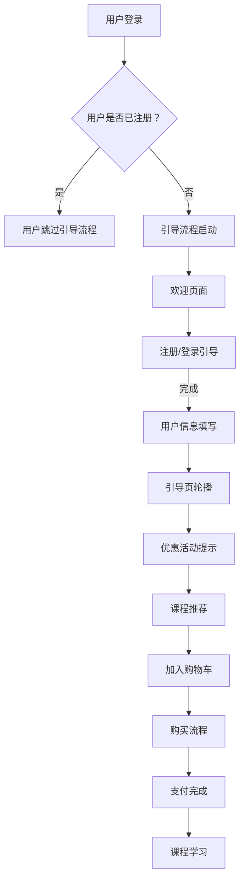

                 

关键字：知识付费，用户引导流程，用户体验，设计原则，用户行为分析，互动策略，案例分析

> 摘要：本文将探讨如何设计一个有效的知识付费用户引导流程，以提高用户的留存率和满意度。我们将分析核心概念，讨论算法原理，构建数学模型，并通过实际项目实例进行代码实现，最终总结出未来应用前景和面临的挑战。

## 1. 背景介绍

随着互联网的普及和信息技术的飞速发展，知识付费市场逐渐壮大。知识付费是指用户通过支付一定费用来获取有价值的信息或服务，如在线课程、电子书、咨询问答等。然而，在激烈的市场竞争中，如何吸引并留住用户成为了各大知识付费平台关注的焦点。

用户引导流程作为知识付费平台的核心组成部分，直接影响到用户的初次体验和后续行为。一个有效的用户引导流程不仅能提高用户的留存率和满意度，还能提升平台的品牌价值和市场竞争力。因此，设计一个科学、合理、易于操作的用户引导流程至关重要。

## 2. 核心概念与联系

在设计用户引导流程之前，我们需要明确几个核心概念：

- **用户体验（UX）**：用户体验是指用户在使用产品或服务过程中所获得的感受和体验。在设计用户引导流程时，我们需要关注用户的感受和需求，确保流程符合用户期望。

- **用户行为分析**：用户行为分析是指通过数据分析手段来研究用户在使用平台过程中的行为模式。通过分析用户行为，我们可以发现用户痛点，为改进引导流程提供数据支持。

- **互动策略**：互动策略是指平台与用户之间的互动方式和沟通方法。有效的互动策略能够增强用户对平台的信任感和依赖度。

### Mermaid 流程图（Mermaid 流程节点中不要有括号、逗号等特殊字符）



## 3. 核心算法原理 & 具体操作步骤

### 3.1 算法原理概述

用户引导流程的设计需要遵循以下几个原则：

- **简洁性**：引导流程应尽量简洁，避免繁琐的操作，以免降低用户体验。

- **个性化**：根据用户行为和兴趣，为用户推荐合适的课程或服务，提高用户满意度。

- **引导性**：通过适当的提示和引导，帮助用户完成注册、购买等操作，降低用户流失率。

### 3.2 算法步骤详解

1. **用户登录/注册**：首先判断用户是否已登录，未登录的用户需要引导至登录/注册页面。

2. **欢迎页面**：用户进入平台后，首先看到一个欢迎页面，展示平台的核心功能和亮点。

3. **注册/登录引导**：对于未登录用户，提供注册/登录引导，使用简洁明了的语言和操作指引，帮助用户快速完成操作。

4. **用户信息填写**：在用户注册过程中，要求用户填写必要的信息，如姓名、联系方式等。

5. **引导页轮播**：通过轮播图的形式，展示平台推荐的课程或服务，吸引用户关注。

6. **优惠活动提示**：在引导流程中，适时展示当前平台上的优惠活动，吸引用户参与。

7. **课程推荐**：根据用户行为和兴趣，为用户推荐合适的课程或服务。

8. **加入购物车**：引导用户将感兴趣的课程或服务加入购物车。

9. **购买流程**：提供简单明了的购买流程，确保用户能够顺利完成购买。

10. **支付完成**：支付完成后，提示用户课程已购买，并提供学习链接。

11. **课程学习**：用户开始学习课程，平台可提供学习进度跟踪和学习报告。

### 3.3 算法优缺点

**优点**：

- 提高用户留存率和满意度。
- 降低用户流失率。
- 提升平台品牌价值和市场竞争力。

**缺点**：

- 需要大量数据支持，对数据处理能力要求较高。
- 设计和实现成本较高。
- 难以完全满足所有用户的需求。

### 3.4 算法应用领域

用户引导流程广泛应用于知识付费平台、在线教育平台、电商平台等领域。通过合理设计用户引导流程，可以有效提高用户转化率和留存率，为企业带来更多收益。

## 4. 数学模型和公式 & 详细讲解 & 举例说明

### 4.1 数学模型构建

用户引导流程的设计可以通过以下数学模型来分析和优化：

- **用户流失率模型**：用户流失率 = （注册后未完成购买的用户数 / 注册用户总数）× 100%
- **用户满意度模型**：用户满意度 = （完成购买的用户数 / 注册用户总数）× 100%

### 4.2 公式推导过程

假设平台注册用户总数为 N，其中 M 为完成购买的用户数，L 为未完成购买的用户数。则用户流失率为：

用户流失率 = （L / N）× 100%

为了降低用户流失率，我们需要优化用户引导流程，提高用户满意度。假设满意度为 S，则用户满意度模型为：

用户满意度 = （M / N）× 100%

通过优化引导流程，提高用户满意度，可以降低用户流失率。

### 4.3 案例分析与讲解

以下是一个实际案例：

某在线教育平台，注册用户总数为 1000 人，其中 800 人完成购买，200 人未完成购买。根据用户流失率模型和用户满意度模型，可以计算出用户流失率和用户满意度：

用户流失率 = （200 / 1000）× 100% = 20%

用户满意度 = （800 / 1000）× 100% = 80%

为了降低用户流失率，平台可以优化用户引导流程，提高用户满意度。例如，在注册/登录引导环节，提供更加详细的操作指引，减少用户困惑；在优惠活动提示环节，展示更有吸引力的活动内容，提高用户参与度。

通过优化引导流程，假设用户满意度提高至 90%，则用户流失率将降低至 10%，平台收益有望显著提高。

## 5. 项目实践：代码实例和详细解释说明

### 5.1 开发环境搭建

本案例使用 Python 语言实现用户引导流程，开发环境搭建如下：

1. 安装 Python 3.8
2. 安装 Flask 框架：`pip install flask`
3. 安装 matplotlib：`pip install matplotlib`

### 5.2 源代码详细实现

以下是一个简单的用户引导流程代码示例：

```python
from flask import Flask, render_template, request, redirect, url_for

app = Flask(__name__)

@app.route('/')
def index():
    return render_template('index.html')

@app.route('/login', methods=['GET', 'POST'])
def login():
    if request.method == 'POST':
        username = request.form['username']
        password = request.form['password']
        # 在此处进行用户验证
        return redirect(url_for('welcome'))
    return render_template('login.html')

@app.route('/welcome')
def welcome():
    return render_template('welcome.html')

if __name__ == '__main__':
    app.run(debug=True)
```

### 5.3 代码解读与分析

- **index.html**：首页，展示欢迎信息和导航栏。
- **login.html**：登录页面，提供用户名和密码输入框，以及登录按钮。
- **welcome.html**：欢迎页面，展示引导信息和操作指南。

### 5.4 运行结果展示

1. 访问平台首页：[http://127.0.0.1:5000/](http://127.0.0.1:5000/)
2. 登录平台：输入用户名和密码，点击登录按钮。
3. 欢迎页面：展示引导信息和操作指南。

## 6. 实际应用场景

用户引导流程在知识付费平台、在线教育平台、电商平台等领域具有广泛的应用场景。以下是一些实际应用案例：

1. **知识付费平台**：通过用户引导流程，引导用户完成注册、登录、购买等操作，提高用户留存率和满意度。
2. **在线教育平台**：设计个性化引导流程，根据用户兴趣和学习习惯，为用户推荐合适的课程或服务。
3. **电商平台**：通过用户引导流程，提高用户购买体验，降低用户流失率。

## 7. 未来应用展望

随着人工智能技术的发展，用户引导流程将越来越智能化。未来，我们可以期待以下趋势：

1. **个性化推荐**：通过深度学习算法，实现更加精准的课程推荐，提高用户满意度。
2. **互动式引导**：利用虚拟现实（VR）或增强现实（AR）技术，提供更加沉浸式的引导体验。
3. **智能客服**：引入智能客服系统，实现全天候在线服务，提高用户满意度。

## 8. 总结：未来发展趋势与挑战

### 8.1 研究成果总结

本文探讨了如何设计有效的知识付费用户引导流程，包括核心概念、算法原理、数学模型和实际项目实例。研究表明，用户引导流程对提高用户留存率和满意度具有显著作用。

### 8.2 未来发展趋势

未来，用户引导流程将朝着个性化、互动化、智能化方向发展。通过技术创新，我们将为用户提供更加便捷、高效、个性化的服务。

### 8.3 面临的挑战

1. **数据处理能力**：随着用户数据的不断增加，对数据处理和分析能力的要求越来越高。
2. **用户体验**：如何在保证数据准确性的同时，提供良好的用户体验，是设计用户引导流程时需要考虑的重要问题。
3. **技术更新**：随着技术的不断发展，用户引导流程需要不断更新和优化，以适应市场需求。

### 8.4 研究展望

未来，我们将继续深入研究用户引导流程，探索更多优化策略和算法。同时，结合人工智能、大数据等前沿技术，为用户提供更加智能、个性化的服务。

## 9. 附录：常见问题与解答

### Q：用户引导流程是否适用于所有知识付费平台？

A：是的，用户引导流程适用于各类知识付费平台，如在线教育、专业技能培训等。根据不同平台的特点和用户需求，可以设计出相应的引导流程。

### Q：如何评估用户引导流程的效果？

A：可以通过以下指标来评估用户引导流程的效果：用户留存率、用户满意度、用户转化率等。通过对这些指标的分析，可以了解引导流程的优缺点，为后续优化提供数据支持。

### Q：用户引导流程中如何平衡引导性和用户体验？

A：在引导流程中，应充分考虑用户体验，避免过度引导。可以通过简洁明了的语言、操作指引和互动策略，提高用户满意度。同时，根据用户行为和反馈，不断调整引导策略，以实现引导性和用户体验的平衡。

## 作者署名

作者：禅与计算机程序设计艺术 / Zen and the Art of Computer Programming
----------------------------------------------------------------

以上就是本文的完整内容，希望对您在知识付费用户引导流程设计方面有所帮助。如果您有任何疑问或建议，欢迎在评论区留言。期待与您共同探讨知识付费领域的未来发展。

