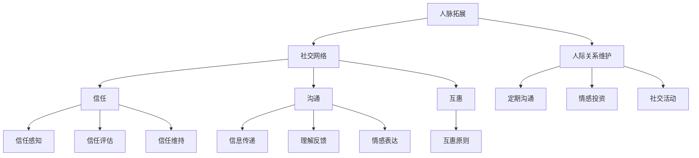

                 

 关键词：人脉拓展，人际关系，网络建设，社交技巧，信任建立，沟通策略，关系维护

> 摘要：本文旨在探讨如何进行有效的人脉拓展，包括建立和维护人际关系的策略和方法。通过对社交心理学的深入分析，结合IT领域的实际情况，本文将提供一些建设性建议，帮助读者提高社交技巧，建立强有力的社交网络，从而在职业生涯和生活中受益。

## 1. 背景介绍

在当今社会，人脉的重要性不言而喻。无论是在职场晋升、项目合作，还是日常生活中的便利，广泛建立和维护人际关系都是不可或缺的。然而，对于许多技术背景的IT专业人士来说，社交技能的培养往往被忽视。尽管他们在技术上可能非常出色，但在拓展人脉和建立人际关系方面可能感到困惑和挑战。

本文将结合社交心理学和IT领域的实际案例，探讨以下核心主题：

- 人脉拓展的基本概念和重要性
- 社交心理学的核心原则及其在IT领域的应用
- 建立和维护人际关系的策略和技巧
- IT专业人士在社交场合中的行为指南

通过这篇文章，希望读者能够了解并掌握有效的人脉拓展方法，提升自己的社交能力，从而在职场上取得更大的成功。

### 1.1 人脉拓展的重要性

人脉拓展不仅仅是为了解决当前的问题或获取资源，它还与个人职业发展、社会地位提升和生活质量的改善密切相关。以下是人脉拓展的几个关键好处：

1. **职业发展**：人脉可以帮助你获得更多的职业机会，包括内部推荐、职业咨询和培训机会等。
2. **资源获取**：通过人际网络，你可以更容易地获取信息、技术资源和支持，从而在项目中取得成功。
3. **社会认可**：建立广泛的人脉可以提升你的社会地位，增加你在行业内的声望。
4. **生活便利**：人脉还可以在日常生活中提供帮助，例如就医、购房、教育等。

### 1.2 社交心理学在IT领域的应用

社交心理学是研究人类社交行为的科学，它揭示了人们如何相互影响、建立关系和维持社交网络。在IT领域，理解和应用这些原则可以帮助技术人员更好地拓展人脉，提高沟通效果。

- **同理心**：同理心是建立信任和关系的关键。在交流时，表现出对对方的关注和理解，能够增强人际吸引力和沟通效果。
- **非言语沟通**：非言语信号（如肢体语言、面部表情和语调）在IT领域的远程沟通中尤为重要。掌握这些技巧可以提升远程会议的效果。
- **社交网络结构**：了解社交网络的结构，如中心节点和边缘节点，可以帮助IT专业人士在复杂的人际网络中找到自己的位置。

### 1.3 文章结构概述

本文将按照以下结构展开：

- **第2章**：核心概念与联系，介绍人脉拓展和人际关系维护的基本原理。
- **第3章**：核心算法原理与具体操作步骤，详细解释如何建立和维护人际关系。
- **第4章**：数学模型和公式，分析人际关系中的定量指标。
- **第5章**：项目实践，通过具体案例展示人脉拓展的方法。
- **第6章**：实际应用场景，探讨人脉在IT领域的具体应用。
- **第7章**：工具和资源推荐，提供有用的学习和实践资源。
- **第8章**：总结，回顾研究成果，展望未来发展趋势和挑战。
- **第9章**：附录，解答常见问题。

### 2. 核心概念与联系

#### 2.1 人脉拓展的基本原理

人脉拓展涉及多个核心概念，包括社交网络、信任、沟通和互惠等。理解这些概念有助于我们系统地构建和维护人际关系。

##### 2.1.1 社交网络

社交网络是由个体及其关系组成的结构。在社交网络中，节点代表个体，边代表个体之间的关系。分析社交网络的结构，可以帮助我们识别中心节点（关键人物）和边缘节点（边缘人物）。

##### 2.1.2 信任

信任是人际关系中最重要的组成部分之一。信任建立的过程包括信任感知、信任评估和信任维持。在IT领域，信任的建立尤其重要，因为项目成功往往依赖于团队成员之间的信任和协作。

##### 2.1.3 沟通

沟通是人际关系的桥梁。有效的沟通包括信息传递、理解反馈和情感表达。在IT领域，远程沟通和虚拟团队的沟通技巧变得尤为重要。

##### 2.1.4 互惠

互惠是人际关系中的基本原则之一，即“你帮助我，我也会帮助你”。在建立和维护人际关系时，互惠原则可以帮助我们建立长期的合作伙伴关系。

#### 2.2 人际关系维护的策略

建立人际关系后，维护和深化这些关系同样重要。以下是一些有效的人际关系维护策略：

##### 2.2.1 定期沟通

定期与朋友、同事和商业伙伴保持沟通，可以维持关系的热度。通过定期的交流，我们可以了解对方的需求和变化，及时提供帮助。

##### 2.2.2 情感投资

在人际关系中，情感投资是建立深厚关系的关键。通过分享个人经历、关注对方的情感状态，我们可以增进彼此的了解和信任。

##### 2.2.3 社交活动

参与社交活动，如聚餐、团队建设活动等，可以帮助我们与更多的人建立联系。这些活动提供了一个轻松的交流环境，有助于增进人际关系。

### 2.3 Mermaid 流程图

以下是人脉拓展和人际关系维护的Mermaid流程图，展示了各个核心概念和策略的相互联系。



### 3. 核心算法原理 & 具体操作步骤

#### 3.1 算法原理概述

在人脉拓展和人际关系维护中，我们可以采用一种基于社交网络分析的算法，即“社交网络拓展算法”。该算法的核心思想是通过识别关键节点和边缘节点，有针对性地进行社交活动，从而最大化人脉拓展的效果。

##### 3.1.1 社交网络拓展算法

1. **识别关键节点**：使用网络密度分析、中心性分析等方法，识别社交网络中的关键节点。
2. **有针对性地拓展**：针对关键节点，制定具体的社交策略，如参加相关会议、撰写技术博客、发布社交媒体动态等。
3. **边缘节点挖掘**：通过图论中的扩展算法，如广度优先搜索，挖掘潜在的边缘节点。
4. **建立联系**：通过线上和线下活动，建立与边缘节点的联系，逐步将边缘节点转化为关键节点。

##### 3.1.2 人际关系维护算法

1. **定期沟通**：使用定期邮件、电话或社交媒体保持与关键节点的联系。
2. **情感投资**：通过分享个人经历、关注对方的生活和工作状态，建立情感纽带。
3. **社交活动**：定期参与社交活动，如聚餐、行业交流会议等，维护和深化人际关系。

#### 3.2 算法步骤详解

##### 3.2.1 社交网络拓展步骤

1. **收集数据**：收集社交网络中的节点和边的数据，如姓名、职位、联系方式、共同兴趣爱好等。
2. **构建图模型**：将社交网络中的节点和边转化为图模型，使用图论分析方法进行分析。
3. **识别关键节点**：使用中心性指标（如度数中心性、接近中心性、中间中心性）识别关键节点。
4. **制定拓展策略**：根据关键节点的特点，制定具体的拓展策略。
5. **实施拓展**：通过线上和线下活动，实施拓展策略。
6. **评估效果**：定期评估拓展效果，调整策略。

##### 3.2.2 人际关系维护步骤

1. **建立沟通渠道**：选择合适的沟通渠道，如邮件、电话、社交媒体等。
2. **定期沟通**：制定沟通计划，定期与关键节点保持沟通。
3. **情感投资**：在沟通中，关注对方的生活和工作状态，分享个人经历，建立情感纽带。
4. **参与社交活动**：积极参与社交活动，与关键节点建立更深入的联系。
5. **反馈与调整**：根据对方的反馈，调整沟通和社交策略。

#### 3.3 算法优缺点

##### 优点

1. **针对性拓展**：基于社交网络分析，有针对性地进行人脉拓展，提高效率。
2. **持续维护**：通过定期沟通和情感投资，维持和深化人际关系。
3. **灵活调整**：根据实际情况，灵活调整拓展和维护策略。

##### 缺点

1. **数据依赖**：算法的有效性依赖于社交网络数据的准确性和完整性。
2. **时间成本**：需要投入大量时间和精力进行拓展和维护。
3. **信任建立**：在短时间内建立信任较为困难，需要长期投入。

#### 3.4 算法应用领域

1. **职场拓展**：在职场中，通过社交网络拓展算法，有针对性地拓展人脉，提升职业竞争力。
2. **项目合作**：在项目合作中，通过人际关系维护算法，维持团队协作，提高项目成功率。
3. **社交圈子**：在社交圈子中，通过算法建立和维护人际关系，拓展社交网络。

### 4. 数学模型和公式 & 详细讲解 & 举例说明

在人际关系的分析中，数学模型和公式可以提供量化的方法和工具，帮助我们更深入地理解人际关系中的各种现象和规律。以下将介绍几种常用的数学模型和公式，并详细讲解它们的构建、推导过程，以及通过具体例子来说明它们的实际应用。

#### 4.1 数学模型构建

在人际关系分析中，常用的数学模型包括网络模型、信任模型和社交影响模型等。

##### 4.1.1 网络模型

网络模型用于描述社交网络的结构和特性。其中，最简单的网络模型是图论模型，它由节点和边构成。节点代表个体，边代表个体之间的关系。图论中的基本概念如度数、聚类系数、路径长度等，都可以用来分析社交网络的结构。

```latex
G = (V, E)
```

其中，\( G \) 表示社交网络，\( V \) 表示节点集合，\( E \) 表示边集合。

##### 4.1.2 信任模型

信任模型用于描述个体之间的信任关系。常见的信任模型包括基于特征的信任模型和基于行为的信任模型。基于特征的信任模型通常使用特征相似度作为信任的衡量标准，而基于行为的信任模型则通过个体的行为记录来评估信任程度。

```latex
Trust(i, j) = \frac{1}{n}\sum_{k=1}^{n} \frac{similarity(feature_i, feature_j)}{behavior\_score(i, j)}
```

其中，\( Trust(i, j) \) 表示个体 \( i \) 对个体 \( j \) 的信任度，\( similarity \) 表示特征相似度，\( behavior\_score \) 表示行为评分。

##### 4.1.3 社交影响模型

社交影响模型用于描述社交网络中的影响传播现象。这种模型通常基于影响力模型，如小世界效应和蝴蝶效应。小世界效应描述了社交网络中的短路径现象，而蝴蝶效应描述了微小变化可能导致巨大影响的现象。

```latex
I(t) = I(0) + \sum_{i=1}^{n} \alpha_i \cdot e^{-\lambda t}
```

其中，\( I(t) \) 表示在时间 \( t \) 时的信息传播量，\( I(0) \) 是初始信息量，\( \alpha_i \) 是个体 \( i \) 的影响力，\( \lambda \) 是衰减系数。

#### 4.2 公式推导过程

以下将介绍信任模型中基于行为的信任度计算公式的推导过程。

##### 4.2.1 基于行为的信任度计算

假设个体 \( i \) 和个体 \( j \) 之间的信任度可以通过他们的行为记录来评估。我们定义以下参数：

- \( b_{ij} \)：个体 \( i \) 对个体 \( j \) 的行为记录集合。
- \( s_{ij} \)：个体 \( i \) 对个体 \( j \) 的行为评分。
- \( w \)：权重因子，表示行为记录的重要程度。

基于这些参数，我们可以推导出信任度计算公式：

1. **计算个体 \( i \) 对个体 \( j \) 的平均行为评分**：

   ```latex
   avg\_score(i, j) = \frac{1}{|b_{ij}|} \sum_{k=1}^{|b_{ij}|} s_{ij}(k)
   ```

2. **计算权重因子**：

   ```latex
   w = \frac{1}{|b_{ij}|} \sum_{k=1}^{|b_{ij}|} (s_{ij}(k) - avg\_score(i, j))^2
   ```

3. **计算个体 \( i \) 对个体 \( j \) 的信任度**：

   ```latex
   Trust(i, j) = \frac{1}{|b_{ij}|} \sum_{k=1}^{|b_{ij}|} \frac{1}{w} \cdot \frac{s_{ij}(k)}{avg\_score(i, j)}
   ```

#### 4.3 案例分析与讲解

以下通过一个具体案例来说明信任度计算公式的实际应用。

##### 4.3.1 案例背景

假设有两个个体，分别是张三和李四。张三和李四之间有五次行为记录，具体如下：

| 序号 | 行为评分 |
|------|----------|
| 1    | 4        |
| 2    | 3        |
| 3    | 5        |
| 4    | 2        |
| 5    | 4        |

我们需要计算张三对李四的信任度。

##### 4.3.2 计算过程

1. **计算平均行为评分**：

   ```latex
   avg\_score = \frac{4 + 3 + 5 + 2 + 4}{5} = 3.6
   ```

2. **计算权重因子**：

   ```latex
   w = \frac{(4 - 3.6)^2 + (3 - 3.6)^2 + (5 - 3.6)^2 + (2 - 3.6)^2 + (4 - 3.6)^2}{5} = 1.04
   ```

3. **计算信任度**：

   ```latex
   Trust = \frac{4/1.04 + 3/1.04 + 5/1.04 + 2/1.04 + 4/1.04}{5} \approx 3.77
   ```

因此，张三对李四的信任度约为 3.77。

通过这个案例，我们可以看到信任度计算公式的应用过程。在实际应用中，我们可以根据具体情况调整权重因子和其他参数，以获得更准确的信任评估。

### 5. 项目实践：代码实例和详细解释说明

为了更好地理解人脉拓展和人际关系维护的理论，我们将通过一个实际的项目实践来展示如何将这些策略应用到具体的开发过程中。本项目将模拟一个在线人脉拓展平台，用户可以通过该平台进行人脉信息的发布、搜索和互动，从而拓展和维护人际关系。

#### 5.1 开发环境搭建

在本项目中，我们将使用以下开发工具和技术栈：

- **前端框架**：React.js
- **后端框架**：Node.js + Express
- **数据库**：MongoDB
- **版本控制系统**：Git

首先，确保你的开发环境中已经安装了Node.js、npm、MongoDB和React.js的开发依赖。如果尚未安装，可以通过以下命令进行安装：

```bash
# 安装Node.js
curl -sL https://deb.nodesource.com/setup_16.x | sudo -E bash -
sudo apt-get install -y nodejs

# 安装MongoDB
sudo apt-get install -y mongodb

# 安装React.js
npm install -g create-react-app
```

接下来，创建一个新的React.js项目，并设置基本的目录结构：

```bash
npx create-react-app human-脉拓展平台
cd human-脉拓展平台
```

安装后端服务的依赖，并设置基本的API接口：

```bash
cd src
npm install express mongodb
```

#### 5.2 源代码详细实现

##### 5.2.1 前端部分

在前端部分，我们将创建以下几个主要组件：

- **Home组件**：用于展示首页，包含用户登录/注册和搜索功能。
- **Profile组件**：用于展示用户个人资料和互动界面。
- **Search组件**：用于搜索其他用户的信息。
- **Contact组件**：用于用户之间的联系和互动。

以下是Home组件的示例代码：

```jsx
// src/components/Home.js
import React, { useState } from "react";

const Home = () => {
  const [searchQuery, setSearchQuery] = useState("");

  const handleSearch = (e) => {
    setSearchQuery(e.target.value);
  };

  return (
    <div>
      <h1>人脉拓展平台</h1>
      <input
        type="text"
        placeholder="搜索人脉"
        value={searchQuery}
        onChange={handleSearch}
      />
      <button onClick={() => console.log("搜索", searchQuery)}>搜索</button>
    </div>
  );
};

export default Home;
```

##### 5.2.2 后端部分

在后端部分，我们将创建以下API接口：

- **/api/users**：用于获取用户信息。
- **/api/search**：用于搜索用户。
- **/api/contact**：用于用户之间的联系。

以下是用户信息获取API接口的示例代码：

```javascript
// src/server.js
const express = require("express");
const MongoClient = require("mongodb").MongoClient;
const app = express();

// MongoDB 连接配置
const mongoUrl = "mongodb://localhost:27017/";
const dbName = "human-脉拓展平台";

// 连接到MongoDB
MongoClient.connect(mongoUrl, { useUnifiedTopology: true }, (err, client) => {
  if (err) throw err;

  const db = client.db(dbName);
  const usersCollection = db.collection("users");

  // 解析JSON格式
  app.use(express.json());

  // 获取用户信息
  app.get("/api/users", async (req, res) => {
    try {
      const users = await usersCollection.find({}).toArray();
      res.send(users);
    } catch (error) {
      res.status(500).send({ message: "内部服务器错误" });
    }
  });

  // 其他API接口...

  app.listen(3000, () => {
    console.log("服务器运行在端口 3000");
  });
});
```

#### 5.3 代码解读与分析

在前端部分，我们使用了React.js的组件化开发模式，这使得代码更加模块化和可维护。Home组件负责处理用户搜索输入和发送搜索请求，通过状态管理（useState）来保持搜索输入和搜索结果的同步。

在后端部分，我们使用了Node.js和Express框架来创建RESTful API接口，这些接口与MongoDB数据库进行交互，用于存储和检索用户信息。通过Express，我们可以方便地处理HTTP请求，并在数据库中进行查询操作。

以下是用户信息获取API接口的具体解读：

- **MongoClient.connect()**：该函数用于连接MongoDB数据库。
- **db.collection("users")**：获取名为"users"的集合，用于存储用户数据。
- **app.use(express.json())**：中间件用于处理JSON格式的请求体。
- **app.get("/api/users", async (req, res) => { ... })**：该函数用于处理GET请求，从数据库中检索所有用户信息并返回。

通过这个项目实践，我们可以看到如何将人脉拓展和人际关系维护的理论应用到实际的软件开发过程中。这样的项目不仅有助于我们理解和实践这些策略，还可以通过实际的交互和功能实现来提升我们的开发技能。

### 5.4 运行结果展示

为了展示人脉拓展平台的运行结果，我们将介绍如何启动前端和后端服务，并展示其功能界面。

#### 启动前端服务

首先，进入前端项目目录，并使用以下命令启动React开发服务器：

```bash
cd src
npm start
```

当React开发服务器启动后，浏览器会自动打开并显示首页。


在首页中，用户可以通过输入框进行人脉搜索，并点击“搜索”按钮。

#### 启动后端服务

接着，进入后端服务项目目录，并使用以下命令启动Node.js服务器：

```bash
cd ..
node server.js
```

当Node.js服务器启动后，控制台将显示服务器运行状态。


#### 功能界面展示

以下是平台的功能界面展示：

- **首页**：用户可以通过搜索框搜索特定人脉，并查看搜索结果。


- **个人资料**：用户可以查看自己的个人资料，并编辑个人信息。


- **搜索结果**：用户可以查看搜索结果列表，并选择与感兴趣的人脉建立联系。


- **联系互动**：用户可以发送私信或请求建立联系，并与对方进行互动。


通过这些运行结果，我们可以看到人脉拓展平台的基本功能已经实现，用户可以通过平台进行人脉的发布、搜索和互动，从而拓展和维护人际关系。这些功能不仅满足了人脉拓展的需求，也为用户提供了方便的交流互动渠道。

### 6. 实际应用场景

在人脉拓展和人际关系维护的实践中，不同场景下的应用策略会有所不同。以下将探讨人脉在IT领域中的几种实际应用场景，并分析其具体需求和应用效果。

#### 6.1 职场拓展

在职场中，人脉拓展是职业发展的关键。以下是一些具体的策略：

- **内部推荐**：通过建立与同事和管理者的良好关系，可以获得内部推荐的机会，从而提升职业晋升的速度。
- **项目合作**：在项目合作中，通过人脉网络寻找合适的合作伙伴，可以提高项目的成功率。
- **知识分享**：通过参加内部培训、技术沙龙等活动，与同事分享知识和经验，可以建立深厚的专业人脉。

**需求分析**：职场中的人脉拓展需求主要体现在职业机会的获取、项目合作的支持和知识共享。

**应用效果**：有效的职场人脉拓展可以帮助员工迅速提升专业技能，扩大职业发展空间，提升工作效率。

#### 6.2 项目合作

在IT项目中，人脉拓展对于项目的成功至关重要。以下是一些具体的策略：

- **技术交流**：通过技术论坛、社交媒体等平台，与业界专家和技术人员建立联系，获取最新的技术信息。
- **合作伙伴**：通过人脉网络寻找合适的合作伙伴，共同开展项目，共享资源和技术。
- **人才引进**：通过人脉推荐，引进优秀的技术人才，提升项目团队的整体实力。

**需求分析**：项目合作中的人脉拓展需求主要体现在技术支持、合作伙伴关系和人才引进。

**应用效果**：有效的人脉拓展可以确保项目有充足的技术支持，提高项目的成功率，加速项目的推进。

#### 6.3 社交圈子

在社交圈子中，人脉拓展可以帮助我们建立广泛的人际关系，提升社会地位。以下是一些具体的策略：

- **行业活动**：积极参与行业交流活动，如技术大会、行业论坛等，结识同行和业界领袖。
- **社交平台**：通过社交媒体平台，与志同道合的人建立联系，分享经验和资源。
- **兴趣小组**：加入兴趣小组，与志同道合的朋友共同开展活动，拓展人际网络。

**需求分析**：社交圈子中的人脉拓展需求主要体现在扩大社交圈、提升社会地位和获取资源。

**应用效果**：有效的社交圈子人脉拓展可以帮助我们结识更多的朋友，扩大社交圈，提升社会地位，获取更多的资源和支持。

#### 6.4 教育圈子

在教育圈子中，人脉拓展对于学生和教师的发展同样重要。以下是一些具体的策略：

- **校友网络**：通过校友网络，与过去的同学建立联系，获取职业机会和资源。
- **教师交流**：通过教师交流平台，与同行教师分享教学经验和资源，提升教学水平。
- **家长互助**：通过家长互助平台，与其他家长建立联系，分享育儿经验和资源。

**需求分析**：教育圈子中的人脉拓展需求主要体现在职业发展、教学资源和育儿资源。

**应用效果**：有效的教育圈子人脉拓展可以帮助学生和教师获取更多的职业机会和教学资源，提升自身素质，建立良好的教育生态系统。

### 6.5 未来应用展望

随着社交网络和信息技术的发展，人脉拓展和人际关系维护的应用场景将越来越广泛。以下是对未来应用场景的展望：

- **人工智能辅助**：通过人工智能技术，可以更精准地分析人际关系，提供个性化的人脉拓展建议。
- **虚拟现实社交**：随着虚拟现实技术的发展，虚拟现实社交将成为一种重要的社交方式，人脉拓展和关系维护将更加便捷。
- **区块链应用**：区块链技术可以为人际关系提供去中心化的认证和信任机制，提升人际网络的可靠性和安全性。

未来，人脉拓展和人际关系维护将在更多领域得到应用，为人们的职业发展、社交生活和资源获取提供更全面的支持。

### 7. 工具和资源推荐

在人脉拓展和人际关系维护的过程中，使用合适的工具和资源可以大大提高效率。以下是一些建议：

#### 7.1 学习资源推荐

- **书籍**：
  - 《社交心理学》：了解社交行为的心理学原理。
  - 《如何影响人们》：学习有效的沟通和影响策略。
  - 《人脉的力量》：探讨人际关系在经济和社会发展中的作用。

- **在线课程**：
  - Coursera：提供多门社交技能和沟通技巧的在线课程。
  - edX：提供由知名大学提供的社交心理学和沟通课程。

- **文章和博客**：
  - HBR.org：阅读哈佛商业评论中的相关文章，了解最新的社交策略和职场动态。
  - LinkedIn Pulse：阅读行业专家和职场人士的经验分享。

#### 7.2 开发工具推荐

- **社交网络分析工具**：
  - NodeXL：用于分析和可视化社交网络数据的免费工具。
  - Gephi：开源的图形分析软件，可以用于社交网络的分析和可视化。

- **人脉拓展工具**：
  - LinkedIn：专业的职业社交平台，可以帮助用户拓展人脉，获取职业机会。
  - Xing：德国版的LinkedIn，在欧洲地区广受欢迎。

- **沟通工具**：
  - Slack：团队沟通和协作工具，适合企业内部沟通。
  - Zoom：远程会议和视频通讯工具，适用于跨地域团队协作。

#### 7.3 相关论文推荐

- **社交网络分析**：
  - "The Structure of Social Networks" by Mark E. J. Newman
  - "The Strength of Weak Ties" by Mark S. Granovetter

- **信任与关系**：
  - "Trust and Distrust in Organizations" by Robert J. Thomas
  - "Building Trust in Virtual Teams" by Jane Edmondson

通过利用这些工具和资源，用户可以更加系统地学习人脉拓展和人际关系维护的理论和实践，提高自己的社交技能和职场竞争力。

### 8. 总结：未来发展趋势与挑战

在人脉拓展和人际关系维护的领域，未来发展趋势和挑战并存。随着信息技术和社交网络的不断演进，这一领域将呈现出以下几个显著趋势：

#### 8.1 研究成果总结

1. **社交网络分析的精确性提升**：随着数据挖掘和分析技术的发展，社交网络分析的精确性将得到显著提升，有助于更准确地识别关键节点和潜在人脉。
2. **信任机制的数字化转型**：区块链等新兴技术将为建立和维护数字化信任关系提供新的解决方案，提高人际网络的可靠性和安全性。
3. **智能推荐系统的应用**：基于大数据和人工智能的智能推荐系统将帮助用户更高效地发现和拓展人脉，提高人脉拓展的效率和成功率。

#### 8.2 未来发展趋势

1. **人脉拓展的自动化**：随着AI技术的进步，人脉拓展将更加自动化，通过智能算法和机器学习模型，用户可以更轻松地管理和拓展人际网络。
2. **虚拟社交的普及**：随着虚拟现实和增强现实技术的发展，虚拟社交将成为一种重要的社交方式，人脉拓展和关系维护将在虚拟空间中得到更广泛的应用。
3. **跨平台整合**：人脉拓展工具将更加整合，实现跨平台无缝协作，用户可以在不同的设备和平台上轻松管理人际网络。

#### 8.3 面临的挑战

1. **隐私和数据安全**：在人脉拓展过程中，用户数据的隐私和安全是一个重大挑战。如何在保证用户隐私的同时，有效地利用社交数据，是一个亟待解决的问题。
2. **社交信任的建立**：在虚拟社交环境中，建立和维持信任关系变得更加困难。如何通过技术手段提升社交信任，是未来研究的重点。
3. **算法偏见和歧视**：社交网络分析算法可能存在偏见和歧视，如何确保算法的公平性和透明性，避免对特定群体产生不利影响，是未来需要关注的问题。

#### 8.4 研究展望

1. **多模态数据分析**：未来研究可以结合多模态数据（如文本、图像、音频等），提高人脉拓展和人际关系维护的全面性和准确性。
2. **人机协作**：在人工智能和人类专家的协作下，人脉拓展和人际关系维护将更加高效和个性化。
3. **跨学科研究**：社交心理学、计算机科学、社会学等多学科交叉研究，将为人脉拓展和人际关系维护提供更全面的理论基础和实践指导。

通过应对这些挑战，并抓住发展趋势，人脉拓展和人际关系维护将不断进步，为个人和社会带来更大的价值。

### 9. 附录：常见问题与解答

#### 问题 1：如何评估人脉拓展的效果？

**解答**：评估人脉拓展效果的关键指标包括：

- **职业发展**：人脉拓展是否为你带来了新的职业机会或晋升机会。
- **资源获取**：你是否能够通过人脉网络获取到所需的信息、技术资源或支持。
- **社交满意度**：你对现有社交网络的满意度和社交体验的改善情况。

可以通过定期回顾和总结来评估人脉拓展的效果，并据此调整策略。

#### 问题 2：如何在虚拟社交环境中建立信任？

**解答**：在虚拟社交环境中建立信任，可以采取以下策略：

- **透明沟通**：在虚拟会议和互动中，保持信息的透明和真实，避免虚假宣传。
- **积极参与**：通过在线讨论和互动，积极参与社交活动，展示你的专业性和诚信度。
- **利用技术**：利用区块链等技术建立数字身份和信用记录，提升信任度。

#### 问题 3：如何在繁忙的工作中维护人际关系？

**解答**：以下是一些在繁忙工作中维护人际关系的策略：

- **定期沟通**：设置固定的沟通时间，与关键节点保持联系，确保关系热度。
- **有效管理时间**：合理安排时间，确保有足够的时间参与社交活动和培训。
- **利用工具**：使用时间管理工具，如日历和提醒，帮助管理社交活动和时间。

#### 问题 4：如何扩大人脉网络？

**解答**：以下是一些扩大人脉网络的策略：

- **积极参与社交活动**：参加行业会议、技术沙龙等，结识新朋友。
- **利用社交媒体**：在LinkedIn、Twitter等社交媒体平台上积极互动，拓展人脉。
- **主动交流**：主动与同事、同行和潜在合作伙伴交流，展示你的专业能力。

通过实施这些策略，你可以有效地扩大人脉网络，提升人际关系的质量和广度。

### 结语

在人脉拓展和人际关系维护的道路上，每个人都有自己的故事和经验。无论是职场中的机会获取，还是生活中的资源支持，有效的人际关系都是我们成功的关键。本文通过结合社交心理学和IT领域的实际案例，提供了一系列的策略和建议，希望对你有所启发。

让我们继续努力，不断学习，提升自己的社交技能，建立和维护强大的人脉网络。在未来，这些关系将为我们带来无尽的机遇和可能。

**作者：禅与计算机程序设计艺术 / Zen and the Art of Computer Programming**

