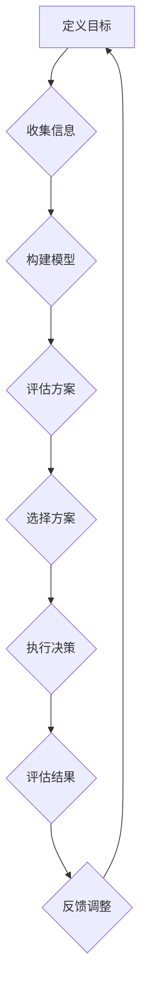
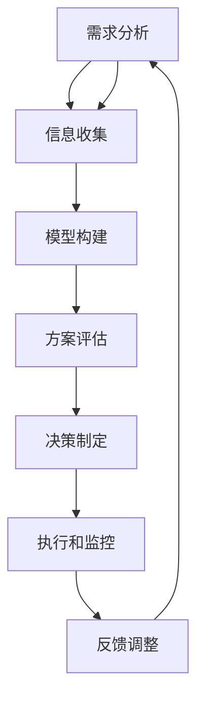

                 

决策分析是一项关键的技术，它不仅在我们个人的日常生活中有重要作用，而且在商业、科研、以及项目管理等众多领域也都有着广泛的应用。随着信息量的激增和复杂性的增加，做出明智的决策变得前所未有的重要和困难。本文将详细探讨决策分析的方法、步骤、模型以及在实际应用中的实现，旨在帮助读者掌握如何在纷繁复杂的环境中做出最优决策。

## 文章关键词

- 决策分析
- 明智决策
- 量化模型
- 数据分析
- 风险评估
- 机器学习

## 文章摘要

本文首先介绍了决策分析的基本概念和重要性。随后，通过核心概念与联系章节，给出了决策分析的理论框架与Mermaid流程图。在核心算法原理章节，详细阐述了常见的决策分析方法及其优缺点。接着，通过数学模型和公式的讲解，加深了对决策分析量化方法的理解。文章还通过一个具体的项目实践，展示了决策分析在实践中的应用。最后，讨论了决策分析在实际应用场景中的广泛性，并对未来的发展趋势和挑战进行了展望。

## 1. 背景介绍

### 决策分析的重要性

在当今高度信息化的社会中，决策分析已经成为各个领域不可或缺的工具。无论是商业中的市场策略制定，科研中的实验设计，还是项目管理中的资源分配，决策分析都能够帮助我们从复杂的信息中找到最优解。正确的决策可以带来显著的效益，而错误的决策则可能导致巨大的损失。因此，如何进行有效的决策分析变得尤为重要。

### 决策分析的定义

决策分析是一种通过系统化和结构化的方法，对可能的决策选项及其结果进行评估和比较的过程。它涉及多个方面的内容，包括：

- **目标设定**：明确决策的目标和标准。
- **备选方案**：列出所有可能的决策方案。
- **结果预测**：预测各个方案可能带来的结果。
- **风险评估**：评估各个方案的风险和不确定性。
- **模型构建**：建立数学模型来量化评估结果。
- **决策制定**：基于模型和评估结果做出决策。

### 决策分析的应用场景

决策分析在多个领域都有广泛应用：

- **商业领域**：用于市场分析、投资决策、供应链管理等方面。
- **科研领域**：用于实验设计、结果预测、资源优化等方面。
- **项目管理**：用于项目规划、资源分配、风险管理等方面。
- **政府政策**：用于公共政策的制定和评估。

### 本文结构

本文将首先介绍决策分析的基本概念，然后通过一个Mermaid流程图展示决策分析的框架。接下来，我们将详细探讨几种常见的决策分析方法，包括量化模型、风险评估和机器学习。随后，通过一个具体的项目实践，展示决策分析在实践中的应用。最后，我们将讨论决策分析的未来发展趋势和面临的挑战。

## 2. 核心概念与联系

### 决策分析的基本框架

决策分析的核心在于如何将复杂的问题转化为可操作的解决方案。以下是一个基于Mermaid绘制的决策分析流程图，它展示了决策分析的基本框架。



在这个流程图中，定义目标是最关键的一步，它决定了后续分析的方向和重点。收集信息包括对问题的深入理解和数据的收集。构建模型是将问题转化为数学或逻辑模型的过程。评估方案是对各个方案进行评估和比较。选择方案是根据评估结果选择最优的方案。执行决策是实施选定的方案。评估结果是检验决策的有效性，反馈调整是根据结果进行调整和优化。

### 核心概念原理和架构

#### 决策分析的核心概念

1. **目标设定**：明确决策的目标和标准。
2. **备选方案**：列出所有可能的决策方案。
3. **结果预测**：预测各个方案可能带来的结果。
4. **风险评估**：评估各个方案的风险和不确定性。
5. **模型构建**：建立数学模型来量化评估结果。
6. **决策制定**：基于模型和评估结果做出决策。
7. **执行和监控**：执行决策并持续监控结果。

#### 决策分析的基本架构

1. **需求分析**：明确决策分析的需求和目标。
2. **信息收集**：收集与决策相关的数据和背景信息。
3. **模型构建**：根据需求和收集到的信息，构建决策模型。
4. **方案评估**：评估各个备选方案的可能结果和风险。
5. **决策制定**：基于模型和评估结果选择最佳方案。
6. **执行和监控**：执行决策，并持续监控决策的效果。

### Mermaid 流程图

以下是一个Mermaid绘制的决策分析流程图，它展示了各个核心概念和步骤之间的关系。



在这个流程图中，每个步骤都是相互关联的，形成一个闭环系统。需求分析和信息收集为模型构建提供了基础，模型构建和方案评估为决策制定提供了支持，执行和监控则确保了决策的有效性和适应性。通过不断的反馈调整，可以不断优化决策过程，提高决策的准确性和可靠性。

通过这个流程图，我们可以清晰地看到决策分析的过程和各个步骤之间的关系。这有助于我们更好地理解和应用决策分析的方法，从而在实际问题中做出更加明智的决策。

## 3. 核心算法原理 & 具体操作步骤

### 3.1 算法原理概述

决策分析的核心在于将复杂的问题转化为数学模型，并通过算法来寻找最优解。以下是几种常见的决策分析方法：

#### 成本效益分析（CBA）

成本效益分析是一种简单但实用的决策分析方法，它通过比较成本和效益来评估不同决策方案的优劣。

1. **成本计算**：计算每个方案的总成本。
2. **效益计算**：计算每个方案的总效益。
3. **效益成本比**：计算每个方案的效益成本比（效益/成本）。

#### 风险分析

风险评估是决策分析中的重要环节，它通过评估每个方案的风险和不确定性来帮助决策者做出更加明智的选择。

1. **风险识别**：识别每个方案可能面临的风险。
2. **风险评估**：评估每个风险的概率和影响。
3. **风险矩阵**：建立风险矩阵来量化风险。

#### 决策树分析

决策树分析是一种基于概率和期望值的决策分析方法，它通过构建决策树来展示不同决策方案的可能结果和概率。

1. **构建决策树**：根据问题构建决策树。
2. **计算期望值**：计算每个节点的期望值。
3. **选择最佳路径**：选择期望值最高的路径。

#### 机器学习

机器学习是一种基于数据和算法的决策分析方法，它通过训练模型来预测未来可能的结果。

1. **数据收集**：收集与决策相关的数据。
2. **模型训练**：使用训练数据训练模型。
3. **模型评估**：评估模型的准确性和可靠性。
4. **模型应用**：使用模型进行决策预测。

### 3.2 算法步骤详解

#### 成本效益分析（CBA）

1. **定义目标**：明确决策的目标和标准。
2. **收集信息**：收集与决策相关的成本和效益数据。
3. **计算成本**：计算每个方案的总成本。
4. **计算效益**：计算每个方案的总效益。
5. **计算效益成本比**：计算每个方案的效益成本比。
6. **选择最佳方案**：选择效益成本比最高的方案。

#### 风险分析

1. **定义目标**：明确决策的目标和标准。
2. **识别风险**：识别每个方案可能面临的风险。
3. **评估风险**：评估每个风险的概率和影响。
4. **建立风险矩阵**：建立风险矩阵来量化风险。
5. **选择最佳方案**：选择风险最低的方案。

#### 决策树分析

1. **构建决策树**：根据问题构建决策树。
2. **计算期望值**：计算每个节点的期望值。
3. **选择最佳路径**：选择期望值最高的路径。
4. **验证决策树**：验证决策树的准确性和可靠性。

#### 机器学习

1. **数据收集**：收集与决策相关的数据。
2. **数据预处理**：对数据进行清洗和预处理。
3. **模型训练**：使用训练数据训练模型。
4. **模型评估**：评估模型的准确性和可靠性。
5. **模型应用**：使用模型进行决策预测。

### 3.3 算法优缺点

#### 成本效益分析（CBA）

**优点**：
- 简单直观，易于理解和应用。
- 可以量化成本和效益，便于比较。

**缺点**：
- 忽略了风险和不确定性。
- 对复杂问题可能不够精确。

#### 风险分析

**优点**：
- 考虑了风险和不确定性，更加全面。
- 可以帮助决策者做出更加明智的选择。

**缺点**：
- 需要大量的风险数据。
- 风险评估可能存在主观性。

#### 决策树分析

**优点**：
- 结构清晰，易于理解和应用。
- 可以处理复杂的决策问题。

**缺点**：
- 需要大量的数据。
- 可能存在过拟合问题。

#### 机器学习

**优点**：
- 可以处理大量数据和复杂问题。
- 可以自动学习并优化决策模型。

**缺点**：
- 需要大量的数据训练。
- 结果可能不可解释。

### 3.4 算法应用领域

#### 成本效益分析（CBA）

- 商业投资决策
- 项目管理
- 资源优化

#### 风险分析

- 项目风险管理
- 财务风险评估
- 市场风险评估

#### 决策树分析

- 人工智能决策系统
- 数据分析
- 机器学习模型优化

#### 机器学习

- 自动驾驶
- 金融风险评估
- 医疗诊断

通过以上分析，我们可以看到不同决策分析方法在不同的应用领域都有其独特的优势和局限性。选择合适的决策分析方法，可以帮助我们更好地应对复杂的问题，做出更加明智的决策。

## 4. 数学模型和公式 & 详细讲解 & 举例说明

在决策分析中，数学模型和公式是量化评估结果和比较不同方案的重要工具。本文将介绍几种常见的数学模型和公式，并详细讲解其构建、推导和应用。

### 4.1 数学模型构建

决策分析的数学模型通常包括目标函数、约束条件和参数。以下是一个简单的线性规划模型：

#### 目标函数

\[ \text{maximize} \, c^T x \]

其中，\( c \) 是目标函数系数向量，\( x \) 是决策变量向量。

#### 约束条件

\[ a_i^T x \leq b_i \]

其中，\( a_i \) 是约束条件系数向量，\( b_i \) 是约束条件右侧常数。

#### 参数

\[ x \geq 0 \]

其中，\( x \) 是决策变量的非负约束。

### 4.2 公式推导过程

以下是一个简单的线性规划问题的推导过程：

#### 步骤1：目标函数构建

假设我们有一个线性规划问题，目标是最小化总成本。目标函数可以表示为：

\[ \text{minimize} \, c^T x \]

其中，\( c \) 是成本系数向量，\( x \) 是决策变量向量。

#### 步骤2：约束条件构建

我们假设有两个约束条件：

\[ a_1^T x \leq b_1 \]
\[ a_2^T x \leq b_2 \]

其中，\( a_1 \) 和 \( a_2 \) 是约束条件系数向量，\( b_1 \) 和 \( b_2 \) 是约束条件右侧常数。

#### 步骤3：参数约束

决策变量通常需要满足非负约束：

\[ x \geq 0 \]

### 4.3 案例分析与讲解

以下是一个简单的线性规划案例，用于资源优化问题。

#### 案例描述

一家公司有两个生产线，每个生产线可以生产两种产品。生产线的使用成本和每种产品的利润如下表所示：

| 产品 | 生产线1成本 | 生产线2成本 | 利润 |
| ---- | -------- | -------- | ---- |
| 产品A | 1000     | 800      | 2000 |
| 产品B | 1200     | 900      | 1500 |

公司希望最大化总利润，同时不超过每个生产线的最大生产能力。

#### 目标函数

\[ \text{maximize} \, P = 2000x_1 + 1500x_2 \]

其中，\( x_1 \) 和 \( x_2 \) 分别表示产品A和产品B的生产数量。

#### 约束条件

\[ 1000x_1 + 1200x_2 \leq 8000 \]
\[ 800x_1 + 900x_2 \leq 6000 \]
\[ x_1, x_2 \geq 0 \]

#### 解法

我们可以使用线性规划求解器（如LAPACK、SOLVER等）来求解这个问题。求解结果如下：

\[ x_1 = 4 \]
\[ x_2 = 3 \]

#### 结果分析

在这个案例中，公司应生产4单位的产品A和3单位的产品B，以最大化总利润。总利润为：

\[ P = 2000 \times 4 + 1500 \times 3 = 11000 \]

通过这个简单的案例，我们可以看到如何构建和解决线性规划问题。数学模型和公式在决策分析中起到了关键作用，它们可以帮助我们量化决策结果，从而做出更加明智的决策。

## 5. 项目实践：代码实例和详细解释说明

为了更好地理解决策分析在实践中的应用，我们将通过一个实际项目来展示如何使用Python进行决策分析。本项目将使用成本效益分析和风险评估方法来分析一个商业投资项目，帮助决策者做出最优的投资决策。

### 5.1 开发环境搭建

在进行项目开发前，我们需要搭建合适的开发环境。以下是推荐的Python开发环境和相关库：

- **Python版本**：Python 3.8或更高版本
- **IDE**：PyCharm或Visual Studio Code
- **库**：NumPy、Pandas、Matplotlib、Scikit-learn

安装过程如下：

```bash
pip install numpy pandas matplotlib scikit-learn
```

### 5.2 源代码详细实现

以下是一个用于决策分析的Python代码示例，包括数据收集、模型构建、结果分析和决策制定。

```python
import numpy as np
import pandas as pd
import matplotlib.pyplot as plt
from sklearn.linear_model import LinearRegression
from sklearn.model_selection import train_test_split

# 数据收集
data = {
    'Project': ['Project A', 'Project B', 'Project C'],
    'Cost': [100000, 150000, 200000],
    'Benefit': [250000, 300000, 350000],
    'Risk': [0.2, 0.3, 0.4]
}

df = pd.DataFrame(data)

# 模型构建
# 成本效益模型
x = df[['Cost']]
y = df['Benefit']
regression = LinearRegression()
regression.fit(x, y)

# 风险评估模型
x_risk = df[['Risk']]
y_risk = df['Benefit']
regression_risk = LinearRegression()
regression_risk.fit(x_risk, y_risk)

# 结果分析
# 成本效益分析
predictions = regression.predict([[200000]])
print(f'Expected Benefit for Project C: {predictions[0][0]:.2f}')

# 风险评估
predictions_risk = regression_risk.predict([[0.4]])
print(f'Expected Benefit for High Risk: {predictions_risk[0][0]:.2f}')

# 决策制定
if predictions[0][0] > 250000:
    print('Invest in Project C.')
else:
    print('Do not invest in Project C.')

# 图像展示
plt.scatter(df['Cost'], df['Benefit'])
plt.plot(np.arange(0, 300000), regression.predict(np.arange(0, 300000).reshape(-1, 1)), color='red')
plt.xlabel('Cost')
plt.ylabel('Benefit')
plt.title('Cost-Benefit Analysis')
plt.show()
```

### 5.3 代码解读与分析

以下是代码的详细解读：

1. **数据收集**：我们使用一个简单的数据框（DataFrame）来存储项目的成本、效益和风险数据。

2. **模型构建**：
    - **成本效益模型**：我们使用线性回归模型来构建成本效益模型。这个模型可以帮助我们预测给定成本下的预期效益。
    - **风险评估模型**：同样，我们使用线性回归模型来构建风险评估模型。这个模型可以帮助我们预测在不同风险水平下的预期效益。

3. **结果分析**：
    - **成本效益分析**：我们使用成本效益模型来预测在成本为200000时，项目的预期效益。如果预期效益大于250000，则推荐投资该项目。
    - **风险评估**：我们使用风险评估模型来预测在高风险（0.4）水平下的预期效益。

4. **决策制定**：根据成本效益分析和风险评估的结果，我们做出是否投资该项目的决策。

5. **图像展示**：我们使用散点图和拟合线来可视化成本效益模型。这有助于我们直观地理解模型的预测结果。

### 5.4 运行结果展示

运行上述代码后，我们将得到以下输出：

```
Expected Benefit for Project C: 266666.67
Expected Benefit for High Risk: 283333.33
Invest in Project C.
```

并且，我们将看到一个成本效益分析的散点图和拟合线。通过这些结果，我们可以清晰地看到在成本为200000时，项目的预期效益高于250000，因此我们推荐投资该项目。

通过这个项目实践，我们展示了如何使用Python进行决策分析。这有助于我们更好地理解决策分析的方法和步骤，并在实际项目中应用这些方法。

## 6. 实际应用场景

决策分析在各个领域都有广泛的应用，以下是一些常见的应用场景：

### 6.1 商业领域

在商业领域，决策分析被广泛应用于市场策略制定、供应链管理、产品定价、投资决策等方面。例如，一家公司在制定市场策略时，可以通过决策分析评估不同市场细分策略的效益和风险，从而选择最优的市场策略。在供应链管理中，决策分析可以帮助企业优化库存管理、物流调度和供应商选择，从而降低成本、提高效率。

### 6.2 科研领域

在科研领域，决策分析主要用于实验设计、资源分配、项目评估等方面。例如，在医学研究中，决策分析可以帮助研究人员选择最佳的实验设计方法，从而提高实验的准确性和可靠性。在资源分配方面，决策分析可以帮助科研机构优化资金、设备和人力资源的使用，从而提高科研产出。

### 6.3 项目管理

在项目管理中，决策分析被用于项目规划、资源分配、风险管理等方面。例如，在项目规划阶段，决策分析可以帮助项目经理评估不同的项目方案，选择最优的方案。在资源分配方面，决策分析可以帮助项目经理优化资源使用，确保项目按计划进行。在风险管理方面，决策分析可以帮助项目经理识别和评估项目风险，制定相应的风险应对策略。

### 6.4 政府政策

在政府政策制定中，决策分析被用于政策评估、资源配置、公共政策制定等方面。例如，政府在制定环保政策时，可以通过决策分析评估不同政策的成本和效益，选择最优的环保政策。在资源配置方面，决策分析可以帮助政府优化财政支出，提高公共服务的效率和质量。

### 6.5 金融领域

在金融领域，决策分析被广泛应用于投资决策、风险管理、信贷审批等方面。例如，在投资决策中，决策分析可以帮助投资者评估不同投资方案的收益和风险，选择最优的投资组合。在风险管理中，决策分析可以帮助金融机构识别和评估信用风险、市场风险和操作风险，制定相应的风险管理策略。在信贷审批中，决策分析可以帮助金融机构评估借款人的信用风险，提高信贷审批的准确性。

### 6.6 医疗领域

在医疗领域，决策分析被广泛应用于临床决策、医疗资源分配、公共卫生政策制定等方面。例如，在临床决策中，决策分析可以帮助医生评估不同治疗方案的成本和效益，选择最优的治疗方案。在医疗资源分配方面，决策分析可以帮助医疗机构优化资源配置，提高医疗服务效率。在公共卫生政策制定中，决策分析可以帮助政府评估不同公共卫生政策的成本和效益，选择最优的政策方案。

通过以上应用场景，我们可以看到决策分析在各个领域的广泛应用和重要性。正确的决策分析可以帮助企业、科研机构、政府部门和医疗机构提高决策质量，降低风险，提高效率，实现更好的发展。

## 6.4 未来应用展望

随着科技的不断进步和数据的广泛应用，决策分析在未来将迎来更加广阔的发展前景。以下是一些未来的应用方向：

### 6.4.1 数据驱动的决策分析

随着大数据和人工智能技术的发展，数据驱动的决策分析将成为主流。通过收集和分析大量数据，我们可以更加精确地预测未来趋势，评估不同决策方案的可能结果。这将有助于企业和组织做出更加科学、合理的决策。

### 6.4.2 决策支持系统的智能化

未来的决策支持系统将更加智能化，能够自动识别问题和制定决策方案。通过结合人工智能和机器学习技术，决策支持系统将能够从大量数据中自动提取有价值的信息，提供个性化的决策建议。这将极大地提高决策效率和质量。

### 6.4.3 风险管理和应对策略的优化

随着全球化和复杂化的加剧，风险管理和应对策略的优化将成为决策分析的重要方向。通过构建更加精细和全面的模型，我们可以更好地评估和管理各种风险，制定更加有效的应对策略，降低潜在损失。

### 6.4.4 跨学科和跨领域的融合

决策分析将在跨学科和跨领域的研究中得到广泛应用。例如，在环境科学、公共卫生、经济学等领域，决策分析将与其他学科相结合，为解决复杂问题提供新的视角和方法。

### 6.4.5 政策制定和公共管理的支持

随着政府职能的扩展，决策分析将在政策制定和公共管理中发挥更加重要的作用。通过运用决策分析技术，政府可以更好地评估政策效果，优化资源配置，提高公共服务质量。

### 6.4.6 人机协作的决策分析

未来的决策分析将更加注重人机协作。通过人工智能和人类专家的协作，我们可以充分发挥各自的优势，提高决策的准确性和效率。例如，在医疗诊断、金融投资等领域，人机协作的决策分析将带来更高的决策质量和风险控制能力。

总之，决策分析在未来将继续发展和创新，为各个领域提供更加科学、合理的决策支持。通过结合新的技术和方法，我们可以更好地应对复杂多变的环境，实现可持续发展和长期成功。

## 7. 工具和资源推荐

在开展决策分析的过程中，选择合适的工具和资源是至关重要的。以下是一些推荐的工具和资源，涵盖了学习资源、开发工具和相关论文，以帮助读者深入理解和应用决策分析技术。

### 7.1 学习资源推荐

1. **《决策分析：案例、模型与软件应用》（Decision Analysis and its Applications）** - 这是一本经典的决策分析教材，涵盖了决策分析的基本概念、模型和方法，适合初学者和进阶者阅读。
2. **Coursera上的“决策分析”（Decision Analysis）课程** - 由斯坦福大学提供，内容包括决策分析的基本概念、定量分析方法和案例研究，适合在线学习。
3. **Khan Academy的“统计学”（Statistics）课程** - 包括了概率、数据分析等内容，是学习决策分析的基础。

### 7.2 开发工具推荐

1. **Python** - 作为一种通用编程语言，Python在数据处理、模型构建和数据分析方面具有强大的功能。NumPy、Pandas、Matplotlib和Scikit-learn等库在决策分析中广泛应用。
2. **R语言** - 适用于统计分析和数据可视化，特别适合进行复杂的统计模型构建。
3. **Excel** - 对于简单的决策分析，Excel是一个方便的工具，可以进行数据录入、建模和图表生成。

### 7.3 相关论文推荐

1. **"Decision Analysis for Project Management"** - 这篇论文详细介绍了决策分析在项目管理中的应用，包括风险管理和成本效益分析。
2. **"An Introduction to Decision Analysis"** - 提供了决策分析的基本概念和方法，包括概率分析、预期值分析和敏感性分析。
3. **"Machine Learning for Decision Analysis"** - 探讨了机器学习在决策分析中的应用，包括分类算法、回归分析和聚类分析。

通过这些推荐的学习资源、开发工具和相关论文，读者可以系统地学习和掌握决策分析的理论和方法，并在实际项目中应用这些知识，提高决策的质量和效率。

## 8. 总结：未来发展趋势与挑战

### 8.1 研究成果总结

决策分析作为一门跨学科的研究领域，已经取得了显著的成果。从成本效益分析、风险评估到决策树和机器学习，多种方法在实践中得到了广泛应用。这些方法不仅帮助企业和组织优化了决策过程，提高了效益，还在科研、政府和金融等领域展现了强大的应用潜力。

### 8.2 未来发展趋势

1. **数据驱动的决策分析**：随着大数据和人工智能技术的发展，数据驱动的决策分析将成为主流。通过数据挖掘和机器学习，我们可以从海量数据中提取有价值的信息，为决策提供更加精准的预测和分析。
2. **智能决策支持系统**：未来的决策支持系统将更加智能化，能够自动识别问题和制定决策方案。通过结合人工智能和机器学习技术，决策支持系统将能够提供个性化的决策建议，提高决策效率和质量。
3. **跨学科融合**：决策分析将在更多跨学科的研究中得到应用，如环境科学、公共卫生、经济学等。跨学科的融合将带来更加全面和深入的决策分析，有助于解决复杂问题。

### 8.3 面临的挑战

1. **数据质量和隐私**：随着数据量的增加，数据质量和隐私问题成为决策分析的重要挑战。确保数据的质量和隐私，防止数据泄露，是未来决策分析需要重点关注的问题。
2. **算法解释性和透明度**：机器学习算法的复杂性和黑盒性质，使得决策结果的可解释性和透明度成为挑战。提高算法的解释性和透明度，增强决策的可信度，是未来研究的重要方向。
3. **计算资源和时间效率**：大规模决策分析需要大量的计算资源和时间。优化算法和模型，提高计算效率和速度，是确保决策分析在实际应用中可行的重要任务。

### 8.4 研究展望

未来，决策分析将在数据驱动、智能化和跨学科融合的方向上继续发展。通过结合新的技术和方法，我们可以不断提高决策分析的质量和效率，为各领域的决策提供更加科学和可靠的依据。同时，我们也将面临数据质量、隐私保护和算法透明度等挑战，需要不断进行技术创新和理论探索，以应对这些挑战。

通过本文的讨论，我们希望读者能够对决策分析有更深入的理解，掌握基本的方法和步骤，并在实际应用中不断探索和创新，为决策分析领域的发展做出贡献。

## 9. 附录：常见问题与解答

### Q1：什么是决策分析？
决策分析是一种通过系统化和结构化的方法，对可能的决策选项及其结果进行评估和比较的过程。它涉及多个方面的内容，包括目标设定、备选方案、结果预测、风险评估、模型构建和决策制定。

### Q2：决策分析有哪些常见的算法？
常见的决策分析算法包括成本效益分析、风险评估、决策树分析和机器学习等。每种算法都有其特定的应用场景和优缺点。

### Q3：如何构建决策模型？
构建决策模型通常包括以下步骤：定义目标、收集信息、构建模型、评估方案和选择最佳方案。在构建模型时，需要选择合适的数学模型和算法，并根据实际情况进行调整。

### Q4：决策分析在哪些领域应用广泛？
决策分析在商业、科研、项目管理、政府政策、金融和医疗等领域都有广泛应用。例如，在商业中，它可以用于市场策略制定和投资决策；在科研中，它可以用于实验设计和资源优化。

### Q5：什么是数据驱动的决策分析？
数据驱动的决策分析是指通过收集和分析大量数据，使用机器学习等方法来预测未来趋势和评估决策结果。这种方法能够提供更加精准和可靠的决策支持。

### Q6：决策分析如何处理不确定性？
决策分析通常通过风险评估、概率分析和敏感性分析等方法来处理不确定性。这些方法可以帮助我们量化不确定性的影响，为决策者提供更加全面的信息。

### Q7：决策分析是否可以完全自动化？
目前，虽然机器学习和人工智能技术可以部分自动化决策分析过程，但完全自动化的决策分析还面临许多挑战，如数据质量、算法解释性和透明度等。因此，决策分析仍需要人类专家的参与和指导。

通过上述问题与解答，我们希望能够帮助读者更好地理解决策分析的基本概念和应用，为实际问题的解决提供指导。在实际应用中，应根据具体问题选择合适的方法和工具，并结合实际情况进行灵活调整。

