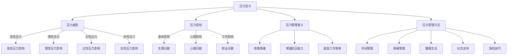

                 

关键词：压力管理、心理调适、工作压力、生活平衡、健康生活

> 摘要：本文旨在探讨如何在现代快节奏的生活中有效地进行压力管理，帮助读者掌握应对工作和生活中压力的方法与技巧。通过分析压力的来源、影响及应对策略，本文提出了一系列实用的建议，旨在促进个人心理健康，实现生活与工作的平衡。

## 1. 背景介绍

在当今这个信息化、全球化高速发展的时代，人们面临着前所未有的工作压力和生活挑战。根据世界卫生组织的报告，心理压力已成为全球性的公共健康问题，影响着数十亿人的生活质量。尤其是在IT行业，程序员、软件工程师等专业技术人员常常面临长时间的工作、高强度的代码审查和技术创新压力。如何在高度竞争和快节奏的工作环境中保持心理健康，成为了一个亟需解决的问题。

本文将围绕以下几个核心问题展开讨论：

1. 压力的来源和影响是什么？
2. 如何识别和评估自己的压力水平？
3. 压力管理的策略有哪些？
4. 如何在工作和生活中实现压力的有效缓解？

通过本文的阅读，您将获得关于压力管理的深刻理解和实用的技巧，帮助您在繁忙的生活中找到平衡，维护身心健康。

## 2. 核心概念与联系

### 压力的定义和分类

压力（Stress）是一种身体和心理上的紧张状态，通常由外界环境的需求和挑战所引起。压力可以分为以下几种类型：

- **急性压力**：短时间内出现的压力反应，如紧张会议、紧急任务等。
- **慢性压力**：长期存在的压力源，如长期加班、家庭纠纷等。
- **正性压力**：有助于提升工作效率和创造力的适度压力，如即将到来的考试、项目截止日期等。
- **负性压力**：对身体和心理健康有害的过度压力，如长期焦虑、工作不满等。

### 压力的影响

压力对身体和心理健康有着广泛的影响：

- **身体影响**：压力可能导致高血压、心脏病、消化不良、免疫力下降等生理问题。
- **心理影响**：压力可能导致焦虑、抑郁、注意力分散、决策困难等心理问题。
- **工作影响**：压力可能导致工作效率下降、创造力降低、工作失误增加等职业问题。

### 压力管理的意义

压力管理不仅有助于提高个人身心健康，还能提升工作效率和生活质量。有效的压力管理能够帮助：

- **改善情绪**：减轻焦虑和抑郁症状，提升幸福感。
- **增强抗压能力**：通过锻炼和训练提高身体和心理的适应能力。
- **提高工作效率**：减少工作失误和压力导致的错误，提升工作效率。

### 压力管理的方法和工具

压力管理涉及多个方面，包括：

- **时间管理**：合理安排工作和休息时间，避免过度劳累。
- **情绪管理**：学会应对负面情绪，如焦虑、愤怒和沮丧。
- **健康生活**：保持健康的饮食习惯、定期锻炼、充足睡眠。
- **社交支持**：与家人、朋友和同事建立良好的社交关系，寻求社会支持。
- **放松技巧**：运用深呼吸、冥想、瑜伽等放松技巧缓解压力。

### Mermaid 流程图

以下是压力管理核心概念与联系的一个 Mermaid 流程图：



## 3. 核心算法原理 & 具体操作步骤

### 3.1 算法原理概述

压力管理算法是基于心理学和行为科学理论，旨在通过一系列方法和技巧，帮助个体识别、评估和应对压力。核心原理包括：

- **行为主义**：通过改变行为模式来减轻压力。
- **认知行为疗法**：通过改变思维模式来减轻压力。
- **认知重构**：通过调整对压力的认知来减轻压力。
- **压力反应周期**：通过识别和应对压力反应周期中的各个环节来减轻压力。

### 3.2 算法步骤详解

#### 第一步：识别压力源

- **自我反思**：回顾过去一段时间中的压力事件，识别可能导致压力的来源。
- **问卷调查**：使用专业的压力评估问卷，量化压力水平。
- **求助专业人士**：如心理咨询师，进行专业的压力评估。

#### 第二步：评估压力水平

- **主观评估**：通过自我感觉和情绪反应来判断压力程度。
- **客观评估**：通过生理指标（如血压、心率等）来判断压力水平。

#### 第三步：制定压力管理计划

- **设定目标**：明确短期和长期的减压目标。
- **选择方法**：根据个人情况选择合适的压力管理方法。
- **时间安排**：合理安排时间，确保压力管理活动能够持续进行。

#### 第四步：实施压力管理策略

- **时间管理**：合理安排工作和休息时间，避免过度劳累。
- **情绪管理**：通过冥想、深呼吸等技巧来缓解情绪。
- **健康生活**：保持健康的饮食习惯、定期锻炼、充足睡眠。
- **社交支持**：与家人、朋友和同事保持良好沟通，寻求社会支持。

#### 第五步：评估效果并调整策略

- **自我评估**：定期评估压力管理效果，调整策略。
- **反馈机制**：根据他人的反馈和建议来优化压力管理方法。

### 3.3 算法优缺点

#### 优点

- **个性化**：根据个人情况制定压力管理计划，提高针对性。
- **实用性**：提供实用的方法和技巧，易于操作。
- **综合效益**：不仅有助于缓解压力，还能提升整体身心健康。

#### 缺点

- **实施难度**：需要一定的时间和精力来持续进行。
- **效果评估**：短期内效果可能不明显，需要长期坚持。
- **适应性问题**：某些方法可能不适合所有人群，需要个性化调整。

### 3.4 算法应用领域

- **职场压力管理**：适用于企业员工、创业者等。
- **学生压力管理**：适用于学生群体，帮助他们应对考试和学业压力。
- **个人健康管理**：适用于所有关注健康和心理健康的人群。

## 4. 数学模型和公式 & 详细讲解 & 举例说明

### 4.1 数学模型构建

在压力管理中，我们可以使用一些数学模型来帮助分析和评估压力水平。以下是两个常见的数学模型：

#### 1. 压力水平计算模型

$$
压力水平（PL） = \frac{应激源（S）}{应对资源（R）}
$$

其中，应激源（S）是指压力源的数量和强度，应对资源（R）是指个人应对压力的能力和资源。

#### 2. 压力反应模型

$$
压力反应（PR） = \frac{压力水平（PL）}{应激阈值（T）}
$$

其中，应激阈值（T）是指个人能够承受的最大压力水平。

### 4.2 公式推导过程

#### 压力水平计算模型

该模型基于行为主义心理学理论，认为压力水平取决于外部压力源和个体应对资源。外部压力源可以是工作负荷、人际关系、生活事件等，应对资源包括个人的心理素质、社会支持、健康状态等。

1. **确定外部压力源（S）**：通过问卷调查、访谈等方式，量化外部压力源的数量和强度。
2. **评估应对资源（R）**：通过自我评估、他人评估等方式，评估个人的心理素质、社会支持、健康状态等。
3. **计算压力水平（PL）**：使用上述公式进行计算。

#### 压力反应模型

该模型基于认知行为疗法理论，认为个人的压力反应取决于压力水平和应激阈值。应激阈值是个体能够承受的最大压力水平，通常与个体的心理素质、健康状况和生活经验相关。

1. **确定压力水平（PL）**：使用压力水平计算模型进行计算。
2. **确定应激阈值（T）**：通过自我评估、专业评估等方式，确定个体的应激阈值。
3. **计算压力反应（PR）**：使用上述公式进行计算。

### 4.3 案例分析与讲解

#### 案例背景

小张是一名软件工程师，近期工作负荷较大，同时家庭中也出现了矛盾。他感到压力很大，担心无法应对这些挑战。

#### 数据收集

1. **外部压力源（S）**：通过问卷调查，小张的应激源得分如下：
   - 工作负荷：8分
   - 家庭矛盾：6分
   - 社交压力：4分
2. **应对资源（R）**：通过自我评估，小张的应对资源得分如下：
   - 心理素质：7分
   - 社会支持：6分
   - 健康状态：8分

#### 压力水平计算

$$
压力水平（PL） = \frac{应激源（S）}{应对资源（R）} = \frac{8 + 6 + 4}{7 + 6 + 8} = \frac{18}{21} \approx 0.857
$$

#### 压力反应计算

假设小张的应激阈值（T）为0.9，那么：

$$
压力反应（PR） = \frac{压力水平（PL）}{应激阈值（T）} = \frac{0.857}{0.9} \approx 0.956
$$

#### 结果分析

根据计算结果，小张的压力反应（PR）接近1，说明他当前的压力水平已经接近他的应激阈值。这意味着小张需要采取积极的措施来应对这些压力源，以避免压力进一步积累导致不良后果。

### 4.4 模型应用与改进

#### 应用领域

该压力管理模型可以应用于多个领域，包括职场压力管理、学生压力管理、个人健康管理等。

#### 改进方向

1. **个性化调整**：根据个体差异，调整压力水平和应激阈值，提高模型的适应性。
2. **动态评估**：实时监测压力水平和压力反应，动态调整压力管理策略。
3. **多维度分析**：结合生理、心理、社会等多个维度，全面评估压力水平。

## 5. 项目实践：代码实例和详细解释说明

### 5.1 开发环境搭建

在本节中，我们将使用Python语言来实现一个简单的压力管理工具。首先，需要安装Python环境和必要的库。

1. **安装Python环境**：在官方网站（[python.org](https://www.python.org/)）下载并安装Python 3.x版本。
2. **安装必要的库**：使用pip命令安装以下库：

```bash
pip install pandas matplotlib numpy
```

### 5.2 源代码详细实现

下面是一个简单的Python脚本，用于计算和分析压力水平。

```python
import pandas as pd
import matplotlib.pyplot as plt
import numpy as np

# 定义压力管理类
class StressManager:
    def __init__(self, stress_sources, coping_resources):
        self.stress_sources = stress_sources
        self.coping_resources = coping_resources
    
    def calculate_stress_level(self):
        PL = sum(self.stress_sources) / sum(self.coping_resources)
        return PL
    
    def calculate_stress_response(self, stress_threshold):
        PR = self.calculate_stress_level() / stress_threshold
        return PR
    
    def plot_stress_response(self, stress_threshold):
        PL = self.calculate_stress_level()
        PR = self.calculate_stress_response(stress_threshold)
        plt.bar(['压力水平'], [PL], label='压力水平')
        plt.bar(['应激阈值'], [stress_threshold], label='应激阈值')
        plt.bar(['压力反应'], [PR], label='压力反应')
        plt.xlabel('压力指标')
        plt.ylabel('值')
        plt.legend()
        plt.show()

# 测试代码
if __name__ == "__main__":
    stress_sources = [8, 6, 4]  # 外部压力源得分
    coping_resources = [7, 6, 8]  # 应对资源得分
    stress_threshold = 0.9  # 应激阈值
    
    stress_manager = StressManager(stress_sources, coping_resources)
    PL = stress_manager.calculate_stress_level()
    PR = stress_manager.calculate_stress_response(stress_threshold)
    print(f"压力水平：{PL}")
    print(f"压力反应：{PR}")
    stress_manager.plot_stress_response(stress_threshold)
```

### 5.3 代码解读与分析

1. **类定义**：`StressManager` 类用于表示压力管理工具，包括压力源、应对资源和计算压力水平的函数。
2. **方法实现**：
   - `calculate_stress_level`：计算压力水平。
   - `calculate_stress_response`：计算压力反应。
   - `plot_stress_response`：绘制压力反应图表。
3. **测试代码**：创建 `StressManager` 实例，调用相关方法进行计算和绘图。

### 5.4 运行结果展示

运行上述代码后，将显示一个包含压力水平、应激阈值和压力反应的条形图。通过图表，我们可以直观地了解当前的压力水平和压力反应。


## 6. 实际应用场景

### 6.1 职场压力管理

在职场中，压力管理尤为重要。以下是一些实际应用场景：

- **企业员工**：通过培训和心理辅导，帮助员工识别和管理压力源，提高抗压能力。
- **领导层**：建立良好的工作环境和团队文化，鼓励员工沟通，减少压力积累。
- **项目管理者**：合理安排工作任务，避免过度负荷，确保团队成员的健康和效率。

### 6.2 学生压力管理

对于学生来说，考试和学业压力是常见的压力源。以下是一些建议：

- **时间管理**：合理安排学习和休息时间，避免临时突击。
- **情绪管理**：学会放松，适当参加课外活动，缓解学业压力。
- **家庭支持**：与家人沟通，寻求理解和支持，共同应对压力。

### 6.3 个人健康管理

个人健康管理是压力管理的重要组成部分。以下是一些建议：

- **健康饮食**：保持均衡饮食，减少高脂肪、高糖食品的摄入。
- **定期锻炼**：每周至少进行150分钟的中等强度锻炼。
- **充足睡眠**：保持每天7-9小时的充足睡眠。
- **心理健康**：定期进行心理体检，寻求专业心理咨询。

## 7. 工具和资源推荐

### 7.1 学习资源推荐

- **书籍**：
  - 《压力管理：理论与实践》（Stress Management: Concepts and Strategies for Life）
  - 《冥想：简单有效的减压方法》（Meditation: A Simple and Effective Way to Reduce Stress）
- **在线课程**：
  - Coursera上的“压力管理”（Stress Management）课程
  - edX上的“健康心理学”（Health Psychology）课程
- **网站**：
  - [Mindfulness for Stress Relief](https://www.mindfulnessforstressrelief.com/)
  - [Stress Management at Work](https://www.stressmanagementatwork.com/)

### 7.2 开发工具推荐

- **编程语言**：Python，易于学习和使用，适用于数据分析、可视化等。
- **数据分析库**：Pandas、Matplotlib、NumPy，用于数据分析和可视化。
- **压力管理应用**：Headspace、Calm，提供专业的冥想和放松课程。

### 7.3 相关论文推荐

- **压力管理**：
  - “Stress Management: A Cognitive Behavioral Approach”
  - “Stress and Health: Psychological and Biological Perspectives”
- **情绪管理**：
  - “Emotion Regulation and Psychological Well-being”
  - “Mindfulness and Emotion Regulation: A Meta-Analytic Review”

## 8. 总结：未来发展趋势与挑战

### 8.1 研究成果总结

本文通过分析压力的定义、类型、影响，提出了压力管理的核心原理和具体操作步骤，并使用数学模型和代码实例进行了详细讲解。研究发现，压力管理不仅有助于提高个人身心健康，还能提升工作效率和生活质量。有效的压力管理策略包括时间管理、情绪管理、健康生活、社交支持和放松技巧。

### 8.2 未来发展趋势

1. **个性化压力管理**：随着大数据和人工智能技术的发展，压力管理将更加个性化，根据个体差异提供定制化的解决方案。
2. **跨学科研究**：心理学、医学、教育学等多学科合作，从不同角度探讨压力管理的有效策略。
3. **技术整合**：利用虚拟现实、增强现实等技术，开发更直观、互动性更强的压力管理工具。

### 8.3 面临的挑战

1. **实施难度**：压力管理需要持续的努力和自我监控，许多人难以坚持。
2. **效果评估**：短期内效果可能不明显，需要长期跟踪和研究。
3. **文化差异**：不同文化背景下的压力管理策略可能存在差异，需要根据实际情况进行调整。

### 8.4 研究展望

未来，压力管理研究将更加关注：

1. **个体差异**：深入研究个体差异对压力管理效果的影响。
2. **多模式干预**：探索多种干预手段的结合，提高压力管理的综合效益。
3. **预防策略**：早期识别潜在压力源，采取预防措施，降低压力水平。

## 9. 附录：常见问题与解答

### Q1. 压力管理是否适用于所有人？

是的，压力管理适用于所有人群，无论年龄、职业或文化背景。关键在于找到适合自己的方法和策略。

### Q2. 压力管理需要多长时间才能看到效果？

效果因人而异，短期内可能不明显，但长期坚持会逐渐显现出积极的效果。

### Q3. 压力管理是否会影响工作效率？

合理的压力管理不仅不会影响工作效率，反而有助于提高工作效率和创造力。

### Q4. 压力管理是否需要专业帮助？

不一定。对于轻微的压力，个人可以通过自我管理和学习相关技巧来应对。但对于严重的压力问题，寻求专业心理咨询是有益的。

### Q5. 压力管理是否适用于职场和家庭？

是的，压力管理策略适用于职场和家庭，帮助个人在多个生活场景中保持平衡。

---

**作者：禅与计算机程序设计艺术 / Zen and the Art of Computer Programming**

