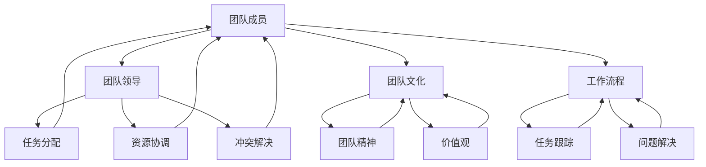

                 

 关键词：团队合作，团队协作，团队沟通，团队效率，项目管理，协作工具，沟通技巧

> 摘要：本文旨在探讨如何在IT领域中构建高效的团队合作，包括团队沟通、协作工具选择、项目管理方法以及沟通技巧等方面。通过深入分析和实例说明，本文希望能够为读者提供实用的指导，以提升团队协作效率，实现项目目标。

## 1. 背景介绍

在信息技术飞速发展的今天，团队合作已成为IT行业成功的关键因素之一。无论是软件开发、系统集成还是数据分析，项目的复杂性不断增加，单一角色的能力已无法满足项目需求。因此，如何构建一个高效、协作的团队变得尤为重要。

团队成员之间的沟通与协作不仅是完成项目任务的基本要求，更是项目成功的关键。有效的团队合作能够促进知识共享，提高问题解决能力，缩短项目周期，降低成本，提升产品或服务的质量。然而，团队协作并非一蹴而就，它需要一系列科学的管理方法和实践技巧。

本文将围绕如何进行团队合作这一主题，从多个角度进行分析和探讨。首先，我们将介绍团队协作的基本原理和核心概念。然后，深入探讨团队沟通的有效方法，以及选择合适的协作工具。接着，我们将介绍项目管理的方法和技巧，以及在实际项目中如何运用这些方法。最后，我们将讨论团队合作中可能遇到的问题和挑战，并给出相应的解决方案。

## 2. 核心概念与联系

### 2.1. 团队协作的基本原理

团队协作的核心理念是“集体智慧大于个体智慧”。这意味着，通过团队协作，不同背景、不同技能的个体能够相互补充，共同完成比单个个体单独工作更加复杂和艰巨的任务。团队协作的基本原理可以概括为以下几点：

- **共同目标**：团队需要明确共同的目标，这是团队协作的出发点和归宿。只有明确了目标，团队成员才能形成合力，朝着同一方向努力。
- **角色分工**：每个团队成员都应该明确自己的角色和职责，避免工作重叠和冲突。角色分工不仅提高了工作效率，还有助于发挥每个成员的专业优势。
- **有效沟通**：沟通是团队协作的纽带。有效的沟通能够确保信息准确传递，避免误解和冲突，提高团队凝聚力。
- **相互信任**：团队成员之间的信任是协作成功的基础。信任能够增强团队稳定性，降低内耗，提高协作效率。

### 2.2. 团队协作的核心概念

团队协作涉及到多个核心概念，以下是一些重要的概念：

- **团队成员**：团队成员是团队协作的主体，他们可以是开发者、测试员、项目经理、产品经理等，每个成员在团队中扮演不同的角色。
- **团队领导**：团队领导是团队的核心人物，负责制定策略、分配任务、协调资源和解决冲突。
- **团队文化**：团队文化是团队精神和价值观的体现，它影响着团队成员的行为和协作方式。
- **工作流程**：工作流程是团队协作的基本规则，它规定了任务分配、进展跟踪、问题解决等各个环节的运作方式。

### 2.3. 团队协作架构的 Mermaid 流程图

以下是一个简化的团队协作架构的 Mermaid 流程图，展示了团队协作的核心概念和相互联系：



这个流程图展示了团队成员、团队领导、团队文化和工作流程等核心概念之间的相互作用。团队成员通过团队文化和工作流程与团队领导保持紧密联系，共同完成项目任务。

### 2.4. 团队协作的挑战

尽管团队协作具有显著的优势，但实践中仍面临诸多挑战。以下是一些常见的挑战：

- **沟通障碍**：团队成员可能来自不同的文化背景，使用不同的沟通工具和语言，这可能导致沟通不畅。
- **角色冲突**：团队成员可能因为角色重叠或职责不清而产生冲突。
- **资源分配不均**：资源分配不均可能导致某些成员工作量过大，而另一些成员则无所事事。
- **目标不一致**：团队成员可能对项目目标的理解不一致，导致协作效率降低。

要克服这些挑战，需要从团队建设、沟通机制、角色定位和资源管理等多个方面进行综合考虑。

## 3. 核心算法原理 & 具体操作步骤

### 3.1. 算法原理概述

团队协作的核心算法可以理解为一种基于共识和协调的分布式计算方法。其基本原理是通过一系列算法步骤，确保团队成员能够在不同的环境中协同工作，实现共同的目标。以下是一个简化的团队协作算法原理概述：

- **共识算法**：用于确保团队成员对项目目标和任务的统一认识，避免因误解或信息不对称导致的协作障碍。
- **协调算法**：用于分配任务和资源，确保每个团队成员都有明确的工作职责，避免工作重叠和资源浪费。
- **反馈算法**：用于收集团队成员的工作进展和反馈，及时调整策略和计划，确保项目按预期进行。

### 3.2. 算法步骤详解

#### 3.2.1. 共识算法

共识算法是团队协作的基础。以下是共识算法的基本步骤：

1. **初始化**：团队成员在项目开始时，共同讨论并明确项目的目标和任务。
2. **信息交换**：团队成员通过定期的会议或在线交流，共享各自的工作进展和遇到的问题。
3. **达成共识**：通过讨论和协商，团队成员就项目的关键决策和任务分配达成一致。

#### 3.2.2. 协调算法

协调算法用于任务和资源的分配，以下是协调算法的基本步骤：

1. **角色分配**：根据团队成员的技能和经验，为每个成员分配明确的角色和职责。
2. **任务分配**：将项目任务分解为子任务，并分配给相应的团队成员。
3. **资源协调**：确保每个团队成员都拥有完成任务的必要资源，如工具、时间和预算。

#### 3.2.3. 反馈算法

反馈算法用于监控和调整团队协作过程，以下是反馈算法的基本步骤：

1. **进度汇报**：团队成员定期汇报工作进展，包括已完成的任务和遇到的问题。
2. **问题解决**：团队领导根据汇报的信息，协调团队成员解决遇到的问题，确保项目按计划进行。
3. **绩效评估**：定期对团队成员的工作绩效进行评估，为后续的改进提供依据。

### 3.3. 算法优缺点

#### 优点：

- **高效协作**：通过共识、协调和反馈，确保团队成员能够在同一方向上高效协作，提高项目成功率。
- **灵活性**：算法允许团队成员根据实际情况调整工作方式和任务分配，提高团队适应性。
- **透明度**：算法强调信息共享和透明度，有助于增强团队成员之间的信任和沟通。

#### 缺点：

- **复杂性**：算法实施和维护需要一定的技术和管理能力，可能增加团队的工作量。
- **冲突解决难度**：尽管算法提供了协调和反馈机制，但冲突仍然可能存在，且解决难度较大。

### 3.4. 算法应用领域

团队协作算法广泛应用于各种IT项目中，如软件开发、系统集成、数据分析等。以下是一些典型应用场景：

- **软件开发**：通过团队协作算法，确保开发团队在代码编写、测试和部署等各个环节高效协作。
- **系统集成**：在系统集成项目中，团队协作算法用于协调不同系统和模块的集成，确保项目顺利进行。
- **数据分析**：在数据分析项目中，团队协作算法用于协调数据采集、处理和分析，提高数据分析效率。

## 4. 数学模型和公式 & 详细讲解 & 举例说明

### 4.1. 数学模型构建

在团队协作中，构建数学模型有助于量化团队成员的工作量、协作效果和项目进展。以下是一个简化的团队协作数学模型：

#### 4.1.1. 工作量模型

假设团队中有 \( n \) 名成员，每个成员完成工作所需的时间为 \( t_i \)，则整个团队完成工作的时间 \( T \) 可用以下公式表示：

\[ T = \frac{\sum_{i=1}^{n} t_i}{n} \]

#### 4.1.2. 协作效果模型

协作效果可以用团队成员之间的沟通效率和任务完成度来衡量。设 \( C_i \) 为第 \( i \) 名成员的沟通效率，\( S_i \) 为第 \( i \) 名成员的任务完成度，则整个团队的协作效果 \( E \) 可用以下公式表示：

\[ E = \frac{\sum_{i=1}^{n} C_i \cdot S_i}{n} \]

#### 4.1.3. 项目进展模型

项目进展可以用任务完成度和项目时间来衡量。设 \( P_i \) 为第 \( i \) 名成员的任务完成度，\( T_p \) 为项目计划时间，则项目实际进展 \( P \) 可用以下公式表示：

\[ P = \frac{\sum_{i=1}^{n} P_i}{n} \cdot T_p \]

### 4.2. 公式推导过程

#### 4.2.1. 工作量模型推导

假设团队中有 \( n \) 名成员，每个成员完成工作所需的时间为 \( t_i \)，则整个团队完成工作的时间 \( T \) 为各成员完成时间之和。为了简化问题，我们假设各成员的工作量相同，即 \( t_i = t \)。

因此，整个团队完成工作的时间 \( T \) 为：

\[ T = n \cdot t \]

为了使整个团队在最短的时间内完成工作，我们希望每个成员的工作时间尽可能平均，即 \( t_i = \frac{T}{n} \)。

因此，整个团队完成工作的时间 \( T \) 可表示为：

\[ T = \frac{\sum_{i=1}^{n} t_i}{n} \]

#### 4.2.2. 协作效果模型推导

协作效果可以用团队成员之间的沟通效率和任务完成度来衡量。沟通效率 \( C_i \) 表示第 \( i \) 名成员与其他成员沟通的频率和质量，任务完成度 \( S_i \) 表示第 \( i \) 名成员完成任务的程度。

为了衡量整个团队的协作效果，我们需要综合考虑每个成员的沟通效率和任务完成度。因此，整个团队的协作效果 \( E \) 可表示为：

\[ E = \frac{\sum_{i=1}^{n} C_i \cdot S_i}{n} \]

#### 4.2.3. 项目进展模型推导

项目进展可以用任务完成度和项目时间来衡量。任务完成度 \( P_i \) 表示第 \( i \) 名成员的任务完成程度，项目计划时间 \( T_p \) 表示项目预定完成时间。

为了衡量整个项目的进展，我们需要综合考虑每个成员的任务完成度。因此，整个项目的实际进展 \( P \) 可表示为：

\[ P = \frac{\sum_{i=1}^{n} P_i}{n} \cdot T_p \]

### 4.3. 案例分析与讲解

以下是一个实际案例，用于说明如何使用上述数学模型分析团队协作效果和项目进展。

#### 案例背景

某IT公司开发一个在线教育平台，项目团队由5名成员组成，分别为项目经理、前端开发、后端开发、测试员和UI设计师。项目计划时间为6个月。

#### 数据收集

在项目进行过程中，团队成员定期汇报工作进展，并提供以下数据：

| 成员 | 沟通效率 \(C_i\) | 任务完成度 \(S_i\) |
| ---- | ---- | ---- |
| 项目经理 | 0.8 | 0.9 |
| 前端开发 | 0.7 | 0.85 |
| 后端开发 | 0.6 | 0.8 |
| 测试员 | 0.9 | 0.95 |
| UI设计师 | 0.5 | 0.9 |

#### 数据分析

1. **工作量模型分析**

根据工作量模型，团队完成工作的时间 \( T \) 可计算为：

\[ T = \frac{\sum_{i=1}^{5} t_i}{5} = \frac{0.8 \cdot 0.9 + 0.7 \cdot 0.85 + 0.6 \cdot 0.8 + 0.9 \cdot 0.95 + 0.5 \cdot 0.9}{5} \approx 0.828 \]

这意味着，团队平均完成每个任务的时间为0.828个月。

2. **协作效果模型分析**

根据协作效果模型，团队的协作效果 \( E \) 可计算为：

\[ E = \frac{\sum_{i=1}^{5} C_i \cdot S_i}{5} = \frac{0.8 \cdot 0.9 + 0.7 \cdot 0.85 + 0.6 \cdot 0.8 + 0.9 \cdot 0.95 + 0.5 \cdot 0.9}{5} \approx 0.873 \]

这意味着，团队的协作效果为0.873，说明团队成员之间的沟通效率和任务完成度较高。

3. **项目进展模型分析**

根据项目进展模型，项目的实际进展 \( P \) 可计算为：

\[ P = \frac{\sum_{i=1}^{5} P_i}{5} \cdot T_p = \frac{0.9 + 0.85 + 0.8 + 0.95 + 0.9}{5} \cdot 6 \approx 5.75 \]

这意味着，项目进展到第5个月时，已完成约5.75个月的工作量，项目进度较为理想。

#### 结论

通过上述数据分析，我们可以得出以下结论：

- 团队的工作量模型表明，团队平均完成每个任务的时间较短，工作负荷较为均衡。
- 协作效果模型表明，团队成员之间的沟通效率和任务完成度较高，团队协作效果较好。
- 项目进展模型表明，项目进度较为理想，项目有望按计划完成。

### 4.4. 数学模型在实际应用中的意义

通过数学模型，我们可以对团队协作效果和项目进展进行量化分析，从而：

- **及时发现和解决问题**：通过分析团队成员的工作量和协作效果，可以及时发现和解决团队协作中的问题。
- **优化资源分配**：根据团队协作效果和项目进展，可以优化资源分配，确保项目顺利推进。
- **改进团队管理**：通过分析团队协作数据，可以改进团队管理方法，提高团队协作效率。

## 5. 项目实践：代码实例和详细解释说明

### 5.1. 开发环境搭建

为了展示团队协作的代码实例，我们将使用Git作为版本控制工具，并在GitHub上创建一个项目仓库。以下是一个简单的步骤，用于搭建开发环境：

1. **安装Git**：在计算机上安装Git。可以访问[Git官网](https://git-scm.com/downloads)下载并安装。
2. **创建GitHub账户**：在[GitHub官网](https://github.com/)注册一个账户。
3. **创建项目仓库**：在GitHub上创建一个新的仓库，命名为“team Collaboration Project”。
4. **克隆仓库**：在本地计算机上打开命令行工具，使用以下命令克隆项目仓库：

   ```bash
   git clone https://github.com/your-github-username/team-Collaboration-Project.git
   ```

### 5.2. 源代码详细实现

以下是项目的一个简单示例，用于展示如何使用Git进行代码管理和协作。项目包括一个简单的计算器程序，用于演示多角色协作。

**前端部分（HTML/CSS/JavaScript）**

```html
<!-- calculator.html -->
<!DOCTYPE html>
<html lang="en">
<head>
  <meta charset="UTF-8">
  <meta name="viewport" content="width=device-width, initial-scale=1.0">
  <title>Simple Calculator</title>
  <link rel="stylesheet" href="styles.css">
</head>
<body>
  <h1>Simple Calculator</h1>
  <input type="text" id="result" disabled>
  <div id="buttons">
    <button class="number" value="1">1</button>
    <button class="number" value="2">2</button>
    <button class="number" value="3">3</button>
    <button class="operation" value="+">+</button>
    <!-- 更多按钮 -->
  </div>
  <script src="calculator.js"></script>
</body>
</html>
```

```css
/* styles.css */
body {
  font-family: Arial, sans-serif;
}

#result {
  width: 100%;
  padding: 10px;
  margin-bottom: 10px;
}

#buttons button {
  padding: 10px;
  margin: 5px;
}
```

```javascript
// calculator.js
document.addEventListener('DOMContentLoaded', function () {
  const result = document.getElementById('result');
  const buttons = document.querySelectorAll('#buttons button');

  buttons.forEach(button => {
    button.addEventListener('click', function () {
      if (this.classList.contains('number')) {
        result.value += this.value;
      } else if (this.classList.contains('operation')) {
        result.value += this.value;
      }
    });
  });
});
```

**后端部分（Python）**

```python
# server.py
from http.server import BaseHTTPRequestHandler, HTTPServer

class CalculatorHandler(BaseHTTPRequestHandler):
    def do_GET(self):
        if self.path == '/calculator.html':
            self.send_response(200)
            self.send_header('Content-type', 'text/html')
            self.end_headers()
            with open('calculator.html', 'r') as file:
                content = file.read()
            self.wfile.write(content.encode())
        else:
            self.send_response(404)
            self.end_headers()

def run(server_class=HTTPServer, handler_class=CalculatorHandler, port=8000):
    server_address = ('', port)
    httpd = server_class(server_address, handler_class)
    print(f'Starting server on port {port}...')
    httpd.serve_forever()

if __name__ == '__main__':
    run()
```

### 5.3. 代码解读与分析

上述代码示例展示了如何使用Git进行代码管理和协作。以下是对代码的详细解读：

1. **前端部分**：前端代码包括HTML、CSS和JavaScript。HTML文件定义了计算器的结构和样式，CSS文件用于美化界面，JavaScript文件实现了计算器的功能。这些文件放在GitHub仓库中，方便团队成员进行修改和协同工作。

2. **后端部分**：后端代码是一个简单的Python服务器，用于响应前端请求。服务器文件`server.py`定义了`CalculatorHandler`类，继承自`BaseHTTPRequestHandler`类。该类用于处理与计算器相关的HTTP请求。当用户访问`/calculator.html`时，服务器返回计算器的HTML文件。其他请求则返回404错误。

### 5.4. 运行结果展示

1. **本地开发环境**：在本地计算机上运行后端服务器，使用浏览器访问`http://localhost:8000/calculator.html`，即可看到计算器的界面。

2. **团队协作**：团队成员可以在GitHub上对代码进行修改和提交。例如，前端开发人员可以修改计算器的样式，后端开发人员可以增加新的功能。每次提交后，其他团队成员都可以查看并基于最新版本进行开发。

通过Git和GitHub，团队成员能够高效地协作，共同开发和维护计算器程序。这种方式不仅提高了开发效率，还保证了代码的一致性和可追溯性。

### 5.5. 代码实例的总结

通过上述代码实例，我们可以看到如何使用Git和GitHub进行团队协作：

- **版本控制**：Git提供了强大的版本控制功能，使团队成员可以轻松地管理和跟踪代码的变更。
- **代码共享**：GitHub作为Git的远程仓库，为团队成员提供了便捷的代码共享平台，促进了协作开发。
- **分工明确**：团队成员可以根据自己的角色和职责，专注于代码的不同部分，提高工作效率。
- **代码审查**：在提交代码前，团队成员可以进行代码审查，确保代码质量。

总之，通过合理利用Git和GitHub，团队可以高效地进行协作，共同实现项目目标。

## 6. 实际应用场景

团队合作在IT领域的实际应用场景非常广泛，涵盖了软件开发、系统集成、数据分析等多个方面。以下是一些典型的应用场景：

### 6.1. 软件开发

在软件开发过程中，团队合作至关重要。团队成员需要共同开发、测试、部署和维护软件。以下是一些具体的实际应用场景：

- **敏捷开发**：采用敏捷开发方法，团队成员按照迭代周期进行工作。每个迭代周期结束后，团队会进行评审和回顾，持续优化开发流程。
- **DevOps**：DevOps团队通过紧密协作，实现开发和运维的无缝衔接。开发团队编写代码，运维团队负责部署、监控和维护，两者共同确保软件质量和系统稳定性。
- **跨功能团队**：在大型项目中，可能需要跨功能团队的协作。例如，前端开发、后端开发、测试、UI设计等不同领域的成员共同参与，实现完整的软件产品。

### 6.2. 系统集成

系统集成项目通常涉及多个系统和模块的集成，团队合作是确保项目成功的关键。以下是一些具体的实际应用场景：

- **协调不同供应商**：系统集成项目可能需要与多个供应商合作。团队合作有助于协调各供应商的工作，确保项目按时交付。
- **项目规划和管理**：团队成员共同参与项目规划和管理，确保项目进度、质量和成本控制。
- **风险评估与应对**：团队合作有助于识别和应对项目中的风险，确保项目按计划进行。

### 6.3. 数据分析

数据分析项目通常涉及大量数据，团队合作可以提高数据分析的效率和准确性。以下是一些具体的实际应用场景：

- **数据清洗和预处理**：团队合作对数据进行清洗和预处理，确保数据的质量和一致性。
- **数据建模和分析**：团队成员共同参与数据建模和分析，探索数据背后的规律和趋势。
- **可视化展示**：团队合作制作数据可视化报告，向业务团队和管理层展示分析结果。

### 6.4. 未来应用展望

随着信息技术的发展，团队合作的应用场景将进一步扩大和深化。以下是一些未来应用展望：

- **人工智能和机器学习**：团队合作在人工智能和机器学习项目中将发挥重要作用。团队成员需要共同开发算法、训练模型和优化系统。
- **区块链技术**：团队合作在区块链技术项目中将有助于构建去中心化的应用和解决方案。
- **云计算和边缘计算**：团队合作在云计算和边缘计算项目中将有助于优化资源分配、提高系统性能和安全性。

总之，团队合作是IT领域不可或缺的一部分。通过有效的团队合作，团队可以克服各种挑战，实现项目目标，推动技术进步和业务发展。

## 7. 工具和资源推荐

为了提高团队协作效率，选择合适的工具和资源至关重要。以下是一些推荐的工具和资源：

### 7.1. 学习资源推荐

- **《敏捷开发实践指南》**：作者：杰夫·萨瑟兰（Jeff Sutherland）。介绍了敏捷开发的核心理念和实践方法，对团队协作有重要指导意义。
- **《Scrum精髓：实践指南》**：作者：杰夫·萨瑟兰（Jeff Sutherland）。详细介绍了Scrum方法论，帮助团队实现高效协作。
- **《团队协作：成功的艺术》**：作者：迈克尔·马奎特（Michael Marquet）。探讨团队协作中的沟通、领导力和激励机制。

### 7.2. 开发工具推荐

- **GitHub**：一个强大的版本控制工具，支持团队协作、代码审查和项目管理。
- **GitLab**：与GitHub类似，提供完整的版本控制、项目管理和服务。
- **JIRA**：一款功能强大的项目管理工具，支持任务跟踪、敏捷开发、敏捷看板等。
- **Trello**：一个简单易用的项目管理工具，适合团队协作和任务跟踪。

### 7.3. 相关论文推荐

- **"The Art of Scalable Team Collaboration in Agile Development"**：探讨了在敏捷开发中如何进行团队协作，实现高效沟通和协调。
- **"The Role of Leadership in Team Collaboration"**：分析了领导者在团队协作中的作用，以及如何激励团队成员实现共同目标。
- **"Communication and Trust in Distributed Teams"**：研究了分布式团队中的沟通和信任问题，以及如何克服远程协作的挑战。

通过以上工具和资源的学习和实践，团队可以进一步提高协作效率，实现项目目标。

## 8. 总结：未来发展趋势与挑战

### 8.1. 研究成果总结

通过对团队协作的深入探讨，我们总结了以下研究成果：

- **共识和协调算法**：通过共识算法和协调算法，团队成员能够在不同的环境中协同工作，实现共同的目标。
- **数学模型构建**：构建了工作量、协作效果和项目进展的数学模型，为团队协作提供了量化分析工具。
- **代码实例**：通过一个简单的计算器程序，展示了如何使用Git和GitHub进行团队协作，提高代码管理和共享效率。

### 8.2. 未来发展趋势

团队协作在未来的发展趋势将主要体现在以下几个方面：

- **智能化**：随着人工智能技术的发展，团队合作将更加智能化，自动化工具将帮助团队更高效地完成协作任务。
- **全球化**：全球化进程加速，跨国团队合作将成为常态，团队协作工具和平台将更加注重跨文化沟通和协作。
- **灵活性**：团队协作模式将更加灵活，支持远程办公和弹性工作制，适应不同团队和项目需求。

### 8.3. 面临的挑战

在团队协作过程中，仍然面临以下挑战：

- **沟通障碍**：团队成员可能来自不同的文化背景，使用不同的沟通工具和语言，导致沟通不畅。
- **资源分配不均**：资源分配不均可能导致某些成员工作量过大，而另一些成员则无所事事。
- **冲突解决**：团队成员之间的角色冲突和目标不一致可能导致协作效率降低。

### 8.4. 研究展望

为了克服上述挑战，未来研究可以从以下几个方面展开：

- **沟通机制优化**：研究更有效的沟通机制，提高团队成员之间的信息传递效率。
- **资源管理方法**：探索新的资源管理方法，确保资源分配的公平性和高效性。
- **冲突管理策略**：研究冲突管理策略，提高团队应对冲突的能力，减少内耗。

通过持续的研究和实践，团队协作将变得更加高效和有序，为项目成功和业务发展提供有力支持。

## 9. 附录：常见问题与解答

### 9.1. 问题1：团队协作中的沟通障碍如何解决？

**解答**：沟通障碍是团队协作中常见的问题，以下是一些解决方案：

- **明确沟通目标**：在每次沟通前，明确沟通的目标和议程，确保沟通有序进行。
- **使用多种沟通工具**：结合使用邮件、即时通讯工具、视频会议等，根据不同场景选择合适的沟通方式。
- **建立沟通规范**：制定沟通规范，包括沟通频率、反馈机制和会议流程等，提高沟通效率。
- **文化包容**：尊重团队成员的文化差异，通过文化培训等方式提高跨文化沟通能力。

### 9.2. 问题2：如何确保资源分配的公平性？

**解答**：以下是一些确保资源分配公平性的方法：

- **透明度**：确保资源分配过程透明，团队成员可以了解资源分配的依据和原则。
- **公平竞争**：建立公平的竞争机制，根据团队成员的能力和贡献进行资源分配。
- **反馈机制**：建立反馈机制，让团队成员可以提出资源分配的改进建议，确保分配过程的合理性。
- **定期评估**：定期对资源分配进行评估，根据项目进展和团队需求进行调整。

### 9.3. 问题3：如何处理团队协作中的冲突？

**解答**：以下是一些处理团队协作中冲突的方法：

- **及时沟通**：冲突发生时，及时沟通是解决问题的关键。团队成员应保持开放的态度，倾听对方的意见。
- **建立调解机制**：建立调解机制，由中立的第三方参与冲突解决，提高解决问题的效率。
- **寻求共识**：通过讨论和协商，寻求团队成员之间的共识，降低冲突的激烈程度。
- **培训与教育**：对团队成员进行冲突管理培训，提高其解决冲突的能力。

通过上述方法，团队可以更好地处理协作中的冲突，提高协作效率。

### 9.4. 问题4：如何确保项目目标的统一性？

**解答**：以下是一些确保项目目标统一性的方法：

- **明确目标**：在项目启动阶段，明确项目的目标，确保所有团队成员对目标有清晰的认识。
- **定期回顾**：定期回顾项目进展，确保项目目标仍然符合团队期望。
- **沟通与反馈**：鼓励团队成员表达对项目目标的看法，通过沟通和反馈，确保目标的一致性。
- **共识机制**：建立共识机制，通过讨论和协商，确保团队成员对项目目标的认同。

通过这些方法，团队可以确保项目目标的统一性，提高协作效率。

### 9.5. 问题5：如何提高团队协作效率？

**解答**：以下是一些提高团队协作效率的方法：

- **明确分工**：确保每个团队成员都有明确的工作职责，避免工作重叠和冲突。
- **优化流程**：优化团队的工作流程，确保任务流转顺畅，减少不必要的等待和重复工作。
- **沟通技巧**：提高团队成员的沟通技巧，确保信息准确传递，避免误解和冲突。
- **激励机制**：建立激励机制，鼓励团队成员积极参与协作，提高工作效率。

通过这些方法，团队可以显著提高协作效率，实现项目目标。

## 作者署名

作者：禅与计算机程序设计艺术 / Zen and the Art of Computer Programming

