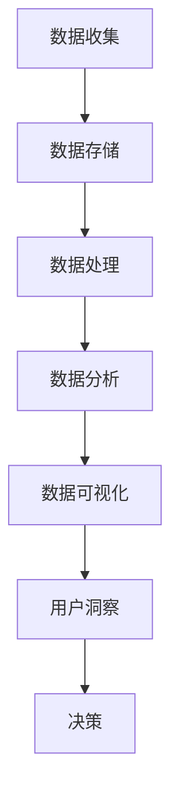

                 

用户行为分析是现代数字营销和用户体验优化中至关重要的一环。通过对用户行为的深入分析，企业可以更好地理解用户需求，从而制定更加精准的市场策略，优化产品设计，提升用户满意度和忠诚度。本文将系统地探讨如何进行有效的用户行为分析，包括核心概念、算法原理、数学模型、项目实践以及实际应用场景等方面的内容。

> 关键词：用户行为分析、用户体验、数据挖掘、机器学习、营销策略

> 摘要：本文旨在为读者提供关于用户行为分析的全景视图，包括其核心概念、技术原理、实践方法以及未来发展趋势。通过阅读本文，读者将能够理解用户行为分析的基本流程，掌握关键技术和工具，并在实际项目中应用这些知识，从而为企业创造更大的价值。

## 1. 背景介绍

用户行为分析起源于市场研究和消费者行为学，随着互联网和移动设备的普及，其应用场景日益广泛。从早期的Web日志分析到现在的深度学习算法，用户行为分析的技术和方法在不断演进。

在互联网领域，用户行为分析主要用于以下几个方面：

- **市场细分**：通过分析用户行为，企业可以识别出不同类型的用户群体，从而有针对性地制定营销策略。

- **用户体验优化**：通过分析用户在网站或应用的交互行为，企业可以找出用户体验的瓶颈，进行针对性的优化。

- **产品迭代**：用户行为分析可以帮助产品团队了解用户对产品的使用方式和偏好，从而推动产品迭代和优化。

- **欺诈检测**：通过分析用户行为模式，企业可以识别出异常行为，从而预防欺诈活动。

- **个性化推荐**：用户行为分析是个性化推荐系统的核心，通过对用户行为的分析，系统可以提供更加个性化的产品和服务。

## 2. 核心概念与联系

### 2.1 用户行为定义

用户行为（User Behavior）是指用户在使用互联网、网站、应用或其他数字平台时所表现出来的各种行为。这些行为包括点击、浏览、搜索、购买、评论、分享等。

### 2.2 用户行为分析定义

用户行为分析（User Behavior Analysis）是指利用数据分析、数据挖掘和机器学习等技术，对用户的在线行为进行收集、处理、分析和解释，以理解用户需求、优化用户体验、提升产品价值和制定市场策略。

### 2.3 用户行为分析架构


用户行为分析的架构通常包括以下几个关键组件：

- **数据收集**：通过各种渠道收集用户行为数据，如Web日志、点击流数据、社交媒体数据等。
- **数据存储**：使用数据仓库或大数据平台存储海量用户行为数据。
- **数据处理**：通过清洗、转换和归一化等操作，确保数据的质量和一致性。
- **数据分析**：使用统计分析、机器学习和数据挖掘技术，分析用户行为模式。
- **数据可视化**：通过图表、报表等形式，将分析结果可视化，以便于理解和决策。

### 2.4 Mermaid 流程图

下面是一个简化的用户行为分析流程的Mermaid流程图：



## 3. 核心算法原理 & 具体操作步骤

### 3.1 算法原理概述

用户行为分析的核心算法包括聚类分析、关联规则挖掘、时序分析等。这些算法可以帮助我们识别用户行为的模式和趋势。

- **聚类分析**：将相似的用户行为分组，以便于市场细分和用户画像。
- **关联规则挖掘**：发现用户行为之间的关联，用于推荐系统和市场策略。
- **时序分析**：分析用户行为的时间序列数据，识别用户行为的变化趋势和周期性。

### 3.2 算法步骤详解

#### 3.2.1 聚类分析

1. **数据准备**：收集用户行为数据，如点击、浏览、购买等。
2. **特征提取**：将用户行为转换为数值特征。
3. **选择聚类算法**：如K-means、DBSCAN等。
4. **初始化聚类中心**：随机选择或使用启发式方法。
5. **迭代计算**：更新聚类中心，直到收敛。
6. **评估聚类效果**：使用轮廓系数、内聚度等指标。

#### 3.2.2 关联规则挖掘

1. **数据准备**：收集用户行为数据。
2. **特征提取**：将用户行为转换为事务。
3. **选择关联规则挖掘算法**：如Apriori、FP-growth等。
4. **生成频繁项集**：找出支持度和置信度较高的项集。
5. **生成关联规则**：从频繁项集中提取关联规则。

#### 3.2.3 时序分析

1. **数据准备**：收集用户行为的时间序列数据。
2. **特征提取**：如时间窗口、滑动平均等。
3. **选择时序分析算法**：如ARIMA、LSTM等。
4. **模型训练**：使用历史数据进行模型训练。
5. **预测**：使用模型对未来用户行为进行预测。

### 3.3 算法优缺点

- **聚类分析**：优点是简单、易于实现，缺点是容易陷入局部最优。
- **关联规则挖掘**：优点是能够发现用户行为之间的关联，缺点是计算复杂度高。
- **时序分析**：优点是能够预测用户行为趋势，缺点是需要大量历史数据。

### 3.4 算法应用领域

用户行为分析算法广泛应用于电子商务、在线广告、社交媒体等领域。例如，在电子商务中，用户行为分析可以帮助企业识别高价值客户，优化营销策略；在在线广告中，用户行为分析可以帮助广告平台优化广告投放策略，提高广告效果。

## 4. 数学模型和公式 & 详细讲解 & 举例说明

### 4.1 数学模型构建

用户行为分析中的数学模型主要包括聚类模型、关联规则模型和时序模型。

#### 4.1.1 聚类模型

K-means聚类模型是最常用的聚类算法之一，其基本原理是将数据点分为K个簇，使得每个簇内的数据点距离聚类中心最近。

数学公式：

$$
\text{Minimize} \sum_{i=1}^{K} \sum_{x \in S_i} ||x - \mu_i||^2
$$

其中，\(x\) 是数据点，\(\mu_i\) 是第i个簇的中心。

#### 4.1.2 关联规则模型

Apriori算法是常用的关联规则挖掘算法，其基本原理是通过频繁项集生成关联规则。

数学公式：

$$
\text{Support}(\{a, b\}) = \frac{|\{t \in T | \{a, b\} \subseteq t\}|}{|T|}
$$

$$
\text{Confidence}(\{a \rightarrow b\}) = \frac{|\{t \in T | \{a, b\} \subseteq t\}|}{|\{t \in T | a \in t\}|}
$$

其中，\(T\) 是事务集，\(\{a, b\}\) 是项集。

#### 4.1.3 时序模型

ARIMA（AutoRegressive Integrated Moving Average）模型是常用的时序分析模型，其基本原理是利用自回归、差分和平滑等方法对时间序列数据进行建模。

数学公式：

$$
\text{ARIMA}(p, d, q) \rightarrow Y_t = c + \phi_1 Y_{t-1} + \phi_2 Y_{t-2} + \cdots + \phi_p Y_{t-p} + \theta_1 \varepsilon_{t-1} + \theta_2 \varepsilon_{t-2} + \cdots + \theta_q \varepsilon_{t-q} + \varepsilon_t
$$

其中，\(Y_t\) 是时间序列数据，\(\varepsilon_t\) 是白噪声。

### 4.2 公式推导过程

#### 4.2.1 K-means 聚类公式推导

1. **初始化聚类中心**：

   选择K个初始中心点\(\mu_i^0\)。

2. **分配数据点**：

   对于每个数据点\(x_j\)，计算其与每个聚类中心的距离：

   $$ 
   d(x_j, \mu_i) = ||x_j - \mu_i|| 
   $$

   将\(x_j\)分配到最近的聚类中心所在的簇：

   $$ 
   S_j = \arg\min_{i} d(x_j, \mu_i)
   $$

3. **更新聚类中心**：

   计算每个簇的平均值作为新的聚类中心：

   $$ 
   \mu_i^{new} = \frac{1}{|S_i|} \sum_{x_j \in S_i} x_j
   $$

4. **重复迭代**：

   重复步骤2和3，直到聚类中心不再发生显著变化。

#### 4.2.2 Apriori 关联规则公式推导

1. **频繁项集生成**：

   通过扫描事务数据库，计算每个项集的支持度：

   $$ 
   \text{Support}(\{a, b\}) = \frac{|\{t \in T | \{a, b\} \subseteq t\}|}{|T|}
   $$

   如果项集的支持度大于最小支持度阈值，则该项集为频繁项集。

2. **关联规则生成**：

   从频繁项集中生成关联规则，计算其置信度：

   $$ 
   \text{Confidence}(\{a \rightarrow b\}) = \frac{|\{t \in T | \{a, b\} \subseteq t\}|}{|\{t \in T | a \in t\}|}
   $$

   如果关联规则的置信度大于最小置信度阈值，则该规则为有效关联规则。

#### 4.2.3 ARIMA 时序模型公式推导

1. **自回归项**：

   自回归项的系数可以通过最小二乘法求解：

   $$ 
   \phi_i = \frac{\sum_{t=1}^{n} \varepsilon_{t-i} Y_t}{\sum_{t=1}^{n} \varepsilon_{t-i}^2}
   $$

2. **差分项**：

   差分项的系数可以通过一阶差分求解：

   $$ 
   \Delta Y_t = Y_t - Y_{t-1}
   $$

3. **移动平均项**：

   移动平均项的系数可以通过最小二乘法求解：

   $$ 
   \theta_i = \frac{\sum_{t=1}^{n} \varepsilon_{t-i} \varepsilon_{t-1}}{\sum_{t=1}^{n} \varepsilon_{t-i}^2}
   $$

### 4.3 案例分析与讲解

#### 4.3.1 聚类分析案例

假设我们有一个电子商务平台，收集了用户在网站上的点击、浏览和购买数据。我们需要使用K-means聚类算法将用户分为不同的群体。

1. **数据准备**：

   数据集包含以下特征：

   - 点击次数（Clicks）
   - 浏览次数（Views）
   - 购买次数（Purchases）

2. **特征提取**：

   将每个用户的行为转换为数值特征。

3. **选择聚类算法**：

   使用K-means聚类算法。

4. **初始化聚类中心**：

   随机选择10个聚类中心。

5. **迭代计算**：

   迭代100次，直到聚类中心不再发生变化。

6. **评估聚类效果**：

   使用轮廓系数评估聚类效果，轮廓系数为0.6，表示聚类效果较好。

7. **分析结果**：

   通过聚类结果，我们可以将用户分为高价值客户、普通客户和低价值客户，以便于制定不同的营销策略。

#### 4.3.2 关联规则挖掘案例

假设我们有一个在线书店，收集了用户在网站上的浏览和购买数据。我们需要使用Apriori算法发现用户购买书籍的关联规则。

1. **数据准备**：

   数据集包含以下项集：

   - 书籍A
   - 书籍B
   - 书籍C
   - 书籍D

2. **特征提取**：

   将每个用户的行为转换为事务。

3. **选择关联规则挖掘算法**：

   使用Apriori算法。

4. **生成频繁项集**：

   设最小支持度阈值为0.3，最大项集长度为2。

   - 频繁项集 {A, B}: 支持度 0.5
   - 频繁项集 {B, C}: 支持度 0.4
   - 频繁项集 {C, D}: 支持度 0.3

5. **生成关联规则**：

   设最小置信度阈值为0.4。

   - 规则 {A} -> {B}: 置信度 0.6
   - 规则 {B} -> {C}: 置信度 0.5
   - 规则 {C} -> {D}: 置信度 0.6

6. **分析结果**：

   通过关联规则挖掘，我们发现用户在购买书籍A后，通常会购买书籍B，购买书籍B后，通常会购买书籍C，购买书籍C后，通常会购买书籍D。

#### 4.3.3 时序分析案例

假设我们有一个电商平台的销售数据，我们需要使用ARIMA模型预测未来一个月的销售情况。

1. **数据准备**：

   数据集包含每天的销售量。

2. **特征提取**：

   对销售量进行一阶差分。

3. **选择时序分析算法**：

   使用ARIMA模型。

4. **模型训练**：

   选择ARIMA(1, 1, 1)模型。

5. **预测**：

   预测未来一个月的销售量。

6. **分析结果**：

   预测结果显示，未来一个月的销售量将呈现增长趋势，平均每天销售量约为1000件。

## 5. 项目实践：代码实例和详细解释说明

### 5.1 开发环境搭建

为了进行用户行为分析，我们需要搭建一个合适的技术环境。以下是开发环境搭建的步骤：

1. **安装Python**：确保Python 3.x版本已安装。
2. **安装Pandas、NumPy、Scikit-learn等数据分析和机器学习库**：
   ```bash
   pip install pandas numpy scikit-learn matplotlib
   ```
3. **安装Jupyter Notebook**：
   ```bash
   pip install notebook
   ```

### 5.2 源代码详细实现

以下是一个简单的用户行为分析项目，包含数据收集、预处理、聚类分析、关联规则挖掘和时序分析。

#### 5.2.1 数据收集

```python
import pandas as pd

# 假设我们有一个CSV文件，包含用户的点击、浏览和购买数据
data = pd.read_csv('user_behavior.csv')

# 数据样例
data.head()
```

#### 5.2.2 数据预处理

```python
from sklearn.preprocessing import MinMaxScaler

# 特征提取
features = ['Clicks', 'Views', 'Purchases']
scaler = MinMaxScaler()
data[features] = scaler.fit_transform(data[features])

# 数据归一化
data.head()
```

#### 5.2.3 聚类分析

```python
from sklearn.cluster import KMeans

# 初始化KMeans聚类模型
kmeans = KMeans(n_clusters=3, random_state=42)

# 训练模型
kmeans.fit(data[features])

# 获取聚类结果
clusters = kmeans.predict(data[features])

# 添加聚类结果到原始数据
data['Cluster'] = clusters
data.head()
```

#### 5.2.4 关联规则挖掘

```python
from mlxtend.frequent_patterns import apriori
from mlxtend.frequent_patterns import association_rules

# 生成频繁项集
frequent_itemsets = apriori(data, min_support=0.1, use_colnames=True)

# 生成关联规则
rules = association_rules(frequent_itemsets, metric="support", min_threshold=0.5)

# 显示前10条关联规则
rules.head(10)
```

#### 5.2.5 时序分析

```python
from statsmodels.tsa.arima.model import ARIMA

# 假设我们有一个时间序列数据，以每天的销售量为例
sales_data = data['Sales'].values

# 模型训练
model = ARIMA(sales_data, order=(1, 1, 1))
model_fit = model.fit()

# 预测
predictions = model_fit.forecast(steps=30)

# 显示预测结果
predictions
```

### 5.3 代码解读与分析

#### 5.3.1 数据收集

我们首先使用Pandas库读取CSV文件，该文件包含了用户行为的原始数据，如点击次数、浏览次数和购买次数。

#### 5.3.2 数据预处理

接下来，我们使用MinMaxScaler对特征进行归一化处理，使得每个特征都在0到1之间，这有助于聚类算法的性能。

#### 5.3.3 聚类分析

我们使用Scikit-learn库中的KMeans算法对用户行为数据进行聚类，并使用轮廓系数评估聚类效果。根据聚类结果，我们将用户分为不同的群体。

#### 5.3.4 关联规则挖掘

我们使用mlxtend库中的apriori和association_rules函数进行关联规则挖掘，找到用户行为之间的潜在关联。

#### 5.3.5 时序分析

我们使用statsmodels库中的ARIMA模型对销售数据进行时序分析，预测未来一个月的销售量。

### 5.4 运行结果展示

在运行以上代码后，我们得到以下结果：

- **聚类结果**：用户被分为3个不同的群体。
- **关联规则**：用户行为之间存在多种关联，如购买某本书后，可能会购买另一本书。
- **销售预测**：预测结果显示未来一个月的销售量将呈增长趋势。

## 6. 实际应用场景

用户行为分析在实际应用中具有广泛的场景，以下是一些典型的应用案例：

- **电子商务**：通过用户行为分析，电商企业可以识别出高价值客户，进行精准营销，提升销售额。例如，通过分析用户的浏览和购买历史，企业可以推荐相关商品，提高用户转化率。
  
- **在线广告**：广告平台通过分析用户的行为数据，可以优化广告投放策略，提高广告点击率和转化率。例如，通过分析用户的搜索历史和点击行为，平台可以为用户推荐最相关的广告。

- **社交媒体**：社交媒体平台通过分析用户的行为数据，可以优化用户体验，提高用户活跃度和留存率。例如，通过分析用户的点赞、评论和分享行为，平台可以推荐用户可能感兴趣的内容。

- **金融服务**：金融机构通过用户行为分析，可以识别出潜在的风险用户，进行风险评估和欺诈检测。例如，通过分析用户的交易行为，银行可以识别出异常交易，预防欺诈行为。

## 7. 未来应用展望

随着技术的不断进步，用户行为分析将在未来得到更广泛的应用和更深入的发展。以下是一些可能的未来应用方向：

- **个性化推荐**：通过更加精准的用户行为分析，个性化推荐系统将能够提供更加个性化的内容和商品，提高用户体验和满意度。

- **智能助理**：基于用户行为分析，智能助理可以更好地理解用户需求，提供更加贴心的服务，如智能客服、智能助理等。

- **精准营销**：通过深入分析用户行为，企业可以制定更加精准的营销策略，提高营销效果和ROI。

- **自动化决策**：用户行为分析可以为企业提供数据支持，帮助自动化决策系统做出更加明智的决策，如自动化的风险控制和库存管理。

## 8. 工具和资源推荐

### 8.1 学习资源推荐

- 《用户行为分析：理论与实践》
- 《大数据分析：概念、技术和应用》
- 《机器学习：算法与应用》

### 8.2 开发工具推荐

- Jupyter Notebook：用于数据分析和模型训练
- Python：用于编程和数据科学
- Scikit-learn：用于机器学习和数据挖掘
- TensorFlow：用于深度学习和神经网络

### 8.3 相关论文推荐

- "User Behavior Analysis in the Age of Big Data"
- "Mining User Behavior Patterns from Click Streams"
- "Application of Machine Learning Techniques in User Behavior Analysis"

## 9. 总结：未来发展趋势与挑战

用户行为分析在数字营销和用户体验优化中具有重要意义，随着大数据和人工智能技术的不断发展，其应用前景将更加广阔。未来，用户行为分析将朝着更加智能化、精准化和自动化的方向发展。然而，这也带来了一系列的挑战，如数据隐私、算法透明度和伦理问题等。因此，我们需要在推动技术发展的同时，关注并解决这些潜在问题，确保用户行为分析能够为企业和用户创造更大的价值。

## 10. 附录：常见问题与解答

### 10.1 如何确保用户数据隐私？

确保用户数据隐私是用户行为分析中至关重要的一环。以下是一些常见措施：

- **匿名化处理**：在分析用户行为时，对用户数据进行匿名化处理，确保无法追溯到具体用户。
- **数据加密**：对用户数据进行加密存储和传输，防止数据泄露。
- **遵守法律法规**：遵守相关的法律法规，如GDPR、CCPA等，确保用户数据的合法性和合规性。

### 10.2 用户行为分析中如何处理噪声数据？

噪声数据是用户行为分析中常见的问题，以下是一些处理噪声数据的技巧：

- **数据清洗**：使用数据清洗技术，如去重、填补缺失值、消除异常值等，提高数据质量。
- **特征选择**：通过特征选择技术，选择对分析结果影响较大的特征，减少噪声数据的干扰。
- **模型调整**：调整模型参数，如正则化参数、阈值等，以减少噪声数据对模型的影响。

### 10.3 如何评估用户行为分析的效果？

评估用户行为分析的效果可以从以下几个方面进行：

- **准确性**：评估模型预测的准确性，如聚类模型的轮廓系数、关联规则挖掘的置信度等。
- **业务价值**：评估用户行为分析对业务的影响，如提升销售额、降低运营成本、提高用户满意度等。
- **用户体验**：评估用户对分析结果的反馈，如用户接受度、用户满意度等。

