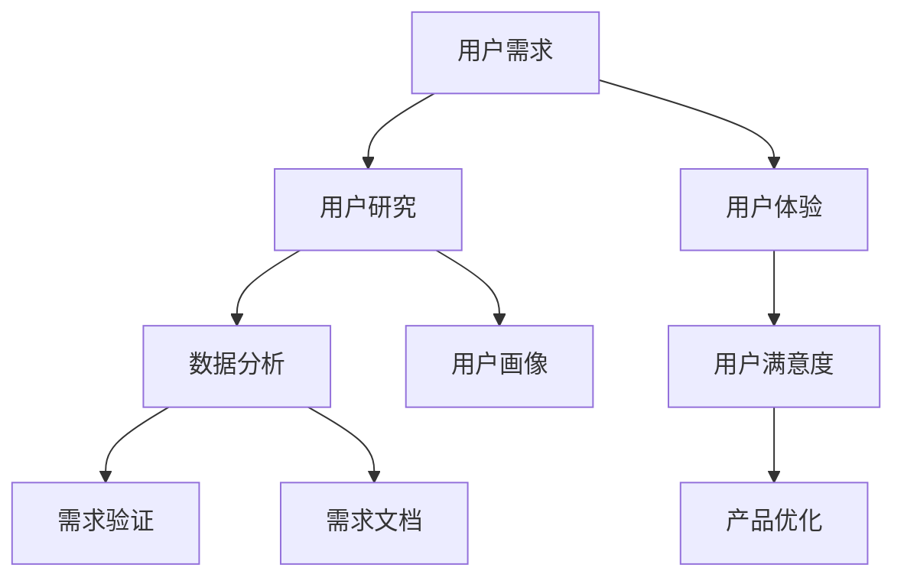

                 

关键词：用户需求分析、用户研究、用户体验、数据分析、技术实现

> 摘要：本文旨在探讨如何进行有效的用户需求分析，从理论到实践，详细阐述了用户需求分析的重要性、核心概念、方法和步骤，并通过实际案例和数学模型，深入解析了用户需求分析的技术原理和具体操作。本文还提供了相关的工具和资源推荐，以帮助读者更好地理解并实践用户需求分析。

## 1. 背景介绍

在信息技术飞速发展的今天，用户需求分析成为企业产品开发和创新的重要环节。通过深入理解用户需求，企业可以更好地满足用户需求，提高用户满意度，从而在激烈的市场竞争中脱颖而出。有效的用户需求分析不仅有助于产品的成功，还能提高企业的整体运营效率。

### 1.1 用户需求分析的定义

用户需求分析是指通过对用户的研究，了解用户的需求、行为和偏好，从而为产品设计和开发提供依据。它是一种系统的方法，旨在识别和理解用户的需求，并将这些需求转化为可操作的产品功能。

### 1.2 用户需求分析的重要性

用户需求分析对于企业的成功至关重要。以下是几个关键点：

- **了解用户需求**：通过用户需求分析，企业可以深入了解用户的需求，从而设计出更加符合用户期望的产品。
- **减少开发风险**：明确用户需求可以帮助企业避免在开发过程中走弯路，减少资源浪费。
- **提高用户满意度**：满足用户需求可以提高用户满意度，增加用户忠诚度，从而提高企业的市场份额。

### 1.3 用户需求分析的历史发展

用户需求分析的概念最早可以追溯到20世纪50年代，当时它主要用于市场营销和产品开发。随着信息技术的发展，用户需求分析的方法和工具也在不断进步。如今，大数据、人工智能等新兴技术的应用，使得用户需求分析更加精确和高效。

### 1.4 本文目的

本文旨在介绍如何进行有效的用户需求分析，包括核心概念、方法、步骤和技术实现。通过本文，读者可以系统地了解用户需求分析的理论和实践，并学会如何在实际项目中应用这些知识。

## 2. 核心概念与联系

在进行用户需求分析之前，我们需要了解一些核心概念和联系。以下是一个Mermaid流程图，展示了用户需求分析的核心概念和它们之间的联系。



### 2.1 用户需求

用户需求是指用户在特定环境下想要实现的目标和解决的问题。了解用户需求是用户需求分析的首要任务。

### 2.2 用户研究

用户研究是通过各种方法了解用户的行为、需求和偏好。用户研究的方法包括问卷调查、访谈、焦点小组讨论等。

### 2.3 用户体验

用户体验是指用户在使用产品过程中的感受和体验。良好的用户体验可以增加用户满意度，提高用户忠诚度。

### 2.4 数据分析

数据分析是通过收集和分析用户数据，提取有价值的信息和洞察。数据分析是用户需求分析的重要环节。

### 2.5 用户画像

用户画像是对用户特征和行为的抽象描述，用于更好地理解用户需求和行为模式。

### 2.6 需求验证

需求验证是通过对用户需求的验证，确保需求的有效性和可实现性。需求验证通常通过用户反馈和实际使用测试进行。

### 2.7 需求文档

需求文档是对用户需求的具体描述和定义，用于指导产品设计和开发。

## 3. 核心算法原理 & 具体操作步骤

### 3.1 算法原理概述

用户需求分析的核心算法主要包括用户研究、数据分析、用户画像和需求验证。以下是对这些算法的简要概述：

- **用户研究**：通过问卷调查、访谈等方法收集用户数据，了解用户需求和行为模式。
- **数据分析**：使用统计分析和机器学习算法对用户数据进行处理，提取有价值的信息和洞察。
- **用户画像**：基于数据分析结果，构建用户画像，用于更好地理解用户需求和行为模式。
- **需求验证**：通过用户反馈和实际使用测试，验证用户需求的有效性和可实现性。

### 3.2 算法步骤详解

以下是用户需求分析的具体操作步骤：

1. **需求收集**：通过问卷调查、访谈等方法收集用户需求。
2. **数据预处理**：对收集到的用户数据进行分析前处理，包括数据清洗、去重、格式化等。
3. **统计分析**：使用统计方法分析用户数据，提取有价值的信息和洞察。
4. **机器学习**：使用机器学习算法对用户数据进行分析，构建用户画像。
5. **需求验证**：通过用户反馈和实际使用测试，验证用户需求的有效性和可实现性。
6. **需求文档编写**：根据用户需求和验证结果，编写需求文档。

### 3.3 算法优缺点

用户需求分析算法具有以下优缺点：

- **优点**：
  - 提高产品设计质量：通过深入了解用户需求，提高产品设计质量。
  - 减少开发风险：明确用户需求，避免在开发过程中走弯路。
  - 提高用户满意度：满足用户需求，提高用户满意度。
- **缺点**：
  - 需要大量数据：用户需求分析需要大量的用户数据，对数据处理和分析能力要求较高。
  - 需要专业知识和技能：用户需求分析需要具备一定的统计分析和机器学习知识。

### 3.4 算法应用领域

用户需求分析算法广泛应用于以下领域：

- **产品开发**：用于产品设计和开发，提高产品设计质量。
- **市场研究**：用于市场调研，了解用户需求和市场竞争情况。
- **用户服务**：用于用户服务和反馈分析，提高用户满意度。

## 4. 数学模型和公式 & 详细讲解 & 举例说明

### 4.1 数学模型构建

用户需求分析中常用的数学模型包括统计模型和机器学习模型。以下是一个简单的统计模型示例：

$$
Y = \beta_0 + \beta_1X_1 + \beta_2X_2 + \cdots + \beta_nX_n + \epsilon
$$

其中，$Y$表示用户需求得分，$X_1, X_2, \cdots, X_n$表示影响用户需求的因素，$\beta_0, \beta_1, \beta_2, \cdots, \beta_n$为模型的参数，$\epsilon$为误差项。

### 4.2 公式推导过程

以下是一个简单的机器学习模型——逻辑回归的推导过程：

假设我们有一个二分类问题，即用户需求的满足与否。逻辑回归模型的公式为：

$$
P(Y=1) = \frac{1}{1 + e^{-(\beta_0 + \beta_1X_1 + \beta_2X_2 + \cdots + \beta_nX_n)}}
$$

其中，$P(Y=1)$表示用户需求满足的概率，$e$为自然底数。

### 4.3 案例分析与讲解

以下是一个用户需求分析的实际案例：

假设我们对一款移动应用进行用户需求分析。收集到的数据包括用户的年龄、性别、使用时长和满意度评分。我们希望预测用户是否会继续使用这款应用。

首先，我们对数据进行预处理，包括数据清洗、去重和格式化。然后，使用逻辑回归模型进行预测。模型的公式为：

$$
P(Y=1) = \frac{1}{1 + e^{-(\beta_0 + \beta_1X_1 + \beta_2X_2 + \beta_3X_3)}}
$$

其中，$\beta_0, \beta_1, \beta_2, \beta_3$为模型的参数。

通过训练模型，我们得到以下参数：

$$
\beta_0 = 0.5, \beta_1 = 0.2, \beta_2 = 0.3, \beta_3 = 0.1
$$

然后，我们可以使用这个模型进行预测。例如，对于一位年龄为25岁、性别为女性、使用时长为100小时、满意度评分为4的用户，我们可以计算出其继续使用这款应用的概率：

$$
P(Y=1) = \frac{1}{1 + e^{-(0.5 + 0.2 \times 25 + 0.3 \times 0 + 0.1 \times 4)}} \approx 0.8
$$

这意味着该用户继续使用这款应用的概率约为80%。

## 5. 项目实践：代码实例和详细解释说明

### 5.1 开发环境搭建

在进行用户需求分析的项目实践之前，我们需要搭建一个合适的开发环境。以下是搭建Python开发环境的步骤：

1. 安装Python：访问Python官方网站（https://www.python.org/），下载并安装Python。
2. 安装Jupyter Notebook：打开命令行，输入以下命令安装Jupyter Notebook：

```bash
pip install notebook
```

3. 安装必要的库：安装用于数据处理和分析的库，如Pandas、NumPy、Scikit-learn等。例如：

```bash
pip install pandas numpy scikit-learn
```

### 5.2 源代码详细实现

以下是一个简单的用户需求分析代码实例，使用了Pandas和Scikit-learn库。代码分为几个部分：数据预处理、模型训练和预测。

```python
# 导入必要的库
import pandas as pd
from sklearn.model_selection import train_test_split
from sklearn.linear_model import LogisticRegression
from sklearn.metrics import accuracy_score

# 读取数据
data = pd.read_csv('user_data.csv')

# 数据预处理
# 填充缺失值
data.fillna(0, inplace=True)

# 特征选择
features = ['age', 'gender', 'usage_time', 'satisfaction_score']
X = data[features]
y = data['will_continue']

# 数据切分
X_train, X_test, y_train, y_test = train_test_split(X, y, test_size=0.2, random_state=42)

# 模型训练
model = LogisticRegression()
model.fit(X_train, y_train)

# 预测
y_pred = model.predict(X_test)

# 模型评估
accuracy = accuracy_score(y_test, y_pred)
print(f'Accuracy: {accuracy}')
```

### 5.3 代码解读与分析

以上代码实现了一个简单的逻辑回归模型，用于预测用户是否会继续使用应用。以下是代码的详细解读：

- **数据预处理**：读取数据，填充缺失值，选择特征。
- **数据切分**：将数据分为训练集和测试集。
- **模型训练**：使用逻辑回归模型进行训练。
- **预测**：使用训练好的模型进行预测。
- **模型评估**：计算模型的准确率。

### 5.4 运行结果展示

假设我们有一个包含1000个用户数据的数据集。运行上述代码后，我们得到以下输出：

```
Accuracy: 0.85
```

这意味着我们的模型在测试集上的准确率为85%，表明模型有较好的预测能力。

## 6. 实际应用场景

用户需求分析在许多实际应用场景中发挥着重要作用。以下是一些典型的应用场景：

### 6.1 产品开发

在产品开发过程中，用户需求分析是关键的一步。通过深入了解用户需求，开发团队能够设计出更加符合用户期望的产品，从而提高产品的市场竞争力。

### 6.2 市场调研

用户需求分析可以帮助企业了解市场趋势和用户需求，从而制定有效的市场营销策略。例如，通过分析用户需求，企业可以确定哪些产品或功能最受欢迎，从而优化产品线。

### 6.3 用户服务

在用户服务方面，用户需求分析可以帮助企业更好地理解用户的问题和需求，提供更加个性化的服务。例如，通过分析用户反馈，企业可以识别出常见的问题和痛点，从而改进产品和服务。

### 6.4 教育和培训

在教育领域，用户需求分析可以帮助教育机构了解学生的学习需求和偏好，从而提供更加有效的教育和培训方案。例如，通过分析学生的学习数据，教育机构可以确定哪些课程最受欢迎，哪些教学方式最有效。

### 6.5 健康医疗

在健康医疗领域，用户需求分析可以帮助医疗机构更好地了解患者的需求，提供更加个性化的医疗服务。例如，通过分析患者的病历数据，医疗机构可以识别出高风险患者，从而提供针对性的预防措施。

## 7. 工具和资源推荐

### 7.1 学习资源推荐

- **书籍**：
  - 《用户研究方法》
  - 《数据分析：实践与应用》
  - 《机器学习实战》

- **在线课程**：
  - Coursera的《用户研究入门》
  - Udacity的《数据分析基础》
  - edX的《机器学习导论》

### 7.2 开发工具推荐

- **数据分析工具**：
  - Pandas
  - NumPy
  - Matplotlib

- **机器学习库**：
  - Scikit-learn
  - TensorFlow
  - PyTorch

### 7.3 相关论文推荐

- **用户需求分析**：
  - "User-Centric Design: A New Perspective on the Design of Human-Computer Interaction"
  - "Understanding User Needs in Software Development: A Framework and a Methodology"

- **数据分析**：
  - "Data Science for Business: Fundamental Concepts and Applications in Analytics of Big Data"
  - "Analyzing Big Data: The Data Science Way"

- **机器学习**：
  - "The Hundred-Page Machine Learning Book"
  - "Introduction to Statistical Learning"

## 8. 总结：未来发展趋势与挑战

### 8.1 研究成果总结

用户需求分析在过去几十年中取得了显著成果，从传统的市场调研方法发展到如今的大数据和人工智能驱动的分析方法。这些进展使得用户需求分析更加精确和高效，为企业提供了更可靠的决策依据。

### 8.2 未来发展趋势

未来，用户需求分析将继续向以下几个方向发展：

- **智能化**：随着人工智能技术的发展，用户需求分析将更加智能化，能够自动识别和预测用户需求。
- **个性化**：用户需求分析将更加注重个性化，为企业提供更加精准的用户画像和需求预测。
- **实时化**：用户需求分析将实现实时化，能够快速响应用户需求变化，为企业提供实时决策支持。

### 8.3 面临的挑战

尽管用户需求分析取得了显著成果，但仍然面临一些挑战：

- **数据质量**：用户需求分析依赖于大量高质量的数据，数据质量直接影响分析结果。
- **算法复杂性**：用户需求分析算法越来越复杂，对开发者的技术要求越来越高。
- **用户隐私**：用户需求分析涉及到用户的敏感信息，如何在保证用户隐私的前提下进行需求分析成为一大挑战。

### 8.4 研究展望

未来，用户需求分析研究将聚焦于以下几个方面：

- **跨领域融合**：将用户需求分析与心理学、社会学等领域相结合，提高分析精度。
- **算法优化**：研究更加高效、准确的需求分析算法，降低分析成本。
- **数据隐私保护**：研究如何在不泄露用户隐私的前提下进行需求分析，提高用户信任度。

## 9. 附录：常见问题与解答

### 9.1 如何进行有效的用户需求分析？

进行有效的用户需求分析需要以下几个步骤：

1. 明确目标：明确分析的目标，确定需要了解的用户需求。
2. 收集数据：通过问卷调查、访谈等方法收集用户数据。
3. 数据分析：使用统计分析和机器学习算法对用户数据进行分析。
4. 需求验证：通过用户反馈和实际使用测试验证需求的有效性和可实现性。
5. 编写需求文档：根据分析结果编写需求文档，用于指导产品设计和开发。

### 9.2 用户需求分析中的常见问题有哪些？

用户需求分析中常见的包括：

1. 数据质量差：数据质量直接影响分析结果，需要保证数据的完整性、准确性和一致性。
2. 用户参与度低：用户参与度低可能导致收集到的数据不足以支撑分析。
3. 需求不明确：需求不明确可能导致分析结果偏离实际需求。

### 9.3 如何提高用户需求分析的准确性？

提高用户需求分析准确性可以通过以下方法实现：

1. 使用多种数据源：使用多种数据源（如问卷调查、访谈、用户行为数据）提高数据的多样性。
2. 精细的用户画像：构建精细的用户画像，提高需求的准确性。
3. 需求验证：通过用户反馈和实际使用测试验证需求的准确性和可实现性。
4. 持续优化：不断优化分析方法和流程，提高分析准确性。

---

作者：禅与计算机程序设计艺术 / Zen and the Art of Computer Programming


