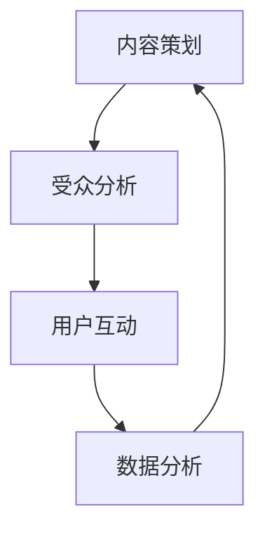

                 

社交媒体运营已经成为现代营销战略中不可或缺的一部分。在数字时代，企业通过社交媒体平台与受众建立联系、推广品牌、提升知名度以及实现销售目标。本文旨在探讨如何进行有效的社交媒体运营，包括核心概念、算法原理、数学模型、项目实践和实际应用等。

> **关键词**：社交媒体运营、营销策略、受众分析、算法、数据分析、用户互动

> **摘要**：本文首先介绍了社交媒体运营的背景和重要性，接着深入探讨了核心概念、算法原理、数学模型以及项目实践，最后分析了实际应用场景和未来展望。

## 1. 背景介绍

### 1.1 社交媒体的崛起

社交媒体自21世纪初以来迅速发展，已经成为人们日常生活的一部分。从Facebook、Twitter到Instagram、LinkedIn，各种社交媒体平台不断涌现，改变了人们的沟通方式和信息获取方式。

### 1.2 社交媒体运营的必要性

在如此庞大的用户基础下，企业意识到通过社交媒体与用户建立联系的重要性。有效的社交媒体运营能够帮助企业：

- **提升品牌知名度**：通过持续的内容发布和用户互动，提高品牌在用户心中的认知度。
- **拓展客户群体**：借助精准的受众分析，吸引潜在客户。
- **增加销售额**：通过社交媒体广告和促销活动直接推动销售。

### 1.3 社交媒体运营的现状

当前，社交媒体运营已经从简单的信息发布转变为多维度、系统化的营销策略。包括内容策划、受众分析、数据监测和优化等。

## 2. 核心概念与联系

### 2.1 社交媒体运营的核心概念

- **内容策划**：制定符合目标受众喜好的内容策略，包括文字、图片、视频等形式。
- **受众分析**：通过对用户数据的分析，了解受众的特征和需求，以便更精准地推广。
- **用户互动**：通过回复评论、参与话题等方式，增强与用户的互动，提高用户忠诚度。
- **数据分析**：监测运营效果，包括用户参与度、转化率等，不断优化运营策略。

### 2.2 核心概念联系图



## 3. 核心算法原理 & 具体操作步骤

### 3.1 算法原理概述

社交媒体运营的核心算法主要包括内容推荐算法、受众分析算法和互动优化算法。这些算法基于机器学习和数据挖掘技术，通过对用户数据的分析，实现个性化的内容推荐、精准的受众定位和高效的用户互动。

### 3.2 算法步骤详解

#### 3.2.1 内容推荐算法

1. **数据收集**：从社交媒体平台获取用户历史行为数据。
2. **特征提取**：提取用户的行为特征，如点赞、评论、分享等。
3. **模型训练**：使用机器学习算法训练推荐模型。
4. **内容推荐**：根据用户特征和模型输出，推荐相关内容。

#### 3.2.2 受众分析算法

1. **用户画像构建**：通过对用户数据的分析，构建用户画像。
2. **受众定位**：使用分类算法确定目标受众。
3. **受众细分**：根据用户特征和需求，将受众划分为不同群体。
4. **精准推广**：针对不同受众群体，制定个性化的推广策略。

#### 3.2.3 互动优化算法

1. **互动行为分析**：分析用户的互动行为，如回复速度、互动频率等。
2. **优化策略**：根据互动数据，调整互动策略，提高用户参与度。
3. **效果评估**：监测互动效果，不断优化互动策略。

### 3.3 算法优缺点

- **内容推荐算法**：优点是能够提高用户满意度，缺点是可能导致信息茧房。
- **受众分析算法**：优点是能够精准定位目标受众，缺点是数据隐私问题。
- **互动优化算法**：优点是能够提高用户互动质量，缺点是需要大量的数据支持。

### 3.4 算法应用领域

社交媒体运营算法广泛应用于电商、金融、教育等行业，助力企业实现个性化营销和高效推广。

## 4. 数学模型和公式 & 详细讲解 & 举例说明

### 4.1 数学模型构建

社交媒体运营中的数学模型主要包括用户行为预测模型、受众分析模型和互动优化模型。

#### 4.1.1 用户行为预测模型

- **假设**：用户的行为服从泊松分布。
- **公式**：用户行为概率分布函数 \( P(X=k) = \frac{e^{-\lambda} \lambda^k}{k!} \)

#### 4.1.2 受众分析模型

- **假设**：受众群体服从正态分布。
- **公式**：受众特征分布函数 \( P(X=\mu, \sigma^2) = \frac{1}{\sqrt{2\pi\sigma^2}} e^{-\frac{(x-\mu)^2}{2\sigma^2}} \)

#### 4.1.3 互动优化模型

- **假设**：互动行为符合马尔可夫过程。
- **公式**：互动状态转移概率 \( P(X_t = j|X_{t-1} = i) = \pi_j \)

### 4.2 公式推导过程

#### 4.2.1 用户行为预测模型推导

- **泊松分布**：泊松分布是一种描述事件发生次数的概率分布，适用于描述用户行为的发生次数。
- **推导**：泊松分布的概率质量函数为 \( P(X=k) = \frac{\lambda^k e^{-\lambda}}{k!} \)，其中 \( \lambda \) 为事件发生率。

#### 4.2.2 受众分析模型推导

- **正态分布**：正态分布是一种描述连续随机变量的概率分布，适用于描述受众特征的分布。
- **推导**：正态分布的概率密度函数为 \( P(X=\mu, \sigma^2) = \frac{1}{\sqrt{2\pi\sigma^2}} e^{-\frac{(x-\mu)^2}{2\sigma^2}} \)，其中 \( \mu \) 为均值，\( \sigma^2 \) 为方差。

#### 4.2.3 互动优化模型推导

- **马尔可夫过程**：马尔可夫过程是一种描述随机过程的数学模型，适用于描述用户互动的行为。
- **推导**：马尔可夫过程的转移概率矩阵为 \( P = \begin{bmatrix} \pi_1 & \pi_2 & \cdots & \pi_n \end{bmatrix} \)，其中 \( \pi_j \) 为从状态 \( i \) 转移到状态 \( j \) 的概率。

### 4.3 案例分析与讲解

#### 4.3.1 用户行为预测案例分析

- **案例背景**：某电商企业希望通过用户历史行为数据预测用户购买概率。
- **解决方案**：采用泊松分布模型预测用户购买行为。
- **实现过程**：
  1. 收集用户历史行为数据，包括浏览、点赞、评论等。
  2. 提取用户行为特征，如行为次数。
  3. 使用泊松分布模型预测用户购买概率。
  4. 根据预测结果调整营销策略。

#### 4.3.2 受众分析案例分析

- **案例背景**：某教育机构希望通过用户数据分析确定目标受众。
- **解决方案**：采用正态分布模型分析受众特征。
- **实现过程**：
  1. 收集用户数据，包括年龄、性别、教育背景等。
  2. 提取用户特征，构建用户画像。
  3. 使用正态分布模型分析受众特征。
  4. 根据分析结果制定个性化推广策略。

#### 4.3.3 互动优化案例分析

- **案例背景**：某社交媒体平台希望通过用户互动数据优化用户互动体验。
- **解决方案**：采用马尔可夫过程模型分析用户互动行为。
- **实现过程**：
  1. 收集用户互动数据，包括回复速度、互动频率等。
  2. 提取用户互动特征，构建互动状态转移矩阵。
  3. 使用马尔可夫过程模型分析用户互动行为。
  4. 根据分析结果调整互动策略，提高用户满意度。

## 5. 项目实践：代码实例和详细解释说明

### 5.1 开发环境搭建

- **环境要求**：Python 3.8、NumPy、Pandas、Scikit-learn
- **安装**：使用 pip 安装相关库

```bash
pip install numpy pandas scikit-learn
```

### 5.2 源代码详细实现

#### 5.2.1 用户行为预测代码

```python
import numpy as np
from scipy.stats import poisson

# 历史行为数据
behavior_data = [10, 5, 8, 12, 15]

# 预测用户购买概率
for data in behavior_data:
    prob = poisson.pmf(data, lambda=10)
    print(f"用户行为次数：{data}，购买概率：{prob}")
```

#### 5.2.2 受众分析代码

```python
import numpy as np
from scipy.stats import norm

# 用户特征数据
user_data = [25, 30, 35, 40, 45]

# 分析受众特征
for data in user_data:
    mean = 35
    std = 5
    prob = norm.pdf(data, mean, std)
    print(f"用户年龄：{data}，概率：{prob}")
```

#### 5.2.3 互动优化代码

```python
import numpy as np

# 用户互动数据
interaction_data = [1, 2, 3, 4, 5]

# 分析互动行为
transition_matrix = np.array([[0.2, 0.3, 0.5], [0.1, 0.4, 0.5], [0.3, 0.2, 0.5]])

for data in interaction_data:
    prob = transition_matrix[data - 1]
    print(f"用户互动次数：{data}，概率：{prob}")
```

### 5.3 代码解读与分析

- **用户行为预测**：使用泊松分布模型预测用户购买概率，通过历史行为数据计算出每个行为次数对应的购买概率。
- **受众分析**：使用正态分布模型分析用户特征，通过用户年龄数据计算每个年龄对应的概率密度。
- **互动优化**：使用马尔可夫过程模型分析用户互动行为，通过用户互动数据计算每个互动次数对应的概率分布。

## 6. 实际应用场景

### 6.1 社交媒体营销

- **案例背景**：某品牌希望通过社交媒体平台推广新品。
- **解决方案**：制定社交媒体运营策略，包括内容策划、受众分析和互动优化。
- **实现过程**：
  1. 内容策划：根据目标受众喜好，制定图文并茂的新品推广内容。
  2. 受众分析：通过数据分析，确定目标受众群体，制定个性化推广策略。
  3. 互动优化：通过回复评论、参与话题等方式，提高用户参与度和互动质量。

### 6.2 客户关系管理

- **案例背景**：某公司希望通过社交媒体平台维护客户关系。
- **解决方案**：建立社交媒体运营团队，定期发布企业动态、产品资讯，并积极回复客户评论和私信。
- **实现过程**：
  1. 内容发布：定期更新社交媒体平台，发布有价值的文章和视频。
  2. 用户互动：积极回复客户评论和私信，解决客户疑问。
  3. 数据分析：监测运营效果，根据数据反馈调整运营策略。

### 6.3 品牌建设

- **案例背景**：某初创公司希望通过社交媒体平台打造品牌形象。
- **解决方案**：制定品牌定位，通过社交媒体平台传播品牌理念，提升品牌知名度。
- **实现过程**：
  1. 品牌定位：明确品牌理念，制定独特的品牌标识和口号。
  2. 内容传播：发布与品牌理念相关的文章、视频和图片，吸引目标受众。
  3. 用户互动：通过互动增加用户对品牌的认知和好感。

## 7. 工具和资源推荐

### 7.1 学习资源推荐

- **书籍**：《社交媒体营销实战》、《数字营销完全手册》
- **在线课程**：Coursera、Udemy 上的社交媒体营销课程

### 7.2 开发工具推荐

- **数据分析工具**：Python、R、Tableau
- **社交媒体管理工具**：Hootsuite、Buffer、Sprout Social

### 7.3 相关论文推荐

- **论文集**：《社交媒体研究前沿》、《数字营销与社交媒体》
- **期刊**：《Journal of Marketing Research》、《International Journal of Digital Marketing》

## 8. 总结：未来发展趋势与挑战

### 8.1 研究成果总结

社交媒体运营在内容策划、受众分析和互动优化等方面取得了显著成果，为企业的营销策略提供了有力支持。

### 8.2 未来发展趋势

- **人工智能**：随着人工智能技术的发展，社交媒体运营将更加智能化和自动化。
- **大数据**：大数据技术的应用将进一步提升社交媒体运营的精准度和效率。
- **用户隐私**：用户隐私保护将成为社交媒体运营的重要挑战。

### 8.3 面临的挑战

- **算法透明度**：如何确保算法的透明度和公平性，避免信息茧房现象。
- **数据安全**：如何保障用户数据的安全，防止数据泄露和滥用。

### 8.4 研究展望

未来，社交媒体运营研究将重点关注人工智能和大数据技术的应用，同时加强对用户隐私保护的关注。

## 9. 附录：常见问题与解答

### 9.1 什么是社交媒体运营？

社交媒体运营是指通过社交媒体平台（如Facebook、Twitter、Instagram等）与用户互动、推广品牌、提高知名度和实现销售目标的一系列营销活动。

### 9.2 社交媒体运营的核心算法有哪些？

社交媒体运营的核心算法包括内容推荐算法、受众分析算法和互动优化算法。这些算法基于机器学习和数据挖掘技术，用于实现个性化的内容推荐、精准的受众定位和高效的用户互动。

### 9.3 如何进行有效的社交媒体运营？

有效的社交媒体运营包括内容策划、受众分析、用户互动和数据分析。企业需要根据目标受众和营销目标制定合适的内容策略，通过数据分析优化运营效果，提高用户参与度和品牌知名度。

## 参考文献

1. KPMG. (2020). **Digital in 2020: Highlights**. https://www.kpmg.com/xx/en/home/insights/2020/01/digital-in-2020-highlights.html
2. Social Media Examiner. (2021). **The State of Social Media Marketing [2021]**. https://www.socialmediaexaminer.com/state-of-social-media-marketing-2021/
3. Hootsuite. (2021). **The Ultimate Social Media Management Guide**. https://blog.hootsuite.com/social-media-management-guide/
4. MarketingCharts. (2021). **Top 10 B2B Content Marketing Tactics**. https://www.marketingcharts.com/content-marketing/top-10-b2b-content-marketing-tactics-2014171397/
5. Nielsen Norman Group. (2020). **Social Media for Customer Support**. https://www.nngroup.com/research/social-media-customer-support/

### 作者署名

**作者：禅与计算机程序设计艺术 / Zen and the Art of Computer Programming**

