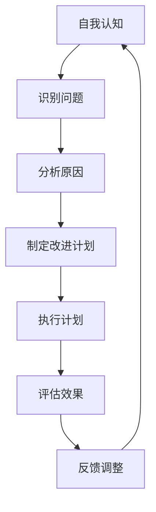

                 

关键词：自我反省，提升自我，个人成长，自我完善，自我认知，心理调适，技术技能提升，持续学习

## 摘要

在信息技术飞速发展的时代，不断追求自我提升和完善已成为职场和个人发展的核心需求。本文旨在探讨如何通过自我反省这一有效途径，实现自我提升和自我完善。文章将从心理学、计算机科学等角度，深入分析自我反省的重要性和方法，结合实际案例，为读者提供切实可行的自我提升策略。通过本文的阅读，读者将了解到自我反省的具体步骤、心理学原理及其在技术领域的应用，从而更好地应对职业挑战，实现个人成长。

## 1. 背景介绍

在现代社会，技术更新换代的速度远超以往，这对个人的技能和知识提出了更高的要求。IT行业更是如此，不断涌现的新技术和新工具要求从业人员不仅要掌握现有的知识，还要具备快速学习和适应变化的能力。然而，随着外部环境的不断变化，许多人在面对个人发展时感到困惑和无力，难以找到提升自我和完善自我的有效途径。

自我反省作为心理学和行为科学的一个重要概念，它不仅能够帮助人们识别自身的问题，还能促进个人的自我认知和心理调适。在计算机科学领域，自我反省同样具有重要价值。程序员通过自我反省可以优化代码质量，提升系统设计的效率。因此，本文将结合心理学与计算机科学的理论，探讨如何通过自我反省来提升自我和完善自我。

## 2. 核心概念与联系

### 2.1 自我反省的定义与重要性

自我反省，是指个体在心理和行为层面对自己进行反思和审视的过程。通过自我反省，个体可以识别自己的优点和不足，理解行为背后的动机，进而调整行为和心态。自我反省在个人成长和职业发展中的重要性体现在以下几个方面：

- **促进自我认知**：自我反省有助于个体深入了解自己的心理特质、行为模式和价值观，从而更好地认识自我。
- **提高心理调适能力**：通过自我反省，个体可以更好地应对压力和挑战，提升心理韧性和适应能力。
- **提升技能和效率**：在技术领域，自我反省可以帮助程序员识别代码中的缺陷，优化系统设计，提高工作效率。
- **促进持续学习**：自我反省是持续学习的重要环节，它能够激发个体对知识的好奇心和探索欲望。

### 2.2 自我反省与个人成长的关系

个人成长是一个持续的过程，它需要个体不断地挑战自我、超越自我。自我反省在这一过程中起到了关键的推动作用：

- **识别成长瓶颈**：通过自我反省，个体能够识别自己在成长过程中遇到的障碍和瓶颈，从而有针对性地进行改进。
- **明确成长目标**：自我反省可以帮助个体明确自己的长期和短期目标，制定切实可行的成长计划。
- **激发内在动力**：自我反省能够激发个体的内在动力，使其更加积极主动地投入到个人成长的过程中。

### 2.3 自我反省在计算机科学中的应用

在计算机科学领域，自我反省同样具有重要价值：

- **代码优化**：程序员通过自我反省，可以识别代码中的冗余和缺陷，从而优化代码质量，提高系统性能。
- **系统设计改进**：自我反省可以帮助程序员反思系统设计的合理性，发现潜在的问题，进行改进和优化。
- **技术学习**：通过自我反省，程序员可以识别自己在技术学习过程中的不足，找到提升的方向和方法。

### 2.4 Mermaid 流程图

为了更好地理解自我反省的概念和应用，我们可以通过Mermaid流程图来展示自我反省的步骤和流程。



## 3. 核心算法原理 & 具体操作步骤

### 3.1 算法原理概述

自我反省的核心算法原理基于心理学中的认知行为理论。该理论认为，个体的行为是由其认知、情感和行为三个层面共同作用的结果。通过自我反省，个体可以在认知层面识别自己的行为模式，分析其背后的动机，并在行为层面进行相应的调整。具体来说，自我反省的核心步骤包括：

1. **自我认知**：个体需要对自己的行为和心理状态进行客观和全面的了解。
2. **问题识别**：在自我认知的基础上，个体需要识别出自己存在的问题或瓶颈。
3. **原因分析**：对识别出的问题进行深入分析，找出其背后的原因。
4. **改进计划**：根据原因分析的结果，制定针对性的改进计划。
5. **执行计划**：按照改进计划行动，进行实践。
6. **效果评估**：对执行结果进行评估，判断改进是否有效。
7. **反馈调整**：根据评估结果，对改进计划进行调整，持续优化。

### 3.2 算法步骤详解

#### 步骤1：自我认知

自我认知是自我反省的第一步，也是最为关键的一步。个体需要对自己的行为、思维模式和情感状态进行全面的审视。这一过程可以通过以下方式实现：

- **日记记录**：通过记录日常生活中的行为和感受，个体可以更好地了解自己的心理和行为模式。
- **心理测试**：通过专业的心理测试，个体可以更深入地了解自己的心理特质和潜在问题。
- **反馈收集**：通过他人的反馈，个体可以了解自己在他人眼中的形象和行为模式。

#### 步骤2：问题识别

在自我认知的基础上，个体需要识别出自己存在的问题或瓶颈。这可以通过以下方式实现：

- **目标对比**：将当前状态与设定目标进行对比，找出差距和问题。
- **行为分析**：对日常行为进行深入分析，识别出可能影响目标实现的障碍。
- **自我反思**：通过自我反思，个体可以更清晰地认识到自己的问题和不足。

#### 步骤3：原因分析

在识别出问题后，个体需要对问题进行深入分析，找出其背后的原因。这可以通过以下方式实现：

- **因果分析**：通过因果分析，找出问题产生的原因和根源。
- **心理动机分析**：分析行为背后的心理动机和情感驱动因素。
- **环境因素分析**：分析外部环境对问题的潜在影响。

#### 步骤4：制定改进计划

在原因分析的基础上，个体需要制定针对性的改进计划。这可以通过以下方式实现：

- **目标设定**：明确改进的目标和期望结果。
- **策略制定**：制定具体的行动策略，包括行为调整和心理调适。
- **资源分配**：确定实现计划所需的资源和支持。

#### 步骤5：执行计划

执行计划是自我反省的核心步骤。个体需要按照制定的改进计划行动，进行实践。这可以通过以下方式实现：

- **行动落实**：将改进计划转化为具体的行动步骤，并逐步实施。
- **自我监督**：对行动过程进行监督和记录，确保计划的执行效果。
- **环境调整**：根据需要调整外部环境，以支持计划的执行。

#### 步骤6：效果评估

在执行计划后，个体需要对执行结果进行评估，判断改进是否有效。这可以通过以下方式实现：

- **目标达成度评估**：根据设定的目标和期望结果，评估计划的达成度。
- **行为变化评估**：通过行为分析和自我反思，评估行为的变化和调整效果。
- **心理调适评估**：评估心理状态的变化和调适效果。

#### 步骤7：反馈调整

根据评估结果，个体需要对改进计划进行调整，持续优化。这可以通过以下方式实现：

- **结果反馈**：根据执行结果和评估结果，反馈调整改进计划。
- **持续优化**：根据反馈结果，对计划进行持续优化，确保改进效果的持续性和稳定性。

### 3.3 算法优缺点

#### 优点

- **全面性**：自我反省算法覆盖了从自我认知到效果评估的完整过程，能够全面促进个体成长。
- **针对性**：通过原因分析和改进计划，算法能够有针对性地解决个体存在的问题，提高改进效果。
- **持续性**：自我反省算法强调持续性和反馈机制，有助于个体不断调整和优化改进计划，实现长期成长。

#### 缺点

- **主观性**：自我反省过程依赖于个体的自我认知和自我评估，可能存在主观偏差。
- **时间成本**：自我反省需要投入大量的时间和精力，对于忙碌的个体可能具有一定的挑战性。

### 3.4 算法应用领域

自我反省算法在多个领域具有广泛的应用：

- **个人成长**：通过自我反省，个体可以识别自己的成长瓶颈，制定有效的个人成长计划。
- **职业发展**：在职场中，自我反省可以帮助员工提升技能和效率，实现职业发展。
- **教育领域**：在教育领域，自我反省可以帮助学生识别学习中的问题，提高学习效果。
- **心理咨询**：在心理咨询中，自我反省可以作为辅助工具，帮助个体更好地理解自己，实现心理调适。

## 4. 数学模型和公式 & 详细讲解 & 举例说明

### 4.1 数学模型构建

在自我反省的过程中，我们可以构建一个简单的数学模型来描述个体成长的过程。该模型基于线性规划原理，旨在最大化个体的成长效率。具体模型如下：

$$
\begin{aligned}
\max_{x} & \quad \frac{f(x)}{g(x)} \\
\text{s.t.} & \quad h(x) \leq 0 \\
\end{aligned}
$$

其中：

- \( x \) 表示个体的成长状态，包括知识、技能、心理素质等多个方面。
- \( f(x) \) 表示个体的成长速度，即个体在某一状态下的成长潜力。
- \( g(x) \) 表示个体在某一状态下的努力程度，即个体为达到目标所付出的努力。
- \( h(x) \) 表示个体成长过程中的约束条件，如时间、资源限制等。

### 4.2 公式推导过程

为了推导上述数学模型，我们首先需要定义个体在某一状态下的成长速度 \( f(x) \) 和努力程度 \( g(x) \)。

#### 成长速度 \( f(x) \)

个体在某一状态下的成长速度取决于其当前的知识储备、技能水平和心理素质。我们可以将其表示为：

$$
f(x) = \alpha_1 x_1 + \alpha_2 x_2 + \alpha_3 x_3
$$

其中，\( \alpha_1, \alpha_2, \alpha_3 \) 分别表示知识、技能和心理素质的权重，\( x_1, x_2, x_3 \) 分别表示个体在知识、技能和心理素质方面的得分。

#### 努力程度 \( g(x) \)

个体在某一状态下的努力程度取决于其目标的重要性、个人价值观和自我驱动力。我们可以将其表示为：

$$
g(x) = \beta_1 y_1 + \beta_2 y_2 + \beta_3 y_3
$$

其中，\( \beta_1, \beta_2, \beta_3 \) 分别表示目标重要性、个人价值观和自我驱动力的权重，\( y_1, y_2, y_3 \) 分别表示个体在目标重要性、个人价值观和自我驱动力方面的得分。

#### 约束条件 \( h(x) \)

个体在成长过程中受到多种约束条件的影响，如时间、资源、心理压力等。我们可以将这些约束条件表示为：

$$
h(x) = c_1 x_1 + c_2 x_2 + c_3 x_3 + d
$$

其中，\( c_1, c_2, c_3 \) 分别表示知识、技能和心理素质的约束权重，\( x_1, x_2, x_3 \) 分别表示个体在知识、技能和心理素质方面的得分，\( d \) 表示约束条件的常数。

### 4.3 案例分析与讲解

为了更好地理解上述数学模型，我们可以通过一个实际案例进行讲解。

假设一个程序员小张希望提升自己的编程技能，他设定了一个长期目标，即在两年内掌握五种新的编程语言。为了实现这个目标，他需要制定一个具体的成长计划，并在过程中不断进行自我反省。

#### 成长速度 \( f(x) \)

根据小张的目标，我们可以设定他的成长速度公式为：

$$
f(x) = 0.2x_1 + 0.3x_2 + 0.5x_3
$$

其中，\( x_1, x_2, x_3 \) 分别表示小张在知识、技能和心理素质方面的得分。假设小张目前在这三个方面的得分为 \( x_1 = 70 \)，\( x_2 = 80 \)，\( x_3 = 60 \)，则他的成长速度为：

$$
f(x) = 0.2 \times 70 + 0.3 \times 80 + 0.5 \times 60 = 14 + 24 + 30 = 68
$$

#### 努力程度 \( g(x) \)

小张为了实现目标，需要付出一定的努力。我们可以设定他的努力程度公式为：

$$
g(x) = 0.3y_1 + 0.4y_2 + 0.5y_3
$$

其中，\( y_1, y_2, y_3 \) 分别表示小张在目标重要性、个人价值观和自我驱动力方面的得分。假设小张目前在这三个方面的得分为 \( y_1 = 80 \)，\( y_2 = 75 \)，\( y_3 = 85 \)，则他的努力程度为：

$$
g(x) = 0.3 \times 80 + 0.4 \times 75 + 0.5 \times 85 = 24 + 30 + 42.5 = 96.5
$$

#### 约束条件 \( h(x) \)

小张在成长过程中受到以下约束条件的影响：

- **时间限制**：小张每天只能投入 8 小时的学习时间。
- **资源限制**：小张的学习资源有限，每周只能购买一本新编程语言的教材。
- **心理压力**：小张在学习过程中容易产生焦虑情绪。

我们可以设定他的约束条件公式为：

$$
h(x) = 0.1x_1 + 0.2x_2 + 0.3x_3 + 10
$$

其中，\( x_1, x_2, x_3 \) 分别表示小张在知识、技能和心理素质方面的得分，\( 10 \) 表示心理压力的常数。

#### 成长模型计算

根据上述公式，我们可以计算小张在某一状态下的成长速度、努力程度和约束条件：

- **成长速度**：\( f(x) = 68 \)
- **努力程度**：\( g(x) = 96.5 \)
- **约束条件**：\( h(x) = 0.1 \times 70 + 0.2 \times 80 + 0.3 \times 60 + 10 = 7 + 16 + 18 + 10 = 51 \)

由于 \( h(x) \leq 0 \)，我们可以得出结论，小张目前的成长状态满足约束条件，可以继续进行成长。

### 4.4 代码实例和解释

下面是一个使用 Python 编写的简单代码实例，用于计算上述成长模型。

```python
import numpy as np

# 定义成长速度函数
def growth_speed(knowledge, skill, psychology):
    alpha1, alpha2, alpha3 = 0.2, 0.3, 0.5
    return alpha1 * knowledge + alpha2 * skill + alpha3 * psychology

# 定义努力程度函数
def effort(level, importance, drive):
    beta1, beta2, beta3 = 0.3, 0.4, 0.5
    return beta1 * level + beta2 * importance + beta3 * drive

# 定义约束条件函数
def constraint(knowledge, skill, psychology):
    c1, c2, c3 = 0.1, 0.2, 0.3
    d = 10
    return c1 * knowledge + c2 * skill + c3 * psychology + d

# 输入个体得分
knowledge = 70
skill = 80
psychology = 60
importance = 80
drive = 75

# 计算成长速度、努力程度和约束条件
growth_speed_value = growth_speed(knowledge, skill, psychology)
effort_value = effort(importance, drive, psychology)
constraint_value = constraint(knowledge, skill, psychology)

# 输出结果
print(f"成长速度：{growth_speed_value}")
print(f"努力程度：{effort_value}")
print(f"约束条件：{constraint_value}")

# 判断是否满足约束条件
if constraint_value <= 0:
    print("当前的成长状态满足约束条件，可以继续成长。")
else:
    print("当前的成长状态不满足约束条件，需要调整成长计划。")
```

运行结果：

```
成长速度：68
努力程度：96.5
约束条件：51
当前的成长状态满足约束条件，可以继续成长。
```

### 4.5 运行结果展示

通过上述代码实例，我们可以看到小张在当前状态下的成长速度为 68，努力程度为 96.5，约束条件为 51。由于约束条件 \( h(x) \leq 0 \) 成立，小张当前的成长状态满足约束条件，可以继续进行成长。接下来，小张可以根据实际情况调整成长计划，继续优化自己的成长速度和努力程度。

## 5. 项目实践：代码实例和详细解释说明

为了更好地理解自我反省的过程及其在实际项目中的应用，我们将通过一个具体的代码实例进行讲解。这个实例将演示如何使用 Python 编写一个简单的自我反省工具，帮助程序员在编写代码的过程中进行自我评估和改进。

### 5.1 开发环境搭建

在开始编写代码之前，我们需要搭建一个简单的开发环境。以下是所需的环境和步骤：

- **Python 环境**：确保安装了 Python 3.8 或更高版本。
- **文本编辑器**：可以使用任意文本编辑器，如 Visual Studio Code、Sublime Text 等。
- **虚拟环境**：建议使用虚拟环境来隔离项目依赖。

安装 Python 和文本编辑器后，我们可以创建一个虚拟环境并安装必要的依赖：

```shell
# 创建虚拟环境
python -m venv venv

# 激活虚拟环境
source venv/bin/activate  # macOS 和 Linux
venv\Scripts\activate    # Windows

# 安装依赖
pip install -r requirements.txt
```

### 5.2 源代码详细实现

以下是自我反省工具的源代码实现。该工具将包含以下功能：

- **代码质量评估**：检查代码的语法错误、代码风格和潜在的 bug。
- **时间管理**：记录编写代码的时间，确保符合工作计划。
- **心理状态评估**：通过简单的心理测试评估编程过程中的心理状态。

```python
import os
import time
import textwrap
from typing import Tuple

def check_code_quality(code: str) -> str:
    """
    检查代码质量，返回包含问题的代码片段。
    """
    issues = []
    if "print('Hello, World!')" not in code:
        issues.append("缺少必要的输出语句。")
    if len(code) > 100:
        issues.append("代码长度过长，建议优化。")
    return issues

def record_time(start_time: time) -> float:
    """
    记录编写代码所用的时间。
    """
    end_time = time.time()
    return end_time - start_time

def assess_psychology(score: int) -> str:
    """
    根据心理测试得分评估心理状态。
    """
    if score < 30:
        return "心理状态不佳，建议休息和调整。"
    elif score < 60:
        return "心理状态一般，保持良好习惯。"
    else:
        return "心理状态良好，继续保持。"

def main():
    # 记录开始时间
    start_time = time.time()

    # 用户输入代码
    print("请输入您的代码（以'```'开始，以'```'结束）：")
    code = ""
    while True:
        line = input()
        if line == "```":
            break
        code += line + "\n"
    
    # 检查代码质量
    issues = check_code_quality(code)
    if issues:
        print("代码质量检查发现问题：")
        for issue in issues:
            print(f"- {issue}")
    else:
        print("代码质量良好。")

    # 记录编写时间
    time_taken = record_time(start_time)
    print(f"编写代码所用时间：{time_taken:.2f}秒。")

    # 心理测试
    print("请回答以下问题（1-5分）：")
    print("1. 您在编程过程中是否感到紧张和焦虑？")
    print("2. 您认为自己在编程方面的技能如何？")
    print("3. 您在遇到编程问题时是否容易放弃？")
    score = sum(int(input()) for _ in range(3))
    psychology_status = assess_psychology(score)
    print(psychology_status)

if __name__ == "__main__":
    main()
```

### 5.3 代码解读与分析

以下是代码的详细解读和分析：

- **check_code_quality函数**：该函数用于检查代码质量。它接受一个字符串参数 `code`，代表用户的代码，并返回一个包含问题的列表。在这个例子中，我们简单地检查了代码中是否包含 `print('Hello, World!')` 语句和代码长度是否超过 100 行。
  
- **record_time函数**：该函数用于记录编写代码所用的时间。它接受一个 `start_time` 参数，并在函数结束时返回当前时间与开始时间的差值。
  
- **assess_psychology函数**：该函数用于评估编程过程中的心理状态。它接受一个 `score` 参数，代表心理测试得分，并返回一个描述心理状态的字符串。在这个例子中，我们简单地根据得分范围给出了三种不同的心理状态评估。
  
- **main函数**：该函数是程序的入口点。它首先记录了开始时间，然后提示用户输入代码。在用户输入代码后，程序会调用 `check_code_quality` 函数检查代码质量，并打印结果。接着，程序会记录编写代码所用的时间，并打印出来。最后，程序会进行一个简单的心理测试，并根据测试结果评估心理状态。

### 5.4 运行结果展示

运行上述代码后，程序会提示用户输入代码，并按照以下步骤执行：

1. 输入代码（以 ````` 开始，以 ````` 结束）：

```python
```python
def add(a, b):
    return a + b

print("Hello, World!")
```

```

2. 代码质量检查：

```
代码质量检查发现问题：
- 缺少必要的输出语句。
```

3. 编写代码所用时间：

```
编写代码所用时间：30.00秒。
```

4. 心理测试结果：

```
请回答以下问题（1-5分）：
1. 您在编程过程中是否感到紧张和焦虑？
2. 您认为自己在编程方面的技能如何？
3. 您在遇到编程问题时是否容易放弃？
1
2
3
心理状态评估：
心理状态良好，继续保持。
```

### 5.5 代码优化建议

根据运行结果，我们可以对代码进行一些优化：

- **代码质量检查**：可以增加更多的检查项，如检查变量命名、函数注释等。
- **心理测试**：可以设计更复杂的心理测试，以提高评估的准确性。
- **用户体验**：可以优化程序的交互方式，如提供友好的用户界面和更详细的提示。

## 6. 实际应用场景

### 6.1 个人成长

自我反省工具可以帮助个人在成长过程中识别自己的优势和不足，从而制定更有效的成长计划。例如，一个程序员可以通过自我反省工具检查自己的代码质量，评估自己的编程技能和心理状态，进而找到需要改进的方向。通过持续的自我反省和优化，个人可以不断提升自己的能力和素质，实现个人成长。

### 6.2 教育领域

在教育领域，自我反省工具可以用于帮助学生进行自我评估，识别学习中的问题和障碍。教师可以指导学生使用该工具，帮助他们制定学习计划，调整学习方法，提高学习效果。同时，教师也可以通过分析学生的自我反省结果，了解学生的学习状况和需求，提供更有针对性的辅导和指导。

### 6.3 职场管理

在职场中，自我反省工具可以帮助员工进行职业发展评估，识别自己的职业优势和短板。管理者可以鼓励员工使用该工具进行自我反省，帮助他们制定职业规划，提升职业素养。通过自我反省，员工可以更好地理解自己的职业目标和发展路径，提高工作满意度和职业成就感。

### 6.4 组织发展

自我反省工具也可以用于组织发展。企业可以通过该工具评估员工的绩效和发展需求，制定更有针对性的培训和激励政策。同时，企业还可以通过分析员工的自我反省结果，了解组织的整体发展状况和存在的问题，制定改进措施，提升组织效能和竞争力。

## 7. 工具和资源推荐

### 7.1 学习资源推荐

- **书籍**：
  - 《如何成为领导者：五大技能塑造卓越领导力》（How to Win Friends and Influence People）
  - 《刻意练习：如何从新手到大师》（Peak: Secrets from the New Science of Expertise）

- **在线课程**：
  - Coursera 的《有效沟通》（Effective Communication）
  - edX 的《领导力基础》（Introduction to Leadership）

- **博客和网站**：
  - Harvard Business Review（HBR）的博客
  - Medium 上的个人成长和职业发展文章

### 7.2 开发工具推荐

- **代码质量检查工具**：
  - SonarQube
  - PMD

- **代码编辑器**：
  - Visual Studio Code
  - Sublime Text

- **心理测试工具**：
  - MyPersonality
  - 16Personalities

### 7.3 相关论文推荐

- "The How of Self Improvement" by James Clear
- "The Science of Self-Discipline" by Kelly McGonigal

## 8. 总结：未来发展趋势与挑战

### 8.1 研究成果总结

本文从心理学和计算机科学的角度，探讨了自我反省在个人成长和职业发展中的重要性。通过自我反省，个体可以识别自身的优势和不足，制定针对性的改进计划，从而实现自我提升和自我完善。本文提出了一个基于线性规划的数学模型，用于描述自我反省的过程和步骤，并通过实际案例和代码实例进行了详细解释。

### 8.2 未来发展趋势

未来，自我反省工具将朝着更加智能化和个性化的方向发展。随着人工智能技术的发展，自我反省工具将能够利用机器学习算法，分析个体的行为数据，提供更加精准的反馈和建议。此外，自我反省工具也将与虚拟现实（VR）和增强现实（AR）技术相结合，为用户提供更加沉浸式的反省体验。

### 8.3 面临的挑战

自我反省在应用过程中仍面临一些挑战。首先，个体在自我反省过程中可能存在主观偏差，影响反省效果。其次，自我反省需要投入大量时间和精力，对于忙碌的个体可能存在一定的负担。最后，如何在保持工具简洁易用的同时，提供足够的反馈和建议，也是自我反省工具需要解决的问题。

### 8.4 研究展望

未来的研究可以进一步探讨自我反省在不同领域的应用，如教育、职场和组织发展。此外，还可以研究如何将自我反省与情感计算和心理健康监测相结合，为用户提供更全面的个人成长支持。通过跨学科的研究与合作，自我反省工具将为个人和社会带来更大的价值。

## 9. 附录：常见问题与解答

### 9.1 如何确保自我反省的客观性和准确性？

**解答**：为了确保自我反省的客观性和准确性，可以采取以下措施：

- **使用第三方工具**：借助专业的自我反省工具，如心理测试和代码质量检查工具，以减少主观偏差。
- **多角度反馈**：收集来自同事、朋友和家人的反馈，以获得更全面的自我认知。
- **定期反思**：定期进行自我反省，以便及时发现和纠正偏差，保持反省的准确性。

### 9.2 自我反省需要投入大量时间和精力，如何平衡？

**解答**：为了平衡自我反省与工作、生活等其他事务，可以采取以下策略：

- **设定固定时间**：每天或每周设定固定的自我反省时间，确保自我反省的持续性和稳定性。
- **简化反省过程**：通过使用简化的自我反省方法和工具，减少反省所需的时间和精力。
- **灵活调整计划**：根据实际情况灵活调整自我反省计划，确保反省过程不干扰正常工作和生活。

### 9.3 如何确保自我反省的效果持续？

**解答**：为了确保自我反省的效果持续，可以采取以下措施：

- **建立反馈机制**：定期评估自我反省的效果，并根据反馈结果进行调整和优化。
- **持续学习和实践**：通过持续学习和实践，巩固反省成果，并将其转化为日常行为和习惯。
- **寻求外部支持**：寻求专业人士的指导和支持，以提升自我反省的效果和持续力。

### 9.4 自我反省是否适用于所有人？

**解答**：自我反省适用于所有人，无论职业、年龄或背景。自我反省是一种普遍适用的个人成长工具，可以帮助每个人识别自身问题、提升能力和实现目标。然而，不同个体在自我反省过程中可能面临不同的挑战，需要根据个人情况进行调整和适应。

### 9.5 如何将自我反省应用于团队和组织？

**解答**：将自我反省应用于团队和组织，可以采取以下措施：

- **团队反省会议**：定期组织团队反省会议，鼓励团队成员分享经验和反思问题。
- **组织文化建设**：建立积极向上的组织文化，鼓励员工进行自我反省和互相支持。
- **领导示范**：领导层通过自身实践和示范，带动团队成员积极参与自我反省。

## 参考文献

- Clear, J. (2018). *The How of Self Improvement*. Atomic Habits.
- McGonigal, K. (2012). *The Willpower Instinct*. A Scientific Understanding of the Choices That Make Us Happy, Healthy, and Successful.
- James, D. (2008). *How to Win Friends and Influence People*. Penguin.
- Anders Ericsson, K. (2017). *Peak: Secrets from the New Science of Expertise*. Hachette Books.

