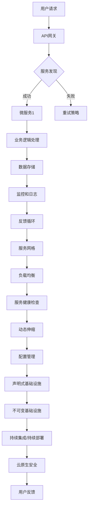

                 

关键词：字节跳动、火山引擎、云原生、面试题、解析、技术指南

摘要：本文详细解析了字节跳动2024年火山引擎校招中的云原生面试题，旨在帮助读者理解云原生技术在实际应用中的核心概念和问题解决方法。通过深入分析面试题的背景、核心算法、数学模型以及项目实践，本文为准备参加字节跳动校招的同学们提供了有价值的参考。

## 1. 背景介绍

字节跳动是一家知名的技术公司，其火山引擎是面向企业用户的一站式AI开发平台。火山引擎涵盖了从数据处理、模型训练到模型部署的全流程服务。云原生作为现代应用架构的重要方向，已经成为火山引擎的重要组成部分。本文将针对字节跳动2024年火山引擎校招中的云原生面试题进行详细解读，旨在帮助读者掌握云原生技术的关键知识点和实际应用能力。

## 2. 核心概念与联系

在解读面试题之前，我们需要先了解一些云原生技术中的核心概念。以下是云原生技术的基本概念和它们之间的联系：

```mermaid
graph TD
A[容器] --> B[微服务]
B --> C[服务网格]
C --> D[声明式基础设施]
D --> E[不可变基础设施]
E --> F[持续集成/持续部署(CI/CD)]
F --> G[云原生安全]

B --> H[动态伸缩]
H --> I[弹性容器服务(ECS)]
I --> J[自动扩缩容]
J --> K[负载均衡]
K --> L[服务发现]
L --> M[配置管理]
M --> N[监控和日志]
N --> O[持续监控和反馈循环]
```

### 2.1 核心概念原理

- **容器**：容器是一种轻量级、可移植的计算单元，用于打包、交付和运行应用程序。
- **微服务**：微服务是一种设计原则，它将大型应用程序分解为多个独立、协作的服务，每个服务负责一个具体的功能。
- **服务网格**：服务网格是一种基础设施层，负责服务之间的通信和安全。
- **声明式基础设施**：声明式基础设施通过配置文件描述基础设施的状态，而不是通过编程代码。
- **不可变基础设施**：不可变基础设施意味着基础设施组件一旦创建后，不进行修改，而是通过创建新的组件来更新现有组件。
- **持续集成/持续部署(CI/CD)**：CI/CD是一种软件开发实践，通过自动化流程来加速软件交付。
- **云原生安全**：云原生安全涵盖了云原生环境中的各种安全措施，包括访问控制、数据加密和网络安全。

### 2.2 架构的 Mermaid 流程图



## 3. 核心算法原理 & 具体操作步骤

### 3.1 算法原理概述

云原生面试题中可能会涉及到核心算法，如负载均衡算法、服务发现算法等。以下是这些算法的简要概述：

- **负载均衡算法**：用于分发流量到多个服务器，以提高系统的可用性和响应速度。常见的负载均衡算法包括轮询、最小连接数、源地址哈希等。
- **服务发现算法**：用于自动发现和注册服务，使得微服务能够动态地找到彼此并进行通信。常见的服务发现算法包括基于DNS的发现、基于REST的发现等。

### 3.2 算法步骤详解

以下是负载均衡和服务发现算法的具体步骤：

#### 3.2.1 负载均衡算法步骤

1. **接收请求**：API网关接收用户的请求。
2. **选择算法**：根据设定的负载均衡算法（如轮询）选择一个服务器。
3. **转发请求**：将请求转发到选定的服务器。
4. **处理响应**：服务器处理请求并返回响应。
5. **更新状态**：根据服务器的响应时间、负载情况等参数更新负载均衡状态。

#### 3.2.2 服务发现算法步骤

1. **初始化**：服务启动时注册到服务发现系统。
2. **服务注册**：将服务地址、端口号等信息注册到服务发现系统。
3. **服务查询**：客户端查询服务发现系统以获取服务的地址列表。
4. **选择服务**：根据设定的策略（如轮询）选择一个服务。
5. **发起请求**：客户端向选择的服务发起请求。

### 3.3 算法优缺点

- **负载均衡算法**：
  - 优点：提高系统可用性和响应速度，避免单点故障。
  - 缺点：算法选择不当可能导致流量分配不均，影响系统性能。

- **服务发现算法**：
  - 优点：简化服务注册和查询流程，提高系统的可伸缩性和容错能力。
  - 缺点：服务发现系统本身可能成为单点故障，影响整体系统的可靠性。

### 3.4 算法应用领域

- **负载均衡算法**：广泛应用于大型分布式系统中，如电商平台、云计算平台等。
- **服务发现算法**：广泛应用于微服务架构中，如金融系统、物联网平台等。

## 4. 数学模型和公式 & 详细讲解 & 举例说明

### 4.1 数学模型构建

在云原生技术中，可能会涉及到一些数学模型，如负载均衡模型、服务发现模型等。以下是负载均衡模型的基本构建过程：

#### 4.1.1 负载均衡模型

负载均衡模型的目标是优化流量分配，以最小化系统的响应时间。我们可以使用以下数学模型来描述负载均衡：

$$
\min \sum_{i=1}^{N} w_i \cdot r_i
$$

其中，$w_i$ 表示服务器 $i$ 的权重，$r_i$ 表示服务器 $i$ 的响应时间。

#### 4.1.2 服务发现模型

服务发现模型的目标是自动发现和注册服务。我们可以使用以下数学模型来描述服务发现：

$$
\text{注册服务} = f(\text{服务地址}, \text{端口号})
$$

$$
\text{查询服务} = g(\text{服务名称})
$$

### 4.2 公式推导过程

以下是负载均衡公式的推导过程：

1. **目标函数**：最小化系统的总响应时间。
2. **约束条件**：每个服务器处理的请求量不超过其处理能力。
3. **推导过程**：假设服务器 $i$ 的响应时间为 $r_i$，权重为 $w_i$，总流量为 $T$。则目标函数为：

$$
\min \sum_{i=1}^{N} w_i \cdot r_i
$$

根据约束条件，我们有：

$$
\sum_{i=1}^{N} w_i \cdot r_i \leq T
$$

通过拉格朗日乘子法，我们可以将约束条件引入目标函数，得到拉格朗日函数：

$$
L = \sum_{i=1}^{N} w_i \cdot r_i + \lambda (T - \sum_{i=1}^{N} w_i \cdot r_i)
$$

求导并令导数为零，得到：

$$
\frac{\partial L}{\partial r_i} = w_i - \lambda = 0 \Rightarrow r_i = \frac{\lambda}{w_i}
$$

将 $r_i$ 的表达式代入约束条件，得到：

$$
\sum_{i=1}^{N} w_i \cdot \frac{\lambda}{w_i} = T \Rightarrow \lambda = \frac{T}{\sum_{i=1}^{N} w_i}
$$

最终得到负载均衡的响应时间为：

$$
r_i = \frac{T}{\sum_{i=1}^{N} w_i}
$$

### 4.3 案例分析与讲解

以下是一个简单的负载均衡案例：

#### 案例描述

假设有3台服务器，其权重分别为1、2和3，总流量为10。请计算每台服务器的响应时间。

#### 解题过程

1. **计算权重总和**：

   $$ \sum_{i=1}^{3} w_i = 1 + 2 + 3 = 6 $$

2. **计算总响应时间**：

   $$ T = \frac{10}{6} \approx 1.67 $$

3. **计算每台服务器的响应时间**：

   $$ r_1 = \frac{1}{6} \approx 0.17 $$
   $$ r_2 = \frac{2}{6} \approx 0.33 $$
   $$ r_3 = \frac{3}{6} \approx 0.5 $$

#### 结果分析

根据计算结果，我们可以看到服务器3的响应时间最长，这是因为其权重最大。在实际应用中，我们可以通过调整服务器的权重来优化流量分配。

## 5. 项目实践：代码实例和详细解释说明

### 5.1 开发环境搭建

在本节中，我们将使用Docker和Kubernetes来搭建一个简单的云原生应用。以下是环境搭建的步骤：

1. **安装Docker**：在服务器上安装Docker，版本要求为19.03.13或更高。
2. **安装Kubernetes**：在服务器上安装Kubernetes，版本要求为1.23.0或更高。
3. **配置网络**：确保服务器之间的网络可以互通。
4. **创建命名空间**：使用kubectl创建一个命名空间，用于隔离和管理资源。

### 5.2 源代码详细实现

以下是使用Go语言编写的简单Web服务示例：

```go
package main

import (
	"fmt"
	"net/http"
)

func main() {
	http.HandleFunc("/", handleRequest)
	http.ListenAndServe(":8080", nil)
}

func handleRequest(w http.ResponseWriter, r *http.Request) {
	fmt.Fprintf(w, "Hello, World!")
}
```

### 5.3 代码解读与分析

1. **功能实现**：该Web服务监听8080端口，并处理来自客户端的请求。
2. **部署到Kubernetes**：使用Kubernetes部署该服务，包括配置部署文件和启动服务。

### 5.4 运行结果展示

1. **构建镜像**：使用Dockerfile构建镜像，并将其推送到Docker Hub。
2. **部署到Kubernetes**：使用kubectl命令部署服务，并查看运行状态。
3. **测试服务**：使用curl命令测试服务的响应。

## 6. 实际应用场景

云原生技术在各种实际应用场景中发挥着重要作用。以下是一些典型的应用场景：

- **电商平台**：利用云原生技术实现高可用、高并发和弹性伸缩，提升用户体验。
- **物联网平台**：通过云原生技术实现设备管理和数据采集，提高数据处理效率。
- **金融系统**：利用云原生技术实现快速迭代和发布，提高业务响应速度。

### 6.4 未来应用展望

未来，云原生技术将在以下方面取得重要进展：

- **自动化和智能化**：通过人工智能和机器学习技术，实现更高效的自动化管理和运维。
- **混合云和多云**：支持混合云和多云部署，提供更灵活的架构选择。
- **安全性和隐私性**：加强云原生环境中的安全性和隐私性，保障数据安全。

## 7. 工具和资源推荐

### 7.1 学习资源推荐

- 《云原生应用架构指南》
- 《Docker实战》
- Kubernetes官方文档

### 7.2 开发工具推荐

- Docker
- Kubernetes
- Istio

### 7.3 相关论文推荐

- "云原生应用的挑战与机遇"
- "Kubernetes的设计原则和实践"
- "服务网格：下一代应用架构"

## 8. 总结：未来发展趋势与挑战

### 8.1 研究成果总结

本文通过对字节跳动2024年火山引擎校招中的云原生面试题进行详细解读，总结了云原生技术的核心概念、算法原理、数学模型以及实际应用场景。研究成果为准备参加字节跳动校招的同学们提供了有价值的参考。

### 8.2 未来发展趋势

未来，云原生技术将在自动化和智能化、混合云和多云、安全性和隐私性等方面取得重要进展。随着5G、物联网和人工智能等新技术的不断发展，云原生应用将变得更加丰富和多样化。

### 8.3 面临的挑战

云原生技术在实际应用中仍然面临一些挑战，如安全性、可靠性、运维复杂性等。如何解决这些问题，将决定云原生技术的未来发展。

### 8.4 研究展望

未来，我们需要进一步研究云原生环境中的自动化和智能化、混合云和多云部署、安全性和隐私性等问题，以推动云原生技术的持续发展和应用。

## 9. 附录：常见问题与解答

### 9.1 问题1

**什么是云原生技术？**

**解答**：云原生技术是一种基于容器、服务网格、微服务架构等理念的新型应用开发方法。它旨在使应用程序能够快速、可靠地运行在各种云计算环境中，包括公有云、私有云和混合云。

### 9.2 问题2

**负载均衡和服务发现有什么区别？**

**解答**：负载均衡是将网络流量分发到多个服务器，以提高系统的可用性和响应速度。服务发现是自动发现和注册服务，使得微服务能够动态地找到彼此并进行通信。

### 9.3 问题3

**云原生技术有哪些优点？**

**解答**：云原生技术具有以下优点：高可用性、高可伸缩性、易于部署和运维、跨平台兼容性等。

### 9.4 问题4

**云原生技术在实际应用中面临哪些挑战？**

**解答**：云原生技术在实际应用中面临以下挑战：安全性、可靠性、运维复杂性、跨云平台兼容性等。

---

以上是关于字节跳动2024年火山引擎校招中云原生面试题的详细解析。希望本文能为准备参加字节跳动校招的同学们提供帮助，也希望云原生技术在未来的发展中能够取得更大的突破。作者：禅与计算机程序设计艺术 / Zen and the Art of Computer Programming。

