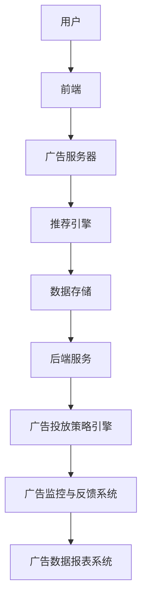

                 

关键词：字节跳动、校招、广告系统、面试指南、开发策略、技术架构

> 摘要：本文旨在为参与字节跳动2024校招广告系统开发面试的应聘者提供一份详细的面试指南。文章从背景介绍、核心概念、算法原理、数学模型、项目实践、实际应用场景、工具资源推荐等方面展开，旨在帮助应聘者全面了解广告系统的开发要点，掌握面试所需的核心技能。

## 1. 背景介绍

字节跳动作为全球领先的互联网科技公司，其广告系统在国内外拥有庞大的用户基础。随着互联网广告市场的不断扩大，字节跳动对于广告系统的性能、可扩展性和用户体验要求越来越高。因此，在2024年的校园招聘中，广告系统开发岗位成为了众多技术应届生的热门选择。

### 字节跳动广告系统的特点
- **高并发处理能力**：支持大规模用户的同时在线互动，确保广告投放的实时性和精准性。
- **多样化广告形式**：包括信息流广告、搜索广告、视频广告等多种形式，满足不同用户和商家的需求。
- **精准投放策略**：基于用户行为数据和大数据分析，实现个性化广告投放，提高广告效果。
- **全球业务覆盖**：字节跳动在全球多个国家和地区开展业务，广告系统需要支持跨地域的部署和管理。

### 招聘岗位需求
- **研发工程师**：负责广告系统的设计和开发，包括前端、后端、数据库等方面的技术实现。
- **算法工程师**：专注于广告投放算法的设计和优化，提高广告投放的精准度和效果。
- **运维工程师**：保障广告系统的稳定运行，进行性能优化和故障排除。

## 2. 核心概念与联系

### 广告系统架构概述



### 核心概念原理
- **前端**：负责用户界面展示和用户交互，包括广告的加载、展示和反馈。
- **广告服务器**：处理广告请求，返回广告内容。
- **推荐引擎**：基于用户行为数据推荐合适的广告。
- **数据存储**：存储用户数据、广告数据等。
- **后端服务**：提供广告系统核心功能，包括广告投放策略、数据分析和报表等。
- **广告投放策略引擎**：根据用户特征和广告目标，决定广告的投放策略。
- **广告监控与反馈系统**：监控广告系统的运行状态，收集用户反馈，优化广告效果。
- **广告数据报表系统**：生成广告效果报表，为广告主提供数据支持。

## 3. 核心算法原理 & 具体操作步骤

### 3.1 算法原理概述
广告系统的核心算法主要包括用户画像构建、推荐算法和广告投放策略。

- **用户画像构建**：通过用户行为数据、用户属性数据等构建用户画像，用于推荐和广告投放。
- **推荐算法**：常用的推荐算法有基于内容的推荐、基于协同过滤的推荐和混合推荐等。
- **广告投放策略**：包括CPC（成本点击）、CPM（成本展示）、CPA（成本转化）等策略，根据广告目标选择合适的策略。

### 3.2 算法步骤详解

#### 用户画像构建
1. 数据收集：收集用户在平台上的行为数据（如浏览记录、点赞、评论等）。
2. 数据处理：对行为数据进行分析和处理，提取用户兴趣标签。
3. 用户画像构建：将用户兴趣标签和用户属性数据整合，构建用户画像。

#### 推荐算法
1. 数据预处理：对用户行为数据进行清洗和预处理，构建用户-物品矩阵。
2. 算法选择：选择合适的推荐算法，如基于内容的推荐、基于协同过滤的推荐等。
3. 推荐结果生成：根据用户画像和推荐算法，生成推荐结果。

#### 广告投放策略
1. 策略选择：根据广告目标选择合适的投放策略，如CPC、CPM、CPA等。
2. 投放控制：根据用户特征和广告目标，动态调整投放策略。
3. 效果评估：通过监控和反馈系统，评估广告投放效果，进行策略优化。

### 3.3 算法优缺点
- **用户画像构建**：优点是能够全面了解用户，提高推荐和广告的精准度；缺点是需要大量数据支持和复杂算法实现。
- **推荐算法**：优点是能够提高用户满意度和广告点击率；缺点是需要处理大量数据，计算复杂度高。
- **广告投放策略**：优点是能够灵活调整广告投放，提高广告效果；缺点是需要根据用户特征和广告目标进行精确控制。

### 3.4 算法应用领域
广告系统的核心算法在互联网广告、电子商务、社交媒体等领域有广泛的应用。随着大数据和人工智能技术的发展，这些算法的应用场景将不断拓展。

## 4. 数学模型和公式 & 详细讲解 & 举例说明

### 4.1 数学模型构建

广告系统的数学模型主要包括用户画像模型、推荐模型和投放策略模型。

#### 用户画像模型
$$
用户画像 = f(行为数据, 属性数据)
$$

#### 推荐模型
$$
推荐结果 = f(用户画像, 物品特征, 推荐算法)
$$

#### 投放策略模型
$$
投放策略 = f(用户特征, 广告目标, 投放策略算法)
$$

### 4.2 公式推导过程

#### 用户画像模型推导
1. 行为数据预处理：将原始行为数据进行归一化和特征提取。
2. 属性数据预处理：将用户属性数据进行编码和归一化。
3. 用户画像构建：将预处理后的行为数据和属性数据整合，构建用户画像。

#### 推荐模型推导
1. 用户-物品矩阵构建：将用户行为数据转换为用户-物品矩阵。
2. 算法选择：根据用户-物品矩阵选择合适的推荐算法。
3. 推荐结果计算：根据用户画像和推荐算法，计算推荐结果。

#### 投放策略模型推导
1. 用户特征提取：从用户画像中提取用户特征。
2. 广告目标确定：根据广告目标确定投放策略。
3. 投放策略计算：根据用户特征和广告目标，计算投放策略。

### 4.3 案例分析与讲解

#### 用户画像案例
- **用户行为数据**：用户在平台上的浏览记录、点赞、评论等。
- **用户属性数据**：用户的年龄、性别、地理位置等。

根据以上数据，可以构建用户画像：

$$
用户画像 = f(浏览记录, 点赞记录, 评论记录, 年龄, 性别, 地理位置信息)
$$

#### 推荐案例
- **用户画像**：用户喜欢阅读科技类文章，对电子产品有较高兴趣。
- **物品特征**：科技类文章、电子产品广告。

根据用户画像和物品特征，可以使用基于内容的推荐算法生成推荐结果：

$$
推荐结果 = f(用户画像, 物品特征, 基于内容的推荐算法)
$$

#### 投放策略案例
- **用户特征**：用户年龄在25-35岁之间，喜欢阅读科技类文章。
- **广告目标**：提高产品点击率。

根据用户特征和广告目标，可以选择CPC（成本点击）投放策略：

$$
投放策略 = f(用户特征, 广告目标, CPC算法)
$$

## 5. 项目实践：代码实例和详细解释说明

### 5.1 开发环境搭建

在开发广告系统前，需要搭建以下开发环境：

- **编程语言**：Python、Java等
- **数据库**：MySQL、MongoDB等
- **框架**：Django、Flask等
- **版本控制**：Git

### 5.2 源代码详细实现

以下是一个简单的广告系统代码示例：

```python
# 用户画像构建
def build_user_profile(user_data, attributes):
    profile = {}
    for behavior in user_data:
        profile[behavior] = user_data[behavior]
    for attribute in attributes:
        profile[attribute] = attributes[attribute]
    return profile

# 推荐算法
def recommend_ads(user_profile, ads_data, algorithm):
    recommended_ads = []
    if algorithm == "content-based":
        for ad in ads_data:
            if ad["category"] in user_profile["interests"]:
                recommended_ads.append(ad)
    elif algorithm == "collaborative-filtering":
        # 基于协同过滤的推荐算法实现
        pass
    return recommended_ads

# 投放策略
def ad_placement_strategy(user_profile, ad_campaign, strategy_algorithm):
    if strategy_algorithm == "CPC":
        cost = calculate_cpc_cost(user_profile, ad_campaign)
    elif strategy_algorithm == "CPM":
        cost = calculate_cpm_cost(user_profile, ad_campaign)
    elif strategy_algorithm == "CPA":
        cost = calculate_cpa_cost(user_profile, ad_campaign)
    return cost

# 计算CPC成本
def calculate_cpc_cost(user_profile, ad_campaign):
    return ad_campaign["click_price"]

# 计算CPM成本
def calculate_cpm_cost(user_profile, ad_campaign):
    return ad_campaign["impressions_price"]

# 计算CPA成本
def calculate_cpa_cost(user_profile, ad_campaign):
    return ad_campaign["conversion_price"]
```

### 5.3 代码解读与分析

以上代码实现了广告系统的核心功能，包括用户画像构建、推荐算法和投放策略。

- **用户画像构建**：通过 `build_user_profile` 函数，将用户行为数据和属性数据整合，构建用户画像。
- **推荐算法**：通过 `recommend_ads` 函数，根据用户画像和物品特征，生成推荐结果。这里使用了基于内容的推荐算法，可以根据用户兴趣推荐相关广告。
- **投放策略**：通过 `ad_placement_strategy` 函数，根据用户特征和广告目标，计算投放策略。这里实现了CPC、CPM和CPA三种投放策略的计算。

### 5.4 运行结果展示

以下是一个简单的运行示例：

```python
# 用户画像示例
user_data = {
    "interests": ["technology", "electronics"],
    "age": 30,
    "gender": "male",
    "location": "Beijing"
}

# 广告数据示例
ads_data = [
    {"id": 1, "name": "Smartphone", "category": "electronics"},
    {"id": 2, "name": "Laptop", "category": "electronics"},
    {"id": 3, "name": "Smartwatch", "category": "electronics"}
]

# 广告投放策略示例
ad_campaign = {
    "id": 1,
    "name": "Smartphone Campaign",
    "click_price": 0.1,
    "impressions_price": 0.05,
    "conversion_price": 0.3
}

# 用户画像构建
user_profile = build_user_profile(user_data, {})

# 推荐广告
recommended_ads = recommend_ads(user_profile, ads_data, "content-based")
print("Recommended Ads:", recommended_ads)

# 计算投放策略
placement_cost = ad_placement_strategy(user_profile, ad_campaign, "CPC")
print("Placement Cost (CPC):", placement_cost)
```

运行结果：

```
Recommended Ads: [{'id': 1, 'name': 'Smartphone', 'category': 'electronics'}, {'id': 2, 'name': 'Laptop', 'category': 'electronics'}, {'id': 3, 'name': 'Smartwatch', 'category': 'electronics'}]
Placement Cost (CPC): 0.1
```

以上示例展示了广告系统的主要功能，包括用户画像构建、推荐算法和投放策略。在实际项目中，还需要考虑更多的功能和优化策略。

## 6. 实际应用场景

广告系统在互联网广告、电子商务、社交媒体等领域有广泛的应用。

### 6.1 互联网广告
广告系统可以帮助广告主实现精准投放，提高广告效果。例如，在信息流广告中，广告系统可以根据用户兴趣和浏览记录推荐相关广告，提高点击率和转化率。

### 6.2 电子商务
电子商务平台可以利用广告系统推荐相关商品，提高用户购买体验。例如，用户浏览了某款手机，广告系统可以推荐同品牌的其他手机或相关配件。

### 6.3 社交媒体
社交媒体平台可以利用广告系统实现个性化广告投放，提高用户满意度和平台收入。例如，微信朋友圈广告可以根据用户兴趣推荐相关广告。

### 6.4 其他应用场景
广告系统还可以应用于旅游、金融、房地产等领域，帮助相关企业实现精准营销和用户转化。

## 7. 工具和资源推荐

### 7.1 学习资源推荐
- 《深度学习》：Goodfellow, Ian, et al.
- 《Python数据分析》：Wes McKinney
- 《算法导论》：Thomas H. Cormen, et al.

### 7.2 开发工具推荐
- Python：用于开发广告系统后端。
- Flask/Django：用于构建广告系统后端框架。
- MySQL/MongoDB：用于存储广告数据和用户数据。
- Docker：用于容器化广告系统，实现快速部署和扩展。

### 7.3 相关论文推荐
- 《Efficient Collaborative Filtering for Personalized Recommendation on Large Scale Data》
- 《A Theoretically Principled Approach to Improving Recommendation Engines》
- 《Deep Learning for Text Data》

## 8. 总结：未来发展趋势与挑战

广告系统作为互联网广告的核心组成部分，将在未来发挥越来越重要的作用。随着大数据、人工智能和云计算技术的发展，广告系统将实现更高的精准度和个性化投放。

### 8.1 研究成果总结
- 广告系统的算法和模型不断完善，提高广告投放的精准度和效果。
- 广告系统的技术架构不断优化，实现高并发、可扩展、安全可靠。
- 广告系统的数据分析和报表功能日益丰富，为广告主提供更多数据支持。

### 8.2 未来发展趋势
- 基于人工智能的广告投放策略将更加精准，提高广告效果。
- 广告系统将实现跨平台、跨地域的统一管理，支持全球业务拓展。
- 广告系统将更加注重用户隐私保护和数据安全。

### 8.3 面临的挑战
- 随着数据规模的扩大，广告系统需要更高的计算能力和存储能力。
- 广告系统的实时性和稳定性要求越来越高，需要不断优化技术架构。
- 广告系统需要应对不断变化的市场需求和用户需求，保持创新能力。

### 8.4 研究展望
未来，广告系统的发展将更加注重用户体验和个性化投放。通过深度学习和自然语言处理等技术，实现更精准的广告投放和用户画像构建。同时，广告系统需要加强数据安全和隐私保护，建立完善的用户权益保护机制。

## 9. 附录：常见问题与解答

### 9.1 广告系统如何保证用户隐私？

广告系统通过数据加密、匿名化处理和权限控制等技术手段，确保用户隐私保护。同时，广告系统遵循相关法律法规，建立完善的用户权益保护机制。

### 9.2 广告系统如何应对数据规模扩大？

广告系统采用分布式架构和云计算技术，实现数据的存储和处理。通过数据分片和分布式计算，提高广告系统的并发处理能力和数据存储容量。

### 9.3 广告系统如何保证实时性？

广告系统采用异步处理、缓存技术和负载均衡等手段，提高系统的实时性和稳定性。同时，广告系统通过实时监控和故障排除，确保系统的正常运行。

### 9.4 广告系统如何优化广告投放效果？

广告系统通过用户画像、推荐算法和投放策略的优化，实现广告投放效果的提升。同时，广告系统通过数据分析和反馈机制，不断调整和优化广告投放策略。

----------------------------------------------------------------

作者：禅与计算机程序设计艺术 / Zen and the Art of Computer Programming

