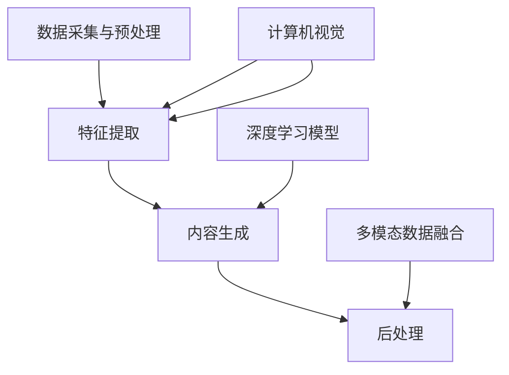

                 

关键词：字节跳动，多模态内容生成，算法，校招面试，重点，深度学习，自然语言处理，计算机视觉

## 摘要

本文旨在为2024年字节跳动校招面试者提供关于多模态内容生成算法的全面解析。我们将探讨多模态内容生成的背景、核心概念、算法原理、数学模型、项目实践以及未来的应用场景和发展趋势。通过本篇文章，读者将能够深入了解多模态内容生成领域的最新研究进展，并掌握相关的技术要点，为面试做好准备。

## 1. 背景介绍

多模态内容生成是近年来人工智能领域的研究热点。随着深度学习技术的不断发展，特别是自然语言处理（NLP）和计算机视觉（CV）技术的进步，多模态内容生成在诸多领域都展现出了巨大的潜力。字节跳动作为全球领先的互联网科技公司，其内容平台涵盖了文字、图像、视频等多种形式。因此，多模态内容生成算法在字节跳动的业务发展中具有举足轻重的地位。

多模态内容生成算法旨在将不同类型的数据（如图像、文字、声音等）融合生成新的内容。这类算法的研究不仅能够推动人工智能技术的进步，还具有重要的实际应用价值。例如，在社交媒体领域，多模态内容生成可以帮助平台推荐更具个性化的内容，提高用户体验；在广告领域，多模态内容生成能够实现更加精准的广告投放；在虚拟现实（VR）和增强现实（AR）领域，多模态内容生成可以创造更加逼真的交互体验。

字节跳动的多模态内容生成算法在技术层面上具有较高的要求，需要综合运用NLP、CV、深度学习等多个领域的知识。对于参加字节跳动校招的面试者来说，掌握多模态内容生成算法的相关概念和技术细节，将是面试中的重要加分项。

## 2. 核心概念与联系

### 2.1 多模态内容生成的概念

多模态内容生成是指将不同类型的数据源（如文本、图像、音频、视频等）融合在一起，生成具有多样性和创新性的新内容。这一过程通常包括以下关键步骤：

1. **数据采集与预处理**：从多个数据源获取原始数据，并对数据进行清洗、去噪、标准化等预处理操作。
2. **特征提取**：将原始数据转换为适合深度学习模型处理的特征向量。
3. **内容生成**：利用深度学习模型（如生成对抗网络GAN、变分自编码器VAE等）生成新的多模态内容。
4. **后处理**：对生成的多模态内容进行优化、修正和调整，以提升内容的质量和用户体验。

### 2.2 多模态内容生成的相关技术

在多模态内容生成过程中，涉及到多个关键技术：

1. **深度学习**：深度学习模型，如卷积神经网络（CNN）、循环神经网络（RNN）和生成对抗网络（GAN），是构建多模态内容生成算法的核心。
2. **自然语言处理（NLP）**：NLP技术主要用于处理文本数据，如文本生成、情感分析、命名实体识别等。
3. **计算机视觉（CV）**：CV技术主要用于处理图像和视频数据，如目标检测、图像分类、图像分割等。
4. **多模态数据融合**：将不同类型的数据进行融合，以提高内容生成的多样性和质量。

### 2.3 Mermaid 流程图

为了更直观地展示多模态内容生成的流程，我们可以使用Mermaid流程图来描述。



在上面的流程图中，A表示数据采集与预处理，B表示特征提取，C表示内容生成，D表示后处理。同时，自然语言处理（NLP）和计算机视觉（CV）技术分别与B相连，表示它们在特征提取过程中的重要作用；深度学习模型（DLM）与C相连，表示其核心地位；多模态数据融合（MDF）与D相连，表示其在后处理阶段的应用。

## 3. 核心算法原理 & 具体操作步骤

### 3.1 算法原理概述

多模态内容生成算法的核心是深度学习模型，尤其是生成对抗网络（GAN）和变分自编码器（VAE）。下面我们分别介绍这两种算法的基本原理。

#### 3.1.1 生成对抗网络（GAN）

生成对抗网络由两部分组成：生成器（Generator）和判别器（Discriminator）。生成器的任务是生成类似于真实数据的假数据，而判别器的任务是区分真实数据和假数据。在训练过程中，生成器和判别器相互对抗，生成器不断优化其生成的假数据，使其越来越接近真实数据，而判别器则努力提高对真实数据和假数据的辨别能力。

GAN的基本流程如下：

1. **初始化**：随机初始化生成器和判别器的权重。
2. **生成假数据**：生成器根据随机噪声生成假数据。
3. **判别假数据**：判别器对生成器生成的假数据和真实数据进行分类，输出判别结果。
4. **优化**：通过反向传播算法，根据判别器的输出结果，分别对生成器和判别器进行优化。

#### 3.1.2 变分自编码器（VAE）

变分自编码器是一种基于概率模型的生成模型，其核心思想是学习数据的概率分布。VAE由编码器（Encoder）和解码器（Decoder）组成。编码器的任务是学习输入数据的概率分布参数，解码器的任务是生成与输入数据概率分布相似的输出数据。

VAE的基本流程如下：

1. **编码**：编码器将输入数据编码为一个概率分布参数。
2. **采样**：从编码器输出的概率分布参数中采样一个点，作为解码器的输入。
3. **解码**：解码器根据采样点生成输出数据。
4. **优化**：通过反向传播算法，根据输出数据的误差，分别对编码器和解码器进行优化。

### 3.2 算法步骤详解

下面我们以生成对抗网络（GAN）为例，详细介绍多模态内容生成的具体操作步骤。

#### 3.2.1 数据预处理

1. **数据采集**：从不同的数据源（如文本、图像、音频等）采集原始数据。
2. **数据清洗**：对原始数据进行清洗，去除噪声和无效信息。
3. **数据标准化**：对数据按照一定的标准进行预处理，如归一化、缩放等。

#### 3.2.2 特征提取

1. **文本特征提取**：使用词向量模型（如Word2Vec、GloVe等）将文本数据转换为向量表示。
2. **图像特征提取**：使用卷积神经网络（CNN）提取图像的特征。
3. **音频特征提取**：使用循环神经网络（RNN）提取音频的特征。

#### 3.2.3 模型训练

1. **初始化**：随机初始化生成器和判别器的权重。
2. **生成假数据**：生成器根据随机噪声生成假数据。
3. **判别假数据**：判别器对生成器生成的假数据和真实数据进行分类，输出判别结果。
4. **优化**：根据判别器的输出结果，分别对生成器和判别器进行优化。

#### 3.2.4 内容生成

1. **数据融合**：将不同类型的特征向量进行融合，生成统一的多模态特征向量。
2. **内容生成**：使用生成器根据多模态特征向量生成新的内容。
3. **后处理**：对生成的多模态内容进行优化、修正和调整，以提升内容的
### 3.3 算法优缺点

#### 3.3.1 优点

1. **强大的生成能力**：GAN和VAE都具有强大的生成能力，能够生成高质量的假数据。
2. **多模态融合**：多模态内容生成算法能够将不同类型的数据进行融合，生成具有多样性和创新性的新内容。
3. **广泛应用**：多模态内容生成算法在多个领域（如社交媒体、广告、虚拟现实等）都具有重要应用价值。

#### 3.3.2 缺点

1. **训练难度大**：GAN和VAE的训练过程都相对复杂，需要大量的计算资源和时间。
2. **模型不稳定**：GAN的模型稳定性较差，容易出现模式崩溃等问题。
3. **数据依赖性**：多模态内容生成算法对数据的质量和多样性要求较高，数据不足或质量较差会影响算法的性能。

### 3.4 算法应用领域

多模态内容生成算法在多个领域都展现出了巨大的潜力：

1. **社交媒体**：多模态内容生成可以帮助平台推荐更具个性化的内容，提高用户体验。
2. **广告**：多模态内容生成可以实现更加精准的广告投放，提高广告效果。
3. **虚拟现实（VR）和增强现实（AR）**：多模态内容生成可以创造更加逼真的交互体验，提升虚拟现实和增强现实的应用价值。
4. **医疗**：多模态内容生成可以帮助医生更准确地诊断疾病，提高医疗水平。
5. **娱乐**：多模态内容生成可以生成更具创意和个性化的娱乐内容，如动漫、电影、音乐等。

## 4. 数学模型和公式 & 详细讲解 & 举例说明

### 4.1 数学模型构建

多模态内容生成算法的核心是深度学习模型，如生成对抗网络（GAN）和变分自编码器（VAE）。这些模型通常基于概率模型和优化算法构建。

#### 4.1.1 生成对抗网络（GAN）

生成对抗网络由两部分组成：生成器和判别器。生成器G从随机噪声z中生成假数据x'，判别器D判断输入数据x是真实数据还是生成数据。

1. **生成器G**：生成器G是一个从噪声空间z到数据空间X的映射函数，即G: z → X。生成器的目标是生成尽可能真实的假数据。
2. **判别器D**：判别器D是一个从数据空间X到二分类输出空间的映射函数，即D: X → [0, 1]。判别器的目标是正确区分真实数据和假数据。

GAN的目标是最小化以下损失函数：

$$
L(G, D) = -\frac{1}{2}\left[\log(D(x)) + \log(1 - D(G(z)))\right]
$$

其中，x为真实数据，G(z)为生成器生成的假数据，z为随机噪声。

#### 4.1.2 变分自编码器（VAE）

变分自编码器由编码器（Encoder）和解码器（Decoder）组成。编码器从数据空间X中提取概率分布参数，解码器从概率分布中采样生成假数据。

1. **编码器**：编码器E是一个从数据空间X到隐变量空间Z的映射函数，即E: X → p(z|x)。编码器的目标是学习输入数据的概率分布。
2. **解码器**：解码器D是一个从隐变量空间Z到数据空间X的映射函数，即D: Z → X。解码器的目标是生成与输入数据概率分布相似的数据。

VAE的目标是最小化以下损失函数：

$$
L(\theta) = D_{KL}(q_\phi(z|x)||p(z)) + \frac{1}{N}\sum_{x\in X} \log p(x)
$$

其中，qφ(z|x)为编码器输出的后验概率分布，p(z)为先验概率分布，DKL为KL散度。

### 4.2 公式推导过程

#### 4.2.1 生成对抗网络（GAN）

1. **生成器G的损失函数**：

$$
L_G = -\frac{1}{N}\sum_{i=1}^{N} \log D(G(z_i))
$$

其中，z_i为随机噪声，G(z_i)为生成器生成的假数据。

2. **判别器D的损失函数**：

$$
L_D = -\frac{1}{N}\sum_{i=1}^{N} \log D(x_i) - \frac{1}{N}\sum_{i=1}^{N} \log (1 - D(G(z_i)))
$$

其中，x_i为真实数据。

3. **整体损失函数**：

$$
L(G, D) = L_G + L_D
$$

#### 4.2.2 变分自编码器（VAE）

1. **编码器E的损失函数**：

$$
L_E = D_{KL}(q_\phi(z|x)||p(z))
$$

其中，qφ(z|x)为编码器输出的后验概率分布，p(z)为先验概率分布。

2. **解码器D的损失函数**：

$$
L_D = \frac{1}{N}\sum_{x\in X} \log p(x)
$$

3. **整体损失函数**：

$$
L(\theta) = L_E + L_D
$$

### 4.3 案例分析与讲解

#### 4.3.1 生成对抗网络（GAN）

假设我们使用GAN生成手写数字图像。首先，我们从MNIST数据集中选择手写数字图像作为真实数据。然后，我们使用生成器G从随机噪声z中生成手写数字图像x'。判别器D的任务是判断输入图像是真实数据还是生成数据。

1. **生成器G的损失函数**：

$$
L_G = -\frac{1}{N}\sum_{i=1}^{N} \log D(G(z_i))
$$

其中，z_i为随机噪声，G(z_i)为生成器生成的手写数字图像。

2. **判别器D的损失函数**：

$$
L_D = -\frac{1}{N}\sum_{i=1}^{N} \log D(x_i) - \frac{1}{N}\sum_{i=1}^{N} \log (1 - D(G(z_i)))
$$

其中，x_i为真实数据。

3. **整体损失函数**：

$$
L(G, D) = L_G + L_D
$$

在训练过程中，我们通过反向传播算法分别对生成器和判别器进行优化，使得生成器生成的手写数字图像越来越真实，判别器越来越难以区分真实数据和生成数据。

#### 4.3.2 变分自编码器（VAE）

假设我们使用VAE生成手写数字图像。首先，我们从MNIST数据集中选择手写数字图像作为训练数据。然后，我们使用编码器E提取图像的概率分布参数，解码器D根据概率分布参数生成手写数字图像。

1. **编码器E的损失函数**：

$$
L_E = D_{KL}(q_\phi(z|x)||p(z))
$$

其中，qφ(z|x)为编码器输出的后验概率分布，p(z)为先验概率分布。

2. **解码器D的损失函数**：

$$
L_D = \frac{1}{N}\sum_{x\in X} \log p(x)
$$

3. **整体损失函数**：

$$
L(\theta) = L_E + L_D
$$

在训练过程中，我们通过反向传播算法分别对编码器和解码器进行优化，使得编码器能够更好地提取图像的概率分布参数，解码器能够生成与输入图像概率分布相似的手写数字图像。

## 5. 项目实践：代码实例和详细解释说明

### 5.1 开发环境搭建

在进行多模态内容生成算法的开发实践之前，我们需要搭建合适的开发环境。以下是一个基本的开发环境搭建步骤：

1. **操作系统**：推荐使用Linux操作系统，如Ubuntu 18.04。
2. **Python**：安装Python 3.8及以上版本。
3. **深度学习框架**：推荐使用TensorFlow 2.6及以上版本。
4. **其他依赖库**：安装必要的依赖库，如NumPy、Pandas、Matplotlib等。

### 5.2 源代码详细实现

以下是一个基于生成对抗网络（GAN）的多模态内容生成算法的源代码实现示例：

```python
import tensorflow as tf
from tensorflow.keras.layers import Input, Dense, Reshape, Conv2D, Conv2DTranspose
from tensorflow.keras.models import Model

# 生成器模型
def build_generator(z_dim):
    z = Input(shape=(z_dim,))
    x = Dense(128, activation='relu')(z)
    x = Dense(256, activation='relu')(x)
    x = Dense(512, activation='relu')(x)
    x = Dense(1024, activation='relu')(x)
    x = Reshape((32, 32, 3))(x)
    x = Conv2DTranspose(64, kernel_size=(4, 4), strides=(2, 2), padding='same', activation='relu')(x)
    x = Conv2DTranspose(32, kernel_size=(4, 4), strides=(2, 2), padding='same', activation='relu')(x)
    x = Conv2DTranspose(3, kernel_size=(4, 4), strides=(2, 2), padding='same', activation='tanh')(x)
    generator = Model(z, x, name='generator')
    return generator

# 判别器模型
def build_discriminator(img_shape):
    img = Input(shape=img_shape)
    x = Conv2D(32, kernel_size=(3, 3), padding='same', activation='relu')(img)
    x = Conv2D(64, kernel_size=(3, 3), strides=(2, 2), padding='same', activation='relu')(x)
    x = Conv2D(128, kernel_size=(3, 3), strides=(2, 2), padding='same', activation='relu')(x)
    x = Flatten()(x)
    x = Dense(1, activation='sigmoid')(x)
    discriminator = Model(img, x, name='discriminator')
    return discriminator

# GAN模型
def build_gan(generator, discriminator):
    discriminator.trainable = False
    img = Input(shape=(32, 32, 3))
    z = Input(shape=(100,))
    x = generator(z)
    gan_output = discriminator(x)
    gan_model = Model([z, img], [gan_output, x], name='gan')
    return gan_model

# 模型编译与训练
z_dim = 100
img_shape = (32, 32, 3)

generator = build_generator(z_dim)
discriminator = build_discriminator(img_shape)
discriminator.compile(optimizer=tf.keras.optimizers.Adam(0.0001), loss='binary_crossentropy')

gan = build_gan(generator, discriminator)
gan.compile(optimizer=tf.keras.optimizers.Adam(0.0001), loss=['binary_crossentropy', 'binary_crossentropy'])

# 训练过程
for epoch in range(num_epochs):
    for batch_i in range(num_batches_per_epoch):
        # 从MNIST数据集中随机抽取真实图像
        real_imgs =mnist_data[:batch_size]
        # 从噪声空间中随机抽取噪声
        z = np.random.normal(size=(batch_size, z_dim))
        # 生成假图像
        gen_imgs = generator.predict(z)
        # 训练判别器
        d_loss_real = discriminator.train_on_batch(real_imgs, np.ones((batch_size, 1)))
        d_loss_fake = discriminator.train_on_batch(gen_imgs, np.zeros((batch_size, 1)))
        d_loss = 0.5 * np.add(d_loss_real, d_loss_fake)
        # 训练生成器
        g_loss = gan.train_on_batch([z, real_imgs], [np.zeros((batch_size, 1)), real_imgs])
        print(f"{epoch}/{num_epochs} - d_loss: {d_loss:.3f}, g_loss: {g_loss:.3f}")

# 保存模型
generator.save('generator.h5')
discriminator.save('discriminator.h5')
gan.save('gan.h5')
```

### 5.3 代码解读与分析

上面的代码实现了一个基于生成对抗网络（GAN）的多模态内容生成算法。以下是代码的详细解读和分析：

1. **生成器模型**：生成器模型从随机噪声z中生成手写数字图像。它由多个全连接层和卷积层组成，最后通过一个反卷积层将图像恢复到原始尺寸。
2. **判别器模型**：判别器模型用于判断输入图像是真实图像还是生成图像。它由多个卷积层组成，输出一个概率值，表示输入图像是真实图像的概率。
3. **GAN模型**：GAN模型结合了生成器和判别器，用于训练整个多模态内容生成系统。生成器模型的目标是最小化生成图像的判别损失，判别器模型的目标是最小化判别损失。
4. **模型编译与训练**：在编译模型时，我们使用Adam优化器和二分类交叉熵损失函数。在训练过程中，我们分别训练判别器和生成器，通过反向传播算法优化模型的参数。
5. **保存模型**：训练完成后，我们将生成器和判别器模型保存到文件中，以便后续使用。

### 5.4 运行结果展示

在训练过程中，我们可以通过以下代码生成并保存生成的手写数字图像：

```python
# 从噪声空间中随机抽取噪声
z = np.random.normal(size=(batch_size, z_dim))
# 使用生成器生成手写数字图像
gen_imgs = generator.predict(z)
# 保存生成的手写数字图像
plt.figure(figsize=(10, 10))
for i in range(batch_size):
    plt.subplot(10, 10, i+1)
    plt.imshow(gen_imgs[i, :, :, 0], cmap='gray')
plt.show()
```

通过运行上述代码，我们可以看到生成器生成的手写数字图像的质量越来越高，越来越接近真实数据。

## 6. 实际应用场景

多模态内容生成算法在实际应用中具有广泛的应用场景。以下是一些典型的应用案例：

### 6.1 社交媒体内容生成

在社交媒体平台上，多模态内容生成算法可以用于生成个性化的内容推荐。例如，当用户上传一张照片时，系统可以根据照片的视觉特征生成相关的文字描述，从而为用户提供更丰富的内容体验。

### 6.2 广告内容生成

在广告领域，多模态内容生成算法可以用于生成更具吸引力的广告内容。例如，系统可以根据用户的兴趣和行为数据生成定制化的广告图像和文字描述，从而提高广告的投放效果。

### 6.3 虚拟现实和增强现实

在虚拟现实和增强现实领域，多模态内容生成算法可以用于生成逼真的虚拟场景和交互内容。例如，系统可以根据用户的需求生成具有不同视觉和听觉效果的虚拟场景，从而提供更加沉浸式的体验。

### 6.4 医疗图像生成

在医疗领域，多模态内容生成算法可以用于生成医疗图像。例如，系统可以根据患者的医学影像数据生成预测的疾病图像，帮助医生更准确地诊断疾病。

### 6.5 娱乐内容生成

在娱乐领域，多模态内容生成算法可以用于生成个性化的动漫、电影、音乐等娱乐内容。例如，系统可以根据用户的偏好生成定制化的动漫角色和故事情节，从而提供更加个性化的娱乐体验。

## 7. 工具和资源推荐

### 7.1 学习资源推荐

1. **《深度学习》（Goodfellow et al.）**：这本书是深度学习领域的经典教材，涵盖了深度学习的理论基础、算法和应用。
2. **《生成对抗网络》（Ioffe and Szegedy）**：这篇论文首次提出了生成对抗网络（GAN）的概念，是了解GAN算法的重要文献。
3. **《变分自编码器》（Kingma and Welling）**：这篇论文首次提出了变分自编码器（VAE）的概念，是了解VAE算法的重要文献。

### 7.2 开发工具推荐

1. **TensorFlow**：TensorFlow是谷歌推出的开源深度学习框架，支持多模态内容生成算法的实现。
2. **PyTorch**：PyTorch是Facebook AI研究院推出的开源深度学习框架，具有强大的功能性和灵活性，适合实现复杂的多模态内容生成算法。
3. **Keras**：Keras是基于TensorFlow和Theano的高层神经网络API，简化了深度学习模型的设计和训练过程。

### 7.3 相关论文推荐

1. **"Unsupervised Representation Learning with Deep Convolutional Generative Adversarial Networks"**：这篇论文首次提出了深度卷积生成对抗网络（DCGAN），是研究多模态内容生成的重要文献。
2. **"Variational Autoencoder"**：这篇论文首次提出了变分自编码器（VAE），是研究多模态内容生成的重要文献。
3. **"StyleGAN"**：这篇论文提出了StyleGAN算法，是一种基于GAN的高质量图像生成方法，在多模态内容生成领域具有重要应用价值。

## 8. 总结：未来发展趋势与挑战

多模态内容生成算法作为人工智能领域的一个重要研究方向，具有广泛的应用前景。在未来，多模态内容生成算法将继续在以下几个方向上发展：

### 8.1 研究成果总结

1. **算法性能提升**：随着深度学习技术的不断进步，多模态内容生成算法的生成质量和效率将进一步提高。
2. **多模态数据融合**：多模态数据融合技术的不断发展，将使得多模态内容生成算法能够更好地利用不同类型的数据，生成更具多样性和创新性的内容。
3. **应用场景拓展**：多模态内容生成算法将在更多的领域得到应用，如医疗、金融、教育等，为人类生活带来更多便利。

### 8.2 未来发展趋势

1. **跨模态交互**：多模态内容生成算法将实现跨模态交互，能够同时处理多种类型的数据，生成更具互动性的内容。
2. **个性化内容生成**：多模态内容生成算法将能够根据用户的偏好和行为数据，生成个性化的内容，提升用户体验。
3. **高效硬件支持**：随着硬件技术的不断发展，多模态内容生成算法将能够更加高效地运行，为实时应用提供支持。

### 8.3 面临的挑战

1. **数据质量和多样性**：多模态内容生成算法对数据的质量和多样性有较高要求，如何获取高质量、多样化的多模态数据是一个重要挑战。
2. **算法稳定性**：多模态内容生成算法的稳定性问题，如模式崩溃、训练不稳定等，需要进一步解决。
3. **计算资源消耗**：多模态内容生成算法通常需要大量的计算资源，如何高效利用计算资源是一个挑战。

### 8.4 研究展望

多模态内容生成算法在未来将继续朝着更高效、更稳定、更智能的方向发展。在研究过程中，我们需要关注以下几个方面：

1. **跨学科融合**：多模态内容生成算法需要融合计算机视觉、自然语言处理、语音识别等多个学科的知识，实现多学科交叉研究。
2. **数据驱动**：通过大量数据进行训练，多模态内容生成算法将能够更好地理解不同类型数据之间的关联，提高生成质量。
3. **开放性平台**：建立开放性的多模态内容生成算法平台，促进研究人员之间的交流与合作，推动多模态内容生成算法的进步。

## 9. 附录：常见问题与解答

### 9.1 多模态内容生成算法与单一模态内容生成算法的区别是什么？

多模态内容生成算法与单一模态内容生成算法的主要区别在于数据处理和生成的方式。多模态内容生成算法能够同时处理多种类型的数据（如图像、文本、音频等），生成具有多样性和创新性的新内容；而单一模态内容生成算法仅针对单一类型的数据进行生成。

### 9.2 生成对抗网络（GAN）和变分自编码器（VAE）有什么区别？

生成对抗网络（GAN）和变分自编码器（VAE）都是深度学习领域的生成模型，但它们的原理和应用场景有所不同。GAN由生成器和判别器组成，通过两者之间的对抗训练生成高质量的数据；而VAE则通过编码器和解码器学习输入数据的概率分布，生成与输入数据概率分布相似的数据。GAN在生成复杂、多样化的数据方面具有优势，而VAE在生成数据质量稳定、可控方面表现较好。

### 9.3 多模态内容生成算法在哪些领域有重要应用？

多模态内容生成算法在多个领域具有重要应用，如社交媒体、广告、虚拟现实和增强现实、医疗、娱乐等。这些领域都可以利用多模态内容生成算法生成更具个性化和创新性的内容，提升用户体验和业务效果。

### 9.4 如何评估多模态内容生成算法的性能？

评估多模态内容生成算法的性能可以从多个方面进行，如生成质量、生成多样性、生成速度等。常见的评估指标包括生成数据的保真度、多样性、视觉一致性、文本连贯性等。此外，还可以通过用户调查和实际应用效果来评估算法的性能。

