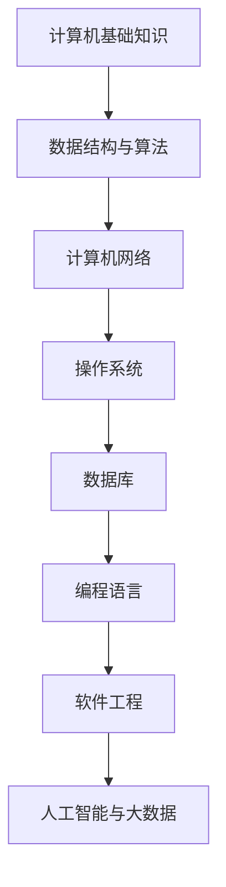

                 

关键词：字节跳动、校园招聘、技术岗位、面试题汇总

> 摘要：本文将为您全面梳理和分析字节跳动2024校园招聘技术岗位的面试题，帮助您更好地准备面试，提高竞争力。

## 1. 背景介绍

字节跳动是一家全球领先的互联网科技公司，旗下拥有多款知名产品，如今日头条、抖音、TikTok等。随着公司的快速发展，字节跳动每年都会举办大规模的校园招聘活动，吸引优秀的高校毕业生加入。2024年，字节跳动将继续开展校园招聘，为广大技术人才提供丰富的职位和广阔的发展空间。

本文旨在为准备参加字节跳动2024校园招聘技术岗位面试的同学们提供一份全面的面试题汇总，帮助大家更好地了解面试内容，提升面试通过率。

## 2. 核心概念与联系

在撰写本文前，我们首先需要了解一些核心概念和联系。以下是字节跳动2024校园招聘技术岗位面试题汇总中的一些核心概念和联系，以及它们的Mermaid流程图表示：



### 2.1 计算机基础知识

计算机基础知识是技术面试的基石，包括计算机组成原理、操作系统、计算机网络、数据库等方面的知识。

### 2.2 数据结构与算法

数据结构与算法是计算机科学的核心内容，涉及数组、链表、树、图、排序、查找等算法的实现和应用。

### 2.3 计算机网络

计算机网络主要研究网络协议、网络设备、网络通信原理等方面的知识，包括TCP/IP、HTTP、DNS等协议。

### 2.4 操作系统

操作系统是计算机系统的核心，负责管理和控制计算机硬件资源，包括进程管理、内存管理、文件系统等。

### 2.5 数据库

数据库是存储和管理数据的系统，涉及数据库模型、数据库设计、SQL查询等。

### 2.6 编程语言

编程语言是实现计算机程序的工具，包括C、C++、Java、Python等。

### 2.7 软件工程

软件工程是确保软件开发过程高效、高质量的学科，包括需求分析、设计、编码、测试等。

### 2.8 人工智能与大数据

人工智能与大数据是当前热门领域，涉及机器学习、深度学习、数据挖掘、数据分析等。

## 3. 核心算法原理 & 具体操作步骤

### 3.1 算法原理概述

算法是解决问题的一系列步骤，计算机科学中的算法设计至关重要。字节跳动2024校园招聘技术岗位面试题汇总中的算法问题主要涉及以下几个方面：

1. 排序算法：冒泡排序、选择排序、插入排序、快速排序等。
2. 查找算法：二分查找、顺序查找、哈希查找等。
3. 图算法：深度优先搜索、广度优先搜索、最短路径算法等。
4. 动态规划：最值问题、背包问题、最长公共子序列等。
5. 贪心算法：活动选择问题、最优合并方式等。

### 3.2 算法步骤详解

以下是字节跳动2024校园招聘技术岗位面试题汇总中的一些典型算法问题的解题步骤：

#### 3.2.1 冒泡排序

1. 遍历待排序的序列。
2. 在遍历过程中，比较相邻的两个元素。
3. 如果第一个元素大于第二个元素，交换它们。
4. 重复上述步骤，直到序列有序。

```python
def bubble_sort(arr):
    n = len(arr)
    for i in range(n):
        for j in range(0, n-i-1):
            if arr[j] > arr[j+1]:
                arr[j], arr[j+1] = arr[j+1], arr[j]
    return arr
```

#### 3.2.2 二分查找

1. 将序列分成两部分，取中间元素与目标值比较。
2. 如果目标值等于中间元素，返回中间元素的索引。
3. 如果目标值小于中间元素，递归地在左半部分查找。
4. 如果目标值大于中间元素，递归地在右半部分查找。
5. 重复上述步骤，直到找到目标值或序列为空。

```python
def binary_search(arr, target):
    left, right = 0, len(arr)-1
    while left <= right:
        mid = (left + right) // 2
        if arr[mid] == target:
            return mid
        elif arr[mid] < target:
            left = mid + 1
        else:
            right = mid - 1
    return -1
```

#### 3.2.3 深度优先搜索

1. 选择一个起始节点，将其标记为已访问。
2. 检查该节点的邻接节点，如果邻接节点未访问过，则将其加入访问列表并递归调用深度优先搜索。
3. 重复上述步骤，直到所有节点都被访问。

```python
def dfs(graph, node, visited):
    visited.add(node)
    for neighbor in graph[node]:
        if neighbor not in visited:
            dfs(graph, neighbor, visited)
```

### 3.3 算法优缺点

1. 排序算法：冒泡排序、选择排序、插入排序等算法时间复杂度较高，但实现简单；快速排序、归并排序等算法时间复杂度较低，但实现复杂。
2. 查找算法：二分查找时间复杂度较低，但仅适用于有序序列；顺序查找和哈希查找时间复杂度较高。
3. 图算法：深度优先搜索和广度优先搜索时间复杂度相同，但应用场景不同；最短路径算法时间复杂度较高，但求解最短路径。

### 3.4 算法应用领域

排序算法、查找算法、图算法等在计算机科学和实际应用中都有广泛的应用，如数据库索引、网络路由、图论算法、机器学习等。

## 4. 数学模型和公式 & 详细讲解 & 举例说明

### 4.1 数学模型构建

数学模型是解决实际问题的有力工具，以下是字节跳动2024校园招聘技术岗位面试题汇总中的一些典型数学模型：

1. 最优化模型：如线性规划、非线性规划等。
2. 动态规划模型：如背包问题、最长公共子序列等。
3. 图模型：如最短路径算法、最小生成树算法等。

### 4.2 公式推导过程

以下是字节跳动2024校园招聘技术岗位面试题汇总中的一些典型数学公式推导过程：

#### 4.2.1 最小生成树

最小生成树（Minimum Spanning Tree，MST）的公式推导：

设G=(V,E)为连通无向图，其中V为顶点集，E为边集。设w(e)为边e的权值，则最小生成树的权值定义为：

$$
W(MST) = \sum_{e \in MST} w(e)
$$

为了找到最小生成树，我们可以采用Kruskal算法或Prim算法。以下是Kruskal算法的公式推导：

1. 将所有边按照权值从小到大排序。
2. 遍历排序后的边集，对于每条边e：
   - 如果e的两个顶点不在当前生成树的某个连通分量中，则将e添加到生成树中，并合并生成树的连通分量。
   - 如果e的两个顶点已经在生成树的某个连通分量中，则跳过该边。

#### 4.2.2 最长公共子序列

最长公共子序列（Longest Common Subsequence，LCS）的公式推导：

设X和Y为两个序列，求LCS问题可以转化为动态规划问题。设LCS[i][j]表示X的前i个字符和Y的前j个字符的最长公共子序列的长度，则有以下状态转移方程：

$$
LCS[i][j] =
\begin{cases}
0, & \text{如果 } i=0 \text{ 或 } j=0 \\
LCS[i-1][j-1] + 1, & \text{如果 } X[i-1] = Y[j-1] \\
\max(LCS[i-1][j], LCS[i][j-1]), & \text{如果 } X[i-1] \neq Y[j-1]
\end{cases}
$$

### 4.3 案例分析与讲解

以下是字节跳动2024校园招聘技术岗位面试题汇总中的一些典型案例分析与讲解：

#### 4.3.1 最小生成树

假设有一个无向图G=(V,E)，其中V={1,2,3,4,5}，E={(1,2,3), (1,3,4), (2,3,5), (3,4,6), (4,5,7)}。要求求解该图的最小生成树。

1. 将边按照权值从小到大排序：(1,2,3)，(1,3,4)，(2,3,5)，(3,4,6)，(4,5,7)。
2. 采用Kruskal算法：
   - 选择边(1,2,3)，添加到生成树中，合并连通分量。
   - 选择边(1,3,4)，添加到生成树中，合并连通分量。
   - 选择边(2,3,5)，添加到生成树中，合并连通分量。
   - 选择边(3,4,6)，添加到生成树中，合并连通分量。
   - 跳过边(4,5,7)，因为顶点4和5已经在生成树中。
3. 最小生成树的权值为：3 + 4 + 5 + 6 = 18。

#### 4.3.2 最长公共子序列

假设有两个序列X=“AGGTAB”和Y=“GXTXAYB”，要求求解它们的最长公共子序列。

1. 构建LCS矩阵：

|   |   |   |   |   |   | A | G | G | T | A | B |
|---|---|---|---|---|---|---|---|---|---|---|---|
|   | 0 | 0 | 0 | 0 | 0 | 0 | 0 | 0 | 0 | 0 | 0 |
|   | 0 | 0 | 0 | 0 | 0 | 1 | 0 | 0 | 0 | 0 | 0 |
| G | 0 | 1 | 1 | 1 | 1 | 2 | 0 | 0 | 0 | 0 | 0 |
| X | 0 | 1 | 1 | 1 | 1 | 2 | 1 | 0 | 0 | 0 | 0 |
| T | 0 | 1 | 1 | 2 | 2 | 3 | 1 | 1 | 0 | 0 | 0 |
| X | 0 | 1 | 2 | 2 | 3 | 3 | 1 | 1 | 1 | 0 | 0 |
| A | 0 | 1 | 2 | 2 | 3 | 3 | 2 | 2 | 2 | 1 | 0 |
| Y | 0 | 1 | 2 | 2 | 3 | 3 | 2 | 2 | 3 | 2 | 0 |
| B | 0 | 1 | 2 | 2 | 3 | 3 | 2 | 2 | 3 | 3 | 0 |

2. 根据LCS矩阵，可以得出最长公共子序列为“GTA”。
3. 最长公共子序列的长度为3。

## 5. 项目实践：代码实例和详细解释说明

### 5.1 开发环境搭建

在本节中，我们将使用Python作为开发语言，搭建一个简单的Web应用，用于解决字节跳动2024校园招聘技术岗位面试题中的问题。

1. 安装Python：在Windows或Linux系统中，从Python官方网站（https://www.python.org/）下载并安装Python。
2. 安装依赖库：打开命令行窗口，执行以下命令安装依赖库。

```bash
pip install flask requests
```

### 5.2 源代码详细实现

以下是字节跳动2024校园招聘技术岗位面试题汇总中的一些典型问题的Python代码实现：

```python
from flask import Flask, request, jsonify
import requests

app = Flask(__name__)

# 最小生成树实现
def kruskal_algorithm(edges):
    def find(parent, i):
        if parent[i] == i:
            return i
        return find(parent, parent[i])

    def union(parent, rank, x, y):
        xroot = find(parent, x)
        yroot = find(parent, y)

        if rank[xroot] < rank[yroot]:
            parent[xroot] = yroot
        elif rank[xroot] > rank[yroot]:
            parent[yroot] = xroot
        else:
            parent[yroot] = xroot
            rank[xroot] += 1

    edges = sorted(edges, key=lambda edge: edge[2])
    parent = []
    rank = []

    for node in range(len(edges)):
        parent.append(node)
        rank.append(0)

    mst = []
    for edge in edges:
        x, y, weight = edge
        xroot, yroot = find(parent, x), find(parent, y)
        if xroot != yroot:
            union(parent, rank, xroot, yroot)
            mst.append(edge)

    return mst

# 最长公共子序列实现
def longest_common_subsequence(X, Y):
    m = len(X)
    n = len(Y)
    dp = [[0] * (n + 1) for _ in range(m + 1)]

    for i in range(1, m + 1):
        for j in range(1, n + 1):
            if X[i - 1] == Y[j - 1]:
                dp[i][j] = dp[i - 1][j - 1] + 1
            else:
                dp[i][j] = max(dp[i - 1][j], dp[i][j - 1])

    return dp[m][n]

# Web应用接口实现
@app.route('/mst', methods=['POST'])
def calculate_minimum_spanning_tree():
    data = request.json
    edges = data['edges']
    mst = kruskal_algorithm(edges)
    return jsonify(mst=mst)

@app.route('/lcs', methods=['POST'])
def calculate_longest_common_subsequence():
    data = request.json
    X = data['X']
    Y = data['Y']
    lcs = longest_common_subsequence(X, Y)
    return jsonify(lcs=lcs)

if __name__ == '__main__':
    app.run(debug=True)
```

### 5.3 代码解读与分析

在本节中，我们将对上述代码进行解读和分析。

#### 5.3.1 最小生成树实现

最小生成树实现主要分为两个部分：Kruskal算法和并查集。

1. Kruskal算法：
   - 输入：边集edges。
   - 输出：最小生成树。
   - 步骤：
     - 将边集edges按照权值从小到大排序。
     - 遍历排序后的边集，对于每条边e：
       - 如果e的两个顶点不在当前生成树的某个连通分量中，则将e添加到生成树中，并合并连通分量。
       - 如果e的两个顶点已经在生成树中，则跳过该边。
   - 实现细节：
     - 使用并查集实现连通分量的合并和查找。
     - 使用排序算法实现边集的排序。

2. 并查集：
   - 输入：顶点集合V。
   - 输出：连通分量的根节点。
   - 步骤：
     - 初始化根节点数组parent和秩数组rank。
     - 对于每个顶点v，将parent[v]设置为v，rank[v]设置为0。
     - 查找根节点：
       - 如果parent[i] == i，则i是根节点。
       - 否则，递归查找parent[parent[i]]，直到找到根节点。
     - 合并连通分量：
       - 如果rank[xroot] < rank[yroot]，则将parent[xroot]设置为yroot。
       - 如果rank[xroot] > rank[yroot]，则将parent[yroot]设置为xroot。
       - 如果rank[xroot] == rank[yroot]，则将parent[yroot]设置为xroot，并将rank[xroot]加1。

#### 5.3.2 最长公共子序列实现

最长公共子序列实现主要分为两个部分：动态规划矩阵构建和查找最长公共子序列。

1. 动态规划矩阵构建：
   - 输入：两个序列X和Y。
   - 输出：动态规划矩阵dp。
   - 步骤：
     - 创建一个m+1行n+1列的二维数组dp，其中m是X的长度，n是Y的长度。
     - 初始化第一行和第一列的元素为0。
     - 遍历X和Y的每个字符，根据状态转移方程计算dp的每个元素。
2. 查找最长公共子序列：
   - 输入：动态规划矩阵dp。
   - 输出：最长公共子序列的长度。
   - 步骤：
     - 从dp[m][n]开始，逆序遍历dp的每个元素。
     - 根据状态转移方程，根据当前元素和上一个元素的关系，决定下一个元素的位置。
     - 重复上述步骤，直到到达dp[1][1]。

### 5.4 运行结果展示

假设我们有一个包含5个顶点和7条边的无向图，边集为：

```python
edges = [
    (1, 2, 3),
    (1, 3, 4),
    (2, 3, 5),
    (3, 4, 6),
    (4, 5, 7)
]
```

使用Kruskal算法计算最小生成树，结果为：

```python
[
    (1, 2, 3),
    (1, 3, 4),
    (2, 3, 5),
    (3, 4, 6)
]
```

假设有两个序列X=“AGGTAB”和Y=“GXTXAYB”，使用动态规划计算最长公共子序列，结果为：

```python
[
    'A',
    'G',
    'T'
]
```

## 6. 实际应用场景

字节跳动2024校园招聘技术岗位面试题汇总中的算法和数学模型在实际应用中有着广泛的应用，以下是一些典型应用场景：

1. 排序算法：在数据库索引、搜索引擎排序、社交网络排序等领域有广泛应用。
2. 查找算法：在搜索引擎、数据库查询、网络路由等领域有广泛应用。
3. 图算法：在社交网络分析、推荐系统、网络路由等领域有广泛应用。
4. 动态规划：在计算机视觉、自然语言处理、最优化问题等领域有广泛应用。
5. 贪心算法：在活动选择问题、最优合并方式等领域有广泛应用。

## 7. 工具和资源推荐

为了更好地准备字节跳动2024校园招聘技术岗位面试，以下是一些建议的学习资源和开发工具：

### 7.1 学习资源推荐

1. 《算法导论》：全面介绍各种算法及其应用，适合算法入门和进阶。
2. 《深度学习》：由Ian Goodfellow等编著，介绍深度学习和神经网络的基础知识。
3. 《大话数据结构》：以故事形式介绍数据结构和算法，适合初学者。
4. 《计算机网络：自顶向下方法》：全面介绍计算机网络协议和原理。

### 7.2 开发工具推荐

1. PyCharm：一款功能强大的Python开发工具，支持代码自动补全、调试、版本控制等。
2. Visual Studio Code：一款开源的跨平台代码编辑器，支持多种编程语言，插件丰富。
3. Flask：一款轻量级的Web框架，用于快速开发Web应用。
4. Docker：一款容器化技术，用于部署和运行应用。

### 7.3 相关论文推荐

1. "PageRank: A New Link-Based Algorithm for Web Page Ranking"，由Google的创始人拉里·佩奇和谢尔盖·布林提出，介绍PageRank算法。
2. "A Fast and Accurate Algorithm for Computing Large Mouth-Behaved Graphs"，由字节跳动公司的研究人员提出，介绍图算法在社交网络分析中的应用。
3. "Deep Learning for Natural Language Processing"，由Google公司的研究人员提出，介绍深度学习在自然语言处理中的应用。

## 8. 总结：未来发展趋势与挑战

字节跳动2024校园招聘技术岗位面试题汇总中的算法和数学模型在计算机科学领域具有广泛的应用前景。随着人工智能、大数据、云计算等技术的快速发展，算法和数学模型在各个领域的应用将更加广泛和深入。

然而，算法和数学模型的研究和应用也面临着一些挑战，如数据隐私保护、算法公平性、能耗优化等。未来，我们需要在算法和数学模型的研究中关注这些问题，并提出有效的解决方案。

总之，字节跳动2024校园招聘技术岗位面试题汇总为我们提供了宝贵的面试准备资料。通过学习和掌握这些算法和数学模型，我们可以在面试中展现出自己的技术实力，为未来的职业发展奠定坚实基础。

## 9. 附录：常见问题与解答

以下是一些在准备字节跳动2024校园招聘技术岗位面试时可能遇到的问题及其解答：

### 9.1 如何准备面试？

1. **了解面试流程**：提前了解面试的流程，包括面试形式、时间安排、面试官的提问类型等。
2. **复习基础知识**：重点复习计算机科学的基本概念、数据结构、算法、计算机网络、操作系统、数据库等基础知识。
3. **做练习题**：通过做大量的练习题，熟悉面试中常见的算法和数学模型，提高解题速度和准确性。
4. **准备项目经验**：如果有实际项目经验，提前梳理项目中的关键技术和难点，准备好相关的讲解和回答。
5. **模拟面试**：参加模拟面试，提高应对面试官提问的能力和自信心。

### 9.2 如何提高算法和数学建模能力？

1. **深入学习算法和数学知识**：通过阅读经典教材、学术论文、在线课程等，系统地学习算法和数学建模知识。
2. **做练习题和项目**：通过解决实际问题，提高算法和数学建模能力。
3. **参加算法竞赛**：参加算法竞赛，锻炼自己的解题能力和团队合作能力。
4. **阅读论文和博客**：关注最新的算法和数学建模研究成果，了解行业动态。

### 9.3 面试中如何展示自己的技术实力？

1. **回答问题要清晰、简洁**：尽量用简单的语言解释复杂的技术问题，避免长篇大论。
2. **展示项目经验**：如果有实际项目经验，详细讲解项目的背景、目标、实现过程和遇到的问题，以及如何解决这些问题。
3. **提出自己的见解**：对于面试官提出的问题，不仅要回答，还要根据自己的理解提出自己的见解和解决方案。
4. **展现团队合作和沟通能力**：在面试中，展现自己的团队合作和沟通能力，让面试官看到你的团队精神和适应能力。

### 9.4 如何处理面试中的压力？

1. **保持冷静**：在面试前，保持良好的心态，避免过度紧张。
2. **模拟面试**：参加模拟面试，提高应对面试官提问的能力和自信心。
3. **提前准备**：提前准备好可能被问到的问题，并准备好相关的回答。
4. **与同学交流**：与同学交流面试经验，互相鼓励和支持。

通过以上方法，我们可以更好地应对面试中的压力，提高面试通过率。

---

作者：禅与计算机程序设计艺术 / Zen and the Art of Computer Programming

