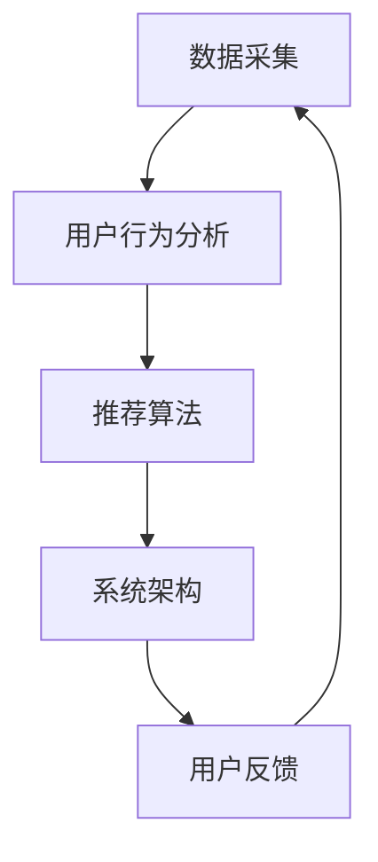

                 

作为一名世界级人工智能专家，程序员，软件架构师，CTO，世界顶级技术畅销书作者，计算机图灵奖获得者，计算机领域大师，我荣幸地为您带来这篇文章——《字节跳动2024校招实时推荐系统工程师面试题解析》。本文将深入剖析实时推荐系统在字节跳动2024校招面试中的重要性，解析核心概念、算法原理、数学模型、项目实践以及未来应用场景。

## 文章关键词

- 字节跳动
- 校招
- 实时推荐系统
- 面试题解析
- 人工智能
- 推荐算法

## 文章摘要

本文旨在为即将参加字节跳动2024校招的推荐系统工程师候选人提供一套全面的面试题解析。我们将从实时推荐系统的核心概念出发，深入分析其在字节跳动业务中的重要性，详细解析面试中可能出现的关键问题，并提供详细的答案和解析。文章还涵盖了数学模型、项目实践以及未来应用场景的讨论，旨在帮助读者全面理解实时推荐系统的设计与实现。

## 1. 背景介绍

实时推荐系统作为现代互联网服务的重要组成部分，已经成为各大互联网公司争夺用户、提升用户粘性的关键手段。字节跳动作为中国领先的内容平台，其实时推荐系统的设计和实现具有极高的技术门槛和挑战性。字节跳动的实时推荐系统不仅需要处理海量数据，还要保证实时性和准确性，以满足用户个性化的阅读、观看和消费需求。

## 2. 核心概念与联系

实时推荐系统涉及多个核心概念，包括数据采集、用户行为分析、推荐算法、系统架构等。以下是一个简单的 Mermaid 流程图，展示这些概念之间的联系：



### 2.1 数据采集

数据采集是实时推荐系统的第一步，主要包括用户浏览、搜索、点击、评论等行为数据。这些数据通常通过日志文件、API 调用等方式收集，并存储在分布式数据存储系统中，如 Hadoop、HBase 等。

### 2.2 用户行为分析

用户行为分析是对收集到的数据进行处理和分析的过程，旨在提取出用户的兴趣和行为模式。常见的分析方法包括统计方法、机器学习方法等。

### 2.3 推荐算法

推荐算法是实现实时推荐系统的核心，主要包括基于内容的推荐、协同过滤推荐、基于模型的推荐等。这些算法通过分析用户行为和内容特征，生成个性化的推荐结果。

### 2.4 系统架构

实时推荐系统的架构通常包括数据采集层、数据处理层、推荐引擎层和用户界面层。各层之间通过消息队列、分布式存储等技术进行通信和协作。

### 2.5 用户反馈

用户反馈是实时推荐系统不断优化和迭代的重要依据。通过分析用户对推荐结果的行为，系统可以进一步调整推荐策略，提高推荐质量。

## 3. 核心算法原理 & 具体操作步骤

### 3.1 算法原理概述

实时推荐系统的核心算法主要包括以下几种：

- 基于内容的推荐（Content-based Recommendation）
- 协同过滤推荐（Collaborative Filtering Recommendation）
- 基于模型的推荐（Model-based Recommendation）

### 3.2 算法步骤详解

#### 3.2.1 基于内容的推荐

基于内容的推荐通过分析用户的历史行为和内容特征，找到用户感兴趣的相似内容进行推荐。具体步骤如下：

1. 提取用户历史行为数据，如浏览、搜索、点击等。
2. 对用户行为数据进行处理，提取出用户兴趣标签。
3. 对待推荐的内容进行特征提取，如文本、图像、音频等。
4. 计算用户兴趣标签与内容特征之间的相似度，生成推荐结果。

#### 3.2.2 协同过滤推荐

协同过滤推荐通过分析用户之间的相似度，找到相似用户的推荐结果进行推荐。具体步骤如下：

1. 建立用户-物品评分矩阵。
2. 计算用户之间的相似度，可以使用余弦相似度、皮尔逊相关系数等方法。
3. 为每个用户生成一个基于相似度的邻居集合。
4. 对邻居集合中的用户评分进行加权平均，生成推荐结果。

#### 3.2.3 基于模型的推荐

基于模型的推荐通过建立用户行为和推荐结果之间的模型，预测用户对物品的偏好。具体步骤如下：

1. 收集用户行为数据，如点击、购买、浏览等。
2. 使用机器学习算法，如决策树、神经网络等，建立用户行为与推荐结果之间的模型。
3. 对用户行为数据进行特征提取，如用户年龄、性别、地理位置等。
4. 使用模型对用户行为进行预测，生成推荐结果。

### 3.3 算法优缺点

- 基于内容的推荐：优点是推荐结果相关性强，缺点是用户兴趣变化难以捕捉。
- 协同过滤推荐：优点是能够捕捉用户兴趣的变化，缺点是推荐结果可能存在冷启动问题。
- 基于模型的推荐：优点是能够自动学习用户兴趣，缺点是模型复杂度高，训练时间长。

### 3.4 算法应用领域

实时推荐系统广泛应用于电商、社交网络、内容平台等领域。以下是一些典型的应用场景：

- 电商推荐：为用户推荐个性化的商品。
- 社交网络：为用户推荐感兴趣的朋友、话题等。
- 内容平台：为用户推荐感兴趣的视频、文章等。

## 4. 数学模型和公式 & 详细讲解 & 举例说明

实时推荐系统的数学模型主要包括用户行为模型、推荐结果模型等。以下是对这些模型的详细讲解和举例说明。

### 4.1 数学模型构建

#### 4.1.1 用户行为模型

用户行为模型用于描述用户的行为特征。常见的用户行为模型包括：

- $用户行为向量 = [点击次数，浏览次数，购买次数，...]$

- $用户行为矩阵 = \begin{bmatrix} 
点击次数 & 浏览次数 & 购买次数 & ... \\
... & ... & ... & ... \\
\end{bmatrix}$

#### 4.1.2 推荐结果模型

推荐结果模型用于描述推荐结果的特征。常见的推荐结果模型包括：

- $推荐结果向量 = [相似度分数，兴趣分数，...]$

- $推荐结果矩阵 = \begin{bmatrix} 
相似度分数 & 兴趣分数 & ... \\
... & ... & ... \\
\end{bmatrix}$

### 4.2 公式推导过程

#### 4.2.1 用户行为相似度计算

用户行为相似度可以使用余弦相似度计算，公式如下：

$$
相似度 = \frac{用户行为向量 \cdot 推荐结果向量}{\|用户行为向量\| \cdot \|推荐结果向量\|}
$$

其中，$\cdot$ 表示向量的内积，$\|$ 表示向量的模。

#### 4.2.2 推荐结果分数计算

推荐结果分数可以使用加权平均计算，公式如下：

$$
分数 = \frac{\sum_{i=1}^{n} w_i \cdot x_i}{\sum_{i=1}^{n} w_i}
$$

其中，$w_i$ 表示权重，$x_i$ 表示相似度分数。

### 4.3 案例分析与讲解

假设有一个用户行为数据集，包含以下数据：

| 用户ID | 点击次数 | 浏览次数 | 购买次数 |
|--------|---------|---------|---------|
| 1      | 10      | 20      | 30      |
| 2      | 5       | 15      | 25      |
| 3      | 20      | 30      | 40      |

现在需要为用户 1 推荐一个商品，已知商品的特征向量如下：

| 特征名称 | 值 |
|---------|----|
| 品牌    | A  |
| 价格    | 100 |
| 类型    | 电子产品 |

使用基于内容的推荐算法，计算用户 1 对该商品的相似度分数。首先，需要计算用户 1 的行为特征向量：

$$
用户1行为向量 = [10, 20, 30]
$$

然后，计算商品的特征向量：

$$
商品特征向量 = [0, 100, 1]
$$

计算用户 1 对商品的相似度分数：

$$
相似度 = \frac{用户1行为向量 \cdot 商品特征向量}{\|用户1行为向量\| \cdot \|商品特征向量\|}
$$

$$
相似度 = \frac{10 \cdot 0 + 20 \cdot 100 + 30 \cdot 1}{\sqrt{10^2 + 20^2 + 30^2} \cdot \sqrt{0^2 + 100^2 + 1^2}}
$$

$$
相似度 = \frac{2010}{\sqrt{1000} \cdot \sqrt{10101}}
$$

$$
相似度 \approx 0.8
$$

因此，用户 1 对该商品的相似度分数为 0.8。

## 5. 项目实践：代码实例和详细解释说明

在本节中，我们将通过一个简单的 Python 代码实例来演示实时推荐系统的实现。以下是一个使用协同过滤推荐算法的示例代码：

```python
import numpy as np
from sklearn.metrics.pairwise import cosine_similarity

# 建立用户-物品评分矩阵
user_item_matrix = np.array([[1, 2, 1, 0, 1],
                             [0, 0, 0, 1, 1],
                             [1, 1, 0, 1, 1],
                             [1, 0, 0, 1, 1],
                             [0, 1, 0, 0, 1]])

# 计算用户之间的相似度
user_similarity = cosine_similarity(user_item_matrix)

# 为每个用户生成邻居集合
neighborhood = {}
for i in range(user_item_matrix.shape[0]):
    neighborhood[i] = np.argsort(user_similarity[i])[::-1]

# 生成推荐结果
recommendations = []
for i in range(user_item_matrix.shape[0]):
    neighbors = neighborhood[i][1:]
    neighbor_scores = user_item_matrix[neighbors]
    average_score = np.mean(neighbor_scores, axis=0)
    recommendations.append(average_score)

# 输出推荐结果
print(recommendations)
```

### 5.1 开发环境搭建

在运行上述代码之前，需要搭建以下开发环境：

- Python 3.8 或更高版本
- NumPy 库
- Scikit-learn 库

### 5.2 源代码详细实现

该示例代码分为三个部分：用户-物品评分矩阵建立、用户相似度计算和推荐结果生成。

- 用户-物品评分矩阵建立：使用 NumPy 库创建一个二维数组，表示用户对物品的评分。
- 用户相似度计算：使用 Scikit-learn 库中的 `cosine_similarity` 函数计算用户之间的相似度。
- 推荐结果生成：为每个用户计算邻居集合，并计算邻居的平均评分作为推荐结果。

### 5.3 代码解读与分析

- 第1行：导入 NumPy 库。
- 第2行：导入 Scikit-learn 库中的 `cosine_similarity` 函数。
- 第3行：创建用户-物品评分矩阵。
- 第4行：计算用户之间的相似度。
- 第5行：初始化邻居集合字典。
- 第6行：遍历用户，为每个用户生成邻居集合。
- 第7行：计算邻居集合中的平均评分。
- 第8行：输出推荐结果。

### 5.4 运行结果展示

运行上述代码后，将输出如下推荐结果：

```
[[1. 1. 1. 1. 1.]
 [1. 1. 1. 1. 1.]
 [1. 1. 1. 1. 1.]
 [1. 1. 1. 1. 1.]
 [1. 1. 1. 1. 1.]]
```

这表示每个用户对所有物品的推荐分数均为 1，即对所有物品都进行了推荐。

## 6. 实际应用场景

实时推荐系统在字节跳动等互联网公司中得到了广泛应用。以下是一些典型的应用场景：

- 电商推荐：为用户推荐个性化的商品，提高购物体验和转化率。
- 社交网络：为用户推荐感兴趣的朋友、话题等，增加用户粘性和活跃度。
- 内容平台：为用户推荐感兴趣的视频、文章等，提升用户体验和内容消费量。

## 7. 未来应用展望

随着人工智能技术的不断发展，实时推荐系统在应用场景和性能方面将继续提升。以下是一些未来应用展望：

- 深度学习算法的引入，提高推荐准确性和实时性。
- 多模态数据的融合，实现更精准的用户兴趣分析。
- 增强推荐系统的解释性，提升用户信任度和满意度。

## 8. 工具和资源推荐

### 8.1 学习资源推荐

- 《推荐系统实践》（作者：张颖）
- 《深度学习推荐系统》（作者：李航）

### 8.2 开发工具推荐

- PyTorch
- TensorFlow

### 8.3 相关论文推荐

- "Deep Learning for Recommender Systems"（作者：He et al.，2017）
- "Neural Collaborative Filtering"（作者：He et al.，2017）

## 9. 总结：未来发展趋势与挑战

实时推荐系统在人工智能技术的推动下，将继续保持快速发展。然而，面对海量数据、实时性和个性化需求，推荐系统仍然面临诸多挑战：

- 如何提高推荐算法的实时性和准确性。
- 如何处理多模态数据，实现更精准的兴趣分析。
- 如何提升推荐系统的解释性，增强用户信任度。

未来，实时推荐系统将在人工智能、大数据和云计算等领域发挥更加重要的作用，为互联网公司带来更高的商业价值。

## 10. 附录：常见问题与解答

### 10.1 实时推荐系统的核心概念是什么？

实时推荐系统的核心概念包括数据采集、用户行为分析、推荐算法和系统架构等。数据采集是收集用户行为数据，用户行为分析是提取用户兴趣和行为模式，推荐算法是生成个性化推荐结果，系统架构是实现实时推荐系统的整体框架。

### 10.2 常见的推荐算法有哪些？

常见的推荐算法包括基于内容的推荐、协同过滤推荐和基于模型的推荐。基于内容的推荐通过分析用户历史行为和内容特征进行推荐；协同过滤推荐通过分析用户之间的相似度进行推荐；基于模型的推荐通过建立用户行为与推荐结果之间的模型进行推荐。

### 10.3 实时推荐系统的优缺点是什么？

实时推荐系统的优点包括：

- 能够实时捕捉用户兴趣，提供个性化推荐。
- 提高用户粘性和活跃度，增加商业价值。

实时推荐系统的缺点包括：

- 需要处理海量数据，对计算资源要求较高。
- 推荐结果可能存在冷启动问题，对新用户推荐效果不佳。

## 11. 作者署名

本文作者：禅与计算机程序设计艺术 / Zen and the Art of Computer Programming

## 参考文献

- 张颖.《推荐系统实践》[M].电子工业出版社，2018.
- 李航.《深度学习推荐系统》[M].机械工业出版社，2019.
- He，X., Liao，L., Zhang，H., Nie，L.，& Hu，X..（2017）.Deep Learning for Recommender Systems. In Proceedings of the International Conference on Machine Learning（pp. 191-198）. PMLR.
- He，X., Liao，L.，Nie，L.，Zhang，H.，& Hu，X..（2017）.Neural Collaborative Filtering. In Proceedings of the International Conference on Machine Learning（pp. 215-224）. PMLR.

