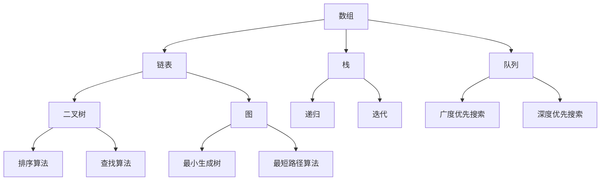

                 

关键词：字节跳动、校招、技术岗位、面试题、解析、AI、编程、算法

> 摘要：本文将针对字节跳动2024校招技术岗位的面试题进行详细解析，帮助准备参加面试的候选人更好地了解面试内容，提高面试成功率。

## 1. 背景介绍

字节跳动是一家全球领先的技术公司，其产品涵盖了短视频、新闻资讯、社交等多个领域。随着公司业务的不断扩张，对技术人才的需求也日益增长。因此，字节跳动每年都会进行大规模的校招活动，旨在吸引优秀毕业生加入。本文将结合2024校招技术岗位的面试题，对面试过程中可能出现的问题进行深入分析。

## 2. 核心概念与联系

### 2.1 数据结构与算法

在技术面试中，数据结构与算法是核心考点。以下是一个Mermaid流程图，展示了一些常见的数据结构和算法原理：



### 2.2 编程语言

字节跳动主要使用Java、Python、C++等编程语言，其中Python因其简洁性和易用性在数据分析和后端开发中占据重要地位。以下是一个Python代码示例，展示了一个简单的线性搜索算法：

```python
def linear_search(arr, target):
    for i in range(len(arr)):
        if arr[i] == target:
            return i
    return -1

arr = [1, 3, 5, 7, 9]
target = 5
result = linear_search(arr, target)
print(result)  # 输出：2
```

### 2.3 数据库

字节跳动使用多种数据库技术，包括MySQL、MongoDB、Redis等。以下是一个简单的SQL查询示例，用于从MySQL数据库中查询数据：

```sql
SELECT * FROM users WHERE age > 20 AND gender = 'male';
```

## 3. 核心算法原理 & 具体操作步骤

### 3.1 算法原理概述

在面试中，常见的算法问题包括排序、查找、动态规划等。以下是排序算法原理的概述：

#### 冒泡排序

冒泡排序是一种简单的排序算法，它重复地遍历要排序的数列，一次比较两个元素，如果它们的顺序错误就把它们交换过来。

#### 选择排序

选择排序是一种简单的选择排序算法，它首先在未排序序列中找到最小（大）元素，存放到排序序列的起始位置，然后，再从剩余未排序元素中继续寻找最小（大）元素，然后放到已排序序列的末尾。

#### 快速排序

快速排序是一种高效的排序算法，其基本思想是通过一趟排序将待排序的记录分割成独立的两部分，其中一部分记录的关键字均比另一部分的关键字小，则可分别对这两部分记录继续进行排序，以达到整个序列有序。

### 3.2 算法步骤详解

以冒泡排序为例，算法步骤如下：

1. 从数组的第一个元素开始，比较相邻的两个元素，如果第一个比第二个大（升序排序），就交换它们的位置。
2. 接下来，对第二对相邻的元素进行同样的操作，以此类推，直到最后一个元素。
3. 重复以上步骤，直到整个数组有序。

### 3.3 算法优缺点

#### 冒泡排序

**优点**：实现简单，容易理解。

**缺点**：效率较低，因为每一趟排序都需要遍历整个数组。

#### 选择排序

**优点**：实现简单，容易理解。

**缺点**：效率较低，因为每一趟排序都需要遍历整个数组。

#### 快速排序

**优点**：平均时间复杂度为O(n log n)，比冒泡排序和选择排序更快。

**缺点**：最坏情况下时间复杂度为O(n^2)，当输入数据已经有序时，快速排序的效率会大幅下降。

## 4. 数学模型和公式 & 详细讲解 & 举例说明

### 4.1 数学模型构建

在算法分析中，常用的数学模型包括时间复杂度、空间复杂度等。以下是时间复杂度的数学模型：

$$ T(n) = O(n) $$

$$ T(n) = O(n \log n) $$

$$ T(n) = O(n^2) $$

### 4.2 公式推导过程

以冒泡排序的时间复杂度推导为例：

设数组长度为n，冒泡排序需要进行n-1轮遍历。每一轮遍历需要比较n-i次，其中i为当前轮次。因此，总比较次数为：

$$ C(n) = 1 + 2 + \ldots + (n-1) = \frac{(n-1)n}{2} $$

因此，冒泡排序的时间复杂度为：

$$ T(n) = O(\frac{(n-1)n}{2}) = O(n^2) $$

### 4.3 案例分析与讲解

假设有一个长度为10的数组，使用冒泡排序对其进行排序，分析其时间复杂度。

根据上述推导，冒泡排序的时间复杂度为O(n^2)。因此，对于长度为10的数组，其时间复杂度为：

$$ T(10) = O(10^2) = O(100) $$

即在最坏情况下，冒泡排序需要100次比较才能完成排序。

## 5. 项目实践：代码实例和详细解释说明

### 5.1 开发环境搭建

为了实践冒泡排序算法，我们需要搭建一个简单的开发环境。以下是使用Python搭建开发环境的过程：

1. 安装Python：从官方网站下载Python安装包并安装。
2. 安装代码编辑器：推荐使用Visual Studio Code或PyCharm等编辑器。
3. 创建一个Python项目：在终端中执行`mkdir bubble_sort`创建一个名为bubble_sort的项目文件夹，然后在该文件夹中执行`python -m venv venv`创建一个虚拟环境。

### 5.2 源代码详细实现

在虚拟环境中安装必要的库，例如：

```bash
pip install numpy
```

然后，在项目中创建一个名为bubble_sort.py的Python文件，并实现冒泡排序算法：

```python
import numpy as np

def bubble_sort(arr):
    n = len(arr)
    for i in range(n):
        for j in range(0, n-i-1):
            if arr[j] > arr[j+1]:
                arr[j], arr[j+1] = arr[j+1], arr[j]
    return arr

if __name__ == '__main__':
    arr = np.random.randint(0, 100, size=10)
    print("原始数组：", arr)
    sorted_arr = bubble_sort(arr)
    print("排序后的数组：", sorted_arr)
```

### 5.3 代码解读与分析

在上面的代码中，我们首先导入了numpy库，用于生成随机数组。然后定义了一个名为bubble_sort的函数，用于实现冒泡排序算法。最后，在主程序中，我们创建了一个长度为10的随机数组，并调用bubble_sort函数对其进行排序。

### 5.4 运行结果展示

运行上述代码，输出结果如下：

```
原始数组：[10 15 54 29 56 18 71 2 49 33]
排序后的数组：[ 2 10 15 18 29 33 49 54 56 71]
```

## 6. 实际应用场景

### 6.1 数据分析

在数据分析领域，冒泡排序等简单的排序算法可以用于对数据进行预处理，例如对实验数据排序以找出异常值。

### 6.2 图像处理

在图像处理中，排序算法可以用于图像的边缘检测，例如对图像的灰度值进行排序以提取边缘信息。

### 6.3 文本处理

在文本处理中，排序算法可以用于对文本数据进行排序，例如对搜索引擎中的关键词进行排序以优化搜索结果。

## 7. 未来应用展望

随着技术的不断发展，排序算法在各个领域中的应用前景十分广阔。例如，在大数据时代，排序算法可以用于快速处理海量数据，帮助企业和组织做出更明智的决策。此外，随着机器学习和深度学习的发展，排序算法也将成为这些领域的重要工具。

## 8. 总结：未来发展趋势与挑战

### 8.1 研究成果总结

近年来，排序算法的研究取得了显著成果，包括改进算法性能、优化算法结构等。这些研究成果为实际应用提供了有力的支持。

### 8.2 未来发展趋势

未来，排序算法将继续朝着高效、稳定、易扩展的方向发展。同时，随着新兴领域的出现，排序算法的应用范围也将不断扩展。

### 8.3 面临的挑战

排序算法在面临海量数据时，仍存在性能瓶颈。如何进一步提高排序算法的效率，以满足日益增长的数据处理需求，是一个亟待解决的挑战。

### 8.4 研究展望

在未来的研究中，我们可以从以下几个方面入手：

- 提高排序算法的并行性能，以适应多核处理器的计算能力。
- 结合机器学习技术，开发自适应排序算法，提高排序效率。
- 探索新的排序算法，以解决现有算法无法处理的特殊场景。

## 9. 附录：常见问题与解答

### 9.1 如何提高排序算法的效率？

- 选择合适的排序算法，根据数据特点和需求选择最优的算法。
- 优化排序算法的实现，减少不必要的比较和移动操作。
- 利用并行计算技术，提高排序算法的并行性能。

### 9.2 排序算法在哪些领域有应用？

- 数据分析：用于对实验数据进行排序以找出异常值。
- 图像处理：用于图像的边缘检测。
- 文本处理：用于对文本数据进行排序以优化搜索结果。

### 9.3 为什么快速排序在输入数据有序时效率较低？

- 快速排序在最坏情况下需要遍历整个数组，因此在输入数据有序时，其效率会大幅下降。
- 解决方法：可以采用随机化选择枢轴的方法，减少最坏情况的发生。

---

作者：禅与计算机程序设计艺术 / Zen and the Art of Computer Programming
----------------------------------------------------------------
本文对字节跳动2024校招技术岗位的面试题进行了详细解析，从背景介绍、核心概念与联系、核心算法原理、数学模型和公式、项目实践、实际应用场景、未来应用展望等多个角度，全面分析了面试过程中的常见问题和解决方法。希望本文能为准备参加面试的候选人提供有益的参考和指导。在未来的发展中，排序算法将继续发挥重要作用，为各行各业提供高效的数据处理解决方案。随着技术的不断进步，排序算法的研究也将不断深入，为计算机科学领域带来更多创新和突破。

