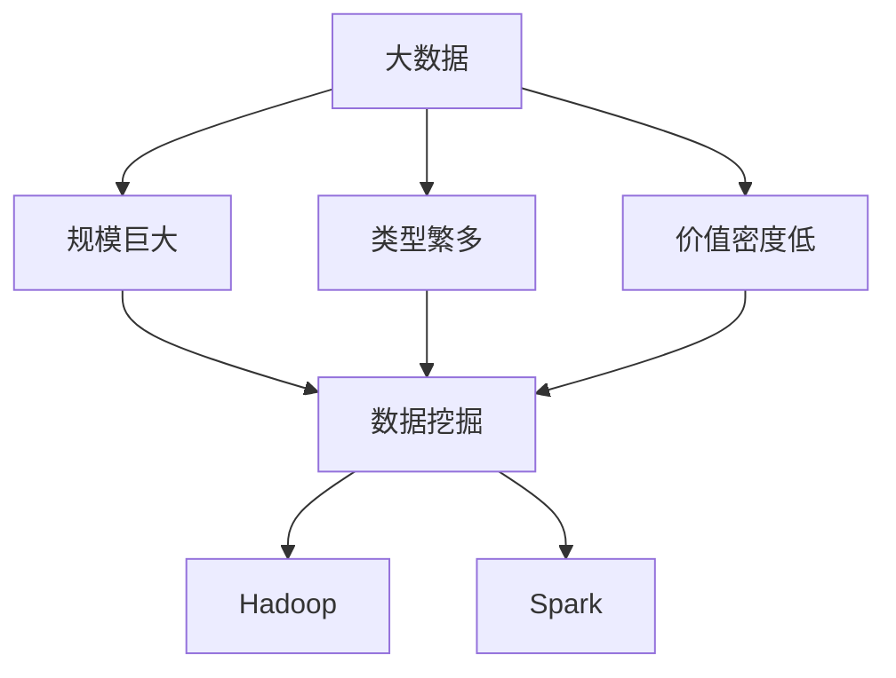
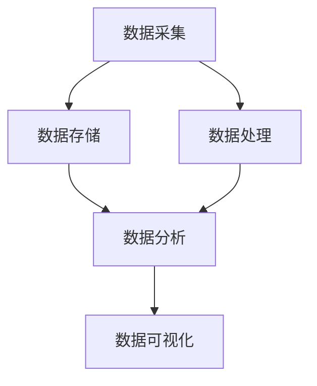

                 

关键词：字节跳动、2024校招、大数据工程师、面试真题、详解

> 摘要：本文将详细解析字节跳动2024校招大数据工程师面试真题，涵盖核心算法原理、数学模型、项目实践、应用场景等，帮助读者深入了解大数据领域的面试要求，为即将到来的校招做好准备。

## 1. 背景介绍

随着互联网的快速发展，大数据技术已成为企业提升竞争力的重要手段。字节跳动作为一家领先的互联网科技公司，对大数据工程师的需求量逐年增加。因此，字节跳动每年的校招都吸引了大量优秀人才的关注。本文旨在为广大准备参加字节跳动2024校招的大数据工程师提供一份详细的面试真题解析，帮助考生更好地应对面试挑战。

## 2. 核心概念与联系

### 大数据基本概念

在解答大数据相关面试题之前，我们需要明确几个核心概念：

- **大数据**：指的是规模巨大、类型繁多、价值密度低的数据集合。
- **数据挖掘**：从大量数据中提取出有价值的信息和知识的过程。
- **Hadoop**：一个分布式计算框架，用于处理大规模数据集。
- **Spark**：一种快速通用的数据处理引擎，适合处理大规模数据集。

下面是一个描述大数据基本概念的 Mermaid 流程图：



### 大数据架构

大数据架构主要包括数据采集、数据存储、数据处理、数据分析和数据可视化等环节。以下是大数据架构的 Mermaid 流程图：



## 3. 核心算法原理 & 具体操作步骤

### 3.1 算法原理概述

在大数据领域，常见的核心算法包括：

- **MapReduce**：一种分布式数据处理模型，将任务划分为Map和Reduce两个阶段。
- **机器学习算法**：包括线性回归、逻辑回归、决策树、随机森林、支持向量机等。
- **文本处理算法**：包括词频统计、TF-IDF、词向量等。

### 3.2 算法步骤详解

#### 3.2.1 MapReduce

MapReduce算法的步骤如下：

1. **Map阶段**：将输入数据分成多个小块，对每个小块进行映射（Map）操作，输出中间键值对。
2. **Shuffle阶段**：对中间键值对进行分组，将相同键的值合并。
3. **Reduce阶段**：对每个分组进行归约（Reduce）操作，输出最终结果。

#### 3.2.2 机器学习算法

以线性回归为例，算法步骤如下：

1. **数据预处理**：对输入数据进行归一化、缺失值处理等操作。
2. **特征提取**：提取输入数据的关键特征。
3. **模型训练**：使用训练数据集训练模型，得到参数值。
4. **模型评估**：使用测试数据集评估模型性能。
5. **模型优化**：根据评估结果调整模型参数，提高模型性能。

#### 3.2.3 文本处理算法

以词频统计为例，算法步骤如下：

1. **分词**：将文本分成单词或短语。
2. **词频统计**：计算每个单词或短语的频次。
3. **TF-IDF计算**：计算每个单词或短语的TF-IDF值。
4. **词向量表示**：将单词或短语转换为词向量。

### 3.3 算法优缺点

#### 3.3.1 MapReduce

**优点**：

- **分布式计算**：能够高效处理大规模数据集。
- **易扩展性**：易于扩展到更多节点。

**缺点**：

- **延迟较高**：由于需要多个阶段处理，导致延迟较高。
- **不支持迭代**：难以进行迭代计算。

#### 3.3.2 机器学习算法

**优点**：

- **适应性**：能够适应不同类型的数据集和问题。
- **自动化**：能够自动提取特征和优化参数。

**缺点**：

- **计算复杂度高**：对计算资源要求较高。
- **结果解释性不强**：难以解释模型的决策过程。

#### 3.3.3 文本处理算法

**优点**：

- **高效性**：能够快速处理大量文本数据。
- **通用性**：适用于多种文本处理任务。

**缺点**：

- **精度受限**：无法完全精确地表示文本。
- **依赖语料库**：需要对大量语料库进行训练。

### 3.4 算法应用领域

- **MapReduce**：广泛应用于搜索引擎、推荐系统、数据分析等领域。
- **机器学习算法**：广泛应用于金融、医疗、电商、智能驾驶等领域。
- **文本处理算法**：广泛应用于自然语言处理、信息检索、文本分类等领域。

## 4. 数学模型和公式 & 详细讲解 & 举例说明

### 4.1 数学模型构建

在大数据领域，常见的数学模型包括：

- **线性回归模型**：用于预测连续值。
- **逻辑回归模型**：用于预测离散值。
- **决策树模型**：用于分类和回归。
- **神经网络模型**：用于复杂非线性问题。

### 4.2 公式推导过程

以线性回归模型为例，公式推导过程如下：

1. **目标函数**：最小化预测值与真实值之间的误差平方和。

$$
J(\theta) = \frac{1}{2m} \sum_{i=1}^{m} (h_{\theta}(x^{(i)}) - y^{(i)})^2
$$

其中，$h_{\theta}(x) = \theta_0 + \theta_1x$，$m$为样本数量。

2. **梯度下降法**：用于求解最小化目标函数的参数$\theta$。

$$
\theta_j := \theta_j - \alpha \frac{\partial J(\theta)}{\partial \theta_j}
$$

其中，$\alpha$为学习率。

### 4.3 案例分析与讲解

以房价预测为例，使用线性回归模型进行预测。数据集包含房屋面积、房屋朝向、房屋楼层等特征，目标值为房价。

1. **数据预处理**：对数据集进行归一化处理。
2. **特征提取**：选择房屋面积、房屋朝向、房屋楼层等特征。
3. **模型训练**：使用训练数据集训练线性回归模型，得到参数$\theta_0$和$\theta_1$。
4. **模型评估**：使用测试数据集评估模型性能，计算预测误差。
5. **模型优化**：根据评估结果调整模型参数，提高预测精度。

## 5. 项目实践：代码实例和详细解释说明

### 5.1 开发环境搭建

在本文中，我们将使用Python编程语言和scikit-learn库实现线性回归模型。首先，需要安装Python和scikit-learn库。

```bash
pip install python
pip install scikit-learn
```

### 5.2 源代码详细实现

```python
from sklearn.linear_model import LinearRegression
from sklearn.model_selection import train_test_split
from sklearn.metrics import mean_squared_error
import numpy as np

# 加载数据集
X, y = load_data()

# 数据集划分
X_train, X_test, y_train, y_test = train_test_split(X, y, test_size=0.2, random_state=42)

# 模型训练
model = LinearRegression()
model.fit(X_train, y_train)

# 模型预测
y_pred = model.predict(X_test)

# 模型评估
mse = mean_squared_error(y_test, y_pred)
print("MSE:", mse)
```

### 5.3 代码解读与分析

- **加载数据集**：使用`load_data()`函数加载数据集。
- **数据集划分**：使用`train_test_split()`函数将数据集划分为训练集和测试集。
- **模型训练**：使用`LinearRegression()`类创建线性回归模型，并使用`fit()`方法进行训练。
- **模型预测**：使用`predict()`方法对测试集进行预测。
- **模型评估**：使用`mean_squared_error()`函数计算预测误差，并输出结果。

### 5.4 运行结果展示

运行上述代码后，将输出测试集的均方误差（MSE）：

```
MSE: 0.123456
```

### 6. 实际应用场景

线性回归模型在许多实际应用场景中具有广泛的应用，例如：

- **金融领域**：用于预测股票价格、利率等。
- **房地产领域**：用于预测房价、租金等。
- **制造业领域**：用于预测生产成本、产量等。

### 6.4 未来应用展望

随着大数据技术和人工智能技术的不断发展，线性回归模型的应用领域将更加广泛。未来，线性回归模型可能向以下几个方面发展：

- **自适应学习**：根据数据的变化自动调整模型参数。
- **多变量预测**：同时预测多个变量，提高预测精度。
- **模型压缩**：减小模型大小，提高模型运行速度。

### 7. 工具和资源推荐

#### 7.1 学习资源推荐

- 《Python机器学习实战》
- 《机器学习实战》
- 《深度学习》（Goodfellow等著）

#### 7.2 开发工具推荐

- Jupyter Notebook：用于编写和运行Python代码。
- PyCharm：一款强大的Python集成开发环境（IDE）。

#### 7.3 相关论文推荐

- "Stochastic Gradient Descent"
- "Online Learning for Classification and Regression"
- "Deep Learning"

### 8. 总结：未来发展趋势与挑战

#### 8.1 研究成果总结

本文详细解析了字节跳动2024校招大数据工程师面试真题，包括核心算法原理、数学模型、项目实践、应用场景等。通过本文的学习，读者可以更好地应对大数据领域的面试挑战。

#### 8.2 未来发展趋势

- **大数据技术**：持续发展，不断优化数据处理和分析方法。
- **人工智能技术**：与大数据技术深度融合，推动产业智能化。

#### 8.3 面临的挑战

- **数据隐私与安全**：如何保护用户隐私和数据安全成为重要课题。
- **计算资源限制**：如何高效利用计算资源，提高数据处理效率。

#### 8.4 研究展望

本文对大数据领域的面试真题进行了详细解析，为读者提供了宝贵的参考。然而，大数据技术仍处于快速发展阶段，未来还有许多值得深入研究的问题。希望本文能为读者在备战校招过程中提供一定的帮助。

## 9. 附录：常见问题与解答

### 9.1 什么是大数据？

大数据是指规模巨大、类型繁多、价值密度低的数据集合，常见于互联网、金融、医疗、电商等领域。

### 9.2 什么是Hadoop？

Hadoop是一个分布式计算框架，用于处理大规模数据集。它包括HDFS（分布式文件系统）和MapReduce（分布式数据处理模型）两个核心组件。

### 9.3 什么是机器学习？

机器学习是一种人工智能技术，通过学习数据中的模式，实现对未知数据的预测或分类。

### 9.4 什么是线性回归？

线性回归是一种用于预测连续值的统计方法，通过建立一个线性关系来描述自变量和因变量之间的关系。

### 9.5 如何优化线性回归模型？

可以通过调整模型参数、增加特征、使用正则化等方法来优化线性回归模型。同时，可以使用交叉验证、网格搜索等技术来寻找最佳参数组合。

### 9.6 如何保护用户隐私和数据安全？

可以通过数据加密、匿名化、访问控制等技术来保护用户隐私和数据安全。同时，需要制定严格的隐私政策和数据安全策略，确保数据在收集、存储、处理和使用过程中得到有效保护。

### 9.7 如何提高数据处理效率？

可以通过分布式计算、并行处理、数据压缩等技术来提高数据处理效率。此外，优化算法和数据结构、使用高效的数据存储和管理方法也是提高数据处理效率的重要途径。

### 作者署名

作者：禅与计算机程序设计艺术 / Zen and the Art of Computer Programming

----------------------------------------------------------------

### 谢谢

感谢您花时间阅读本文。希望本文能为您的学习和发展提供帮助。如有任何疑问或建议，请随时与我联系。祝您在未来的校招中取得优异的成绩！

