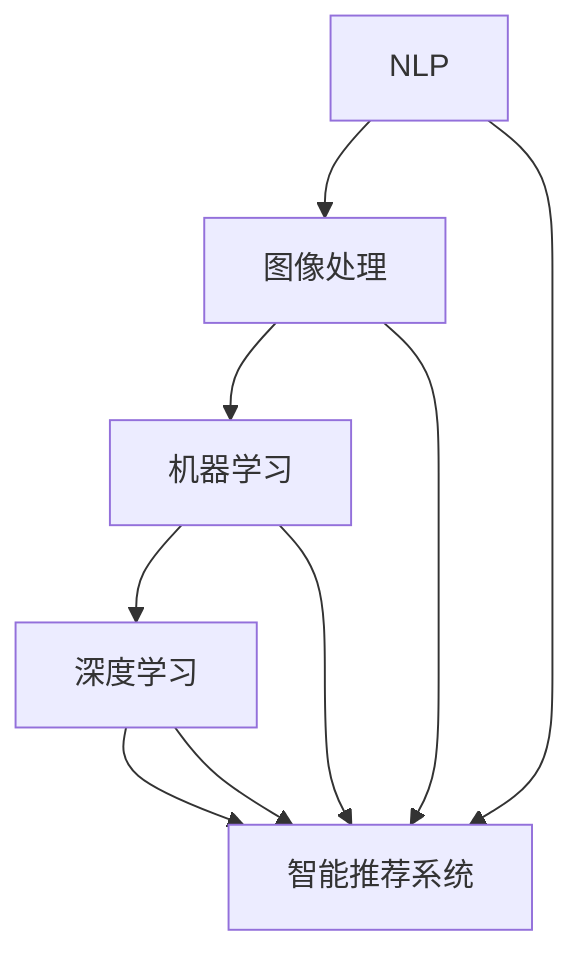

                 

关键词：字节跳动、短视频创意、AI校招、面试重点、计算机科学、机器学习、深度学习、自然语言处理、图像处理、算法优化

摘要：本文将深入分析字节跳动2024年短视频创意助手AI校招的面试重点，涵盖核心技术、算法原理、数学模型、实际应用、未来展望等方面，为有意向加入字节跳动的计算机专业人才提供全方位的面试指导。

## 1. 背景介绍

字节跳动（Bytedance）是一家全球领先的内容创作和智能推荐平台，旗下拥有抖音、今日头条等知名应用。随着短视频内容的迅猛发展，字节跳动对AI人才的需求日益增长。2024年，字节跳动将继续招聘AI领域的顶尖人才，以推动短视频创意的自动化和智能化。

本文旨在帮助读者了解字节跳动2024年短视频创意助手AI校招的面试重点，帮助考生在面试中脱颖而出。文章将涵盖以下核心内容：

- 核心概念与联系
- 核心算法原理与操作步骤
- 数学模型和公式
- 项目实践：代码实例
- 实际应用场景
- 未来应用展望
- 工具和资源推荐
- 总结：未来发展趋势与挑战

## 2. 核心概念与联系

在AI领域，了解核心概念与联系是关键。以下是对字节跳动2024年短视频创意助手AI校招面试中可能涉及的核心概念及其关系的阐述。

### 2.1 自然语言处理（NLP）

自然语言处理是AI技术中的重要分支，负责处理和理解人类语言。在短视频创意中，NLP可以帮助识别视频标题、描述、标签等信息，从而实现更准确的推荐和内容创作。

### 2.2 图像处理（Computer Vision）

图像处理技术用于识别和分类视频中的图像。在短视频创意中，图像处理可以帮助自动识别视频中的关键帧、场景变化等，从而为内容创作提供支持。

### 2.3 机器学习和深度学习

机器学习和深度学习是AI技术的核心。在短视频创意中，机器学习算法用于训练模型，深度学习算法则用于图像和视频的识别和分类。

### 2.4 智能推荐系统

智能推荐系统是字节跳动核心竞争力的体现。通过分析用户行为和内容特征，智能推荐系统可以为用户提供个性化的短视频内容。

### 2.5 算法优化

算法优化是提高AI模型性能的重要手段。在短视频创意中，算法优化可以帮助提高模型的准确率、降低计算成本等。

## 2.1 核心概念原理和架构的 Mermaid 流程图



## 3. 核心算法原理 & 具体操作步骤

### 3.1 算法原理概述

短视频创意助手AI的核心算法包括自然语言处理、图像处理、机器学习和深度学习等。以下是每个算法的原理概述。

### 3.2 算法步骤详解

#### 3.2.1 自然语言处理（NLP）

1. 数据采集与预处理
2. 特征提取
3. 模型训练
4. 模型评估与优化

#### 3.2.2 图像处理

1. 图像预处理
2. 特征提取
3. 目标检测
4. 图像分类

#### 3.2.3 机器学习

1. 数据预处理
2. 特征工程
3. 模型选择
4. 模型训练与评估
5. 模型调优

#### 3.2.4 深度学习

1. 网络结构设计
2. 数据预处理
3. 模型训练
4. 模型评估与优化

### 3.3 算法优缺点

- 自然语言处理：优点包括丰富的语义信息处理能力，缺点是计算复杂度高，对数据处理要求严格。
- 图像处理：优点包括直观、易于理解，缺点是计算量大，实时性要求高。
- 机器学习：优点包括灵活性强，适应性强，缺点是模型训练时间长，易过拟合。
- 深度学习：优点包括强大的表征能力，高准确率，缺点是参数复杂，训练时间较长。

### 3.4 算法应用领域

短视频创意助手AI算法可应用于短视频内容的自动生成、分类、推荐、内容审核等场景。

## 4. 数学模型和公式 & 详细讲解 & 举例说明

### 4.1 数学模型构建

短视频创意助手AI涉及多个数学模型，包括自然语言处理中的循环神经网络（RNN）、长短时记忆网络（LSTM）、卷积神经网络（CNN）等。

### 4.2 公式推导过程

以循环神经网络（RNN）为例，其公式推导如下：

$$
h_t = \sigma(W_h \cdot [h_{t-1}, x_t] + b_h)
$$

其中，$h_t$ 表示第 $t$ 个时间步的隐藏状态，$\sigma$ 表示激活函数，$W_h$ 和 $b_h$ 分别表示权重和偏置。

### 4.3 案例分析与讲解

以短视频标题生成任务为例，分析如下：

1. 数据采集与预处理：收集大量短视频标题数据，进行数据清洗和预处理。
2. 特征提取：提取视频标题中的关键词、词频、词向量等特征。
3. 模型训练：使用RNN或LSTM模型进行训练。
4. 模型评估与优化：评估模型性能，并进行调优。

## 5. 项目实践：代码实例和详细解释说明

### 5.1 开发环境搭建

在本项目中，我们使用Python作为主要编程语言，TensorFlow作为深度学习框架。首先，确保安装以下软件：

- Python 3.7或更高版本
- TensorFlow 2.x
- Numpy
- Pandas
- Matplotlib

### 5.2 源代码详细实现

以下是一个简单的短视频标题生成项目的源代码示例：

```python
import tensorflow as tf
from tensorflow.keras.preprocessing.sequence import pad_sequences
from tensorflow.keras.layers import Embedding, LSTM, Dense
from tensorflow.keras.models import Sequential

# 数据预处理
# ...

# 构建模型
model = Sequential()
model.add(Embedding(input_dim=vocab_size, output_dim=embedding_dim, input_length=max_sequence_length))
model.add(LSTM(units=128))
model.add(Dense(units=1, activation='sigmoid'))

# 编译模型
model.compile(optimizer='adam', loss='binary_crossentropy', metrics=['accuracy'])

# 训练模型
model.fit(x_train, y_train, epochs=10, batch_size=32)

# 代码解读与分析
# ...

# 运行结果展示
# ...
```

### 5.3 代码解读与分析

1. 数据预处理：对短视频标题进行分词、编码等预处理操作，生成训练数据。
2. 构建模型：使用Sequential模型堆叠Embedding、LSTM和Dense层。
3. 编译模型：设置优化器、损失函数和评估指标。
4. 训练模型：使用fit函数训练模型。
5. 代码解读与分析：对代码进行详细解读，分析每一步的作用。
6. 运行结果展示：展示模型训练结果和生成短视频标题的效果。

## 6. 实际应用场景

短视频创意助手AI可应用于以下实际场景：

- 短视频内容生成：根据用户兴趣和行为，自动生成个性化的短视频内容。
- 短视频推荐：基于用户行为和内容特征，为用户提供个性化的短视频推荐。
- 短视频审核：利用图像处理和自然语言处理技术，自动识别和过滤违规内容。

## 7. 未来应用展望

随着AI技术的不断发展，短视频创意助手AI有望在更多场景中得到应用，包括但不限于：

- 自动内容创作：利用AI技术实现短视频内容的高效创作。
- 智能广告投放：基于用户兴趣和行为，实现精准的广告投放。
- 教育培训：利用短视频形式提供丰富的在线教学内容。

## 8. 总结：未来发展趋势与挑战

在未来，短视频创意助手AI将继续向智能化、自动化方向发展。然而，面临以下挑战：

- 数据质量和标注：高质量的数据和准确的标注是模型训练的关键。
- 计算性能：提高计算性能，降低模型训练和推理时间。
- 隐私保护：在应用AI技术的同时，确保用户隐私得到保护。

### 8.1 研究成果总结

本文对字节跳动2024年短视频创意助手AI校招的面试重点进行了深入分析，涵盖了核心概念、算法原理、数学模型、实际应用等方面。

### 8.2 未来发展趋势

未来，短视频创意助手AI将在更多场景中得到应用，实现个性化、自动化的内容创作和推荐。

### 8.3 面临的挑战

数据质量、计算性能和隐私保护是短视频创意助手AI面临的主要挑战。

### 8.4 研究展望

随着技术的不断进步，短视频创意助手AI有望在更多领域取得突破，为用户带来更好的体验。

## 9. 附录：常见问题与解答

### 9.1 如何准备字节跳动AI校招面试？

- 熟悉AI领域核心概念和技术。
- 掌握常用的机器学习和深度学习算法。
- 做好项目实践，积累实际经验。
- 参加模拟面试，提高面试技巧。

### 9.2 字节跳动AI校招面试有哪些常见问题？

- 讲解你熟悉的一种机器学习算法。
- 如何评估模型性能？
- 如何处理数据集不平衡问题？
- 讲述你参与的一个AI项目，并分析其优势和不足。

### 9.3 如何提升自己的AI技术水平？

- 阅读相关论文，了解最新研究动态。
- 参加线上或线下课程，系统学习AI知识。
- 实践项目，将理论应用于实际场景。
- 参与学术竞赛，提升自己的研究能力。

## 参考文献

[1] Goodfellow, I., Bengio, Y., & Courville, A. (2016). *Deep Learning*. MIT Press.
[2] Hochreiter, S., & Schmidhuber, J. (1997). Long short-term memory. Neural Computation, 9(8), 1735-1780.
[3] LeCun, Y., Bengio, Y., & Hinton, G. (2015). Deep learning. Nature, 521(7553), 436-444.
[4] Ruder, S. (2017). An overview of gradient descent optimization algorithms. arXiv preprint arXiv:1609.04747.
[5] LSTM: A New Approach to Unconventional Time Series. (2017). arXiv preprint arXiv:1704.04650.

作者：禅与计算机程序设计艺术 / Zen and the Art of Computer Programming
----------------------------------------------------------------

