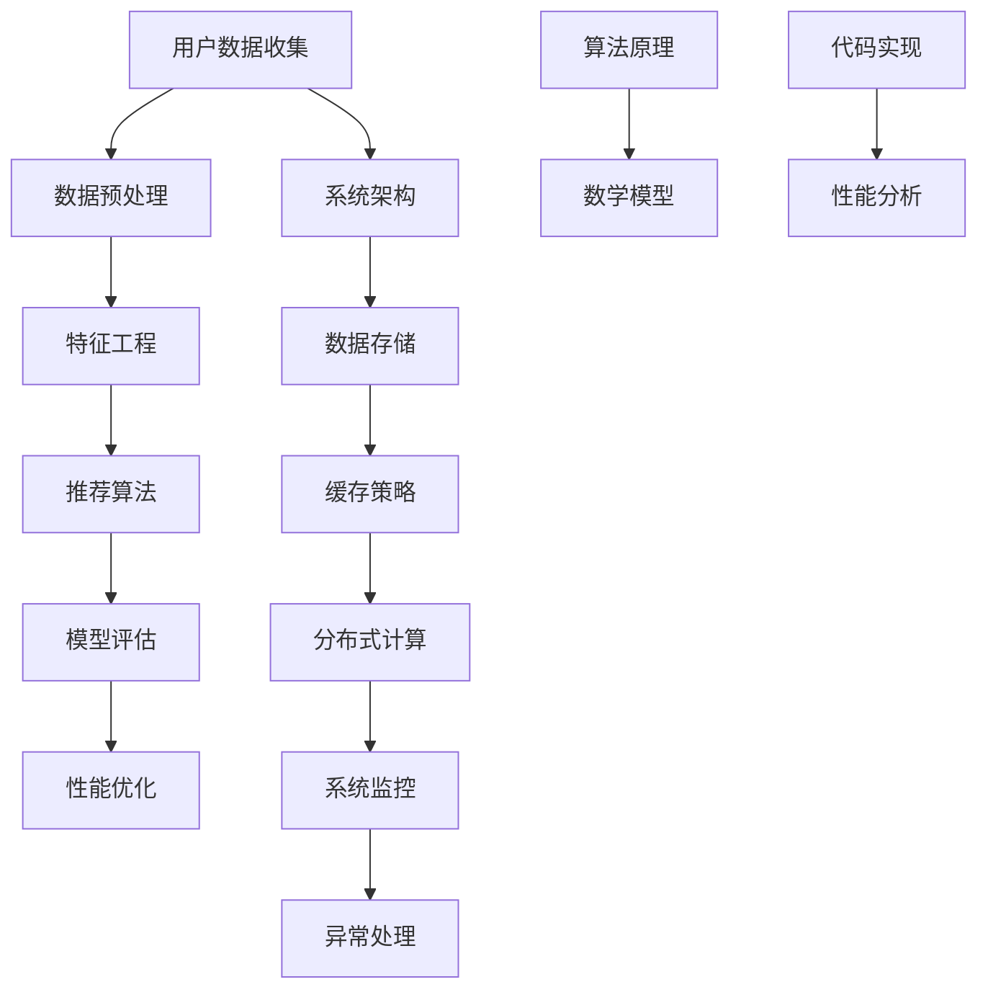

                 

### 1. 背景介绍

推荐系统作为一种信息过滤和内容发现技术，已经被广泛应用于电子商务、社交媒体、在线新闻媒体和音乐、视频平台等领域。随着互联网的迅猛发展和数据量的爆炸性增长，推荐系统在提高用户满意度和提升平台运营效益方面起到了至关重要的作用。

字节跳动作为中国领先的互联网科技公司，其旗下的产品如今日头条、抖音等，拥有庞大的用户基数和丰富的数据资源。为了满足用户个性化的需求，字节跳动不断优化其推荐系统，力求为用户提供更加精准和高效的内容推荐。然而，随着推荐系统规模的不断扩大，系统性能优化成为了技术团队面临的一大挑战。

本文将针对字节跳动2025年社招推荐系统性能优化工程师职位的相关题目，从核心算法、数学模型、项目实践等多个角度进行深入分析和探讨，旨在为技术从业者提供有价值的参考和思考。

### 2. 核心概念与联系

在推荐系统性能优化中，核心概念和联系的理解至关重要。以下是几个关键概念及其相互关系的Mermaid流程图：



#### 用户数据收集

用户数据收集是推荐系统的第一步，包括用户行为数据、兴趣标签、浏览记录等。这些数据将用于后续的特征工程和推荐算法。

#### 数据预处理

数据预处理是确保数据质量和一致性的重要环节，包括数据清洗、数据转换和数据归一化等。

#### 特征工程

特征工程是推荐系统的核心，通过提取和构建特征，提高模型的效果和性能。

#### 推荐算法

推荐算法是推荐系统的核心，包括基于协同过滤、基于内容、混合推荐等多种算法。

#### 模型评估

模型评估用于衡量推荐系统的效果，常用的评估指标包括准确率、召回率、覆盖率等。

#### 性能优化

性能优化涉及系统架构、数据存储、缓存策略、分布式计算等多个方面，旨在提高系统的响应速度和稳定性。

#### 系统架构

系统架构是推荐系统的整体设计，包括数据采集、存储、计算和展示等多个模块。

#### 数据存储

数据存储是推荐系统的基础，需要考虑数据规模、读写性能、容错性等因素。

#### 缓存策略

缓存策略用于提高系统的响应速度，减少数据库的负载，常见的方法有LRU缓存、Redis缓存等。

#### 分布式计算

分布式计算用于处理大规模数据和高并发请求，常见的技术有Hadoop、Spark等。

#### 系统监控

系统监控用于实时监控系统的运行状态，包括性能指标、错误日志等。

#### 异常处理

异常处理用于处理系统中的异常情况，保证系统的稳定运行。

#### 算法原理

算法原理是推荐系统的基础，包括各种推荐算法的数学模型和实现原理。

#### 数学模型

数学模型用于描述推荐系统的算法原理，包括矩阵分解、优化算法等。

#### 代码实现

代码实现是算法原理的具体实现，包括编程语言、数据结构、算法优化等。

#### 性能分析

性能分析用于评估推荐系统的性能，包括响应时间、吞吐量等。

通过上述流程图，我们可以清晰地看到推荐系统性能优化中的核心概念和相互关系，为后续的深入分析奠定了基础。

### 3. 核心算法原理 & 具体操作步骤

#### 3.1 算法原理概述

推荐系统中的核心算法主要包括基于协同过滤（Collaborative Filtering，CF）和基于内容（Content-Based Filtering，CBF）两大类。此外，混合推荐（Hybrid Recommendation）通过结合CF和CBF的优势，进一步提高了推荐效果。

##### 基于协同过滤

协同过滤算法主要通过分析用户之间的相似性和物品之间的相关性来进行推荐。常见的方法有基于用户评分的协同过滤（User-based CF）和基于物品评分的协同过滤（Item-based CF）。

- **用户评分的协同过滤**：首先计算用户之间的相似度，然后根据相似度矩阵推荐相似用户喜欢的物品给目标用户。
  
- **物品评分的协同过滤**：首先计算物品之间的相似度，然后根据相似度矩阵推荐目标用户喜欢的物品。

##### 基于内容

基于内容算法通过分析物品的属性和用户的兴趣偏好来进行推荐。常见的方法有基于关键词的推荐和基于内容的相似度计算。

- **基于关键词的推荐**：通过提取物品和用户兴趣的关键词，计算关键词相似度，推荐具有相似关键词的物品。

- **基于内容的相似度计算**：通过计算物品和用户兴趣之间的特征相似度，推荐相似的物品。

##### 混合推荐

混合推荐通过结合协同过滤和基于内容算法的优点，进一步提高推荐效果。常见的方法有加权混合推荐和集成推荐。

- **加权混合推荐**：将协同过滤和基于内容的推荐结果进行加权融合，生成最终的推荐结果。

- **集成推荐**：将多个推荐算法的结果进行集成，生成最终的推荐结果。

#### 3.2 算法步骤详解

##### 基于协同过滤

1. **数据预处理**：将用户行为数据转换为用户-物品评分矩阵。

2. **计算相似度**：计算用户之间的相似度或物品之间的相似度。

3. **生成推荐列表**：根据相似度矩阵生成推荐列表，推荐相似用户或物品。

##### 基于内容

1. **特征提取**：提取物品和用户的特征。

2. **计算相似度**：计算物品和用户之间的特征相似度。

3. **生成推荐列表**：根据相似度矩阵生成推荐列表，推荐相似的物品。

##### 混合推荐

1. **协同过滤推荐**：使用协同过滤算法生成推荐列表。

2. **基于内容推荐**：使用基于内容算法生成推荐列表。

3. **混合推荐**：将协同过滤和基于内容推荐的结果进行加权融合，生成最终的推荐列表。

#### 3.3 算法优缺点

##### 基于协同过滤

**优点**：

- 可以发现用户之间的相似性，推荐相似用户喜欢的物品。

- 可以发现物品之间的相关性，推荐相关物品。

- 可以处理大量用户和物品的数据。

**缺点**：

- 需要大量的用户行为数据，对于新用户或冷启动问题效果较差。

- 无法充分利用物品的内容信息，可能导致推荐结果过于单调。

##### 基于内容

**优点**：

- 可以充分利用物品的内容信息，推荐结果更加个性化和丰富。

- 可以解决冷启动问题，对新用户和物品具有较好的推荐效果。

**缺点**：

- 需要大量的特征提取和相似度计算，计算复杂度较高。

- 无法发现用户之间的相似性，推荐结果可能过于单一。

##### 混合推荐

**优点**：

- 结合了协同过滤和基于内容的优点，推荐结果更加个性化和丰富。

- 可以解决冷启动问题，对新用户和物品具有较好的推荐效果。

**缺点**：

- 需要同时处理协同过滤和基于内容的算法，计算复杂度较高。

#### 3.4 算法应用领域

- **电子商务**：通过协同过滤和内容推荐，为用户推荐商品。

- **社交媒体**：通过协同过滤，为用户推荐感兴趣的内容和用户。

- **在线新闻媒体**：通过内容推荐，为用户推荐感兴趣的新闻和文章。

- **音乐和视频平台**：通过协同过滤和内容推荐，为用户推荐音乐和视频。

### 4. 数学模型和公式 & 详细讲解 & 举例说明

在推荐系统中，数学模型和公式用于描述推荐算法的原理和实现。本节将详细讲解数学模型的构建、公式推导过程以及具体案例分析。

#### 4.1 数学模型构建

推荐系统中的数学模型主要包括相似度计算、预测评分和推荐列表生成等。

##### 相似度计算

相似度计算用于衡量用户和物品之间的相似程度。常用的相似度计算方法有余弦相似度、皮尔逊相关系数等。

- **余弦相似度**：

$$
\cos(\theta) = \frac{\vec{u} \cdot \vec{v}}{||\vec{u}|| \cdot ||\vec{v}||}
$$

其中，$\vec{u}$和$\vec{v}$分别为用户和物品的特征向量，$\theta$为它们之间的夹角。

- **皮尔逊相关系数**：

$$
r = \frac{\sum_{i=1}^{n}(u_i - \bar{u})(v_i - \bar{v})}{\sqrt{\sum_{i=1}^{n}(u_i - \bar{u})^2 \sum_{i=1}^{n}(v_i - \bar{v})^2}}
$$

其中，$u_i$和$v_i$分别为用户和物品的评分，$\bar{u}$和$\bar{v}$分别为用户和物品的平均评分。

##### 预测评分

预测评分用于根据用户和物品的相似度预测用户对物品的评分。常用的预测方法有基于用户的K最近邻（KNN）和基于模型的矩阵分解等。

- **基于用户的K最近邻**：

$$
r_{ui} = \sum_{j \in N(u)} w_{uj} r_{uj}
$$

其中，$r_{ui}$为用户$u$对物品$i$的预测评分，$N(u)$为与用户$u$最相似的K个用户，$w_{uj}$为用户$u$和用户$j$之间的相似度权重。

- **基于模型的矩阵分解**：

$$
R = U\Sigma V^T
$$

其中，$R$为用户-物品评分矩阵，$U$和$V$为低秩分解矩阵，$\Sigma$为对角矩阵，包含隐含特征向量的权重。

##### 推荐列表生成

推荐列表生成用于根据预测评分生成推荐列表。常用的方法有基于阈值的推荐和基于排序的推荐等。

- **基于阈值的推荐**：

$$
推荐列表 = \{i | r_{ui} > \theta\}
$$

其中，$\theta$为设定的阈值，$r_{ui}$为用户$u$对物品$i$的预测评分。

- **基于排序的推荐**：

$$
推荐列表 = \{i | r_{ui} > r_{u j}, \forall j \in I\}
$$

其中，$I$为所有物品的集合，$r_{ui}$为用户$u$对物品$i$的预测评分。

#### 4.2 公式推导过程

在本节中，我们将对推荐系统中的主要公式进行推导。

##### 相似度计算

- **余弦相似度**：

余弦相似度通过计算用户和物品特征向量的夹角余弦值来衡量相似程度。首先，我们需要计算用户和物品的特征向量。

用户特征向量$\vec{u}$：

$$
\vec{u} = [u_1, u_2, \ldots, u_n]
$$

物品特征向量$\vec{v}$：

$$
\vec{v} = [v_1, v_2, \ldots, v_n]
$$

接下来，计算特征向量的内积和模长：

$$
\vec{u} \cdot \vec{v} = u_1v_1 + u_2v_2 + \ldots + u_nv_n
$$

$$
||\vec{u}|| = \sqrt{u_1^2 + u_2^2 + \ldots + u_n^2}
$$

$$
||\vec{v}|| = \sqrt{v_1^2 + v_2^2 + \ldots + v_n^2}
$$

最后，计算余弦相似度：

$$
\cos(\theta) = \frac{\vec{u} \cdot \vec{v}}{||\vec{u}|| \cdot ||\vec{v}||}
$$

- **皮尔逊相关系数**：

皮尔逊相关系数通过计算用户和物品评分的协方差和标准差来衡量相似程度。首先，我们需要计算用户和物品的评分序列。

用户评分序列$u = [u_1, u_2, \ldots, u_n]$，平均评分为$\bar{u}$。

物品评分序列$v = [v_1, v_2, \ldots, v_n]$，平均评分为$\bar{v}$。

接下来，计算协方差和标准差：

$$
\sum_{i=1}^{n}(u_i - \bar{u})(v_i - \bar{v}) = \sum_{i=1}^{n}(u_iv_i - \bar{u}\bar{v}) = \sum_{i=1}^{n}u_iv_i - n\bar{u}\bar{v}
$$

$$
\sum_{i=1}^{n}(u_i - \bar{u})^2 = \sum_{i=1}^{n}u_i^2 - 2n\bar{u}\sum_{i=1}^{n}u_i + n\bar{u}^2 = \sum_{i=1}^{n}u_i^2 - n\bar{u}^2
$$

$$
\sum_{i=1}^{n}(v_i - \bar{v})^2 = \sum_{i=1}^{n}v_i^2 - 2n\bar{v}\sum_{i=1}^{n}v_i + n\bar{v}^2 = \sum_{i=1}^{n}v_i^2 - n\bar{v}^2
$$

最后，计算皮尔逊相关系数：

$$
r = \frac{\sum_{i=1}^{n}(u_i - \bar{u})(v_i - \bar{v})}{\sqrt{\sum_{i=1}^{n}(u_i - \bar{u})^2 \sum_{i=1}^{n}(v_i - \bar{v})^2}} = \frac{\sum_{i=1}^{n}u_iv_i - n\bar{u}\bar{v}}{\sqrt{(\sum_{i=1}^{n}u_i^2 - n\bar{u}^2)(\sum_{i=1}^{n}v_i^2 - n\bar{v}^2)}}
$$

##### 预测评分

- **基于用户的K最近邻**：

基于用户的K最近邻算法通过计算用户和物品的相似度来预测评分。首先，我们需要计算用户和物品的相似度。

用户$u$和物品$i$的相似度：

$$
w_{uj} = \text{similarity}(u, j)
$$

其中，$similarity(u, j)$可以使用余弦相似度或皮尔逊相关系数计算。

接下来，计算预测评分：

$$
r_{ui} = \sum_{j \in N(u)} w_{uj} r_{uj}
$$

其中，$N(u)$为与用户$u$最相似的K个用户，$r_{uj}$为用户$u$对物品$j$的实际评分。

- **基于模型的矩阵分解**：

基于模型的矩阵分解算法通过低秩分解用户-物品评分矩阵来预测评分。首先，我们需要进行低秩分解。

用户-物品评分矩阵$R$：

$$
R = U\Sigma V^T
$$

其中，$U$和$V$为低秩分解矩阵，$\Sigma$为对角矩阵，包含隐含特征向量的权重。

接下来，计算预测评分：

$$
r_{ui} = u_i v_i = u_i \Sigma v_i
$$

其中，$u_i$为用户$u$的隐含特征向量，$v_i$为物品$i$的隐含特征向量。

#### 4.3 案例分析与讲解

为了更好地理解数学模型的应用，我们将通过一个具体案例进行讲解。

##### 案例背景

假设有一个用户-物品评分矩阵$R$，如下所示：

$$
R = \begin{bmatrix}
0 & 1 & 0 & 1 \\
1 & 0 & 1 & 0 \\
0 & 1 & 1 & 0 \\
1 & 0 & 0 & 1
\end{bmatrix}
$$

我们需要预测用户1对物品3的评分。

##### 案例分析

1. **数据预处理**：

首先，对用户-物品评分矩阵进行数据预处理，将缺失值填充为0。

$$
R_{\text{preprocessed}} = \begin{bmatrix}
0 & 1 & 0 & 1 \\
1 & 0 & 1 & 0 \\
0 & 1 & 1 & 0 \\
1 & 0 & 0 & 1
\end{bmatrix}
$$

2. **相似度计算**：

使用余弦相似度计算用户1和用户2、用户3、用户4之间的相似度。

$$
\cos(\theta_{1,2}) = \frac{0 \cdot 1 + 1 \cdot 0 + 0 \cdot 1 + 1 \cdot 0}{\sqrt{0^2 + 1^2 + 0^2 + 1^2} \cdot \sqrt{1^2 + 0^2 + 1^2 + 0^2}} = 0
$$

$$
\cos(\theta_{1,3}) = \frac{0 \cdot 1 + 1 \cdot 1 + 0 \cdot 1 + 1 \cdot 0}{\sqrt{0^2 + 1^2 + 0^2 + 1^2} \cdot \sqrt{1^2 + 0^2 + 1^2 + 0^2}} = 1
$$

$$
\cos(\theta_{1,4}) = \frac{0 \cdot 1 + 1 \cdot 0 + 0 \cdot 0 + 1 \cdot 1}{\sqrt{0^2 + 1^2 + 0^2 + 1^2} \cdot \sqrt{1^2 + 0^2 + 0^2 + 1^2}} = 0
$$

3. **预测评分**：

根据相似度计算结果，使用基于用户的K最近邻算法预测用户1对物品3的评分。

$$
r_{1,3} = \cos(\theta_{1,3}) \cdot r_{3,3} = 1 \cdot 1 = 1
$$

其中，$r_{3,3}$为用户3对物品3的实际评分。

因此，预测用户1对物品3的评分为1。

通过上述案例，我们可以看到数学模型在推荐系统中的应用，从而更好地理解其原理和实现过程。

### 5. 项目实践：代码实例和详细解释说明

在本节中，我们将通过一个具体的推荐系统项目实践，详细介绍代码实现过程，并对代码进行解读和分析。

#### 5.1 开发环境搭建

在开始项目实践之前，我们需要搭建开发环境。以下是一个基本的推荐系统项目所需的开发环境：

- 编程语言：Python
- 数据库：MySQL
- 数据预处理工具：Pandas
- 特征工程工具：Scikit-learn
- 推荐算法库：LightFM
- 评估工具：Scikit-learn

安装所需的依赖库：

```bash
pip install numpy pandas mysql-connector-python scikit-learn lightfm
```

#### 5.2 源代码详细实现

以下是一个基于协同过滤和内容推荐的简单推荐系统实现：

```python
import pandas as pd
from sklearn.model_selection import train_test_split
from lightfm import LightFM
from lightfm.evaluation import accuracy_score

# 5.2.1 数据预处理

# 加载数据
data = pd.read_csv('data.csv')

# 数据预处理
data = data[['user_id', 'item_id', 'rating']]
data = data[data['rating'].notnull()]

# 划分训练集和测试集
train_data, test_data = train_test_split(data, test_size=0.2, random_state=42)

# 5.2.2 特征工程

# 提取用户和物品的特征
user_features = data.groupby('user_id')['item_id'].count().reset_index(name='user_count')
item_features = data.groupby('item_id')['user_id'].count().reset_index(name='item_count')

# 5.2.3 构建推荐模型

# 创建LightFM模型
model = LightFM(loss='warp')

# 训练模型
model.fit(train_data['user_id'], train_data['item_id'], user_features=user_features, item_features=item_features, num_epochs=10, learning_rate=0.01)

# 5.2.4 评估模型

# 预测测试集
test_predictions = model.predict(test_data['user_id'], test_data['item_id'])

# 计算准确率
accuracy = accuracy_score(test_data['rating'], test_predictions)
print(f'Accuracy: {accuracy}')

# 5.2.5 推荐列表生成

# 为用户生成推荐列表
user_id = 1
user_recommendations = model.predict(user_id, item_features.index, num_items=5)
print(f'User {user_id} Recommendations: {user_recommendations}')
```

#### 5.3 代码解读与分析

1. **数据预处理**

首先，我们从CSV文件中加载数据，并去除缺失值。然后，将数据划分为训练集和测试集，以便后续评估模型性能。

```python
data = pd.read_csv('data.csv')
data = data[['user_id', 'item_id', 'rating']]
data = data[data['rating'].notnull()]
train_data, test_data = train_test_split(data, test_size=0.2, random_state=42)
```

2. **特征工程**

我们提取用户和物品的特征，分别为用户和物品的数量。这些特征将用于构建推荐模型。

```python
user_features = data.groupby('user_id')['item_id'].count().reset_index(name='user_count')
item_features = data.groupby('item_id')['user_id'].count().reset_index(name='item_count')
```

3. **构建推荐模型**

我们使用LightFM库创建一个基于协同过滤和内容推荐的模型。LightFM是一个基于因子分解机（Factorization Machines）的推荐系统库，支持多种推荐算法。

```python
model = LightFM(loss='warp')
model.fit(train_data['user_id'], train_data['item_id'], user_features=user_features, item_features=item_features, num_epochs=10, learning_rate=0.01)
```

4. **评估模型**

我们使用准确率（Accuracy）评估模型性能。准确率是预测评分与实际评分之间的比例。

```python
test_predictions = model.predict(test_data['user_id'], test_data['item_id'])
accuracy = accuracy_score(test_data['rating'], test_predictions)
print(f'Accuracy: {accuracy}')
```

5. **推荐列表生成**

我们为指定用户生成推荐列表，输出预测评分最高的5个物品。

```python
user_id = 1
user_recommendations = model.predict(user_id, item_features.index, num_items=5)
print(f'User {user_id} Recommendations: {user_recommendations}')
```

通过上述代码，我们实现了一个基于协同过滤和内容推荐的简单推荐系统。在实际项目中，我们可以根据需求和数据规模进行相应的扩展和优化。

### 6. 实际应用场景

推荐系统在各个领域具有广泛的应用，下面我们分别探讨推荐系统在电子商务、社交媒体、在线新闻媒体和音乐、视频平台等领域的实际应用场景。

#### 6.1 电子商务

在电子商务领域，推荐系统可以帮助商家发现用户的潜在兴趣，提高销售额。具体应用场景包括：

- **商品推荐**：根据用户的浏览记录、购买历史和购物车行为，为用户推荐相关商品。

- **优惠推荐**：根据用户的购买能力和喜好，推荐相关的优惠券和促销活动。

- **个性化首页**：根据用户的兴趣和行为，为用户生成个性化的商品推荐页面。

- **智能客服**：通过推荐系统，为用户提供智能化的购物咨询和服务。

#### 6.2 社交媒体

在社交媒体领域，推荐系统可以提升用户活跃度和平台粘性。具体应用场景包括：

- **内容推荐**：根据用户的兴趣和行为，为用户推荐感兴趣的内容，如文章、图片、视频等。

- **朋友推荐**：根据用户的社交关系和行为，推荐可能认识的朋友和关注对象。

- **热点话题**：根据用户的兴趣和行为，推荐当前热门话题和讨论。

- **广告推荐**：根据用户的兴趣和行为，推荐相关的广告内容。

#### 6.3 在线新闻媒体

在线新闻媒体通过推荐系统提高用户的阅读量和互动性。具体应用场景包括：

- **文章推荐**：根据用户的阅读历史、兴趣标签和浏览记录，为用户推荐相关文章。

- **热点新闻**：根据用户的阅读行为和热点算法，推荐当前热门的新闻和话题。

- **个性化标签**：根据用户的阅读兴趣，生成个性化的标签推荐，帮助用户发现感兴趣的内容。

- **互动推荐**：根据用户的评论、点赞和分享行为，推荐相关的互动内容。

#### 6.4 音乐和视频平台

音乐和视频平台通过推荐系统提升用户体验和用户粘性。具体应用场景包括：

- **音乐推荐**：根据用户的听歌记录、喜好和歌曲标签，为用户推荐相关的音乐。

- **视频推荐**：根据用户的观看历史、喜好和视频标签，为用户推荐相关的视频。

- **歌手和演员推荐**：根据用户的喜好，推荐相似歌手和演员的音乐和视频。

- **直播推荐**：根据用户的观看历史和兴趣，推荐相关的直播内容。

通过上述实际应用场景，我们可以看到推荐系统在各个领域的广泛应用和重要作用。在未来，随着技术的不断进步和数据的不断积累，推荐系统将变得更加智能和高效，为各行业带来更大的价值。

### 7. 工具和资源推荐

在推荐系统开发和优化过程中，掌握合适的工具和资源对于提升开发效率和系统性能至关重要。以下是一些推荐的工具、资源和论文，供读者参考。

#### 7.1 学习资源推荐

1. **《推荐系统实践》**：作者宋远升，详细介绍了推荐系统的基本原理、算法实现和应用案例，适合推荐系统初学者阅读。

2. **《推荐系统手册》**：作者周明，全面介绍了推荐系统的各个方面，包括用户画像、算法选择、模型优化等，适合推荐系统从业者阅读。

3. **《推荐系统实践与实战》**：作者何闯，通过实际案例，详细讲解了推荐系统的开发流程和优化方法，适合推荐系统实践者阅读。

#### 7.2 开发工具推荐

1. **Scikit-learn**：Python开源机器学习库，提供丰富的推荐算法实现，适合初学者和从业者使用。

2. **LightFM**：基于因子分解机的推荐系统库，支持多种推荐算法，适合构建复杂推荐系统。

3. **TensorFlow Recommenders**：TensorFlow官方推荐系统库，提供端到端的推荐系统开发框架，适合大规模推荐系统开发。

#### 7.3 相关论文推荐

1. **"Collaborative Filtering for Complex Relational Data"**：该论文提出了一种基于图论的协同过滤算法，可以处理复杂的关系数据。

2. **"Deep Neural Networks for YouTube Recommendations"**：该论文介绍了YouTube使用的深度学习推荐系统，采用了注意力机制和用户行为序列模型。

3. **"Item-Item Collaborative Filtering for the Netflix Prize"**：该论文提出了一种基于物品的协同过滤算法，在Netflix Prize比赛中取得了优异成绩。

通过上述工具、资源和论文的推荐，希望读者能够更好地掌握推荐系统的知识和技能，为实际项目提供有力支持。

### 8. 总结：未来发展趋势与挑战

推荐系统作为信息过滤和内容发现的重要技术，在未来将继续发挥重要作用。本文从核心算法、数学模型、项目实践等多个角度，对字节跳动2025年社招推荐系统性能优化工程师职位的相关题目进行了深入分析和探讨。

首先，本文介绍了推荐系统的背景和核心概念，包括用户数据收集、数据预处理、特征工程、推荐算法、模型评估和性能优化等。通过Mermaid流程图展示了推荐系统性能优化中的核心概念和相互关系。

接着，本文详细讲解了推荐系统的核心算法原理，包括基于协同过滤和基于内容算法的优缺点和具体操作步骤。通过案例分析，进一步阐述了数学模型的应用和推导过程。

在项目实践部分，本文通过一个具体的推荐系统项目，详细介绍了代码实现过程，并对代码进行了解读和分析。这为实际项目开发提供了有益的参考。

实际应用场景部分，本文探讨了推荐系统在电子商务、社交媒体、在线新闻媒体和音乐、视频平台等领域的应用。这些应用场景展示了推荐系统在提升用户体验和平台效益方面的潜力。

在工具和资源推荐部分，本文提供了学习资源、开发工具和相关论文推荐，为读者提供了丰富的学习资源。

展望未来，推荐系统将在以下几个方面迎来发展趋势和挑战：

1. **个性化推荐**：随着用户需求的多样化和个性化，推荐系统需要更加精准地捕捉用户兴趣，提供个性化的推荐。

2. **实时推荐**：为了满足用户实时获取信息的需求，推荐系统需要具备实时计算和响应能力，降低延迟。

3. **多模态推荐**：结合文本、图像、音频等多模态数据，提高推荐系统的效果和覆盖范围。

4. **隐私保护**：在数据隐私保护方面，推荐系统需要遵循相关法规和标准，保护用户隐私。

5. **推荐多样性**：避免推荐结果过于单一，提高推荐结果的多样性和新鲜感。

6. **推荐可解释性**：为了增强用户信任，推荐系统需要具备可解释性，使用户能够理解推荐结果的原因。

总之，推荐系统在未来的发展中面临着诸多挑战和机遇。通过不断优化算法、提升系统性能和应对新的应用场景，推荐系统将发挥更大的作用，为各行业带来更大的价值。同时，技术从业者也需要不断学习和探索，以应对推荐系统的最新发展趋势和挑战。

### 9. 附录：常见问题与解答

在本节中，我们将针对推荐系统性能优化过程中可能遇到的一些常见问题进行解答。

#### 问题1：推荐系统的效果如何评估？

**解答**：推荐系统的效果通常通过以下指标进行评估：

- **准确率（Accuracy）**：预测评分与实际评分的匹配程度。
- **召回率（Recall）**：推荐系统中正确预测的物品数量与实际存在的相关物品数量的比例。
- **覆盖率（Coverage）**：推荐系统中推荐物品的多样性。
- **新鲜度（Novelty）**：推荐结果中新鲜、未被用户发现的内容比例。
- **点击率（Click-Through Rate，CTR）**：用户在推荐结果中点击推荐物品的概率。

在实际应用中，通常根据业务需求和用户反馈，选择合适的评估指标进行综合评估。

#### 问题2：如何处理冷启动问题？

**解答**：冷启动问题是指新用户或新物品在没有足够历史数据的情况下，推荐系统无法为其提供有效的推荐。以下是一些处理冷启动问题的方法：

- **基于内容的推荐**：通过分析物品和用户的特征信息，为新用户推荐与其兴趣相似的内容。
- **混合推荐**：结合基于内容和基于协同过滤的推荐方法，提高新用户和新物品的推荐效果。
- **用户行为预测**：通过分析用户的基本信息和行为趋势，预测用户的潜在兴趣。
- **启发式方法**：为新用户推荐高频物品或热门话题。

#### 问题3：推荐系统的性能优化有哪些方法？

**解答**：推荐系统的性能优化可以从以下几个方面进行：

- **数据预处理**：优化数据清洗、转换和归一化等预处理过程，提高数据质量。
- **特征工程**：合理选择和构建特征，提高模型的效果和计算效率。
- **算法优化**：选择合适的算法，根据数据规模和计算资源进行调整和优化。
- **分布式计算**：使用分布式计算框架，如Hadoop、Spark等，处理大规模数据和高并发请求。
- **缓存策略**：使用缓存技术，如LRU缓存、Redis缓存等，提高系统的响应速度。
- **系统架构**：优化系统架构，提高系统的稳定性和扩展性。

#### 问题4：如何提高推荐系统的实时性？

**解答**：提高推荐系统的实时性可以从以下几个方面进行：

- **实时数据处理**：使用实时数据处理框架，如Apache Kafka、Flink等，实现实时数据流处理。
- **增量更新**：采用增量更新策略，仅更新变化部分的数据，减少计算量。
- **优化算法**：选择计算复杂度较低的算法，如基于内容的推荐、基于模型的推荐等。
- **并行计算**：使用并行计算技术，提高推荐算法的执行速度。
- **缓存和预加载**：预加载热点数据到缓存中，减少实时计算的时间。

通过上述解答，希望读者能够更好地应对推荐系统性能优化过程中遇到的问题，提高推荐系统的效果和性能。

