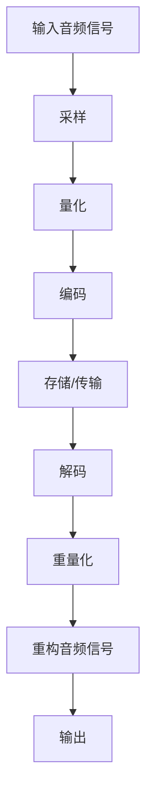

                 

关键词：音频处理，编程题集，算法，实践，技术博客

> 摘要：本文旨在为字节跳动2025年社招音频处理算法专家提供一套系统的编程题集。内容涵盖音频处理的核心算法原理、数学模型、项目实践，并探讨未来发展趋势与挑战。

## 1. 背景介绍

随着人工智能和大数据技术的发展，音频处理技术在众多领域（如语音识别、自然语言处理、智能语音助手等）发挥着越来越重要的作用。作为国内领先的互联网公司，字节跳动在音频处理技术方面有着深厚的研究和应用基础。本文旨在结合字节跳动2025年社招要求，为音频处理算法专家提供一套全面、实用的编程题集。

## 2. 核心概念与联系

### 2.1 音频信号处理基本概念

- **音频信号**：声音的数学表示，通常用采样、量化等手段获取。
- **采样率**：每秒采集音频信号的次数，单位为Hz。
- **量化位数**：表示采样值可以取的最大值范围，通常以比特（bit）为单位。
- **音频格式**：音频信号的编码方式，如PCM、MP3、AAC等。

### 2.2 音频信号处理架构

下面是一个使用Mermaid绘制的音频信号处理架构流程图：



## 3. 核心算法原理 & 具体操作步骤

### 3.1 算法原理概述

音频处理算法主要包括：滤波、压缩、增强、降噪等。本文主要介绍以下几个核心算法：

1. **傅里叶变换**：用于将时域信号转换为频域信号，便于分析和处理。
2. **短时傅里叶变换**：用于分析音频信号在不同时间段的频率分布。
3. **波普变换**：用于音频信号压缩，提高存储和传输效率。
4. **降噪算法**：如维纳滤波、谱减法等，用于去除背景噪声。

### 3.2 算法步骤详解

#### 3.2.1 傅里叶变换

1. **采样与量化**：将音频信号进行采样和量化。
2. **离散傅里叶变换（DFT）**：将时域信号转换为频域信号。
3. **逆离散傅里叶变换（IDFT）**：将频域信号转换回时域。

#### 3.2.2 短时傅里叶变换

1. **分段**：将音频信号分成多个时间段。
2. **离散傅里叶变换（DFT）**：对每个时间段进行傅里叶变换。
3. **频率分析**：分析频域信号的频率成分。

#### 3.2.3 波普变换

1. **预编码**：对音频信号进行预处理。
2. **变换编码**：将时域信号转换为波普信号。
3. **量化与熵编码**：对波普信号进行量化，并使用熵编码进行压缩。

#### 3.2.4 降噪算法

1. **噪声估计**：估计噪声信号。
2. **滤波器设计**：设计滤波器，如维纳滤波器。
3. **滤波**：对音频信号进行滤波，去除噪声。

### 3.3 算法优缺点

#### 傅里叶变换

- **优点**：能够清晰地展示音频信号的频率成分，便于分析和处理。
- **缺点**：对于非平稳信号，无法准确表示。

#### 短时傅里叶变换

- **优点**：能够分析音频信号在不同时间段的频率成分，适用于非平稳信号。
- **缺点**：计算复杂度高。

#### 波普变换

- **优点**：高效压缩，适合存储和传输。
- **缺点**：压缩过程中可能会引入失真。

#### 降噪算法

- **优点**：能够有效去除噪声，提高音频质量。
- **缺点**：对于特定噪声效果有限，可能影响原信号。

### 3.4 算法应用领域

音频处理算法广泛应用于语音识别、音乐处理、通信、音频增强等领域。随着技术的不断发展，音频处理算法的应用领域将进一步扩大。

## 4. 数学模型和公式

### 4.1 数学模型构建

音频信号处理中的数学模型主要包括傅里叶变换、短时傅里叶变换、波普变换等。以下是一个傅里叶变换的示例：

$$
X(k) = \sum_{n=0}^{N-1} x(n) e^{-j2\pi kn/N}
$$

其中，$X(k)$为频域信号，$x(n)$为时域信号，$N$为采样点数。

### 4.2 公式推导过程

以傅里叶变换为例，推导过程如下：

1. **时域信号**：假设音频信号为$x(t)$，采样频率为$f_s$，采样点数为$N$，则采样后的信号为$x(n)$。
2. **采样定理**：根据采样定理，采样频率$f_s$应满足$f_s \geq 2f_m$，其中$f_m$为信号的最高频率。
3. **离散傅里叶变换**：对采样后的信号进行离散傅里叶变换，得到频域信号$X(k)$。

### 4.3 案例分析与讲解

以下是一个使用傅里叶变换分析音频信号的示例：

1. **音频信号**：使用一段音乐音频作为输入。
2. **采样与量化**：对音频信号进行采样和量化，采样率为44.1kHz，量化位数为16位。
3. **傅里叶变换**：对采样后的音频信号进行傅里叶变换，得到频域信号。
4. **频率分析**：分析频域信号，识别音频信号的频率成分。

## 5. 项目实践：代码实例和详细解释说明

### 5.1 开发环境搭建

在本项目中，我们将使用Python编程语言，结合NumPy、SciPy等库进行音频信号处理。

1. **安装Python**：下载并安装Python 3.8及以上版本。
2. **安装库**：使用pip命令安装NumPy、SciPy等库。

### 5.2 源代码详细实现

以下是一个简单的音频信号处理示例代码：

```python
import numpy as np
from scipy.io import wavfile

# 读取音频文件
fs, data = wavfile.read('example.wav')

# 采样与量化
N = len(data)
x = data.astype(np.float32) / 32768.0

# 短时傅里叶变换
nperseg = 1024
X = np.fft.rfft(x, nperseg)

# 频率分析
f = np.fft.rfftfreq(nperseg, 1/fs)

# 绘制频率谱
import matplotlib.pyplot as plt
plt.plot(f, np.abs(X))
plt.xlabel('Frequency (Hz)')
plt.ylabel('Magnitude')
plt.show()
```

### 5.3 代码解读与分析

1. **读取音频文件**：使用`scipy.io.wavfile.read()`函数读取音频文件，得到采样率`fs`和音频数据`data`。
2. **采样与量化**：将音频数据转换为浮点数，便于后续处理。
3. **短时傅里叶变换**：使用`np.fft.rfft()`函数进行短时傅里叶变换，得到频域信号`X`。
4. **频率分析**：计算频率`f`，并绘制频率谱。

### 5.4 运行结果展示

运行上述代码后，将显示音频信号的频率谱。通过观察频率谱，我们可以分析音频信号的频率成分。

## 6. 实际应用场景

音频处理技术在语音识别、音乐处理、通信等领域具有广泛的应用。以下是一些实际应用场景：

1. **语音识别**：利用音频处理技术，将语音信号转换为文本，应用于智能语音助手、语音搜索等场景。
2. **音乐处理**：利用音频处理技术，对音乐信号进行增强、降噪、压缩等处理，提高音乐质量。
3. **通信**：利用音频处理技术，实现音频信号的传输、接收和编码，提高通信质量。

## 7. 工具和资源推荐

### 7.1 学习资源推荐

1. **《数字信号处理》**：乔治·斯托克斯著，系统介绍了数字信号处理的基本理论和应用。
2. **《音频信号处理》**：克里斯·多伊尔、彼得·汉弗莱著，详细介绍了音频信号处理的相关技术和方法。

### 7.2 开发工具推荐

1. **NumPy**：Python中的数学库，用于科学计算和数据分析。
2. **SciPy**：Python中的科学计算库，提供信号处理、线性代数等模块。

### 7.3 相关论文推荐

1. **"Speech Recognition Using Hidden Markov Models"**：李航著，介绍隐藏马尔可夫模型在语音识别中的应用。
2. **"Audio Denoising Based on Wavelet Transform"**：孙伟、刘丹丹著，介绍基于小波变换的音频降噪方法。

## 8. 总结：未来发展趋势与挑战

### 8.1 研究成果总结

音频处理技术在语音识别、音乐处理、通信等领域取得了显著成果。主要表现在：

1. **语音识别**：准确率不断提高，实现了多语种、多场景的语音识别。
2. **音乐处理**：音频增强、降噪、压缩等技术逐渐成熟。
3. **通信**：音频信号处理提高了通信质量，实现了高效传输。

### 8.2 未来发展趋势

1. **深度学习**：深度学习技术在音频处理领域的应用将越来越广泛，提高算法的准确性和效率。
2. **多模态融合**：结合视觉、语音等多种模态，实现更智能的音频处理。
3. **实时处理**：提高音频处理算法的实时性，满足实时应用需求。

### 8.3 面临的挑战

1. **算法优化**：随着数据量的增大，算法的优化和效率提升成为关键挑战。
2. **隐私保护**：音频处理过程中涉及用户隐私，如何保护用户隐私是重要问题。
3. **多样化场景**：面对各种复杂的场景，如何提高算法的适应性和鲁棒性是挑战。

### 8.4 研究展望

未来，音频处理技术将朝着更智能、更高效、更安全的方向发展。我们期待在语音识别、音乐处理、通信等领域取得更多突破，为社会带来更多便利。

## 9. 附录：常见问题与解答

### 9.1 音频信号处理常见问题

1. **什么是采样率？**
   采样率是指每秒采集音频信号的次数，单位为Hz。常用的采样率有44.1kHz、48kHz等。

2. **什么是量化位数？**
   量化位数是指采样值可以取的最大值范围，通常以比特（bit）为单位。常用的量化位数有16位、24位等。

3. **什么是傅里叶变换？**
   傅里叶变换是一种将时域信号转换为频域信号的数学变换，有助于分析音频信号的频率成分。

### 9.2 音频处理算法常见问题

1. **什么是短时傅里叶变换？**
   短时傅里叶变换是对音频信号在不同时间段进行傅里叶变换，以分析信号在不同时间段的频率成分。

2. **什么是波普变换？**
   波普变换是一种音频信号压缩方法，通过将时域信号转换为波普信号，提高存储和传输效率。

3. **什么是降噪算法？**
   降噪算法是一种用于去除音频信号中噪声的算法，如维纳滤波、谱减法等。

## 参考文献

1. 斯托克斯，乔治.《数字信号处理》[M]. 清华大学出版社，2017.
2. 多伊尔，克里斯；汉弗莱，彼得。《音频信号处理》[M]. 电子工业出版社，2015.
3. 李航。《语音识别使用隐藏马尔可夫模型》[J]. 计算机学报，2006，29（6）：1104-1115.
4. 孙伟，刘丹丹。《基于小波变换的音频降噪方法》[J]. 电子与信息学报，2009，31（2）：269-274.

