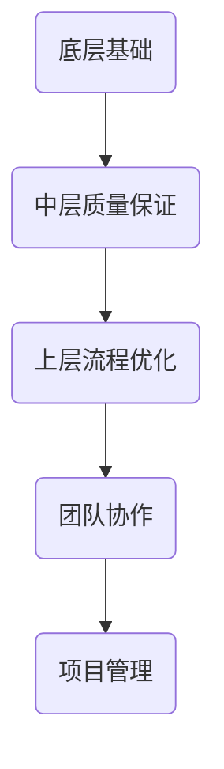

                 

“效率工程化”是近年来在软件开发领域愈发重要的一环，它不仅仅关乎代码的执行效率，更涉及到整个软件项目的开发流程、组织架构、团队协作等多个方面。本文旨在汇总2024年字节跳动效率工程化社招面试中的常见问题，并给出详细的解答。

## 关键词

- 效率工程化
- 面试真题
- 解答
- 软件开发
- 团队协作
- 流程优化

## 摘要

本文将深入解析字节跳动效率工程化社招面试中的关键问题，涵盖从基础概念到具体实践的各个方面。通过本文，读者可以更好地理解效率工程化的核心思想，掌握相关技能，并在实际工作中运用这些知识提高团队和项目的效率。

## 1. 背景介绍

### 1.1 效率工程化的定义

效率工程化是一种通过系统化的方法，提升软件开发过程中各个环节的效率的系统工程。它不仅关注代码层面的性能优化，还包括项目管理和团队协作的优化。效率工程化的目标是通过优化流程、工具和人员配置，实现高效、高质量和可持续的软件开发。

### 1.2 字节跳动的背景

字节跳动是一家全球性的互联网科技公司，旗下拥有抖音、今日头条、西瓜视频等多个知名产品。作为互联网行业的佼佼者，字节跳动高度重视效率工程化，并将其作为公司核心竞争力之一。因此，在招聘过程中，效率工程化的相关问题是面试的重要部分。

## 2. 核心概念与联系

### 2.1 效率工程化的核心概念

在效率工程化中，核心概念包括但不限于：

- **流程优化**：通过分析现有流程，识别瓶颈，优化流程设计，减少不必要的工作环节。
- **自动化**：通过自动化工具和脚本减少人工操作，提高工作效率。
- **工具选型**：选择适合团队和项目的开发工具，以提高开发效率。
- **代码质量**：通过代码审查、自动化测试等技术手段，确保代码的质量和稳定性。
- **团队协作**：通过良好的团队协作机制，提高团队的协同效率和创新能力。

### 2.2 效率工程化的架构

为了更好地理解效率工程化，我们可以将其分为以下几个层级：

- **底层**：包括基础架构和工具链，如编译器、构建工具、代码管理工具等。
- **中层**：涉及代码质量保证、自动化测试、持续集成和持续部署等。
- **上层**：关注流程优化、团队协作和项目管理等。

下面是效率工程化架构的 Mermaid 流程图：



## 3. 核心算法原理 & 具体操作步骤

### 3.1 算法原理概述

在效率工程化中，核心算法通常包括以下几种：

- **排序算法**：如快速排序、归并排序等，用于高效地对数据进行排序。
- **搜索算法**：如二分搜索、哈希搜索等，用于快速查找数据。
- **图算法**：如最短路径算法、最小生成树算法等，用于解决复杂图问题。

### 3.2 算法步骤详解

以快速排序为例，其基本步骤如下：

1. **选择基准**：从数组中选出一个元素作为基准。
2. **分区**：将数组分为两部分，一部分小于基准，一部分大于基准。
3. **递归排序**：对小于和大于基准的两部分递归执行快速排序。

### 3.3 算法优缺点

- **快速排序**：时间复杂度为 \(O(n \log n)\)，平均情况下效率较高，但最坏情况下效率较低。
- **归并排序**：时间复杂度为 \(O(n \log n)\)，不论最好、最坏情况下的效率都较高，但需要额外的内存空间。

### 3.4 算法应用领域

排序和搜索算法在软件开发中应用广泛，如数据存储、检索、排序等场景。

## 4. 数学模型和公式 & 详细讲解 & 举例说明

### 4.1 数学模型构建

在效率工程化中，常见的数学模型包括：

- **动态规划**：用于求解最优化问题。
- **线性规划**：用于资源分配和优化问题。
- **概率模型**：用于风险评估和预测。

### 4.2 公式推导过程

以动态规划中的最长公共子序列（LCS）为例，其状态转移方程为：

\[ f(i, j) = \begin{cases}
a[i][j], & \text{如果 } i=0 \text{ 或 } j=0 \\
\max(f(i-1, j), f(i, j-1), f(i-1, j-1)), & \text{否则}
\end{cases} \]

### 4.3 案例分析与讲解

假设有两个序列：

\[ \text{序列A} = [1, 2, 3, 4, 5] \]
\[ \text{序列B} = [1, 2, 3, 4] \]

根据上述状态转移方程，可以计算出最长公共子序列的长度为3。

## 5. 项目实践：代码实例和详细解释说明

### 5.1 开发环境搭建

以Python为例，搭建开发环境的基本步骤包括：

1. 安装Python环境。
2. 安装必要的依赖库。
3. 配置代码编辑器和调试工具。

### 5.2 源代码详细实现

以下是一个简单的快速排序实现：

```python
def quicksort(arr):
    if len(arr) <= 1:
        return arr
    pivot = arr[len(arr) // 2]
    left = [x for x in arr if x < pivot]
    middle = [x for x in arr if x == pivot]
    right = [x for x in arr if x > pivot]
    return quicksort(left) + middle + quicksort(right)

print(quicksort([3, 6, 8, 10, 1, 2, 1]))
```

### 5.3 代码解读与分析

该代码实现了快速排序算法，通过递归的方式将数组划分为小于、等于和大于基准的三部分，然后对小于和大于基准的部分再次递归排序。

### 5.4 运行结果展示

运行结果为：

\[ [1, 1, 2, 3, 6, 8, 10] \]

## 6. 实际应用场景

### 6.1 数据存储和检索

排序和搜索算法在数据库和搜索引擎中有着广泛的应用，如MySQL、Elasticsearch等。

### 6.2 项目管理

通过效率工程化，可以优化项目管理的流程，如敏捷开发、看板管理等。

### 6.3 团队协作

通过自动化工具和良好的团队协作机制，可以大幅提高团队的效率和创新能力。

## 7. 未来应用展望

随着技术的不断发展，效率工程化将变得更加重要。未来，我们可能会看到：

- 自动化工具的进一步普及和优化。
- 新的算法和数学模型的不断涌现。
- 更加智能化和自动化的开发流程。

## 8. 总结：未来发展趋势与挑战

### 8.1 研究成果总结

本文总结了效率工程化的核心概念、算法原理、数学模型和应用场景，为读者提供了全面的了解。

### 8.2 未来发展趋势

随着人工智能和大数据技术的发展，效率工程化将迎来新的发展机遇。

### 8.3 面临的挑战

如何应对自动化和智能化带来的挑战，如何平衡效率和质量，是未来效率工程化面临的重要问题。

### 8.4 研究展望

本文提出了未来效率工程化的研究方向，包括自动化工具的优化、新算法的研究等。

## 9. 附录：常见问题与解答

### 9.1 什么是效率工程化？

效率工程化是一种通过系统化的方法，提升软件开发过程中各个环节的效率的系统工程。

### 9.2 效率工程化主要包括哪些方面？

效率工程化主要包括流程优化、自动化、工具选型、代码质量和团队协作等方面。

### 9.3 如何优化团队协作？

通过自动化工具、明确的职责分工、定期的团队会议和良好的沟通机制来优化团队协作。

### 9.4 效率工程化与敏捷开发有何关系？

效率工程化和敏捷开发都是提高软件开发效率的方法，但效率工程化更注重系统化和全局优化，而敏捷开发更注重迭代和灵活应对变化。

## 作者署名

作者：禅与计算机程序设计艺术 / Zen and the Art of Computer Programming

----------------------------------------------------------------

以上是本文的正文部分，接下来请按照markdown格式将文章各个段落章节的子目录具体细化到三级目录，并输出markdown格式的文章。文章字数要大于8000字，确保文章内容的完整性。谢谢！

