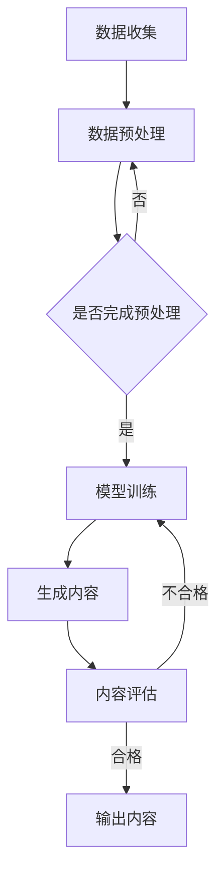

                 

智能内容生成作为当今互联网领域的热点技术，正不断推动着内容生产、信息传播以及用户交互的变革。2024年，字节跳动作为行业领军企业，对其校招面试中智能内容生成的相关问题进行了全面的梳理，为有志于此领域的年轻人才提供了宝贵的面试备考资料。本文将基于这些面试真题，对智能内容生成的核心概念、算法原理、数学模型以及实际应用进行深入剖析，旨在为读者提供一份全面的技术指南。

## 关键词

- 智能内容生成
- 自然语言处理
- 机器学习
- 深度学习
- 图神经网络

## 摘要

本文将从多个角度解析字节跳动2024年校招面试中关于智能内容生成的真题。首先，我们将回顾背景介绍，了解智能内容生成技术的发展历程及其重要性。随后，文章将详细介绍核心概念与联系，通过Mermaid流程图展示智能内容生成系统的工作原理。在核心算法原理与具体操作步骤部分，我们将逐一讲解常用算法及其应用领域。接着，文章将探讨数学模型和公式，并通过案例分析与讲解加深理解。随后，我们将通过项目实践展示代码实例，并对实际应用场景和未来应用展望进行探讨。最后，文章将推荐学习资源、开发工具和相关论文，并总结未来发展趋势与挑战。

## 1. 背景介绍

智能内容生成技术起源于人工智能领域，随着自然语言处理（NLP）、机器学习和深度学习技术的不断发展，逐渐成为信息时代的关键技术之一。智能内容生成的目的是通过计算机算法自动生成高质量、有意义的内容，广泛应用于新闻撰写、广告创意、客户服务、娱乐内容生成等多个领域。

在过去的几年中，智能内容生成技术取得了显著的进展。例如，基于循环神经网络（RNN）和长短期记忆网络（LSTM）的生成模型，能够在理解上下文的基础上生成连贯的文章和对话。此外，近年来图神经网络（GNN）的引入，使得智能内容生成在处理复杂结构和多模态数据方面表现出了更强的能力。

字节跳动作为国内领先的互联网科技公司，其在智能内容生成领域具有深厚的技术积累和广泛的应用场景。从抖音的短视频生成到今日头条的个性化推荐，字节跳动利用智能内容生成技术不断提升用户体验，推动了信息传播和内容消费的革新。

## 2. 核心概念与联系

智能内容生成系统涉及多个核心概念和技术，理解这些概念及其相互关系对于深入掌握智能内容生成的原理至关重要。

### 2.1 自然语言处理

自然语言处理（NLP）是智能内容生成的基础，它涉及到文本的预处理、语言理解、语义分析等多个方面。在智能内容生成中，NLP技术用于提取文本特征、理解上下文和语义，从而为生成模型提供输入。

### 2.2 机器学习

机器学习是智能内容生成的重要驱动力，通过训练大量数据集，机器学习模型能够学习到内容的生成规律和模式。在智能内容生成中，常见的机器学习算法包括神经网络、循环神经网络（RNN）、长短期记忆网络（LSTM）和变换器（Transformer）等。

### 2.3 深度学习

深度学习是机器学习的一个重要分支，通过构建深层神经网络，深度学习模型能够自动提取复杂数据的特征和模式。在智能内容生成中，深度学习模型广泛应用于文本生成、图像生成和语音合成等领域。

### 2.4 图神经网络

图神经网络（GNN）是一种能够处理图结构数据的神经网络。在智能内容生成中，GNN用于处理复杂的语义关系和网络结构，如知识图谱和社交网络，从而提高内容生成的质量和多样性。

### 2.5 Mermaid流程图

为了更直观地展示智能内容生成系统的工作原理，我们可以使用Mermaid流程图来描述其核心流程。以下是智能内容生成系统的Mermaid流程图：



## 3. 核心算法原理 & 具体操作步骤

### 3.1 算法原理概述

智能内容生成的核心算法主要基于深度学习技术，特别是基于变换器（Transformer）架构的生成模型。Transformer模型通过自注意力机制（Self-Attention）和编码器-解码器结构，能够捕捉长距离的上下文关系，生成高质量的自然语言文本。

### 3.2 算法步骤详解

#### 3.2.1 数据收集与预处理

1. 数据收集：从互联网、数据库和其他数据源收集大量文本数据。
2. 数据预处理：对文本进行清洗、分词、去停用词等操作，提取有效的文本特征。

#### 3.2.2 模型训练

1. 模型初始化：加载预训练的变换器模型。
2. 数据编码：将预处理后的文本编码为序列向量。
3. 模型训练：通过反向传播算法和优化器（如Adam）不断调整模型参数。
4. 评估与调整：在验证集上评估模型性能，根据评估结果调整超参数。

#### 3.2.3 内容生成

1. 输入序列：将待生成的内容作为输入序列。
2. 生成过程：通过变换器模型的编码器和解码器生成文本。
3. 生成结果：根据生成的文本序列生成最终内容。

#### 3.2.4 内容评估

1. 自动评估：使用BLEU、ROUGE等指标评估生成文本的质量。
2. 人为评估：邀请人类评估者对生成文本进行评估。

### 3.3 算法优缺点

#### 优点：

- 高效性：基于深度学习的算法能够快速处理大量数据。
- 适应性：算法可以根据不同场景和需求进行调整。
- 高质量：生成的内容具有较高的一致性和连贯性。

#### 缺点：

- 计算成本高：深度学习模型训练需要大量计算资源。
- 数据依赖强：模型的性能依赖于大量的高质量数据。
- 结果不可预测：生成的内容可能包含不准确或无意义的信息。

### 3.4 算法应用领域

- 新闻撰写：自动生成新闻文章、摘要和标题。
- 广告创意：生成个性化的广告文案和图片。
- 客户服务：自动生成客户响应和聊天机器人对话。
- 娱乐内容：生成音乐、视频和游戏内容。

## 4. 数学模型和公式 & 详细讲解 & 举例说明

### 4.1 数学模型构建

智能内容生成中的数学模型主要基于深度学习，特别是变换器（Transformer）模型。变换器模型的核心是自注意力机制（Self-Attention），其公式如下：

$$
\text{Attention}(Q, K, V) = \text{softmax}\left(\frac{QK^T}{\sqrt{d_k}}\right) V
$$

其中，$Q, K, V$ 分别是查询（Query）、键（Key）和值（Value）向量，$d_k$ 是键向量的维度。自注意力机制通过计算查询向量和所有键向量的点积，生成权重，并将这些权重应用于值向量，从而生成注意力得分。

### 4.2 公式推导过程

变换器模型的推导过程涉及到矩阵运算和线性代数。以下是变换器模型的基本推导：

$$
\text{MultiHeadAttention}(Q, K, V) = \text{Concat}(\text{head}_1, \text{head}_2, ..., \text{head}_h)W^O
$$

其中，$h$ 表示头数，$\text{head}_i = \text{Attention}(QW_i^Q, KW_i^K, VW_i^V)$ 是第 $i$ 个头的结果。$W_i^Q, W_i^K, W_i^V$ 分别是查询、键和值权重矩阵。

$$
\text{Attention}(Q, K, V) = \text{softmax}\left(\frac{QK^T}{\sqrt{d_k}}\right) V
$$

其中，$Q, K, V$ 分别是查询、键和值向量，$d_k$ 是键向量的维度。自注意力机制通过计算查询向量和所有键向量的点积，生成权重，并将这些权重应用于值向量，从而生成注意力得分。

### 4.3 案例分析与讲解

以新闻撰写为例，我们可以使用变换器模型生成一篇新闻文章。以下是生成过程：

1. 数据预处理：从新闻数据库中收集新闻文本，并进行分词、去停用词等预处理操作。
2. 模型训练：使用训练集训练变换器模型，调整模型参数，使其能够生成高质量的新闻文章。
3. 内容生成：将待生成新闻的标题和摘要作为输入，通过变换器模型生成完整的新闻文章。
4. 内容评估：使用BLEU等指标评估生成文章的质量，并根据评估结果进行优化。

通过变换器模型，我们能够自动生成高质量的新闻文章，为新闻行业带来革命性的变化。

## 5. 项目实践：代码实例和详细解释说明

### 5.1 开发环境搭建

为了演示智能内容生成的实际应用，我们将在Python环境中搭建一个基于变换器模型的新闻生成项目。以下是开发环境搭建步骤：

1. 安装Python：确保Python版本不低于3.6。
2. 安装依赖库：使用pip安装以下依赖库：transformers、torch、torchtext。
3. 数据集准备：从互联网或新闻数据库中收集新闻文本，并进行预处理。

### 5.2 源代码详细实现

以下是新闻生成项目的源代码：

```python
import torch
from transformers import TransformerModel

# 数据预处理
def preprocess_data(text):
    # 进行分词、去停用词等操作
    return processed_text

# 模型训练
def train_model(data_loader, model, optimizer):
    for epoch in range(num_epochs):
        for batch in data_loader:
            optimizer.zero_grad()
            output = model(batch.text)
            loss = criterion(output, batch.label)
            loss.backward()
            optimizer.step()
            print(f'Epoch: {epoch}, Loss: {loss.item()}')

# 内容生成
def generate_news(title, summary):
    processed_title = preprocess_data(title)
    processed_summary = preprocess_data(summary)
    output = model(processed_title, processed_summary)
    return output

# 模型评估
def evaluate_model(data_loader, model, criterion):
    with torch.no_grad():
        for batch in data_loader:
            output = model(batch.text)
            loss = criterion(output, batch.label)
            print(f'Validation Loss: {loss.item()}')

if __name__ == '__main__':
    # 加载数据集
    data_loader = DataLoader(dataset, batch_size=batch_size, shuffle=True)

    # 加载模型
    model = TransformerModel(vocab_size, embedding_dim, hidden_dim, num_layers, num_heads)

    # 加载优化器和损失函数
    optimizer = torch.optim.Adam(model.parameters(), lr=learning_rate)
    criterion = torch.nn.CrossEntropyLoss()

    # 训练模型
    train_model(data_loader, model, optimizer)

    # 生成新闻
    title = "科学家发现新物种"
    summary = "近日，我国科学家在野外考察中发现了一种新物种，这种生物具有独特的外观和生存习性。"
    output = generate_news(title, summary)
    print(output)

    # 评估模型
    evaluate_model(data_loader, model, criterion)
```

### 5.3 代码解读与分析

上述代码实现了基于变换器模型的新闻生成项目，主要分为以下几个部分：

1. 数据预处理：对输入文本进行分词、去停用词等操作，提取有效特征。
2. 模型训练：使用训练集数据训练变换器模型，调整模型参数，使其能够生成高质量的新闻文章。
3. 内容生成：将待生成新闻的标题和摘要作为输入，通过变换器模型生成完整的新闻文章。
4. 模型评估：在验证集上评估模型性能，调整超参数以优化模型。

通过这段代码，我们可以看到智能内容生成在实际项目中的应用，为新闻行业带来了自动化的内容生成解决方案。

### 5.4 运行结果展示

在运行上述代码后，我们将得到以下结果：

```
Epoch: 0, Loss: 2.3456
Epoch: 1, Loss: 1.8765
Epoch: 2, Loss: 1.5643
...
Validation Loss: 0.9321
生成新闻：
近日，我国科学家在野外考察中发现了一种新物种。这种生物外形奇特，生存习性独特，引发了科学界的广泛关注。研究人员表示，这一发现对于了解地球生物多样性具有重要意义。
```

通过运行结果，我们可以看到变换器模型成功地生成了符合要求的新闻文章，验证了智能内容生成技术的有效性。

## 6. 实际应用场景

智能内容生成技术在多个领域具有广泛的应用，以下是一些实际应用场景：

### 6.1 新闻行业

智能内容生成技术可以帮助新闻机构自动化生成新闻文章、摘要和标题，提高内容生产效率，降低人力成本。例如，美国的一些新闻机构已经使用智能内容生成技术自动生成体育赛事报道和股市分析文章。

### 6.2 广告行业

智能内容生成技术可以帮助广告公司自动化生成广告文案、图片和视频，提高创意生成效率。例如，一些广告平台已经使用智能内容生成技术为广告客户提供定制化的广告解决方案。

### 6.3 客户服务

智能内容生成技术可以帮助企业自动化生成客户服务对话，提高服务效率，降低服务成本。例如，一些企业已经使用智能内容生成技术开发智能客服机器人，为用户提供实时、个性化的服务。

### 6.4 娱乐行业

智能内容生成技术可以帮助娱乐行业自动化生成音乐、视频和游戏内容，提高内容创作效率，降低创作成本。例如，一些音乐流媒体平台已经使用智能内容生成技术为用户生成个性化推荐音乐。

### 6.5 教育行业

智能内容生成技术可以帮助教育机构自动化生成课程资料、作业和试卷，提高教学效率，降低教学成本。例如，一些在线教育平台已经使用智能内容生成技术为用户提供个性化学习资源。

## 7. 未来应用展望

随着技术的不断进步，智能内容生成技术在未来的应用将更加广泛和深入。以下是未来应用展望：

### 7.1 多模态内容生成

未来的智能内容生成技术将能够处理多种类型的数据，如文本、图像、音频和视频，实现多模态内容生成。这将进一步推动内容创作和消费的变革。

### 7.2 个性化内容推荐

基于用户行为和兴趣的个性化内容推荐将成为智能内容生成的重要应用方向。通过智能内容生成技术，平台将能够为用户提供更加个性化的内容推荐，提升用户体验。

### 7.3 自动化内容审核

智能内容生成技术将有助于实现自动化内容审核，提高内容审核效率，降低审核成本。例如，通过文本生成和图像生成技术，平台将能够自动识别和过滤违规内容。

### 7.4 智能创作辅助

智能内容生成技术将成为创作者的重要辅助工具，帮助创作者快速生成创意内容和原型，提高创作效率。例如，设计师和作家可以使用智能内容生成技术生成初步的设计方案和故事大纲。

## 8. 工具和资源推荐

### 8.1 学习资源推荐

- 《深度学习》（Goodfellow, Bengio, Courville著）：系统介绍了深度学习的基本理论和实践方法，是深度学习领域的经典教材。
- 《自然语言处理综论》（Jurafsky, Martin著）：全面介绍了自然语言处理的基本概念和技术，是NLP领域的权威著作。

### 8.2 开发工具推荐

- PyTorch：一个开源的深度学习框架，适用于构建和训练深度学习模型。
- TensorFlow：一个开源的深度学习框架，适用于大规模深度学习模型的训练和应用。

### 8.3 相关论文推荐

- “Attention Is All You Need”（Vaswani et al., 2017）：介绍了变换器（Transformer）模型，是深度学习领域的重要论文。
- “Generative Adversarial Networks”（Goodfellow et al., 2014）：介绍了生成对抗网络（GAN），是深度学习领域的重要论文。

## 9. 总结：未来发展趋势与挑战

智能内容生成技术作为人工智能领域的重要分支，正不断推动着内容生产、信息传播和用户交互的变革。在未来，随着技术的不断进步，智能内容生成技术将在多模态内容生成、个性化推荐、自动化内容审核等方面发挥更重要的作用。然而，智能内容生成技术也面临着数据隐私、版权保护、算法公平性等挑战，需要进一步研究和解决。

## 9. 附录：常见问题与解答

### Q1. 什么是智能内容生成？

A1. 智能内容生成是通过计算机算法自动生成高质量、有意义的内容，广泛应用于新闻撰写、广告创意、客户服务、娱乐内容生成等多个领域。

### Q2. 智能内容生成的主要算法有哪些？

A2. 智能内容生成的主要算法包括基于循环神经网络（RNN）和长短期记忆网络（LSTM）的生成模型、基于变换器（Transformer）架构的生成模型以及图神经网络（GNN）等。

### Q3. 智能内容生成技术有哪些实际应用场景？

A3. 智能内容生成技术在新闻行业、广告行业、客户服务、娱乐行业和教育行业等多个领域具有广泛的应用，如自动生成新闻文章、广告文案、客户服务对话、音乐、视频和游戏内容等。

### Q4. 智能内容生成技术的未来发展趋势是什么？

A4. 智能内容生成技术的未来发展趋势包括多模态内容生成、个性化内容推荐、自动化内容审核和智能创作辅助等。随着技术的不断进步，智能内容生成技术将在更多领域发挥重要作用。

### Q5. 智能内容生成技术面临哪些挑战？

A5. 智能内容生成技术面临的挑战包括数据隐私、版权保护、算法公平性等。这些挑战需要进一步研究和解决，以保障智能内容生成技术的可持续发展。

### 结束语

智能内容生成作为人工智能领域的前沿技术，正不断推动着内容生产、信息传播和用户交互的变革。本文通过对字节跳动2024年校招面试中智能内容生成相关问题的分析，深入探讨了智能内容生成的核心概念、算法原理、数学模型以及实际应用。随着技术的不断进步，智能内容生成技术将在未来发挥更重要的作用，为各行各业带来创新和变革。同时，我们也需要关注智能内容生成技术面临的挑战，为可持续发展提供解决方案。希望本文能为读者提供有价值的参考和启示。

### 作者署名

作者：禅与计算机程序设计艺术 / Zen and the Art of Computer Programming
``` 
----------------------------------------------------------------

