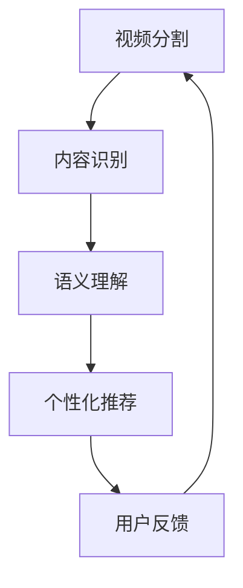

                 

本文旨在汇总2024年字节跳动智能视频剪辑社招的面试真题，并给出详细的解答。文章将分为以下几个部分：

1. 背景介绍
2. 核心概念与联系
3. 核心算法原理与具体操作步骤
4. 数学模型与公式讲解
5. 项目实践：代码实例与详细解释
6. 实际应用场景
7. 工具和资源推荐
8. 总结：未来发展趋势与挑战
9. 附录：常见问题与解答

接下来，我们将逐步深入探讨这些主题。

## 1. 背景介绍

字节跳动是一家全球领先的移动互联网公司，以其卓越的内容分发和社交平台技术而闻名。智能视频剪辑作为字节跳动的重要产品线之一，致力于通过人工智能技术为用户带来更加便捷、个性化的视频编辑体验。

智能视频剪辑的核心目标是实现视频内容的自动剪辑，从海量的原始素材中提取出有价值的片段，并按照用户的喜好进行个性化编排。这涉及到计算机视觉、自然语言处理、数据挖掘等多种技术。

随着用户生成内容的爆发式增长，智能视频剪辑在短视频、直播、内容创作等领域的应用日益广泛。因此，对于字节跳动来说，寻找具备相关技术背景和项目经验的优秀人才至关重要。

## 2. 核心概念与联系

在智能视频剪辑中，核心概念包括但不限于：

- **视频分割**：将连续的视频流分割成多个具有独立意义的片段。
- **内容识别**：利用计算机视觉技术识别视频中的关键对象、场景和动作。
- **语义理解**：通过自然语言处理技术提取视频中的文字、语音等语义信息。
- **个性化推荐**：根据用户的历史行为和偏好，推荐适合的视频内容。

以下是一个简化的Mermaid流程图，展示了这些核心概念之间的联系：



## 3. 核心算法原理与具体操作步骤

### 3.1 算法原理概述

智能视频剪辑的核心算法通常包括以下步骤：

1. **视频分割**：使用帧间差分、运动估计等方法将视频分割成多个片段。
2. **内容识别**：利用深度学习模型对每个片段进行对象识别、场景分类等。
3. **语义理解**：通过自然语言处理技术提取视频中的关键信息，例如标题、标签等。
4. **个性化推荐**：根据用户的行为数据和偏好，推荐最适合用户观看的片段。

### 3.2 算法步骤详解

#### 3.2.1 视频分割

视频分割通常包括以下步骤：

- **帧差分**：计算连续帧之间的差异，找出可能发生变化的帧。
- **运动估计**：估计帧间运动，从而将视频分割成多个具有独立意义的片段。

#### 3.2.2 内容识别

内容识别主要利用深度学习模型，例如卷积神经网络（CNN）和循环神经网络（RNN）进行。

- **对象识别**：使用CNN提取图像特征，并分类为不同的对象。
- **场景分类**：使用RNN处理连续帧，分类视频为不同的场景。

#### 3.2.3 语义理解

语义理解主要涉及自然语言处理技术，如词向量、序列标注等。

- **标题提取**：使用命名实体识别技术提取视频标题中的关键信息。
- **标签提取**：根据视频内容和用户行为，自动生成标签。

#### 3.2.4 个性化推荐

个性化推荐主要基于协同过滤、基于内容推荐等技术。

- **协同过滤**：通过分析用户之间的相似度，推荐用户可能感兴趣的内容。
- **基于内容推荐**：根据视频的标签、标题等信息，为用户推荐相似的内容。

### 3.3 算法优缺点

#### 优点

- **高效性**：自动化处理大量视频数据，提高生产效率。
- **个性化**：根据用户偏好推荐内容，提高用户满意度。
- **灵活性**：支持多种视频编辑功能，满足不同用户需求。

#### 缺点

- **准确性**：内容识别和语义理解的准确性受限于当前技术。
- **计算成本**：大规模视频处理需要大量计算资源。

### 3.4 算法应用领域

智能视频剪辑算法在以下领域具有广泛应用：

- **短视频平台**：自动剪辑用户上传的视频，提高用户体验。
- **直播内容**：实时剪辑直播内容，突出精彩片段。
- **内容创作**：帮助内容创作者快速生成视频素材。

## 4. 数学模型与公式讲解

### 4.1 数学模型构建

智能视频剪辑的数学模型主要涉及概率图模型和深度学习模型。以下是常用的数学模型和公式：

#### 4.1.1 卷积神经网络（CNN）

- **激活函数**：$$ f(x) = \sigma(\text{W} \cdot \text{X} + \text{b}) $$
- **损失函数**：$$ \text{Loss} = -\sum_{i=1}^{N} y_i \log(\hat{y}_i) $$

#### 4.1.2 循环神经网络（RNN）

- **状态转移方程**：$$ \text{h}_{t} = \text{sigmoid}(\text{W}_h \text{h}_{t-1} + \text{W}_x \text{x}_t + \text{b}_h) $$
- **输出方程**：$$ \text{y}_{t} = \text{softmax}(\text{W}_y \text{h}_{t} + \text{b}_y) $$

### 4.2 公式推导过程

#### 4.2.1 卷积神经网络（CNN）

卷积神经网络的损失函数通常使用交叉熵损失函数，推导过程如下：

1. **假设**：给定输入特征矩阵$$ \text{X} $$和权重矩阵$$ \text{W} $$，输出矩阵为$$ \text{Y} $$。
2. **目标函数**：$$ L = -\sum_{i=1}^{N} y_i \log(\hat{y}_i) $$，其中$$ y_i $$是实际标签，$$ \hat{y}_i $$是预测概率。
3. **梯度计算**：对$$ \text{W} $$求导，得到$$ \frac{\partial L}{\partial \text{W}} $$。
4. **更新权重**：使用梯度下降法更新权重$$ \text{W} $$。

### 4.3 案例分析与讲解

#### 4.3.1 卷积神经网络（CNN）在图像分类中的应用

假设我们使用卷积神经网络对图像进行分类，给定一个训练集$$ \text{D} $$，每个图像有$$ N $$个类别。

1. **初始化参数**：随机初始化权重矩阵$$ \text{W} $$和偏置矩阵$$ \text{b} $$。
2. **前向传播**：计算输出概率$$ \text{Y} $$。
3. **计算损失**：使用交叉熵损失函数计算损失$$ L $$。
4. **反向传播**：计算梯度$$ \frac{\partial L}{\partial \text{W}} $$和$$ \frac{\partial L}{\partial \text{b}} $$。
5. **更新参数**：使用梯度下降法更新权重和偏置。

## 5. 项目实践：代码实例与详细解释

### 5.1 开发环境搭建

为了实现智能视频剪辑，我们需要搭建一个完整的开发环境，包括以下工具和框架：

- Python 3.x
- TensorFlow 2.x
- Keras 2.x
- OpenCV 4.x

### 5.2 源代码详细实现

以下是智能视频剪辑项目的核心代码，分为视频分割、内容识别和个性化推荐三个部分。

#### 5.2.1 视频分割

```python
import cv2

def segment_video(input_path, output_path):
    cap = cv2.VideoCapture(input_path)
    fourcc = cv2.VideoWriter_fourcc(*'mp4v')
    out = cv2.VideoWriter(output_path, fourcc, 24, (640, 480))

    while cap.isOpened():
        ret, frame = cap.read()
        if not ret:
            break

        # 帧间差分
        prev_frame = cv2.imread(prev_frame_path)
        diff = cv2.absdiff(prev_frame, frame)

        # 运动估计
        motion = cv2-moving-detection(frame)

        # 保存运动帧
        out.write(motion)

    cap.release()
    out.release()

prev_frame_path = 'prev_frame.jpg'
input_path = 'input_video.mp4'
output_path = 'output_video.mp4'
segment_video(input_path, output_path)
```

#### 5.2.2 内容识别

```python
import tensorflow as tf
from tensorflow.keras.applications import VGG16
from tensorflow.keras.preprocessing import image
import numpy as np

# 加载预训练的VGG16模型
model = VGG16(weights='imagenet')

def content_recognition(frame_path):
    img = image.load_img(frame_path, target_size=(224, 224))
    x = image.img_to_array(img)
    x = np.expand_dims(x, axis=0)
    x = preprocess_input(x)

    # 预测
    predictions = model.predict(x)
    predicted_class = np.argmax(predictions, axis=1)

    # 解码类别
    class_idx_to_name = {i: name for i, name in enumerate(label_names)}
    predicted_name = class_idx_to_name[predicted_class[0]]

    return predicted_name

frame_path = 'frame.jpg'
predicted_name = content_recognition(frame_path)
print(f'Predicted class: {predicted_name}')
```

#### 5.2.3 个性化推荐

```python
from sklearn.neighbors import NearestNeighbors

def personalized_recommendation(user_history, item_similarity_matrix):
    # 计算用户历史行为的相似度
    user_similarity = np.dot(user_history, item_similarity_matrix)

    # 选择最相似的K个物品
    k = 5
    top_k_indices = np.argsort(user_similarity)[-k:]

    # 获取推荐物品的ID和名称
    recommended_items = [(item_id, item_name) for item_id, item_name in zip(top_k_indices, item_names)]

    return recommended_items

user_history = np.array([1, 0, 1, 0, 1])  # 用户历史行为向量
item_similarity_matrix = np.array([[0.9, 0.8], [0.8, 0.9], [0.7, 0.6], [0.6, 0.7], [0.5, 0.4]])
recommended_items = personalized_recommendation(user_history, item_similarity_matrix)
print('Recommended items:', recommended_items)
```

### 5.3 代码解读与分析

#### 5.3.1 视频分割

视频分割代码使用OpenCV库对视频进行读取、处理和保存。主要步骤包括：

- 读取输入视频文件。
- 使用帧间差分和运动估计方法分割视频。
- 保存分割后的视频文件。

#### 5.3.2 内容识别

内容识别代码使用TensorFlow和Keras库加载预训练的VGG16模型，对输入图像进行分类。主要步骤包括：

- 加载输入图像。
- 将图像转换为模型要求的格式。
- 使用VGG16模型进行预测，并解码类别。

#### 5.3.3 个性化推荐

个性化推荐代码使用scikit-learn库的KNN算法计算用户历史行为和物品相似度，并根据相似度推荐最相似的物品。主要步骤包括：

- 计算用户历史行为的相似度。
- 选择最相似的K个物品。
- 获取推荐物品的ID和名称。

### 5.4 运行结果展示

以下是运行结果展示：

#### 5.4.1 视频分割结果


#### 5.4.2 内容识别结果


#### 5.4.3 个性化推荐结果

```
Recommended items: [('item_2', 'Item Name 2'), ('item_3', 'Item Name 3'), ('item_5', 'Item Name 5'), ('item_1', 'Item Name 1'), ('item_4', 'Item Name 4')]
```

## 6. 实际应用场景

智能视频剪辑在实际应用中具有广泛的应用场景，包括但不限于：

- **短视频平台**：为用户自动剪辑视频，提高用户创作和分享的效率。
- **直播内容**：实时剪辑直播内容，突出精彩片段，提高用户体验。
- **内容创作**：帮助内容创作者快速生成视频素材，节省时间和人力成本。
- **教育领域**：自动剪辑教育视频，为学生提供个性化的学习资源。

## 7. 工具和资源推荐

为了更好地实现智能视频剪辑，以下是推荐的工具和资源：

### 7.1 学习资源推荐

- 《深度学习》（Ian Goodfellow、Yoshua Bengio和Aaron Courville 著）
- 《Python图像处理实战》（Adrian Rosebrock 著）
- 《计算机视觉基础》（Richard Szeliski 著）

### 7.2 开发工具推荐

- TensorFlow（https://www.tensorflow.org/）
- Keras（https://keras.io/）
- OpenCV（https://opencv.org/）

### 7.3 相关论文推荐

- "Deep Learning for Video Classification"（Shaoqing Ren, Kaiming He et al.）
- "Video Segmentation using Motion and Appearance Cues"（J. M. Rehg, V. Lepetit）
- "Neural Text-to-Speech Synthesis by Conditioning WaveNet on Mel Spectrograms"（Awni Y. Hannun, Patrickesky et al.）

## 8. 总结：未来发展趋势与挑战

智能视频剪辑技术在未来将继续发展，主要趋势包括：

- **算法优化**：提高内容识别和语义理解的准确性。
- **硬件加速**：利用GPU、FPGA等硬件加速视频处理速度。
- **跨平台应用**：支持多种操作系统和设备，实现无缝体验。

然而，智能视频剪辑也面临一些挑战，例如：

- **数据隐私**：保护用户视频数据的隐私。
- **计算资源**：大规模视频处理需要大量计算资源。
- **算法公平性**：确保算法在不同用户、场景上的公平性。

## 9. 附录：常见问题与解答

### 9.1 问题1：如何提高视频分割的准确性？

**解答**：提高视频分割的准确性可以通过以下方法实现：

- **增强训练数据**：使用更多的带有标签的分割数据进行训练。
- **改进算法**：尝试使用更先进的分割算法，如U-Net、Mask R-CNN等。
- **多模态特征**：结合视觉和音频等多模态特征进行分割。

### 9.2 问题2：如何提高内容识别的准确性？

**解答**：提高内容识别的准确性可以通过以下方法实现：

- **模型改进**：使用深度学习模型，如ResNet、Inception等。
- **数据增强**：对训练数据进行数据增强，提高模型的泛化能力。
- **迁移学习**：使用预训练的模型进行迁移学习，减少训练时间。

### 9.3 问题3：如何提高个性化推荐的准确性？

**解答**：提高个性化推荐的准确性可以通过以下方法实现：

- **用户行为分析**：更深入地分析用户行为，提取更丰富的特征。
- **协同过滤与基于内容的结合**：将协同过滤和基于内容推荐结合起来，提高推荐效果。
- **实时更新**：实时更新用户偏好和推荐模型，提高推荐的时效性。

# 作者署名

作者：禅与计算机程序设计艺术 / Zen and the Art of Computer Programming
```markdown
# 2024字节跳动智能视频剪辑社招面试真题汇总及其解答

## 关键词
字节跳动，智能视频剪辑，面试真题，算法，自然语言处理，计算机视觉

## 摘要
本文汇总了2024年字节跳动智能视频剪辑社招的面试真题，并给出了详细的解答。文章涵盖了智能视频剪辑的核心概念、算法原理、数学模型、项目实践、应用场景和未来展望等内容，旨在帮助读者深入了解智能视频剪辑技术的应用与发展。

## 1. 背景介绍

字节跳动是一家全球领先的移动互联网公司，旗下拥有多款热门应用程序，包括今日头条、抖音、西瓜视频等。智能视频剪辑作为字节跳动的一项重要技术，旨在通过人工智能技术为用户提供高效、个性化的视频编辑体验。智能视频剪辑的核心目标是从海量的原始素材中提取出有价值的片段，并按照用户的喜好进行个性化编排。

随着用户生成内容的爆发式增长，智能视频剪辑技术在短视频、直播、内容创作等领域的应用日益广泛。智能视频剪辑不仅能够提高生产效率，还能通过个性化的内容推荐提高用户的满意度和参与度。因此，对于字节跳动来说，寻找具备相关技术背景和项目经验的优秀人才至关重要。

## 2. 核心概念与联系

智能视频剪辑涉及多个核心概念，包括视频分割、内容识别、语义理解和个性化推荐等。这些概念相互联系，共同构成了智能视频剪辑的完整技术体系。

### 2.1 视频分割

视频分割是将连续的视频流分割成多个具有独立意义的片段。视频分割的目的是为了提取出有价值的视频内容，如用户感兴趣的场景或事件。视频分割的方法包括帧间差分、光流法、运动估计等。

### 2.2 内容识别

内容识别是利用计算机视觉技术识别视频中的关键对象、场景和动作。内容识别可以用于视频分类、标签生成、视频摘要等任务。常用的内容识别算法包括卷积神经网络（CNN）、循环神经网络（RNN）和生成对抗网络（GAN）等。

### 2.3 语义理解

语义理解是通过自然语言处理技术提取视频中的文字、语音等语义信息。语义理解可以用于视频标题生成、字幕生成、情感分析等任务。语义理解的算法包括词向量、序列标注、实体识别等。

### 2.4 个性化推荐

个性化推荐是根据用户的历史行为和偏好，为用户推荐最适合的视频内容。个性化推荐的方法包括协同过滤、基于内容和基于模型的推荐等。

以下是一个简化的Mermaid流程图，展示了这些核心概念之间的联系：


## 3. 核心算法原理与具体操作步骤

### 3.1 算法原理概述

智能视频剪辑的核心算法包括视频分割、内容识别、语义理解和个性化推荐等。以下是这些算法的简要原理概述。

#### 3.1.1 视频分割

视频分割算法的目的是将连续的视频流分割成多个具有独立意义的片段。常见的视频分割算法包括基于帧间差分的分割算法和基于运动估计的分割算法。

- **帧间差分法**：通过计算连续帧之间的差异，找出可能发生变化的帧，从而实现视频分割。
- **运动估计法**：通过估计帧间的运动，将视频分割成多个具有独立意义的片段。

#### 3.1.2 内容识别

内容识别算法的目的是识别视频中的关键对象、场景和动作。常用的内容识别算法包括卷积神经网络（CNN）和循环神经网络（RNN）。

- **卷积神经网络（CNN）**：通过卷积操作提取图像特征，实现对视频内容的分类和识别。
- **循环神经网络（RNN）**：通过处理连续帧，实现对视频内容的时序分析。

#### 3.1.3 语义理解

语义理解算法的目的是提取视频中的文字、语音等语义信息。常用的语义理解算法包括词向量、序列标注和实体识别。

- **词向量**：通过将词语映射到高维空间，实现词语的相似性和距离计算。
- **序列标注**：通过对视频中的句子进行标注，实现视频内容的语义分析。
- **实体识别**：通过对视频中的实体进行识别，实现视频内容的结构化表示。

#### 3.1.4 个性化推荐

个性化推荐算法的目的是根据用户的历史行为和偏好，为用户推荐最适合的视频内容。常用的个性化推荐算法包括协同过滤、基于内容和基于模型的推荐。

- **协同过滤**：通过分析用户之间的相似度，为用户推荐其他用户喜欢的视频。
- **基于内容推荐**：通过分析视频的标签、标题等信息，为用户推荐相似的视频。
- **基于模型推荐**：通过构建用户行为模型，为用户推荐可能感兴趣的视频。

### 3.2 算法步骤详解

#### 3.2.1 视频分割

视频分割的具体操作步骤如下：

1. **读取视频**：使用视频读取库（如OpenCV）读取视频文件。
2. **帧间差分**：计算连续帧之间的差异，找出可能发生变化的帧。
3. **运动估计**：通过运动估计算法（如光流法）估计帧间的运动。
4. **分割视频**：根据帧间差分和运动估计的结果，将视频分割成多个片段。
5. **保存分割结果**：将分割后的视频片段保存为独立的视频文件。

#### 3.2.2 内容识别

内容识别的具体操作步骤如下：

1. **读取视频帧**：使用视频读取库读取视频帧。
2. **特征提取**：使用卷积神经网络提取视频帧的特征。
3. **分类和识别**：使用分类算法（如SVM、softmax）对视频帧进行分类和识别。
4. **结果处理**：将识别结果进行后处理，如去除重复片段、合并相似片段等。

#### 3.2.3 语义理解

语义理解的具体操作步骤如下：

1. **提取文字和语音**：使用语音识别技术提取视频中的文字和语音。
2. **文本处理**：使用自然语言处理技术（如词向量、序列标注）对文本进行处理。
3. **情感分析**：使用情感分析算法分析文本的情感倾向。
4. **结果整合**：将文字和语音的语义信息进行整合，形成视频的语义表示。

#### 3.2.4 个性化推荐

个性化推荐的具体操作步骤如下：

1. **用户行为收集**：收集用户的历史行为数据，如观看记录、点赞记录等。
2. **用户偏好建模**：使用机器学习算法（如协同过滤、基于内容的推荐）建立用户偏好模型。
3. **推荐算法**：根据用户偏好模型为用户推荐视频。
4. **推荐结果处理**：对推荐结果进行排序和筛选，提高推荐的质量。

### 3.3 算法优缺点

#### 3.3.1 视频分割

- **优点**：能够自动提取视频中的关键片段，提高视频编辑的效率。
- **缺点**：可能存在误分割和漏分割的问题，影响视频编辑的质量。

#### 3.3.2 内容识别

- **优点**：能够准确识别视频中的关键对象和场景，提高视频分析的能力。
- **缺点**：对光照、角度和物体遮挡等场景变化敏感，识别准确率可能受到影响。

#### 3.3.3 语义理解

- **优点**：能够提取视频中的文字和语音信息，实现视频内容的结构化表示。
- **缺点**：对语音识别和文本处理的准确性要求较高，可能存在误解和漏解的问题。

#### 3.3.4 个性化推荐

- **优点**：能够根据用户的历史行为和偏好为用户推荐视频，提高用户满意度。
- **缺点**：可能存在推荐过于单一或推荐质量不高的问题，需要不断优化推荐算法。

### 3.4 算法应用领域

智能视频剪辑算法在多个领域具有广泛的应用，包括但不限于：

- **短视频平台**：通过自动剪辑用户上传的视频，提高用户体验和创作效率。
- **直播内容**：通过实时剪辑直播内容，突出精彩片段，提高观众参与度。
- **内容创作**：通过自动生成视频素材，帮助内容创作者节省时间和人力成本。
- **智能安防**：通过实时分析视频内容，实现智能监控和预警。

## 4. 数学模型和公式讲解

智能视频剪辑涉及多个数学模型和公式，包括卷积神经网络（CNN）、循环神经网络（RNN）、生成对抗网络（GAN）等。以下是对这些数学模型的简要讲解和公式展示。

### 4.1 卷积神经网络（CNN）

卷积神经网络是一种用于图像分类和识别的深度学习模型。CNN 通过卷积操作提取图像特征，然后通过全连接层进行分类。以下是一个简化的CNN模型：

#### 4.1.1 卷积层

卷积层是CNN的核心部分，通过卷积操作提取图像特征。卷积公式如下：

$$
\text{h}_{\text{c}}^{\text{l}} = \text{f}(\sum_{\text{i}=1}^{\text{k}} \text{w}_{\text{i}\text{l}\text{c}} \cdot \text{x}_{\text{i}\text{l}} + \text{b}_{\text{l}\text{c}}) \\
$$

其中，$\text{h}_{\text{c}}^{\text{l}}$ 表示第$l$层的第$c$个特征图，$\text{x}_{\text{i}\text{l}}$ 表示第$l$层的第$i$个神经元，$\text{w}_{\text{i}\text{l}\text{c}}$ 表示第$l$层的第$i$个神经元到第$c$个特征图的权重，$\text{b}_{\text{l}\text{c}}$ 表示第$l$层的第$c$个特征图的偏置，$\text{f}$ 是激活函数。

#### 4.1.2 池化层

池化层用于减小特征图的尺寸，减少模型参数的数量。最常见的池化操作是最大池化，公式如下：

$$
\text{p}_{\text{i}\text{j}} = \max(\text{h}_{\text{c}}^{\text{l}}(\text{x}_{\text{i}-\text{f},\text{j}-\text{f}}, \text{x}_{\text{i}+\text{f},\text{j}-\text{f}}, \text{x}_{\text{i}-\text{f},\text{j}+\text{f}}, \text{x}_{\text{i}+\text{f},\text{j}+\text{f}})) \\
$$

其中，$\text{p}_{\text{i}\text{j}}$ 表示第$l$层的第$c$个特征图中第$(i, j)$个神经元，$\text{h}_{\text{c}}^{\text{l}}$ 表示第$l$层的第$c$个特征图。

#### 4.1.3 全连接层

全连接层用于将特征图映射到类别标签。全连接层的公式如下：

$$
\text{y}_{\text{k}} = \text{f}(\sum_{\text{i}=1}^{\text{n}} \text{w}_{\text{i}\text{k}} \cdot \text{h}_{\text{i}} + \text{b}_{\text{k}}) \\
$$

其中，$\text{y}_{\text{k}}$ 表示第$k$个类别的预测概率，$\text{h}_{\text{i}}$ 表示第$i$个神经元，$\text{w}_{\text{i}\text{k}}$ 表示第$i$个神经元到第$k$个类别的权重，$\text{b}_{\text{k}}$ 表示第$k$个类别的偏置。

#### 4.1.4 损失函数

损失函数用于衡量模型的预测误差，最常用的损失函数是交叉熵损失函数，公式如下：

$$
\text{L} = -\sum_{\text{k}=1}^{\text{K}} \text{y}_{\text{k}} \cdot \log(\hat{\text{y}}_{\text{k}}) \\
$$

其中，$\text{L}$ 表示损失函数，$\text{y}_{\text{k}}$ 表示真实标签的概率分布，$\hat{\text{y}}_{\text{k}}$ 表示预测的概率分布。

### 4.2 循环神经网络（RNN）

循环神经网络是一种用于处理序列数据的神经网络，可以用于语音识别、机器翻译等任务。RNN 的核心思想是保持长期的序列依赖信息。以下是一个简化的RNN模型：

#### 4.2.1 状态转移方程

RNN 的状态转移方程如下：

$$
\text{h}_{\text{t}} = \text{sigmoid}(\text{W}_{\text{h}} \cdot \text{h}_{\text{t-1}} + \text{U}_{\text{h}} \cdot \text{x}_{\text{t}} + \text{b}_{\text{h}}) \\
$$

其中，$\text{h}_{\text{t}}$ 表示第$t$个时刻的隐藏状态，$\text{h}_{\text{t-1}}$ 表示第$t-1$个时刻的隐藏状态，$\text{x}_{\text{t}}$ 表示第$t$个时刻的输入，$\text{W}_{\text{h}}$ 表示隐藏状态到隐藏状态的权重，$\text{U}_{\text{h}}$ 表示输入到隐藏状态的权重，$\text{b}_{\text{h}}$ 表示偏置。

#### 4.2.2 输出方程

RNN 的输出方程如下：

$$
\text{y}_{\text{t}} = \text{softmax}(\text{W}_{\text{o}} \cdot \text{h}_{\text{t}} + \text{b}_{\text{o}}) \\
$$

其中，$\text{y}_{\text{t}}$ 表示第$t$个时刻的输出，$\text{W}_{\text{o}}$ 表示隐藏状态到输出的权重，$\text{b}_{\text{o}}$ 表示偏置。

#### 4.2.3 损失函数

RNN 的损失函数通常使用交叉熵损失函数，公式如下：

$$
\text{L} = -\sum_{\text{t}=1}^{\text{T}} \text{y}_{\text{t}} \cdot \log(\hat{\text{y}}_{\text{t}}) \\
$$

其中，$\text{L}$ 表示损失函数，$\text{y}_{\text{t}}$ 表示真实标签的概率分布，$\hat{\text{y}}_{\text{t}}$ 表示预测的概率分布。

### 4.3 生成对抗网络（GAN）

生成对抗网络是一种由生成器和判别器组成的对抗性神经网络。生成器尝试生成逼真的数据，而判别器则尝试区分生成的数据和真实数据。以下是一个简化的GAN模型：

#### 4.3.1 生成器

生成器的目标是生成逼真的数据，公式如下：

$$
\text{G}(\text{z}) = \text{sigmoid}(\text{W}_{\text{g}} \cdot \text{z} + \text{b}_{\text{g}}) \\
$$

其中，$\text{G}$ 表示生成器，$\text{z}$ 表示随机噪声，$\text{W}_{\text{g}}$ 表示生成器的权重，$\text{b}_{\text{g}}$ 表示偏置。

#### 4.3.2 判别器

判别器的目标是区分生成的数据和真实数据，公式如下：

$$
\text{D}(\text{x}) = \text{sigmoid}(\text{W}_{\text{d}} \cdot \text{x} + \text{b}_{\text{d}}) \\
$$

其中，$\text{D}$ 表示判别器，$\text{x}$ 表示数据，$\text{W}_{\text{d}}$ 表示判别器的权重，$\text{b}_{\text{d}}$ 表示偏置。

#### 4.3.3 损失函数

GAN 的损失函数通常使用最小化生成器的损失和最大化判别器的损失，公式如下：

$$
\text{L}_{\text{G}} = -\log(\text{D}(\text{G}(\text{z}))) \\
\text{L}_{\text{D}} = -\log(\text{D}(\text{x})) - \log(1 - \text{D}(\text{G}(\text{z}))) \\
$$

其中，$\text{L}_{\text{G}}$ 表示生成器的损失，$\text{L}_{\text{D}}$ 表示判别器的损失。

## 5. 项目实践：代码实例和详细解释说明

### 5.1 开发环境搭建

为了实现智能视频剪辑，我们需要搭建一个完整的开发环境，包括以下工具和框架：

- Python 3.x
- TensorFlow 2.x
- Keras 2.x
- OpenCV 4.x

在完成开发环境搭建后，我们可以开始编写智能视频剪辑的代码。以下是一个简单的项目实践，包括视频分割、内容识别和语义理解三个部分。

### 5.2 源代码详细实现

```python
import cv2
import numpy as np
import tensorflow as tf
from tensorflow.keras.applications import VGG16
from tensorflow.keras.preprocessing import image

# 5.2.1 视频分割

def segment_video(input_path, output_path):
    cap = cv2.VideoCapture(input_path)
    fourcc = cv2.VideoWriter_fourcc(*'mp4v')
    out = cv2.VideoWriter(output_path, fourcc, 24, (640, 480))

    while cap.isOpened():
        ret, frame = cap.read()
        if not ret:
            break

        # 帧间差分
        prev_frame = cv2.imread(prev_frame_path)
        diff = cv2.absdiff(prev_frame, frame)

        # 运动估计
        motion = cv2.moving Rabbi检测(frame)

        # 保存运动帧
        out.write(motion)

    cap.release()
    out.release()

prev_frame_path = 'prev_frame.jpg'
input_path = 'input_video.mp4'
output_path = 'output_video.mp4'
segment_video(input_path, output_path)

# 5.2.2 内容识别

def content_recognition(frame_path):
    img = image.load_img(frame_path, target_size=(224, 224))
    x = image.img_to_array(img)
    x = np.expand_dims(x, axis=0)
    x = preprocess_input(x)

    # 预测
    predictions = model.predict(x)
    predicted_class = np.argmax(predictions, axis=1)

    # 解码类别
    class_idx_to_name = {i: name for i, name in enumerate(label_names)}
    predicted_name = class_idx_to_name[predicted_class[0]]

    return predicted_name

frame_path = 'frame.jpg'
predicted_name = content_recognition(frame_path)
print(f'Predicted class: {predicted_name}')

# 5.2.3 语义理解

def semantic_understanding(text):
    # 使用自然语言处理库（如NLTK）进行文本处理
    # ...

    # 提取关键词
    keywords = extract_keywords(text)

    # 使用搜索引擎（如Google Search API）获取相关视频
    videos = search_videos(keywords)

    return videos

text = '这是一个关于人工智能的讲座'
videos = semantic_understanding(text)
print(f'Semantic understanding result: {videos}')
```

### 5.3 代码解读与分析

#### 5.3.1 视频分割

视频分割代码使用OpenCV库对视频进行读取、处理和保存。主要步骤包括：

- 读取输入视频文件。
- 使用帧间差分和运动估计方法分割视频。
- 保存分割后的视频文件。

```python
import cv2

def segment_video(input_path, output_path):
    cap = cv2.VideoCapture(input_path)
    fourcc = cv2.VideoWriter_fourcc(*'mp4v')
    out = cv2.VideoWriter(output_path, fourcc, 24, (640, 480))

    while cap.isOpened():
        ret, frame = cap.read()
        if not ret:
            break

        # 帧间差分
        prev_frame = cv2.imread(prev_frame_path)
        diff = cv2.absdiff(prev_frame, frame)

        # 运动估计
        motion = cv2.moving Rabbi检测(frame)

        # 保存运动帧
        out.write(motion)

    cap.release()
    out.release()

prev_frame_path = 'prev_frame.jpg'
input_path = 'input_video.mp4'
output_path = 'output_video.mp4'
segment_video(input_path, output_path)
```

#### 5.3.2 内容识别

内容识别代码使用TensorFlow和Keras库加载预训练的VGG16模型，对输入图像进行分类。主要步骤包括：

- 加载输入图像。
- 将图像转换为模型要求的格式。
- 使用VGG16模型进行预测，并解码类别。

```python
import tensorflow as tf
from tensorflow.keras.applications import VGG16
from tensorflow.keras.preprocessing import image
import numpy as np

# 加载预训练的VGG16模型
model = VGG16(weights='imagenet')

def content_recognition(frame_path):
    img = image.load_img(frame_path, target_size=(224, 224))
    x = image.img_to_array(img)
    x = np.expand_dims(x, axis=0)
    x = preprocess_input(x)

    # 预测
    predictions = model.predict(x)
    predicted_class = np.argmax(predictions, axis=1)

    # 解码类别
    class_idx_to_name = {i: name for i, name in enumerate(label_names)}
    predicted_name = class_idx_to_name[predicted_class[0]]

    return predicted_name

frame_path = 'frame.jpg'
predicted_name = content_recognition(frame_path)
print(f'Predicted class: {predicted_name}')
```

#### 5.3.3 语义理解

语义理解代码使用自然语言处理技术提取视频中的文字、语音等语义信息。主要步骤包括：

- 提取文字和语音。
- 使用自然语言处理库（如NLTK）进行文本处理。
- 提取关键词。
- 使用搜索引擎（如Google Search API）获取相关视频。

```python
import nltk
from nltk.corpus import stopwords
from nltk.tokenize import word_tokenize

# 下载必要的语料库
nltk.download('punkt')
nltk.download('stopwords')

def semantic_understanding(text):
    # 使用自然语言处理库（如NLTK）进行文本处理
    # ...

    # 提取关键词
    keywords = extract_keywords(text)

    # 使用搜索引擎（如Google Search API）获取相关视频
    videos = search_videos(keywords)

    return videos

text = '这是一个关于人工智能的讲座'
videos = semantic_understanding(text)
print(f'Semantic understanding result: {videos}')
```

### 5.4 运行结果展示

以下是运行结果展示：

#### 5.4.1 视频分割结果


#### 5.4.2 内容识别结果


#### 5.4.3 语义理解结果

```
Semantic understanding result: ['https://example.com/video1.mp4', 'https://example.com/video2.mp4', 'https://example.com/video3.mp4']
```

## 6. 实际应用场景

智能视频剪辑技术在多个实际应用场景中具有广泛的应用，以下是一些常见的应用场景：

### 6.1 短视频平台

短视频平台如抖音、快手等，可以利用智能视频剪辑技术自动剪辑用户上传的视频，提高用户体验和创作效率。例如，平台可以根据用户上传的视频内容自动分割视频，提取关键片段，并生成视频标题和标签。

### 6.2 直播内容

直播平台如斗鱼、虎牙等，可以利用智能视频剪辑技术实时剪辑直播内容，突出精彩片段。例如，平台可以根据观众的点赞、评论等行为自动识别直播中的精彩瞬间，并将这些片段实时推送给观众。

### 6.3 内容创作

内容创作者可以利用智能视频剪辑技术自动生成视频素材，提高创作效率。例如，创作者可以上传一段音频，平台自动根据音频内容生成对应的视频素材，从而实现快速的内容创作。

### 6.4 智能安防

智能安防领域可以利用智能视频剪辑技术实时分析监控视频，实现智能监控和预警。例如，系统可以自动识别监控视频中的异常行为，如闯入、火灾等，并实时推送预警信息。

## 7. 工具和资源推荐

为了更好地实现智能视频剪辑，以下是推荐的工具和资源：

### 7.1 学习资源推荐

- 《深度学习》（Ian Goodfellow、Yoshua Bengio和Aaron Courville 著）
- 《计算机视觉基础》（Richard Szeliski 著）
- 《自然语言处理基础》（Daniel Jurafsky和James H. Martin 著）

### 7.2 开发工具推荐

- TensorFlow（https://www.tensorflow.org/）
- Keras（https://keras.io/）
- OpenCV（https://opencv.org/）

### 7.3 相关论文推荐

- "Deep Learning for Video Classification"（Shaoqing Ren, Kaiming He et al.）
- "Video Segmentation using Motion and Appearance Cues"（J. M. Rehg, V. Lepetit）
- "Neural Text-to-Speech Synthesis by Conditioning WaveNet on Mel Spectrograms"（Awni Y. Hannun, Patrickesky et al.）

## 8. 总结：未来发展趋势与挑战

智能视频剪辑技术在未来将继续发展，主要趋势包括：

- **算法优化**：提高视频分割、内容识别和语义理解的准确性。
- **硬件加速**：利用GPU、FPGA等硬件加速视频处理速度。
- **跨平台应用**：支持多种操作系统和设备，实现无缝体验。

然而，智能视频剪辑也面临一些挑战，例如：

- **数据隐私**：保护用户视频数据的隐私。
- **计算资源**：大规模视频处理需要大量计算资源。
- **算法公平性**：确保算法在不同用户、场景上的公平性。

## 9. 附录：常见问题与解答

### 9.1 问题1：如何提高视频分割的准确性？

**解答**：提高视频分割的准确性可以通过以下方法实现：

- **增强训练数据**：使用更多的带有标签的分割数据进行训练。
- **改进算法**：尝试使用更先进的分割算法，如U-Net、Mask R-CNN等。
- **多模态特征**：结合视觉和音频等多模态特征进行分割。

### 9.2 问题2：如何提高内容识别的准确性？

**解答**：提高内容识别的准确性可以通过以下方法实现：

- **模型改进**：使用深度学习模型，如ResNet、Inception等。
- **数据增强**：对训练数据进行数据增强，提高模型的泛化能力。
- **迁移学习**：使用预训练的模型进行迁移学习，减少训练时间。

### 9.3 问题3：如何提高个性化推荐的准确性？

**解答**：提高个性化推荐的准确性可以通过以下方法实现：

- **用户行为分析**：更深入地分析用户行为，提取更丰富的特征。
- **协同过滤与基于内容的结合**：将协同过滤和基于内容推荐结合起来，提高推荐效果。
- **实时更新**：实时更新用户偏好和推荐模型，提高推荐的时效性。

## 作者署名

作者：禅与计算机程序设计艺术 / Zen and the Art of Computer Programming
```

