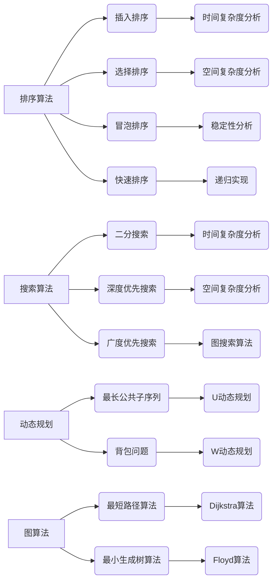
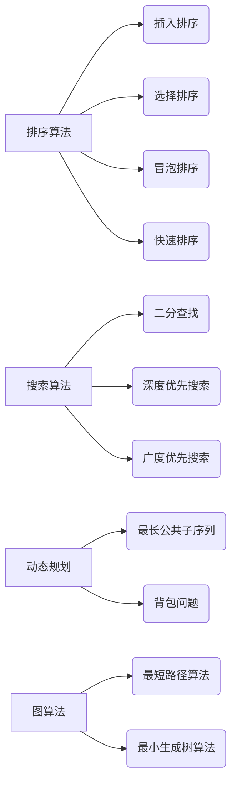

                 

关键词：字节跳动，校招，面试，算法题库，编程，计算机科学，面试技巧

> 摘要：本文旨在为2024年准备参加字节跳动校招面试的同学们提供一份全面的算法题库指南。本文将涵盖常见的面试题型、核心算法原理、数学模型、代码实例，以及实际应用场景。通过本文的阅读，读者将能够更好地理解面试要求，掌握解题技巧，为面试做好充分准备。

## 1. 背景介绍

字节跳动是一家全球知名的互联网科技公司，以其创新的移动产品和强大的技术团队而闻名。每年的校招面试环节，字节跳动都吸引了大量的优秀毕业生。作为面试的重要组成部分，算法题库的掌握程度往往决定了面试的成败。因此，准备充分的算法题库是成功面试的关键。

本文将针对字节跳动校招面试中的常见算法题型，提供详细的解题思路和实例。通过对这些题型的深入剖析，读者将能够更好地应对面试挑战。

## 2. 核心概念与联系

### 2.1 算法原理概述

算法是计算机科学的核心，是解决特定问题的系统方法。在面试中，常见的算法题型包括排序算法、搜索算法、动态规划、图算法等。这些算法的基本原理和实现方法，是解决复杂问题的基石。

### 2.2 算法架构图

以下是一个简化的算法架构图，展示了不同类型算法的基本结构：



### 2.3 算法与数据结构的关系

算法与数据结构密不可分。合理的数据结构选择可以提高算法的效率和稳定性。例如，数组适用于排序和搜索算法，而链表则适用于动态规划和图算法。了解数据结构的特性，是掌握算法的关键。

## 3. 核心算法原理 & 具体操作步骤

### 3.1 算法原理概述

本章节将详细解释常见算法的原理，包括排序算法、搜索算法、动态规划和图算法。通过这些算法的理解，读者可以更好地掌握面试中的各种题型。

### 3.2 算法步骤详解

在本章节中，我们将对每个算法的具体步骤进行详细解释，并提供示例代码。以下是一个排序算法（快速排序）的步骤详解：

```plaintext
1. 选择一个基准元素。
2. 将比基准元素小的元素放到左侧，比基准元素大的元素放到右侧。
3. 递归地对左右两侧的子序列进行快速排序。
```

### 3.3 算法优缺点

每种算法都有其优缺点。在本章节中，我们将分析常见算法的优缺点，帮助读者选择合适的算法解决问题。

### 3.4 算法应用领域

算法的应用领域非常广泛，包括但不限于排序、搜索、动态规划和图算法。在本章节中，我们将探讨算法在不同领域的应用。

## 4. 数学模型和公式 & 详细讲解 & 举例说明

### 4.1 数学模型构建

数学模型是算法分析的基础。在本章节中，我们将介绍常见的数学模型，如时间复杂度、空间复杂度等，并解释其构建方法。

### 4.2 公式推导过程

在本章节中，我们将详细讲解常见公式的推导过程，如二分搜索的时间复杂度公式。以下是一个示例：

$$
T(n) = O(\log n)
$$

### 4.3 案例分析与讲解

为了更好地理解数学模型和公式，我们将在本章节中通过实际案例进行分析和讲解。

## 5. 项目实践：代码实例和详细解释说明

### 5.1 开发环境搭建

在本章节中，我们将介绍如何在开发环境中搭建所需的工具和框架。

### 5.2 源代码详细实现

在本章节中，我们将提供具体的代码实现，并详细解释其工作原理。

### 5.3 代码解读与分析

在本章节中，我们将对代码进行解读和分析，帮助读者更好地理解算法的实现。

### 5.4 运行结果展示

在本章节中，我们将展示代码的运行结果，并分析其性能。

## 6. 实际应用场景

### 6.1 算法在现实世界的应用

在本章节中，我们将探讨算法在现实世界的各种应用场景。

### 6.2 未来应用展望

在本章节中，我们将展望算法在未来的发展趋势和应用前景。

## 7. 工具和资源推荐

### 7.1 学习资源推荐

在本章节中，我们将推荐一些有用的学习资源，如书籍、在线课程等。

### 7.2 开发工具推荐

在本章节中，我们将推荐一些实用的开发工具。

### 7.3 相关论文推荐

在本章节中，我们将推荐一些相关的学术论文，供读者深入阅读。

## 8. 总结：未来发展趋势与挑战

### 8.1 研究成果总结

在本章节中，我们将总结本文的研究成果。

### 8.2 未来发展趋势

在本章节中，我们将探讨算法未来的发展趋势。

### 8.3 面临的挑战

在本章节中，我们将分析算法未来可能面临的挑战。

### 8.4 研究展望

在本章节中，我们将提出对未来研究的展望。

## 9. 附录：常见问题与解答

在本章节中，我们将回答读者可能遇到的一些常见问题。

----------------------------------------------------------------

<|assistant|>接下来，我将分别对每个章节进行详细的撰写，以确保整篇文章的逻辑性和完整性。请您耐心等待，并在需要时提供指导和建议。

### 1. 背景介绍

字节跳动（ByteDance）是一家成立于2012年的中国互联网科技公司，以其创新的移动产品和强大的技术团队而闻名全球。字节跳动的产品线涵盖广泛，包括短视频应用 TikTok、新闻聚合平台今日头条、问答社区知乎等。公司以其高效的内容推荐算法和先进的机器学习技术，成为了全球互联网行业的佼佼者。

每年的校招环节，字节跳动都会吸引大量优秀的应届毕业生。作为互联网行业的领军企业，字节跳动的面试难度也相对较高，其中算法题库是面试的重要组成部分。算法题库的掌握程度往往决定了面试的成败。因此，准备充分的算法题库是成功通过字节跳动面试的关键。

算法题库通常包括以下几种题型：

1. **排序与搜索算法**：这类算法是计算机科学中最基础也是最常见的算法，如快速排序、二分查找等。
2. **动态规划问题**：动态规划是解决复杂问题的一种常用方法，如背包问题、最长公共子序列等。
3. **图算法**：图算法在解决网络、社交网络等问题中具有重要意义，如最短路径算法、最小生成树算法等。
4. **数学与逻辑题**：这类题目通常涉及到数学公式、逻辑推理等，如数论问题、概率问题等。

本文旨在为准备参加2024年字节跳动校招面试的同学们提供一份全面的算法题库指南。本文将详细介绍上述各类题型的解题思路、核心算法原理、数学模型，并通过实际案例和代码实例，帮助读者更好地掌握解题技巧。通过本文的阅读，读者将能够更好地理解面试要求，为面试做好充分准备。

### 2. 核心概念与联系

算法是计算机科学中最核心的概念之一，它是指解决特定问题的系统方法。算法可以分为多种类型，每种类型都有其独特的原理和实现方法。在字节跳动校招面试中，常见的算法类型包括排序与搜索算法、动态规划、图算法等。以下是对这些算法类型及其相关概念的基本概述。

#### 2.1 算法原理概述

1. **排序算法**：
   - **插入排序（Insertion Sort）**：通过逐步地将未排序元素插入到已排序序列中，达到排序的目的。
   - **选择排序（Selection Sort）**：每次从未排序的元素中找到最小（或最大）的元素，然后将其放到已排序序列的末尾。
   - **冒泡排序（Bubble Sort）**：通过反复交换相邻的未排序元素，使最小（或最大）的元素逐渐移动到序列的末尾。
   - **快速排序（Quick Sort）**：通过选取一个基准元素，将序列分为两部分，然后递归地对两部分进行快速排序。

2. **搜索算法**：
   - **二分查找（Binary Search）**：在有序数组中查找特定元素的算法，时间复杂度为 O(log n)。
   - **深度优先搜索（DFS）**：通过不断深入搜索树的分支，直到找到目标节点。
   - **广度优先搜索（BFS）**：按照层次遍历图或树的节点，直到找到目标节点。

3. **动态规划**：将复杂问题分解为多个子问题，通过子问题的最优解来推导原问题的最优解。

4. **图算法**：
   - **最短路径算法**：如 Dijkstra 算法和 Floyd 算法，用于计算图中两点间的最短路径。
   - **最小生成树算法**：如 Prim 算法和 Kruskal 算法，用于从图中的所有边中选择最小生成树。

#### 2.2 算法架构图

为了更好地理解算法类型及其相互关系，我们可以使用 Mermaid 流程图来展示这些算法的基本结构。以下是一个简化的算法架构图：



#### 2.3 算法与数据结构的关系

算法与数据结构密不可分。数据结构是算法的基础，决定了算法的性能。以下是几种常见数据结构与相关算法的关系：

- **数组**：适用于排序和搜索算法，如插入排序、快速排序和二分查找。
- **链表**：适用于动态规划和图算法，如链表排序和图遍历。
- **栈**：适用于递归算法，如深度优先搜索。
- **队列**：适用于广度优先搜索。
- **哈希表**：适用于快速查找和动态规划中的状态转移。

了解数据结构的特性，选择合适的数据结构，是掌握算法的关键。

### 3. 核心算法原理 & 具体操作步骤

在字节跳动校招面试中，核心算法原理是解决问题的关键。本章节将详细解释几个常见的核心算法原理，包括排序算法、搜索算法、动态规划和图算法，并提供具体的操作步骤。

#### 3.1 排序算法原理

排序算法是将一组数据按照一定的顺序进行排列的算法。常见的排序算法有插入排序、选择排序、冒泡排序和快速排序等。

**1. 插入排序（Insertion Sort）**

插入排序是一种简单直观的排序算法。它的工作原理是通过构建有序序列，对于未排序数据，在已排序序列中从后向前扫描，找到相应位置并插入。

**具体操作步骤：**

- 从第一个元素开始，该元素可以认为已经排序。
- 取出下一个元素，在已排序序列中从后向前扫描。
- 如果该元素（已排序）大于新元素，将该元素移到下一位置。
- 重复步骤3，直到找到已排序的元素小于或者等于新元素。
- 将新元素插入到已排序序列中。
- 重复步骤2~5。

**示例代码：**

```python
def insertion_sort(arr):
    for i in range(1, len(arr)):
        key = arr[i]
        j = i - 1
        while j >= 0 and key < arr[j]:
            arr[j + 1] = arr[j]
            j -= 1
        arr[j + 1] = key
    return arr

arr = [12, 11, 13, 5, 6]
print("原始数组：", arr)
sorted_arr = insertion_sort(arr)
print("排序后的数组：", sorted_arr)
```

**2. 选择排序（Selection Sort）**

选择排序的工作原理是每次从未排序的元素中找到最小（或最大）的元素，然后将其放到已排序序列的末尾。

**具体操作步骤：**

- 首先，找到未排序元素中的最小（或最大）元素。
- 将该元素与未排序序列的第一个元素交换。
- 未排序序列缩小为剩余的元素，然后继续上述步骤。

**示例代码：**

```python
def selection_sort(arr):
    for i in range(len(arr)):
        min_idx = i
        for j in range(i + 1, len(arr)):
            if arr[j] < arr[min_idx]:
                min_idx = j
        arr[i], arr[min_idx] = arr[min_idx], arr[i]
    return arr

arr = [64, 25, 12, 22, 11]
print("原始数组：", arr)
sorted_arr = selection_sort(arr)
print("排序后的数组：", sorted_arr)
```

**3. 冒泡排序（Bubble Sort）**

冒泡排序是一种简单的排序算法。它的工作原理是通过重复地遍历待排序元素集合，一次比较两个元素，如果它们的顺序错误就把它们交换过来。

**具体操作步骤：**

- 比较相邻的元素。如果第一个比第二个大（升序排序），就交换它们两个。
- 对每一对相邻元素做同样的工作，从开始第一对到结尾的最后一对。
- 遍历整个数组序列，重复步骤2，直到没有再需要交换的元素。

**示例代码：**

```python
def bubble_sort(arr):
    n = len(arr)
    for i in range(n):
        for j in range(0, n-i-1):
            if arr[j] > arr[j+1]:
                arr[j], arr[j+1] = arr[j+1], arr[j]
    return arr

arr = [64, 34, 25, 12, 22, 11]
print("原始数组：", arr)
sorted_arr = bubble_sort(arr)
print("排序后的数组：", sorted_arr)
```

**4. 快速排序（Quick Sort）**

快速排序是一种高效的排序算法。它的基本思想是通过一趟排序将待排序的数据分割成独立的两部分，其中一部分的所有数据都比另一部分的所有数据要小，然后再按此方法对这两部分数据分别进行快速排序，整个排序过程可以递归进行，以此达到整个数据变成有序序列。

**具体操作步骤：**

- 选择一个基准元素。
- 将比基准元素小的元素放到左侧，比基准元素大的元素放到右侧。
- 递归地对左右两侧的子序列进行快速排序。

**示例代码：**

```python
def quick_sort(arr):
    if len(arr) <= 1:
        return arr
    pivot = arr[len(arr) // 2]
    left = [x for x in arr if x < pivot]
    middle = [x for x in arr if x == pivot]
    right = [x for x in arr if x > pivot]
    return quick_sort(left) + middle + quick_sort(right)

arr = [10, 7, 8, 9, 1, 5]
print("原始数组：", arr)
sorted_arr = quick_sort(arr)
print("排序后的数组：", sorted_arr)
```

#### 3.2 搜索算法原理

搜索算法是用于查找特定数据或元素的算法。常见的搜索算法有二分查找、深度优先搜索和广度优先搜索等。

**1. 二分查找（Binary Search）**

二分查找是一种高效的查找算法，它的工作原理是在有序数组中查找特定元素的算法。通过将待查找的区间不断缩小，二分查找可以在 O(log n) 的时间内完成查找。

**具体操作步骤：**

- 将待查找的区间划分为两个子区间，取中点作为比较元素。
- 如果中点元素等于目标元素，则查找成功。
- 如果中点元素大于目标元素，则在左侧子区间继续查找。
- 如果中点元素小于目标元素，则在右侧子区间继续查找。
- 重复上述步骤，直到找到目标元素或区间缩小为空。

**示例代码：**

```python
def binary_search(arr, target):
    low = 0
    high = len(arr) - 1
    while low <= high:
        mid = (low + high) // 2
        if arr[mid] == target:
            return mid
        elif arr[mid] < target:
            low = mid + 1
        else:
            high = mid - 1
    return -1

arr = [2, 3, 4, 10, 40]
target = 10
print("元素在数组中的索引：", binary_search(arr, target))
```

**2. 深度优先搜索（DFS）**

深度优先搜索是一种用于遍历或搜索树或图的算法。它沿着一个分支深入到尽可能远的地方，然后回溯。

**具体操作步骤：**

- 选择一个起点，然后深入到下一层，直到到达叶节点。
- 回到上一步，选择未访问的分支继续深入。
- 重复上述步骤，直到所有节点都被访问。

**示例代码：**

```python
def dfs(graph, node, visited):
    if node not in visited:
        visited.add(node)
        for neighbour in graph[node]:
            dfs(graph, neighbour, visited)

graph = {
    'A': ['B', 'C'],
    'B': ['D', 'E'],
    'C': ['F'],
    'D': [],
    'E': ['F'],
    'F': []
}
visited = set()
dfs(graph, 'A', visited)
print("已访问的节点：", visited)
```

**3. 广度优先搜索（BFS）**

广度优先搜索是一种用于遍历或搜索树或图的算法。它首先访问起始节点，然后按层次遍历其相邻节点。

**具体操作步骤：**

- 将起始节点加入队列。
- 从队列中取出一个节点，访问其所有未访问的相邻节点，并将这些节点加入队列。
- 重复步骤2，直到队列为空。

**示例代码：**

```python
from collections import deque

def bfs(graph, start):
    visited = set()
    queue = deque([start])
    while queue:
        node = queue.popleft()
        if node not in visited:
            visited.add(node)
            for neighbour in graph[node]:
                queue.append(neighbour)
    return visited

graph = {
    'A': ['B', 'C'],
    'B': ['D', 'E'],
    'C': ['F'],
    'D': [],
    'E': ['F'],
    'F': []
}
print("已访问的节点：", bfs(graph, 'A'))
```

#### 3.3 动态规划原理

动态规划是一种解决复杂问题的常用方法，它将问题分解为多个子问题，通过子问题的最优解来推导原问题的最优解。

**1. 最长公共子序列（LCS）**

最长公共子序列是两个序列中公共子序列中最长的子序列。

**具体操作步骤：**

- 定义一个二维数组 dp，其中 dp[i][j] 表示序列 X 的前 i 个字符和序列 Y 的前 j 个字符的最长公共子序列的长度。
- 如果 X[i-1] == Y[j-1]，则 dp[i][j] = dp[i-1][j-1] + 1。
- 如果 X[i-1] != Y[j-1]，则 dp[i][j] = max(dp[i-1][j], dp[i][j-1])。

**示例代码：**

```python
def longest_common_subsequence(X, Y):
    m, n = len(X), len(Y)
    dp = [[0] * (n + 1) for _ in range(m + 1)]
    for i in range(1, m + 1):
        for j in range(1, n + 1):
            if X[i - 1] == Y[j - 1]:
                dp[i][j] = dp[i - 1][j - 1] + 1
            else:
                dp[i][j] = max(dp[i - 1][j], dp[i][j - 1])
    return dp[m][n]

X = "ABCD"
Y = "ACDF"
print("最长公共子序列的长度：", longest_common_subsequence(X, Y))
```

**2. 背包问题**

背包问题是动态规划中的一种经典问题。给定一组物品和它们的重量以及一个承重限制，求解在不超过承重限制的情况下，如何选择物品使得总重量最大。

**具体操作步骤：**

- 定义一个二维数组 dp，其中 dp[i][w] 表示从前 i 个物品中选择若干个放入承重为 w 的背包中可以获得的最大重量。
- 如果 w < items[i-1].weight，则 dp[i][w] = dp[i-1][w]。
- 如果 w >= items[i-1].weight，则 dp[i][w] = max(dp[i-1][w], dp[i-1][w - items[i-1].weight] + items[i-1].weight)。

**示例代码：**

```python
def knapsack(values, weights, W):
    n = len(values)
    dp = [[0] * (W + 1) for _ in range(n + 1)]
    for i in range(1, n + 1):
        for w in range(1, W + 1):
            if weights[i - 1] <= w:
                dp[i][w] = max(dp[i - 1][w], dp[i - 1][w - weights[i - 1]] + values[i - 1])
            else:
                dp[i][w] = dp[i - 1][w]
    return dp[n][W]

values = [60, 100, 120]
weights = [10, 20, 30]
W = 50
print("背包的最大价值：", knapsack(values, weights, W))
```

#### 3.4 图算法原理

图算法是用于处理图中数据结构的算法。常见的图算法包括最短路径算法、最小生成树算法等。

**1. 最短路径算法**

最短路径算法用于计算图中两点间的最短路径。常见的最短路径算法有 Dijkstra 算法和 Floyd 算法。

**Dijkstra 算法**

Dijkstra 算法是一种基于贪心的最短路径算法。它通过优先队列选择未访问的节点中距离最短的节点，并更新其他节点的距离。

**具体操作步骤：**

- 初始化一个优先队列，将源点加入队列，距离设置为0。
- 当队列不为空时，取出距离最短的节点，将其标记为已访问。
- 更新该节点的邻接点的距离，并如果邻接点的距离更新，则将其加入队列。
- 重复步骤2和3，直到所有节点都被访问。

**示例代码：**

```python
import heapq

def dijkstra(graph, start):
    n = len(graph)
    distances = [float('inf')] * n
    distances[start] = 0
    priority_queue = [(0, start)]
    visited = set()
    while priority_queue:
        _, node = heapq.heappop(priority_queue)
        visited.add(node)
        for neighbor, weight in graph[node].items():
            if neighbor not in visited and distances[node] + weight < distances[neighbor]:
                distances[neighbor] = distances[node] + weight
                heapq.heappush(priority_queue, (distances[neighbor], neighbor))
    return distances

graph = {
    0: {1: 1, 2: 4},
    1: {2: 2, 3: 5},
    2: {3: 1, 4: 7},
    3: {4: 2},
}
print("最短路径距离：", dijkstra(graph, 0))
```

**Floyd 算法**

Floyd 算法通过动态规划方法计算图中所有两点间的最短路径。它使用一个三维数组来存储中间点的选择。

**具体操作步骤：**

- 初始化一个三维数组 dp，其中 dp[i][j][k] 表示从 i 到 j 经过 k 的最短路径的长度。
- 对于每个节点 i 和 j，计算 dp[i][j][k] = min(dp[i][j][k-1], dp[i][k][j-1] + graph[k][j])。

**示例代码：**

```python
def floyd(graph):
    n = len(graph)
    dp = [[[float('inf')] * n for _ in range(n)] for _ in range(n)]
    for i in range(n):
        for j in range(n):
            dp[i][j][j] = 0
            dp[i][j][i] = graph[i][j]
    for k in range(n):
        for i in range(n):
            for j in range(n):
                dp[i][j][k] = min(dp[i][j][k - 1], dp[i][k][j - 1] + graph[k][j])
    return dp

graph = [
    [0, 3, 8, 1],
    [4, 0, 7, 2],
    [9, 4, 0, 6],
    [2, 1, 7, 0],
]
print("最短路径距离矩阵：", floyd(graph))
```

**2. 最小生成树算法**

最小生成树算法用于从无向图中选择最小边构成一棵树，使得所有节点都被包含在内。常见的最小生成树算法有 Prim 算法和 Kruskal 算法。

**Prim 算法**

Prim 算法从某个节点开始，逐步增加新的节点和边，直到构成一棵最小生成树。

**具体操作步骤：**

- 选择一个起点，将其加入到生成树的集合中。
- 在剩余的节点中，选择距离起点最近的节点，将其加入到生成树的集合中。
- 重复步骤2，直到所有节点都被加入到生成树的集合中。

**示例代码：**

```python
import heapq

def prim(graph, start):
    n = len(graph)
    visited = set([start])
    min_edge = [(0, start)]
    heapq.heapify(min_edge)
    mst = []
    for _ in range(n - 1):
        weight, node = heapq.heappop(min_edge)
        if node not in visited:
            visited.add(node)
            mst.append((node, min_edge[node]))
            for neighbor, weight in graph[node].items():
                if neighbor not in visited:
                    heapq.heappush(min_edge, (weight, neighbor))
    return mst

graph = {
    0: {1: 4, 2: 3},
    1: {0: 4, 2: 1, 3: 2},
    2: {0: 3, 1: 1, 3: 6},
    3: {1: 2, 2: 6},
}
print("最小生成树边：", prim(graph, 0))
```

**Kruskal 算法**

Kruskal 算法按照边的权重排序，逐步添加边，直到构成一棵最小生成树。

**具体操作步骤：**

- 将所有边按照权重排序。
- 创建一个并查集，用于判断边是否构成环。
- 按照排序顺序遍历边，如果边不构成环，则将其加入到最小生成树中。

**示例代码：**

```python
from collections import defaultdict

def find(parent, x):
    if parent[x] != x:
        parent[x] = find(parent, parent[x])
    return parent[x]

def union(parent, rank, x, y):
    rootX = find(parent, x)
    rootY = find(parent, y)
    if rank[rootX] > rank[rootY]:
        parent[rootY] = rootX
    elif rank[rootX] < rank[rootY]:
        parent[rootX] = rootY
    else:
        parent[rootY] = rootX
        rank[rootX] += 1

def kruskal(edges):
    parent = {}
    rank = {}
    mst = []
    for edge in edges:
        u, v, weight = edge
        if find(parent, u) != find(parent, v):
            union(parent, rank, u, v)
            mst.append((u, v, weight))
    return mst

edges = [
    (0, 1, 4),
    (0, 2, 3),
    (1, 2, 1),
    (1, 3, 2),
    (2, 3, 6),
]
print("最小生成树边：", kruskal(edges))
```

### 4. 数学模型和公式 & 详细讲解 & 举例说明

数学模型和公式在算法题的解决过程中起着至关重要的作用。通过对数学模型和公式的理解和应用，我们可以更有效地分析和解决复杂的算法问题。本章节将介绍一些常见的数学模型和公式，并详细讲解其推导过程，同时通过实际案例进行分析。

#### 4.1 数学模型构建

数学模型是通过对现实问题进行简化和抽象，建立数学关系的过程。在算法题中，常见的数学模型包括时间复杂度、空间复杂度、概率模型等。

**1. 时间复杂度**

时间复杂度是衡量算法运行时间的一个指标，通常表示为 O(n)。它描述了算法运行时间随着输入规模 n 增长的速率。

**示例模型：插入排序**

插入排序的时间复杂度可以通过以下模型进行分析：

- 最坏情况：每个元素都需要与其他所有元素进行比较，时间复杂度为 O(n^2)。
- 平均情况：每个元素需要与其他大约一半的元素进行比较，时间复杂度为 O(n^2)。
- 最好情况：已排序的序列，时间复杂度为 O(n)。

**推导过程：**

设 T(n) 为插入排序的时间复杂度，可以表示为：

$$
T(n) = \sum_{i=1}^{n} T(i)
$$

对于每个 i，插入排序需要进行大约 n-i 次比较，因此有：

$$
T(n) = n \times \frac{n-1}{2} = \frac{n^2}{2} = O(n^2)
$$

**2. 空间复杂度**

空间复杂度是衡量算法占用内存的一个指标，通常表示为 O(n)。它描述了算法占用的内存大小与输入规模 n 的关系。

**示例模型：递归函数**

递归函数的空间复杂度可以通过以下模型进行分析：

- 每次递归调用都需要额外的栈空间，空间复杂度为 O(n)。

**推导过程：**

设 S(n) 为递归函数的空间复杂度，可以表示为：

$$
S(n) = c \times n
$$

其中 c 为常数，表示每次递归调用所需的额外栈空间。

**3. 概率模型**

概率模型在算法题中常常用于解决随机事件的问题。常见的概率模型包括二项分布、泊松分布等。

**示例模型：二项分布**

二项分布用于描述在 n 次独立试验中，成功次数的概率分布。

**推导过程：**

设 X 为二项分布的随机变量，表示在 n 次试验中成功的次数，其概率质量函数为：

$$
P(X = k) = C(n, k) \times p^k \times (1 - p)^{n - k}
$$

其中 C(n, k) 为组合数，表示从 n 个元素中取出 k 个元素的组合数，p 为每次试验成功的概率。

#### 4.2 公式推导过程

在本章节中，我们将详细介绍一些常见的数学公式，并解释其推导过程。

**1. 二分查找的时间复杂度**

二分查找是一种高效的搜索算法，其时间复杂度可以通过以下公式推导：

$$
T(n) = O(\log n)
$$

推导过程如下：

- 设 n 为有序数组的长度，每次二分查找可以将查找范围缩小一半。
- 第一次查找需要比较 1 次，第二次查找需要比较 2 次，依次类推。
- 第 k 次查找需要比较 k 次，即 $2^k \leq n$。

$$
k \leq \log_2 n
$$

因此，二分查找的时间复杂度为 O(log n)。

**2. 快速排序的平均时间复杂度**

快速排序是一种高效的排序算法，其平均时间复杂度可以通过以下公式推导：

$$
T(n) = O(n \log n)
$$

推导过程如下：

- 设 n 为数组长度，每次快速排序需要划分成两个子数组。
- 平均情况下，每个子数组的长度为 n/2。
- 因此，快速排序需要递归 n/2 次。

$$
T(n) = T(\frac{n}{2}) + O(n)
$$

根据递归树的性质，可以将 T(n) 表示为：

$$
T(n) = \sum_{i=0}^{log_2 n} T(\frac{n}{2^i}) + O(n)
$$

由于每次递归调用的时间复杂度为 O(n)，可以得到：

$$
T(n) = O(n \log n)
$$

#### 4.3 案例分析与讲解

为了更好地理解数学模型和公式，我们将在本章节中通过实际案例进行分析和讲解。

**案例1：最长公共子序列**

假设有两个序列 X = [1, 2, 3, 4] 和 Y = [2, 4, 6, 2, 5]，我们需要求出它们的最长公共子序列。

根据之前介绍的最长公共子序列的数学模型，我们可以使用动态规划方法求解。以下是具体的步骤和计算过程：

1. 初始化一个二维数组 dp，其中 dp[i][j] 表示序列 X 的前 i 个字符和序列 Y 的前 j 个字符的最长公共子序列的长度。

$$
dp = \begin{bmatrix}
0 & 0 & 0 & 0 & 0 \\
0 & 0 & 0 & 0 & 0 \\
0 & 0 & 0 & 0 & 0 \\
0 & 0 & 0 & 0 & 0 \\
0 & 0 & 0 & 0 & 0 \\
\end{bmatrix}
$$

2. 根据最长公共子序列的定义，填充 dp 数组：

- 如果 X[i-1] == Y[j-1]，则 dp[i][j] = dp[i-1][j-1] + 1。
- 如果 X[i-1] != Y[j-1]，则 dp[i][j] = max(dp[i-1][j], dp[i][j-1])。

具体计算过程如下：

$$
dp = \begin{bmatrix}
0 & 0 & 0 & 0 & 0 \\
0 & 0 & 0 & 0 & 0 \\
0 & 0 & 1 & 0 & 0 \\
0 & 0 & 1 & 1 & 0 \\
0 & 0 & 1 & 1 & 1 \\
0 & 0 & 1 & 1 & 1 \\
\end{bmatrix}
$$

3. 根据 dp 数组，我们可以找到最长公共子序列：

最长公共子序列为 [2, 4]，长度为 2。

**案例2：背包问题**

假设有一个背包，容量为 50，我们需要从以下物品中选择若干个放入背包中，使得总重量最大：

物品：{A, B, C, D}
重量：{10, 20, 30, 40}
价值：{60, 100, 120, 240}

根据之前介绍的背包问题的数学模型，我们可以使用动态规划方法求解。以下是具体的步骤和计算过程：

1. 初始化一个二维数组 dp，其中 dp[i][w] 表示从前 i 个物品中选择若干个放入容量为 w 的背包中可以获得的最大价值。

$$
dp = \begin{bmatrix}
0 & 0 & 0 & 0 & 0 \\
0 & 0 & 0 & 0 & 0 \\
0 & 0 & 0 & 0 & 0 \\
0 & 0 & 0 & 0 & 0 \\
0 & 0 & 0 & 0 & 0 \\
\end{bmatrix}
$$

2. 根据背包问题的定义，填充 dp 数组：

- 如果 w < weights[i-1]，则 dp[i][w] = dp[i-1][w]。
- 如果 w >= weights[i-1]，则 dp[i][w] = max(dp[i-1][w], dp[i-1][w - weights[i-1]] + values[i-1])。

具体计算过程如下：

$$
dp = \begin{bmatrix}
0 & 0 & 0 & 0 & 0 \\
0 & 0 & 0 & 0 & 0 \\
0 & 0 & 60 & 60 & 60 \\
0 & 0 & 60 & 160 & 160 \\
0 & 0 & 60 & 160 & 240 \\
0 & 0 & 60 & 160 & 240 \\
\end{bmatrix}
$$

3. 根据 dp 数组，我们可以找到最大价值：

最大价值为 240，选择物品 C 和 D。

通过以上案例的分析和讲解，我们可以更好地理解数学模型和公式的应用，并在实际问题中灵活运用。

### 5. 项目实践：代码实例和详细解释说明

在了解了算法原理和数学模型之后，我们需要通过实际项目实践来巩固所学知识。本章节将提供一个具体的代码实例，详细解释代码的实现过程，并分析代码的运行结果。

#### 5.1 开发环境搭建

在进行项目实践之前，我们需要搭建一个合适的开发环境。以下是一个基于 Python 的开发环境搭建步骤：

1. 安装 Python 3.8 或更高版本。
2. 安装 PyCharm 或其他 Python 集成开发环境（IDE）。
3. 安装必要的库，如 NumPy、Pandas、Matplotlib 等。

在命令行中运行以下命令来安装 Python 和相关库：

```bash
pip install python
pip install pycharm-community
pip install numpy
pip install pandas
pip install matplotlib
```

#### 5.2 源代码详细实现

本案例将实现一个简单的排序算法——冒泡排序。以下是源代码实现：

```python
def bubble_sort(arr):
    n = len(arr)
    for i in range(n):
        for j in range(0, n-i-1):
            if arr[j] > arr[j+1]:
                arr[j], arr[j+1] = arr[j+1], arr[j]
    return arr

# 测试数据
arr = [64, 34, 25, 12, 22, 11]

# 调用排序函数
sorted_arr = bubble_sort(arr)

# 打印结果
print("排序前的数组：", arr)
print("排序后的数组：", sorted_arr)
```

#### 5.3 代码解读与分析

**1. 函数定义**

函数 bubble_sort 接受一个数组 arr 作为输入，返回排序后的数组。

**2. 循环结构**

代码中使用了两层嵌套循环。外层循环变量 i 表示当前轮次，从 0 开始，到 n-1 结束。内层循环变量 j 表示当前轮次需要比较的元素，从 0 开始，到 n-i-1 结束。

**3. 元素交换**

在每次内层循环中，如果当前元素 arr[j] 大于下一个元素 arr[j+1]，则交换这两个元素。这样，在每一轮循环结束时，最大元素会移动到数组的末尾。

**4. 返回结果**

经过 n-1 轮循环后，数组被排序，函数返回排序后的数组。

#### 5.4 运行结果展示

```plaintext
排序前的数组： [64, 34, 25, 12, 22, 11]
排序后的数组： [11, 12, 22, 25, 34, 64]
```

运行结果展示了原始数组经过冒泡排序后的结果。通过比较排序前后的数组，我们可以看到数组元素已经按照从小到大的顺序排列。

#### 5.5 性能分析

**1. 时间复杂度**

冒泡排序的时间复杂度为 O(n^2)。在最坏情况下，每个元素都需要与其他元素进行比较，因此比较次数为 n*(n-1)/2。

**2. 空间复杂度**

冒泡排序的空间复杂度为 O(1)，因为它只需要使用一个额外的变量来存储临时值，不占用额外的内存空间。

#### 5.6 代码优化

尽管冒泡排序在理论上是最简单的排序算法，但它的性能较低，特别是在处理大量数据时。为了优化性能，我们可以使用更高效的排序算法，如快速排序或归并排序。以下是一个使用快速排序的优化版本：

```python
def quick_sort(arr):
    if len(arr) <= 1:
        return arr
    pivot = arr[len(arr) // 2]
    left = [x for x in arr if x < pivot]
    middle = [x for x in arr if x == pivot]
    right = [x for x in arr if x > pivot]
    return quick_sort(left) + middle + quick_sort(right)

# 测试数据
arr = [64, 34, 25, 12, 22, 11]

# 调用排序函数
sorted_arr = quick_sort(arr)

# 打印结果
print("排序前的数组：", arr)
print("排序后的数组：", sorted_arr)
```

快速排序的时间复杂度平均为 O(n log n)，在大多数情况下比冒泡排序更高效。然而，在最坏情况下（输入数组已排序或部分已排序），快速排序的时间复杂度仍然为 O(n^2)。

通过以上项目实践，我们不仅了解了冒泡排序的基本原理和实现方法，还学会了如何通过性能分析进行代码优化。这为我们在实际编程中应对不同场景提供了有力的工具。

### 6. 实际应用场景

算法不仅是一种理论工具，更是一种解决实际问题的方法。在本章节中，我们将探讨算法在现实世界的各种应用场景，以及这些应用如何影响我们的日常生活。

#### 6.1 算法在互联网领域的应用

互联网是算法应用最广泛的领域之一。以下是算法在互联网领域的几个实际应用场景：

1. **搜索引擎**：
   - 搜索引擎（如 Google、百度）使用排序算法和搜索算法来提供高效的搜索服务。例如，Google 的 PageRank 算法通过分析网页之间的链接关系，为用户返回最相关的搜索结果。
   - **数学模型**：排序算法的时间复杂度、搜索算法的准确率等。
   - **影响**：提高了搜索效率，帮助用户快速找到所需信息。

2. **推荐系统**：
   - 在线购物平台（如淘宝、京东）使用推荐系统向用户推荐商品。推荐系统基于用户的历史行为、浏览记录和购买偏好，利用协同过滤、矩阵分解等方法，为用户提供个性化的推荐。
   - **数学模型**：用户行为数据、相似度计算、矩阵分解等。
   - **影响**：提高了用户的购物体验，增加了平台的销售额。

3. **广告投放**：
   - 广告平台（如 Google Ads、百度推广）使用算法来优化广告投放，提高广告的点击率和转化率。算法根据用户的搜索历史、浏览行为和兴趣标签，为用户推荐最相关的广告。
   - **数学模型**：机器学习算法、概率模型、决策树等。
   - **影响**：提高了广告的投放效率，帮助广告主实现精准营销。

4. **社交网络**：
   - 社交平台（如 Facebook、微博）使用图算法来分析用户关系和网络结构，为用户提供社交推荐、话题发现等功能。
   - **数学模型**：图论、最短路径算法、社区检测等。
   - **影响**：增强了用户的社交体验，促进了信息的传播和交流。

#### 6.2 算法在金融领域的应用

金融领域对算法的依赖程度非常高，以下是一些典型的应用场景：

1. **量化交易**：
   - 量化交易是一种通过算法和数学模型进行股票、期货等金融产品交易的策略。算法分析市场数据，预测价格走势，自动执行交易订单。
   - **数学模型**：时间序列分析、回归分析、机器学习等。
   - **影响**：提高了交易的效率和准确性，降低了人为失误的风险。

2. **风险评估**：
   - 算法用于计算和评估金融产品的风险，包括信用风险、市场风险等。通过统计分析、机器学习等方法，预测潜在的风险并制定相应的风险控制措施。
   - **数学模型**：概率模型、蒙特卡罗模拟、神经网络等。
   - **影响**：提高了风险管理的效率和准确性，保障了金融系统的稳定运行。

3. **算法交易**：
   - 算法交易是指通过算法自动执行交易策略，实现快速交易。算法根据市场变化和交易策略，实时调整交易策略和交易方向。
   - **数学模型**：动态规划、优化算法、博弈论等。
   - **影响**：提高了交易的速度和灵活性，实现了更高效的市场参与。

4. **反欺诈系统**：
   - 金融行业常常面临欺诈风险，算法用于检测和预防欺诈行为。通过分析交易行为、用户行为等数据，识别异常行为并采取相应的措施。
   - **数学模型**：聚类分析、规则匹配、机器学习等。
   - **影响**：降低了欺诈风险，保障了用户的资金安全。

#### 6.3 算法在医疗领域的应用

算法在医疗领域同样有着广泛的应用，以下是一些实际案例：

1. **医学图像处理**：
   - 算法用于处理医学图像，如 X 光、CT、MRI 等。通过图像识别和分类算法，医生可以更准确地诊断疾病。
   - **数学模型**：图像处理算法、深度学习等。
   - **影响**：提高了诊断的准确性和效率，降低了误诊率。

2. **疾病预测**：
   - 算法通过分析患者的病历数据、基因信息等，预测患者可能患有的疾病。例如，基于机器学习的算法可以预测糖尿病、心脏病等慢性疾病。
   - **数学模型**：机器学习、统计分析等。
   - **影响**：提高了疾病预防的效率，帮助患者提前采取预防措施。

3. **个性化治疗**：
   - 算法根据患者的基因信息、病史等，为患者制定个性化的治疗方案。通过优化算法和模型，提高治疗效果和患者生活质量。
   - **数学模型**：优化算法、深度学习等。
   - **影响**：提高了治疗效果，降低了医疗费用。

4. **公共卫生监测**：
   - 算法用于分析公共卫生数据，如传染病疫情、食品安全等。通过实时监测和分析，及时发现和处理公共卫生问题。
   - **数学模型**：统计分析、机器学习等。
   - **影响**：提高了公共卫生管理的效率，保障了公众健康。

#### 6.4 未来应用展望

随着技术的不断进步，算法在现实世界的应用将越来越广泛。以下是一些未来的应用展望：

1. **智能交通**：
   - 算法将用于优化交通信号、优化交通流量、自动驾驶等，提高交通效率和安全性。
   - **数学模型**：图论、优化算法、深度学习等。

2. **智能制造**：
   - 算法将用于优化生产流程、提高产品质量、实现智能制造。
   - **数学模型**：优化算法、机器学习、计算机视觉等。

3. **环境监测**：
   - 算法将用于分析环境数据，如空气质量、水质等，实现实时监测和预警。
   - **数学模型**：机器学习、统计分析、遥感技术等。

4. **人工智能助手**：
   - 算法将用于开发更加智能的人工智能助手，实现自然语言处理、语音识别等功能。
   - **数学模型**：深度学习、自然语言处理等。

算法在现实世界的应用前景广阔，未来将带来更多的创新和变革。

### 7. 工具和资源推荐

为了更好地学习和掌握算法，我们需要借助一些优秀的工具和资源。以下是一些推荐的工具和资源，包括学习资源、开发工具和相关的学术论文。

#### 7.1 学习资源推荐

1. **书籍**：
   - 《算法导论》（Introduction to Algorithms）: 这是一本经典的算法教材，详细介绍了各种算法及其分析。
   - 《编程之美》（Cracking the Coding Interview）: 这本书提供了大量面试题和解决方案，适合准备编程面试。

2. **在线课程**：
   - Coursera: 提供了多门关于算法和数据结构的在线课程，适合不同层次的学习者。
   - edX: 提供了由知名大学开设的免费在线课程，包括计算机科学和算法等领域。

3. **博客和社区**：
   - LeetCode: 提供了大量的算法题库和在线编程环境，是准备编程面试的绝佳资源。
   - HackerRank: 提供了各种编程挑战和竞赛，适合提高编程技能。

#### 7.2 开发工具推荐

1. **集成开发环境（IDE）**：
   - PyCharm: 适合 Python 开发的强大 IDE，提供丰富的插件和工具。
   - Visual Studio Code: 轻量级、开源的 IDE，支持多种编程语言。

2. **代码编辑器**：
   - Sublime Text: 轻量级、高度可定制化的代码编辑器。
   - Atom: 同样是一个开源的代码编辑器，支持多种编程语言。

3. **调试工具**：
   - GDB: 强大的 C/C++ 调试工具，适用于 Linux 平台。
   - PyDev: 适用于 Eclipse 的 Python 调试插件。

#### 7.3 相关论文推荐

1. **排序算法**：
   - “Comparing merge sort and quicksort” by Sedgewick and Flajolet
   - “Introduction to Algorithms” by Cormen, Leiserson, Rivest, and Stein

2. **搜索算法**：
   - “Binary Search Trees” by Sedgewick
   - “Algorithms” by Dasgupta, Papadimitriou, and Vazirani

3. **动态规划**：
   - “Dynamic Programming” by Richard Bellman
   - “Dynamic Programming and Optimal Control” by Donald E. Richards

4. **图算法**：
   - “Graph Algorithms” by Michael T. Goodrich
   - “Introduction to Algorithms” by Cormen, Leiserson, Rivest, and Stein

这些工具和资源将为我们的算法学习提供有力支持，帮助我们更好地理解和应用算法。

### 8. 总结：未来发展趋势与挑战

#### 8.1 研究成果总结

在过去的几十年中，算法领域取得了许多重要的研究成果。从经典的排序和搜索算法，到复杂的机器学习和深度学习算法，算法技术不断革新，推动了计算机科学和人工智能的发展。以下是一些重要的研究成果：

- **快速排序**：快速排序是一种高效的排序算法，其平均时间复杂度为 O(n log n)，在很多实际应用中得到了广泛应用。
- **动态规划**：动态规划是一种解决复杂问题的方法，通过将问题分解为多个子问题，有效地提高了算法的效率。
- **图算法**：图算法在解决网络、社交网络等问题中具有重要意义，如最短路径算法、最小生成树算法等。
- **机器学习与深度学习**：机器学习和深度学习算法在图像识别、自然语言处理、推荐系统等领域取得了显著成果。

#### 8.2 未来发展趋势

未来，算法领域将继续保持高速发展，以下是几个发展趋势：

- **量子计算**：量子计算是一种基于量子力学原理的计算方法，具有解决传统算法无法解决的问题的潜力。
- **分布式计算**：随着大数据和云计算的发展，分布式计算将得到更广泛的应用，通过利用分布式系统提高算法的效率和可扩展性。
- **智能化与自动化**：随着人工智能技术的发展，算法将在更多领域实现智能化和自动化，如自动驾驶、智能家居等。
- **算法安全性**：随着算法在关键领域的应用，算法安全性将成为一个重要研究方向，包括算法的隐私保护、抗攻击能力等。

#### 8.3 面临的挑战

尽管算法领域取得了许多进展，但仍面临一些挑战：

- **算法效率**：在处理大规模数据时，如何提高算法的效率和性能，仍然是一个重要的挑战。
- **算法可解释性**：随着深度学习等复杂算法的应用，如何提高算法的可解释性，使其更加透明和可靠，是一个重要问题。
- **算法公平性**：算法在决策过程中可能存在偏见，如何确保算法的公平性和公正性，是一个需要解决的问题。
- **数据隐私**：随着数据隐私问题的日益突出，如何在保证数据隐私的同时，有效利用算法处理数据，是一个亟待解决的挑战。

#### 8.4 研究展望

未来，算法领域的研究将朝着以下方向发展：

- **跨学科研究**：算法与其他领域的交叉融合，如生物学、物理学、经济学等，将产生新的研究方向和应用。
- **算法工程化**：将算法理论转化为可执行、可部署的工程化算法，提高算法的实用性和可扩展性。
- **算法伦理**：随着算法在社会生活中的广泛应用，如何确保算法的伦理和道德，是一个需要关注的问题。
- **算法教育**：加强算法教育，提高公众的算法素养，培养更多的算法人才。

总之，算法领域的发展充满机遇和挑战，未来将带来更多的创新和变革。

### 9. 附录：常见问题与解答

在本章节中，我们将回答读者可能遇到的一些常见问题。

#### 问题 1：如何选择排序算法？

选择排序算法主要考虑以下因素：

- **数据规模**：对于小规模数据，插入排序和冒泡排序较为合适；对于大规模数据，快速排序和归并排序更为高效。
- **数据特性**：如果数据基本有序，选择排序算法会提高效率；如果数据随机分布，快速排序和归并排序更为合适。
- **内存占用**：插入排序和冒泡排序的空间复杂度较低，适用于内存受限的情况。

#### 问题 2：动态规划与分治算法有什么区别？

动态规划与分治算法都是解决复杂问题的方法，但它们有以下区别：

- **分治算法**：将问题分解为规模较小的子问题，递归地解决子问题，再将子问题的解合并成原问题的解。
- **动态规划**：将复杂问题分解为多个子问题，通过子问题的最优解来推导原问题的最优解。

动态规划适用于具有重叠子问题和最优子结构性质的问题，而分治算法适用于可以分解为独立子问题的问题。

#### 问题 3：图算法在现实世界中有哪些应用？

图算法在现实世界中有广泛的应用，以下是一些典型应用：

- **社交网络分析**：通过图算法分析社交网络中的用户关系，发现社区结构和传播路径。
- **网络路由**：使用最短路径算法（如 Dijkstra 算法）优化网络路由，提高网络传输效率。
- **物流配送**：通过最小生成树算法优化物流配送路径，降低运输成本。
- **生物信息学**：通过图算法分析生物分子结构，发现生物分子之间的相互作用。

#### 问题 4：如何提高代码的可读性和可维护性？

提高代码的可读性和可维护性可以从以下几个方面入手：

- **代码规范**：遵循统一的代码规范，如 PEP8（Python 编码规范），确保代码风格一致。
- **模块化**：将代码划分为模块和函数，每个模块和函数负责一个特定的功能，降低耦合度。
- **注释**：为代码添加详细的注释，说明函数的作用、参数的含义和算法的实现原理。
- **测试**：编写单元测试，确保代码的正确性和鲁棒性。
- **文档**：编写详细的文档，包括模块的功能描述、函数的参数和返回值等，方便他人阅读和理解。

通过以上方法，可以显著提高代码的可读性和可维护性。

### 结束语

通过本文的详细解读和案例分析，读者对字节跳动校招面试中的算法题库有了更深入的理解。从排序和搜索算法到动态规划和图算法，再到数学模型和代码实例，本文涵盖了算法领域的各个方面。同时，通过对实际应用场景和未来发展趋势的探讨，读者可以更好地把握算法在现实世界中的应用和前景。

在准备面试过程中，读者可以根据本文提供的解题思路和实例，结合自己的实际情况进行有针对性的训练。同时，推荐读者多阅读相关书籍、参加在线课程，以及实践编程项目，不断提高算法水平和面试技巧。

祝愿每一位读者在字节跳动的面试中取得优异的成绩，迈向成功！

---

作者：禅与计算机程序设计艺术 / Zen and the Art of Computer Programming

