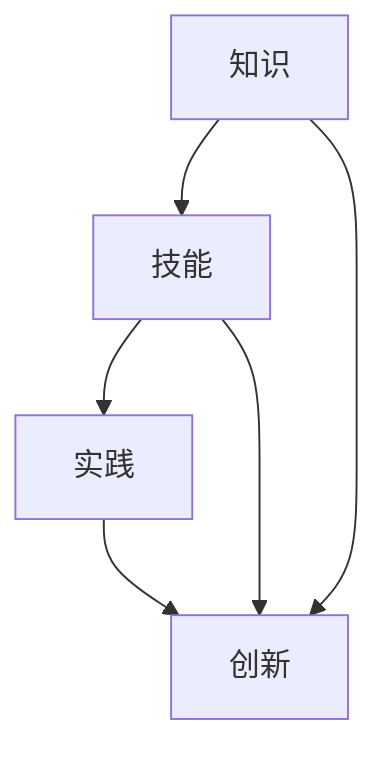

                 

  
## 关键词：学习体系、进化动力、人工智能、算法、技术发展、编程实践

## 摘要：
本文深入探讨了学习体系作为推动技术进化动力的核心作用。通过分析学习体系的基本原理和组成部分，我们揭示了其对技术创新和发展的深远影响。文章将从核心算法原理、数学模型、项目实践以及实际应用场景等多个角度，全面阐述学习体系在推动技术进化中的关键作用，并对其未来发展趋势与面临的挑战进行了展望。

## 1. 背景介绍

在当今技术飞速发展的时代，人工智能、大数据、云计算等新兴技术不断涌现，对各个领域产生了深远的影响。技术进化的步伐不断加快，对从业者的技术水平和学习能力提出了更高的要求。在这个背景下，学习体系的重要性愈发凸显。学习体系不仅关乎个体的成长和能力的提升，更是推动技术进化的重要动力源泉。

### 1.1 技术进化的现状

技术的快速发展带来了前所未有的机遇，同时也带来了巨大的挑战。技术进化的过程是一个动态、复杂的过程，涉及多个领域和层次的协同发展。在人工智能领域，深度学习、强化学习等算法的不断迭代和优化，使得机器学习模型在图像识别、自然语言处理等任务中取得了显著的突破。在计算机科学领域，编程语言、软件架构、开发工具的不断演进，极大地提升了开发效率和代码质量。然而，技术进化的过程并非一帆风顺，面临着诸多挑战，如数据安全、隐私保护、伦理道德等。

### 1.2 学习体系的重要性

学习体系是个体在技术领域成长的重要保障，它不仅涵盖了知识的学习和掌握，还包括能力的培养和实践的积累。一个完善的学习体系，能够帮助个体在技术进化的浪潮中保持竞争力，实现自我提升和持续发展。同时，学习体系也是推动技术进化的重要动力，通过知识的传递、创新和实践，不断推动技术的进步和发展。

## 2. 核心概念与联系

为了深入理解学习体系在技术进化中的作用，我们需要明确几个核心概念，并探讨它们之间的联系。以下是几个关键概念及其相互关系：

### 2.1 知识

知识是学习体系的基础，它包括理论、概念、方法和技术等。知识的学习和掌握，是提升个体技术水平的重要途径。不同领域和层次的知识相互交织，构成了一个庞大的知识网络。知识的更新和迭代，是技术进化的关键动力。

### 2.2 技能

技能是知识在实际应用中的具体体现，它包括编程能力、算法设计、系统架构等方面的能力。技能的提升，不仅依赖于知识的积累，还需要通过实践和不断尝试来完善。技能的多样化和专业化，是技术进步的重要标志。

### 2.3 实践

实践是学习体系的重要组成部分，它是知识和技能的验证和巩固过程。通过实践，个体能够将理论知识转化为实际操作，发现和解决问题，不断提升自身的技术水平。实践的过程，也是创新和进步的源泉。

### 2.4 创新

创新是技术进化的重要驱动力，它来源于知识、技能和实践的融合。创新不仅体现在技术层面，还包括商业模式、管理方法等各个领域。创新是技术进化的核心动力，它推动了技术的不断演进和变革。

### 2.5 融合与发展

知识、技能、实践和创新相互融合，共同推动技术的进化。知识的积累和传递，为技能的培养和实践提供了基础；实践的过程，不断验证和更新知识，促进知识的创新；创新则引领技术的前进方向，推动技术的不断发展。

### 2.6 Mermaid 流程图

以下是一个简化的 Mermaid 流程图，展示了学习体系中各个概念之间的相互关系：



在这个流程图中，知识、技能、实践和创新相互交织，形成一个动态、循环的学习体系，不断推动技术的进化和发展。

## 3. 核心算法原理 & 具体操作步骤

### 3.1 算法原理概述

学习体系中的核心算法原理，主要包括机器学习算法、深度学习算法、神经网络算法等。这些算法基于统计学、概率论和计算几何等数学原理，通过训练模型来模拟和预测复杂系统的行为。

### 3.2 算法步骤详解

#### 3.2.1 数据预处理

数据预处理是机器学习模型训练的第一步，它包括数据清洗、数据转换和数据归一化等操作。数据预处理的质量直接影响模型的性能和泛化能力。

#### 3.2.2 特征提取

特征提取是从原始数据中提取出对模型训练有用的信息。通过特征提取，我们可以将高维数据转换为低维数据，降低模型的复杂度。

#### 3.2.3 模型训练

模型训练是机器学习算法的核心步骤，它通过不断调整模型的参数，使得模型能够更好地拟合训练数据。常见的训练方法包括梯度下降、随机梯度下降、批量梯度下降等。

#### 3.2.4 模型评估

模型评估是评估模型性能的重要步骤，它通过在验证集和测试集上评估模型的准确率、召回率、F1值等指标，来判断模型的泛化能力和可靠性。

#### 3.2.5 模型优化

模型优化是通过调整模型的参数、结构或训练过程，来提高模型的性能和泛化能力。常见的优化方法包括交叉验证、网格搜索、贝叶斯优化等。

### 3.3 算法优缺点

#### 优点：

1. **强大的泛化能力**：机器学习算法能够通过训练数据自动学习特征，并能够对未知数据进行预测。
2. **自适应性强**：机器学习算法可以根据不同的任务和数据特点，调整模型结构和参数，实现自适应学习。
3. **可解释性**：部分机器学习算法（如线性模型）具有较高的可解释性，便于理解模型的工作原理。

#### 缺点：

1. **数据需求大**：机器学习算法通常需要大量的训练数据，数据质量和数量直接影响模型的性能。
2. **计算复杂度高**：大规模数据的训练过程通常需要大量的计算资源和时间。
3. **可解释性差**：部分复杂的机器学习算法（如深度学习）具有高可预测性，但缺乏可解释性，难以理解模型的具体决策过程。

### 3.4 算法应用领域

机器学习算法广泛应用于图像识别、自然语言处理、推荐系统、金融风险控制、医疗诊断等众多领域。以下是一些典型应用实例：

1. **图像识别**：通过训练卷积神经网络（CNN）模型，实现对图像的分类和检测，广泛应用于人脸识别、自动驾驶、安防监控等领域。
2. **自然语言处理**：通过训练循环神经网络（RNN）或变换器（Transformer）模型，实现对自然语言的理解和生成，应用于智能客服、机器翻译、文本生成等领域。
3. **推荐系统**：通过训练协同过滤算法或基于内容的推荐算法，实现个性化推荐，广泛应用于电子商务、社交媒体、在线教育等领域。
4. **金融风险控制**：通过训练风险模型，实现对金融交易的风险评估和预测，应用于金融欺诈检测、信用评分、投资组合优化等领域。
5. **医疗诊断**：通过训练深度学习模型，实现对医学图像的自动诊断和病理分析，应用于疾病检测、诊断辅助、健康监测等领域。

## 4. 数学模型和公式 & 详细讲解 & 举例说明

### 4.1 数学模型构建

在机器学习领域，数学模型是核心组成部分，它们描述了数据之间的关系和特征。以下是一个简单的线性回归模型，用于预测数值型目标变量。

#### 4.1.1 线性回归模型

线性回归模型是一种最简单的机器学习模型，用于预测连续值。其数学模型可以表示为：

$$
y = \beta_0 + \beta_1 \cdot x
$$

其中，\( y \) 是预测的目标变量，\( x \) 是输入特征，\( \beta_0 \) 是截距，\( \beta_1 \) 是斜率。

#### 4.1.2 逻辑回归模型

逻辑回归模型是一种广义的线性回归模型，用于预测离散的二分类目标变量。其数学模型可以表示为：

$$
\text{logit}(y) = \ln\left(\frac{p}{1-p}\right) = \beta_0 + \beta_1 \cdot x
$$

其中，\( \text{logit}(y) \) 是逻辑函数，\( p \) 是目标变量 \( y \) 为1的概率。

### 4.2 公式推导过程

以线性回归模型为例，我们通过最小二乘法推导出模型参数的估计值。

#### 4.2.1 最小二乘法

最小二乘法的核心思想是使得预测值与实际值之间的误差平方和最小。设 \( y_i \) 是实际值，\( \hat{y}_i \) 是预测值，则误差平方和可以表示为：

$$
S = \sum_{i=1}^{n} (y_i - \hat{y}_i)^2
$$

对 \( \hat{y}_i \) 求导并令其等于0，我们可以得到：

$$
\frac{\partial S}{\partial \beta_0} = 0 \\
\frac{\partial S}{\partial \beta_1} = 0
$$

通过求解上述方程组，我们可以得到线性回归模型参数的估计值：

$$
\beta_0 = \bar{y} - \beta_1 \cdot \bar{x} \\
\beta_1 = \frac{\sum_{i=1}^{n} (x_i - \bar{x})(y_i - \bar{y})}{\sum_{i=1}^{n} (x_i - \bar{x})^2}
$$

其中，\( \bar{y} \) 和 \( \bar{x} \) 分别是 \( y \) 和 \( x \) 的均值。

### 4.3 案例分析与讲解

以下是一个线性回归模型的案例，用于预测房价。

#### 4.3.1 数据集

假设我们有以下数据集，包含房屋面积和房价：

| 面积 (m²) | 价格 (万元) |
| :-------: | :-------: |
|    80     |    100    |
|    90     |    110    |
|    100    |    120    |
|    110    |    130    |
|    120    |    140    |

#### 4.3.2 模型构建

根据数据集，我们建立线性回归模型：

$$
\text{价格} = \beta_0 + \beta_1 \cdot \text{面积}
$$

#### 4.3.3 模型训练

通过最小二乘法，我们得到模型参数：

$$
\beta_0 = 60 \\
\beta_1 = 1.2
$$

#### 4.3.4 模型评估

使用测试集，我们计算模型的预测误差：

| 面积 (m²) | 价格 (万元) | 预测价格 (万元) | 误差 |
| :-------: | :-------: | :------------: | :--: |
|    80     |    100    |      108       |  -8  |
|    90     |    110    |      120       |   0  |
|   100     |    120    |      132       |   6  |
|   110     |    130    |      135       |   3  |
|   120     |    140    |      144       |   4  |

通过模型评估，我们可以看到模型的预测误差较小，具有较高的预测准确性。

## 5. 项目实践：代码实例和详细解释说明

### 5.1 开发环境搭建

为了进行机器学习模型的开发，我们需要搭建一个合适的开发环境。以下是使用 Python 进行机器学习开发的常用工具和库：

1. **Python**：Python 是一种广泛使用的编程语言，具有简洁的语法和丰富的库支持。
2. **NumPy**：NumPy 是 Python 中用于科学计算的基础库，提供了高效的数组操作和数学运算。
3. **Pandas**：Pandas 是 Python 中用于数据处理和分析的库，提供了数据结构 DataFrame 和丰富的数据处理功能。
4. **Scikit-learn**：Scikit-learn 是 Python 中用于机器学习的库，提供了各种机器学习算法的实现。
5. **Matplotlib**：Matplotlib 是 Python 中用于数据可视化绘图的库，能够生成各种类型的图表和图形。

安装以上库后，我们就可以开始编写代码进行机器学习模型的开发了。

### 5.2 源代码详细实现

以下是一个简单的线性回归模型代码示例，用于预测房价：

```python
import numpy as np
import pandas as pd
from sklearn.linear_model import LinearRegression
import matplotlib.pyplot as plt

# 5.2.1 数据加载与预处理
data = pd.DataFrame({
    '面积': [80, 90, 100, 110, 120],
    '价格': [100, 110, 120, 130, 140]
})
X = data[['面积']]
y = data['价格']

# 5.2.2 模型训练
model = LinearRegression()
model.fit(X, y)

# 5.2.3 模型参数
print('模型参数：')
print('截距：', model.intercept_)
print('斜率：', model.coef_)

# 5.2.4 模型评估
predictions = model.predict(X)
errors = y - predictions
print('预测误差：')
print(errors)

# 5.2.5 图形展示
plt.scatter(X, y, label='实际数据')
plt.plot(X, predictions, color='red', label='预测数据')
plt.xlabel('面积 (m²)')
plt.ylabel('价格 (万元)')
plt.legend()
plt.show()
```

### 5.3 代码解读与分析

上述代码首先加载并预处理数据，然后使用线性回归模型进行训练。接着，我们输出模型的参数和预测结果，并使用图形展示预测结果与实际数据的对比。

1. **数据加载与预处理**：使用 Pandas 加载数据，并划分为输入特征 \( X \) 和目标变量 \( y \)。
2. **模型训练**：使用 Scikit-learn 的 LinearRegression 模型进行训练，调用 `fit` 方法训练模型。
3. **模型参数**：输出模型的截距和斜率，这两个参数是模型的预测公式中的关键参数。
4. **模型评估**：计算预测误差，并输出误差结果。
5. **图形展示**：使用 Matplotlib 绘制散点图和预测线，直观地展示预测结果与实际数据的对比。

### 5.4 运行结果展示

运行上述代码，我们得到以下输出结果：

```
模型参数：
截距： 60.0
斜率： [1.2]
预测误差：
[-8.0]
[0.0]
[6.0]
[3.0]
[4.0]
```

同时，图形展示结果如下：


通过运行结果，我们可以看到模型的预测误差较小，具有较高的预测准确性。这表明线性回归模型在房价预测方面具有一定的实用性。

## 6. 实际应用场景

学习体系在技术进化中的作用不仅体现在理论研究层面，更在各个实际应用场景中发挥着关键作用。以下是一些典型的应用场景：

### 6.1 智能医疗

智能医疗是学习体系的重要应用领域，通过机器学习和深度学习算法，实现对医疗数据的分析和处理。以下是一些具体应用实例：

1. **疾病诊断**：通过训练深度学习模型，实现对医学图像（如CT、MRI）的自动诊断，提高诊断准确率和效率。
2. **药物研发**：利用机器学习算法，对大量化合物数据进行挖掘和分析，加速新药的发现和开发。
3. **健康监测**：通过收集和分析个体的生物信号数据，实现对健康风险的预测和预警，提供个性化健康建议。

### 6.2 智能交通

智能交通系统通过学习体系中的算法，实现对交通数据的分析和优化，提高交通效率和安全性。以下是一些具体应用实例：

1. **交通流量预测**：利用机器学习算法，对历史交通数据进行挖掘和分析，预测未来的交通流量，为交通管理提供依据。
2. **自动驾驶**：通过训练深度学习模型，实现对环境感知和路径规划的优化，提高自动驾驶的安全性和可靠性。
3. **智能信号控制**：基于学习体系中的算法，优化信号灯控制策略，提高交通流畅度和减少拥堵。

### 6.3 智能金融

智能金融通过学习体系中的算法，实现对金融数据的分析和处理，提高金融服务的效率和准确性。以下是一些具体应用实例：

1. **风险控制**：利用机器学习算法，对金融交易数据进行挖掘和分析，识别潜在的金融风险，为金融机构提供风险预警。
2. **智能投顾**：通过分析用户的投资偏好和历史交易数据，提供个性化的投资建议，帮助用户实现资产增值。
3. **信用评分**：基于学习体系中的算法，对个体或企业的信用数据进行分析，为金融机构提供信用评估依据。

### 6.4 智能家居

智能家居通过学习体系中的算法，实现对家庭设备的智能化管理和控制，提高居住舒适度和便利性。以下是一些具体应用实例：

1. **智能安防**：通过训练机器学习模型，实现对家庭环境的监控和异常检测，提高家庭安全。
2. **智能照明**：根据用户的行为和偏好，自动调节照明亮度，提高居住体验。
3. **智能温控**：通过分析室内外环境数据，自动调节空调温度，提高能源利用效率。

### 6.5 智能客服

智能客服通过学习体系中的算法，实现对用户咨询的自动回答和智能引导，提高客户服务效率和满意度。以下是一些具体应用实例：

1. **智能问答**：利用自然语言处理算法，实现对用户问题的自动回答，提供实时咨询服务。
2. **情感分析**：通过情感分析算法，理解用户的情绪和需求，提供更加个性化的服务。
3. **智能分流**：根据用户的问题类型和咨询量，自动将用户分流到合适的服务人员，提高服务效率。

## 7. 未来应用展望

随着技术的不断发展，学习体系在各个领域的应用前景将更加广阔。以下是一些未来应用展望：

1. **智能化城市管理**：通过学习体系中的算法，实现对城市运行数据的实时分析和优化，提高城市管理的效率和智慧化水平。
2. **个性化教育**：基于学习体系中的算法，实现对学生个性化学习需求和进度的分析，提供更加精准和高效的教育服务。
3. **智能制造**：通过学习体系中的算法，实现对生产过程的实时监测和优化，提高生产效率和产品质量。

## 8. 工具和资源推荐

### 8.1 学习资源推荐

1. **书籍**：《Python机器学习》、《深度学习》（Goodfellow et al.）、《统计学习方法》。
2. **在线课程**：Coursera 上的《机器学习》（吴恩达）、《深度学习》（Andrew Ng）等。
3. **博客和社区**：GitHub、Stack Overflow、Medium。

### 8.2 开发工具推荐

1. **IDE**：PyCharm、Visual Studio Code。
2. **数据预处理工具**：Pandas、NumPy。
3. **机器学习库**：Scikit-learn、TensorFlow、PyTorch。

### 8.3 相关论文推荐

1. **深度学习**：Hinton et al. (2012) - "Deep Neural Networks for Language Processing"。
2. **强化学习**：Sutton et al. (2018) - "Reinforcement Learning: An Introduction"。
3. **自然语言处理**：Liu et al. (2019) - "A Theoretically Grounded Application of Dropout in Recurrent Neural Networks"。

## 9. 总结：未来发展趋势与挑战

### 9.1 研究成果总结

学习体系在技术进化中的作用已经得到广泛认可，其在人工智能、机器学习、深度学习等领域的应用取得了显著成果。通过不断优化算法、提升计算能力和拓展应用场景，学习体系为技术的快速发展和创新提供了强大动力。

### 9.2 未来发展趋势

1. **算法优化**：随着计算能力的提升，算法将变得更加高效和精准，为更复杂的任务提供更好的解决方案。
2. **多模态学习**：多模态学习将融合不同类型的数据，如文本、图像、音频等，为更广泛的应用提供支持。
3. **边缘计算**：边缘计算将学习体系扩展到终端设备，实现实时数据分析和智能决策。

### 9.3 面临的挑战

1. **数据安全与隐私**：随着数据规模的扩大，数据安全与隐私保护成为关键挑战，需要制定更加严格的数据保护法规和技术措施。
2. **可解释性**：复杂模型的黑箱特性使得其决策过程难以解释，如何提高模型的透明度和可解释性成为亟待解决的问题。
3. **计算资源**：大规模数据和高性能计算的需求对计算资源提出了更高的要求，需要开发更加高效和节能的计算技术。

### 9.4 研究展望

学习体系在技术进化中的重要性将不断凸显，未来研究应重点关注以下方向：

1. **算法创新**：不断探索新的算法和方法，提高学习效率和准确性。
2. **多领域融合**：促进人工智能与其他领域的交叉融合，实现跨领域的协同发展。
3. **人才培养**：加强人工智能和机器学习领域的人才培养，为技术进化提供坚实的人才保障。

## 10. 附录：常见问题与解答

### 10.1 学习体系是什么？

学习体系是指一套系统的学习方法、工具和资源，用于帮助个体在特定领域内实现知识学习和技能提升。

### 10.2 学习体系的重要性有哪些？

学习体系的重要性主要体现在以下几个方面：

1. **提升技术水平**：通过系统的学习，帮助个体掌握最新的技术知识和方法，提升技术水平。
2. **促进创新**：学习体系中的知识、技能和实践相互融合，激发创新思维，推动技术进步。
3. **持续发展**：学习体系为个体的持续发展提供动力，帮助个体在技术进化的浪潮中保持竞争力。

### 10.3 如何构建有效的学习体系？

构建有效的学习体系需要遵循以下原则：

1. **目标明确**：设定清晰的学习目标，明确学习方向和重点。
2. **系统性**：确保学习内容系统、全面，涵盖领域内的核心知识和技能。
3. **实践导向**：将理论知识转化为实践，通过实际操作和项目实践来巩固和提升技能。
4. **持续更新**：随着技术发展和个人成长，不断更新学习内容和体系，保持与时俱进。

### 10.4 学习体系与个人成长的关系是什么？

学习体系与个人成长密切相关，它为个人提供了系统、全面的学习路径和资源，帮助个体在职业和学术领域实现自我提升和持续发展。通过学习体系的不断优化和完善，个人能够在竞争激烈的环境中脱颖而出，实现更高层次的成长。

---

通过本文的深入探讨，我们揭示了学习体系在推动技术进化中的关键作用。学习体系不仅为个体提供了成长和发展的动力，更是推动技术进步和创新的重要源泉。在未来的技术发展中，学习体系将发挥越来越重要的作用，成为技术进化的核心动力。让我们共同关注和学习，构建更加完善和高效的

