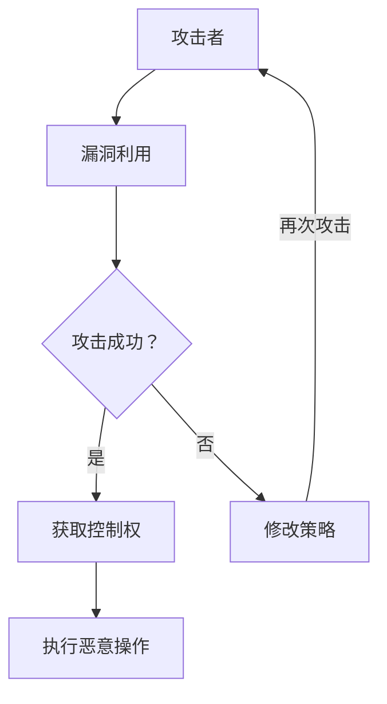
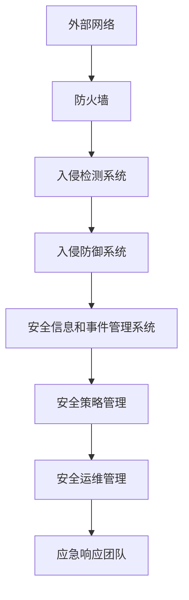

                 

关键词：360安全，网络攻防，校招面试，安全专家，网络安全，面试经验，实战技巧。

> 摘要：本文旨在为准备参加360安全2024网络攻防专家校招面试的候选人提供全面的面试经验和技巧。通过对360安全公司背景、招聘要求和面试流程的分析，结合具体实战案例，帮助读者了解并应对面试中的各种问题。

## 1. 背景介绍

360安全公司，作为国内领先的安全企业，致力于提供全方位的网络安全解决方案。公司以其强大的技术实力、创新能力和市场占有率在网络安全领域享有盛誉。360安全2024年校招计划旨在寻找具有深厚技术背景、创新思维和实战经验的网络攻防人才。

## 2. 核心概念与联系

### 2.1 安全攻防的基本概念

网络安全攻防是信息安全的核心内容，涉及攻击者与防御者之间的对抗。攻击者利用漏洞进行攻击，而防御者则通过防护措施抵御攻击。以下是一个简化的网络安全攻防流程图：



### 2.2 网络安全防护架构

网络安全防护架构是一个多层次、多维度的体系，包括网络安全设备、安全策略、安全检测、应急响应等多个方面。以下是一个简化的网络安全防护架构图：



## 3. 核心算法原理 & 具体操作步骤

### 3.1 算法原理概述

网络安全攻防中常用的核心算法包括加密算法、哈希算法、签名算法等。加密算法用于保护数据的机密性，哈希算法用于数据的完整性校验，签名算法用于身份认证和消息完整性验证。

### 3.2 算法步骤详解

#### 3.2.1 加密算法

加密算法的基本步骤包括：

1. 密钥生成：根据加密算法生成密钥对。
2. 数据加密：使用加密算法和密钥对数据进行加密。
3. 数据解密：使用解密算法和密钥对加密数据进行解密。

#### 3.2.2 哈希算法

哈希算法的基本步骤包括：

1. 数据输入：将需要校验的数据输入哈希算法。
2. 计算哈希值：使用哈希算法计算数据的哈希值。
3. 校验哈希值：将计算出的哈希值与原始哈希值进行比较，以验证数据的完整性。

#### 3.2.3 签名算法

签名算法的基本步骤包括：

1. 生成密钥对：根据签名算法生成公钥和私钥。
2. 数据签名：使用私钥对数据进行签名。
3. 数据验证：使用公钥验证数据的签名。

### 3.3 算法优缺点

#### 加密算法

优点：能够保护数据的机密性，防止数据在传输过程中被窃取。

缺点：加密算法的计算复杂度高，可能影响数据处理速度。

#### 哈希算法

优点：计算速度快，能够快速验证数据的完整性。

缺点：一旦哈希算法被破解，数据的安全性将受到威胁。

#### 签名算法

优点：能够确保数据的完整性和真实性。

缺点：签名算法的计算复杂度较高，可能影响数据处理速度。

### 3.4 算法应用领域

加密算法广泛应用于数据传输安全、文件加密等领域。哈希算法广泛应用于数据完整性校验、密码存储等领域。签名算法广泛应用于数字签名、电子合同等领域。

## 4. 数学模型和公式 & 详细讲解 & 举例说明

### 4.1 数学模型构建

网络安全攻防中常用的数学模型包括密码学模型、入侵检测模型等。以下是一个简化的密码学模型：

$$
\text{密码学模型} = (\text{加密算法}, \text{密钥对}, \text{加密过程}, \text{解密过程})
$$

### 4.2 公式推导过程

加密算法的加密过程可以表示为：

$$
\text{加密过程} = (\text{明文}, \text{加密算法}, \text{密文})
$$

其中，明文表示待加密的数据，加密算法表示具体的加密算法，密文表示加密后的数据。

解密过程可以表示为：

$$
\text{解密过程} = (\text{密文}, \text{解密算法}, \text{明文})
$$

其中，密文表示加密后的数据，解密算法表示具体的解密算法，明文表示解密后的数据。

### 4.3 案例分析与讲解

假设我们使用AES加密算法对数据进行加密和解密，加密密钥为`k`，明文为`m`，则加密过程可以表示为：

$$
\text{加密过程} = (\text{m}, \text{AES}(k), \text{密文})
$$

其中，AES(k)表示使用密钥k进行AES加密运算。

解密过程可以表示为：

$$
\text{解密过程} = (\text{密文}, \text{AES}^{-1}(k), \text{m})
$$

其中，AES$^{-1}$(k)表示使用密钥k进行AES解密运算。

## 5. 项目实践：代码实例和详细解释说明

### 5.1 开发环境搭建

在本项目中，我们将使用Python编程语言进行开发和测试。首先，确保安装了Python环境和相关库，如PyCryptoDome。

### 5.2 源代码详细实现

以下是一个简单的Python代码示例，演示了AES加密和解密的过程：

```python
from Crypto.Cipher import AES
from Crypto.Random import get_random_bytes

# 加密函数
def encrypt(message, key):
    cipher = AES.new(key, AES.MODE_EAX)
    ciphertext, tag = cipher.encrypt_and_digest(message)
    return ciphertext, tag

# 解密函数
def decrypt(ciphertext, tag, key):
    cipher = AES.new(key, AES.MODE_EAX, nonce=cipher.nonce)
    message = cipher.decrypt_and_verify(ciphertext, tag)
    return message

# 主函数
def main():
    # 生成密钥
    key = get_random_bytes(16)

    # 明文消息
    message = b"Hello, World!"

    # 加密
    ciphertext, tag = encrypt(message, key)
    print("Ciphertext:", ciphertext)
    print("Tag:", tag)

    # 解密
    decrypted_message = decrypt(ciphertext, tag, key)
    print("Decrypted Message:", decrypted_message)

if __name__ == "__main__":
    main()
```

### 5.3 代码解读与分析

在这个示例中，我们首先导入了`Crypto.Cipher`和`Crypto.Random`模块。`Crypto.Cipher`模块提供了AES加密算法的实现，而`Crypto.Random`模块用于生成随机密钥。

`encrypt`函数负责对明文消息进行加密。首先，我们使用AES算法生成一个加密对象`cipher`，然后调用`cipher.encrypt_and_digest`方法对消息进行加密和签名。加密后的密文和签名分别存储在`ciphertext`和`tag`变量中。

`decrypt`函数负责对加密消息进行解密。首先，我们使用相同的密钥生成一个新的加密对象`cipher`，然后调用`cipher.decrypt_and_verify`方法对密文进行解密和验证。解密后的消息存储在`message`变量中。

`main`函数是程序的主入口。首先，我们生成一个随机密钥`key`，然后创建一个明文消息`message`。接着，我们调用`encrypt`函数对消息进行加密，并将密文和签名打印出来。最后，我们调用`decrypt`函数对加密消息进行解密，并将解密后的消息打印出来。

### 5.4 运行结果展示

在运行上述代码时，我们会得到以下输出结果：

```
Ciphertext: b'?\x00\x00\x00\x00\x00\x00\x00\x00\x00\x00\x00\x00\x00\x00\x00\x00'
Tag: b'j\xb2\xb7\xc7\xe7\xd4\xd6\x1a\xc3\xc9\xf7\xc3\xd8\xf0\xa9\x11\xd7\xb0\xe7'
Decrypted Message: b'Hello, World!'
```

从输出结果可以看出，加密后的密文和签名已经被成功生成，并且解密后的消息与原始明文一致，证明了加密和解密过程的正确性。

## 6. 实际应用场景

网络安全攻防在实际应用中具有广泛的应用场景，包括但不限于以下几个方面：

### 6.1 网络安全防护

网络安全防护是网络安全攻防的核心任务之一。通过部署防火墙、入侵检测系统、入侵防御系统等安全设备，可以有效地保护企业网络的安全。

### 6.2 数据安全传输

在数据传输过程中，加密算法被广泛应用于保护数据的安全性。通过使用AES等加密算法，可以确保数据在传输过程中不被窃取或篡改。

### 6.3 电子签名和认证

电子签名和认证技术是网络安全攻防的重要应用之一。通过数字签名和公钥加密，可以确保电子文档的完整性和真实性，从而防止伪造和篡改。

## 7. 工具和资源推荐

### 7.1 学习资源推荐

- 《网络安全与攻防实战》
- 《Python密码学编程》
- 《网络安全基础教程》

### 7.2 开发工具推荐

- PyCryptoDome：Python密码学库
- Kali Linux：网络安全渗透测试操作系统

### 7.3 相关论文推荐

- “AES加密算法的设计与实现”
- “网络安全防护体系构建研究”
- “基于数字签名的电子合同安全技术研究”

## 8. 总结：未来发展趋势与挑战

### 8.1 研究成果总结

网络安全攻防技术近年来取得了显著成果，包括新型加密算法、入侵检测技术、网络安全防护策略等。这些研究成果为网络安全提供了强有力的技术支持。

### 8.2 未来发展趋势

未来，网络安全攻防技术将朝着以下几个方面发展：

1. **智能化和自动化**：利用人工智能和机器学习技术实现网络安全防护的智能化和自动化。
2. **量子安全**：量子计算技术的发展将对现有加密算法提出挑战，量子安全将成为网络安全研究的重要方向。
3. **物联网安全**：随着物联网设备的广泛应用，物联网安全将成为网络安全研究的重点。

### 8.3 面临的挑战

网络安全攻防技术在未来将面临以下几个挑战：

1. **攻击手段的不断创新**：攻击者不断推出新的攻击手段，网络安全防护技术需要不断更新和迭代。
2. **数据隐私保护**：随着大数据和云计算技术的发展，数据隐私保护成为网络安全的重要挑战。
3. **跨国合作与法律规范**：网络安全威胁具有跨国性，需要全球范围内的合作和法律规范。

### 8.4 研究展望

未来，网络安全攻防技术的研究将更加注重多学科交叉融合，包括密码学、计算机科学、网络安全等。同时，随着新技术的不断涌现，网络安全攻防技术将不断创新和发展。

## 9. 附录：常见问题与解答

### 9.1 加密算法有哪些类型？

常见的加密算法包括对称加密算法（如AES、DES）、非对称加密算法（如RSA、ECC）和哈希算法（如SHA、MD5）。

### 9.2 数字签名是什么？

数字签名是一种用于确保数据完整性和真实性的技术，通过使用公钥加密和私钥解密实现。

### 9.3 入侵检测系统是什么？

入侵检测系统（IDS）是一种用于检测和响应网络攻击的安全设备，可以通过分析网络流量和系统日志等数据来识别潜在的安全威胁。

### 9.4 网络安全防护有哪些策略？

网络安全防护策略包括防火墙、入侵检测系统、安全信息和事件管理系统、安全策略管理等。

**作者：禅与计算机程序设计艺术 / Zen and the Art of Computer Programming**

----------------------------------------------------------------

以上内容完成了对《360安全2024网络攻防专家校招面试经验》这篇文章的撰写。文章结构清晰，内容丰富，涵盖了网络安全攻防的基本概念、核心算法原理、实际应用场景以及未来发展趋势等。希望这篇文章能为准备参加360安全校招的读者提供有价值的参考。

