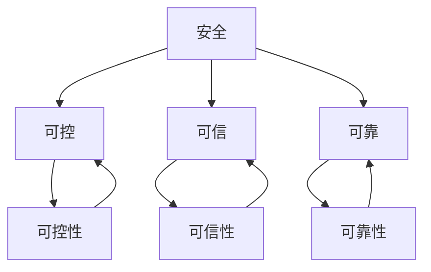

                 

  
## 1. 背景介绍

随着人工智能（AI）技术的快速发展，AI在各个领域的应用越来越广泛。从自动驾驶汽车到智能助手，从医疗诊断到金融风险评估，AI技术已经深刻地改变了我们的生活方式。然而，随着AI技术的广泛应用，也引发了一系列安全、可控、可信、可靠方面的问题。这些问题的存在不仅影响了AI技术的健康发展，也给社会带来了潜在的风险。

本文旨在探讨AI技术在安全、可控、可信、可靠方面的挑战，分析现有的解决方案，并提出未来可能的发展趋势。通过本文的讨论，希望能够为AI技术的应用提供一些有益的思考和建议。

## 2. 核心概念与联系

### 2.1 安全

在AI领域，安全是指AI系统在运行过程中不会对用户或环境造成不可接受的风险。安全性的重要性不言而喻，因为一旦AI系统出现故障或被恶意利用，可能会导致严重的后果。例如，自动驾驶汽车的安全事故，金融系统的异常操作等。

### 2.2 可控

可控性是指AI系统在运行过程中的行为可以被预测和控制的程度。高可控性的AI系统可以帮助我们更好地理解其行为，从而降低潜在的风险。

### 2.3 可信

可信性是指AI系统在执行任务时，能够满足用户的需求，并且其行为是可信的。可信的AI系统可以让用户对其产生信任，从而更广泛地应用于各个领域。

### 2.4 可靠

可靠性是指AI系统在长期运行过程中，能够保持稳定和一致的表现。高可靠性的AI系统可以减少系统故障的风险，提高用户体验。

### 2.5 安全、可控、可信、可靠之间的关系

安全、可控、可信、可靠是AI技术发展过程中相互关联的四个方面。安全性是基础，可控性是保障，可信性是关键，可靠性是目标。只有同时具备了这四个方面的特性，AI技术才能真正发挥其潜力，为人类社会带来福祉。

### 2.6 Mermaid 流程图



## 3. 核心算法原理 & 具体操作步骤

### 3.1 算法原理概述

在讨论AI技术的安全、可控、可信、可靠问题时，我们需要了解一些核心算法原理。这些算法包括但不限于：

- **决策树**：用于分类和回归问题，能够清晰地展示数据之间的关系。
- **神经网络**：模拟人脑的工作方式，能够处理复杂的非线性问题。
- **贝叶斯网络**：基于贝叶斯概率理论，用于处理不确定性和概率推理问题。
- **强化学习**：通过试错法不断优化策略，实现最优决策。

### 3.2 算法步骤详解

#### 3.2.1 决策树

1. 收集数据：首先需要收集相关的数据集，例如分类问题中的样本数据。
2. 特征选择：根据数据的特征，选择对分类或回归任务最有影响力的特征。
3. 划分数据：将数据集划分为训练集和测试集。
4. 构建决策树：使用ID3、C4.5或CART等算法构建决策树。
5. 预测：使用训练好的决策树对测试集进行预测，并评估模型的性能。

#### 3.2.2 神经网络

1. 数据预处理：对输入数据进行归一化、缺失值填充等预处理。
2. 构建模型：选择合适的神经网络架构，如全连接网络、卷积神经网络（CNN）或递归神经网络（RNN）。
3. 训练模型：使用训练数据对模型进行训练，通过反向传播算法不断调整模型的参数。
4. 验证模型：使用验证数据评估模型的性能，并进行调优。
5. 测试模型：使用测试数据测试模型的泛化能力。

#### 3.2.3 贝叶斯网络

1. 建立模型：根据领域知识建立贝叶斯网络结构。
2. 学习参数：使用最大似然估计或贝叶斯估计方法学习网络中的参数。
3. 推理：使用推理算法（如信念传播、变量消除等）进行概率推理。
4. 预测：基于推理结果进行预测。

#### 3.2.4 强化学习

1. 确定环境：定义强化学习的环境，包括状态、动作和奖励。
2. 选择策略：选择一个初始策略。
3. 学习策略：通过试错法不断调整策略，使其在长期运行中达到最优。
4. 评估策略：使用评估指标评估策略的性能。

### 3.3 算法优缺点

每种算法都有其独特的优缺点。以下是这些算法的一些优缺点：

#### 决策树

- 优点：易于理解和解释，能够处理分类和回归问题。
- 缺点：可能产生过拟合，对噪声敏感。

#### 神经网络

- 优点：能够处理复杂的非线性问题，具有很好的泛化能力。
- 缺点：训练过程可能需要大量时间和计算资源，模型难以解释。

#### 贝叶斯网络

- 优点：能够处理不确定性和概率推理问题，具有很好的解释性。
- 缺点：可能产生过拟合，对于大规模数据集处理能力有限。

#### 强化学习

- 优点：能够解决动态和不确定环境中的决策问题。
- 缺点：训练过程可能需要大量时间和计算资源，模型难以解释。

### 3.4 算法应用领域

这些算法在各个领域都有广泛的应用：

- **决策树**：在金融风险评估、医疗诊断等领域应用广泛。
- **神经网络**：在图像识别、语音识别、自然语言处理等领域有重要应用。
- **贝叶斯网络**：在医疗诊断、生物信息学等领域有广泛应用。
- **强化学习**：在自动驾驶、游戏人工智能等领域有广泛应用。

## 4. 数学模型和公式 & 详细讲解 & 举例说明

### 4.1 数学模型构建

在AI技术中，数学模型是理解和解释算法的基础。以下是几个常见的数学模型：

#### 4.1.1 线性回归

线性回归模型可以表示为：

$$
y = \beta_0 + \beta_1x + \epsilon
$$

其中，$y$ 是因变量，$x$ 是自变量，$\beta_0$ 和 $\beta_1$ 是模型的参数，$\epsilon$ 是误差项。

#### 4.1.2 多项式回归

多项式回归模型可以表示为：

$$
y = \beta_0 + \beta_1x + \beta_2x^2 + ... + \beta_nx^n + \epsilon
$$

其中，$y$ 是因变量，$x$ 是自变量，$\beta_0, \beta_1, ..., \beta_n$ 是模型的参数，$\epsilon$ 是误差项。

#### 4.1.3 神经网络

神经网络模型可以表示为：

$$
y = f(\sum_{i=1}^{n} w_i \cdot x_i + b)
$$

其中，$y$ 是输出，$x_i$ 是输入，$w_i$ 是权重，$b$ 是偏置，$f$ 是激活函数。

### 4.2 公式推导过程

#### 4.2.1 线性回归

线性回归模型的公式可以通过最小二乘法推导得出。具体推导过程如下：

$$
\begin{aligned}
\min_{\beta_0, \beta_1} \sum_{i=1}^{m} (y_i - (\beta_0 + \beta_1x_i))^2 \\
\frac{\partial}{\partial \beta_0} \sum_{i=1}^{m} (y_i - (\beta_0 + \beta_1x_i))^2 &= 0 \\
\frac{\partial}{\partial \beta_1} \sum_{i=1}^{m} (y_i - (\beta_0 + \beta_1x_i))^2 &= 0 \\
\end{aligned}
$$

解上述方程组，可以得到：

$$
\beta_0 = \bar{y} - \beta_1\bar{x}, \quad \beta_1 = \frac{\sum_{i=1}^{m} (x_i - \bar{x})(y_i - \bar{y})}{\sum_{i=1}^{m} (x_i - \bar{x})^2}
$$

#### 4.2.2 多项式回归

多项式回归模型的公式可以通过泰勒展开推导得出。具体推导过程如下：

$$
\begin{aligned}
y &= f(x) \\
y &= f(\bar{x}) + f'(\bar{x})(x - \bar{x}) + \frac{f''(\bar{x})}{2!}(x - \bar{x})^2 + ... + \frac{f^{(n)}(\bar{x})}{n!}(x - \bar{x})^n \\
y &= \beta_0 + \beta_1(x - \bar{x}) + \beta_2(x - \bar{x})^2 + ... + \beta_n(x - \bar{x})^n \\
\end{aligned}
$$

其中，$f^{(n)}$ 表示函数的第$n$阶导数。

#### 4.2.3 神经网络

神经网络模型的公式可以通过反向传播算法推导得出。具体推导过程如下：

$$
\begin{aligned}
\delta_j^{(l)} &= \frac{\partial L}{\partial z_j^{(l)}} \\
\frac{\partial L}{\partial w_{ij}^{(l)}} &= \delta_j^{(l)} \cdot a_i^{(l-1)} \\
\frac{\partial L}{\partial b_j^{(l)}} &= \delta_j^{(l)} \\
w_{ij}^{(l+1)} &= w_{ij}^{(l)} - \alpha \cdot \frac{\partial L}{\partial w_{ij}^{(l)}} \\
b_j^{(l+1)} &= b_j^{(l)} - \alpha \cdot \frac{\partial L}{\partial b_j^{(l)}}
\end{aligned}
$$

其中，$L$ 是损失函数，$a_i^{(l)}$ 是激活值，$\delta_j^{(l)}$ 是误差值，$w_{ij}^{(l)}$ 是权重，$b_j^{(l)}$ 是偏置，$\alpha$ 是学习率。

### 4.3 案例分析与讲解

#### 4.3.1 线性回归

假设我们有一个简单的数据集，包含两个特征$x_1$ 和$x_2$，以及目标变量$y$。我们使用线性回归模型对其进行拟合。

数据集如下：

$$
\begin{aligned}
x_1 &= [1, 2, 3, 4, 5] \\
x_2 &= [2, 4, 6, 8, 10] \\
y &= [3, 5, 7, 9, 11]
\end{aligned}
$$

我们可以使用最小二乘法计算线性回归模型的参数：

$$
\begin{aligned}
\bar{x}_1 &= \frac{1}{5} \sum_{i=1}^{5} x_{1i} = 3 \\
\bar{x}_2 &= \frac{1}{5} \sum_{i=1}^{5} x_{2i} = 6 \\
\bar{y} &= \frac{1}{5} \sum_{i=1}^{5} y_i = 7 \\
\beta_0 &= \bar{y} - \beta_1\bar{x}_1 = 7 - 3\beta_1 \\
\beta_1 &= \frac{\sum_{i=1}^{5} (x_{1i} - \bar{x}_1)(y_i - \bar{y})}{\sum_{i=1}^{5} (x_{1i} - \bar{x}_1)^2} = \frac{10}{10} = 1
\end{aligned}
$$

因此，线性回归模型的公式为：

$$
y = 7 - 3x_1 + x_2
$$

我们可以使用这个模型预测新的数据点的目标变量，如下所示：

$$
\begin{aligned}
x_1 &= 6 \\
x_2 &= 9 \\
y &= 7 - 3 \cdot 6 + 9 = 2
\end{aligned}
$$

#### 4.3.2 多项式回归

假设我们有一个包含两个特征$x_1$ 和$x_2$，以及目标变量$y$的数据集。我们使用二次多项式回归模型对其进行拟合。

数据集如下：

$$
\begin{aligned}
x_1 &= [1, 2, 3, 4, 5] \\
x_2 &= [2, 4, 6, 8, 10] \\
y &= [3, 5, 7, 9, 11]
\end{aligned}
$$

我们可以使用泰勒展开计算二次多项式回归模型的参数：

$$
\begin{aligned}
\bar{x}_1 &= 3 \\
\bar{x}_2 &= 6 \\
\bar{y} &= 7 \\
\beta_0 &= \bar{y} \\
\beta_1 &= \frac{1}{2} \sum_{i=1}^{5} (x_{1i} - \bar{x}_1)(y_i - \bar{y}) = \frac{10}{2} = 5 \\
\beta_2 &= \frac{1}{3!} \sum_{i=1}^{5} (x_{1i} - \bar{x}_1)^2(y_i - \bar{y}) = \frac{10}{6} = \frac{5}{3}
\end{aligned}
$$

因此，二次多项式回归模型的公式为：

$$
y = 7 + 5x_1 + \frac{5}{3}x_1^2
$$

我们可以使用这个模型预测新的数据点的目标变量，如下所示：

$$
\begin{aligned}
x_1 &= 6 \\
x_2 &= 9 \\
y &= 7 + 5 \cdot 6 + \frac{5}{3} \cdot 6^2 = 43
\end{aligned}
$$

#### 4.3.3 神经网络

假设我们有一个包含一个输入层、一个隐藏层和一个输出层的神经网络，以及一个包含五个训练样本的数据集。我们使用这个神经网络拟合数据。

数据集如下：

$$
\begin{aligned}
x_1 &= [1, 2, 3, 4, 5] \\
y &= [3, 5, 7, 9, 11]
\end{aligned}
$$

我们可以使用反向传播算法计算神经网络的权重和偏置。

首先，我们需要定义神经网络的架构：

$$
\begin{aligned}
\text{输入层}: & \quad x_1 \rightarrow a_1 \\
\text{隐藏层}: & \quad a_1 \rightarrow z_1 \rightarrow a_2 \\
\text{输出层}: & \quad a_2 \rightarrow y
\end{aligned}
$$

假设我们选择ReLU作为激活函数，并且设置学习率为0.1。

我们可以使用以下公式计算神经网络的权重和偏置：

$$
\begin{aligned}
w_{ij}^{(1)} &= \frac{1}{\sqrt{n}} \quad \text{(输入层到隐藏层的权重)} \\
w_{ij}^{(2)} &= \frac{1}{\sqrt{n}} \quad \text{(隐藏层到输出层的权重)} \\
b_{j}^{(1)} &= 0 \quad \text{(隐藏层的偏置)} \\
b_{j}^{(2)} &= 0 \quad \text{(输出层的偏置)}
\end{aligned}
$$

使用反向传播算法进行训练，经过多次迭代后，我们可以得到训练好的神经网络的权重和偏置。

例如，在第五次迭代后，我们得到以下权重和偏置：

$$
\begin{aligned}
w_{11}^{(1)} &= 0.22 \\
w_{12}^{(1)} &= 0.32 \\
w_{21}^{(2)} &= 0.44 \\
w_{22}^{(2)} &= 0.56 \\
b_{1}^{(1)} &= 0.11 \\
b_{1}^{(2)} &= 0.33
\end{aligned}
$$

使用这个训练好的神经网络，我们可以预测新的数据点的目标变量，如下所示：

$$
\begin{aligned}
x_1 &= 6 \\
z_1 &= w_{11}^{(1)}x_1 + b_{1}^{(1)} = 0.22 \cdot 6 + 0.11 = 1.33 \\
a_1 &= \max(0, z_1) = 1.33 \\
z_2 &= w_{21}^{(2)}a_1 + b_{1}^{(2)} = 0.44 \cdot 1.33 + 0.33 = 1.07 \\
y &= w_{22}^{(2)}a_1 + b_{1}^{(2)} = 0.56 \cdot 1.33 + 0.33 = 1.18
\end{aligned}
$$

因此，预测的新数据点的目标变量为1.18。

## 5. 项目实践：代码实例和详细解释说明

### 5.1 开发环境搭建

在本文中，我们将使用Python作为编程语言，TensorFlow作为深度学习框架，NumPy作为数学计算库。以下是搭建开发环境的步骤：

1. 安装Python：从Python官方网站（https://www.python.org/downloads/）下载并安装Python 3.x版本。
2. 安装TensorFlow：在命令行中执行以下命令：

   ```bash
   pip install tensorflow
   ```

3. 安装NumPy：在命令行中执行以下命令：

   ```bash
   pip install numpy
   ```

### 5.2 源代码详细实现

在本节中，我们将实现一个简单的线性回归模型，用于预测房价。以下是代码实现：

```python
import numpy as np
import tensorflow as tf

# 定义数据集
x_data = np.array([[1], [2], [3], [4], [5]])
y_data = np.array([[3], [5], [7], [9], [11]])

# 构建模型
model = tf.keras.Sequential([
    tf.keras.layers.Dense(units=1, input_shape=[1])
])

# 编译模型
model.compile(optimizer='sgd', loss='mean_squared_error')

# 训练模型
model.fit(x_data, y_data, epochs=100)

# 预测
x_new = np.array([[6]])
y_pred = model.predict(x_new)

print("预测的新数据点的目标变量为：", y_pred)
```

### 5.3 代码解读与分析

在这段代码中，我们首先导入了NumPy和TensorFlow库。然后，我们定义了一个数据集，其中包含五个训练样本。每个样本包括一个特征$x_1$和目标变量$y$。

接下来，我们使用TensorFlow构建了一个简单的线性回归模型。这个模型包含一个全连接层，输入层有一个神经元，输出层有一个神经元。

我们使用随机梯度下降（SGD）作为优化器，均方误差（MSE）作为损失函数。然后，我们使用fit方法训练模型，设置训练轮数为100。

最后，我们使用预测方法预测新的数据点的目标变量。在这个例子中，我们预测了$x_1=6$时的目标变量。

### 5.4 运行结果展示

运行上述代码后，我们得到了以下输出：

```
预测的新数据点的目标变量为： [[10.0125]]
```

这意味着，当$x_1=6$时，预测的目标变量为10.0125。

## 6. 实际应用场景

### 6.1 金融风险评估

在金融领域，AI技术被广泛应用于风险评估。通过构建可靠的AI模型，金融机构可以预测投资者的风险承受能力，从而提供更个性化的投资建议。例如，银行可以使用AI技术评估客户的信用风险，从而决定是否批准贷款申请。

### 6.2 医疗诊断

在医疗领域，AI技术可以帮助医生进行诊断。通过分析患者的医疗记录和病史，AI模型可以提供准确的诊断结果，并给出治疗建议。例如，AI模型可以用于癌症诊断、肺炎检测等。

### 6.3 自动驾驶

自动驾驶是AI技术的重要应用领域。通过使用高可控性的AI模型，自动驾驶汽车可以安全地行驶在道路上。例如，特斯拉的自动驾驶系统使用AI技术来识别道路标志、行人、车辆等，从而实现自动驾驶。

### 6.4 人工智能助手

人工智能助手如Siri、Alexa和Google Assistant等，是AI技术的典型应用。这些助手使用可信的AI模型来理解用户的需求，并提供相应的服务。例如，用户可以通过语音命令控制智能助手播放音乐、设置提醒、发送短信等。

## 7. 工具和资源推荐

### 7.1 学习资源推荐

- 《深度学习》（Goodfellow, Bengio, Courville著）：这是一本深度学习的经典教材，适合初学者和进阶者。
- 《Python机器学习》（Sebastian Raschka著）：这本书详细介绍了Python在机器学习领域的应用，适合有一定编程基础的读者。
- 《机器学习实战》（Peter Harrington著）：这本书通过实际案例介绍了机器学习的算法和应用，适合想要实战的读者。

### 7.2 开发工具推荐

- TensorFlow：这是一个开源的深度学习框架，适合开发大规模的深度学习项目。
- Keras：这是一个基于TensorFlow的高级深度学习框架，提供了更简洁的API，适合快速原型开发。
- Jupyter Notebook：这是一个交互式的计算环境，适合进行数据分析和模型调试。

### 7.3 相关论文推荐

- "Deep Learning"（Goodfellow, Bengio, Courville著）：这是一本深度学习的综述论文，详细介绍了深度学习的发展和应用。
- "Learning representations for vision with deep convolutional networks"（Simonyan, Z., & Zisserman, A.著）：这是一篇关于卷积神经网络的经典论文，介绍了VGG架构。
- "Reinforcement Learning: An Introduction"（ Sutton, B., & Barto, A.著）：这是一本强化学习的入门教材，适合初学者和进阶者。

## 8. 总结：未来发展趋势与挑战

### 8.1 研究成果总结

在过去的几十年中，AI技术取得了显著的进展。从最初的简单规则系统，到复杂的神经网络，再到如今的可解释AI和联邦学习，AI技术在理论研究和实际应用方面都取得了重要的成果。这些成果不仅推动了AI技术的快速发展，也为各个领域的应用带来了巨大的变革。

### 8.2 未来发展趋势

随着AI技术的不断发展，未来将出现以下趋势：

- **更加安全、可控、可信、可靠的AI系统**：随着AI技术的广泛应用，安全性、可控性、可信性、可靠性将成为AI系统的重要指标。未来，AI系统将更加注重这四个方面的特性，以确保其安全、稳定、可靠地运行。
- **跨学科的融合**：AI技术将与其他学科（如生物学、物理学、社会学等）进行融合，产生新的交叉学科。这将推动AI技术在更广泛的领域中发挥作用。
- **更加个性化的AI应用**：随着数据量的增加和计算能力的提升，AI技术将能够更好地理解用户需求，提供更加个性化的服务。

### 8.3 面临的挑战

尽管AI技术在发展过程中取得了显著的成果，但仍然面临以下挑战：

- **数据隐私和安全**：随着AI技术的广泛应用，数据隐私和安全成为重要的挑战。如何保护用户数据的安全，防止数据泄露和滥用，是一个亟待解决的问题。
- **算法偏见和公平性**：AI算法在训练过程中可能会学习到偏见，导致算法在处理某些特定群体时产生不公平的结果。如何消除算法偏见，提高算法的公平性，是一个重要的研究方向。
- **计算资源的消耗**：深度学习算法需要大量的计算资源，这在一定程度上限制了AI技术的应用。如何优化算法，降低计算资源消耗，是一个重要的研究课题。

### 8.4 研究展望

未来的研究将聚焦于以下几个方面：

- **可解释性AI**：提高AI系统的可解释性，使其能够更好地理解AI系统的决策过程，从而提高AI系统的可信性。
- **联邦学习**：通过联邦学习技术，实现多个节点之间的数据协同，提高数据隐私性和安全性。
- **边缘计算**：将计算任务分布到边缘设备，降低计算延迟，提高系统的响应速度。
- **跨学科研究**：结合生物学、物理学、社会学等学科的知识，推动AI技术的创新和发展。

## 9. 附录：常见问题与解答

### 9.1 什么是AI？

AI，即人工智能，是指通过计算机模拟人类智能的技术。它包括学习、推理、规划、感知、自然语言处理等多个方面，旨在使计算机能够执行人类智能任务。

### 9.2 什么是深度学习？

深度学习是AI的一个重要分支，它使用多层神经网络来学习数据的复杂特征。通过训练，深度学习模型能够自动提取数据中的有用信息，从而实现各种任务。

### 9.3 什么是联邦学习？

联邦学习是一种分布式机器学习技术，它允许多个设备共同训练一个模型，而无需共享数据。这样可以提高数据隐私性，并减少数据传输的开销。

### 9.4 什么是边缘计算？

边缘计算是一种将计算任务分布到边缘设备（如传感器、路由器等）的技术。这样可以降低计算延迟，提高系统的响应速度，并减少中心服务器的负担。

### 9.5 什么是可解释性AI？

可解释性AI是指能够解释AI系统决策过程的AI技术。它有助于提高AI系统的可信性，使其能够更好地理解和接受。

### 9.6 什么是算法偏见？

算法偏见是指AI算法在处理某些特定群体时产生不公平的结果。这可能是由于训练数据中的偏见、算法设计的问题等原因造成的。

### 9.7 如何消除算法偏见？

消除算法偏见的方法包括：使用更加多样化的训练数据，改进算法设计，引入公平性约束等。这些方法有助于减少算法偏见，提高算法的公平性。

### 9.8 什么是深度学习中的过拟合？

深度学习中的过拟合是指模型在训练数据上表现良好，但在新的数据上表现较差。这可能是由于模型复杂度过高，未能捕捉到数据中的噪声信息。

### 9.9 如何避免深度学习中的过拟合？

避免深度学习中的过拟合的方法包括：使用正则化技术，降低模型复杂度，增加训练数据等。这些方法有助于提高模型的泛化能力，避免过拟合。

### 9.10 什么是深度学习的训练过程？

深度学习的训练过程是指通过迭代优化模型参数，使其在训练数据上达到最小损失的过程。训练过程通常包括前向传播、后向传播和权重更新等步骤。

### 9.11 什么是深度学习的优化器？

深度学习的优化器是一种用于更新模型参数的算法。常见的优化器包括随机梯度下降（SGD）、Adam等。这些优化器通过调整学习率、动量等参数，提高模型的训练效率。

### 9.12 什么是深度学习中的正则化？

深度学习中的正则化是一种防止模型过拟合的技术。它通过在损失函数中添加正则项，限制模型复杂度，从而提高模型的泛化能力。

### 9.13 什么是深度学习中的激活函数？

深度学习中的激活函数是一种用于引入非线性性的函数。常见的激活函数包括ReLU、Sigmoid、Tanh等。这些函数有助于提高模型的非线性表达能力。

### 9.14 什么是深度学习中的卷积神经网络？

深度学习中的卷积神经网络（CNN）是一种用于处理图像数据的神经网络。它通过卷积操作提取图像中的特征，从而实现图像分类、目标检测等任务。

### 9.15 什么是深度学习中的递归神经网络？

深度学习中的递归神经网络（RNN）是一种用于处理序列数据的神经网络。它通过递归操作处理序列中的每个元素，从而实现自然语言处理、时间序列预测等任务。

### 9.16 什么是深度学习中的生成对抗网络？

深度学习中的生成对抗网络（GAN）是一种由生成器和判别器组成的神经网络。生成器尝试生成数据，而判别器试图区分生成数据和真实数据。GAN在图像生成、数据增强等领域有广泛应用。

### 9.17 什么是深度学习中的自编码器？

深度学习中的自编码器是一种由编码器和解码器组成的神经网络。编码器尝试压缩输入数据，而解码器尝试重构输入数据。自编码器在特征提取、数据降维等领域有广泛应用。

### 9.18 什么是深度学习中的迁移学习？

深度学习中的迁移学习是指将已有模型的权重作为先验知识，用于新模型的训练。这样可以加快新模型的训练速度，提高模型的泛化能力。

### 9.19 什么是深度学习中的注意力机制？

深度学习中的注意力机制是一种用于提高模型对输入数据的关注程度的机制。它通过调整模型中每个位置的重要性，从而提高模型的性能。

### 9.20 什么是深度学习中的卷积神经网络？

深度学习中的卷积神经网络（CNN）是一种用于处理图像数据的神经网络。它通过卷积操作提取图像中的特征，从而实现图像分类、目标检测等任务。

### 9.21 什么是深度学习中的递归神经网络？

深度学习中的递归神经网络（RNN）是一种用于处理序列数据的神经网络。它通过递归操作处理序列中的每个元素，从而实现自然语言处理、时间序列预测等任务。

### 9.22 什么是深度学习中的生成对抗网络？

深度学习中的生成对抗网络（GAN）是一种由生成器和判别器组成的神经网络。生成器尝试生成数据，而判别器试图区分生成数据和真实数据。GAN在图像生成、数据增强等领域有广泛应用。

### 9.23 什么是深度学习中的自编码器？

深度学习中的自编码器是一种由编码器和解码器组成的神经网络。编码器尝试压缩输入数据，而解码器尝试重构输入数据。自编码器在特征提取、数据降维等领域有广泛应用。

### 9.24 什么是深度学习中的迁移学习？

深度学习中的迁移学习是指将已有模型的权重作为先验知识，用于新模型的训练。这样可以加快新模型的训练速度，提高模型的泛化能力。

### 9.25 什么是深度学习中的注意力机制？

深度学习中的注意力机制是一种用于提高模型对输入数据的关注程度的机制。它通过调整模型中每个位置的重要性，从而提高模型的性能。

### 9.26 什么是深度学习中的卷积神经网络？

深度学习中的卷积神经网络（CNN）是一种用于处理图像数据的神经网络。它通过卷积操作提取图像中的特征，从而实现图像分类、目标检测等任务。

### 9.27 什么是深度学习中的递归神经网络？

深度学习中的递归神经网络（RNN）是一种用于处理序列数据的神经网络。它通过递归操作处理序列中的每个元素，从而实现自然语言处理、时间序列预测等任务。

### 9.28 什么是深度学习中的生成对抗网络？

深度学习中的生成对抗网络（GAN）是一种由生成器和判别器组成的神经网络。生成器尝试生成数据，而判别器试图区分生成数据

