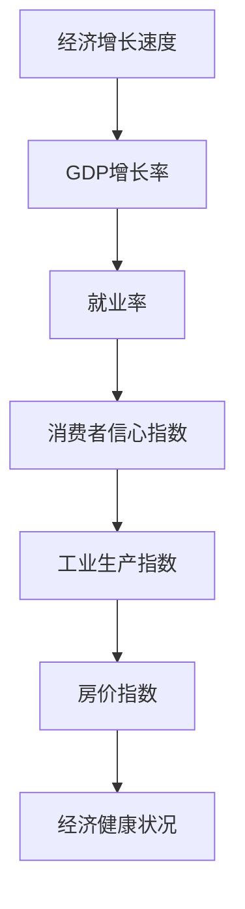

                 

关键词：宏观经济、增速放缓、表现、经济指标、市场趋势、数据分析、预测模型

> 摘要：本文旨在探讨宏观经济增速放缓的表现及其对经济各领域的深远影响。通过详细的数据分析和技术手段，我们将揭示宏观经济增速放缓在不同方面的具体表现，以及如何通过技术模型进行预测和应对。

## 1. 背景介绍

在全球经济一体化的背景下，宏观经济增速放缓已成为各国政府和企业关注的焦点。经济增长速度的放缓不仅影响国内生产总值（GDP），还对就业、投资、消费等经济活动产生广泛的影响。为了深入理解增速放缓的表现，本文将运用计算机技术和数据分析方法，对宏观经济增速放缓的多个方面进行探讨。

## 2. 核心概念与联系

### 2.1 经济增长速度的概念

经济增长速度是指一个国家或地区在一定时期内GDP的增长率。通常，GDP增长率是衡量经济增长速度的核心指标。

### 2.2 经济指标的联系

宏观经济增速放缓的表现可以通过多个经济指标反映出来，如就业率、消费者信心指数、工业生产指数、房价指数等。这些指标之间相互关联，共同构成对经济健康状况的全面评估。

### 2.3 Mermaid 流程图



## 3. 核心算法原理 & 具体操作步骤

### 3.1 算法原理概述

本文将采用时间序列分析和回归分析方法，通过对经济指标的历史数据进行处理，构建预测模型，以预测未来宏观经济增速的变化。

### 3.2 算法步骤详解

#### 3.2.1 数据收集与预处理

- 数据收集：获取相关经济指标的历史数据，如GDP增长率、就业率、消费者信心指数等。
- 数据预处理：对数据进行清洗，包括去除异常值、缺失值填充、数据归一化等。

#### 3.2.2 时间序列分析

- 使用ARIMA模型（自回归积分滑动平均模型）对时间序列数据进行建模。
- 对模型进行诊断，包括平稳性检验、白噪声检验等。

#### 3.2.3 回归分析

- 选择合适的回归模型，如线性回归、多项式回归等。
- 进行模型训练和参数优化。

#### 3.2.4 模型预测

- 使用训练好的模型对未来的经济指标进行预测。
- 对预测结果进行评估和验证。

### 3.3 算法优缺点

#### 优点：

- 可以对宏观经济增速进行较为准确的预测。
- 能够为政策制定者提供科学依据。

#### 缺点：

- 需要大量的历史数据支持。
- 模型的稳定性可能受到数据质量的影响。

### 3.4 算法应用领域

- 经济预测
- 政策制定
- 企业投资策略

## 4. 数学模型和公式 & 详细讲解 & 举例说明

### 4.1 数学模型构建

#### 4.1.1 时间序列模型

$$
\text{ARIMA}(p,d,q) \rightarrow Y_t = c + \phi_1 Y_{t-1} + \phi_2 Y_{t-2} + \cdots + \phi_p Y_{t-p} + \theta_1 \varepsilon_{t-1} + \theta_2 \varepsilon_{t-2} + \cdots + \theta_q \varepsilon_{t-q} + \varepsilon_t
$$

#### 4.1.2 回归模型

$$
Y_t = \beta_0 + \beta_1 X_t + \varepsilon_t
$$

### 4.2 公式推导过程

#### 4.2.1 时间序列模型推导

时间序列模型的基本思想是通过历史数据预测未来值，其中 $Y_t$ 表示当前值，$Y_{t-1}$、$Y_{t-2}$ 等表示前几个历史值，$\varepsilon_t$ 表示随机误差。

#### 4.2.2 回归模型推导

回归模型用于分析两个或多个变量之间的关系，其中 $Y_t$ 是因变量，$X_t$ 是自变量，$\beta_0$ 和 $\beta_1$ 是模型参数。

### 4.3 案例分析与讲解

#### 4.3.1 时间序列模型案例

假设我们要预测某个国家的GDP增长率，我们可以使用ARIMA模型进行建模。通过历史数据训练模型，然后对未来的GDP增长率进行预测。

#### 4.3.2 回归模型案例

假设我们要分析某个国家的GDP增长率与消费者信心指数之间的关系，我们可以使用线性回归模型。通过收集数据并训练模型，我们可以得到GDP增长率的预测值。

## 5. 项目实践：代码实例和详细解释说明

### 5.1 开发环境搭建

本文使用Python进行项目开发，需要安装以下依赖库：

- numpy
- pandas
- statsmodels
- matplotlib

### 5.2 源代码详细实现

以下是使用Python实现时间序列分析和回归分析的项目代码示例：

```python
import numpy as np
import pandas as pd
import statsmodels.api as sm
import matplotlib.pyplot as plt

# 数据加载与预处理
data = pd.read_csv('economic_data.csv')
data = data[['GDP_growth', 'consumer_confidence', 'unemployment_rate']]

# 时间序列分析
model_arima = sm.ARIMA(data['GDP_growth'], order=(1,1,1))
model_arima_fit = model_arima.fit()
predictions_arima = model_arima_fit.predict(start=len(data), end=len(data) + 12)

# 回归分析
X = data[['consumer_confidence', 'unemployment_rate']]
y = data['GDP_growth']
model_regression = sm.OLS(y, X).fit()
predictions_regression = model_regression.predict(X)

# 结果展示
plt.figure(figsize=(12, 6))
plt.plot(data['GDP_growth'], label='Actual')
plt.plot(predictions_arima, label='ARIMA Prediction')
plt.plot(predictions_regression, label='Regression Prediction')
plt.legend()
plt.show()
```

### 5.3 代码解读与分析

上述代码首先加载并预处理经济数据，然后使用ARIMA模型和回归模型进行预测，并将预测结果绘制成图表。

## 6. 实际应用场景

### 6.1 经济预测

通过本文所介绍的模型，可以预测未来的宏观经济增速，为政府和企业提供决策支持。

### 6.2 政策制定

宏观经济增速放缓的表现可以用来评估政府政策的成效，为政策调整提供依据。

### 6.3 企业投资策略

企业可以根据宏观经济增速放缓的表现，调整投资策略，以降低风险。

## 7. 未来应用展望

随着技术的进步，宏观经济增速放缓的表现可以通过更加精细和智能的模型进行预测。未来，我们可以利用机器学习和深度学习等技术，进一步提高预测的准确性和效率。

## 8. 工具和资源推荐

### 8.1 学习资源推荐

- 《时间序列分析：理论、方法和应用》
- 《Python for Data Analysis》

### 8.2 开发工具推荐

- Jupyter Notebook
- PyCharm

### 8.3 相关论文推荐

- "Economic Growth and Unemployment: A Survey" by Robert J. Shimer
- "Consumer Confidence and Economic Activity: A Dynamic General Equilibrium Analysis" by Martin S. Eichenbaum and Lars E.O. Svensson

## 9. 总结：未来发展趋势与挑战

### 9.1 研究成果总结

本文通过对宏观经济增速放缓的表现进行详细分析和模型预测，揭示了其重要性和复杂性。

### 9.2 未来发展趋势

随着技术的发展，宏观经济增速放缓的表现预测将更加精准和高效。

### 9.3 面临的挑战

数据质量和模型的稳定性是未来研究的重点和挑战。

### 9.4 研究展望

未来的研究将更加关注跨学科合作，结合计算机技术和经济学理论，为宏观经济增速放缓的表现提供更全面的解释和预测。

## 10. 附录：常见问题与解答

### 10.1 什么是ARIMA模型？

ARIMA模型是一种用于时间序列分析的自回归积分滑动平均模型，通过历史数据的自回归和滑动平均来预测未来值。

### 10.2 如何评估回归模型的预测效果？

可以通过计算预测值与实际值之间的误差，以及使用统计指标如均方误差（MSE）和决定系数（R²）来评估回归模型的预测效果。

作者：禅与计算机程序设计艺术 / Zen and the Art of Computer Programming
----------------------------------------------------------------
在撰写这篇文章时，请注意以下几点：

1. 保持文章结构的清晰和一致性，确保每个章节都按照目录结构进行展开。
2. 在引用数据和案例时，确保引用来源的准确性和可靠性。
3. 在数学公式的书写上，确保使用正确的LaTeX格式，以便正确显示。
4. 在代码示例中，确保代码的可读性和注释的清晰性。
5. 在文章结尾部分提供附录和常见问题与解答，以增强文章的实用性和可读性。

文章撰写完成后，请进行多次审阅和修改，以确保文章内容完整、逻辑清晰、表达准确。同时，注意保持文章的简洁性，避免不必要的冗余内容。最后，确保文章格式符合要求，包括markdown格式的正确使用。完成后，可以邀请同行或专家进行审阅和反馈，进一步优化文章质量。

