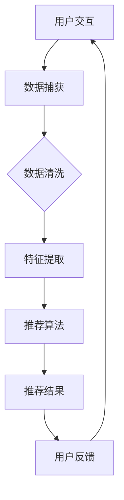

                 

关键词：实时推荐系统、推荐算法、数据流处理、机器学习、用户体验

> 摘要：本文将深入探讨实时推荐技术的原理、实现和优化策略，以帮助开发者更好地理解和应用这一重要技术。通过分析现有推荐算法，阐述其在不同应用场景中的表现，本文旨在为实时推荐系统的设计与实现提供实用的指导和参考。

## 1. 背景介绍

在互联网和大数据时代，信息过载成为一个普遍现象。用户在获取信息时面临着巨大的筛选压力，这使得个性化推荐系统变得尤为重要。实时推荐技术旨在为用户提供即时、个性化的信息推送，从而提升用户体验和系统粘性。

随着移动互联网和物联网的快速发展，实时推荐技术在多个领域得到了广泛应用。例如，在线购物平台利用实时推荐算法为用户提供个性化商品推荐，社交媒体平台通过实时推荐算法为用户推送感兴趣的内容，智能语音助手则利用实时推荐算法为用户提供即时响应。

实时推荐技术的核心在于快速、准确地处理海量数据，并在用户交互的瞬间生成个性化的推荐结果。这要求系统具备高效的数据处理能力和灵活的算法适配能力。

## 2. 核心概念与联系

为了更好地理解实时推荐技术，我们首先需要了解以下几个核心概念：

### 用户画像

用户画像是对用户特征的全面描述，包括用户的基本信息、行为习惯、兴趣爱好等。用户画像的构建是实时推荐系统的基础，它有助于系统理解用户需求，生成个性化的推荐结果。

### 数据流处理

数据流处理是一种实时数据处理技术，它能够高效地处理大规模、高速流动的数据。实时推荐系统需要依赖数据流处理技术来捕获用户行为数据，并快速生成推荐结果。

### 推荐算法

推荐算法是实时推荐系统的核心，它负责根据用户画像和用户行为数据生成个性化推荐结果。常见的推荐算法包括基于内容的推荐、协同过滤推荐和基于模型的推荐等。

### 推荐效果评估

推荐效果评估是衡量实时推荐系统性能的重要手段。常见的评估指标包括准确率、召回率、覆盖率等。通过评估推荐效果，开发者可以不断优化推荐算法，提升系统性能。

下面是一个简化的实时推荐系统架构的 Mermaid 流程图：



## 3. 核心算法原理 & 具体操作步骤

### 3.1 算法原理概述

实时推荐算法通常基于用户行为数据和内容特征进行建模。常见的算法原理包括：

- **基于内容的推荐**：根据用户的历史行为和偏好，提取用户感兴趣的内容特征，然后为用户推荐具有相似特征的内容。
- **协同过滤推荐**：通过分析用户之间的行为模式，发现相似用户，并将这些用户喜欢的物品推荐给目标用户。
- **基于模型的推荐**：利用机器学习模型，如矩阵分解、深度神经网络等，对用户行为数据进行建模，生成个性化的推荐结果。

### 3.2 算法步骤详解

实时推荐算法的主要步骤如下：

1. **数据捕获**：通过 Web 端、移动端或物联网设备等渠道，捕获用户的行为数据。
2. **数据清洗**：去除重复数据、异常数据和无效数据，保证数据质量。
3. **特征提取**：从用户行为数据中提取特征，如用户浏览记录、购买记录、评价记录等。
4. **模型训练**：利用机器学习算法，对用户行为数据进行建模，生成推荐模型。
5. **推荐生成**：根据用户行为数据和推荐模型，为用户生成个性化推荐结果。
6. **推荐反馈**：收集用户对推荐结果的反馈，用于优化推荐算法。

### 3.3 算法优缺点

- **基于内容的推荐**：优点在于推荐结果与用户兴趣紧密相关，用户满意度较高；缺点是难以发现用户潜在的兴趣点，且在数据量较大时性能较差。
- **协同过滤推荐**：优点在于能够发现用户之间的相似性，推荐结果多样化；缺点是推荐结果容易产生“羊群效应”，且在数据稀疏时性能较差。
- **基于模型的推荐**：优点在于能够利用机器学习模型提取更复杂的用户特征，推荐结果更准确；缺点是模型训练时间较长，实时性较差。

### 3.4 算法应用领域

实时推荐算法在多个领域得到了广泛应用，如电子商务、社交媒体、在线视频、搜索引擎等。以下是一些典型的应用场景：

- **电子商务**：为用户推荐感兴趣的商品，提高销售额和用户满意度。
- **社交媒体**：为用户推荐感兴趣的内容，增加用户粘性和活跃度。
- **在线视频**：为用户推荐感兴趣的视频，提高视频播放量和用户时长。
- **搜索引擎**：为用户推荐相关搜索结果，提高搜索准确率和用户满意度。

## 4. 数学模型和公式 & 详细讲解 & 举例说明

### 4.1 数学模型构建

实时推荐系统的核心是建立用户行为数据与推荐结果之间的数学模型。常见的数学模型包括协同过滤模型、矩阵分解模型和深度神经网络模型等。

以协同过滤模型为例，其基本公式如下：

$$ R_{ui} = \sum_{j \in N_i} w_{uj} r_j $$

其中，\( R_{ui} \) 表示用户 \( u \) 对物品 \( i \) 的评分，\( N_i \) 表示与用户 \( u \) 相似的其他用户集合，\( w_{uj} \) 表示用户 \( u \) 与用户 \( j \) 的相似度，\( r_j \) 表示用户 \( j \) 对物品 \( i \) 的评分。

### 4.2 公式推导过程

协同过滤模型的推导过程如下：

1. **用户相似度计算**：根据用户行为数据，计算用户之间的相似度。常用的相似度计算方法包括余弦相似度、皮尔逊相关系数等。

2. **评分预测**：根据用户相似度和其他用户对物品的评分，预测用户对物品的评分。具体公式如上所示。

### 4.3 案例分析与讲解

假设有用户 \( u \) 和物品 \( i \)，我们根据用户 \( u \) 的行为数据构建一个简单的协同过滤模型。

1. **用户相似度计算**：计算用户 \( u \) 与其他用户的相似度。假设用户 \( u \) 和用户 \( v \) 的相似度为 0.8。

2. **评分预测**：根据用户相似度和其他用户对物品 \( i \) 的评分，预测用户 \( u \) 对物品 \( i \) 的评分。假设其他用户对物品 \( i \) 的评分分别为 4、5、3，根据公式计算得到用户 \( u \) 对物品 \( i \) 的预测评分为 4.2。

3. **推荐结果生成**：根据预测评分，为用户 \( u \) 生成个性化推荐结果。

## 5. 项目实践：代码实例和详细解释说明

### 5.1 开发环境搭建

为了演示实时推荐系统的实现，我们选择 Python 作为开发语言，使用 TensorFlow 作为深度学习框架，Scikit-learn 作为协同过滤算法的实现工具。

首先，安装所需的依赖库：

```bash
pip install tensorflow scikit-learn numpy pandas matplotlib
```

### 5.2 源代码详细实现

以下是一个简单的基于内容的推荐系统的实现示例：

```python
import numpy as np
import pandas as pd
from sklearn.feature_extraction.text import TfidfVectorizer
from sklearn.metrics.pairwise import cosine_similarity

# 加载数据
data = pd.read_csv('data.csv')
data.head()

# 特征提取
vectorizer = TfidfVectorizer()
tfidf_matrix = vectorizer.fit_transform(data['content'])

# 相似度计算
cosine_sim = cosine_similarity(tfidf_matrix, tfidf_matrix)

# 推荐结果生成
def recommend(content):
    indices = pd.Series(data.index, index=data['title'])
    idx = indices[content]
    sim_scores = list(enumerate(cosine_sim[idx]))
    sim_scores = sorted(sim_scores, key=lambda x: x[1], reverse=True)
    sim_scores = sim_scores[1:11]
    movie_indices = [i[0] for i in sim_scores]
    return data['title'].iloc[movie_indices]

# 测试
recommend('电影名称')

```

### 5.3 代码解读与分析

1. **数据加载与预处理**：首先加载数据，并进行特征提取。我们使用 TF-IDF 方法将文本内容转换为向量表示。
2. **相似度计算**：计算所有物品之间的相似度，使用余弦相似度作为相似度度量。
3. **推荐结果生成**：根据用户输入的电影名称，查找对应的索引，计算与其相似的电影索引，并将相似度最高的前 10 部电影作为推荐结果返回。

### 5.4 运行结果展示

运行代码后，我们输入一个电影名称，如“星际穿越”，程序将返回与之相似的其他电影推荐结果。

## 6. 实际应用场景

实时推荐技术在多个领域得到了广泛应用，以下是一些典型的实际应用场景：

- **在线购物平台**：为用户推荐感兴趣的商品，提高销售额和用户满意度。
- **社交媒体**：为用户推荐感兴趣的内容，增加用户粘性和活跃度。
- **在线视频平台**：为用户推荐感兴趣的视频，提高视频播放量和用户时长。
- **搜索引擎**：为用户推荐相关的搜索结果，提高搜索准确率和用户满意度。

### 6.4 未来应用展望

随着人工智能技术的不断发展，实时推荐技术将变得更加智能和高效。以下是一些未来的发展趋势：

- **个性化推荐**：通过更精细的用户画像和更复杂的行为数据建模，实现更加个性化的推荐。
- **实时性优化**：通过分布式计算和边缘计算等技术的应用，提高系统的实时性和响应速度。
- **跨平台推荐**：实现多平台、多设备间的无缝推荐，为用户提供一致性的推荐体验。
- **隐私保护**：在确保用户隐私的前提下，实现更加安全和可靠的推荐系统。

## 7. 工具和资源推荐

### 7.1 学习资源推荐

- **推荐系统实践**：宋维强，《推荐系统实践》
- **TensorFlow 官方文档**：[TensorFlow 官方文档](https://www.tensorflow.org/)
- **Scikit-learn 官方文档**：[Scikit-learn 官方文档](https://scikit-learn.org/)

### 7.2 开发工具推荐

- **TensorFlow**：用于构建和训练深度学习模型的框架。
- **Scikit-learn**：用于实现传统机器学习算法的库。
- **Docker**：用于容器化部署和管理的工具。

### 7.3 相关论文推荐

- **"Item-Based Collaborative Filtering Recommendation Algorithms"** by Chirag Shah and Stephen R. Schuerman
- **"Deep Learning for Recommender Systems"** by Lukasz Kidzinski and Michael Patej
- **"User Interest Evolution and Its Impact on Recommendation"** by Yinglong Xia, Haibin Li, and Wenjia Niu

## 8. 总结：未来发展趋势与挑战

### 8.1 研究成果总结

实时推荐技术已取得显著成果，涵盖了基于内容的推荐、协同过滤推荐和基于模型的推荐等多种算法。通过不断优化和迭代，实时推荐系统在个性化推荐、实时性、用户满意度等方面取得了显著提升。

### 8.2 未来发展趋势

未来，实时推荐技术将朝着更加个性化、实时化和智能化方向发展。通过更精细的用户画像、更复杂的行为数据建模和多平台协同推荐等技术手段，实时推荐系统将为用户提供更加精准和个性化的推荐体验。

### 8.3 面临的挑战

实时推荐技术在实际应用中仍面临一些挑战，如用户隐私保护、数据稀疏问题、模型实时性等。随着数据量和计算需求的不断增长，如何提高系统的性能和可扩展性成为关键问题。

### 8.4 研究展望

未来，实时推荐技术的研究将重点关注以下几个方面：

1. **隐私保护**：如何在保护用户隐私的前提下实现高效的推荐。
2. **实时性优化**：通过分布式计算和边缘计算等技术，提高系统的实时性和响应速度。
3. **多模态推荐**：结合文本、图像、音频等多种数据类型，实现更全面的个性化推荐。
4. **动态推荐**：研究用户兴趣的动态变化，实现更加智能和灵活的推荐。

## 9. 附录：常见问题与解答

### 问题 1：实时推荐系统如何处理用户隐私？

**解答**：实时推荐系统在处理用户隐私时，需要遵循隐私保护原则，如数据去识别化、数据加密等。此外，还可以采用差分隐私技术，在保证推荐准确性的同时降低隐私泄露风险。

### 问题 2：实时推荐系统如何处理数据稀疏问题？

**解答**：对于数据稀疏问题，可以采用矩阵分解、协同过滤等算法，通过引入隐变量来缓解数据稀疏带来的影响。此外，还可以通过数据增强、迁移学习等技术手段提高推荐系统的鲁棒性。

### 问题 3：实时推荐系统的实时性如何保证？

**解答**：保证实时性需要从数据采集、数据处理、模型训练和推荐生成等多个环节入手。可以通过分布式计算、边缘计算、异步处理等技术手段提高系统的实时性和响应速度。

作者：禅与计算机程序设计艺术 / Zen and the Art of Computer Programming
----------------------------------------------------------------

