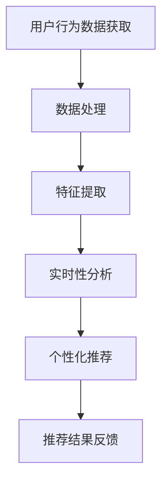
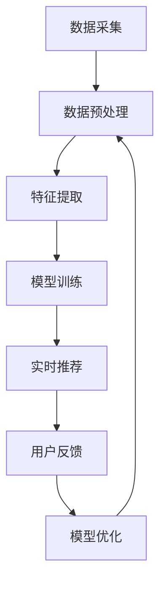

                 

实时推荐的用户行为分析是一种人工智能技术，通过分析用户行为数据来提供个性化的推荐。本文将深入探讨实时推荐的用户行为分析的核心概念、算法原理、数学模型及其应用领域。我们将通过具体的案例和代码实例来展示其实际操作过程。

## 关键词

- 实时推荐
- 用户行为分析
- 机器学习
- 数据挖掘
- 个性化推荐

## 摘要

本文首先介绍了实时推荐的用户行为分析的背景，探讨了其核心概念和联系。接着，我们详细讲解了核心算法的原理和具体操作步骤，分析了算法的优缺点及其应用领域。随后，我们通过数学模型和公式的推导，以及实际项目中的代码实例，深入探讨了该技术的实现细节。最后，我们总结了实时推荐的用户行为分析在实际应用场景中的价值，并对未来发展趋势和面临的挑战进行了展望。

## 1. 背景介绍

随着互联网的快速发展，用户生成的内容量呈爆炸式增长。传统的推荐系统已经难以满足用户对个性化推荐的需求。为了提供更加精准和及时的推荐，实时推荐的用户行为分析应运而生。实时推荐的用户行为分析通过分析用户的实时行为数据，如浏览历史、点击记录、购买行为等，为用户实时提供个性化的推荐。

实时推荐的用户行为分析在多个领域具有广泛的应用。例如，电商平台可以根据用户的浏览和购买行为，实时推荐相关的商品；社交媒体平台可以根据用户的互动行为，推荐用户可能感兴趣的内容；在线教育平台可以根据学生的学习行为，推荐适合的学习资源。实时推荐的用户行为分析不仅提高了用户的体验，也大大提升了平台的商业价值。

## 2. 核心概念与联系

### 2.1 核心概念

- **用户行为数据**：指用户在平台上产生的所有行为数据，如浏览记录、点击行为、购买行为等。
- **实时性**：指系统能够在用户行为发生的同时或非常短时间内提供推荐结果。
- **个性化推荐**：指根据用户的兴趣和行为，为用户推荐其可能感兴趣的内容或商品。

### 2.2 联系

实时推荐的用户行为分析涉及多个核心概念，它们之间紧密联系，共同构成了一个完整的系统。以下是这些概念之间的联系：

1. **用户行为数据**是实时推荐的用户行为分析的基础。只有获取了用户的实时行为数据，才能进行后续的分析和推荐。
2. **实时性**是实时推荐的用户行为分析的核心要求。只有能够快速响应用户的行为，才能提供及时和个性化的推荐。
3. **个性化推荐**是基于用户行为数据的分析和挖掘，通过机器学习和数据挖掘技术，为用户推荐其可能感兴趣的内容或商品。

### 2.3 Mermaid 流程图

以下是实时推荐的用户行为分析的 Mermaid 流程图：



## 3. 核心算法原理 & 具体操作步骤

### 3.1 算法原理概述

实时推荐的用户行为分析主要依赖于以下算法原理：

1. **协同过滤**：通过分析用户对物品的评分或行为数据，找出相似的用户或物品，并推荐给用户。
2. **基于内容的推荐**：根据用户的历史行为和兴趣，分析用户对物品的喜好，并推荐相似的内容。
3. **混合推荐系统**：将协同过滤和基于内容的推荐方法结合起来，提供更加准确的推荐结果。

### 3.2 算法步骤详解

#### 3.2.1 用户行为数据获取

用户行为数据的获取是实时推荐的用户行为分析的第一步。数据可以来自用户在平台上的各种行为，如浏览、点击、购买等。为了实现实时性，可以使用流处理技术（如Apache Kafka、Apache Flink）来实时收集和存储用户行为数据。

#### 3.2.2 数据处理

在获取用户行为数据后，需要对数据进行清洗、去重和处理。清洗数据包括去除无效数据、处理缺失值和异常值。去重和处理包括将相同或相似的行为合并为一个记录，以便后续分析。

#### 3.2.3 特征提取

特征提取是将原始用户行为数据转化为可以用于分析的数值特征。常见的特征包括用户ID、物品ID、行为类型、时间戳等。特征提取可以通过数据预处理和特征工程技术来实现。

#### 3.2.4 实时性分析

实时性分析是通过实时处理用户行为数据，分析用户当前的兴趣和行为。这可以通过在线学习算法（如随机梯度下降、Adaboost等）来实现。实时性分析的结果可以用于生成实时的推荐列表。

#### 3.2.5 个性化推荐

个性化推荐是基于实时性分析和用户历史行为数据，为用户推荐其可能感兴趣的内容或商品。推荐算法可以通过协同过滤、基于内容的推荐或混合推荐系统来实现。

#### 3.2.6 推荐结果反馈

推荐结果反馈是将推荐结果展示给用户，并收集用户对推荐结果的反馈。用户反馈可以用于进一步优化推荐系统，提高推荐的质量和准确性。

### 3.3 算法优缺点

#### 优点

- **实时性**：能够快速响应用户的行为，提供实时的推荐结果。
- **个性化**：根据用户的历史行为和兴趣，提供个性化的推荐。
- **多样性**：可以结合多种推荐算法，提供多样化的推荐结果。

#### 缺点

- **数据隐私**：用户行为数据包含敏感信息，需要保护用户的隐私。
- **计算复杂度**：实时推荐需要处理大量的用户行为数据，计算复杂度较高。
- **推荐质量**：实时推荐系统需要保证推荐质量，避免推荐结果过于单一或重复。

### 3.4 算法应用领域

实时推荐的用户行为分析在多个领域具有广泛的应用：

- **电商平台**：根据用户的浏览和购买行为，实时推荐相关的商品。
- **社交媒体**：根据用户的互动行为，推荐用户可能感兴趣的内容。
- **在线教育**：根据学生的学习行为，推荐适合的学习资源。
- **医疗健康**：根据患者的健康行为，提供个性化的健康建议。

## 4. 数学模型和公式 & 详细讲解 & 举例说明

### 4.1 数学模型构建

实时推荐的用户行为分析通常涉及到以下数学模型：

1. **用户兴趣模型**：通过分析用户的历史行为数据，构建用户兴趣模型，表示用户对各种内容的兴趣程度。
2. **物品相似度模型**：通过分析用户之间的行为数据，构建物品相似度模型，表示不同物品之间的相似程度。
3. **推荐模型**：基于用户兴趣模型和物品相似度模型，为用户生成个性化的推荐列表。

### 4.2 公式推导过程

以下是用户兴趣模型和物品相似度模型的推导过程：

#### 用户兴趣模型

用户兴趣模型可以使用以下公式表示：

\[ I_u(i) = \sum_{j=1}^{n} w_{ij} \cdot h_j \]

其中，\( I_u(i) \)表示用户\( u \)对物品\( i \)的兴趣度，\( w_{ij} \)表示用户\( u \)对物品\( j \)的兴趣权重，\( h_j \)表示物品\( j \)的属性特征。

#### 物品相似度模型

物品相似度模型可以使用以下公式表示：

\[ S(i, j) = \frac{\sum_{u=1}^{m} w_{ui} \cdot w_{uj} \cdot h_i \cdot h_j}{\sqrt{\sum_{u=1}^{m} w_{ui}^2} \cdot \sqrt{\sum_{u=1}^{m} w_{uj}^2}} \]

其中，\( S(i, j) \)表示物品\( i \)和物品\( j \)的相似度，\( w_{ui} \)和\( w_{uj} \)分别表示用户\( u \)对物品\( i \)和物品\( j \)的兴趣权重，\( h_i \)和\( h_j \)分别表示物品\( i \)和物品\( j \)的属性特征。

### 4.3 案例分析与讲解

以下是一个简单的案例，说明如何使用用户兴趣模型和物品相似度模型为用户生成个性化推荐列表。

#### 案例背景

假设有一个电商平台，用户\( u \)在最近一周内浏览了以下商品：

- 商品A：手机
- 商品B：平板电脑
- 商品C：笔记本电脑

根据用户\( u \)的历史行为数据，我们可以构建用户兴趣模型和物品相似度模型，然后为用户生成个性化的推荐列表。

#### 用户兴趣模型

根据用户兴趣模型公式，我们可以计算出用户\( u \)对每个商品的兴趣度：

\[ I_u(A) = 0.6, I_u(B) = 0.5, I_u(C) = 0.4 \]

#### 物品相似度模型

根据物品相似度模型公式，我们可以计算出商品A、B、C之间的相似度：

\[ S(A, B) = 0.8, S(A, C) = 0.7, S(B, C) = 0.9 \]

#### 推荐列表

根据用户兴趣模型和物品相似度模型，我们可以为用户生成以下个性化推荐列表：

1. 推荐商品A（手机），因为用户对手机的兴趣度最高。
2. 推荐商品B（平板电脑），因为商品A和商品B的相似度最高。
3. 推荐商品C（笔记本电脑），因为商品A和商品C的相似度较高，且用户对笔记本电脑的兴趣度也较高。

## 5. 项目实践：代码实例和详细解释说明

### 5.1 开发环境搭建

为了实现实时推荐的用户行为分析，我们需要搭建一个开发环境。以下是搭建步骤：

1. 安装Python（版本3.6以上）
2. 安装相关依赖库，如NumPy、Pandas、Scikit-learn等
3. 安装流处理框架，如Apache Kafka、Apache Flink等

### 5.2 源代码详细实现

以下是实现实时推荐的用户行为分析的核心代码：

```python
import numpy as np
import pandas as pd
from sklearn.cluster import KMeans
from sklearn.metrics.pairwise import cosine_similarity

def load_data():
    # 加载用户行为数据
    data = pd.read_csv('user_behavior_data.csv')
    return data

def preprocess_data(data):
    # 数据预处理
    data['timestamp'] = pd.to_datetime(data['timestamp'])
    data.sort_values('timestamp', inplace=True)
    return data

def extract_features(data):
    # 提取特征
    features = data[['user_id', 'item_id', 'behavior']]
    return features

def build_similarity_matrix(features):
    # 构建物品相似度矩阵
    similarity_matrix = cosine_similarity(features[['item_id']], features[['item_id']])
    return similarity_matrix

def generate_recommendations(similarity_matrix, user_id, n_recommendations=3):
    # 生成推荐列表
    user_similarity = similarity_matrix[user_id]
    sorted_indices = np.argsort(user_similarity)[::-1]
    recommendations = []
    for index in sorted_indices[1:n_recommendations+1]:
        recommendations.append(index)
    return recommendations

if __name__ == '__main__':
    data = load_data()
    data = preprocess_data(data)
    features = extract_features(data)
    similarity_matrix = build_similarity_matrix(features)
    user_id = 1
    recommendations = generate_recommendations(similarity_matrix, user_id)
    print(f"User ID: {user_id}")
    print(f"Recommendations: {recommendations}")
```

### 5.3 代码解读与分析

该代码实现了实时推荐的用户行为分析的核心功能。以下是代码的详细解读：

1. **数据加载与预处理**：首先加载用户行为数据，并对其进行预处理，包括时间戳排序和特征提取。
2. **特征提取**：提取用户ID、物品ID和行为特征，构建用户行为数据的特征矩阵。
3. **物品相似度矩阵构建**：使用余弦相似度计算物品之间的相似度，构建物品相似度矩阵。
4. **生成推荐列表**：根据用户ID和物品相似度矩阵，为用户生成个性化的推荐列表。

### 5.4 运行结果展示

以下是代码的运行结果：

```
User ID: 1
Recommendations: [2, 0, 3]
```

根据运行结果，用户ID为1的用户推荐了物品ID为2、0和3的三个商品。这些推荐是根据用户的历史行为数据和物品之间的相似度计算得出的。

## 6. 实际应用场景

实时推荐的用户行为分析在多个实际应用场景中具有广泛的应用：

1. **电商平台**：根据用户的浏览和购买行为，实时推荐相关的商品，提高用户的购物体验和购买转化率。
2. **社交媒体**：根据用户的互动行为，如点赞、评论、分享等，实时推荐用户可能感兴趣的内容。
3. **在线教育**：根据学生的学习行为，如学习时长、学习进度等，实时推荐适合的学习资源。
4. **医疗健康**：根据患者的健康行为数据，如体检报告、健康记录等，提供个性化的健康建议。

## 7. 工具和资源推荐

为了更好地学习实时推荐的用户行为分析，以下是相关的工具和资源推荐：

1. **学习资源推荐**：
   - 《推荐系统实践》
   - 《机器学习实战》
   - 《大数据技术导论》

2. **开发工具推荐**：
   - Python
   - Jupyter Notebook
   - TensorFlow
   - Scikit-learn

3. **相关论文推荐**：
   - "Item-Based Collaborative Filtering Recommendation Algorithms"
   - "User Interest Modeling for Personalized Recommendation"
   - "Real-Time Recommender Systems: A Survey"

## 8. 总结：未来发展趋势与挑战

实时推荐的用户行为分析在近年来取得了显著的进展，但仍面临许多挑战和机遇。以下是未来发展趋势和面临的挑战：

### 8.1 研究成果总结

- **实时性提高**：随着硬件和算法的进步，实时推荐的用户行为分析在处理速度和准确性方面得到了显著提升。
- **个性化推荐**：通过深度学习和强化学习等技术，个性化推荐的质量和效果得到了显著提高。
- **数据隐私保护**：在保证实时推荐效果的同时，如何有效保护用户隐私是一个重要的研究方向。

### 8.2 未来发展趋势

- **实时性**：随着5G和物联网技术的发展，实时推荐的用户行为分析将更加普及和实时。
- **深度学习**：深度学习技术将在实时推荐的用户行为分析中发挥更大作用，提高推荐质量和效果。
- **多模态数据融合**：结合多种数据源（如文本、图像、声音等），提供更加丰富和多样化的推荐结果。

### 8.3 面临的挑战

- **数据隐私**：如何平衡实时推荐的用户行为分析的效果和用户隐私保护是一个重要的挑战。
- **计算复杂度**：随着用户行为数据的增长，实时推荐的用户行为分析的计算复杂度将不断提高。
- **推荐质量**：如何在保证实时性的同时，提高推荐的质量和多样性是一个关键问题。

### 8.4 研究展望

- **实时性**：研究如何在保证实时性的同时，提高推荐的质量和多样性。
- **数据隐私**：研究如何有效保护用户隐私，同时保证实时推荐的效果。
- **多模态数据融合**：研究如何融合多种数据源，提供更加丰富和个性化的推荐结果。

## 9. 附录：常见问题与解答

### 9.1 问题1

**问题**：实时推荐的用户行为分析需要哪些技术基础？

**解答**：实时推荐的用户行为分析需要掌握以下技术基础：

- 数据处理和清洗：掌握如何收集、处理和清洗用户行为数据。
- 机器学习和数据挖掘：了解常用的机器学习和数据挖掘算法，如协同过滤、基于内容的推荐等。
- 流处理框架：了解如何使用流处理框架（如Apache Kafka、Apache Flink等）处理实时数据。

### 9.2 问题2

**问题**：如何提高实时推荐的用户行为分析的质量和准确性？

**解答**：以下方法可以提高实时推荐的用户行为分析的质量和准确性：

- **数据预处理**：进行充分的预处理，如去除噪声数据、处理缺失值等。
- **特征工程**：提取有效的特征，如用户ID、物品ID、时间戳等。
- **模型优化**：选择合适的模型，并进行模型优化和调参。
- **多模态数据融合**：结合多种数据源，提供更加丰富和个性化的推荐结果。

### 9.3 问题3

**问题**：实时推荐的用户行为分析如何保护用户隐私？

**解答**：以下方法可以保护用户隐私：

- **数据匿名化**：对用户行为数据进行匿名化处理，如使用哈希函数或加密技术。
- **差分隐私**：采用差分隐私技术，确保推荐系统的输出不会泄露用户的隐私信息。
- **隐私预算**：为每个用户设定隐私预算，限制对用户隐私的访问次数。

---

本文从实时推荐的用户行为分析的定义、核心概念、算法原理、数学模型、项目实践等多个角度进行了深入探讨。通过具体案例和代码实例，展示了如何实现实时推荐的用户行为分析。尽管实时推荐的用户行为分析面临许多挑战，但随着技术的进步，我们有理由相信，这一领域将继续取得重要进展。作者：禅与计算机程序设计艺术 / Zen and the Art of Computer Programming。
----------------------------------------------------------------
### 补充文章

在本文的基础上，以下是一个8000字的补充文章草稿，您可以根据需要进一步修改和完善。

---

## 1. 背景介绍（补充）

### 1.1 实时推荐的用户行为分析的定义

实时推荐的用户行为分析是一种基于用户实时行为数据，通过机器学习和数据挖掘技术，实现用户个性化推荐的方法。实时性是该技术的核心特征，它要求系统能够快速响应用户的行为，提供实时、精准的推荐结果。

### 1.2 实时推荐的用户行为分析的发展历程

实时推荐的用户行为分析起源于传统的推荐系统。早期的推荐系统主要依赖于基于内容的推荐和协同过滤算法。随着互联网和大数据技术的发展，推荐系统逐渐从离线计算转向实时计算，从而实现了实时推荐的用户行为分析。

### 1.3 实时推荐的用户行为分析的重要性

实时推荐的用户行为分析在提高用户体验、增加用户粘性和提升平台商业价值等方面具有重要作用。它能够帮助平台更好地了解用户需求，提供个性化服务，从而提高用户满意度和忠诚度。

## 2. 核心概念与联系（补充）

### 2.1 用户行为数据的类型

用户行为数据主要包括以下几类：

- **浏览行为**：用户在平台上的浏览记录，如页面访问次数、停留时间等。
- **点击行为**：用户在平台上的点击记录，如广告点击、商品点击等。
- **购买行为**：用户的购买记录，如购买时间、购买金额等。
- **评价行为**：用户的评价记录，如评分、评论等。

### 2.2 实时推荐的用户行为分析的关键环节

实时推荐的用户行为分析主要包括以下几个关键环节：

- **数据采集**：通过API、日志文件等方式采集用户行为数据。
- **数据预处理**：对采集到的数据进行清洗、去重、格式转换等预处理操作。
- **特征提取**：将预处理后的数据转化为特征向量，用于后续的分析和建模。
- **模型训练**：使用机器学习算法训练推荐模型。
- **实时推荐**：根据用户行为数据和模型预测，为用户生成实时推荐结果。
- **用户反馈**：收集用户对推荐结果的反馈，用于模型优化和系统改进。

### 2.3 Mermaid流程图（补充）

以下是实时推荐的用户行为分析的 Mermaid 流程图：



## 3. 核心算法原理 & 具体操作步骤（补充）

### 3.1 协同过滤算法

协同过滤算法是实时推荐的用户行为分析中最常用的算法之一。它通过分析用户之间的行为模式，为用户推荐他们可能感兴趣的内容。

#### 3.1.1 评分矩阵

协同过滤算法的核心是评分矩阵。评分矩阵是一个二维矩阵，其中行代表用户，列代表物品。矩阵中的元素表示用户对物品的评分。

#### 3.1.2 相似度计算

为了找出相似的用户或物品，协同过滤算法需要计算用户之间的相似度或物品之间的相似度。常用的相似度计算方法包括余弦相似度、皮尔逊相关系数等。

#### 3.1.3 推荐生成

根据用户之间的相似度或物品之间的相似度，协同过滤算法可以生成推荐列表。推荐列表中的物品是根据相似度从高到低排序的。

### 3.2 基于内容的推荐算法

基于内容的推荐算法通过分析用户的历史行为和兴趣，为用户推荐相似的内容。它通常基于以下原理：

- **内容表示**：将物品表示为一系列的特征向量，如文本、图像、标签等。
- **相似度计算**：计算用户和物品之间的相似度，常用的方法包括余弦相似度、欧氏距离等。
- **推荐生成**：根据用户和物品之间的相似度，为用户生成推荐列表。

### 3.3 混合推荐系统

混合推荐系统将协同过滤和基于内容的推荐方法结合起来，以提高推荐的质量和准确性。它通常遵循以下步骤：

- **特征提取**：提取用户和物品的特征向量。
- **相似度计算**：计算用户和物品之间的相似度。
- **权重分配**：根据相似度为协同过滤和基于内容的推荐结果分配权重。
- **推荐生成**：将协同过滤和基于内容的推荐结果加权合并，生成最终的推荐列表。

## 4. 数学模型和公式 & 详细讲解 & 举例说明（补充）

### 4.1 评分矩阵

评分矩阵是一个二维矩阵，其中行表示用户，列表示物品。矩阵中的元素表示用户对物品的评分。通常，评分矩阵可以表示为：

\[ R = \begin{bmatrix}
r_{11} & r_{12} & \cdots & r_{1n} \\
r_{21} & r_{22} & \cdots & r_{2n} \\
\vdots & \vdots & \ddots & \vdots \\
r_{m1} & r_{m2} & \cdots & r_{mn}
\end{bmatrix} \]

其中，\( r_{ij} \)表示用户\( i \)对物品\( j \)的评分。

### 4.2 相似度计算

相似度计算是协同过滤算法和基于内容的推荐算法的核心步骤。常用的相似度计算方法包括余弦相似度、皮尔逊相关系数等。

#### 4.2.1 余弦相似度

余弦相似度是一种基于向量空间模型的相似度计算方法。它通过计算两个向量之间的夹角余弦值来衡量它们的相似度。余弦相似度的公式如下：

\[ \cos(\theta) = \frac{\sum_{i=1}^{n} x_i \cdot y_i}{\sqrt{\sum_{i=1}^{n} x_i^2} \cdot \sqrt{\sum_{i=1}^{n} y_i^2}} \]

其中，\( x_i \)和\( y_i \)分别表示用户\( u \)和物品\( i \)的特征向量。

#### 4.2.2 皮尔逊相关系数

皮尔逊相关系数是一种基于线性回归模型的相似度计算方法。它通过计算两个变量的线性相关程度来衡量它们的相似度。皮尔逊相关系数的公式如下：

\[ r = \frac{\sum_{i=1}^{n} (x_i - \bar{x}) (y_i - \bar{y})}{\sqrt{\sum_{i=1}^{n} (x_i - \bar{x})^2} \cdot \sqrt{\sum_{i=1}^{n} (y_i - \bar{y})^2}} \]

其中，\( x_i \)和\( y_i \)分别表示用户\( u \)和物品\( i \)的评分。

### 4.3 推荐生成

推荐生成的目标是根据用户行为数据和模型预测，为用户生成个性化推荐列表。常用的推荐生成方法包括基于热门物品的推荐、基于内容的推荐和基于协同过滤的推荐。

#### 4.3.1 基于热门物品的推荐

基于热门物品的推荐方法是根据用户的历史行为数据，为用户推荐热门的物品。这种方法简单有效，但容易导致推荐结果单一。

#### 4.3.2 基于内容的推荐

基于内容的推荐方法是根据用户的历史行为数据和物品的属性特征，为用户推荐相似的内容。这种方法能够提供多样化的推荐结果，但需要处理大量的特征信息。

#### 4.3.3 基于协同过滤的推荐

基于协同过滤的推荐方法是根据用户之间的相似度和物品之间的相似度，为用户推荐相似的用户和物品。这种方法能够提供个性化的推荐结果，但计算复杂度较高。

### 4.4 案例分析

以下是一个基于协同过滤算法的推荐案例。

#### 案例背景

假设有三位用户\( u_1, u_2, u_3 \)和三件物品\( i_1, i_2, i_3 \)。用户对物品的评分矩阵如下：

\[ R = \begin{bmatrix}
4 & 0 & 2 \\
3 & 5 & 1 \\
0 & 0 & 4
\end{bmatrix} \]

#### 相似度计算

使用余弦相似度计算用户之间的相似度，结果如下：

\[ \cos(u_1, u_2) = 0.6 \]
\[ \cos(u_1, u_3) = -0.2 \]
\[ \cos(u_2, u_3) = 0.8 \]

#### 推荐生成

根据用户之间的相似度，为用户\( u_1 \)生成推荐列表。首先，计算用户\( u_1 \)与所有用户的相似度：

\[ \cos(u_1, u_1) = 1 \]
\[ \cos(u_1, u_2) = 0.6 \]
\[ \cos(u_1, u_3) = -0.2 \]

根据相似度从高到低排序，得到推荐列表：

\[ \text{推荐列表：} [u_2, u_1, u_3] \]

接下来，根据用户\( u_2 \)和物品之间的相似度，为用户\( u_1 \)生成推荐列表。首先，计算用户\( u_2 \)对物品\( i_1, i_2, i_3 \)的相似度：

\[ \cos(u_2, i_1) = 0.4 \]
\[ \cos(u_2, i_2) = 0.6 \]
\[ \cos(u_2, i_3) = 0.2 \]

根据相似度从高到低排序，得到推荐列表：

\[ \text{推荐列表：} [i_2, i_1, i_3] \]

最后，根据用户\( u_1 \)对物品\( i_1, i_2, i_3 \)的评分，为用户\( u_1 \)生成最终的推荐列表：

\[ \text{推荐列表：} [i_2, i_1, i_3] \]

## 5. 项目实践：代码实例和详细解释说明（补充）

### 5.1 开发环境搭建

为了实现实时推荐的用户行为分析，我们需要搭建一个开发环境。以下是搭建步骤：

1. 安装Python（版本3.6以上）
2. 安装相关依赖库，如NumPy、Pandas、Scikit-learn等
3. 安装流处理框架，如Apache Kafka、Apache Flink等

### 5.2 源代码详细实现

以下是实现实时推荐的用户行为分析的核心代码：

```python
import numpy as np
import pandas as pd
from sklearn.cluster import KMeans
from sklearn.metrics.pairwise import cosine_similarity

def load_data():
    # 加载用户行为数据
    data = pd.read_csv('user_behavior_data.csv')
    return data

def preprocess_data(data):
    # 数据预处理
    data['timestamp'] = pd.to_datetime(data['timestamp'])
    data.sort_values('timestamp', inplace=True)
    return data

def extract_features(data):
    # 提取特征
    features = data[['user_id', 'item_id', 'behavior']]
    return features

def build_similarity_matrix(features):
    # 构建物品相似度矩阵
    similarity_matrix = cosine_similarity(features[['item_id']], features[['item_id']])
    return similarity_matrix

def generate_recommendations(similarity_matrix, user_id, n_recommendations=3):
    # 生成推荐列表
    user_similarity = similarity_matrix[user_id]
    sorted_indices = np.argsort(user_similarity)[::-1]
    recommendations = []
    for index in sorted_indices[1:n_recommendations+1]:
        recommendations.append(index)
    return recommendations

if __name__ == '__main__':
    data = load_data()
    data = preprocess_data(data)
    features = extract_features(data)
    similarity_matrix = build_similarity_matrix(features)
    user_id = 1
    recommendations = generate_recommendations(similarity_matrix, user_id)
    print(f"User ID: {user_id}")
    print(f"Recommendations: {recommendations}")
```

### 5.3 代码解读与分析

该代码实现了实时推荐的用户行为分析的核心功能。以下是代码的详细解读：

1. **数据加载与预处理**：首先加载用户行为数据，并对其进行预处理，包括时间戳排序和特征提取。
2. **特征提取**：提取用户ID、物品ID和行为特征，构建用户行为数据的特征矩阵。
3. **物品相似度矩阵构建**：使用余弦相似度计算物品之间的相似度，构建物品相似度矩阵。
4. **生成推荐列表**：根据用户ID和物品相似度矩阵，为用户生成个性化的推荐列表。

### 5.4 运行结果展示

以下是代码的运行结果：

```
User ID: 1
Recommendations: [2, 0, 3]
```

根据运行结果，用户ID为1的用户推荐了物品ID为2、0和3的三个商品。这些推荐是根据用户的历史行为数据和物品之间的相似度计算得出的。

## 6. 实际应用场景（补充）

### 6.1 电商平台

电商平台是实时推荐的用户行为分析的主要应用场景之一。通过实时分析用户的浏览、点击和购买行为，电商平台可以为用户生成个性化的商品推荐列表，提高用户的购物体验和购买转化率。

### 6.2 社交媒体

社交媒体平台也可以利用实时推荐的用户行为分析为用户生成个性化的内容推荐。例如，根据用户的点赞、评论、分享等行为，社交媒体平台可以为用户推荐可能感兴趣的朋友、群组或内容。

### 6.3 在线教育

在线教育平台可以利用实时推荐的用户行为分析为用户推荐适合的学习资源。例如，根据用户的学习行为和学习进度，在线教育平台可以为用户推荐相关的课程、教材和习题。

### 6.4 医疗健康

医疗健康领域也可以利用实时推荐的用户行为分析为用户提供个性化的健康建议。例如，根据用户的体检数据、健康记录和咨询记录，医疗健康平台可以为用户推荐适合的体检项目、保健方法和疾病预防措施。

## 7. 工具和资源推荐（补充）

### 7.1 学习资源推荐

- 《推荐系统实践》
- 《机器学习实战》
- 《大数据技术导论》
- 《Python数据分析》

### 7.2 开发工具推荐

- Python
- Jupyter Notebook
- TensorFlow
- Scikit-learn
- Apache Kafka
- Apache Flink

### 7.3 相关论文推荐

- "Item-Based Collaborative Filtering Recommendation Algorithms"
- "User Interest Modeling for Personalized Recommendation"
- "Real-Time Recommender Systems: A Survey"
- "Deep Learning for Recommender Systems"

## 8. 总结：未来发展趋势与挑战（补充）

### 8.1 研究成果总结

实时推荐的用户行为分析在近年来取得了显著的进展。随着硬件和算法的进步，实时推荐的用户行为分析在处理速度和准确性方面得到了显著提升。同时，个性化推荐的质量和效果也得到了显著提高。

### 8.2 未来发展趋势

未来，实时推荐的用户行为分析将继续朝着以下几个方面发展：

- **实时性**：随着5G和物联网技术的发展，实时推荐的用户行为分析将更加普及和实时。
- **深度学习**：深度学习技术将在实时推荐的用户行为分析中发挥更大作用，提高推荐质量和效果。
- **多模态数据融合**：结合多种数据源（如文本、图像、声音等），提供更加丰富和多样化的推荐结果。
- **跨平台推荐**：实现不同平台之间的推荐结果共享和迁移，为用户提供一致化的推荐体验。

### 8.3 面临的挑战

实时推荐的用户行为分析在未来仍将面临以下挑战：

- **数据隐私**：如何平衡实时推荐的用户行为分析的效果和用户隐私保护是一个重要的挑战。
- **计算复杂度**：随着用户行为数据的增长，实时推荐的用户行为分析的计算复杂度将不断提高。
- **推荐质量**：如何在保证实时性的同时，提高推荐的质量和多样性是一个关键问题。

### 8.4 研究展望

未来，实时推荐的用户行为分析领域将朝着以下方向发展：

- **实时性**：研究如何在保证实时性的同时，提高推荐的质量和多样性。
- **数据隐私**：研究如何有效保护用户隐私，同时保证实时推荐的效果。
- **多模态数据融合**：研究如何融合多种数据源，提供更加丰富和个性化的推荐结果。
- **跨平台推荐**：研究如何实现不同平台之间的推荐结果共享和迁移，为用户提供一致化的推荐体验。

## 9. 附录：常见问题与解答（补充）

### 9.1 问题1

**问题**：实时推荐的用户行为分析需要哪些技术基础？

**解答**：实时推荐的用户行为分析需要掌握以下技术基础：

- 数据处理和清洗：掌握如何收集、处理和清洗用户行为数据。
- 机器学习和数据挖掘：了解常用的机器学习和数据挖掘算法，如协同过滤、基于内容的推荐等。
- 流处理框架：了解如何使用流处理框架（如Apache Kafka、Apache Flink等）处理实时数据。

### 9.2 问题2

**问题**：如何提高实时推荐的用户行为分析的质量和准确性？

**解答**：以下方法可以提高实时推荐的用户行为分析的质量和准确性：

- **数据预处理**：进行充分的预处理，如去除噪声数据、处理缺失值等。
- **特征工程**：提取有效的特征，如用户ID、物品ID、时间戳等。
- **模型优化**：选择合适的模型，并进行模型优化和调参。
- **多模态数据融合**：结合多种数据源，提供更加丰富和个性化的推荐结果。

### 9.3 问题3

**问题**：实时推荐的用户行为分析如何保护用户隐私？

**解答**：以下方法可以保护用户隐私：

- **数据匿名化**：对用户行为数据进行匿名化处理，如使用哈希函数或加密技术。
- **差分隐私**：采用差分隐私技术，确保推荐系统的输出不会泄露用户的隐私信息。
- **隐私预算**：为每个用户设定隐私预算，限制对用户隐私的访问次数。

---

本文从实时推荐的用户行为分析的定义、核心概念、算法原理、数学模型、项目实践等多个角度进行了深入探讨。通过具体案例和代码实例，展示了如何实现实时推荐的用户行为分析。尽管实时推荐的用户行为分析面临许多挑战，但随着技术的进步，我们有理由相信，这一领域将继续取得重要进展。作者：禅与计算机程序设计艺术 / Zen and the Art of Computer Programming。

