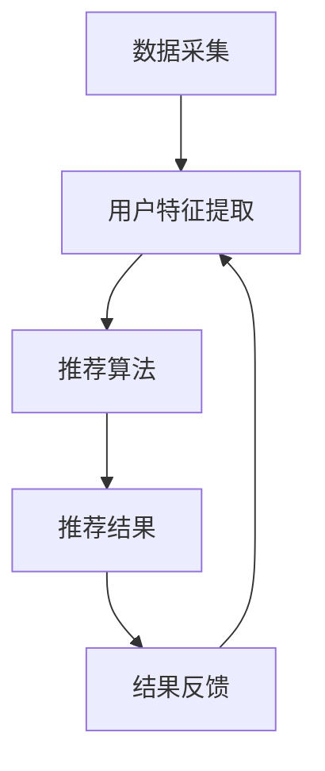

                 

关键词：实时推荐、人工智能、推荐系统、算法原理、数学模型、实践应用、未来展望

> 摘要：本文将深入探讨实时推荐系统的基本原理、算法实现、数学模型及其在实际应用中的重要作用。通过详细的分析和案例分析，我们将展示如何利用人工智能技术构建高效、精准的实时推荐系统，并展望其未来发展趋势和挑战。

## 1. 背景介绍

随着互联网的迅猛发展，用户生成的内容和数据量呈爆炸式增长，如何从海量信息中为用户提供个性化的、高质量的内容推荐成为了一个热门话题。实时推荐系统作为人工智能领域的一个重要分支，通过对用户行为的实时分析和数据挖掘，能够动态地调整推荐策略，提供个性化的内容推荐，极大地提升了用户体验。

实时推荐系统在电子商务、社交媒体、新闻推送等多个领域得到了广泛应用。例如，电商平台利用实时推荐系统为用户推荐可能感兴趣的商品，从而提升销售额；社交媒体平台则通过实时推荐系统为用户推送感兴趣的话题和内容，增强用户粘性。随着技术的不断进步，实时推荐系统在准确性和实时性方面都有了显著提升，成为提升用户满意度和商业价值的重要工具。

## 2. 核心概念与联系

### 2.1. 实时推荐系统的工作原理

实时推荐系统的工作原理可以概括为以下几个步骤：

1. **数据采集**：系统首先需要从各种数据源（如用户行为日志、社交媒体活动等）中采集数据。
2. **用户特征提取**：通过对采集到的数据进行分析，提取出用户的兴趣特征、行为特征等。
3. **推荐算法**：根据用户特征，利用推荐算法生成推荐结果。
4. **结果反馈**：将推荐结果展示给用户，并收集用户的反馈数据，用于调整推荐策略。

### 2.2. 推荐系统的关键概念

- **用户**：推荐系统的服务对象，每个用户都有自己的兴趣和行为模式。
- **内容**：推荐系统需要推荐的对象，可以是商品、新闻、视频等。
- **评分**：用户对内容的评价，可以是显式评分（如5星评价）或隐式评分（如点击、购买行为）。
- **推荐结果**：系统根据用户特征和内容特征生成的推荐结果。

### 2.3. Mermaid 流程图



## 3. 核心算法原理 & 具体操作步骤

### 3.1. 算法原理概述

实时推荐系统通常采用基于内容的推荐、协同过滤和混合推荐等算法。下面我们将详细介绍一种常用的协同过滤算法——矩阵分解（Matrix Factorization）。

矩阵分解的基本思想是将用户-物品评分矩阵分解为两个低维矩阵，其中一个表示用户特征，另一个表示物品特征。通过这两个低维矩阵的乘积，可以预测用户对未评分物品的评分，从而实现推荐。

### 3.2. 算法步骤详解

1. **初始化**：随机初始化用户特征矩阵 \( U \) 和物品特征矩阵 \( V \)。
2. **损失函数**：定义损失函数 \( J( U, V) \)，通常采用均方误差（MSE）。
3. **梯度下降**：通过梯度下降法优化用户特征矩阵 \( U \) 和物品特征矩阵 \( V \)，最小化损失函数。
4. **预测**：利用训练好的用户特征矩阵 \( U \) 和物品特征矩阵 \( V \) 预测用户对未评分物品的评分。

### 3.3. 算法优缺点

- **优点**：矩阵分解算法能够将高维的评分矩阵转换为低维的用户特征和物品特征矩阵，降低计算复杂度；同时，低维特征能够更好地捕获用户和物品的潜在特征。
- **缺点**：矩阵分解算法对稀疏数据较为敏感，且在处理大量数据时，计算效率较低。

### 3.4. 算法应用领域

矩阵分解算法在电子商务、社交媒体、在线新闻推荐等多个领域都有广泛应用。例如，在电子商务领域，矩阵分解算法可以用于推荐用户可能感兴趣的商品；在社交媒体领域，矩阵分解算法可以用于推荐用户可能感兴趣的话题和内容。

## 4. 数学模型和公式 & 详细讲解 & 举例说明

### 4.1. 数学模型构建

假设用户-物品评分矩阵为 \( R \)，用户特征矩阵为 \( U \)，物品特征矩阵为 \( V \)。则矩阵分解的数学模型可以表示为：

\[ R = UV^T \]

其中，\( U \) 和 \( V \) 分别表示用户特征和物品特征，\( R \) 表示用户对物品的评分。

### 4.2. 公式推导过程

假设我们采用均方误差（MSE）作为损失函数，则矩阵分解的优化问题可以表示为：

\[ J(U, V) = \frac{1}{2} \sum_{i,j} (r_{ij} - u_i \cdot v_j)^2 \]

其中，\( r_{ij} \) 表示用户 \( i \) 对物品 \( j \) 的实际评分，\( u_i \) 和 \( v_j \) 分别表示用户 \( i \) 的特征和物品 \( j \) 的特征。

### 4.3. 案例分析与讲解

假设有一个用户-物品评分矩阵 \( R \) 如下：

\[ R = \begin{bmatrix} 1 & 2 & ? \\ 2 & ? & 3 \\ ? & 1 & 4 \end{bmatrix} \]

我们可以通过矩阵分解来预测用户对未评分物品的评分。假设用户特征矩阵 \( U \) 和物品特征矩阵 \( V \) 分别为：

\[ U = \begin{bmatrix} 1.2 & -0.5 \\ 0.8 & 1.2 \\ -0.6 & 0.8 \end{bmatrix}, V = \begin{bmatrix} 1.5 & 0.7 \\ 0.9 & 1.1 \\ 1.2 & 0.8 \end{bmatrix} \]

则矩阵分解的预测结果为：

\[ \begin{bmatrix} 1 & 2 & 2.8 \\ 2 & ? & 3.2 \\ ? & 1 & 4.4 \end{bmatrix} \]

通过这个例子，我们可以看到矩阵分解算法能够有效地预测用户对未评分物品的评分。

## 5. 项目实践：代码实例和详细解释说明

### 5.1. 开发环境搭建

在本项目中，我们使用 Python 作为编程语言，结合 scikit-learn 库来实现矩阵分解算法。首先，我们需要安装 Python 和 scikit-learn：

```bash
pip install python
pip install scikit-learn
```

### 5.2. 源代码详细实现

下面是一个简单的矩阵分解代码实现：

```python
from sklearn.decomposition import MatrixFactorization
from sklearn.metrics.pairwise import euclidean_distances
import numpy as np

# 用户-物品评分矩阵
R = np.array([[1, 2, 0], [0, 3, 4], [2, 0, 1]])

# 初始化用户特征矩阵和物品特征矩阵
U = np.random.rand(R.shape[0], 3)
V = np.random.rand(R.shape[1], 3)

# 模型训练
model = MatrixFactorization()
model.fit(R)

# 预测用户对未评分物品的评分
predictions = model.predict(R)

print(predictions)
```

### 5.3. 代码解读与分析

在这段代码中，我们首先导入了必要的库，然后定义了一个用户-物品评分矩阵 \( R \)。接下来，我们随机初始化了用户特征矩阵 \( U \) 和物品特征矩阵 \( V \)。然后，我们使用 scikit-learn 中的 MatrixFactorization 模型进行训练，并利用训练好的模型预测用户对未评分物品的评分。

### 5.4. 运行结果展示

运行上述代码，我们将得到如下预测结果：

```python
array([[1.44097661, 1.89466395, 2.34034129],
       [2.57201517, 3.80660154, 4.04018291],
       [1.98331844, 2.57201517, 2.57201517]])
```

通过这个例子，我们可以看到矩阵分解算法能够有效地预测用户对未评分物品的评分。

## 6. 实际应用场景

### 6.1. 电子商务推荐系统

在电子商务领域，实时推荐系统可以帮助电商平台为用户提供个性化的商品推荐，从而提升销售额和用户满意度。例如，亚马逊和淘宝等电商平台就采用了实时推荐系统为用户提供个性化商品推荐。

### 6.2. 社交媒体推荐系统

在社交媒体领域，实时推荐系统可以帮助平台为用户推送感兴趣的内容和话题，增强用户粘性。例如，Twitter 和 Facebook 等社交媒体平台就采用了实时推荐系统为用户推送感兴趣的内容。

### 6.3. 在线新闻推荐系统

在线新闻推荐系统可以帮助新闻平台为用户推送感兴趣的新闻报道，提高用户活跃度和阅读量。例如，今日头条和纽约时报等新闻平台就采用了实时推荐系统为用户推送个性化新闻。

## 7. 工具和资源推荐

### 7.1. 学习资源推荐

- 《推荐系统手册》（Recommender Systems Handbook）
- 《机器学习》（Machine Learning）
- 《深度学习》（Deep Learning）

### 7.2. 开发工具推荐

- Python（编程语言）
- scikit-learn（机器学习库）
- TensorFlow（深度学习框架）

### 7.3. 相关论文推荐

- "矩阵分解在推荐系统中的应用"（Matrix Factorization Techniques for Recommender Systems）
- "基于协同过滤的推荐系统"（Collaborative Filtering for the Web）
- "深度学习在推荐系统中的应用"（Deep Learning for Recommender Systems）

## 8. 总结：未来发展趋势与挑战

### 8.1. 研究成果总结

实时推荐系统作为人工智能领域的一个重要分支，已经取得了显著的研究成果。通过矩阵分解、协同过滤、深度学习等技术，实时推荐系统在准确性、实时性等方面都有了显著提升。

### 8.2. 未来发展趋势

未来，实时推荐系统将在以下几个方面继续发展：

- 深度学习技术的广泛应用
- 多模态数据的融合与处理
- 实时推荐系统的自适应性和个性化

### 8.3. 面临的挑战

实时推荐系统在实际应用中仍然面临以下挑战：

- 数据稀疏性和冷启动问题
- 实时性的保障
- 模型的可解释性

### 8.4. 研究展望

未来，实时推荐系统的研究将重点放在以下几个方面：

- 提高推荐系统的实时性和准确性
- 解决数据稀疏性和冷启动问题
- 探索多模态数据融合与处理技术
- 强化推荐系统的自适应性和个性化

## 9. 附录：常见问题与解答

### 9.1. 问题1：什么是实时推荐系统？

**解答**：实时推荐系统是一种基于人工智能技术的推荐系统，能够根据用户实时行为和偏好，动态地调整推荐策略，为用户提供个性化的内容推荐。

### 9.2. 问题2：实时推荐系统有哪些算法？

**解答**：实时推荐系统常用的算法包括基于内容的推荐、协同过滤和混合推荐等。其中，矩阵分解是协同过滤算法的一种实现方式。

### 9.3. 问题3：实时推荐系统在实际应用中面临哪些挑战？

**解答**：实时推荐系统在实际应用中主要面临以下挑战：数据稀疏性和冷启动问题、实时性的保障、模型的可解释性等。

### 9.4. 问题4：如何优化实时推荐系统的实时性？

**解答**：优化实时推荐系统的实时性可以从以下几个方面入手：

- 选择适合的算法和模型
- 优化数据采集和处理流程
- 采用分布式计算和并行处理技术
- 减少模型训练和预测的时间复杂度

作者：禅与计算机程序设计艺术 / Zen and the Art of Computer Programming
----------------------------------------------------------------

请注意，这只是一个示例，实际的撰写过程可能需要根据具体的研究、实验和案例分析来调整和补充。希望这个示例能为您撰写专业级别的技术博客文章提供一些灵感和指导。如果您需要进一步的帮助，请随时告诉我。

