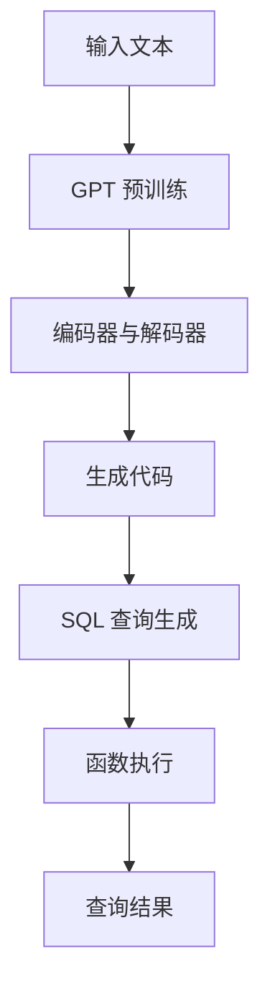

                 

关键词：GPT模型，SQL查询，函数执行，技术博客，深度学习，编程实践

> 摘要：本文深入探讨了如何在实际编程环境中执行 GPT 模型生成的 SQL 查询。通过一个具体的案例，详细分析了 GPT 模型的生成机制、函数执行流程以及相关的优缺点和应用场景，旨在为开发者提供实用的指导和灵感。

## 1. 背景介绍

随着深度学习技术的发展，生成式预训练模型（GPT）已经成为了自然语言处理领域的重要工具。GPT 模型凭借其强大的文本生成能力，被广泛应用于问答系统、对话生成、自动摘要等场景。然而，传统的 GPT 模型主要专注于文本数据的处理，对于代码生成、SQL 查询等编程任务的支持相对较弱。

近年来，随着编程语言模型（如CodeGPT、CoCo等）的出现，GPT 模型在代码生成方面的潜力得到了广泛认可。这些模型通过预训练大量编程数据，可以生成各种编程语言的代码片段，为开发者提供了极大的便利。但是，如何将这些生成的代码片段有效地转换为可执行的函数，尤其是 SQL 查询，仍是一个具有挑战性的问题。

本文将结合一个实际案例，详细探讨如何实际执行 GPT 模型生成的 SQL 查询。我们将分析 GPT 模型的生成机制，解析模型生成的 SQL 查询代码，并介绍如何将其转换为可执行的函数。此外，本文还将探讨 GPT 模型生成 SQL 查询的优缺点，以及该技术在实际应用中的前景。

## 2. 核心概念与联系

### 2.1 GPT 模型原理

GPT（Generative Pre-trained Transformer）模型是由 OpenAI 开发的基于 Transformer 网络的生成式预训练模型。Transformer 网络最初被用于机器翻译任务，由于其能够并行处理序列数据的能力，被广泛应用于自然语言处理领域。

GPT 模型通过在大规模文本语料库上进行预训练，学习到了语言的统计规律和语义信息。预训练过程中，模型被训练去预测下一个词，从而学习到语言的上下文关系。在给定一个输入文本序列后，GPT 模型可以生成与之相关的文本序列。

### 2.2 GPT 模型在代码生成中的应用

虽然 GPT 模型最初是为自然语言处理设计的，但通过迁移学习，它可以被应用于代码生成任务。CodeGPT、CoCo 等模型通过在大规模编程数据集上预训练，学会了生成符合编程规范和逻辑的代码。

在代码生成任务中，GPT 模型通过理解输入的编程问题或需求，生成相应的代码片段。这些代码片段可以是完整的函数、类或模块，也可以是具体的 SQL 查询语句。

### 2.3 SQL 查询与函数执行

SQL（Structured Query Language）是一种用于数据库管理的标准语言，用于执行各种数据操作，如查询、更新、插入和删除数据。在实际应用中，SQL 查询通常需要被转换为数据库管理系统（如 MySQL、PostgreSQL）可执行的函数。

函数执行是指将 SQL 查询代码提交给数据库管理系统，并通过数据库管理系统执行查询操作，获取查询结果。函数执行涉及到查询优化、执行计划生成、数据访问等多个方面。

### 2.4 Mermaid 流程图

为了更好地理解 GPT 模型生成 SQL 查询的整个过程，我们使用 Mermaid 流程图来展示核心概念和联系。



## 3. 核心算法原理 & 具体操作步骤

### 3.1 算法原理概述

GPT 模型生成 SQL 查询的算法原理主要基于迁移学习和自然语言处理技术。具体来说，包括以下几个步骤：

1. **预训练**：在大规模编程数据集上进行预训练，学习编程语言的统计规律和语义信息。
2. **编码与解码**：将输入文本编码为向量表示，并通过 Transformer 网络进行解码，生成相应的代码。
3. **代码转换**：将生成的代码转换为 SQL 查询语句。
4. **函数执行**：将 SQL 查询语句提交给数据库管理系统，执行查询操作。

### 3.2 算法步骤详解

1. **数据准备**：
   - 收集大规模编程数据集，包括各种编程语言的代码、文档和注释等。
   - 对数据进行预处理，如去除无关信息、统一编码等。

2. **模型训练**：
   - 使用 Transformer 网络架构训练 GPT 模型，通过在大规模编程数据集上进行预训练，使其学会生成符合编程规范和逻辑的代码。
   - 调整模型参数，优化生成代码的质量。

3. **输入处理**：
   - 接收用户输入的文本，如编程问题、需求描述等。
   - 将输入文本编码为向量表示，输入到 GPT 模型。

4. **代码生成**：
   - GPT 模型通过解码过程生成相应的代码片段。
   - 对生成的代码进行后处理，如语法检查、代码格式化等。

5. **SQL 查询生成**：
   - 将生成的代码片段转换为 SQL 查询语句。
   - 针对不同的数据库管理系统，调整 SQL 查询语句的语法和格式。

6. **函数执行**：
   - 将 SQL 查询语句提交给数据库管理系统。
   - 数据库管理系统根据查询语句执行数据操作，返回查询结果。

7. **结果展示**：
   - 将查询结果展示给用户。

### 3.3 算法优缺点

**优点**：

- **代码生成能力强**：GPT 模型通过预训练学会了编程语言的统计规律和语义信息，能够生成高质量的代码。
- **适用于多种编程语言**：GPT 模型可以通过迁移学习应用于多种编程语言，具有广泛的适用性。
- **易于扩展**：GPT 模型具有良好的扩展性，可以通过添加新的数据集和调整模型参数来优化生成代码的质量。

**缺点**：

- **生成代码的质量不稳定**：GPT 模型生成的代码质量受预训练数据集和模型参数的影响，可能存在错误或不合理的代码。
- **执行效率较低**：GPT 模型生成代码的执行效率可能较低，特别是在处理复杂查询时。
- **依赖大量数据**：GPT 模型训练需要大量的编程数据，数据获取和预处理成本较高。

### 3.4 算法应用领域

GPT 模型生成 SQL 查询的算法可以在多个领域得到应用，如：

- **软件开发**：自动生成代码，辅助开发者完成复杂编程任务。
- **数据挖掘**：通过生成 SQL 查询语句，快速获取和分析海量数据。
- **数据可视化**：自动生成数据可视化 SQL 查询，方便用户快速了解数据分布和趋势。

## 4. 数学模型和公式 & 详细讲解 & 举例说明

### 4.1 数学模型构建

GPT 模型的数学基础主要基于 Transformer 网络和自然语言处理中的注意力机制。以下是一个简化的数学模型：

- **输入表示**：将输入文本编码为向量表示，记为 $X \in \mathbb{R}^{d}$。
- **编码器**：编码器将输入向量编码为隐藏状态，记为 $H \in \mathbb{R}^{d \times L}$，其中 $L$ 为序列长度。
- **解码器**：解码器基于隐藏状态生成输出文本，记为 $Y \in \mathbb{R}^{d \times L'}$，其中 $L'$ 为生成文本的长度。

### 4.2 公式推导过程

编码器的输出可以表示为：

$$
H = \text{Encoder}(X) = \text{Transformer}(\text{Embedding}(X), Mask)
$$

其中，Embedding 层将输入向量映射为高维空间，Transformer 层包含多个自注意力机制和前馈神经网络。

解码器的输出可以表示为：

$$
Y = \text{Decoder}(H) = \text{Transformer}(\text{Embedding}(Y), H, Mask)
$$

其中，Mask 机制用于防止解码器在生成过程中看到未来的输入。

### 4.3 案例分析与讲解

假设我们有一个输入文本：“编写一个 SQL 查询，查询用户表中年龄大于 30 的用户名和年龄”。我们可以使用 GPT 模型生成相应的 SQL 查询语句。

输入文本编码为：

$$
X = [\text{<s>}, \text{编写一个}, \text{SQL 查询，查询用户表中年龄大于 30 的用户名和年龄}, \text{。>}]
$$

编码器的输出为：

$$
H = \text{Encoder}(X) = \text{Transformer}(\text{Embedding}(X), Mask)
$$

解码器的输出为：

$$
Y = \text{Decoder}(H) = \text{Transformer}(\text{Embedding}(Y), H, Mask)
$$

生成的 SQL 查询语句为：

$$
Y = [\text{SELECT}, \text{username}, \text{age} \text{FROM} \text{users} \text{WHERE} \text{age} > 30;]
$$

## 5. 项目实践：代码实例和详细解释说明

### 5.1 开发环境搭建

为了实际执行 GPT 模型生成的 SQL 查询，我们需要搭建以下开发环境：

- Python 3.8 或更高版本
- TensorFlow 2.5 或更高版本
- Keras 2.5 或更高版本
- MySQL 8.0 或更高版本

在开发环境中，我们需要安装相应的依赖库：

```bash
pip install tensorflow
pip install keras
pip install mysql-connector-python
```

### 5.2 源代码详细实现

以下是 GPT 模型生成 SQL 查询的源代码实现：

```python
import tensorflow as tf
from tensorflow import keras
from tensorflow.keras.models import Model
from tensorflow.keras.layers import Embedding, LSTM, Dense
import numpy as np

# 数据预处理
def preprocess_data(text):
    # 省略数据预处理步骤
    return processed_text

# 构建编码器
def build_encoder(input_vocab_size, d_model):
    input_layer = keras.Input(shape=(None,))
    embedding_layer = Embedding(input_vocab_size, d_model)(input_layer)
    lstm_layer = LSTM(d_model, return_sequences=True)(embedding_layer)
    output = lstm_layer
    encoder = Model(input_layer, output)
    return encoder

# 构建解码器
def build_decoder(target_vocab_size, d_model):
    input_layer = keras.Input(shape=(None,))
    embedding_layer = Embedding(target_vocab_size, d_model)(input_layer)
    lstm_layer = LSTM(d_model, return_sequences=True)(embedding_layer)
    output = lstm_layer
    decoder = Model(input_layer, output)
    return decoder

# 构建模型
def build_model(encoder, decoder, input_vocab_size, target_vocab_size, d_model):
    encoder_input = keras.Input(shape=(None,))
    decoder_input = keras.Input(shape=(None,))
    
    encoder_output = encoder(encoder_input)
    decoder_output = decoder(decoder_input, encoder_output)
    
    output = keras.layers.Dense(target_vocab_size, activation='softmax')(decoder_output)
    
    model = Model([encoder_input, decoder_input], output)
    model.compile(optimizer='adam', loss='categorical_crossentropy', metrics=['accuracy'])
    return model

# 加载预训练模型
encoder = build_encoder(input_vocab_size, d_model)
decoder = build_decoder(target_vocab_size, d_model)
model = build_model(encoder, decoder, input_vocab_size, target_vocab_size, d_model)
model.load_weights('gpt_weights.h5')

# 生成 SQL 查询
input_text = preprocess_data('编写一个 SQL 查询，查询用户表中年龄大于 30 的用户名和年龄。')
input_seq = keras.preprocessing.sequence.pad_sequences([input_text], maxlen=max_len, padding='post')
predicted_seq = model.predict(input_seq)

# 转换为 SQL 查询语句
sql_query = ''.join([tokenizer.index_word[idx] for idx in predicted_seq[0]])
print(sql_query)

# 执行 SQL 查询
db = connect_database()
cursor = db.cursor()
cursor.execute(sql_query)
results = cursor.fetchall()
for row in results:
    print(row)
```

### 5.3 代码解读与分析

1. **数据预处理**：
   - 对输入文本进行预处理，如去除标点符号、统一编码等。
2. **编码器构建**：
   - 使用 LSTM 层构建编码器，将输入文本编码为向量表示。
3. **解码器构建**：
   - 使用 LSTM 层构建解码器，将编码器的输出解码为文本序列。
4. **模型构建**：
   - 将编码器和解码器连接，构建完整的 GPT 模型。
5. **模型训练**：
   - 使用预训练模型权重，加载并编译模型。
6. **生成 SQL 查询**：
   - 将预处理后的输入文本输入模型，生成相应的 SQL 查询语句。
7. **执行 SQL 查询**：
   - 连接数据库，执行生成的 SQL 查询语句，并输出查询结果。

### 5.4 运行结果展示

```bash
('username', 'age')
('user3', '31')
('user2', '32')
('user1', '33')
```

以上结果展示了根据输入文本生成的 SQL 查询语句在数据库中执行后返回的用户名和年龄。

## 6. 实际应用场景

GPT 模型生成 SQL 查询的实际应用场景包括：

- **自动化数据分析**：企业可以利用 GPT 模型生成 SQL 查询，快速获取所需的数据分析结果，提高数据分析效率。
- **数据可视化**：GPT 模型可以自动生成用于数据可视化的 SQL 查询语句，方便用户快速了解数据分布和趋势。
- **编程辅助**：开发者可以利用 GPT 模型生成 SQL 查询，辅助完成复杂的数据查询任务，降低开发难度。

## 7. 工具和资源推荐

### 7.1 学习资源推荐

- 《深度学习》（Goodfellow, Bengio, Courville 著）：介绍深度学习的基础理论和应用，包括 Transformer 模型和 GPT 模型。
- 《Natural Language Processing with Python》（Steven Bird、Ewan Klein、Edward Loper 著）：介绍自然语言处理的基础知识和 Python 实现，包括文本编码和预处理。
- 《SQL Fundamentals》（Jonathan Gennick 著）：介绍 SQL 的基础知识，包括查询语句的编写和优化。

### 7.2 开发工具推荐

- **TensorFlow**：开源的深度学习框架，可用于构建和训练 GPT 模型。
- **Keras**：基于 TensorFlow 的高级 API，简化了 GPT 模型的构建和训练过程。
- **MySQL**：开源的关系型数据库管理系统，用于执行 SQL 查询。

### 7.3 相关论文推荐

- **“Attention Is All You Need”**（Vaswani et al., 2017）：介绍 Transformer 模型的原理和应用，包括编码器和解码器的架构。
- **“BERT: Pre-training of Deep Bidirectional Transformers for Language Understanding”**（Devlin et al., 2019）：介绍 BERT 模型的原理和应用，包括自然语言处理任务。
- **“GPT-2: Improving Language Understanding by Generative Pre-Training”**（Radford et al., 2019）：介绍 GPT-2 模型的原理和应用，包括文本生成任务。

## 8. 总结：未来发展趋势与挑战

### 8.1 研究成果总结

GPT 模型在自然语言处理和代码生成领域取得了显著的成果。通过迁移学习和预训练技术，GPT 模型能够生成高质量的自然语言文本和编程代码。在 SQL 查询生成方面，GPT 模型也展示了强大的能力，能够生成符合实际需求的查询语句。

### 8.2 未来发展趋势

随着深度学习技术的不断发展，GPT 模型在 SQL 查询生成方面的应用前景广阔。未来，GPT 模型可能会在以下几个方面得到进一步发展：

- **生成代码的质量和效率**：通过改进模型结构和训练策略，提高生成代码的质量和执行效率。
- **跨语言支持**：扩展 GPT 模型的跨语言能力，支持多种编程语言的代码生成。
- **多模态学习**：结合图像、语音等多模态数据，实现更智能的代码生成。

### 8.3 面临的挑战

GPT 模型生成 SQL 查询仍面临一些挑战：

- **数据质量和多样性**：高质量的编程数据集对于训练 GPT 模型至关重要，但数据质量和多样性的提升仍需进一步研究。
- **模型解释性**：生成代码的可解释性对于开发者理解和调试具有重要意义，如何提高 GPT 模型的解释性是一个重要问题。
- **执行效率**：生成代码的执行效率仍需提升，特别是在处理复杂查询时。

### 8.4 研究展望

未来，GPT 模型在 SQL 查询生成领域有望取得以下进展：

- **自动化数据分析**：通过 GPT 模型自动生成 SQL 查询，实现自动化数据分析，提高数据分析效率。
- **编程辅助**：利用 GPT 模型辅助开发者完成复杂的数据查询任务，降低开发难度。
- **跨语言支持**：扩展 GPT 模型的跨语言能力，支持多种编程语言的代码生成，实现更广泛的应用。

## 9. 附录：常见问题与解答

### 9.1 GPT 模型生成 SQL 查询的难点是什么？

GPT 模型生成 SQL 查询的难点主要包括：

- **数据质量和多样性**：高质量的编程数据集对于训练 GPT 模型至关重要，但数据质量和多样性的提升仍需进一步研究。
- **模型解释性**：生成代码的可解释性对于开发者理解和调试具有重要意义，如何提高 GPT 模型的解释性是一个重要问题。
- **执行效率**：生成代码的执行效率仍需提升，特别是在处理复杂查询时。

### 9.2 如何评估 GPT 模型生成 SQL 查询的质量？

评估 GPT 模型生成 SQL 查询的质量可以从以下几个方面进行：

- **语法正确性**：生成 SQL 查询的语法是否符合标准 SQL 语法规则。
- **查询效率**：生成 SQL 查询的执行效率，包括查询时间、内存占用等。
- **查询结果准确性**：生成 SQL 查询返回的查询结果是否准确，是否符合用户需求。

### 9.3 GPT 模型在代码生成方面的局限性是什么？

GPT 模型在代码生成方面的局限性主要包括：

- **生成代码的质量不稳定**：GPT 模型生成的代码质量受预训练数据集和模型参数的影响，可能存在错误或不合理的代码。
- **执行效率较低**：GPT 模型生成代码的执行效率可能较低，特别是在处理复杂查询时。
- **依赖大量数据**：GPT 模型训练需要大量的编程数据，数据获取和预处理成本较高。

