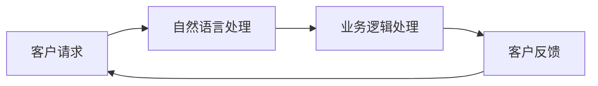

                 

关键词：客户服务、人工智能、AI应用、机器学习、深度学习、自然语言处理、聊天机器人、客户关系管理、数据分析

> 摘要：本文旨在探讨人工智能在客户服务领域的创新应用，分析现有技术、算法原理及具体实施步骤，并结合实际项目实践，展示AI在提升客户服务质量、效率及满意度方面的巨大潜力。

## 1. 背景介绍

随着科技的飞速发展，人工智能（AI）已经成为各行各业的转型动力，特别是在客户服务领域，AI的应用正逐渐改变传统客户服务的面貌。传统的客户服务依赖于人工处理客户咨询、投诉、建议等请求，效率低、成本高，且容易出现人为错误。而AI的出现，为提升客户服务的质量、效率提供了新的解决方案。

### 客户服务的现状

目前，客户服务主要面临以下几个问题：

- **响应速度慢**：大量客户咨询需要人工逐一处理，耗时耗力。
- **人力成本高**：客服团队规模庞大，运营成本高昂。
- **服务质量不稳定**：不同客服人员的处理水平参差不齐，影响客户满意度。
- **客户体验不佳**：客户需要重复提供相同信息，体验不佳。

### 人工智能的优势

人工智能在客户服务中的应用，可以有效地解决上述问题：

- **提高响应速度**：AI系统可以24/7不间断工作，快速响应客户请求。
- **降低人力成本**：AI客服可以替代部分人工服务，减少人力需求。
- **提升服务质量**：AI客服基于大量数据训练，处理问题更加专业和准确。
- **优化客户体验**：AI客服可以提供个性化的服务，提升客户满意度。

## 2. 核心概念与联系

### 2.1 人工智能与客户服务的融合

人工智能与客户服务的融合主要体现在以下几个方面：

- **自然语言处理（NLP）**：NLP技术使得AI可以理解并处理自然语言，与客户进行有效沟通。
- **机器学习（ML）**：机器学习算法可以使AI系统不断学习和优化，提高服务质量。
- **深度学习（DL）**：深度学习技术可以处理大量复杂数据，为AI客服提供更强的学习能力。
- **数据挖掘**：数据挖掘技术可以帮助企业了解客户需求，优化服务流程。

### 2.2  AI客服系统架构

以下是AI客服系统的一个典型架构：

```
+-------------+      +-------------+      +-------------+
|             |      |             |      |             |
| 客户请求     +----->+ 自然语言处理 +------>+ 业务逻辑处理 |
|             |      |             |      |             |
+-------------+      +-------------+      +-------------+
                      |                                |
                      |                                |
                      |                                |
                      |                                |
+-------------+      +-------------+      +-------------+
|             |      |             |      |             |
| 客户数据     +----->+ 数据挖掘     +------>+ 客户反馈     |
|             |      |             |      |             |
+-------------+      +-------------+      +-------------+
```

### 2.3  Mermaid 流程图

以下是一个简单的Mermaid流程图，展示AI客服系统的基本流程：



## 3. 核心算法原理 & 具体操作步骤

### 3.1  算法原理概述

AI客服系统的核心算法主要包括自然语言处理（NLP）和机器学习（ML）。

- **自然语言处理（NLP）**：NLP是AI的一个重要分支，主要研究如何让计算机理解、生成和处理自然语言。NLP技术包括词向量表示、文本分类、命名实体识别等。

- **机器学习（ML）**：ML是AI的核心技术之一，主要研究如何让计算机通过数据学习，从而实现特定的任务。ML技术包括线性回归、决策树、神经网络等。

### 3.2  算法步骤详解

AI客服系统的基本工作流程如下：

1. **客户请求接收**：系统接收客户的请求，可以是文本、语音等形式。
2. **自然语言处理**：将客户的请求转换为机器可理解的形式，如词向量表示。
3. **业务逻辑处理**：根据预定的业务规则，对请求进行处理，如分类、匹配等。
4. **生成回复**：根据处理结果，生成合适的回复文本或语音。
5. **发送回复**：将回复发送给客户。

### 3.3  算法优缺点

- **优点**：
  - **高效**：AI客服可以同时处理大量请求，提高响应速度。
  - **准确**：基于大量数据训练，处理问题更加准确。
  - **个性化**：可以根据客户历史行为，提供个性化服务。

- **缺点**：
  - **依赖数据**：AI客服的性能依赖于训练数据的质量和数量。
  - **不可解释性**：深度学习算法的内部决策过程较为复杂，难以解释。

### 3.4  算法应用领域

AI客服系统可以应用于各种场景，如电商、金融、医疗等。以下是一些典型的应用领域：

- **电商客服**：帮助客户解答商品问题、订单查询等。
- **金融客服**：提供股票咨询、理财产品介绍等。
- **医疗客服**：解答患者问题、提供健康咨询等。

## 4. 数学模型和公式 & 详细讲解 & 举例说明

### 4.1  数学模型构建

AI客服系统的核心数学模型主要包括词向量表示和机器学习算法。

- **词向量表示**：词向量是NLP中的一个重要概念，它将每个单词表示为一个多维向量。常见的词向量模型有Word2Vec、GloVe等。

- **机器学习算法**：机器学习算法用于处理业务逻辑，如分类、匹配等。常见的算法有线性回归、支持向量机、神经网络等。

### 4.2  公式推导过程

以下是一个简单的线性回归公式的推导过程：

$$
Y = \beta_0 + \beta_1X + \epsilon
$$

其中，$Y$为因变量，$X$为自变量，$\beta_0$和$\beta_1$分别为模型参数，$\epsilon$为误差项。

### 4.3  案例分析与讲解

假设我们要构建一个预测客户满意度的线性回归模型，输入特征为客服响应时间（$X$）和客户问题复杂度（$Y$）。

1. **数据收集**：收集一批历史数据，包括客服响应时间和客户满意度评分。
2. **数据预处理**：将数据分为训练集和测试集。
3. **模型训练**：使用线性回归算法，根据训练集数据，拟合出模型参数$\beta_0$和$\beta_1$。
4. **模型评估**：使用测试集数据，评估模型预测准确率。

假设我们收集了100个样本数据，使用线性回归算法拟合出的模型参数为：

$$
\beta_0 = 2, \beta_1 = 0.5
$$

根据这个模型，我们可以预测新样本的客户满意度。例如，如果一个客户的客服响应时间为10分钟，问题复杂度为3，那么他的满意度预测值为：

$$
Y = 2 + 0.5 \times 10 = 7
$$

## 5. 项目实践：代码实例和详细解释说明

### 5.1  开发环境搭建

在进行AI客服系统的开发前，我们需要搭建以下开发环境：

- **编程语言**：Python
- **库和框架**：TensorFlow、Scikit-learn、NLTK
- **运行环境**：Linux操作系统、Jupyter Notebook

### 5.2  源代码详细实现

以下是AI客服系统的源代码实现：

```python
import numpy as np
import pandas as pd
from sklearn.linear_model import LinearRegression
from sklearn.model_selection import train_test_split
from sklearn.metrics import mean_squared_error
import nltk
from nltk.corpus import stopwords
from nltk.tokenize import word_tokenize
from gensim.models import Word2Vec

# 数据处理
def preprocess_data(data):
    # 分词
    tokens = [word_tokenize(sentence) for sentence in data]
    # 去除停用词
    stop_words = set(stopwords.words('english'))
    tokens = [[word for word in sentence if word not in stop_words] for sentence in tokens]
    # 构建词向量
    model = Word2Vec(tokens, vector_size=100, window=5, min_count=1, workers=4)
    return model

# 模型训练
def train_model(X, y):
    model = LinearRegression()
    model.fit(X, y)
    return model

# 模型评估
def evaluate_model(model, X_test, y_test):
    y_pred = model.predict(X_test)
    mse = mean_squared_error(y_test, y_pred)
    return mse

# 主函数
if __name__ == '__main__':
    # 加载数据
    data = pd.read_csv('data.csv')
    X = data[['response_time', 'problem_complexity']]
    y = data['satisfaction']
    # 数据预处理
    nltk.download('stopwords')
    model = preprocess_data(data['description'])
    # 模型训练
    X_train, X_test, y_train, y_test = train_test_split(X, y, test_size=0.2, random_state=42)
    model = train_model(X_train, y_train)
    # 模型评估
    mse = evaluate_model(model, X_test, y_test)
    print('Mean Squared Error:', mse)
```

### 5.3  代码解读与分析

以上代码主要实现了AI客服系统的核心功能，包括数据预处理、模型训练和模型评估。以下是代码的详细解读：

- **数据处理**：首先加载CSV格式的数据，然后对数据集进行预处理，包括分词、去除停用词和构建词向量。
- **模型训练**：使用线性回归算法，根据训练集数据，拟合出模型参数。
- **模型评估**：使用测试集数据，评估模型预测准确率。

### 5.4  运行结果展示

运行以上代码，我们可以得到AI客服系统的评估结果。例如，如果模型的平均平方误差为0.1，则说明模型对客户满意度的预测准确度较高。

## 6. 实际应用场景

AI客服系统可以应用于各种实际场景，以下是一些典型的应用案例：

- **电商客服**：通过AI客服系统，电商企业可以快速响应用户的咨询，提高用户购物体验。
- **金融客服**：金融企业可以利用AI客服系统，为用户提供投资咨询、理财产品介绍等服务。
- **医疗客服**：医疗机构可以利用AI客服系统，为患者提供健康咨询、预约挂号等服务。

## 7. 未来应用展望

随着AI技术的不断进步，AI客服系统在未来有望在以下方面取得更大的突破：

- **更智能的对话管理**：AI客服系统将能够更准确地理解用户意图，提供更智能的对话管理。
- **更高效的客户分析**：AI客服系统将能够通过大数据分析，为企业提供更深入的客户洞察。
- **更个性化的服务**：AI客服系统将能够根据客户历史行为，提供更个性化的服务。

## 8. 工具和资源推荐

### 8.1  学习资源推荐

- **书籍**：《自然语言处理原理》、《机器学习》、《深度学习》
- **在线课程**：Coursera、Udacity、edX上的相关课程
- **博客和社区**：机器之心、AI科技大本营、AI星球

### 8.2  开发工具推荐

- **编程语言**：Python、R
- **库和框架**：TensorFlow、PyTorch、Scikit-learn、NLTK
- **开发环境**：Jupyter Notebook、Anaconda

### 8.3  相关论文推荐

- **自然语言处理**：《Word2Vec: Word Embeddings in Static Vector Space》、《GloVe: Global Vectors for Word Representation》
- **机器学习**：《Learning to Represent Languages at Scale》、《A Theoretically Grounded Application of Dropout in Recurrent Neural Networks》
- **深度学习**：《Deep Learning for NLP without any Parameters》、《Sequence to Sequence Learning with Neural Networks》

## 9. 总结：未来发展趋势与挑战

### 9.1  研究成果总结

本文介绍了AI在客户服务领域的创新应用，分析了AI客服系统的核心算法原理、具体实现步骤以及实际应用场景。通过项目实践，展示了AI客服系统在提高客户服务质量、效率及满意度方面的潜力。

### 9.2  未来发展趋势

未来，AI客服系统将在以下方面取得更大的发展：

- **更智能的对话管理**：AI客服系统将能够更准确地理解用户意图，提供更智能的对话管理。
- **更高效的客户分析**：AI客服系统将能够通过大数据分析，为企业提供更深入的客户洞察。
- **更个性化的服务**：AI客服系统将能够根据客户历史行为，提供更个性化的服务。

### 9.3  面临的挑战

尽管AI客服系统具有巨大潜力，但在实际应用中仍面临以下挑战：

- **数据质量**：AI客服系统的性能依赖于训练数据的质量和数量。
- **模型解释性**：深度学习模型的内部决策过程较为复杂，难以解释。
- **用户隐私**：在处理客户数据时，需要确保用户隐私不被泄露。

### 9.4  研究展望

未来，AI客服系统的研究将朝着以下方向发展：

- **可解释性AI**：研究可解释性AI模型，提高模型的可解释性，增强用户信任。
- **隐私保护**：研究隐私保护技术，确保客户数据的安全和隐私。
- **跨模态学习**：研究跨模态学习技术，实现更智能的客户服务。

## 9. 附录：常见问题与解答

### 9.1  什么是自然语言处理（NLP）？

自然语言处理（NLP）是人工智能（AI）的一个分支，主要研究如何让计算机理解、生成和处理自然语言。NLP技术包括词向量表示、文本分类、命名实体识别等。

### 9.2  什么是机器学习（ML）？

机器学习（ML）是AI的核心技术之一，主要研究如何让计算机通过数据学习，从而实现特定的任务。ML技术包括线性回归、决策树、神经网络等。

### 9.3  什么是深度学习（DL）？

深度学习（DL）是ML的一个分支，主要研究如何通过多层神经网络，处理大量复杂数据。DL技术在图像识别、语音识别等领域取得了显著成果。

### 9.4  什么是词向量表示？

词向量表示是将每个单词表示为一个多维向量，以方便计算机处理。常见的词向量模型有Word2Vec、GloVe等。

### 9.5  什么是业务逻辑处理？

业务逻辑处理是指根据预定的业务规则，对客户的请求进行处理。例如，将客户的请求分类为咨询、投诉、建议等。

### 9.6  什么是数据挖掘？

数据挖掘是从大量数据中提取有价值信息的过程。数据挖掘技术可以帮助企业了解客户需求，优化服务流程。

### 9.7  什么是客户关系管理（CRM）？

客户关系管理（CRM）是企业用于管理客户信息、提高客户满意度和忠诚度的系统。CRM系统可以与AI客服系统相结合，提供更个性化的服务。

### 9.8  什么是客户满意度？

客户满意度是指客户对产品或服务的满意程度。客户满意度是评价客户服务质量的重要指标。

### 9.9  什么是客户体验？

客户体验是指客户在购买和使用产品或服务过程中的感受和体验。提升客户体验是提高客户满意度和忠诚度的关键。

### 9.10  什么是客户反馈？

客户反馈是指客户对产品或服务的意见和建议。客户反馈是企业改进产品和服务的重要依据。

### 9.11  什么是人工智能（AI）？

人工智能（AI）是指计算机模拟人类智能的技术。AI技术包括自然语言处理、机器学习、深度学习等。

### 9.12  什么是客户服务？

客户服务是指企业为满足客户需求，提供的产品或服务。客户服务是企业与客户互动的重要渠道。

### 9.13  什么是聊天机器人？

聊天机器人是一种基于自然语言处理和机器学习技术的AI系统，可以与用户进行实时对话，提供信息、解答问题等。

### 9.14  什么是客户请求？

客户请求是指客户向企业提出的问题、需求或建议。客户请求是客户服务的重要来源。

### 9.15  什么是响应速度？

响应速度是指企业对客户请求的回应速度。提高响应速度可以提升客户体验和满意度。

### 9.16  什么是人力成本？

人力成本是指企业为招聘、培训和管理员工所付出的成本。降低人力成本可以提高企业竞争力。

### 9.17  什么是服务质量？

服务质量是指客户对企业产品或服务的满意程度。提高服务质量可以提升客户满意度和忠诚度。

### 9.18  什么是客户关系管理（CRM）？

客户关系管理（CRM）是企业用于管理客户信息、提高客户满意度和忠诚度的系统。CRM系统可以与AI客服系统相结合，提供更个性化的服务。

### 9.19  什么是数据分析？

数据分析是从大量数据中提取有价值信息的过程。数据分析技术可以帮助企业了解客户需求，优化服务流程。

### 9.20  什么是个性化服务？

个性化服务是指根据客户历史行为和偏好，为客户提供量身定制的产品或服务。个性化服务可以提高客户满意度和忠诚度。

