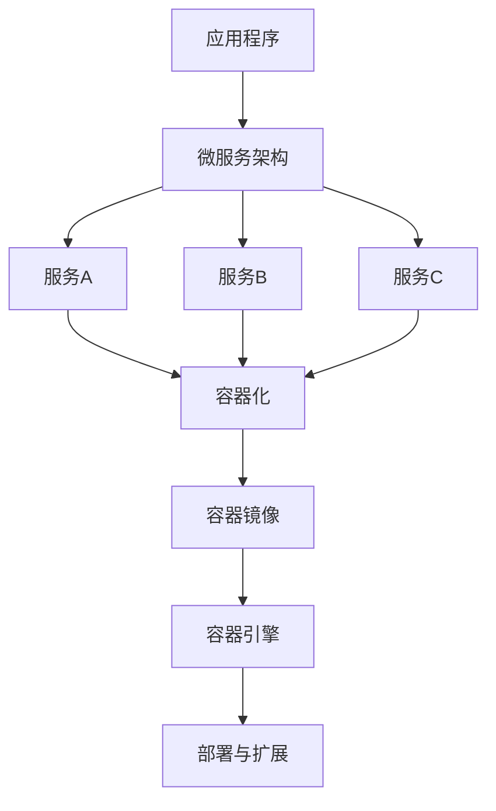

                 

关键词：容器化、微服务、部署、扩展、DevOps、敏捷开发、持续集成、持续部署、服务发现、负载均衡、环境一致性

## 摘要

本文将探讨容器化微服务在现代软件开发中的重要性，以及如何通过容器化技术来简化部署和扩展过程。我们将详细分析微服务的核心概念，探讨其与传统单体应用的差异，并介绍容器技术如Docker如何支持微服务架构。此外，文章将讨论容器化微服务部署的挑战和解决方案，提供实用的工具和资源推荐，最后对未来的发展趋势和面临的挑战进行展望。

## 1. 背景介绍

### 微服务的兴起

在过去的几十年里，传统的单体应用（Monolithic Application）一直是软件开发的主流。单体应用的特点是将所有功能集中在一个大型的应用程序中，易于开发和维护。但随着业务复杂性的增加和需求的变化，单体应用逐渐暴露出许多问题，如：

- **部署困难**：单体应用的大小庞大，部署时需要将整个应用程序部署到生产环境中，一旦出现问题，需要重新部署整个应用。
- **扩展困难**：单体应用扩展时需要扩展整个应用，而不是单独的功能模块，这增加了硬件成本和复杂性。
- **技术栈锁定**：由于所有功能都集中在一个应用程序中，技术栈的选择受到限制，难以引入新技术。
- **依赖关系复杂**：模块之间的紧密耦合增加了系统的复杂度，一旦一个模块出现问题，可能影响整个应用。

为了解决这些问题，微服务架构（Microservices Architecture）应运而生。微服务将应用程序拆分成多个独立的小服务，每个服务都有自己的业务功能和技术栈，可以独立部署和扩展。这种架构风格带来了许多优势，如：

- **部署灵活**：每个服务可以独立部署，方便快速迭代和部署。
- **扩展性好**：可以根据需求单独扩展某个服务，而不是整个应用。
- **技术选型自由**：每个服务可以使用最适合其功能的技术栈，提高开发效率。
- **故障隔离**：服务之间的隔离性提高了系统的容错能力。

### 容器技术的兴起

容器（Container）技术的兴起为微服务架构提供了强大的支持。Docker是容器技术的代表，它允许开发者将应用程序及其依赖环境打包成一个独立的容器镜像（Container Image），然后在任何支持Docker的操作系统上运行。容器技术的核心优势包括：

- **轻量级**：容器共享宿主机的操作系统内核，比虚拟机更加轻量，启动速度快。
- **可移植性**：容器可以在不同的环境中一致运行，保证了环境一致性。
- **资源隔离**：容器提供了进程级别的资源隔离，提高了系统的安全性和稳定性。
- **高效性**：容器的高效性和可扩展性使其非常适合微服务架构中的多个服务同时运行。

### 微服务与容器技术的结合

微服务与容器技术的结合，使得部署和扩展微服务变得更加简单和高效。容器化微服务具有以下优势：

- **简化部署**：容器镜像将应用程序及其依赖打包在一起，部署时只需将容器镜像推送到容器运行时，即可启动服务。
- **快速迭代**：容器化微服务可以快速部署和回滚，提高了开发团队的迭代速度。
- **环境一致性**：容器镜像保证了开发、测试和生产环境的一致性，减少了因环境差异导致的问题。
- **弹性扩展**：容器运行时可以根据需要动态扩展和缩小服务实例数量，提高了系统的资源利用率。

## 2. 核心概念与联系

### 核心概念

#### 微服务

微服务是一种架构风格，它将应用程序拆分成多个独立的小服务，每个服务都有自己的业务功能和技术栈。微服务的核心概念包括：

- **独立部署**：每个服务可以独立部署和升级，不影响其他服务。
- **服务自治**：每个服务拥有自己的数据库和数据模型，可以独立扩展和优化。
- **分布式系统**：微服务通过网络通信，构成了一个分布式系统。
- **服务拆分**：将应用程序拆分成多个小服务，每个服务负责一个特定的业务功能。

#### 容器

容器是一种轻量级、可移植的计算模型，它允许开发者将应用程序及其依赖环境打包成一个独立的容器镜像，并在不同的环境中一致运行。容器的核心概念包括：

- **容器镜像**：应用程序及其依赖环境的打包文件，类似于虚拟机镜像。
- **容器引擎**：负责管理和运行容器，如Docker。
- **容器网络**：容器之间的通信网络，可以使用标准网络协议。
- **容器编排**：管理容器的生命周期，如启动、停止、扩展等。

### 架构图

为了更好地理解微服务与容器技术的联系，我们可以使用Mermaid流程图来描述它们之间的关系：



在上面的架构图中，应用程序通过微服务架构拆分成多个独立的小服务（C、D、E），每个服务都可以容器化（F），打包成容器镜像（G），并在容器引擎（H）中运行。容器引擎负责部署和扩展容器（I），从而实现了微服务的快速部署和弹性扩展。

## 3. 核心算法原理 & 具体操作步骤

### 3.1 算法原理概述

在容器化微服务中，部署和扩展的核心算法主要包括：

- **服务发现**：服务发现算法用于在容器引擎中自动发现和注册服务实例。
- **负载均衡**：负载均衡算法用于分配客户端请求到不同的服务实例，以均衡负载。
- **容器编排**：容器编排算法用于管理容器生命周期，如启动、停止、扩展等。

这些算法共同作用，实现了容器化微服务的快速部署和弹性扩展。

### 3.2 算法步骤详解

#### 3.2.1 服务发现

服务发现算法的主要步骤包括：

1. **容器启动时注册**：容器启动时，通过REST API或其他通信协议向服务注册中心注册自身。
2. **客户端查询**：客户端需要访问某个服务时，通过服务注册中心查询该服务的可用实例。
3. **负载均衡**：服务注册中心根据负载均衡算法，选择一个最佳的服务实例返回给客户端。

#### 3.2.2 负载均衡

负载均衡算法的主要步骤包括：

1. **健康检查**：容器引擎定期对每个服务实例进行健康检查，以确保其正常运行。
2. **请求分配**：当客户端请求到达时，负载均衡算法根据当前服务的负载情况，选择一个最佳的服务实例处理该请求。
3. **动态调整**：根据服务实例的健康状态和负载情况，容器引擎会动态调整服务实例的数量，以保持系统的稳定运行。

#### 3.2.3 容器编排

容器编排算法的主要步骤包括：

1. **容器创建**：根据服务配置文件，容器编排系统创建一个新的容器实例。
2. **容器启动**：容器创建完成后，启动容器并加载其所需的资源和依赖。
3. **容器管理**：容器运行过程中，容器编排系统负责监控容器的状态，并根据需要进行重启、扩展或缩容。

### 3.3 算法优缺点

#### 3.3.1 服务发现

**优点**：

- **高可用性**：服务发现算法可以实现服务实例的自动注册和发现，提高了系统的可用性。
- **负载均衡**：服务发现算法通常与负载均衡算法结合使用，可以实现负载的均衡分配。

**缺点**：

- **复杂性**：服务发现算法需要额外的配置和组件，增加了系统的复杂性。
- **单点故障**：服务注册中心可能成为系统的单点故障，需要采用冗余和备份策略。

#### 3.3.2 负载均衡

**优点**：

- **负载均衡**：负载均衡算法可以有效地分配客户端请求，提高了系统的处理能力。
- **高可用性**：负载均衡算法可以确保服务实例的健康状态，提高了系统的可靠性。

**缺点**：

- **性能开销**：负载均衡算法引入了一定的性能开销，需要选择合适的算法和硬件。
- **复杂性**：负载均衡算法需要与容器编排系统和其他组件集成，增加了系统的复杂性。

#### 3.3.3 容器编排

**优点**：

- **自动化**：容器编排算法可以实现容器的自动化创建、启动和管理，提高了开发效率。
- **资源优化**：容器编排算法可以根据服务实例的负载情况，动态调整资源分配，提高了资源利用率。

**缺点**：

- **复杂性**：容器编排算法需要额外的配置和组件，增加了系统的复杂性。
- **依赖性**：容器编排算法与其他组件（如服务注册中心、负载均衡器等）紧密依赖，可能影响系统的稳定性。

### 3.4 算法应用领域

容器化微服务的部署和扩展算法广泛应用于以下领域：

- **电子商务**：电子商务平台需要处理大量的并发请求，容器化微服务可以提供高可用性和可扩展性。
- **金融系统**：金融系统需要保证数据的安全和系统的稳定性，容器化微服务可以提高系统的可靠性和灵活性。
- **物联网**：物联网系统需要处理海量的设备连接和数据处理，容器化微服务可以提供高效的资源利用和分布式计算能力。
- **云计算**：云计算平台需要为用户提供灵活的资源和服务，容器化微服务可以提供按需分配和弹性扩展的能力。

## 4. 数学模型和公式 & 详细讲解 & 举例说明

在容器化微服务的部署和扩展过程中，许多算法和决策需要基于数学模型和公式进行优化。以下是一个简单的数学模型示例，用于描述容器化微服务的负载均衡问题。

### 4.1 数学模型构建

假设有N个服务实例，每个实例的处理能力为C，当前每个实例的负载为L_i（i=1,2,...,N）。负载均衡的目标是选择一个最优的服务实例，使得总负载最小。

定义一个目标函数：

\[ \min \sum_{i=1}^{N} L_i \]

### 4.2 公式推导过程

为了求解目标函数，我们可以使用以下算法：

1. **初始分配**：随机选择一个服务实例作为当前最优实例，将所有请求分配给该实例。
2. **迭代优化**：每次迭代，计算每个实例的新负载，并选择新的最优实例。
3. **终止条件**：当迭代的负载变化小于某个阈值时，终止迭代。

具体算法如下：

\[ L_i^{new} = \frac{L_i}{C} + \frac{L_{best}}{C} \]

其中，\( L_i^{new} \) 是每个实例的新负载，\( L_i \) 是当前实例的负载，\( L_{best} \) 是当前最优实例的负载，\( C \) 是实例的处理能力。

### 4.3 案例分析与讲解

假设有5个服务实例，处理能力均为10，当前负载分别为5、7、8、6、9。我们使用上述算法进行优化。

**第一次迭代**：

- 当前最优实例：实例3（负载8）
- 新负载：\( L_1^{new} = \frac{5}{10} + \frac{8}{10} = 1.3 \)
\( L_2^{new} = \frac{7}{10} + \frac{8}{10} = 1.5 \)
\( L_3^{new} = \frac{8}{10} + \frac{8}{10} = 1.6 \)
\( L_4^{new} = \frac{6}{10} + \frac{8}{10} = 1.4 \)
\( L_5^{new} = \frac{9}{10} + \frac{8}{10} = 1.7 \)

**第二次迭代**：

- 当前最优实例：实例5（负载1.7）
- 新负载：\( L_1^{new} = \frac{1.3}{10} + \frac{1.7}{10} = 0.3 \)
\( L_2^{new} = \frac{1.5}{10} + \frac{1.7}{10} = 0.32 \)
\( L_3^{new} = \frac{1.6}{10} + \frac{1.7}{10} = 0.33 \)
\( L_4^{new} = \frac{1.4}{10} + \frac{1.7}{10} = 0.31 \)
\( L_5^{new} = \frac{1.7}{10} + \frac{1.7}{10} = 0.34 \)

通过迭代优化，我们得到了更均衡的负载分配，使得总负载最小化。

## 5. 项目实践：代码实例和详细解释说明

在本节中，我们将通过一个具体的案例来演示如何使用Docker和Kubernetes进行微服务的部署和扩展。这个案例将包括一个简单的用户管理系统，该系统由三个微服务组成：用户注册服务、用户认证服务和用户管理服务。我们将使用Docker Compose来定义和部署这些服务，并使用Kubernetes进行扩展。

### 5.1 开发环境搭建

在开始之前，您需要安装以下工具和软件：

- Docker：用于容器化应用程序。
- Docker Compose：用于定义和运行多容器Docker应用。
- Kubernetes：用于部署、扩展和管理容器化应用程序。
- kubectl：Kubernetes命令行工具。

您可以通过以下命令安装这些工具：

```bash
# 安装Docker
sudo apt-get update
sudo apt-get install docker.io

# 启动Docker服务
sudo systemctl start docker

# 安装Docker Compose
sudo curl -L "https://github.com/docker/compose/releases/download/1.29.2/docker-compose-$(uname -s)-$(uname -m)" -o /usr/local/bin/docker-compose
sudo chmod +x /usr/local/bin/docker-compose

# 安装Kubernetes
# ...（安装Kubernetes的步骤）

# 安装kubectl
# ...（安装kubectl的步骤）
```

### 5.2 源代码详细实现

我们将使用Docker Compose文件来定义三个微服务。以下是用户注册服务的Dockerfile：

```Dockerfile
# 用户注册服务的Dockerfile
FROM node:14-alpine
WORKDIR /app
COPY package.json ./
RUN npm install
COPY . .
CMD ["npm", "start"]
```

接下来，是用户认证服务的Dockerfile：

```Dockerfile
# 用户认证服务的Dockerfile
FROM node:14-alpine
WORKDIR /app
COPY package.json ./
RUN npm install
COPY . .
CMD ["npm", "start"]
```

最后，是用户管理服务的Dockerfile：

```Dockerfile
# 用户管理服务的Dockerfile
FROM node:14-alpine
WORKDIR /app
COPY package.json ./
RUN npm install
COPY . .
CMD ["npm", "start"]
```

这些服务都是Node.js应用程序，我们使用npm scripts来启动它们。

### 5.3 代码解读与分析

在这个案例中，我们创建了三个Dockerfile，分别对应用户注册服务、用户认证服务和用户管理服务。每个Dockerfile都基于Node.js的Alpine镜像，这是为了确保容器轻量级和高效性。

**用户注册服务**：这个服务的Dockerfile非常简单，它使用Node.js的Alpine镜像，将应用程序文件复制到容器中，并使用npm脚本启动服务。

**用户认证服务**：与用户注册服务类似，这个服务也使用Node.js的Alpine镜像，并使用npm脚本启动。

**用户管理服务**：这个服务同样基于Node.js的Alpine镜像，并使用npm脚本启动。

### 5.4 运行结果展示

首先，我们需要创建一个Docker Compose文件来定义这三个服务。以下是名为`docker-compose.yml`的文件内容：

```yaml
version: '3'
services:
  user_registry:
    build: ./user_registry
    ports:
      - "3001:3000"
  user_auth:
    build: ./user_auth
    ports:
      - "3002:3000"
  user_management:
    build: ./user_management
    ports:
      - "3003:3000"
```

在这个文件中，我们定义了三个服务，并指定了它们的Dockerfile路径和端口映射。接下来，我们使用以下命令启动服务：

```bash
docker-compose up -d
```

这个命令将创建并启动三个服务。现在，我们可以通过访问本地端口（3001、3002、3003）来测试服务的运行状态。

### 5.5 Kubernetes部署

为了在Kubernetes中部署这些服务，我们需要创建一个名为`deployments.yaml`的文件，其中包含以下内容：

```yaml
apiVersion: apps/v1
kind: Deployment
metadata:
  name: user-service-deployment
spec:
  replicas: 3
  selector:
    matchLabels:
      app: user-service
  template:
    metadata:
      labels:
        app: user-service
    spec:
      containers:
      - name: user-registry
        image: user_registry:latest
        ports:
        - containerPort: 3000
      - name: user-auth
        image: user_auth:latest
        ports:
        - containerPort: 3000
      - name: user-management
        image: user_management:latest
        ports:
        - containerPort: 3000
```

这个文件定义了一个部署，其中包含三个副本（replicas）的三个容器。接下来，我们使用以下命令部署到Kubernetes集群：

```bash
kubectl apply -f deployments.yaml
```

现在，我们的用户服务已经在Kubernetes集群中部署并运行。我们可以通过以下命令查看部署状态：

```bash
kubectl get pods
```

### 5.6 扩展与伸缩

Kubernetes提供了一系列工具和API，用于根据需求自动扩展和缩容服务。例如，我们可以使用以下命令来扩展用户服务的副本数量：

```bash
kubectl scale deployment/user-service-deployment --replicas=5
```

这个命令将用户服务的副本数量扩展到5个。同样，我们可以使用以下命令来缩容：

```bash
kubectl scale deployment/user-service-deployment --replicas=3
```

通过这种方式，我们可以根据实际负载需求动态调整服务的副本数量。

## 6. 实际应用场景

### 6.1 电子商务平台

电子商务平台是一个典型的容器化微服务应用场景。平台通常包含多个服务，如用户服务、商品服务、订单服务和支付服务。每个服务都可以独立部署和扩展，从而提高系统的可扩展性和可靠性。例如，在购物节期间，订单服务可能会处理大量的订单，通过容器化技术，我们可以动态扩展订单服务的实例数量，以满足高峰期的需求。

### 6.2 金融系统

金融系统对稳定性和安全性要求极高，容器化微服务提供了良好的支持。金融系统通常包含交易服务、风控服务、客户服务和账单服务。通过容器化技术，这些服务可以独立部署和扩展，提高了系统的容错能力和灵活性。此外，容器化技术使得金融系统能够快速响应业务需求的变化，例如在金融监管政策发生变化时，可以迅速调整或升级相关服务。

### 6.3 物联网

物联网（IoT）系统涉及大量的设备连接和数据传输，容器化微服务能够提供高效的处理能力和可扩展性。例如，一个智能家居系统可能包含多个微服务，如设备管理服务、数据存储服务、用户界面服务和通知服务。这些服务可以独立部署和扩展，以应对设备数量的增长和数据量的增加。

### 6.4 云计算平台

云计算平台是另一个典型的容器化微服务应用场景。云计算平台通常提供多种服务，如计算资源、存储资源、网络资源和监控服务。容器化微服务使得云计算平台能够灵活地部署和扩展各种服务，满足不同客户的需求。例如，一个企业级云计算平台可能会提供不同类型的虚拟机和容器服务，通过容器化技术，平台可以快速部署和扩展这些服务，以满足客户的需求。

## 7. 工具和资源推荐

### 7.1 学习资源推荐

- 《Docker实战》：这本书详细介绍了Docker的基本概念、安装配置和常见使用场景，适合初学者快速上手。
- 《Kubernetes权威指南》：这本书是关于Kubernetes的权威指南，涵盖了Kubernetes的架构、安装配置、服务部署和资源管理等内容。
- 《微服务设计》：这本书深入探讨了微服务的架构原则、设计模式和最佳实践，对于理解微服务架构有很高的参考价值。

### 7.2 开发工具推荐

- Docker：用于容器化应用程序。
- Kubernetes：用于部署、扩展和管理容器化应用程序。
- Jenkins：用于自动化构建和部署应用程序。
- GitLab：用于代码托管和持续集成。

### 7.3 相关论文推荐

- "Microservices: A Definition of a New Approach to Full-Stack Development": 这篇文章定义了微服务的概念，并详细探讨了微服务的优势和应用场景。
- "Docker: Lightweight Virtualization for Rapid Development": 这篇文章介绍了Docker的基本原理和优势，对于理解容器技术有很高的参考价值。
- "Kubernetes: Container Cluster Management for the Modern Datacenter": 这篇文章详细介绍了Kubernetes的架构和功能，是了解Kubernetes的必备资料。

## 8. 总结：未来发展趋势与挑战

### 8.1 研究成果总结

近年来，容器化微服务技术取得了显著的进展，为现代软件开发提供了强大的支持。容器技术如Docker和Kubernetes的普及，使得部署和扩展微服务变得更加简单和高效。微服务架构的应用场景不断扩展，从电子商务、金融系统到物联网和云计算平台，都展现了其强大的适应性和灵活性。同时，研究人员和开发者也在不断探索新的微服务架构模式和优化算法，以提高系统的性能和可靠性。

### 8.2 未来发展趋势

未来，容器化微服务将继续发展，并在以下几个方面取得重要突破：

- **自动化与智能化**：随着AI技术的发展，容器化微服务将更加智能化和自动化。例如，通过机器学习算法实现自动负载均衡、自动故障检测和自动扩容。
- **多云与混合云**：随着云计算的普及，容器化微服务将支持更多的云服务和云平台，实现跨云的部署和扩展。
- **功能更强大的服务网格**：服务网格作为容器化微服务的关键组件，将提供更强大的功能，如动态服务发现、安全性和监控。

### 8.3 面临的挑战

尽管容器化微服务技术取得了显著进展，但仍然面临一些挑战：

- **复杂性和管理难度**：容器化微服务的架构更加复杂，管理和维护的难度增加。如何简化容器化微服务的管理和运维，是一个亟待解决的问题。
- **数据一致性**：在分布式系统中，数据的一致性是一个关键问题。如何保证容器化微服务之间的数据一致性，需要更多的研究和解决方案。
- **性能优化**：容器化微服务需要高效的资源利用和性能优化。如何提高容器化微服务的性能，是未来需要持续关注和优化的方向。

### 8.4 研究展望

未来，容器化微服务的研究将朝着以下方向发展：

- **跨云和混合云部署**：研究如何更好地支持跨云和混合云的部署，实现更高效和灵活的容器化微服务架构。
- **服务网格的优化**：研究如何优化服务网格的功能和性能，提高容器化微服务的稳定性和可靠性。
- **数据管理和数据安全**：研究如何在容器化微服务中实现高效的数据管理和数据安全，提高系统的安全性和可靠性。

总之，容器化微服务技术在未来将继续发展，并在现代软件开发中发挥更加重要的作用。通过不断的研究和创新，我们可以克服当前的挑战，实现更加高效、可靠和灵活的容器化微服务架构。

## 9. 附录：常见问题与解答

### 问题1：容器化微服务与虚拟机的区别是什么？

**解答**：容器化微服务与虚拟机的主要区别在于：

- **资源隔离**：容器共享宿主机的操作系统内核，而虚拟机则运行在独立的操作系统上。
- **启动速度**：容器启动速度更快，因为不需要加载操作系统，而虚拟机需要启动整个操作系统。
- **资源占用**：容器占用的资源更少，因为不需要运行完整的操作系统，而虚拟机需要运行完整的操作系统和虚拟化层。

### 问题2：如何确保容器化微服务之间的数据一致性？

**解答**：确保容器化微服务之间的数据一致性通常有以下方法：

- **分布式数据库**：使用分布式数据库来存储数据，这些数据库支持多节点部署和高可用性。
- **事件溯源**：使用事件溯源（Event Sourcing）技术来记录应用程序的所有操作，确保数据的一致性。
- **消息队列**：使用消息队列来同步服务之间的数据，确保数据的一致性。

### 问题3：如何监控容器化微服务的性能？

**解答**：监控容器化微服务的性能通常有以下方法：

- **日志分析**：收集和分析容器日志，识别性能瓶颈。
- **性能测试**：定期进行性能测试，评估系统的响应时间和吞吐量。
- **监控工具**：使用开源或商业的监控工具，如Prometheus和Grafana，实时监控容器的性能指标。

### 问题4：如何处理容器化微服务的故障？

**解答**：处理容器化微服务的故障通常有以下方法：

- **健康检查**：定期对容器进行健康检查，一旦容器不健康，自动重启或替换。
- **故障转移**：在Kubernetes中，可以使用故障转移（Failover）策略，确保服务在故障时自动切换到备用实例。
- **故障恢复**：设计故障恢复策略，包括备份和恢复机制，确保服务在故障后能够快速恢复。

## 参考文献

1. 《Docker实战》，通过此书可以深入了解Docker的基本概念、安装配置和常见使用场景，适合初学者快速上手。
2. 《Kubernetes权威指南》，详细介绍了Kubernetes的架构、安装配置、服务部署和资源管理等内容。
3. 《微服务设计》，深入探讨了微服务的架构原则、设计模式和最佳实践，对于理解微服务架构有很高的参考价值。
4. "Microservices: A Definition of a New Approach to Full-Stack Development"，文章定义了微服务的概念，并详细探讨了微服务的优势和应用场景。
5. "Docker: Lightweight Virtualization for Rapid Development"，介绍了Docker的基本原理和优势，对于理解容器技术有很高的参考价值。
6. "Kubernetes: Container Cluster Management for the Modern Datacenter"，详细介绍了Kubernetes的架构和功能，是了解Kubernetes的必备资料。  


