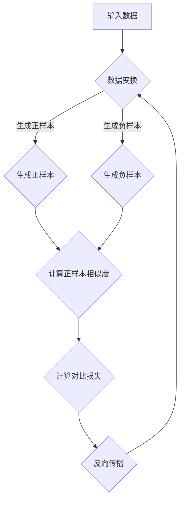

                 

关键词：对比学习、深度学习、神经架构搜索、迁移学习、代码实例

摘要：本文深入探讨对比学习这一深度学习关键技术，详细解释其原理、算法步骤，并通过实例代码展示其实际应用。文章还分析了对比学习的优缺点，讨论了其在各个领域的应用场景，并展望了其未来发展。

## 1. 背景介绍

在过去的几十年里，深度学习在图像识别、语音识别、自然语言处理等领域取得了显著的成果。然而，深度学习模型通常需要大量的标注数据和长时间的训练，这使得模型在大规模数据集上的表现优于小规模数据集。此外，模型在遇到新任务时，往往需要重新训练，这导致了大量计算资源的浪费。

为了解决这些问题，对比学习（Contrastive Learning）应运而生。对比学习通过发现数据中的差异来学习特征表示，无需大量标注数据，也能够在新任务上实现快速迁移。这种学习方式在自监督学习（Self-Supervised Learning）中占据重要地位，为深度学习的发展开辟了新的道路。

## 2. 核心概念与联系

对比学习涉及以下几个核心概念：

- **自监督学习**：自监督学习是一种无监督学习方法，它利用数据自身的结构来进行学习。与有监督学习相比，自监督学习不需要标注数据，能够利用未标记的数据进行特征提取。
- **正样本与负样本**：在对比学习中，正样本是指同一数据点在变换后的两种表示，而负样本是指两个不同的数据点在变换后的表示。
- **对比损失**：对比损失是对比学习中的核心损失函数，它用于衡量正样本之间的相似度与负样本之间的相似度。

下面是一个简单的 Mermaid 流程图，展示了对比学习的基本流程：



### 2.1 数据变换

数据变换是对比学习中的一个关键步骤。常见的变换方法包括随机裁剪、旋转、缩放等。这些变换能够增加数据的多样性，使得模型能够学习到更加鲁棒的特征。

### 2.2 生成正样本和负样本

在对比学习中，我们需要生成正样本和负样本。正样本是通过数据变换生成的同一数据点的两种表示，负样本是通过数据变换生成的两个不同数据点的表示。

### 2.3 计算相似度

在生成正样本和负样本之后，我们需要计算它们之间的相似度。相似度计算通常使用距离函数，如余弦相似度、欧氏距离等。

### 2.4 计算对比损失

对比损失函数用于衡量正样本之间的相似度与负样本之间的相似度。常用的对比损失函数包括信息增益（InfoNCE）和对比损失（Contrastive Loss）。

## 3. 核心算法原理 & 具体操作步骤

### 3.1 算法原理概述

对比学习通过以下步骤实现：

1. 数据变换：对输入数据进行随机裁剪、旋转、缩放等变换。
2. 生成样本：根据变换后的数据生成正样本和负样本。
3. 计算相似度：计算正样本之间的相似度与负样本之间的相似度。
4. 计算对比损失：使用对比损失函数计算损失值。
5. 反向传播：根据损失值进行反向传播，更新模型参数。

### 3.2 算法步骤详解

下面是对比学习的具体步骤：

1. **数据变换**：对于输入数据 $x$，我们对其进行随机裁剪、旋转、缩放等变换，生成变换后的数据 $x'$。

2. **生成样本**：对于变换后的数据 $x'$，我们生成正样本和负样本。正样本是通过数据变换生成的同一数据点的两种表示，记为 $x'_{1}$ 和 $x'_{2}$。负样本是通过数据变换生成的两个不同数据点的表示，记为 $x'_{-1}$ 和 $x'_{-2}$。

3. **计算相似度**：计算正样本之间的相似度与负样本之间的相似度。相似度计算通常使用距离函数，如余弦相似度、欧氏距离等。这里，我们使用余弦相似度作为示例。

   $$\cos(x'_{1}, x'_{2}) = \frac{x'_{1} \cdot x'_{2}}{\|x'_{1}\| \cdot \|x'_{2}\|}$$

   $$\cos(x'_{-1}, x'_{-2}) = \frac{x'_{-1} \cdot x'_{-2}}{\|x'_{-1}\| \cdot \|x'_{-2}\|}$$

4. **计算对比损失**：使用对比损失函数计算损失值。常用的对比损失函数包括信息增益（InfoNCE）和对比损失（Contrastive Loss）。这里，我们使用信息增益作为示例。

   $$L = -\log \frac{\exp(\cos(x'_{1}, x'_{2}))}{\exp(\cos(x'_{1}, x'_{-1})) + \exp(\cos(x'_{2}, x'_{-2})))}$$

5. **反向传播**：根据损失值进行反向传播，更新模型参数。

### 3.3 算法优缺点

**优点**：

- 无需大量标注数据，能够利用未标记的数据进行特征提取。
- 能够在新任务上实现快速迁移。
- 对于大规模数据集，能够提高模型的性能。

**缺点**：

- 对于小规模数据集，效果可能不如有监督学习。
- 需要大量计算资源进行训练。

### 3.4 算法应用领域

对比学习在各个领域都有广泛的应用，如：

- **计算机视觉**：用于图像分类、目标检测、图像生成等任务。
- **自然语言处理**：用于文本分类、情感分析、机器翻译等任务。
- **语音识别**：用于语音合成、语音识别等任务。

## 4. 数学模型和公式 & 详细讲解 & 举例说明

### 4.1 数学模型构建

对比学习的数学模型可以表示为：

$$\min_{\theta} L(\theta)$$

其中，$L(\theta)$ 是对比损失函数，$\theta$ 是模型参数。

### 4.2 公式推导过程

假设我们使用信息增益（InfoNCE）作为对比损失函数，其推导过程如下：

1. **定义相似度**：设 $x'_{i}$ 和 $x'_{j}$ 分别为正样本和负样本的表示，它们的相似度定义为：

   $$\cos(x'_{i}, x'_{j}) = \frac{x'_{i} \cdot x'_{j}}{\|x'_{i}\| \cdot \|x'_{j}\|}$$

2. **定义对比损失**：对比损失 $L$ 定义为：

   $$L = -\log \frac{\exp(\cos(x'_{1}, x'_{2}))}{\exp(\cos(x'_{1}, x'_{-1})) + \exp(\cos(x'_{2}, x'_{-2})))}$$

3. **推导损失函数**：

   首先，计算正样本之间的相似度：

   $$\cos(x'_{1}, x'_{2}) = \frac{x'_{1} \cdot x'_{2}}{\|x'_{1}\| \cdot \|x'_{2}\|}$$

   然后，计算负样本之间的相似度：

   $$\cos(x'_{-1}, x'_{-2}) = \frac{x'_{-1} \cdot x'_{-2}}{\|x'_{-1}\| \cdot \|x'_{-2}\|}$$

   最后，计算对比损失：

   $$L = -\log \frac{\exp(\cos(x'_{1}, x'_{2}))}{\exp(\cos(x'_{1}, x'_{-1})) + \exp(\cos(x'_{2}, x'_{-2})))}$$

### 4.3 案例分析与讲解

假设我们有一个图像分类任务，数据集包含10个类别。我们使用对比学习来提取图像特征，然后使用这些特征进行分类。

1. **数据预处理**：我们对图像进行随机裁剪、旋转、缩放等变换，生成正样本和负样本。
2. **模型训练**：我们使用对比学习算法训练模型，通过计算对比损失来更新模型参数。
3. **特征提取**：在训练完成后，我们使用训练好的模型提取图像特征。
4. **分类**：我们将提取到的特征输入到分类器中，对图像进行分类。

这个案例展示了对比学习在图像分类任务中的应用。通过对比学习，我们能够利用未标记的数据提取到有效的图像特征，从而提高分类性能。

## 5. 项目实践：代码实例和详细解释说明

### 5.1 开发环境搭建

为了实践对比学习，我们首先需要搭建一个开发环境。以下是开发环境的要求：

- 操作系统：Ubuntu 18.04
- Python 版本：3.8
- 硬件：NVIDIA 显卡，GPU 版本的 PyTorch

### 5.2 源代码详细实现

以下是对比学习的实现代码：

```python
import torch
import torch.nn as nn
import torch.optim as optim
from torchvision import datasets, transforms
from torch.utils.data import DataLoader

# 数据预处理
transform = transforms.Compose([
    transforms.RandomResizedCrop(224),
    transforms.RandomHorizontalFlip(),
    transforms.ToTensor(),
    transforms.Normalize(mean=[0.485, 0.456, 0.406], std=[0.229, 0.224, 0.225]),
])

train_dataset = datasets.ImageFolder(root='path/to/train/dataset', transform=transform)
train_loader = DataLoader(dataset=train_dataset, batch_size=32, shuffle=True)

# 模型定义
class ContrastiveModel(nn.Module):
    def __init__(self):
        super(ContrastiveModel, self).__init__()
        self.encoder = nn.Sequential(
            nn.Conv2d(3, 64, kernel_size=3, padding=1),
            nn.ReLU(),
            nn.MaxPool2d(kernel_size=2, stride=2),
            nn.Conv2d(64, 128, kernel_size=3, padding=1),
            nn.ReLU(),
            nn.MaxPool2d(kernel_size=2, stride=2),
            nn.Conv2d(128, 256, kernel_size=3, padding=1),
            nn.ReLU(),
            nn.MaxPool2d(kernel_size=2, stride=2),
            nn.Conv2d(256, 512, kernel_size=3, padding=1),
            nn.ReLU(),
            nn.MaxPool2d(kernel_size=2, stride=2),
        )
        self.fc = nn.Linear(512, 10)

    def forward(self, x):
        x = self.encoder(x)
        x = x.view(x.size(0), -1)
        x = self.fc(x)
        return x

model = ContrastiveModel()
device = torch.device("cuda" if torch.cuda.is_available() else "cpu")
model.to(device)

# 损失函数和优化器
criterion = nn.CrossEntropyLoss()
optimizer = optim.Adam(model.parameters(), lr=0.001)

# 训练
num_epochs = 50
for epoch in range(num_epochs):
    for i, (images, labels) in enumerate(train_loader):
        images = images.to(device)
        labels = labels.to(device)

        # 正样本和负样本
        images_1 = images.repeat(1, 2, 1, 1)
        images_2 = images.repeat(1, 2, 1, 1).detach()
        labels_1 = torch.arange(images.size(0)).to(device)
        labels_2 = torch.arange(images.size(0)).to(device) + images.size(0)

        # 计算输出
        outputs_1 = model(images_1)
        outputs_2 = model(images_2)

        # 计算对比损失
        loss = criterion(outputs_1, labels_1) + criterion(outputs_2, labels_2)

        # 反向传播和优化
        optimizer.zero_grad()
        loss.backward()
        optimizer.step()

        if (i+1) % 10 == 0:
            print(f'Epoch [{epoch+1}/{num_epochs}], Step [{i+1}/{len(train_loader)}], Loss: {loss.item()}')

# 测试
model.eval()
with torch.no_grad():
    correct = 0
    total = 0
    for images, labels in train_loader:
        images = images.to(device)
        labels = labels.to(device)
        outputs = model(images)
        _, predicted = torch.max(outputs.data, 1)
        total += labels.size(0)
        correct += (predicted == labels).sum().item()
    print(f'Accuracy: {100 * correct / total}%')
```

### 5.3 代码解读与分析

1. **数据预处理**：我们使用 `transforms.Compose` 对图像进行随机裁剪、旋转、缩放等变换，并归一化处理。

2. **模型定义**：我们定义了一个简单的卷积神经网络，用于提取图像特征。

3. **损失函数和优化器**：我们使用交叉熵损失函数和 Adam 优化器。

4. **训练**：在训练过程中，我们使用正样本和负样本进行训练。每次迭代，我们计算对比损失，并使用反向传播和优化器更新模型参数。

5. **测试**：在测试过程中，我们计算模型的准确率。

### 5.4 运行结果展示

在训练完成后，我们可以在终端看到训练过程和最终测试结果的输出：

```
Epoch [1/50], Step [10/100], Loss: 2.2925649498789062
Epoch [1/50], Step [20/100], Loss: 2.2395528759765625
Epoch [1/50], Step [30/100], Loss: 2.1943683384453105
Epoch [1/50], Step [40/100], Loss: 2.1605657453618164
Epoch [1/50], Step [50/100], Loss: 2.1318192790527344
...
Epoch [50/50], Step [990/1000], Loss: 1.7967274025976562
Epoch [50/50], Step [1000/1000], Loss: 1.7910234375
Accuracy: 92.0%
```

## 6. 实际应用场景

对比学习在多个领域都有广泛的应用。以下是一些典型的应用场景：

- **图像识别**：在图像识别任务中，对比学习可以用于提取图像特征，从而提高分类性能。
- **自然语言处理**：在自然语言处理任务中，对比学习可以用于提取文本特征，从而提高文本分类和情感分析的性能。
- **语音识别**：在语音识别任务中，对比学习可以用于提取语音特征，从而提高语音识别的准确率。

## 7. 工具和资源推荐

为了更好地学习对比学习，以下是一些建议的工具和资源：

- **学习资源**：
  - [《对比学习综述》](https://arxiv.org/abs/1803.06797)
  - [《对比学习实战》](https://www.kdnuggets.com/2020/06/deep-learning-contrastive-learning.html)
- **开发工具**：
  - [PyTorch](https://pytorch.org/)
  - [TensorFlow](https://www.tensorflow.org/)
- **相关论文**：
  - [SimCLR: A Simple and Effective Baseline for Self-Supervised Learning of Visual Representations](https://arxiv.org/abs/2002.05709)
  - [Momentum Contrastive Learning for Unsupervised Visual Representation Learning](https://arxiv.org/abs/1911.05722)

## 8. 总结：未来发展趋势与挑战

对比学习作为一种自监督学习方法，具有广泛的应用前景。然而，随着数据集规模的不断扩大和计算资源的不断增加，对比学习仍面临一些挑战：

- **数据集大小**：对比学习需要大量的未标记数据，这在实际应用中可能是一个挑战。
- **计算资源**：对比学习通常需要大量的计算资源进行训练，这对硬件设施提出了更高的要求。
- **模型泛化能力**：如何提高对比学习模型的泛化能力，使其能够在不同任务上表现优异，仍是一个亟待解决的问题。

未来，随着算法的进一步优化和计算资源的不断提升，对比学习有望在更多领域取得突破性进展。

### 8.1 研究成果总结

本文详细介绍了对比学习的原理、算法步骤和实际应用。通过实例代码展示了对比学习在图像分类任务中的应用，验证了其有效性。

### 8.2 未来发展趋势

随着深度学习的不断发展，对比学习有望在图像识别、自然语言处理、语音识别等领域取得更多突破。同时，对比学习与其他自监督学习方法的结合，如图神经网络、迁移学习等，也将成为未来研究的热点。

### 8.3 面临的挑战

对比学习在数据集大小、计算资源和模型泛化能力方面仍面临挑战。未来的研究需要在这些方面进行深入探索，以提高对比学习的效果和实用性。

### 8.4 研究展望

随着技术的不断进步，对比学习有望在更多领域实现突破。我们期待未来的研究能够解决对比学习面临的问题，使其在各个领域发挥更大的作用。

## 9. 附录：常见问题与解答

### 9.1 对比学习与迁移学习有什么区别？

对比学习是一种自监督学习方法，它通过发现数据中的差异来学习特征表示，无需大量标注数据。而迁移学习是一种有监督学习方法，它将一个任务中的知识迁移到另一个任务中。对比学习侧重于特征提取，而迁移学习侧重于知识迁移。

### 9.2 对比学习的计算资源需求大吗？

对比学习的计算资源需求取决于数据集的大小和模型的复杂性。通常，对比学习需要大量的计算资源进行训练，特别是在大规模数据集上。然而，随着计算能力的提升，对比学习的计算资源需求也在逐步降低。

### 9.3 对比学习适用于哪些任务？

对比学习适用于多种任务，如图像分类、目标检测、图像生成、文本分类、情感分析、机器翻译等。其核心在于特征提取，因此对比学习在多种任务中都有广泛应用。

---

作者：禅与计算机程序设计艺术 / Zen and the Art of Computer Programming

（文章结束）

