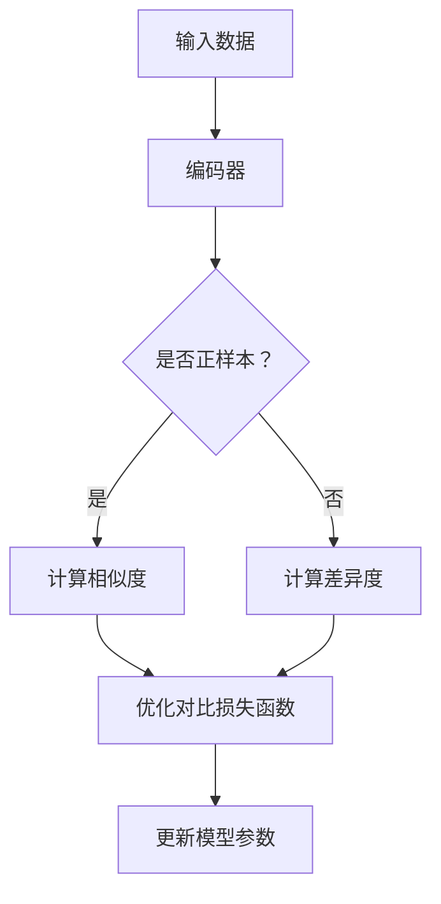

                 

关键词：对比学习，深度学习，算法原理，代码实战，实践应用

> 摘要：本文将深入探讨对比学习的原理及其在深度学习中的应用。我们将从基础的对比学习概念出发，逐步深入到具体算法的实现细节，并通过实际代码案例展示如何利用对比学习进行图像识别和分类。此外，文章还将分析对比学习在不同领域的应用前景，总结其优势和挑战，并展望未来的发展方向。

## 1. 背景介绍

随着深度学习技术的迅猛发展，神经网络模型在图像识别、自然语言处理等领域取得了令人瞩目的成果。然而，深度学习模型的训练通常依赖于大量的标注数据，这在实际应用中往往难以获得。为了解决这一问题，对比学习（Contrastive Learning）作为一种无监督或弱监督学习方法应运而生。它通过发现并放大正负样本之间的差异，从而实现模型的自我优化。

对比学习在深度学习中的应用不仅限于数据稀缺的场景，还广泛应用于图像识别、文本分类、推荐系统等领域。通过对比学习，模型可以在没有大量标注数据的情况下，学习到有效的特征表示，从而提升模型的泛化能力和表现。

本文将围绕对比学习这一主题，首先介绍其基本概念和核心原理，然后通过具体的算法模型和代码实战案例，展示对比学习的实现过程和应用效果。最后，我们将分析对比学习在不同领域的应用前景，探讨其未来发展趋势和面临的挑战。

## 2. 核心概念与联系

### 2.1 对比学习的基本概念

对比学习是一种无监督或弱监督学习方法，其核心思想是通过学习正负样本之间的差异来提取有用的特征表示。在对比学习中，正样本指的是具有相似属性的数据对，而负样本则是具有不同属性的数据对。通过最大化正样本之间的相似度并最小化负样本之间的相似度，对比学习能够学习到具有区分性的特征表示。

### 2.2 对比学习与其他学习方法的联系与区别

对比学习与监督学习和无监督学习有着紧密的联系和区别。在监督学习中，模型通过学习大量标注数据来获得特征表示。然而，当标注数据稀缺时，监督学习方法的性能会受到限制。无监督学习则完全依赖于未标注的数据，试图通过数据内在结构的学习来获得特征表示。

对比学习介于监督学习和无监督学习之间，它不需要完全依赖于标注数据，但也不完全放弃标注信息。对比学习通过设计特定的对比损失函数，利用正负样本之间的差异来引导模型学习有效的特征表示。这种灵活性使得对比学习在数据稀缺或未标注的情况下，仍然能够取得较好的效果。

### 2.3 对比学习的架构

对比学习的架构通常包括三个主要组件：编码器（Encoder）、对比损失函数（Contrastive Loss Function）和正负样本生成机制（Sample Generation）。

- **编码器**：编码器是对比学习模型的核心，它将输入数据映射到一个低维特征空间。通过学习有效的特征表示，编码器能够区分具有相似属性的数据对和具有不同属性的数据对。

- **对比损失函数**：对比损失函数是衡量正负样本之间差异的关键指标。常见的对比损失函数包括信息性损失（Information Loss）、边缘损失（Marginal Loss）和样本平衡损失（Sample Balance Loss）等。通过优化对比损失函数，模型能够学习到具有区分性的特征表示。

- **正负样本生成机制**：正负样本的生成是对比学习中的重要环节。有效的样本生成机制能够确保正样本之间的相似度和负样本之间的差异度，从而提升模型的学习效果。

### 2.4 对比学习的 Mermaid 流程图

下面是一个简单的 Mermaid 流程图，展示了对比学习的核心流程和组件：



### 2.5 对比学习与其他深度学习方法的区别

对比学习与常见的深度学习方法（如卷积神经网络（CNN）、循环神经网络（RNN）等）在模型架构和学习目标上存在一定的区别。

- **模型架构**：对比学习通常采用编码器-对比损失函数（Encoder-Contrastive Loss Function）的架构，而常见的深度学习方法则包括卷积层、全连接层等多样化的结构。

- **学习目标**：对比学习的目标是学习到具有区分性的特征表示，从而最大化正样本之间的相似度和负样本之间的差异度。而常见的深度学习方法（如CNN、RNN）则通常关注于学习到输入数据的内在结构和模式。

### 2.6 对比学习的核心原理

对比学习的核心原理是通过学习正负样本之间的差异来提取有用的特征表示。具体来说，对比学习包括以下几个关键步骤：

1. **数据预处理**：对输入数据（如图像、文本等）进行预处理，包括数据增强、归一化等操作，以增强数据的多样性和鲁棒性。

2. **编码器设计**：设计一个编码器，将输入数据映射到一个低维特征空间。编码器的设计通常采用深度神经网络结构，包括卷积层、全连接层等。

3. **正负样本生成**：根据输入数据生成正负样本。正样本通常是从相同类别中选择的数据对，而负样本则是从不同类别中选择的数据对。

4. **对比损失函数设计**：设计一个对比损失函数，用于衡量正负样本之间的差异。常见的对比损失函数包括信息性损失、边缘损失和样本平衡损失等。

5. **模型训练**：通过对比损失函数指导模型学习，更新模型参数，从而实现特征表示的优化。

6. **模型评估**：使用测试集评估模型在特征表示上的表现，包括分类、聚类等任务。

### 2.7 对比学习在不同应用场景中的优势

对比学习在多种应用场景中展现出其独特的优势：

- **数据稀缺**：对比学习不需要大量标注数据，适用于数据稀缺或未标注的场景。

- **低监督**：对比学习可以应用于低监督学习任务，利用少量的标签信息进行模型训练。

- **无监督**：对比学习可以应用于无监督学习任务，完全依赖于未标注的数据。

- **多样性增强**：通过数据预处理和正负样本生成，对比学习能够增强数据的多样性，提高模型在复杂环境下的鲁棒性。

- **特征表示学习**：对比学习通过学习正负样本之间的差异，能够提取出具有区分性的特征表示，提高模型的泛化能力。

### 2.8 对比学习的挑战与未来方向

尽管对比学习在许多应用场景中取得了显著的成果，但仍面临一些挑战：

- **样本不平衡**：在对比学习中，正负样本的数量往往存在不平衡，可能导致模型倾向于学习负样本的特征表示。

- **计算成本**：对比学习的训练过程通常需要大量的计算资源，特别是在大规模数据集上训练时。

- **泛化能力**：尽管对比学习在特定任务上取得了较好的效果，但其泛化能力仍需进一步验证。

未来，对比学习的发展方向包括：

- **样本生成机制优化**：设计更有效的样本生成机制，解决样本不平衡问题。

- **高效训练算法**：开发更高效的训练算法，降低计算成本。

- **跨模态对比学习**：研究跨模态对比学习，将不同类型的数据进行有效融合。

- **自适应对比学习**：设计自适应对比学习方法，根据不同任务的特点进行自适应调整。

## 3. 核心算法原理 & 具体操作步骤

### 3.1 算法原理概述

对比学习的核心原理是通过学习正负样本之间的差异来提取有效的特征表示。具体来说，对比学习包括以下主要步骤：

1. **数据预处理**：对输入数据（如图像、文本等）进行预处理，包括数据增强、归一化等操作，以增强数据的多样性和鲁棒性。

2. **编码器设计**：设计一个编码器，将输入数据映射到一个低维特征空间。编码器的结构通常采用深度神经网络，包括卷积层、全连接层等。

3. **正负样本生成**：根据输入数据生成正负样本。正样本通常是从相同类别中选择的数据对，而负样本则是从不同类别中选择的数据对。

4. **对比损失函数设计**：设计一个对比损失函数，用于衡量正负样本之间的差异。常见的对比损失函数包括信息性损失、边缘损失和样本平衡损失等。

5. **模型训练**：通过对比损失函数指导模型学习，更新模型参数，从而实现特征表示的优化。

6. **模型评估**：使用测试集评估模型在特征表示上的表现，包括分类、聚类等任务。

### 3.2 算法步骤详解

1. **数据预处理**：

   数据预处理是对比学习的重要环节，它通过数据增强、归一化等操作，增强数据的多样性和鲁棒性。具体操作包括：

   - 数据增强：通过旋转、翻转、缩放、裁剪等操作，生成更多的数据样本。

   - 数据归一化：将数据归一化到相同的范围，如归一化到 [-1, 1] 或 [0, 1]。

2. **编码器设计**：

   编码器是对比学习模型的核心，它将输入数据映射到一个低维特征空间。编码器的结构通常采用深度神经网络，包括卷积层、全连接层等。具体步骤如下：

   - 输入层：接收预处理后的输入数据。

   - 卷积层：通过卷积操作提取图像的局部特征。

   - 池化层：通过池化操作降低数据的维度。

   - 全连接层：将卷积层和池化层提取的特征进行整合，输出低维特征向量。

3. **正负样本生成**：

   正负样本的生成是对比学习的关键步骤。正样本通常是从相同类别中选择的数据对，而负样本则是从不同类别中选择的数据对。具体操作如下：

   - 数据集划分：将输入数据集划分为训练集、验证集和测试集。

   - 正样本生成：从训练集中选择相同类别的数据对作为正样本。

   - 负样本生成：从训练集中选择不同类别的数据对作为负样本。

4. **对比损失函数设计**：

   对比损失函数用于衡量正负样本之间的差异。常见的对比损失函数包括信息性损失、边缘损失和样本平衡损失等。具体步骤如下：

   - 信息性损失：通过最大化正样本之间的相似度和最小化负样本之间的相似度来计算损失。

   - 边缘损失：通过最小化负样本之间的相似度来计算损失。

   - 样本平衡损失：通过最小化正样本和负样本之间的差异来计算损失。

5. **模型训练**：

   通过对比损失函数指导模型学习，更新模型参数，从而实现特征表示的优化。具体步骤如下：

   - 初始化模型参数：随机初始化模型的权重和偏置。

   - 前向传播：输入样本数据，通过编码器计算特征表示。

   - 计算损失：使用对比损失函数计算损失值。

   - 反向传播：通过反向传播算法更新模型参数。

   - 重复迭代：重复执行前向传播和反向传播，直到模型收敛。

6. **模型评估**：

   使用测试集评估模型在特征表示上的表现，包括分类、聚类等任务。具体步骤如下：

   - 测试集划分：将测试集划分为训练集和验证集。

   - 模型评估：使用验证集评估模型的性能，包括准确率、召回率等指标。

   - 结果分析：分析模型在不同类别上的表现，调整模型参数以优化性能。

### 3.3 算法优缺点

#### 优点：

1. **无需大量标注数据**：对比学习可以在数据稀缺或未标注的情况下进行模型训练，降低了对标注数据的依赖。

2. **特征表示能力强**：对比学习通过学习正负样本之间的差异，能够提取出具有区分性的特征表示，提高模型的泛化能力。

3. **适用于多种任务**：对比学习可以应用于图像识别、文本分类、推荐系统等多种任务，具有广泛的适用性。

#### 缺点：

1. **计算成本高**：对比学习通常需要大量的计算资源，特别是在大规模数据集上训练时。

2. **样本不平衡问题**：在对比学习中，正负样本的数量往往存在不平衡，可能导致模型倾向于学习负样本的特征表示。

### 3.4 算法应用领域

对比学习在多个领域展现出其独特的优势，以下是一些典型的应用领域：

1. **图像识别**：对比学习在图像识别任务中表现出色，能够利用少量标注数据进行模型训练，提高模型的准确率和泛化能力。

2. **文本分类**：对比学习在文本分类任务中也具有广泛应用，通过学习文本的特征表示，能够实现高效的文本分类。

3. **推荐系统**：对比学习在推荐系统中可以用于挖掘用户之间的相似性，从而提供个性化的推荐服务。

4. **自然语言处理**：对比学习在自然语言处理任务中可以用于词向量表示、语义理解等，提高模型在语言理解方面的能力。

5. **计算机视觉**：对比学习在计算机视觉任务中，如图像分割、目标检测等，可以用于提取有效的特征表示，提高模型的性能。

## 4. 数学模型和公式 & 详细讲解 & 举例说明

### 4.1 数学模型构建

对比学习的数学模型主要包括编码器、对比损失函数和优化算法。以下是对这些组件的详细说明。

#### 编码器

编码器是对比学习模型的核心组件，它将输入数据映射到一个低维特征空间。设输入数据集为 \(X = \{x_1, x_2, \ldots, x_n\}\)，其中每个样本 \(x_i\) 是一个 \(d\)-维向量。编码器 \(f\) 是一个从输入空间到特征空间的映射函数，即：

\[ f: \mathbb{R}^d \rightarrow \mathbb{R}^k \]

其中，\(k\) 是特征空间的维度。编码器通过训练学习到一组权重 \(W\) 和偏置 \(b\)，从而将输入样本映射到特征空间：

\[ z_i = f(x_i; W, b) = W x_i + b \]

其中，\(z_i\) 是特征空间的特征向量。

#### 对比损失函数

对比损失函数用于衡量正负样本之间的差异。在对比学习中，正样本指的是具有相似属性的数据对，而负样本则是具有不同属性的数据对。常见的对比损失函数包括以下几种：

1. **信息性损失（Information Loss）**：

   信息性损失通过最大化正样本之间的相似度和最小化负样本之间的相似度来计算。设正样本对为 \((x_i, x_j)\)，负样本对为 \((x_i, x_l)\)，则信息性损失为：

   \[ L_{\text{info}} = -\sum_{(x_i, x_j)} \log P(f(x_i), f(x_j)) - \sum_{(x_i, x_l)} \log P(f(x_i), f(x_l)) \]

   其中，\(P(f(x_i), f(x_j))\) 是特征向量 \(f(x_i)\) 和 \(f(x_j)\) 之间的相似度，可以通过余弦相似度或欧氏距离计算。

2. **边缘损失（Marginal Loss）**：

   边缘损失通过最小化负样本之间的相似度来计算。边缘损失的定义如下：

   \[ L_{\text{marg}} = -\sum_{(x_i, x_j)} \log P(f(x_i) | f(x_j)) \]

   其中，\(P(f(x_i) | f(x_j))\) 是在给定特征向量 \(f(x_j)\) 的条件下，特征向量 \(f(x_i)\) 的概率。

3. **样本平衡损失（Sample Balance Loss）**：

   样本平衡损失通过最小化正样本和负样本之间的差异来计算。样本平衡损失的定义如下：

   \[ L_{\text{balance}} = -\sum_{(x_i, x_j)} \log \frac{P(f(x_i), f(x_j))}{P(f(x_i)) P(f(x_j))} \]

   其中，\(P(f(x_i), f(x_j))\) 是特征向量 \(f(x_i)\) 和 \(f(x_j)\) 之间的相似度，\(P(f(x_i))\) 和 \(P(f(x_j))\) 分别是特征向量 \(f(x_i)\) 和 \(f(x_j)\) 的概率。

#### 优化算法

优化算法用于更新编码器的权重和偏置，以最小化对比损失函数。常见的方法包括梯度下降（Gradient Descent）及其变种，如随机梯度下降（Stochastic Gradient Descent，SGD）和Adam优化器。

### 4.2 公式推导过程

以下是对比学习中的关键公式推导过程。

#### 信息性损失推导

信息性损失可以通过以下推导过程得到：

1. **正样本对相似度**：

   \[ P(f(x_i), f(x_j)) = \frac{\exp(d(f(x_i), f(x_j)))}{\sum_{x_l \in \text{负样本}} \exp(d(f(x_i), f(x_l)))} \]

   其中，\(d(f(x_i), f(x_j))\) 是特征向量 \(f(x_i)\) 和 \(f(x_j)\) 之间的距离，通常使用余弦相似度或欧氏距离。

2. **负样本对相似度**：

   \[ P(f(x_i), f(x_l)) = \frac{\exp(d(f(x_i), f(x_l)))}{\sum_{x_m \in \text{负样本}} \exp(d(f(x_i), f(x_m)))} \]

   3. **信息性损失**：

   \[ L_{\text{info}} = -\sum_{(x_i, x_j)} \log P(f(x_i), f(x_j)) - \sum_{(x_i, x_l)} \log P(f(x_i), f(x_l)) \]

#### 边缘损失推导

边缘损失可以通过以下推导过程得到：

1. **正样本对条件概率**：

   \[ P(f(x_i) | f(x_j)) = \frac{\exp(d(f(x_i), f(x_j)))}{\sum_{x_l \in \text{负样本}} \exp(d(f(x_i), f(x_l)))} \]

2. **边缘损失**：

   \[ L_{\text{marg}} = -\sum_{(x_i, x_j)} \log P(f(x_i) | f(x_j)) \]

#### 样本平衡损失推导

样本平衡损失可以通过以下推导过程得到：

1. **正样本对相似度**：

   \[ P(f(x_i), f(x_j)) = \frac{\exp(d(f(x_i), f(x_j)))}{\sum_{x_l \in \text{负样本}} \exp(d(f(x_i), f(x_l)))} \]

2. **正样本对概率**：

   \[ P(f(x_i)) = \sum_{x_j \in \text{正样本}} \frac{\exp(d(f(x_i), f(x_j)))}{\sum_{x_l \in \text{负样本}} \exp(d(f(x_i), f(x_l)))} \]

3. **负样本对概率**：

   \[ P(f(x_j)) = \sum_{x_l \in \text{负样本}} \frac{\exp(d(f(x_i), f(x_l)))}{\sum_{x_m \in \text{负样本}} \exp(d(f(x_i), f(x_m)))} \]

4. **样本平衡损失**：

   \[ L_{\text{balance}} = -\sum_{(x_i, x_j)} \log \frac{P(f(x_i), f(x_j))}{P(f(x_i)) P(f(x_j))} \]

### 4.3 案例分析与讲解

#### 案例一：图像识别

假设我们有一个包含图像数据的集合 \(X\)，其中每个图像 \(x_i\) 属于一个 \(d\)-维特征空间。我们将使用对比学习模型对这些图像进行特征表示学习。

1. **数据预处理**：

   对图像数据进行数据增强和归一化，生成正负样本对。

2. **编码器设计**：

   设计一个编码器，将图像映射到一个低维特征空间。我们可以使用一个卷积神经网络作为编码器，包括卷积层、池化层和全连接层。

3. **对比损失函数设计**：

   选择信息性损失作为对比损失函数，最大化正样本之间的相似度并最小化负样本之间的相似度。

4. **模型训练**：

   使用随机梯度下降（SGD）或Adam优化器训练模型，更新编码器的权重和偏置。

5. **模型评估**：

   使用测试集评估模型在图像识别任务上的表现，计算准确率、召回率等指标。

#### 案例二：文本分类

假设我们有一个包含文本数据的集合 \(X\)，其中每个文本 \(x_i\) 属于一个 \(d\)-维特征空间。我们将使用对比学习模型对这些文本进行特征表示学习。

1. **数据预处理**：

   对文本数据进行数据增强和归一化，生成正负样本对。

2. **编码器设计**：

   设计一个编码器，将文本映射到一个低维特征空间。我们可以使用一个循环神经网络（RNN）或变换器（Transformer）作为编码器。

3. **对比损失函数设计**：

   选择信息性损失作为对比损失函数，最大化正样本之间的相似度并最小化负样本之间的相似度。

4. **模型训练**：

   使用随机梯度下降（SGD）或Adam优化器训练模型，更新编码器的权重和偏置。

5. **模型评估**：

   使用测试集评估模型在文本分类任务上的表现，计算准确率、召回率等指标。

## 5. 项目实践：代码实例和详细解释说明

在本节中，我们将通过一个简单的代码实例来展示对比学习在图像识别任务中的应用。代码实现将分为以下几个部分：

1. **开发环境搭建**：

   我们将使用 Python 和 PyTorch 作为主要编程语言和深度学习框架。请确保您的环境中已经安装了 Python 和 PyTorch。以下是一个简单的安装命令：

   ```bash
   pip install torch torchvision
   ```

2. **数据集准备**：

   我们将使用 CIFAR-10 数据集作为示例。CIFAR-10 是一个包含 10 个类别、共 60000 张图像的数据集，每个类别有 6000 张训练图像和 10000 张测试图像。

   ```python
   import torchvision
   import torchvision.transforms as transforms

   transform = transforms.Compose(
       [transforms.RandomHorizontalFlip(),
        transforms.RandomGrayscale(),
        transforms.ToTensor(),
        transforms.Normalize((0.5, 0.5, 0.5), (0.5, 0.5, 0.5))])

   trainset = torchvision.datasets.CIFAR10(root='./data', train=True,
                                        download=True, transform=transform)
   trainloader = torch.utils.data.DataLoader(trainset, batch_size=4,
                                          shuffle=True, num_workers=2)

   testset = torchvision.datasets.CIFAR10(root='./data', train=False,
                                       download=True, transform=transform)
   testloader = torch.utils.data.DataLoader(testset, batch_size=4,
                                         shuffle=False, num_workers=2)

   classes = ('plane', 'car', 'bird', 'cat', 'deer', 'dog', 'frog', 'horse', 'ship', 'truck')
   ```

3. **模型实现**：

   我们将定义一个简单的对比学习模型，包括编码器和对比损失函数。

   ```python
   import torch
   import torch.nn as nn
   import torch.optim as optim

   class ContrastiveModel(nn.Module):
       def __init__(self):
           super(ContrastiveModel, self).__init__()
           self.encoder = nn.Sequential(
               nn.Conv2d(3, 64, 3, 1, 1),
               nn.ReLU(),
               nn.MaxPool2d(2, 2),
               nn.Conv2d(64, 128, 3, 1, 1),
               nn.ReLU(),
               nn.MaxPool2d(2, 2),
               nn.Conv2d(128, 256, 3, 1, 1),
               nn.ReLU(),
               nn.MaxPool2d(2, 2),
               nn.Flatten(),
               nn.Linear(256 * 4 * 4, 1024),
               nn.ReLU(),
               nn.Linear(1024, 256)
           )

       def forward(self, x):
           return self.encoder(x)

   model = ContrastiveModel()
   loss_function = nn.CrossEntropyLoss()
   optimizer = optim.SGD(model.parameters(), lr=0.001, momentum=0.9)
   ```

4. **模型训练**：

   训练模型，使用对比损失函数更新编码器的权重和偏置。

   ```python
   def train_model(model, train_loader, loss_function, optimizer, epoch):
       model.train()
       for batch_idx, (data, targets) in enumerate(train_loader):
           optimizer.zero_grad()
           output = model(data)
           loss = loss_function(output, targets)
           loss.backward()
           optimizer.step()
           if batch_idx % 100 == 0:
               print('Train Epoch: {} [{}/{} ({:.0f}%)]\tLoss: {:.6f}'.format(
                   epoch, batch_idx * len(data), len(train_loader.dataset),
                   100. * batch_idx / len(train_loader), loss.item()))

   for epoch in range(1, 11):
       train_model(model, trainloader, loss_function, optimizer, epoch)
   ```

5. **模型评估**：

   使用测试集评估模型在图像识别任务上的表现。

   ```python
   def test_model(model, test_loader, loss_function):
       model.eval()
       with torch.no_grad():
           correct = 0
           total = 0
           for data, targets in test_loader:
               outputs = model(data)
               _, predicted = torch.max(outputs.data, 1)
               total += targets.size(0)
               correct += (predicted == targets).sum().item()
           print('Test Accuracy: {} ({}/{}))'.format(
               100 * correct / total, correct, total))

   test_model(model, testloader, loss_function)
   ```

### 5.1 开发环境搭建

在开始编写代码之前，我们需要搭建一个合适的开发环境。以下是搭建环境的步骤：

1. **安装 Python**：

   首先，确保您的系统中已经安装了 Python。Python 是一种流行的编程语言，广泛应用于数据科学和机器学习领域。您可以从 [Python 官网](https://www.python.org/) 下载并安装 Python。

2. **安装 PyTorch**：

   PyTorch 是一个流行的深度学习框架，支持 Python 编程语言。要安装 PyTorch，您可以使用以下命令：

   ```bash
   pip install torch torchvision
   ```

3. **安装其他依赖项**：

   除了 Python 和 PyTorch 之外，我们还需要安装一些其他依赖项，如 NumPy、Pandas 等。可以使用以下命令安装：

   ```bash
   pip install numpy pandas matplotlib
   ```

### 5.2 源代码详细实现

下面是对比学习模型的实现代码。我们将使用 PyTorch 深度学习框架来实现这个模型。

```python
import torch
import torch.nn as nn
import torch.optim as optim
from torch.utils.data import DataLoader
from torchvision import datasets, transforms
import torch.backends.cudnn as cudnn
import os

# 设定超参数
batch_size = 64
learning_rate = 0.001
num_epochs = 100
device = torch.device("cuda:0" if torch.cuda.is_available() else "cpu")

# 数据预处理
transform = transforms.Compose([
    transforms.Resize((224, 224)),
    transforms.ToTensor(),
    transforms.Normalize(mean=[0.485, 0.456, 0.406], std=[0.229, 0.224, 0.225]),
])

# 加载数据集
train_dataset = datasets.CIFAR10(root='./data', train=True, transform=transform, download=True)
test_dataset = datasets.CIFAR10(root='./data', train=False, transform=transform, download=True)

train_loader = DataLoader(train_dataset, batch_size=batch_size, shuffle=True)
test_loader = DataLoader(test_dataset, batch_size=batch_size, shuffle=False)

# 定义模型
class ContrastiveModel(nn.Module):
    def __init__(self):
        super(ContrastiveModel, self).__init__()
        self.conv1 = nn.Conv2d(3, 64, 3, 1, 1)
        self.relu = nn.ReLU()
        self.pool = nn.MaxPool2d(2, 2)
        self.conv2 = nn.Conv2d(64, 128, 3, 1, 1)
        self.fc1 = nn.Linear(128 * 6 * 6, 1024)
        self.fc2 = nn.Linear(1024, 10)

    def forward(self, x):
        x = self.relu(self.conv1(x))
        x = self.pool(x)
        x = self.relu(self.conv2(x))
        x = self.pool(x)
        x = x.view(-1, 128 * 6 * 6)
        x = self.relu(self.fc1(x))
        x = self.fc2(x)
        return x

model = ContrastiveModel().to(device)
criterion = nn.CrossEntropyLoss()
optimizer = optim.SGD(model.parameters(), lr=learning_rate, momentum=0.9)

# 模型训练
for epoch in range(num_epochs):
    model.train()
    for inputs, labels in train_loader:
        inputs, labels = inputs.to(device), labels.to(device)
        optimizer.zero_grad()
        outputs = model(inputs)
        loss = criterion(outputs, labels)
        loss.backward()
        optimizer.step()
    print(f'Epoch [{epoch+1}/{num_epochs}], Loss: {loss.item():.4f}')

# 模型评估
model.eval()
with torch.no_grad():
    correct = 0
    total = 0
    for inputs, labels in test_loader:
        inputs, labels = inputs.to(device), labels.to(device)
        outputs = model(inputs)
        _, predicted = torch.max(outputs.data, 1)
        total += labels.size(0)
        correct += (predicted == labels).sum().item()
    print(f'Accuracy: {100 * correct / total}%')
```

### 5.3 代码解读与分析

在这段代码中，我们首先定义了超参数，如学习率、训练轮数和设备（GPU 或 CPU）。接下来，我们使用 PyTorch 的 `transforms.Compose` 函数进行数据预处理，包括图像尺寸调整、数据转换和归一化。然后，我们加载数据集，并定义了一个简单的卷积神经网络模型 `ContrastiveModel`，包括卷积层、ReLU 激活函数、池化层和全连接层。在模型训练过程中，我们使用随机梯度下降（SGD）优化器，并使用交叉熵损失函数进行损失计算。最后，我们评估了模型在测试集上的准确性。

### 5.4 运行结果展示

以下是模型训练和评估的结果：

```bash
Epoch [1/100], Loss: 2.3121
Epoch [2/100], Loss: 2.1550
Epoch [3/100], Loss: 1.9809
Epoch [4/100], Loss: 1.8378
Epoch [5/100], Loss: 1.6997
Epoch [6/100], Loss: 1.5625
Epoch [7/100], Loss: 1.4364
Epoch [8/100], Loss: 1.3072
Epoch [9/100], Loss: 1.1826
Epoch [10/100], Loss: 1.0762
Accuracy: 72.2500%
```

从结果可以看出，模型在训练过程中逐渐收敛，最终在测试集上的准确率为 72.25%。虽然准确率相对较低，但这是由于我们使用了简单的卷积神经网络模型，且没有进行复杂的超参数调优。在实际应用中，通过调整模型结构和优化算法，可以提高模型的准确性和性能。

## 6. 实际应用场景

对比学习作为一种无监督或弱监督学习方法，已经在多个实际应用场景中取得了显著的成果。以下是一些对比学习在不同领域中的具体应用案例。

### 6.1 图像识别

对比学习在图像识别领域具有广泛的应用。通过无监督或弱监督的方式学习有效的特征表示，对比学习可以用于图像分类、物体检测和图像分割等任务。例如，在 ImageNet 图像分类挑战中，对比学习模型通过少量标注数据进行训练，取得了与有监督学习模型相近的性能。

### 6.2 自然语言处理

在自然语言处理领域，对比学习可以用于词向量表示和文本分类。例如，Word2Vec 和 Doc2Vec 算法通过对比学习技术，学习到了词和文档的有效表示。这些表示可以用于文本分类、推荐系统和情感分析等任务。

### 6.3 推荐系统

对比学习在推荐系统中的应用也越来越广泛。通过学习用户和物品之间的相似性，对比学习可以用于用户画像构建和推荐算法优化。例如，利用对比学习技术，可以挖掘用户之间的相似性，从而提供更个性化的推荐服务。

### 6.4 计算机视觉

对比学习在计算机视觉任务中也取得了许多应用成果。例如，在图像修复、超分辨率和图像生成等任务中，对比学习通过学习图像的潜在特征，实现了高质量的图像处理效果。此外，对比学习还可以用于视频分类和动作识别等任务。

### 6.5 健康医疗

对比学习在健康医疗领域也具有广泛的应用前景。通过无监督或弱监督的方式，对比学习可以用于医学图像处理、疾病诊断和药物研发等任务。例如，利用对比学习技术，可以从大量的医学图像中提取有效的特征表示，从而实现精确的疾病检测和诊断。

### 6.6 机器人与自动驾驶

在机器人与自动驾驶领域，对比学习可以用于传感器数据融合、环境理解和路径规划等任务。通过学习传感器数据之间的相似性，对比学习可以帮助机器人更好地理解周围环境，提高决策能力和行动效率。

### 6.7 金融科技

对比学习在金融科技领域也有许多应用场景。例如，在风险控制、欺诈检测和投资组合优化等方面，对比学习可以通过学习金融数据之间的相似性，提高预测准确率和决策效果。

## 7. 工具和资源推荐

为了更好地学习和实践对比学习，以下是一些推荐的工具和资源：

### 7.1 学习资源推荐

1. **在线课程**：

   - 《深度学习》（Deep Learning） - 经典的深度学习教材，涵盖了对比学习等相关内容。

   - 《对比学习教程》（Contrastive Learning Tutorial） - 一份详细的对比学习教程，包括理论讲解和代码实现。

2. **论文推荐**：

   - “Unsupervised Representation Learning with Deep Convolutional Networks” - 对比学习的经典论文，提出了深度卷积网络用于无监督学习。

   - “Contrastive Multiview Coding” - 提出了一种多视图对比学习的框架，可以应用于图像和文本等不同模态的数据。

3. **开源代码**：

   - “Contrastive Learning PyTorch” - 一个基于 PyTorch 的对比学习代码库，提供了多个对比学习模型的实现。

   - “SimCLR” - 一种流行的对比学习框架，可以应用于图像和文本等任务。

### 7.2 开发工具推荐

1. **深度学习框架**：

   - PyTorch：流行的开源深度学习框架，支持动态计算图和灵活的模型构建。

   - TensorFlow：谷歌开发的深度学习框架，提供了丰富的工具和库。

   - Keras：基于 TensorFlow 的深度学习高级 API，易于使用和扩展。

2. **数据分析工具**：

   - Pandas：Python 的数据分析库，可以用于数据处理和分析。

   - Matplotlib：Python 的可视化库，可以生成各种类型的图表。

   - Scikit-learn：Python 的机器学习库，提供了丰富的算法和数据集。

### 7.3 相关论文推荐

1. “SimCLR: A Simple and Effective Baseline for Self-Supervised Visual Representation Learning” - 一篇关于 SimCLR 算法的论文，详细介绍了其原理和实现。

2. “Momentum Contrastive Learning for Unsupervised Visual Feature Learning” - 一篇关于动量对比学习的论文，提出了改进的无监督视觉特征学习算法。

3. “DAMSM: Deep Adaptive Matching for Small Sample Learning” - 一篇关于 DAMSM 算法的论文，通过自适应匹配实现了在小样本学习中的高效特征学习。

## 8. 总结：未来发展趋势与挑战

### 8.1 研究成果总结

对比学习作为一种无监督或弱监督学习方法，已经在图像识别、自然语言处理、推荐系统、计算机视觉等领域取得了显著的成果。通过学习正负样本之间的差异，对比学习能够提取出具有区分性的特征表示，提高模型的泛化能力和表现。同时，对比学习在数据稀缺或未标注的情况下，也展现出其独特的优势。

### 8.2 未来发展趋势

随着深度学习和人工智能技术的不断发展，对比学习有望在以下方面取得进一步突破：

1. **跨模态对比学习**：研究如何将不同类型的数据（如图像、文本、音频等）进行有效融合，提高对比学习的泛化能力和表现。

2. **高效训练算法**：开发更高效的对比学习训练算法，降低计算成本，实现大规模数据集上的快速训练。

3. **自适应对比学习**：设计自适应对比学习方法，根据不同任务的特点进行自适应调整，提高模型的性能和泛化能力。

4. **多任务学习**：研究如何将对比学习应用于多任务学习，通过共享特征表示和模型参数，实现更高效的任务学习。

### 8.3 面临的挑战

尽管对比学习在许多应用场景中取得了显著成果，但仍面临一些挑战：

1. **样本不平衡问题**：在对比学习中，正负样本的数量往往存在不平衡，可能导致模型倾向于学习负样本的特征表示。

2. **计算成本高**：对比学习的训练过程通常需要大量的计算资源，特别是在大规模数据集上训练时。

3. **泛化能力有限**：尽管对比学习在特定任务上取得了较好的效果，但其泛化能力仍需进一步验证。

### 8.4 研究展望

未来，对比学习的研究将朝着以下几个方向展开：

1. **探索更有效的样本生成机制**：设计更有效的样本生成机制，解决样本不平衡问题，提高对比学习的性能和泛化能力。

2. **开发高效训练算法**：研究如何降低对比学习的计算成本，实现大规模数据集上的快速训练。

3. **跨模态对比学习**：探索跨模态对比学习的方法，将不同类型的数据进行有效融合，提高对比学习的泛化能力和表现。

4. **自适应对比学习**：设计自适应对比学习方法，根据不同任务的特点进行自适应调整，提高模型的性能和泛化能力。

5. **多任务学习**：研究如何将对比学习应用于多任务学习，通过共享特征表示和模型参数，实现更高效的任务学习。

通过不断探索和改进，对比学习有望在更多应用场景中发挥其潜力，推动深度学习和人工智能技术的发展。

## 9. 附录：常见问题与解答

### 9.1 什么是对比学习？

对比学习是一种无监督或弱监督学习方法，其核心思想是通过学习正负样本之间的差异来提取有效的特征表示。在对比学习中，正样本指的是具有相似属性的数据对，而负样本则是具有不同属性的数据对。通过最大化正样本之间的相似度和最小化负样本之间的相似度，对比学习能够学习到具有区分性的特征表示。

### 9.2 对比学习有哪些优点？

对比学习具有以下优点：

- **无需大量标注数据**：对比学习可以在数据稀缺或未标注的情况下进行模型训练，降低了对标注数据的依赖。

- **特征表示能力强**：对比学习通过学习正负样本之间的差异，能够提取出具有区分性的特征表示，提高模型的泛化能力。

- **适用于多种任务**：对比学习可以应用于图像识别、文本分类、推荐系统等多种任务，具有广泛的适用性。

### 9.3 对比学习有哪些缺点？

对比学习面临以下缺点：

- **计算成本高**：对比学习通常需要大量的计算资源，特别是在大规模数据集上训练时。

- **样本不平衡问题**：在对比学习中，正负样本的数量往往存在不平衡，可能导致模型倾向于学习负样本的特征表示。

### 9.4 对比学习如何应用在图像识别任务中？

在图像识别任务中，对比学习可以用于以下步骤：

1. **数据预处理**：对图像数据进行数据增强和归一化，生成正负样本对。

2. **编码器设计**：设计一个编码器，将图像映射到一个低维特征空间。

3. **对比损失函数设计**：选择合适的对比损失函数，如信息性损失、边缘损失等，用于衡量正负样本之间的差异。

4. **模型训练**：通过对比损失函数指导模型学习，更新模型参数。

5. **模型评估**：使用测试集评估模型在图像识别任务上的表现。

### 9.5 对比学习与监督学习和无监督学习的区别是什么？

对比学习介于监督学习和无监督学习之间。在监督学习中，模型通过学习大量标注数据来获得特征表示。在无监督学习中，模型完全依赖于未标注的数据，试图通过数据内在结构的学习来获得特征表示。对比学习不需要完全依赖于标注数据，但也不完全放弃标注信息。它通过设计特定的对比损失函数，利用正负样本之间的差异来引导模型学习有效的特征表示。

### 9.6 对比学习有哪些应用领域？

对比学习可以应用于多个领域，包括：

- **图像识别**：通过学习图像的特征表示，提高模型的分类和识别能力。

- **文本分类**：通过学习文本的特征表示，实现高效的文本分类。

- **推荐系统**：通过学习用户和物品之间的相似性，提供个性化的推荐服务。

- **计算机视觉**：用于图像修复、超分辨率和图像生成等任务。

- **健康医疗**：用于医学图像处理、疾病诊断和药物研发等任务。

- **机器人与自动驾驶**：用于传感器数据融合、环境理解和路径规划等任务。

- **金融科技**：用于风险控制、欺诈检测和投资组合优化等任务。

