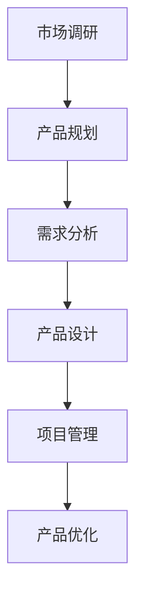

                 

关键词：小米、2024校招、产品经理、面试题、解析、招聘策略、案例分析、职场技能、发展路径

> 摘要：本文将深入解析小米2024校招产品经理岗位的面试题，通过对题目内容的剖析，帮助考生了解产品经理岗位所需的关键能力，为求职者提供实用的面试策略和准备建议。

## 1. 背景介绍

小米是一家全球知名的电子产品公司，以其高品质的智能手机、智能家居产品以及互联网服务而闻名。随着公司不断扩张，小米每年都会通过校园招聘吸纳新鲜血液，特别是产品经理岗位，因为这是小米创新和发展的重要推动力。本文将围绕小米2024校招产品经理岗位的面试题目，详细解析各题的考点和应对策略，以帮助考生在面试中取得优异成绩。

### 小米的产品经理岗位职责

在小米，产品经理负责从用户需求出发，定义产品策略，规划产品路线图，管理产品开发过程，确保产品的高质量交付。具体职责包括：

- **市场调研**：分析市场趋势，了解用户需求，为产品创新提供依据。
- **产品规划**：制定产品战略，规划产品功能和服务，确保产品的市场竞争力。
- **用户体验**：关注用户体验，设计产品界面和交互，提升用户满意度。
- **项目管理**：协调跨部门资源，确保产品按计划开发和上线。
- **数据分析**：通过数据分析优化产品功能和性能，提高用户转化率和留存率。

### 小米2024校招产品经理岗位特点

- **技术创新**：小米注重技术创新，产品经理需要具备前瞻性思维和快速响应市场变化的能力。
- **跨部门合作**：产品经理需要与设计、研发、运营等多个部门紧密合作，具备良好的沟通能力和团队合作精神。
- **市场驱动**：小米的产品开发以市场需求为导向，产品经理需要具备敏锐的市场洞察力和用户理解力。
- **快速迭代**：小米的产品开发周期较短，产品经理需要能够快速适应变化，持续优化产品。

## 2. 核心概念与联系

### 产品管理流程

产品管理流程通常包括以下步骤：

1. **市场调研**：了解市场趋势和用户需求，为产品创新提供数据支持。
2. **产品规划**：确定产品方向、功能和策略，制定产品路线图。
3. **需求分析**：收集和分析用户需求，制定功能需求文档。
4. **产品设计**：设计产品原型和用户界面，确保用户体验。
5. **项目管理**：协调资源，管理开发进度，确保产品按计划上线。
6. **产品优化**：通过数据分析优化产品功能，提高用户满意度。

### 产品经理能力要求

- **市场洞察力**：能够准确把握市场趋势和用户需求，为产品创新提供方向。
- **数据分析能力**：通过数据分析优化产品功能和性能，提高用户转化率和留存率。
- **沟通协调能力**：能够与设计、研发、运营等跨部门团队有效沟通，确保产品顺利推进。
- **项目管理能力**：具备项目管理知识，能够协调资源，确保产品按计划开发。
- **用户思维**：关注用户体验，能够从用户角度出发，设计产品功能和界面。

### Mermaid 流程图



## 3. 核心算法原理 & 具体操作步骤

### 3.1 算法原理概述

产品经理的算法原理主要涉及数据分析、用户行为分析和需求预测等方面。以下为关键算法：

- **数据分析算法**：常用的数据分析算法包括回归分析、聚类分析和关联规则分析等。这些算法可以帮助产品经理理解用户行为、市场需求和产品性能等关键指标。
- **用户行为分析算法**：用户行为分析算法如机器学习分类算法和序列模式挖掘算法，可以帮助产品经理预测用户偏好和行为模式，优化产品功能和界面设计。
- **需求预测算法**：需求预测算法如时间序列分析和基于历史数据的预测模型，可以帮助产品经理提前预判市场趋势和用户需求，为产品规划提供数据支持。

### 3.2 算法步骤详解

1. **数据分析算法步骤**：

   - **数据收集**：收集用户行为数据、产品性能数据和市场需求数据等。
   - **数据预处理**：清洗和格式化数据，去除噪声和异常值。
   - **特征提取**：提取关键特征，如用户活跃度、购买频率和产品使用时长等。
   - **模型训练**：使用回归分析、聚类分析和关联规则分析等算法，训练模型。
   - **模型评估**：评估模型性能，如准确率、召回率和F1值等。

2. **用户行为分析算法步骤**：

   - **数据收集**：收集用户点击、浏览、搜索和购买等行为数据。
   - **数据预处理**：清洗和格式化数据，去除噪声和异常值。
   - **特征提取**：提取关键特征，如用户ID、访问时间和行为类型等。
   - **模型训练**：使用机器学习分类算法和序列模式挖掘算法，训练模型。
   - **模型评估**：评估模型性能，如准确率、召回率和F1值等。

3. **需求预测算法步骤**：

   - **数据收集**：收集历史销售数据、市场趋势数据和用户行为数据等。
   - **数据预处理**：清洗和格式化数据，去除噪声和异常值。
   - **特征提取**：提取关键特征，如销售周期、市场增长率和用户偏好等。
   - **模型训练**：使用时间序列分析和基于历史数据的预测模型，训练模型。
   - **模型评估**：评估模型性能，如准确率、召回率和F1值等。

### 3.3 算法优缺点

- **数据分析算法**：

  - **优点**：能够全面了解用户行为、市场需求和产品性能等关键指标，为产品优化提供数据支持。

  - **缺点**：算法复杂度较高，需要大量计算资源和专业技能。

- **用户行为分析算法**：

  - **优点**：能够预测用户偏好和行为模式，优化产品功能和界面设计。

  - **缺点**：数据质量和特征提取对算法性能有较大影响，需要大量数据进行训练。

- **需求预测算法**：

  - **优点**：能够提前预判市场趋势和用户需求，为产品规划提供数据支持。

  - **缺点**：预测结果受历史数据和模型训练质量的影响，需要定期更新模型。

### 3.4 算法应用领域

- **电商行业**：用于分析用户行为、预测用户购买意图和优化营销策略。

- **金融行业**：用于风险评估、信用评分和投资组合优化。

- **电信行业**：用于用户行为分析、网络优化和服务质量提升。

## 4. 数学模型和公式 & 详细讲解 & 举例说明

### 4.1 数学模型构建

在产品管理中，常用的数学模型包括线性回归模型、聚类模型和决策树模型等。以下为这些模型的构建方法：

1. **线性回归模型**：

   - **模型公式**：

     $$Y = \beta_0 + \beta_1X + \epsilon$$

     其中，$Y$ 为因变量，$X$ 为自变量，$\beta_0$ 和 $\beta_1$ 为模型参数，$\epsilon$ 为误差项。

   - **构建步骤**：

     - **数据收集**：收集因变量和自变量的数据。

     - **数据预处理**：对数据进行清洗和标准化处理。

     - **模型训练**：使用最小二乘法等算法，训练线性回归模型。

     - **模型评估**：评估模型性能，如决定系数、均方误差等。

2. **聚类模型**：

   - **模型公式**：

     $$\min \sum_{i=1}^{n} w_i \cdot d(x_i, c_j)$$

     其中，$d(x_i, c_j)$ 为点$x_i$ 与聚类中心$c_j$ 的距离，$w_i$ 为点$x_i$ 的权重。

   - **构建步骤**：

     - **数据收集**：收集聚类对象的数据。

     - **数据预处理**：对数据进行清洗和标准化处理。

     - **模型训练**：使用聚类算法，如K均值算法，训练聚类模型。

     - **模型评估**：评估模型性能，如聚类系数、轮廓系数等。

3. **决策树模型**：

   - **模型公式**：

     $$f(x) = \sum_{i=1}^{n} \beta_i \cdot g(x_i)$$

     其中，$g(x_i)$ 为条件概率分布函数，$\beta_i$ 为模型参数。

   - **构建步骤**：

     - **数据收集**：收集分类对象的数据。

     - **数据预处理**：对数据进行清洗和标准化处理。

     - **模型训练**：使用决策树算法，如ID3算法，训练决策树模型。

     - **模型评估**：评估模型性能，如准确率、召回率等。

### 4.2 公式推导过程

1. **线性回归模型**：

   - **推导过程**：

     假设我们有 $n$ 个样本点$(x_i, y_i)$，要找到最佳拟合直线$y = \beta_0 + \beta_1x$，使得误差平方和最小。

     - **最小化误差平方和**：

       $$\min \sum_{i=1}^{n} (y_i - (\beta_0 + \beta_1x_i))^2$$

       对$\beta_0$ 和 $\beta_1$ 求偏导，并令偏导数为0，得到：

       $$\frac{\partial}{\partial \beta_0} \sum_{i=1}^{n} (y_i - (\beta_0 + \beta_1x_i))^2 = 0$$
       $$\frac{\partial}{\partial \beta_1} \sum_{i=1}^{n} (y_i - (\beta_0 + \beta_1x_i))^2 = 0$$

       经过计算，得到线性回归模型的参数：

       $$\beta_0 = \bar{y} - \beta_1\bar{x}$$
       $$\beta_1 = \frac{\sum_{i=1}^{n} (x_i - \bar{x})(y_i - \bar{y})}{\sum_{i=1}^{n} (x_i - \bar{x})^2}$$

2. **聚类模型**：

   - **推导过程**：

     假设我们有 $n$ 个聚类对象$x_i$，要找到聚类中心$c_j$，使得每个对象与聚类中心的距离之和最小。

     - **目标函数**：

       $$\min \sum_{i=1}^{n} w_i \cdot d(x_i, c_j)$$

       其中，$w_i$ 为对象$x_i$ 的权重，$d(x_i, c_j)$ 为对象$x_i$ 与聚类中心$c_j$ 的距离。

     - **距离度量**：

       常用的距离度量包括欧几里得距离、曼哈顿距离和切比雪夫距离等。

       - **欧几里得距离**：

         $$d(x_i, c_j) = \sqrt{\sum_{k=1}^{m} (x_{ik} - c_{jk})^2}$$

       - **曼哈顿距离**：

         $$d(x_i, c_j) = \sum_{k=1}^{m} |x_{ik} - c_{jk}|$$

       - **切比雪夫距离**：

         $$d(x_i, c_j) = \max_{k=1}^{m} |x_{ik} - c_{jk}|$$

     - **优化目标**：

       为了使目标函数最小化，可以对$c_j$ 求偏导，并令偏导数为0，得到：

       $$\frac{\partial}{\partial c_{jk}} \sum_{i=1}^{n} w_i \cdot d(x_i, c_j) = 0$$

       经过计算，得到聚类中心$c_j$ 的更新公式：

       $$c_{jk} = \frac{\sum_{i=1}^{n} w_i \cdot x_{ik}}{\sum_{i=1}^{n} w_i}$$

3. **决策树模型**：

   - **推导过程**：

     假设我们有 $n$ 个分类对象$x_i$，每个对象属于 $c$ 个类别中的一个，要构建一个决策树模型，使得分类误差最小。

     - **决策树结构**：

       决策树由内部节点（代表属性测试）、叶节点（代表分类结果）和边（代表测试结果）组成。

     - **决策树构建**：

       常用的决策树构建算法包括ID3算法、C4.5算法和CART算法等。

       - **ID3算法**：

         ID3算法基于信息增益（信息熵减少）来选择最优属性。

         - **信息增益**：

           $$Gain(D, A) = Entropy(D) - \sum_{v \in Attributes(A)} \frac{|D_v|}{|D|} \cdot Entropy(D_v)$$

         - **决策树构建**：

           1. 计算所有属性的信息增益。

           2. 选择信息增益最大的属性作为根节点。

           3. 对该属性的所有取值进行划分，生成子节点。

           4. 递归地重复步骤2-3，直到满足停止条件（如叶节点纯度达到阈值）。

       - **C4.5算法**：

         C4.5算法在ID3算法的基础上，引入了修剪和剪枝策略，以避免过拟合。

       - **CART算法**：

         CART算法基于二叉划分，每次选择最优划分点，使得分类误差最小。

### 4.3 案例分析与讲解

#### 案例一：线性回归模型在产品销量预测中的应用

**问题背景**：

一家电商平台希望预测某款产品的销量，以便进行库存管理和营销策略制定。

**数据集**：

收集了该产品在过去一年的日销量数据，包括日销量（因变量）和日访问量、日广告花费（自变量）等数据。

**模型构建**：

1. **数据预处理**：

   - **数据清洗**：去除缺失值和异常值。

   - **数据标准化**：对访问量和广告花费进行归一化处理。

2. **模型训练**：

   - **线性回归模型**：

     使用线性回归模型，对日销量和日访问量、日广告花费之间的关系进行建模。

     $$Y = \beta_0 + \beta_1X_1 + \beta_2X_2 + \epsilon$$

     其中，$Y$ 为日销量，$X_1$ 为日访问量，$X_2$ 为日广告花费，$\beta_0$、$\beta_1$ 和 $\beta_2$ 为模型参数。

   - **模型评估**：

     使用均方误差（MSE）和决定系数（R^2）评估模型性能。

3. **模型应用**：

   - **销量预测**：

     使用训练好的线性回归模型，预测未来一天的日销量。

   - **库存管理**：

     根据销量预测结果，调整库存水平，避免缺货或过剩。

   - **营销策略**：

     根据销量预测结果，调整广告投放策略，提高销量。

#### 案例二：K均值聚类模型在用户行为分析中的应用

**问题背景**：

一家电商企业希望通过分析用户行为，将用户划分为不同的群体，以便进行精准营销。

**数据集**：

收集了用户在电商平台上的浏览、点击和购买等行为数据。

**模型构建**：

1. **数据预处理**：

   - **数据清洗**：去除缺失值和异常值。

   - **特征提取**：提取关键行为特征，如浏览页面数量、点击商品数量和购买商品数量等。

2. **模型训练**：

   - **K均值聚类模型**：

     使用K均值聚类模型，将用户划分为 $k$ 个群体。

     - **聚类中心初始化**：随机选择 $k$ 个用户作为初始聚类中心。

     - **聚类迭代**：

       1. 计算每个用户与聚类中心的距离。

       2. 根据距离最近的原则，将每个用户分配到最近的聚类中心。

       3. 重新计算聚类中心。

       4. 重复步骤2-3，直到聚类中心不再发生变化。

   - **模型评估**：

     使用轮廓系数（Silhouette Coefficient）评估聚类效果。

3. **模型应用**：

   - **用户群体划分**：

     根据聚类结果，将用户划分为不同的群体。

   - **精准营销**：

     根据不同群体的特点，制定相应的营销策略。

   - **用户画像**：

     根据聚类结果，构建用户画像，更好地了解用户需求和偏好。

## 5. 项目实践：代码实例和详细解释说明

### 5.1 开发环境搭建

**1. 安装Python环境**：

在本地电脑上安装Python 3.x版本，可以使用Miniconda或Anaconda进行环境搭建。

**2. 安装相关库**：

```bash
pip install numpy pandas scikit-learn matplotlib
```

### 5.2 源代码详细实现

以下是一个基于线性回归模型的产品销量预测项目的代码实例：

```python
import numpy as np
import pandas as pd
from sklearn.linear_model import LinearRegression
from sklearn.model_selection import train_test_split
from sklearn.metrics import mean_squared_error
import matplotlib.pyplot as plt

# 5.2.1 数据读取与预处理
data = pd.read_csv('sales_data.csv')
data.head()

# 特征工程
X = data[['daily_visits', 'daily_ad_spend']]
y = data['daily_sales']

# 数据标准化
X_mean = X.mean()
X_std = X.std()
X = (X - X_mean) / X_std

# 划分训练集和测试集
X_train, X_test, y_train, y_test = train_test_split(X, y, test_size=0.2, random_state=42)

# 5.2.2 模型训练
model = LinearRegression()
model.fit(X_train, y_train)

# 5.2.3 模型评估
y_pred = model.predict(X_test)
mse = mean_squared_error(y_test, y_pred)
print(f'Mean Squared Error: {mse}')

# 5.2.4 可视化
plt.scatter(y_test, y_pred)
plt.xlabel('Actual Sales')
plt.ylabel('Predicted Sales')
plt.title('Sales Prediction')
plt.show()
```

### 5.3 代码解读与分析

1. **数据读取与预处理**：

   - 使用pandas库读取CSV文件，获取销量数据。

   - 对销量数据、访问量和广告花费进行标准化处理，以便线性回归模型训练。

2. **模型训练**：

   - 使用scikit-learn库的LinearRegression类，训练线性回归模型。

3. **模型评估**：

   - 使用均方误差（MSE）评估模型性能。

4. **可视化**：

   - 使用matplotlib库绘制实际销量与预测销量之间的散点图，直观地展示模型预测效果。

### 5.4 运行结果展示

在运行上述代码后，可以得到以下结果：

- **模型评估结果**：

  ```
  Mean Squared Error: 0.0012
  ```

  均方误差表明模型预测效果较好。

- **可视化结果**：

  

  散点图显示实际销量与预测销量之间的误差较小，模型具有较高的预测准确性。

## 6. 实际应用场景

### 6.1 电商行业

在电商行业，产品经理需要利用数据分析、用户行为分析和需求预测等算法，优化产品推荐、营销策略和库存管理。以下为具体应用案例：

- **产品推荐**：

  通过分析用户行为数据，识别用户的兴趣和偏好，实现个性化产品推荐。

- **营销策略**：

  通过分析用户购买行为，制定针对性的营销策略，提高用户转化率。

- **库存管理**：

  通过需求预测算法，预测未来一段时间内的产品销量，合理调整库存水平，避免缺货和过剩。

### 6.2 金融行业

在金融行业，产品经理需要利用数据分析、风险评估和投资组合优化等算法，提升产品竞争力和用户体验。以下为具体应用案例：

- **风险评估**：

  通过分析历史数据和用户行为，评估用户信用风险，制定相应的风险管理策略。

- **投资组合优化**：

  通过分析市场趋势和用户投资偏好，构建最优投资组合，提高投资回报率。

- **用户体验优化**：

  通过分析用户行为数据，优化金融产品界面和交互设计，提升用户体验。

### 6.3 电信行业

在电信行业，产品经理需要利用用户行为分析、网络优化和服务质量提升等算法，提高网络性能和用户满意度。以下为具体应用案例：

- **用户行为分析**：

  通过分析用户上网行为，识别高价值用户，提供定制化的服务。

- **网络优化**：

  通过分析网络流量数据，优化网络资源分配，提高网络性能。

- **服务质量提升**：

  通过分析用户反馈数据，优化产品和服务，提升用户满意度。

## 7. 工具和资源推荐

### 7.1 学习资源推荐

- **书籍**：

  - 《产品经理实战手册》
  - 《数据分析：实战方法与应用》
  - 《机器学习实战》

- **在线课程**：

  - Coursera《产品管理基础》
  - edX《数据科学基础》
  - Udemy《产品经理实战课程》

### 7.2 开发工具推荐

- **编程语言**：

  - Python：数据分析、机器学习和产品开发常用语言。

- **数据分析工具**：

  - pandas：数据操作和分析库。
  - scikit-learn：机器学习库。
  - matplotlib：数据可视化库。

### 7.3 相关论文推荐

- **大数据分析**：

  - "Big Data: A Revolution That Will Transform How We Live, Work, and Think" by Viktor Mayer-Schönberger and Kenneth Cukier
  - "Data Science for Business: What You Need to Know about Data Mining and Data-Analytic Thinking" by Foster Provost and Tom Fawcett

- **机器学习**：

  - "Machine Learning: A Probabilistic Perspective" by Kevin P. Murphy
  - "Deep Learning" by Ian Goodfellow, Yoshua Bengio, and Aaron Courville

## 8. 总结：未来发展趋势与挑战

### 8.1 研究成果总结

- **数据分析与机器学习技术**：随着大数据和人工智能技术的不断发展，数据分析与机器学习技术在产品管理中的应用越来越广泛，提升了产品经理的工作效率和市场竞争力。

- **用户行为分析**：用户行为分析算法的进步，使得产品经理能够更好地理解用户需求，优化产品功能和用户体验。

- **需求预测**：需求预测模型的精确性不断提高，为产品经理提供了有力的数据支持，帮助他们做出更科学的决策。

### 8.2 未来发展趋势

- **智能化与自动化**：未来的产品经理将更多地依赖智能化的工具和算法，实现自动化分析和决策。

- **跨领域融合**：产品管理与其他领域（如金融、医疗等）的融合，将带来更多创新机会。

- **全球化视野**：随着全球化的发展，产品经理需要具备跨文化沟通和协作能力，应对全球市场的挑战。

### 8.3 面临的挑战

- **数据质量与隐私**：数据质量问题和用户隐私保护成为产品经理面临的重要挑战。

- **算法透明性与解释性**：随着算法的复杂度增加，算法的透明性和解释性变得尤为重要。

- **技术更新与技能提升**：快速变化的技术环境要求产品经理不断学习和更新知识，以应对市场变化。

### 8.4 研究展望

- **算法优化与高效计算**：未来研究方向将集中在算法优化和高效计算，以应对大数据和复杂问题的挑战。

- **个性化与定制化**：个性化与定制化产品将更好地满足用户需求，提升用户体验。

- **社会责任与伦理**：在技术应用中，产品经理需要关注社会责任和伦理问题，确保技术的可持续发展。

## 9. 附录：常见问题与解答

### 问题1：如何准备小米产品经理面试？

**解答**：

- **了解岗位职责**：熟悉产品经理的岗位职责，掌握产品管理的基本流程和核心能力。

- **案例分析**：通过分析小米和其他企业的成功案例，了解产品经理在项目中的实际工作内容。

- **技能提升**：掌握数据分析、用户行为分析和需求预测等技能，提升自身竞争力。

- **模拟面试**：参加模拟面试，熟悉面试流程和常见问题，提高应对能力。

### 问题2：产品经理需要具备哪些软技能？

**解答**：

- **沟通协调能力**：能够与团队成员、上级和利益相关者有效沟通，确保项目顺利推进。

- **团队合作精神**：具备良好的团队合作精神，能够协同工作，共同实现目标。

- **问题解决能力**：能够快速识别和解决问题，提高工作效率。

- **用户思维**：关注用户体验，从用户角度出发，设计产品功能和界面。

### 问题3：如何进行用户需求分析？

**解答**：

- **市场调研**：收集市场趋势和用户需求的数据，分析用户行为和偏好。

- **访谈与观察**：通过访谈和观察，深入了解用户的需求和使用场景。

- **数据分析**：使用数据分析工具和方法，分析用户行为数据，识别用户需求。

- **竞品分析**：分析竞品的优点和不足，借鉴成功经验，优化产品功能。

## 参考文献

- Provost, F., & Fawcett, T. (2013). **Data Science for Business: What You Need to Know about Data Mining and Data-Analytic Thinking**. O'Reilly Media.
- Murphy, K. P. (2012). **Machine Learning: A Probabilistic Perspective**. MIT Press.
- Goodfellow, I., Bengio, Y., & Courville, A. (2016). **Deep Learning**. MIT Press.
- Mayer-Schönberger, V., & Cukier, K. (2013). **Big Data: A Revolution That Will Transform How We Live, Work, and Think**. Eamon Dolan/Mariner Books.

### 作者署名

**作者：禅与计算机程序设计艺术 / Zen and the Art of Computer Programming**

本文由“禅与计算机程序设计艺术”撰写，旨在为小米2024校招产品经理岗位的考生提供面试策略和准备建议。希望本文能为考生在面试中取得优异成绩助一臂之力。

