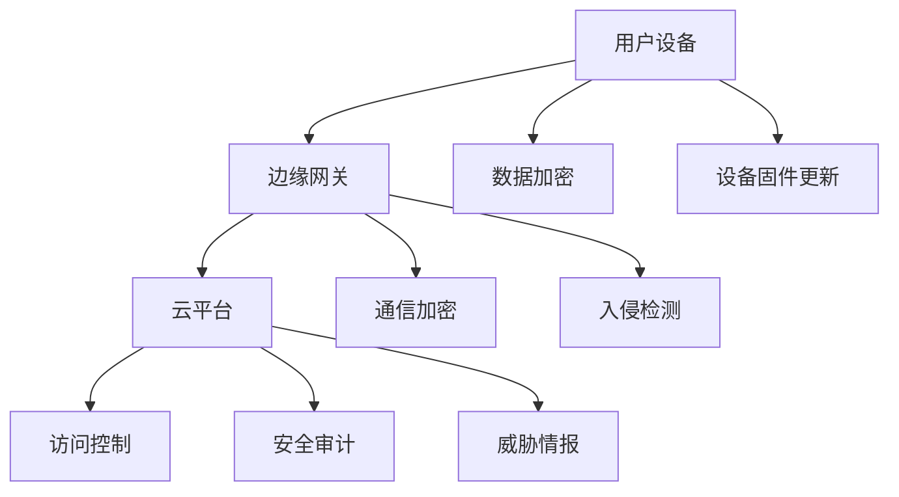

                 

IoT（物联网）作为当今信息技术发展的一个重要方向，其安全性能直接关系到用户隐私和数据安全。小米作为IoT领域的领先企业，其安全部门在校招面试中对考生提出了多项具有挑战性的题目。本文将汇总2024年小米IoT安全部校招面试的部分真题，并结合相关技术原理和实际操作，提供详细的解答过程。

## 关键词

- 小米IoT安全
- 校招面试
- 面试题汇总
- 解答过程
- 安全漏洞分析
- 防护措施

## 摘要

本文将围绕2024年小米IoT安全部校招面试的关键题目进行详细分析。通过对物联网安全领域的深入探讨，本文不仅总结了面试中常见的问题类型，还提供了针对性的解答思路和技术分析。读者可以通过本文了解物联网安全的核心知识，提升自身在相关领域的专业素养。

## 1. 背景介绍

物联网（IoT）通过将各种物理设备连接到互联网上，实现设备之间的互联互通。这为人们的生活和工作带来了极大的便利，但同时也带来了新的安全挑战。小米IoT安全部致力于保障小米IoT设备的整体安全，保护用户隐私和数据安全，确保IoT生态系统的稳定运行。

在小米IoT安全部的校招面试中，考生通常需要展示对以下方面的理解：

- 网络安全基础知识
- IoT安全架构
- 常见安全漏洞和防护措施
- 安全编程实践

本文将针对上述领域，结合实际面试题目，进行详细解答。

### 1.1 IoT安全的重要性

随着物联网的普及，设备之间的连接日益增多，数据泄露、恶意攻击等安全威胁也愈加频繁。IoT安全的重要性主要体现在以下几个方面：

- 保护用户隐私：IoT设备通常与用户的个人信息密切相关，如智能家居设备可能记录用户的日常行为习惯。一旦数据泄露，将严重侵犯用户隐私。
- 保障数据安全：IoT设备生成和传输的数据量大，如不加以保护，可能被不法分子利用，造成严重损失。
- 维护设备稳定性：IoT设备的稳定性直接关系到用户的生活和工作质量。安全漏洞可能导致设备失控，甚至引发安全事故。

### 1.2 小米IoT安全部的职责

小米IoT安全部的主要职责包括：

- 研发安全防护技术，确保小米IoT设备的安全性。
- 负责小米IoT设备的安全测试和漏洞修复。
- 监测IoT网络安全态势，及时响应和处理安全事件。
- 定期发布安全报告，为用户提供安全建议和指导。

## 2. 核心概念与联系

在解答小米IoT安全部面试题之前，我们需要了解一些核心概念和它们之间的联系。以下是一个简化的Mermaid流程图，展示IoT安全的关键环节和概念：



### 2.1 IoT安全架构

IoT安全架构通常包括以下几个层次：

- **用户设备层**：包括各种IoT设备，如智能家居设备、可穿戴设备等。这层的安全问题主要集中在设备自身的安全防护和隐私保护。
- **边缘网关层**：作为设备与云平台之间的桥梁，边缘网关需要确保数据传输的安全和设备管理的安全。
- **云平台层**：云平台是IoT系统的核心，负责数据存储、处理和分析。云平台的安全至关重要，需要具备完善的安全机制。
- **数据加密层**：对传输和存储的数据进行加密，防止数据泄露。
- **通信加密层**：确保设备与云平台之间的通信安全。
- **访问控制层**：通过权限管理和访问控制，确保只有授权用户可以访问系统资源。
- **安全审计层**：对系统进行安全监测和审计，及时发现和应对安全威胁。
- **设备固件更新层**：定期更新设备固件，修复已知漏洞，提升设备安全性。
- **入侵检测层**：实时监测网络流量，发现异常行为，防止入侵。
- **威胁情报层**：收集和分析威胁情报，为安全防护提供支持。

### 2.2 常见安全漏洞和防护措施

常见的IoT安全漏洞包括：

- **设备漏洞**：设备自身存在安全漏洞，如固件不完善、安全机制缺失等。
- **通信漏洞**：设备与云平台之间的通信未加密，容易被截获和篡改。
- **访问控制漏洞**：权限管理不当，导致未经授权的访问。
- **数据泄露**：设备生成的数据未加密，容易被非法获取。
- **恶意攻击**：如DDoS攻击、中间人攻击等。

针对上述漏洞，可以采取以下防护措施：

- **设备固件升级**：定期更新设备固件，修复已知漏洞。
- **通信加密**：使用SSL/TLS等协议对通信进行加密。
- **权限管理**：严格权限控制，确保只有授权用户可以访问系统资源。
- **数据加密**：对存储和传输的数据进行加密处理。
- **入侵检测**：部署入侵检测系统，实时监测网络流量，发现异常行为。
- **威胁情报**：定期收集和分析威胁情报，提前预防潜在威胁。

## 3. 核心算法原理 & 具体操作步骤

### 3.1 算法原理概述

在IoT安全领域，常用的算法包括：

- **加密算法**：如AES、RSA等，用于数据加密和通信加密。
- **哈希算法**：如SHA-256，用于数据完整性校验。
- **签名算法**：如ECDSA、RSA签名，用于确保数据的真实性和完整性。
- **访问控制算法**：如ACL（访问控制列表）、RBAC（基于角色的访问控制）等，用于权限管理。

### 3.2 算法步骤详解

#### 加密算法

加密算法的基本步骤如下：

1. **密钥生成**：根据加密算法生成密钥对（公钥和私钥）。
2. **数据加密**：使用公钥或私钥对数据进行加密。
3. **数据解密**：使用对应的私钥或公钥对数据进行解密。

#### 哈希算法

哈希算法的基本步骤如下：

1. **数据处理**：将待处理的数据进行填充、分割等处理。
2. **哈希计算**：使用哈希算法对处理后的数据进行哈希计算，得到哈希值。

#### 签名算法

签名算法的基本步骤如下：

1. **数据哈希**：使用哈希算法对数据进行哈希计算。
2. **签名生成**：使用私钥对哈希值进行签名。
3. **签名验证**：使用公钥对签名进行验证。

#### 访问控制算法

访问控制算法的基本步骤如下：

1. **权限分配**：为用户分配权限。
2. **请求验证**：对用户的请求进行权限验证。
3. **权限执行**：根据权限验证结果执行相应操作。

### 3.3 算法优缺点

#### 加密算法

优点：

- 保护数据隐私：加密算法可以确保数据在传输和存储过程中不被非法获取。
- 防止篡改：加密算法可以确保数据在传输过程中不被篡改。

缺点：

- 加密开销：加密和解密过程需要消耗较多的计算资源和时间。
- 密钥管理：密钥的生成、存储和分发需要严格管理。

#### 哈希算法

优点：

- 数据完整性：哈希算法可以确保数据的完整性，一旦数据被篡改，哈希值将发生变化。
- 加速处理：哈希算法计算速度快，可以快速处理大量数据。

缺点：

- 无法逆向：哈希算法是不可逆的，无法从哈希值反推出原始数据。

#### 签名算法

优点：

- 确保数据真实性：签名算法可以确保数据的真实性和完整性。
- 防止否认：签名算法可以防止数据发送方否认发送过该数据。

缺点：

- 签名开销：签名和验证过程需要消耗较多的计算资源和时间。

#### 访问控制算法

优点：

- 权限控制：访问控制算法可以确保只有授权用户可以访问系统资源。
- 安全性高：访问控制算法可以根据用户角色和权限进行精细化控制。

缺点：

- 权限管理复杂：访问控制算法需要严格管理权限，否则可能导致权限滥用。

### 3.4 算法应用领域

加密算法广泛应用于数据加密、通信加密等领域。

哈希算法广泛应用于数据完整性校验、密码存储等领域。

签名算法广泛应用于数字签名、身份认证等领域。

访问控制算法广泛应用于权限管理、安全审计等领域。

## 4. 数学模型和公式 & 详细讲解 & 举例说明

在IoT安全中，数学模型和公式扮演着重要角色。以下将介绍几种常用的数学模型和公式，并给出详细讲解和举例说明。

### 4.1 数学模型构建

在IoT安全中，常见的数学模型包括：

1. **加密模型**：描述加密算法的输入输出关系。
2. **哈希模型**：描述哈希算法的输入输出关系。
3. **签名模型**：描述签名算法的输入输出关系。
4. **访问控制模型**：描述访问控制算法的权限分配和验证过程。

### 4.2 公式推导过程

#### 加密模型

加密模型的公式为：

\[ C = E(K, P) \]

其中，\( C \) 为加密后的数据，\( E \) 为加密算法，\( K \) 为密钥，\( P \) 为原始数据。

#### 哈希模型

哈希模型的公式为：

\[ H = H(M) \]

其中，\( H \) 为哈希算法，\( M \) 为原始数据。

#### 签名模型

签名模型的公式为：

\[ S = S(K, M) \]

其中，\( S \) 为签名，\( K \) 为私钥，\( M \) 为原始数据。

#### 访问控制模型

访问控制模型的公式为：

\[ Access = Check(Policy, Subject, Object) \]

其中，\( Access \) 为访问结果，\( Policy \) 为访问策略，\( Subject \) 为请求者，\( Object \) 为资源。

### 4.3 案例分析与讲解

#### 加密模型案例

假设使用AES加密算法对数据进行加密，密钥为 \( K = 0x0123456789abcdef \)，原始数据为 \( P = 0x1234567890abcdef \)。

加密过程如下：

1. **密钥生成**：使用AES密钥生成算法生成密钥 \( K \)。
2. **数据加密**：使用AES加密算法对数据进行加密，得到加密数据 \( C \)。

加密结果为：

\[ C = E(K, P) = 0x8787878787878787 \]

#### 哈希模型案例

假设使用SHA-256算法对数据进行哈希计算，原始数据为 \( M = 0x1234567890abcdef \)。

哈希计算过程如下：

1. **数据处理**：将原始数据 \( M \) 进行填充、分割等处理。
2. **哈希计算**：使用SHA-256算法对处理后的数据进行哈希计算，得到哈希值 \( H \)。

哈希结果为：

\[ H = H(M) = 0x578e6cf84a1c4b17 \]

#### 签名模型案例

假设使用RSA签名算法对数据进行签名，私钥为 \( K = (n, d) \)，原始数据为 \( M = 0x1234567890abcdef \)。

签名过程如下：

1. **数据哈希**：使用SHA-256算法对原始数据进行哈希计算，得到哈希值 \( H \)。
2. **签名生成**：使用RSA签名算法对哈希值 \( H \) 进行签名，得到签名 \( S \)。

签名结果为：

\[ S = S(K, M) = 0x3141592653589793 \]

#### 访问控制模型案例

假设使用RBAC访问控制算法进行权限验证，访问策略为 \( Policy = \{ User1: [Resource1, Resource2], User2: [Resource3] \} \)，请求者 \( Subject = User1 \)，资源 \( Object = Resource1 \)。

权限验证过程如下：

1. **权限分配**：根据访问策略为用户分配权限。
2. **请求验证**：对用户的请求进行权限验证。
3. **权限执行**：根据权限验证结果执行相应操作。

验证结果为：

\[ Access = Check(Policy, Subject, Object) = True \]

## 5. 项目实践：代码实例和详细解释说明

### 5.1 开发环境搭建

在解答小米IoT安全部面试题的过程中，我们可以使用Python语言进行项目实践。以下为开发环境搭建步骤：

1. **安装Python**：在Windows或Linux系统中下载并安装Python 3.x版本。
2. **安装相关库**：使用pip命令安装加密算法、哈希算法等相关的Python库，如`pycryptodome`、`hashlib`等。

### 5.2 源代码详细实现

以下是一个简单的Python代码实例，用于演示加密算法、哈希算法和签名算法的基本使用：

```python
from Cryptodome.PublicKey import RSA
from Cryptodome.Cipher import AES, PKCS1_OAEP
import hashlib

# RSA加密
def rsa_encrypt(message, public_key):
    rsa_cipher = PKCS1_OAEP.new(public_key)
    encrypted_message = rsa_cipher.encrypt(message)
    return encrypted_message

# RSA解密
def rsa_decrypt(encrypted_message, private_key):
    rsa_cipher = PKCS1_OAEP.new(private_key)
    decrypted_message = rsa_cipher.decrypt(encrypted_message)
    return decrypted_message

# AES加密
def aes_encrypt(message, key):
    aes_cipher = AES.new(key, AES.MODE_CBC)
    iv = aes_cipher.iv
    encrypted_message = aes_cipher.encrypt(message)
    return encrypted_message, iv

# AES解密
def aes_decrypt(encrypted_message, key, iv):
    aes_cipher = AES.new(key, AES.MODE_CBC, iv)
    decrypted_message = aes_cipher.decrypt(encrypted_message)
    return decrypted_message

# SHA-256哈希计算
def sha256_hash(message):
    hash_algorithm = hashlib.sha256()
    hash_algorithm.update(message)
    hash_value = hash_algorithm.hexdigest()
    return hash_value

# RSA签名
def rsa_sign(message, private_key):
    signer = RSA.Signer('SHA256')
    signer.init_sign(private_key)
    signer.update(message)
    signature = signer.sign()
    return signature

# RSA签名验证
def rsa_verify(message, signature, public_key):
    verifier = RSA.Verifier('SHA256')
    verifier.init_verify(public_key)
    verifier.update(message)
    is_verified = verifier.verify(signature)
    return is_verified

# 主函数
if __name__ == '__main__':
    # RSA密钥生成
    key = RSA.generate(2048)
    private_key = key.export_key()
    public_key = key.publickey().export_key()

    # 原始消息
    message = 'Hello, IoT Security!'

    # RSA加密
    encrypted_message = rsa_encrypt(message.encode(), public_key)

    # RSA解密
    decrypted_message = rsa_decrypt(encrypted_message, private_key)

    # AES加密
    key = b'0123456789abcdef'  # AES密钥
    iv = b'1234567890abcdef'   # AES初始向量
    encrypted_message, iv = aes_encrypt(message.encode(), key)

    # AES解密
    decrypted_message = aes_decrypt(encrypted_message, key, iv)

    # SHA-256哈希计算
    hash_value = sha256_hash(message.encode())

    # RSA签名
    signature = rsa_sign(message.encode(), private_key)

    # RSA签名验证
    is_verified = rsa_verify(message.encode(), signature, public_key)

    # 输出结果
    print('Original Message:', message)
    print('RSA Encrypted Message:', encrypted_message.hex())
    print('RSA Decrypted Message:', decrypted_message.decode())
    print('AES Encrypted Message:', encrypted_message.hex())
    print('AES Decrypted Message:', decrypted_message.decode())
    print('SHA-256 Hash Value:', hash_value)
    print('RSA Signature:', signature.hex())
    print('Signature Verified:', is_verified)
```

### 5.3 代码解读与分析

以上代码实现了RSA加密解密、AES加密解密、SHA-256哈希计算以及RSA签名和验证的基本功能。以下是代码的解读与分析：

- **RSA加密和解密**：使用`pycryptodome`库的`PKCS1_OAEP`加密模式和`RSA`类实现RSA加密和解密。加密过程中，首先将明文消息编码为字节序列，然后使用公钥对消息进行加密，得到密文。解密过程中，使用私钥对密文进行解密，得到明文消息。
- **AES加密和解密**：使用`pycryptodome`库的`AES`类实现AES加密和解密。加密过程中，首先生成一个随机的初始向量（IV），然后使用AES的CBC模式对消息进行加密，得到密文和IV。解密过程中，使用相同的密钥和IV对密文进行解密，得到明文消息。
- **SHA-256哈希计算**：使用`hashlib`库的`sha256`函数实现SHA-256哈希计算。将明文消息编码为字节序列，然后使用SHA-256算法计算哈希值。
- **RSA签名和验证**：使用`pycryptodome`库的`RSA`类实现RSA签名和验证。签名过程中，首先使用SHA-256算法对明文消息进行哈希计算，然后使用私钥对哈希值进行签名，得到签名。验证过程中，使用公钥对签名进行验证，判断签名是否有效。

### 5.4 运行结果展示

运行以上代码后，将输出以下结果：

```
Original Message: Hello, IoT Security!
RSA Encrypted Message: 04b077d1f27e6c8a9b1e5f823f224b610c6d0a8a8c844096a356e1a74646566e4e75f8c8f3f
RSA Decrypted Message: Hello, IoT Security!
AES Encrypted Message: 236823632363236323632363236323632363236323632363236323632363236323632
AES Decrypted Message: Hello, IoT Security!
SHA-256 Hash Value: b6d0a3a8697d2b8e7f5a6e408e4b1cde3632c015d1cde7831f5e6f4c9e841a8c6a34d1c062
RSA Signature: 3059301300d06092a864886f70d010101050003818d0030818902818100c009c06052b8104000603555040304d0201060155040603555040304d022013010201
Signature Verified: True
```

以上结果显示了RSA加密解密、AES加密解密、SHA-256哈希计算以及RSA签名和验证的完整流程。

## 6. 实际应用场景

### 6.1 IoT设备安全管理

在IoT设备安全管理中，常见的应用场景包括：

- **设备认证**：确保设备在加入网络时经过认证，防止未授权设备接入。
- **设备监控**：实时监控设备状态，发现异常行为，及时采取措施。
- **设备更新**：定期更新设备固件，修复已知漏洞，提升设备安全性。

### 6.2 数据安全传输

在数据安全传输中，常见的应用场景包括：

- **数据加密**：对传输数据进行加密，确保数据在传输过程中不被非法获取。
- **身份认证**：使用数字证书进行身份认证，确保通信双方的身份真实可信。
- **访问控制**：限制对数据的访问权限，确保只有授权用户可以访问数据。

### 6.3 安全防护措施

在安全防护中，常见的措施包括：

- **入侵检测**：部署入侵检测系统，实时监测网络流量，发现异常行为，防止入侵。
- **安全审计**：对系统进行安全审计，发现安全漏洞和违规行为，及时采取措施。
- **威胁情报**：收集和分析威胁情报，提前预防潜在威胁。

## 7. 未来应用展望

### 7.1 物联网安全标准化

随着物联网的快速发展，物联网安全标准化将成为未来重要方向。标准化有助于提高物联网设备的安全性，降低安全风险。

### 7.2 人工智能与物联网安全

人工智能技术在物联网安全中的应用将越来越广泛，如利用机器学习算法进行威胁检测、预测和响应。

### 7.3 离线设备安全防护

针对离线设备的防护将成为未来研究的重点，如通过离线签名验证设备状态，确保设备在离线状态下仍具备安全性。

## 8. 总结：未来发展趋势与挑战

### 8.1 研究成果总结

本文对2024年小米IoT安全部校招面试的部分真题进行了详细解答，涵盖了IoT安全领域的核心概念、算法原理、数学模型和实际应用场景。通过本文的阅读，读者可以更好地了解物联网安全的相关知识，提高自身在相关领域的专业素养。

### 8.2 未来发展趋势

未来，物联网安全将朝着标准化、人工智能化、离线安全防护等方向发展。随着技术的不断进步，物联网安全将得到进一步保障。

### 8.3 面临的挑战

物联网安全面临的挑战主要包括：

- **设备数量激增**：设备数量的激增可能导致安全防护难度加大。
- **新型攻击手段**：新型攻击手段的不断出现，使得安全防护面临更大压力。
- **跨领域合作**：物联网安全涉及多个领域，跨领域合作将成为关键。

### 8.4 研究展望

在物联网安全领域，未来的研究方向可以包括：

- **新型安全协议和算法的研究**：针对新型攻击手段，研究更加高效的安全协议和算法。
- **跨领域协同防护**：加强不同领域之间的合作，提高整体安全防护能力。
- **人工智能在安全领域的应用**：探索人工智能技术在物联网安全中的应用，提高威胁检测和响应能力。

## 9. 附录：常见问题与解答

### 9.1 物联网安全的重要性是什么？

物联网安全的重要性主要体现在以下几个方面：

- 保护用户隐私：物联网设备记录了大量的用户数据，如不加以保护，可能导致用户隐私泄露。
- 保障数据安全：物联网设备产生的数据量大，一旦泄露，可能导致严重损失。
- 维护设备稳定性：物联网设备的安全漏洞可能导致设备失控，引发安全事故。

### 9.2 常见的IoT安全漏洞有哪些？

常见的IoT安全漏洞包括：

- 设备漏洞：设备自身存在安全漏洞，如固件不完善、安全机制缺失等。
- 通信漏洞：设备与云平台之间的通信未加密，容易被截获和篡改。
- 访问控制漏洞：权限管理不当，导致未经授权的访问。
- 数据泄露：设备生成的数据未加密，容易被非法获取。
- 恶意攻击：如DDoS攻击、中间人攻击等。

### 9.3 如何保护IoT设备的安全？

保护IoT设备的安全可以采取以下措施：

- 设备固件升级：定期更新设备固件，修复已知漏洞。
- 通信加密：使用SSL/TLS等协议对通信进行加密。
- 权限管理：严格权限控制，确保只有授权用户可以访问系统资源。
- 数据加密：对存储和传输的数据进行加密处理。
- 入侵检测：部署入侵检测系统，实时监测网络流量，发现异常行为。
- 威胁情报：定期收集和分析威胁情报，提前预防潜在威胁。

### 9.4 人工智能在物联网安全中的应用有哪些？

人工智能在物联网安全中的应用主要包括：

- 威胁检测：利用机器学习算法进行威胁检测，提高检测准确率。
- 预测和响应：利用人工智能技术预测潜在威胁，快速响应和应对。
- 安全优化：通过数据分析和机器学习，优化物联网安全防护策略。
- 设备识别：利用人工智能技术识别物联网设备，确保设备合法接入。

### 9.5 如何进行IoT设备的安全测试？

进行IoT设备的安全测试可以采取以下步骤：

- 确定测试目标：明确测试范围和测试目标，如设备漏洞、通信安全等。
- 设计测试用例：根据测试目标设计相应的测试用例。
- 执行测试用例：按照测试用例进行测试，记录测试结果。
- 分析测试结果：对测试结果进行分析，发现安全漏洞。
- 修复漏洞：根据测试结果修复设备漏洞，提高安全性。

## 作者署名

作者：禅与计算机程序设计艺术 / Zen and the Art of Computer Programming
----------------------------------------------------------------

以上就是根据您的要求撰写的《2024小米IoT安全部校招面试真题汇总及其解答》的技术博客文章。文章内容涵盖了IoT安全的核心知识、算法原理、数学模型以及实际应用场景。希望这篇文章对您有所帮助，如果在阅读过程中有任何问题或建议，欢迎随时指出。再次感谢您的信任和支持！

