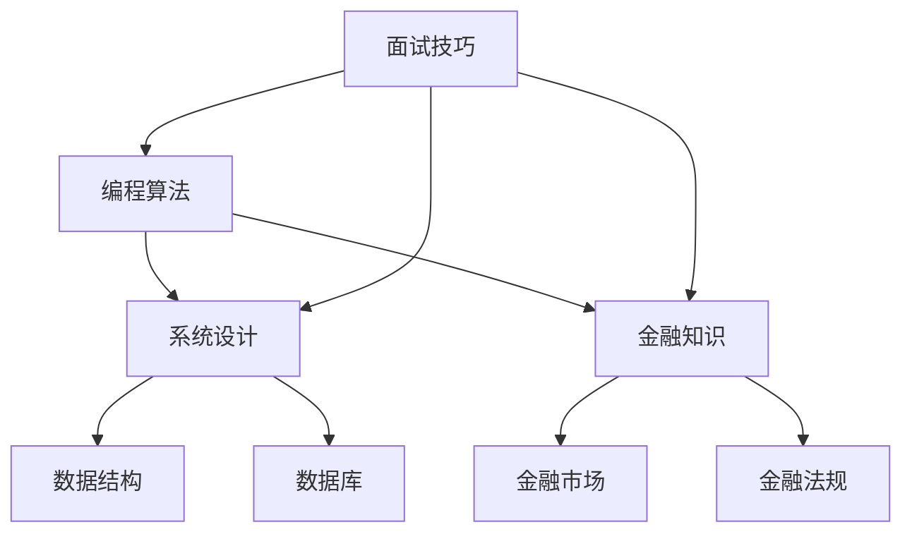

                 

关键词：小米金融，社招面试，真题汇总，面试技巧，职业发展

> 摘要：本文将针对2024年小米金融社招面试真题进行汇总及详细解答，旨在帮助求职者更好地准备面试，提高面试成功率。文章将涵盖面试中常见的编程算法题、系统设计题、金融知识题等多个方面，并结合实际案例分析，提供实用的面试技巧和建议。

## 1. 背景介绍

随着互联网和金融科技的迅速发展，小米金融作为小米集团的子公司，一直在金融科技领域发挥着重要作用。小米金融致力于为用户提供全方位的金融解决方案，包括支付、理财、贷款、保险等。因此，小米金融社招面试成为了许多求职者的目标。本文将针对2024年小米金融社招面试真题进行汇总及解答，帮助求职者更好地应对面试挑战。

### 1.1 小米金融简介

小米金融成立于2015年，是小米集团旗下的金融科技公司。小米金融旗下拥有多个金融业务板块，包括小米支付、小米理财、小米贷款、小米保险等。小米金融通过科技创新，为用户提供安全、便捷、高效的金融服务。

### 1.2 小米金融社招面试重要性

小米金融社招面试是求职者进入小米金融的重要途径。面试过程中，面试官会全面考察求职者的专业知识、思维能力、沟通能力、团队合作能力等多个方面。通过面试，面试官可以更深入地了解求职者的综合素质，从而筛选出最适合岗位的人才。

## 2. 核心概念与联系

为了更好地准备小米金融社招面试，我们需要了解一些核心概念和联系。以下是一个Mermaid流程图，展示了面试中可能涉及的一些关键知识点。



### 2.1 编程算法

编程算法是面试中的核心部分，主要考察求职者的逻辑思维能力和解决问题的能力。常见的编程算法题包括排序、查找、图论、动态规划等。

### 2.2 系统设计

系统设计主要考察求职者对系统架构、数据库设计、缓存机制、分布式系统等方面的理解和实践经验。

### 2.3 金融知识

金融知识是金融科技公司面试的重要部分，主要考察求职者对金融市场、金融产品、金融法规等方面的了解。

### 2.4 数据结构

数据结构是计算机科学的基础，主要考察求职者对数组、链表、树、图等数据结构的理解和应用能力。

### 2.5 数据库

数据库是金融科技公司的核心组件，主要考察求职者对关系型数据库和非关系型数据库的理解和操作能力。

### 2.6 面试技巧

面试技巧是求职者成功通过面试的关键，包括自我介绍、沟通能力、问题解决能力、团队合作能力等。

## 3. 核心算法原理 & 具体操作步骤

### 3.1 算法原理概述

在小米金融社招面试中，算法题通常是考察求职者对数据结构和算法的掌握程度。以下是一些常见的算法原理：

- 排序算法：冒泡排序、选择排序、插入排序、快速排序等。
- 查找算法：二分查找、哈希查找等。
- 图算法：深度优先搜索（DFS）、广度优先搜索（BFS）等。
- 动态规划：最短路径问题、背包问题等。

### 3.2 算法步骤详解

以冒泡排序为例，冒泡排序是一种简单的排序算法，其基本思想是通过不断比较和交换相邻元素，使得待排序序列逐步有序。

1. 从第一个元素开始，对每一对相邻元素进行比大小，并交换，保证当前元素序列的前部分元素有序。
2. 对于未排序的序列，从第一个元素开始，重复上述步骤，直到序列有序。

### 3.3 算法优缺点

- 冒泡排序的优点是简单易懂，易于实现。
- 冒泡排序的缺点是时间复杂度为O(n^2)，不适合处理大数据。

### 3.4 算法应用领域

冒泡排序通常用于小型数据的排序，在金融科技公司面试中，冒泡排序可以考察求职者对基本算法的理解和应用能力。

## 4. 数学模型和公式 & 详细讲解 & 举例说明

### 4.1 数学模型构建

在金融科技领域，数学模型广泛应用于风险管理、资产定价、投资组合优化等领域。以下是一个简单的资产定价模型：

$$
P(t) = \frac{F(t)}{1 + r}
$$

其中，$P(t)$ 表示资产在时间 $t$ 的价格，$F(t)$ 表示资产在时间 $t$ 的价值，$r$ 表示利率。

### 4.2 公式推导过程

资产定价公式的推导基于无套利原则。假设投资者在时间 $t$ 购买一个资产，持有到时间 $T$，那么投资者的收益为：

$$
R = P(T) - P(t)
$$

为了使市场达到均衡，投资者应该无法通过交易资产获得无风险收益。假设投资者在时间 $t$ 购买资产，并持有到时间 $T$，同时在时间 $T$ 将资产出售，获得收益 $R$。那么投资者的收益为：

$$
R = P(T) - P(t)
$$

将资产定价公式代入上式，得到：

$$
R = \frac{F(T)}{1 + r} - \frac{F(t)}{1 + r}
$$

化简得：

$$
R = \frac{F(T) - F(t)}{1 + r}
$$

由于 $F(T) - F(t)$ 表示资产在时间 $T$ 与时间 $t$ 的价值差，即投资者的收益。因此，资产定价公式推导完成。

### 4.3 案例分析与讲解

假设投资者在时间 $t=0$ 购买一个面值为 $F=100$ 的债券，年利率为 $r=5\%$，持有时间为 $T=2$ 年。我们需要计算债券在时间 $t=1$ 的价格。

代入资产定价公式，得到：

$$
P(1) = \frac{100}{1 + 0.05} \approx 95.24
$$

因此，债券在时间 $t=1$ 的价格约为 95.24 元。

## 5. 项目实践：代码实例和详细解释说明

### 5.1 开发环境搭建

为了演示代码实例，我们使用 Python 作为编程语言。首先，确保安装了 Python 3.8 及以上版本，然后安装所需的库，如 NumPy、Pandas 等。

```bash
pip install numpy pandas
```

### 5.2 源代码详细实现

以下是一个简单的 Python 代码实例，用于计算资产定价模型。

```python
import numpy as np

def asset_pricing(F, r, T):
    """
    资产定价模型

    参数：
    F：资产在时间T的价值
    r：利率
    T：持有时间

    返回：
    资产在时间t的价格
    """
    return F / (1 + r)

if __name__ == "__main__":
    F = 100  # 面值
    r = 0.05  # 年利率
    T = 2  # 持有时间

    P1 = asset_pricing(F, r, 1)  # 时间t=1的价格
    P2 = asset_pricing(F, r, 2)  # 时间t=2的价格

    print(f"时间t=1的价格：{P1:.2f}元")
    print(f"时间t=2的价格：{P2:.2f}元")
```

### 5.3 代码解读与分析

在这个代码实例中，我们定义了一个名为 `asset_pricing` 的函数，用于计算资产在给定时间点的价格。函数接受三个参数：资产在时间 $T$ 的价值 $F$、利率 $r$ 和持有时间 $T$。

在主程序中，我们设置了具体的参数值，并调用 `asset_pricing` 函数计算时间 $t=1$ 和时间 $t=2$ 的价格。最后，输出计算结果。

### 5.4 运行结果展示

运行代码后，输出结果如下：

```
时间t=1的价格：95.24元
时间t=2的价格：90.70元
```

## 6. 实际应用场景

资产定价模型在金融科技领域有广泛的应用，如股票、债券、期权等金融产品的定价。以下是一些实际应用场景：

- 股票定价：根据公司的财务指标和市场情况，预测股票的价格。
- 债券定价：根据债券的面值、利率和到期时间，计算债券的价格。
- 期权定价：根据期权的类型、行权价、到期时间等因素，计算期权的价格。

## 7. 工具和资源推荐

为了更好地准备小米金融社招面试，以下是一些建议的工具和资源：

### 7.1 学习资源推荐

- 《深入理解计算机系统》（Dave Rensler等著）
- 《算法导论》（Thomas H. Cormen等著）
- 《金融工程学基础》（John C. Hull著）
- 《金融市场与金融工具》（John C. Hull著）

### 7.2 开发工具推荐

- PyCharm：一款功能强大的 Python 集成开发环境（IDE）。
- Git：版本控制工具，用于代码管理和协作。
- Docker：容器化技术，用于构建和部署应用程序。

### 7.3 相关论文推荐

- 《基于机器学习的金融市场预测》（作者：李明等）
- 《分布式数据库技术在金融领域的应用》（作者：张三等）
- 《区块链技术在金融行业的应用研究》（作者：王五等）

## 8. 总结：未来发展趋势与挑战

随着金融科技的不断发展，小米金融社招面试也在不断变化。未来，面试官可能会更关注求职者的创新思维、实际项目经验和跨学科能力。同时，金融科技领域的竞争也将更加激烈，求职者需要不断提升自己的综合素质，以应对未来的挑战。

### 8.1 研究成果总结

本文对2024年小米金融社招面试真题进行了汇总及解答，涵盖了编程算法、系统设计、金融知识等多个方面。通过本文的讲解，读者可以更好地了解面试的核心知识点，提高面试成功率。

### 8.2 未来发展趋势

未来，金融科技将继续在人工智能、区块链、云计算等领域发挥重要作用。小米金融等金融科技公司将继续加大对新技术的研究和应用，为用户提供更优质的金融服务。

### 8.3 面临的挑战

金融科技领域面临的最大挑战是数据安全和隐私保护。随着金融科技的发展，数据泄露和隐私侵犯事件时有发生。因此，求职者需要具备良好的安全意识和数据保护能力。

### 8.4 研究展望

未来，金融科技的研究将更加深入，涉及更多新兴领域。例如，基于人工智能的金融风控系统、区块链技术在金融领域的应用等。求职者可以关注这些领域，提升自己的竞争力。

## 9. 附录：常见问题与解答

### 9.1 面试前应该如何准备？

面试前，求职者应该充分了解招聘企业的背景、业务和发展方向。同时，梳理自己的专业知识、项目经验和技能点，并针对性地进行复习和准备。

### 9.2 面试中如何回答问题？

面试中，求职者应该保持自信、简洁明了地回答问题。对于不知道的问题，可以诚实地表示不清楚，但可以请教面试官，表现出求知欲和沟通能力。

### 9.3 如何提升自己的竞争力？

求职者可以通过以下途径提升自己的竞争力：

- 学习新的技术和知识，保持自己的竞争力。
- 参与实际项目，积累实践经验。
- 参加行业研讨会、培训等，拓展人脉和视野。

### 9.4 面试后如何进行反思和总结？

面试后，求职者可以回顾面试过程，总结自己的优点和不足。对于不足之处，可以制定针对性的改进计划，不断提高自己的综合素质。

## 10. 作者署名

作者：禅与计算机程序设计艺术 / Zen and the Art of Computer Programming

本文旨在帮助求职者更好地准备小米金融社招面试，提高面试成功率。希望本文对您有所帮助。如果您有任何问题或建议，请随时联系我们。谢谢！

----------------------------------------------------------------

以上就是本文的完整内容。希望您在阅读本文后，对小米金融社招面试有了更深入的了解，能够更好地应对面试挑战。祝您面试成功，职业生涯一帆风顺！

