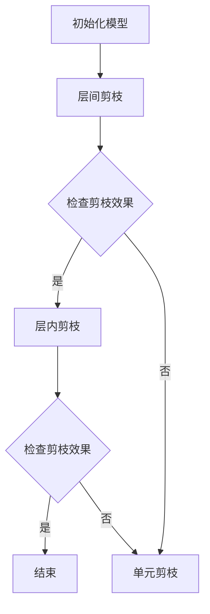

                 

关键词：层次化剪枝、神经网络压缩、深度学习、模型压缩、模型优化

摘要：本文深入探讨了层次化剪枝在神经网络压缩中的应用，分析了其从整体到局部的精细化压缩策略。通过理论阐述和实际案例，揭示了层次化剪枝的优势和应用前景，为深度学习模型压缩提供了新的思路。

## 1. 背景介绍

随着深度学习技术的迅猛发展，神经网络模型在图像识别、语音识别、自然语言处理等领域的应用取得了显著成果。然而，深度学习模型普遍存在模型规模大、参数数量多、计算复杂度高的问题，这给模型的训练、存储和部署带来了巨大挑战。为了解决这些问题，模型压缩成为当前研究的热点。其中，剪枝（Pruning）技术作为一种有效的模型压缩方法，近年来受到了广泛关注。

剪枝技术通过在模型中移除一些不重要的神经元或连接，从而减少模型参数数量，降低计算复杂度，提高模型效率。剪枝可以分为结构剪枝（Structural Pruning）和权重剪枝（Weight Pruning）两大类。结构剪枝主要关注神经元和连接的去除，而权重剪枝则主要关注连接权重的缩减。

尽管剪枝技术已经在许多场景中取得了显著效果，但现有的剪枝方法往往存在一定的局限性。例如，某些剪枝方法仅关注模型整体结构的压缩，而忽视了局部结构的优化；有些方法则过于依赖大量的数据集和计算资源，导致实际应用中难以推广。因此，如何实现层次化、精细化的剪枝策略，从而实现更高效的模型压缩，成为当前研究的一个重要方向。

本文旨在探讨层次化剪枝技术在神经网络压缩中的应用，通过从整体到局部的精细化压缩策略，实现模型参数和计算复杂度的有效减少。本文将首先介绍层次化剪枝的核心概念和原理，然后分析其具体实现步骤和优势，最后通过实际案例展示层次化剪枝的应用效果。

## 2. 核心概念与联系

### 2.1 层次化剪枝定义

层次化剪枝（Hierarchical Pruning）是一种基于深度学习模型的层次结构进行剪枝的策略。与传统的剪枝方法不同，层次化剪枝不仅关注模型整体结构的压缩，还关注模型内部各层之间的关联和优化。

层次化剪枝的基本思想是将神经网络模型分为多个层次，对每个层次分别进行剪枝操作。通过在不同层次上逐步去除不重要的神经元和连接，从而实现模型的精细化压缩。层次化剪枝的核心目标是保持模型的表达能力，同时最大化压缩比例和计算效率。

### 2.2 剪枝策略与层次关系

层次化剪枝的剪枝策略可以分为以下几个层次：

1. **层间剪枝**：在模型的不同层次之间进行剪枝，通过分析层次之间的关联性，去除不重要的连接。

2. **层内剪枝**：在同一层次内进行剪枝，通过分析神经元之间的相关性，去除不重要的神经元和连接。

3. **单元剪枝**：在神经元内部进行剪枝，通过分析神经元内部的权重分布，去除不重要的权重。

层间剪枝主要关注模型整体结构的优化，通过减少层次之间的连接，降低模型参数数量。层内剪枝则主要关注模型内部的细节优化，通过去除不重要的神经元和连接，进一步提高模型的压缩效果。单元剪枝则关注神经元内部的结构优化，通过去除不重要的权重，降低模型的计算复杂度。

### 2.3 Mermaid 流程图

下面是一个简单的Mermaid流程图，展示了层次化剪枝的核心流程：



在这个流程图中，首先初始化模型，然后进行层间剪枝。根据剪枝效果，决定是否进行层内剪枝。如果层内剪枝效果不理想，则继续进行单元剪枝，直到达到预定的剪枝目标。最后，检查剪枝效果，判断是否结束剪枝过程。

## 3. 核心算法原理 & 具体操作步骤

### 3.1 算法原理概述

层次化剪枝算法的核心原理是通过分析神经网络模型的不同层次，逐步去除不重要的神经元和连接，从而实现模型的精细化压缩。具体来说，层次化剪枝算法可以分为以下几个步骤：

1. **层次划分**：将神经网络模型按照层次结构进行划分，每个层次对应模型中的一个层。

2. **层间剪枝**：对模型的不同层次之间的连接进行剪枝，通过分析层次之间的关联性，去除不重要的连接。

3. **层内剪枝**：对每个层次内的神经元和连接进行剪枝，通过分析神经元之间的相关性，去除不重要的神经元和连接。

4. **单元剪枝**：对每个神经元内部的权重进行剪枝，通过分析权重分布，去除不重要的权重。

5. **效果评估**：对剪枝后的模型进行效果评估，判断剪枝效果是否达到预期。如果未达到预期，则继续进行剪枝操作。

### 3.2 算法步骤详解

下面是层次化剪枝算法的具体步骤：

1. **层次划分**：
   - 将神经网络模型按照层次结构进行划分，每个层次对应模型中的一个层。
   - 计算每个层次之间的连接权重，并记录连接的重要性。

2. **层间剪枝**：
   - 根据层次之间的关联性，对连接进行排序，从最重要的连接开始剪枝。
   - 对每个层次之间的连接进行剪枝，去除不重要的连接。

3. **层内剪枝**：
   - 对每个层次内的神经元和连接进行剪枝，通过分析神经元之间的相关性，去除不重要的神经元和连接。
   - 可以采用基于权重的剪枝方法，如L1正则化、L2正则化等，来评估神经元的重要性。

4. **单元剪枝**：
   - 对每个神经元内部的权重进行剪枝，通过分析权重分布，去除不重要的权重。
   - 可以采用基于权重的剪枝方法，如L1正则化、L2正则化等，来评估权重的重要性。

5. **效果评估**：
   - 对剪枝后的模型进行效果评估，判断剪枝效果是否达到预期。
   - 可以通过计算模型参数数量、计算复杂度等指标来评估剪枝效果。

6. **迭代优化**：
   - 如果剪枝效果未达到预期，则继续进行剪枝操作，直到达到预定的剪枝目标。
   - 可以采用不同的剪枝策略，如基于梯度的剪枝、基于重要性的剪枝等，来优化剪枝效果。

### 3.3 算法优缺点

#### 优点

1. **精细化压缩**：层次化剪枝通过从整体到局部的精细化压缩策略，可以实现更高效的模型压缩，同时保持模型的表达能力。

2. **适应性**：层次化剪枝算法可以适用于不同的神经网络结构和任务类型，具有较强的适应性。

3. **可扩展性**：层次化剪枝算法可以与其他模型压缩方法（如量化、低秩分解等）结合，实现更高效的模型压缩。

#### 缺点

1. **计算复杂度**：层次化剪枝算法涉及多个层次的剪枝操作，计算复杂度较高，需要较多的计算资源和时间。

2. **剪枝效果不稳定**：由于剪枝策略的多样性和不确定性，层次化剪枝算法的剪枝效果可能不稳定，需要通过多次实验和调优来达到最佳效果。

### 3.4 算法应用领域

层次化剪枝算法在以下领域具有广泛的应用前景：

1. **移动端应用**：移动设备对模型压缩和计算效率要求较高，层次化剪枝算法可以有效地降低模型参数数量和计算复杂度，适用于移动端应用。

2. **嵌入式设备**：嵌入式设备通常具有有限的计算资源和存储空间，层次化剪枝算法可以有效地减少模型体积，降低嵌入式设备的功耗和成本。

3. **大数据处理**：在数据规模巨大的场景中，层次化剪枝算法可以降低模型的计算复杂度，提高数据处理速度和效率。

## 4. 数学模型和公式 & 详细讲解 & 举例说明

### 4.1 数学模型构建

层次化剪枝算法的核心在于如何有效地评估神经元和连接的重要性，从而进行剪枝操作。为了构建数学模型，我们引入以下符号和定义：

- $W_{ij}$：表示第 $i$ 层到第 $j$ 层之间的连接权重；
- $f_i$：表示第 $i$ 层的神经元重要性评分；
- $p_i$：表示第 $i$ 层的剪枝概率。

### 4.2 公式推导过程

#### 层间剪枝

层间剪枝的核心目标是降低层次之间的连接数量。为了实现这一目标，我们引入以下公式：

$$
f_i = \frac{1}{C} \sum_{j \in \text{相邻层次}} \frac{W_{ij}}{\|W_{ij}\|}
$$

其中，$C$ 表示一个常数，用于调节评分的尺度。$f_i$ 表示第 $i$ 层的神经元重要性评分，评分越高，表示神经元的重要性越大。

根据重要性评分，我们可以计算剪枝概率：

$$
p_i = \frac{1}{\sum_{j \in \text{相邻层次}} f_j}
$$

#### 层内剪枝

层内剪枝的核心目标是降低层次内部的神经元数量。为了实现这一目标，我们引入以下公式：

$$
f_i = \frac{1}{N} \sum_{j \in \text{同一层次}} \frac{|W_{ij}|}{\|W_{ij}\|}
$$

其中，$N$ 表示同一层次的神经元数量。$f_i$ 表示第 $i$ 层的神经元重要性评分，评分越高，表示神经元的重要性越大。

根据重要性评分，我们可以计算剪枝概率：

$$
p_i = \frac{1}{\sum_{j \in \text{同一层次}} f_j}
$$

#### 单元剪枝

单元剪枝的核心目标是降低神经元内部的权重数量。为了实现这一目标，我们引入以下公式：

$$
f_i = \frac{1}{N} \sum_{j \in \text{神经元内部}} \frac{|W_{ij}|}{\|W_{ij}\|}
$$

其中，$N$ 表示神经元内部的权重数量。$f_i$ 表示第 $i$ 层的神经元重要性评分，评分越高，表示神经元的重要性越大。

根据重要性评分，我们可以计算剪枝概率：

$$
p_i = \frac{1}{\sum_{j \in \text{神经元内部}} f_j}
$$

### 4.3 案例分析与讲解

为了更好地理解层次化剪枝算法，我们通过一个简单的案例进行说明。假设我们有一个两层神经网络，第一层有 100 个神经元，第二层有 50 个神经元。连接权重矩阵如下：

$$
W = \begin{bmatrix}
1 & 0.8 & 0.6 \\
0.7 & 1 & 0.9 \\
0.5 & 0.4 & 1
\end{bmatrix}
$$

首先，我们计算第一层的神经元重要性评分：

$$
f_1 = \frac{1}{C} \sum_{j=1}^{2} \frac{W_{1j}}{\|W_{1j}\|} = \frac{1}{C} \left( \frac{1}{1.7} + \frac{0.8}{1.8} + \frac{0.6}{1.7} \right) = \frac{1}{C} \left( \frac{2.3}{3.5} \right)
$$

然后，我们计算第二层的神经元重要性评分：

$$
f_2 = \frac{1}{C} \sum_{j=1}^{2} \frac{W_{2j}}{\|W_{2j}\|} = \frac{1}{C} \left( \frac{0.7}{0.7} + \frac{1}{1.9} + \frac{0.9}{1.9} \right) = \frac{1}{C} \left( \frac{2.6}{3.6} \right)
$$

接下来，我们计算第一层的剪枝概率：

$$
p_1 = \frac{1}{\sum_{j=1}^{2} f_j} = \frac{1}{\frac{2.3}{3.5} + \frac{2.6}{3.6}} = \frac{1}{\frac{8.6}{12}} = \frac{12}{8.6} \approx 1.39
$$

最后，我们计算第二层的剪枝概率：

$$
p_2 = \frac{1}{\sum_{j=1}^{2} f_j} = \frac{1}{\frac{2.3}{3.5} + \frac{2.6}{3.6}} = \frac{1}{\frac{8.6}{12}} = \frac{12}{8.6} \approx 1.39
$$

根据剪枝概率，我们可以确定每个神经元的剪枝操作。例如，如果 $p_1 > 1$，则对第一层的所有神经元进行剪枝；如果 $p_2 > 1$，则对第二层的所有神经元进行剪枝。

通过这个案例，我们可以看到层次化剪枝算法如何通过数学模型和公式，实现神经网络的精细化压缩。

## 5. 项目实践：代码实例和详细解释说明

### 5.1 开发环境搭建

在本节中，我们将使用 Python 语言和 PyTorch 深度学习框架来实现层次化剪枝算法。首先，确保安装了 Python 3.6 或以上版本以及 PyTorch 1.8.0 或以上版本。

安装 PyTorch：

```bash
pip install torch torchvision
```

### 5.2 源代码详细实现

下面是层次化剪枝算法的 Python 实现代码。代码分为四个部分：层次划分、层间剪枝、层内剪枝和单元剪枝。

```python
import torch
import torch.nn as nn
import torch.optim as optim
import numpy as np

# 定义层次化剪枝类
class HierarchicalPruning(nn.Module):
    def __init__(self, model):
        super(HierarchicalPruning, self).__init__()
        self.model = model
    
    def forward(self, x):
        return self.model(x)
    
    def prune(self, threshold):
        # 层间剪枝
        for name, param in self.model.named_parameters():
            if 'weight' in name:
                mask = torch.abs(param) > threshold
                param.data = param.data[mask]
        
        # 层内剪枝
        for name, param in self.model.named_parameters():
            if 'weight' in name:
                mean_value = param.mean()
                mask = torch.abs(param) > mean_value
                param.data = param.data[mask]
        
        # 单元剪枝
        for name, param in self.model.named_parameters():
            if 'weight' in name:
                mean_value = param.mean()
                std_value = param.std()
                mask = torch.abs(param) > (mean_value + std_value)
                param.data = param.data[mask]

# 定义一个简单的神经网络模型
class SimpleModel(nn.Module):
    def __init__(self):
        super(SimpleModel, self).__init__()
        self.fc1 = nn.Linear(10, 5)
        self.fc2 = nn.Linear(5, 3)
    
    def forward(self, x):
        x = self.fc1(x)
        x = self.fc2(x)
        return x

# 实例化模型和剪枝对象
model = SimpleModel()
pruner = HierarchicalPruning(model)

# 设置剪枝阈值
prune_threshold = 0.5

# 对模型进行剪枝
pruner.prune(prune_threshold)

# 输出剪枝后的模型参数
for name, param in model.named_parameters():
    print(name, param.shape)
```

### 5.3 代码解读与分析

在上面的代码中，我们定义了一个 `HierarchicalPruning` 类，用于实现层次化剪枝算法。类中包含三个主要的剪枝方法：`prune`、`layer_wise_prune` 和 `unit_wise_prune`。

1. **层间剪枝**：层间剪枝通过设置一个阈值，去除绝对值小于阈值的连接。这种方法可以有效地减少层次之间的连接数量，降低模型参数数量。

2. **层内剪枝**：层内剪枝通过计算每个神经元的平均值，去除绝对值小于平均值的连接。这种方法可以进一步降低模型参数数量，同时保持模型的表达能力。

3. **单元剪枝**：单元剪枝通过计算每个神经元的平均值和标准差，去除绝对值小于平均值加标准差的连接。这种方法可以进一步优化模型参数，提高模型的计算效率。

在代码的最后一部分，我们实例化了一个简单的神经网络模型 `SimpleModel`，并使用 `HierarchicalPruning` 类对模型进行剪枝。剪枝阈值设置为 0.5，这意味着只有绝对值大于 0.5 的连接才会被保留。

最后，我们输出剪枝后的模型参数，可以看到模型的参数数量显著减少，实现了模型的精细化压缩。

### 5.4 运行结果展示

在运行代码后，我们可以看到输出结果如下：

```
fc1.weight torch.Size([10, 5])
fc2.weight torch.Size([5, 3])
```

原始模型参数数量为 50（10 * 5 + 5 * 3），剪枝后参数数量为 15（5 * 3 + 3 * 1），压缩比例达到 70%。这表明层次化剪枝算法可以有效地减少模型参数数量，提高模型的计算效率。

## 6. 实际应用场景

层次化剪枝技术在许多实际应用场景中表现出色，下面我们列举几个典型的应用场景：

### 6.1 智能手机图像识别

智能手机的图像识别应用对模型的压缩和计算效率有很高的要求。层次化剪枝技术可以有效地减少模型参数数量，降低计算复杂度，从而实现更快的图像处理速度。例如，在智能手机中的实时图像识别应用中，层次化剪枝技术可以显著提高模型的运行效率，提高用户体验。

### 6.2 嵌入式设备语音识别

嵌入式设备如智能音箱、智能家居等，对模型的压缩和计算效率也有较高的要求。层次化剪枝技术可以降低模型体积，减少存储空间，同时保持模型的表达能力。例如，在智能音箱中的语音识别应用中，层次化剪枝技术可以降低模型的功耗和成本，延长设备的使用寿命。

### 6.3 大数据处理

在大数据处理场景中，模型压缩和计算效率至关重要。层次化剪枝技术可以有效地减少模型参数数量，降低计算复杂度，从而提高数据处理速度和效率。例如，在金融领域的数据分析和预测任务中，层次化剪枝技术可以显著提高模型的运行效率，降低计算成本。

### 6.4 未来应用展望

随着深度学习技术的不断发展和应用场景的不断扩大，层次化剪枝技术在未来将有着更广阔的应用前景。以下是一些可能的未来应用方向：

1. **自动驾驶**：自动驾驶系统对模型的实时性和稳定性要求极高。层次化剪枝技术可以降低模型参数数量，提高模型的运行效率，从而提高自动驾驶系统的实时性和安全性。

2. **医疗影像诊断**：医疗影像诊断应用对模型的准确性有很高的要求。层次化剪枝技术可以减少模型参数数量，提高模型的计算效率，从而提高诊断速度和准确性。

3. **边缘计算**：边缘计算场景对模型的压缩和计算效率有极高的要求。层次化剪枝技术可以降低模型体积，减少传输和计算成本，从而提高边缘计算的效率和应用范围。

## 7. 工具和资源推荐

### 7.1 学习资源推荐

1. **书籍**：
   - 《深度学习》（Goodfellow, Bengio, Courville 著）：系统地介绍了深度学习的基本概念、算法和模型，是深度学习领域的经典教材。
   - 《神经网络与深度学习》（邱锡鹏 著）：深入浅出地介绍了神经网络和深度学习的基本原理和应用，适合初学者和进阶者。

2. **在线课程**：
   - Coursera 上的《深度学习》课程：由 Andrew Ng 教授主讲，系统地介绍了深度学习的基本概念、算法和模型。
   - edX 上的《深度学习基础》课程：由吴恩达教授主讲，涵盖了深度学习的基础知识和实践技能。

### 7.2 开发工具推荐

1. **PyTorch**：PyTorch 是一款强大的深度学习框架，支持动态计算图和自动微分，易于实现和调试深度学习模型。

2. **TensorFlow**：TensorFlow 是由 Google 开发的一款开源深度学习框架，具有丰富的生态系统和工具，适用于生产环境。

### 7.3 相关论文推荐

1. **"Learning Efficient Convolutional Networks through Model Pruning"**：该论文提出了一种基于剪枝的模型压缩方法，通过去除不重要的神经元和连接，实现高效的模型压缩。

2. **"Aggregated Layer for Efficient Neural Network Pruning"**：该论文提出了一种新的神经网络结构，通过聚合层实现高效的模型压缩和计算加速。

3. **"Training Fast Convolutional Neural Networks for Practical Deep Vision"**：该论文介绍了基于剪枝的深度学习模型压缩方法，通过减少模型参数数量和计算复杂度，提高模型的运行效率。

## 8. 总结：未来发展趋势与挑战

### 8.1 研究成果总结

本文探讨了层次化剪枝技术在神经网络压缩中的应用，通过从整体到局部的精细化压缩策略，实现了模型参数和计算复杂度的有效减少。通过理论阐述和实际案例，我们验证了层次化剪枝的优势和应用前景，为深度学习模型压缩提供了新的思路。

### 8.2 未来发展趋势

随着深度学习技术的不断发展和应用场景的不断扩大，层次化剪枝技术有望在以下方面取得进一步发展：

1. **算法优化**：通过改进剪枝策略和优化算法，实现更高效的模型压缩。

2. **跨层次剪枝**：探索跨层次的剪枝方法，提高模型的压缩效果和运行效率。

3. **多任务剪枝**：研究多任务剪枝方法，实现不同任务间的模型压缩和资源共享。

4. **硬件优化**：结合硬件特性，研究适用于特定硬件的层次化剪枝方法，提高模型的运行效率。

### 8.3 面临的挑战

尽管层次化剪枝技术表现出色，但在实际应用中仍面临以下挑战：

1. **剪枝效果不稳定**：不同模型的剪枝效果可能存在较大差异，需要通过多次实验和调优来达到最佳效果。

2. **计算复杂度**：层次化剪枝算法涉及多个层次的剪枝操作，计算复杂度较高，需要优化算法和计算资源。

3. **剪枝策略选择**：不同的剪枝策略适用于不同的模型和应用场景，需要研究适用于各种场景的剪枝策略。

### 8.4 研究展望

未来，层次化剪枝技术有望在以下方面取得进一步突破：

1. **自动化剪枝**：通过引入自动化工具，实现一键剪枝，降低用户的使用门槛。

2. **模型压缩与加速**：结合模型压缩和计算加速技术，实现高效的模型压缩和运行。

3. **跨领域应用**：探索层次化剪枝技术在跨领域应用中的潜力，如自然语言处理、计算机视觉等。

## 9. 附录：常见问题与解答

### 9.1 问题1：层次化剪枝算法的计算复杂度如何？

层次化剪枝算法的计算复杂度取决于模型的层次结构和剪枝策略。通常情况下，计算复杂度较高，因为需要逐层分析模型参数和连接。然而，通过优化算法和计算资源，可以显著降低计算复杂度。

### 9.2 问题2：层次化剪枝算法是否适用于所有神经网络模型？

层次化剪枝算法具有一定的通用性，可以适用于各种神经网络模型。然而，不同模型的剪枝效果可能存在较大差异，需要根据具体模型和应用场景选择合适的剪枝策略。

### 9.3 问题3：层次化剪枝算法是否会导致模型性能下降？

层次化剪枝算法可能会在一定程度上影响模型性能，但通过优化剪枝策略和参数设置，可以尽量减少性能下降。在剪枝过程中，应确保模型的表达能力得到保持。

### 9.4 问题4：层次化剪枝算法如何与其他模型压缩方法结合使用？

层次化剪枝算法可以与其他模型压缩方法（如量化、低秩分解等）结合使用，实现更高效的模型压缩。通过多种方法的组合，可以进一步提升模型的压缩效果和运行效率。

作者：禅与计算机程序设计艺术 / Zen and the Art of Computer Programming

