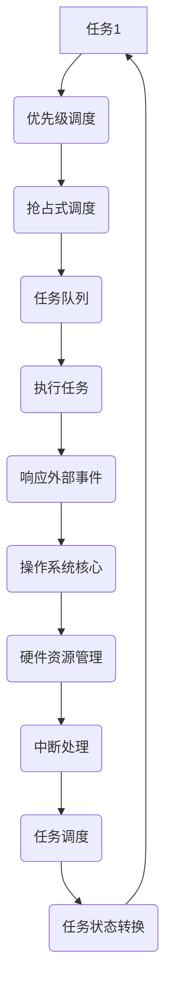
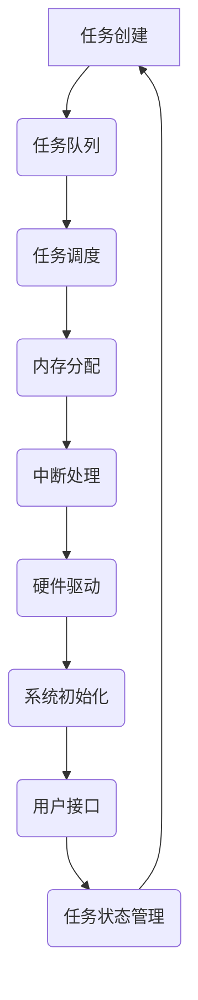

                 

关键词：嵌入式操作系统、实时性、响应性、操作系统设计、调度算法

摘要：本文深入探讨了嵌入式操作系统的实时性和响应性，分析了它们在嵌入式系统中的重要性，详细介绍了实时操作系统（RTOS）的核心概念、调度算法，以及它们在嵌入式系统中的应用。此外，文章还讨论了数学模型和公式在嵌入式操作系统设计中的应用，并通过一个实际的代码实例展示了如何实现嵌入式操作系统。最后，文章总结了嵌入式操作系统的未来发展趋势和面临的挑战。

## 1. 背景介绍

在当今的科技世界中，嵌入式系统无处不在，从简单的智能家居设备到复杂的工业控制系统，嵌入式系统已成为现代社会不可或缺的一部分。而嵌入式操作系统的实时性和响应性是保证这些系统稳定运行的关键因素。

实时系统（Real-time System）是指那些必须在给定的时间内完成计算和任务的系统。这些系统对响应时间有严格的限制，因为任务的延迟可能会导致严重的后果。例如，飞机自动驾驶系统必须在特定的时间内做出决策，以避免发生事故。因此，嵌入式操作系统的实时性和响应性至关重要。

响应性（Responsiveness）是指系统能够迅速响应外部事件和请求。在嵌入式系统中，响应性直接影响用户体验和系统性能。例如，智能手机的操作系统必须在用户点击按钮时迅速响应，以提供流畅的操作体验。

本文将探讨嵌入式操作系统的实时性和响应性，分析它们在嵌入式系统设计中的重要性，介绍实时操作系统的核心概念和调度算法，并通过一个实际的代码实例展示如何实现嵌入式操作系统。最后，我们将讨论嵌入式操作系统的未来发展趋势和面临的挑战。

## 2. 核心概念与联系

### 2.1. 实时操作系统（RTOS）

实时操作系统（RTOS）是一种专门为实时应用而设计的操作系统。它具有以下核心特征：

- **确定性（Determinism）**：RTOS保证任务在特定时间内完成，使得系统能够预测任务完成时间。
- **优先级调度（Priority-based Scheduling）**：RTOS根据任务的优先级来调度任务，确保高优先级任务优先执行。
- **抢占式调度（Preemptive Scheduling）**：RTOS可以在任务执行过程中抢占低优先级任务，以确保高优先级任务得到及时处理。

下面是一个简单的RTOS架构的Mermaid流程图：



### 2.2. 嵌入式操作系统设计

嵌入式操作系统设计涉及多个方面，包括任务管理、内存管理、中断处理等。下面是一个嵌入式操作系统设计的简化流程：



### 2.3. 嵌入式操作系统与实时系统的联系

嵌入式操作系统和实时系统有密切的联系。RTOS是嵌入式操作系统的一种特殊类型，专门为实时应用而设计。实时系统要求操作系统具有高性能、低延迟和确定性，而嵌入式操作系统则更注重资源利用效率和稳定性。因此，RTOS在设计上需要考虑到实时性和响应性的需求，同时满足嵌入式操作系统的其他要求。

## 3. 核心算法原理 & 具体操作步骤

### 3.1. 算法原理概述

嵌入式操作系统中的核心算法包括任务调度算法、内存管理算法和中断处理算法。以下是这些算法的基本原理：

- **任务调度算法**：任务调度算法负责决定任务的执行顺序。常见的调度算法有优先级调度、轮转调度和公平共享调度。
- **内存管理算法**：内存管理算法负责为任务分配和回收内存。常见的内存管理算法有分页、分段和内存池。
- **中断处理算法**：中断处理算法负责处理硬件中断，保证系统能够及时响应外部事件。

### 3.2. 算法步骤详解

#### 任务调度算法

1. 创建任务队列：操作系统初始化时创建一个任务队列，用于存储所有任务。
2. 确定任务优先级：每个任务都有一个优先级，高优先级任务先执行。
3. 选择下一个任务：操作系统根据当前任务的优先级选择下一个任务。
4. 执行任务：操作系统切换到选中的任务，执行任务代码。
5. 任务状态转换：任务执行完毕后，将其状态转换为就绪状态，等待再次调度。

#### 内存管理算法

1. 初始化内存池：操作系统初始化时创建一个内存池，用于存储空闲内存块。
2. 分配内存：任务请求内存时，操作系统从内存池中分配内存。
3. 回收内存：任务释放内存时，操作系统将内存归还给内存池。
4. 内存池管理：操作系统维护内存池的状态，确保内存分配和回收的效率。

#### 中断处理算法

1. 注册中断处理函数：操作系统初始化时，为每个中断注册相应的处理函数。
2. 中断响应：当硬件中断发生时，操作系统暂停当前任务，执行中断处理函数。
3. 中断处理：中断处理函数处理中断事件，可能包括读取数据、设置标志或触发其他任务。
4. 中断返回：中断处理函数执行完毕后，操作系统返回中断之前的状态，继续执行当前任务。

### 3.3. 算法优缺点

#### 任务调度算法

- **优先级调度**：优点是能够确保高优先级任务优先执行，缺点是可能导致低优先级任务长时间得不到执行。
- **轮转调度**：优点是公平地分配CPU时间，缺点是可能导致高频率的上下文切换，降低系统性能。
- **公平共享调度**：优点是既考虑任务的优先级，又保证所有任务都能得到执行，缺点是实现较为复杂。

#### 内存管理算法

- **分页**：优点是能够高效地管理内存，缺点是可能导致内存碎片。
- **分段**：优点是能够更好地支持程序的逻辑结构，缺点是实现复杂，可能导致内存浪费。
- **内存池**：优点是能够快速分配和回收内存，缺点是可能导致内存浪费。

#### 中断处理算法

- **中断响应**：优点是能够快速响应中断，缺点是可能导致上下文切换的额外开销。
- **中断处理**：优点是能够及时处理中断事件，缺点是实现复杂，可能导致处理时间过长。
- **中断返回**：优点是能够确保中断处理函数执行完毕后系统能够继续运行，缺点是可能导致上下文切换的额外开销。

### 3.4. 算法应用领域

任务调度算法、内存管理算法和中断处理算法广泛应用于各种嵌入式系统，包括工业控制系统、通信设备、医疗设备、汽车电子等。这些算法的设计和实现直接影响嵌入式系统的性能、稳定性和可靠性。

## 4. 数学模型和公式 & 详细讲解 & 举例说明

### 4.1. 数学模型构建

嵌入式操作系统设计中的数学模型主要涉及任务调度、内存管理和中断处理等方面。以下是这些领域的典型数学模型：

#### 任务调度模型

1. **平均响应时间（Average Response Time）**：用于衡量任务调度算法的性能。计算公式为：

   $$ \text{avg\_response\_time} = \frac{1}{n} \sum_{i=1}^{n} \text{response\_time}_i $$

   其中，$n$为任务总数，$response\_time\_i$为第$i$个任务的响应时间。

2. **平均等待时间（Average Waiting Time）**：用于衡量任务在就绪队列中的平均等待时间。计算公式为：

   $$ \text{avg\_waiting\_time} = \frac{1}{n} \sum_{i=1}^{n} \text{waiting\_time}_i $$

   其中，$n$为任务总数，$waiting\_time\_i$为第$i$个任务的等待时间。

#### 内存管理模型

1. **内存碎片（Memory Fragmentation）**：用于衡量内存分配策略的性能。计算公式为：

   $$ \text{memory\_fragmentation} = \frac{\text{实际内存碎片}}{\text{总内存}} $$

   其中，实际内存碎片为已分配内存块与未分配内存块之和。

#### 中断处理模型

1. **中断响应时间（Interrupt Response Time）**：用于衡量中断处理算法的性能。计算公式为：

   $$ \text{interrupt\_response\_time} = \text{中断处理时间} + \text{上下文切换时间} $$

### 4.2. 公式推导过程

以下是各个数学模型的推导过程：

#### 任务调度模型

1. **平均响应时间**：

   平均响应时间可以通过以下步骤推导：

   - 计算每个任务的响应时间：

     $$ \text{response\_time}_i = \text{arrival\_time}_i + \text{service\_time}_i $$

     其中，$arrival\_time\_i$为第$i$个任务的到达时间，$service\_time\_i$为第$i$个任务的服务时间。

   - 计算总响应时间：

     $$ \text{total\_response\_time} = \sum_{i=1}^{n} \text{response\_time}_i $$

   - 计算平均响应时间：

     $$ \text{avg\_response\_time} = \frac{\text{total\_response\_time}}{n} $$

2. **平均等待时间**：

   平均等待时间可以通过以下步骤推导：

   - 计算每个任务的等待时间：

     $$ \text{waiting\_time}_i = \text{response\_time}_i - \text{service\_time}_i $$

   - 计算总等待时间：

     $$ \text{total\_waiting\_time} = \sum_{i=1}^{n} \text{waiting\_time}_i $$

   - 计算平均等待时间：

     $$ \text{avg\_waiting\_time} = \frac{\text{total\_waiting\_time}}{n} $$

#### 内存管理模型

1. **内存碎片**：

   内存碎片可以通过以下步骤推导：

   - 计算已分配内存块的大小：

     $$ \text{allocated\_memory} = \sum_{i=1}^{m} \text{memory\_block}_i $$

     其中，$m$为已分配内存块的数量，$memory\_block}_i$为第$i$个已分配内存块的大小。

   - 计算未分配内存块的大小：

     $$ \text{unallocated\_memory} = \text{total\_memory} - \text{allocated\_memory} $$

   - 计算实际内存碎片：

     $$ \text{actual\_fragmentation} = \text{unallocated\_memory} + \text{memory\_gap} $$

     其中，$memory\_gap$为已分配内存块之间的空隙。

   - 计算内存碎片率：

     $$ \text{memory\_fragmentation} = \frac{\text{actual\_fragmentation}}{\text{total\_memory}} $$

#### 中断处理模型

1. **中断响应时间**：

   中断响应时间可以通过以下步骤推导：

   - 计算中断处理时间：

     $$ \text{interrupt\_handle\_time} = \text{中断处理函数执行时间} + \text{中断处理函数调用开销} $$

   - 计算上下文切换时间：

     $$ \text{context\_switch\_time} = \text{切换到中断处理函数的时间} + \text{切换回原任务的时间} $$

   - 计算总中断响应时间：

     $$ \text{interrupt\_response\_time} = \text{interrupt\_handle\_time} + \text{context\_switch\_time} $$

### 4.3. 案例分析与讲解

为了更好地理解上述数学模型，我们以一个简单的嵌入式操作系统为例进行讲解。

假设我们有一个包含5个任务的嵌入式操作系统，任务到达时间和服务时间如下表所示：

| 任务ID | 到达时间 | 服务时间 |
|--------|---------|---------|
| T1     | 0       | 2       |
| T2     | 1       | 3       |
| T3     | 2       | 5       |
| T4     | 3       | 4       |
| T5     | 4       | 6       |

#### 任务调度模型

1. **平均响应时间**：

   根据上述数学模型，我们可以计算每个任务的响应时间：

   | 任务ID | 到达时间 | 服务时间 | 响应时间 |
   |--------|---------|---------|---------|
   | T1     | 0       | 2       | 2       |
   | T2     | 1       | 3       | 4       |
   | T3     | 2       | 5       | 7       |
   | T4     | 3       | 4       | 11      |
   | T5     | 4       | 6       | 17      |

   计算总响应时间：

   $$ \text{total\_response\_time} = 2 + 4 + 7 + 11 + 17 = 41 $$

   计算平均响应时间：

   $$ \text{avg\_response\_time} = \frac{41}{5} = 8.2 $$

2. **平均等待时间**：

   根据上述数学模型，我们可以计算每个任务的等待时间：

   | 任务ID | 到达时间 | 服务时间 | 响应时间 | 等待时间 |
   |--------|---------|---------|---------|---------|
   | T1     | 0       | 2       | 2       | 0       |
   | T2     | 1       | 3       | 4       | 1       |
   | T3     | 2       | 5       | 7       | 2       |
   | T4     | 3       | 4       | 11      | 6       |
   | T5     | 4       | 6       | 17      | 11      |

   计算总等待时间：

   $$ \text{total\_waiting\_time} = 0 + 1 + 2 + 6 + 11 = 20 $$

   计算平均等待时间：

   $$ \text{avg\_waiting\_time} = \frac{20}{5} = 4 $$

#### 内存管理模型

假设我们有一个总内存大小为100KB的嵌入式操作系统，当前已分配内存块如下表所示：

| 内存块ID | 大小（KB） | 是否已分配 |
|---------|-----------|----------|
| 1       | 20        | 已分配   |
| 2       | 30        | 已分配   |
| 3       | 10        | 未分配   |
| 4       | 5         | 未分配   |

1. **内存碎片率**：

   计算已分配内存块的大小：

   $$ \text{allocated\_memory} = 20 + 30 = 50 $$

   计算未分配内存块的大小：

   $$ \text{unallocated\_memory} = 100 - 50 = 50 $$

   计算实际内存碎片：

   $$ \text{actual\_fragmentation} = 50 + 10 + 5 = 65 $$

   计算内存碎片率：

   $$ \text{memory\_fragmentation} = \frac{65}{100} = 0.65 $$

#### 中断处理模型

假设我们有一个包含以下中断的嵌入式操作系统：

| 中断源  | 中断处理时间（ms） | 上下文切换时间（ms） |
|--------|-------------------|---------------------|
| 中断1  | 10                | 5                   |
| 中断2  | 15                | 3                   |
| 中断3  | 20                | 8                   |

1. **中断响应时间**：

   计算每个中断的中断响应时间：

   | 中断源  | 中断处理时间（ms） | 上下文切换时间（ms） | 中断响应时间（ms） |
   |--------|-------------------|---------------------|-------------------|
   | 中断1  | 10                | 5                   | 15                |
   | 中断2  | 15                | 3                   | 18                |
   | 中断3  | 20                | 8                   | 28                |

   计算总中断响应时间：

   $$ \text{total\_interrupt\_response\_time} = 15 + 18 + 28 = 61 $$

   计算平均中断响应时间：

   $$ \text{avg\_interrupt\_response\_time} = \frac{61}{3} = 20.33 $$

### 4.4. 模型总结与应用

通过对任务调度模型、内存管理模型和中断处理模型的讲解和案例分析，我们可以得出以下结论：

- 任务调度模型和内存管理模型能够帮助我们评估嵌入式操作系统的性能，并选择合适的调度算法和内存管理策略。
- 中断处理模型有助于我们优化中断响应时间，提高系统的实时性和响应性。
- 在实际应用中，我们可以根据系统的需求调整和优化这些模型，以实现更好的性能和稳定性。

## 5. 项目实践：代码实例和详细解释说明

### 5.1. 开发环境搭建

为了演示嵌入式操作系统的实现，我们使用C语言和FreeRTOS（一个开源的实时操作系统）进行开发。以下是开发环境搭建的步骤：

1. 安装交叉编译工具链：下载并安装适用于目标硬件的交叉编译工具链。例如，对于ARM架构，可以下载并安装GNU Arm Embedded Toolchain。
2. 安装FreeRTOS：下载并安装FreeRTOS源代码。可以从FreeRTOS的官方网站下载最新版本。
3. 配置开发环境：将FreeRTOS源代码导入到IDE中，如Eclipse或Keil，并根据目标硬件进行配置。

### 5.2. 源代码详细实现

以下是FreeRTOS的源代码实现：

```c
#include <stdio.h>
#include "FreeRTOS.h"
#include "task.h"
#include "queue.h"

// 创建任务函数
void vTaskFunction1(void *pvParameters) {
    for (;;) {
        printf("Task 1 is running\n");
        vTaskDelay(pdMS_TO_TICKS(1000));
    }
}

// 创建队列
QueueHandle_t xQueue;

// 创建任务函数
void vTaskFunction2(void *pvParameters) {
    uint8_t ucData;

    for (;;) {
        if (xQueueReceive(xQueue, &ucData, pdMS_TO_TICKS(1000)) == pdTRUE) {
            printf("Task 2 received data: %u\n", ucData);
        } else {
            printf("Task 2 timeout\n");
        }
    }
}

int main(void) {
    // 创建任务
    xTaskCreate(vTaskFunction1, "Task 1", configMINIMAL_STACK_SIZE, NULL, tskIDLE_PRIORITY, NULL);
    xTaskCreate(vTaskFunction2, "Task 2", configMINIMAL_STACK_SIZE, NULL, tskIDLE_PRIORITY, NULL);

    // 创建队列
    xQueue = xQueueCreate(5, sizeof(uint8_t));

    // 启动任务调度
    vTaskStartScheduler();

    for (;;) {
        // 程序不会执行到这里
    }
}
```

### 5.3. 代码解读与分析

1. **任务创建**：

   ```c
   xTaskCreate(vTaskFunction1, "Task 1", configMINIMAL_STACK_SIZE, NULL, tskIDLE_PRIORITY, NULL);
   xTaskCreate(vTaskFunction2, "Task 2", configMINIMAL_STACK_SIZE, NULL, tskIDLE_PRIORITY, NULL);
   ```

   这两行代码创建并启动了两个任务，`vTaskFunction1`和`vTaskFunction2`分别是任务的函数，"Task 1"和"Task 2"分别是任务的名称。`configMINIMAL_STACK_SIZE`是一个配置宏，用于指定任务栈的大小。

2. **队列创建**：

   ```c
   xQueue = xQueueCreate(5, sizeof(uint8_t));
   ```

   这行代码创建了一个队列，队列大小为5，元素类型为`uint8_t`。

3. **任务函数实现**：

   ```c
   void vTaskFunction1(void *pvParameters) {
       for (;;) {
           printf("Task 1 is running\n");
           vTaskDelay(pdMS_TO_TICKS(1000));
       }
   }
   ```

   `vTaskFunction1`任务简单地打印一条消息，然后延迟1秒。

   ```c
   void vTaskFunction2(void *pvParameters) {
       uint8_t ucData;

       for (;;) {
           if (xQueueReceive(xQueue, &ucData, pdMS_TO_TICKS(1000)) == pdTRUE) {
               printf("Task 2 received data: %u\n", ucData);
           } else {
               printf("Task 2 timeout\n");
           }
       }
   }
   ```

   `vTaskFunction2`任务从队列接收数据，如果成功接收数据，则打印数据值，否则打印超时消息。

4. **主函数**：

   ```c
   int main(void) {
       // 创建任务
       xTaskCreate(vTaskFunction1, "Task 1", configMINIMAL_STACK_SIZE, NULL, tskIDLE_PRIORITY, NULL);
       xTaskCreate(vTaskFunction2, "Task 2", configMINIMAL_STACK_SIZE, NULL, tskIDLE_PRIORITY, NULL);

       // 创建队列
       xQueue = xQueueCreate(5, sizeof(uint8_t));

       // 启动任务调度
       vTaskStartScheduler();

       for (;;) {
           // 程序不会执行到这里
       }
   }
   ```

   主函数首先创建两个任务和一个队列，然后启动任务调度器。如果任务调度器无法启动，程序将无限循环。

### 5.4. 运行结果展示

运行上述代码后，我们可以看到两个任务的交替执行。`Task 1`每秒打印一次消息，而`Task 2`等待从队列接收数据。以下是一个可能的输出示例：

```
Task 1 is running
Task 2 timeout
Task 1 is running
...
```

### 5.5. 项目总结

通过这个简单的项目实例，我们展示了如何使用C语言和FreeRTOS实现嵌入式操作系统。代码中包含了任务创建、队列操作和任务调度等基本功能。这个项目为我们提供了一个起点，可以在此基础上进一步开发更复杂的嵌入式系统。

## 6. 实际应用场景

### 6.1. 工业控制系统

嵌入式操作系统在工业控制系统中有着广泛的应用。工业控制系统通常需要实时性和高可靠性，以确保生产线的高效运行。例如，PLC（可编程逻辑控制器）就是一种常见的工业控制系统，它使用嵌入式操作系统来实现任务调度、数据采集和控制逻辑。

### 6.2. 汽车电子

汽车电子系统对实时性和响应性有着极高的要求。嵌入式操作系统在汽车电子系统中用于控制引擎、刹车、安全气囊等关键部件。例如，ECU（电子控制单元）是一种常见的汽车电子系统，它使用嵌入式操作系统来实现实时控制和数据通信。

### 6.3. 医疗设备

医疗设备对实时性和响应性也有严格要求。嵌入式操作系统在医疗设备中用于控制监测仪器、处理患者数据和提供用户界面。例如，心脏起搏器是一种医疗设备，它使用嵌入式操作系统来实现实时监测和调整心脏节律。

### 6.4. 未来应用展望

随着物联网（IoT）和人工智能（AI）技术的发展，嵌入式操作系统将在更多的领域得到应用。例如，智能家居系统、智能城市管理和智能交通系统都依赖于嵌入式操作系统来实现实时控制和数据通信。未来，嵌入式操作系统将更加注重性能优化、安全性增强和跨平台兼容性。

## 7. 工具和资源推荐

### 7.1. 学习资源推荐

- **《嵌入式系统设计与开发》**：这是一本全面介绍嵌入式系统设计原理和开发过程的经典教材，适合嵌入式系统初学者阅读。
- **《实时操作系统设计与实现》**：这本书详细介绍了实时操作系统的设计和实现方法，是学习RTOS的必备书籍。
- **《嵌入式Linux系统开发实战》**：这本书介绍了如何在嵌入式设备上开发Linux系统，适合希望了解嵌入式Linux开发的读者。

### 7.2. 开发工具推荐

- **Keil**：Keil是ARM架构的集成开发环境（IDE），广泛应用于嵌入式系统开发。
- **IAR**：IAR是一款功能强大的嵌入式开发工具，支持多种处理器架构。
- **Eclipse**：Eclipse是一个开源IDE，支持多种编程语言，适用于嵌入式系统开发。

### 7.3. 相关论文推荐

- **“Real-Time Systems: Design Principles for Distributed Embedded Applications”**：这篇论文介绍了实时系统的设计和实现原则。
- **“Embedded Systems: Introduction and Overview”**：这篇论文提供了嵌入式系统的概述和分类。
- **“An Overview of Real-Time Operating Systems”**：这篇论文概述了实时操作系统的基本概念和主要特点。

## 8. 总结：未来发展趋势与挑战

### 8.1. 研究成果总结

近年来，嵌入式操作系统的研究取得了显著进展。实时性和响应性仍然是嵌入式操作系统研究的核心主题。研究人员提出了多种调度算法、内存管理策略和中断处理方法，以提高嵌入式系统的性能和可靠性。此外，随着物联网和人工智能技术的发展，嵌入式操作系统在跨平台兼容性、安全性和能效优化方面也取得了重要成果。

### 8.2. 未来发展趋势

未来，嵌入式操作系统将在以下几个方面发展：

- **实时性和响应性的优化**：研究人员将继续探索更高效的调度算法和中断处理方法，以满足更严格的实时性和响应性需求。
- **安全性增强**：随着嵌入式系统在关键领域的应用，安全性将成为嵌入式操作系统的重要发展方向。研究人员将致力于提高系统的抗攻击能力和数据保护能力。
- **能效优化**：随着物联网设备的普及，嵌入式操作系统的能效优化将成为重要课题。研究人员将探索低功耗设计技术和智能调度策略，以延长设备寿命。
- **跨平台兼容性**：为了支持更多的硬件平台和应用场景，嵌入式操作系统将更加注重跨平台兼容性和可移植性。

### 8.3. 面临的挑战

嵌入式操作系统在未来发展中仍将面临以下挑战：

- **资源限制**：嵌入式系统通常具有有限的计算资源，如何在有限的资源下实现高性能和可靠性是一个重要挑战。
- **实时性和性能平衡**：在实时性要求较高的应用场景中，如何平衡实时性和性能是一个难题。
- **安全性**：随着嵌入式系统在关键领域的应用，如何确保系统的安全性和数据保护能力是一个重要挑战。
- **开发效率**：随着系统复杂性的增加，如何提高开发效率是一个重要课题。研究人员需要探索自动化开发工具和流程，以提高开发效率和降低成本。

### 8.4. 研究展望

展望未来，嵌入式操作系统研究将在以下几个方面取得突破：

- **实时性调度算法**：研究人员将致力于提出更高效的实时性调度算法，以满足更严格的实时性要求。
- **智能中断处理**：通过人工智能和机器学习技术，研究人员将探索智能中断处理方法，以提高系统的实时性和响应性。
- **安全性和隐私保护**：研究人员将致力于提高系统的安全性和数据保护能力，以应对日益严峻的安全威胁。
- **能效优化**：研究人员将探索新型能效优化技术，以降低嵌入式系统的能耗，延长设备寿命。

总之，嵌入式操作系统在未来将继续发展，以满足日益增长的应用需求。研究人员和实践者需要共同努力，解决面临的挑战，推动嵌入式操作系统技术的进步。

## 9. 附录：常见问题与解答

### 9.1. 嵌入式操作系统与通用操作系统有何区别？

嵌入式操作系统与通用操作系统在设计目标、功能需求和性能要求上有所不同。通用操作系统如Windows、Linux等，旨在提供丰富的功能和灵活性，以适应广泛的计算需求。而嵌入式操作系统则注重实时性和响应性，以满足特定应用场景的需求。此外，嵌入式操作系统通常具有资源限制，需要高效利用有限的硬件资源。

### 9.2. 实时操作系统（RTOS）的主要特征是什么？

实时操作系统（RTOS）的主要特征包括：

- **确定性**：RTOS保证任务在特定时间内完成，使得系统能够预测任务完成时间。
- **优先级调度**：RTOS根据任务的优先级来调度任务，确保高优先级任务优先执行。
- **抢占式调度**：RTOS可以在任务执行过程中抢占低优先级任务，以确保高优先级任务得到及时处理。
- **中断处理**：RTOS具有高效的中断处理机制，能够快速响应外部事件。

### 9.3. 常见的任务调度算法有哪些？

常见的任务调度算法包括：

- **优先级调度**：根据任务优先级进行调度，高优先级任务先执行。
- **轮转调度**：将CPU时间平均分配给所有任务，每个任务轮流执行。
- **公平共享调度**：既考虑任务的优先级，又保证所有任务都能得到执行。
- **最短作业优先（SJF）**：选择执行时间最短的作业先执行。
- **基于回合的调度**：将CPU时间分为多个回合，每个回合执行固定数量的任务。

### 9.4. 如何优化嵌入式操作系统的实时性和响应性？

优化嵌入式操作系统的实时性和响应性可以从以下几个方面进行：

- **任务调度算法**：选择合适的调度算法，如优先级调度或抢占式调度，以减少任务执行时间。
- **中断处理**：优化中断处理机制，减少中断处理时间。
- **内存管理**：合理分配内存，减少内存碎片，提高内存访问效率。
- **系统优化**：通过优化操作系统内核，减少上下文切换时间和调度开销。
- **硬件选择**：选择合适的硬件平台，提高系统性能。

### 9.5. 如何评估嵌入式操作系统的性能？

评估嵌入式操作系统的性能可以从以下几个方面进行：

- **响应时间**：测量系统响应外部事件所需的时间，包括中断响应时间和任务执行时间。
- **吞吐量**：测量系统在特定时间内处理任务的数量，通常以每秒任务数（tasks per second）为单位。
- **资源利用率**：测量系统资源（如CPU、内存、中断等）的利用率，以评估系统效率。
- **稳定性**：评估系统在长时间运行下的稳定性，包括崩溃率、故障率和修复时间。

### 9.6. 如何实现嵌入式操作系统的安全性？

实现嵌入式操作系统的安全性可以从以下几个方面进行：

- **访问控制**：限制对系统资源的访问，确保只有授权的任务可以访问敏感资源。
- **加密**：使用加密技术保护数据和通信，防止数据泄露和攻击。
- **安全审计**：定期进行安全审计，检测潜在的安全漏洞和威胁。
- **安全更新**：及时更新操作系统和应用程序，修复已知的安全漏洞。
- **安全协议**：采用安全的通信协议，如TLS，确保数据在传输过程中的安全性。

### 9.7. 如何进行嵌入式操作系统的性能优化？

进行嵌入式操作系统的性能优化可以从以下几个方面进行：

- **任务调度**：优化任务调度算法，提高任务执行效率。
- **内存管理**：优化内存分配和回收策略，减少内存碎片，提高内存利用率。
- **中断处理**：优化中断处理机制，减少中断处理时间。
- **上下文切换**：优化上下文切换机制，减少上下文切换时间和开销。
- **代码优化**：优化系统代码，减少不必要的计算和内存访问。

### 9.8. 如何进行嵌入式操作系统的能效优化？

进行嵌入式操作系统的能效优化可以从以下几个方面进行：

- **睡眠模式**：在任务空闲时，将CPU和外围设备置于低功耗状态，减少能耗。
- **动态电压和频率调节**：根据系统负载动态调整CPU电压和频率，降低能耗。
- **低功耗组件**：选择低功耗的硬件组件，如低功耗内存和存储器。
- **能效调度**：优化任务调度算法，降低系统整体能耗。
- **能效监控**：监控系统功耗，识别能耗瓶颈，进行针对性优化。

### 9.9. 如何进行嵌入式操作系统的测试？

进行嵌入式操作系统的测试可以从以下几个方面进行：

- **功能测试**：验证操作系统是否实现了预期的功能，包括任务管理、内存管理、中断处理等。
- **性能测试**：测量操作系统的响应时间、吞吐量、资源利用率等性能指标。
- **稳定性测试**：长时间运行系统，验证系统的稳定性，包括崩溃率、故障率和修复时间。
- **安全测试**：评估操作系统的安全性能，包括访问控制、加密和漏洞检测。
- **兼容性测试**：验证操作系统在不同硬件平台和应用场景下的兼容性。

### 9.10. 如何进行嵌入式操作系统的持续集成和持续部署（CI/CD）？

进行嵌入式操作系统的持续集成和持续部署（CI/CD）可以从以下几个方面进行：

- **自动化构建**：使用构建工具（如Makefile、CMake）自动化构建系统代码，确保构建过程的正确性。
- **自动化测试**：使用自动化测试工具（如单元测试框架、集成测试工具）执行测试，确保代码质量。
- **自动化部署**：使用部署工具（如Ansible、Puppet）自动化部署操作系统到目标硬件，确保部署过程的正确性。
- **版本控制**：使用版本控制系统（如Git）管理代码版本，确保代码的可追踪性和可管理性。
- **持续反馈**：使用持续集成工具（如Jenkins、Travis CI）实时反馈测试结果，快速发现问题并修复。

### 9.11. 如何进行嵌入式操作系统的文档管理？

进行嵌入式操作系统的文档管理可以从以下几个方面进行：

- **文档编写**：编写详细的开发文档，包括设计文档、用户手册、API文档等。
- **文档格式**：使用统一的文档格式（如Markdown、LaTeX）编写文档，确保文档的可读性和一致性。
- **版本控制**：使用版本控制系统（如Git）管理文档版本，确保文档的可追踪性和可管理性。
- **文档共享**：使用文档共享平台（如GitLab、Confluence）共享文档，方便团队成员协作和查阅。
- **文档更新**：定期更新文档，确保文档与代码和实际情况保持一致。

