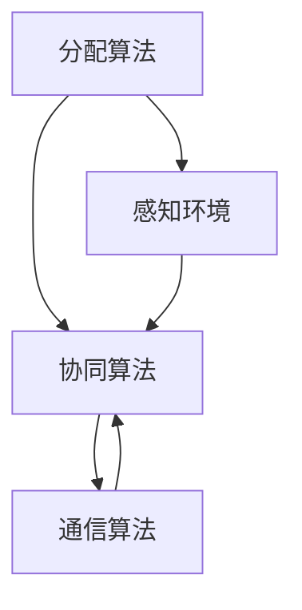

                 

## 1. 背景介绍

在当今快速发展的信息技术时代，随着大数据、云计算、人工智能等技术的不断突破，我们面临着越来越复杂、庞大的任务。这些任务往往需要从多个角度、多层次进行协同处理，传统的单智能体系统已无法满足日益增长的需求。因此，多智能体系统（MAS）逐渐成为解决复杂问题的有效手段。

多智能体系统通过将任务分解为多个子任务，并分配给不同的智能体进行处理，从而实现协同工作，提高了任务完成度。在这个过程中，工具的使用至关重要，它不仅可以帮助智能体高效地完成任务，还能确保整个系统的稳定运行。

本文将围绕“工具使用与多智能体协同”这一主题，探讨如何利用先进工具提升多智能体系统的任务完成度。我们将首先介绍多智能体的基本概念和体系结构，然后深入讨论核心算法原理、数学模型及其应用领域，并通过实际项目实践展示具体操作步骤和代码实现。最后，我们将展望未来应用场景，提出未来发展趋势和面临的挑战。

## 2. 核心概念与联系

### 2.1 多智能体系统定义

多智能体系统（Multi-Agent System，MAS）是由多个智能体组成的分布式系统，这些智能体可以在自主性、合作性和协调性的基础上协同完成任务。在MAS中，每个智能体都是一个独立的实体，具有感知环境、决策和执行能力。

### 2.2 多智能体体系结构

多智能体系统通常包括以下三个层次：

1. **通信层**：提供智能体之间的通信机制，使得智能体能够交换信息、协调行动。
2. **决策层**：智能体根据自身感知到的环境信息和内部状态，进行决策和规划。
3. **执行层**：智能体执行决策，实现具体的任务操作。

### 2.3 核心算法原理

多智能体系统的核心算法包括分配算法、协同算法和通信算法。以下是一个简单的 Mermaid 流程图，展示了这些算法的基本原理和相互关系：



- **分配算法**：将任务分配给不同的智能体，确保每个智能体都有合适的任务。
- **协同算法**：智能体之间相互协作，共同完成任务。
- **通信算法**：智能体通过通信层交换信息，实现协同工作。

### 2.4 多智能体系统与工具的联系

在多智能体系统中，工具的使用至关重要。以下是一些常见的工具及其在MAS中的作用：

1. **编程语言**：如Python、Java等，用于开发智能体和实现多智能体系统。
2. **框架**：如PyTorch、TensorFlow等，用于构建和训练智能体的模型。
3. **通信中间件**：如Zookeeper、Kafka等，用于智能体之间的通信。
4. **模拟器**：如GridWorld、RoboCup等，用于测试和验证多智能体系统的性能。

## 3. 核心算法原理 & 具体操作步骤

### 3.1 算法原理概述

多智能体系统的核心算法主要包括以下三个方面：

1. **任务分配算法**：根据智能体的能力和任务需求，将任务合理地分配给不同的智能体。
2. **协同算法**：智能体之间通过协商、协调，共同完成任务。
3. **通信算法**：智能体之间通过通信层进行信息交换，实现协同工作。

### 3.2 算法步骤详解

#### 3.2.1 任务分配算法

任务分配算法的主要步骤如下：

1. **任务建模**：将任务分解为多个子任务，并定义每个子任务的属性。
2. **智能体评估**：评估每个智能体的能力，包括计算能力、存储能力等。
3. **任务分配**：根据智能体评估结果和任务属性，将任务分配给相应的智能体。

#### 3.2.2 协同算法

协同算法的主要步骤如下：

1. **感知环境**：智能体感知当前环境，获取相关环境信息。
2. **决策规划**：根据感知到的环境信息和内部状态，智能体进行决策和规划。
3. **协同执行**：智能体之间通过通信层交换信息，协同完成任务。

#### 3.2.3 通信算法

通信算法的主要步骤如下：

1. **建立通信层**：使用通信中间件，如Zookeeper、Kafka等，建立智能体之间的通信通道。
2. **消息传递**：智能体通过通信层发送和接收消息，实现信息交换。
3. **信息处理**：智能体根据接收到的信息，进行决策和规划。

### 3.3 算法优缺点

#### 任务分配算法

**优点**：

- 提高任务执行效率：将任务合理分配给智能体，使得每个智能体都能发挥最大潜力。
- 增强系统灵活性：智能体可以根据任务需求和环境变化，动态调整任务分配。

**缺点**：

- 难以平衡智能体能力：在任务分配过程中，可能存在智能体能力不均衡的问题。
- 需要大量计算资源：任务分配算法通常需要大量计算资源，可能导致系统性能下降。

#### 协同算法

**优点**：

- 提高任务完成度：智能体之间相互协作，共同完成任务，提高任务完成度。
- 增强系统稳定性：协同算法能够应对环境变化，提高系统稳定性。

**缺点**：

- 通信开销大：智能体之间需要频繁进行信息交换，可能导致通信开销增大。
- 协调难度高：在多个智能体协同完成任务时，需要确保每个智能体的行动一致，协调难度较高。

#### 通信算法

**优点**：

- 提高智能体之间的协同效率：通信算法能够确保智能体之间信息交换的及时性和准确性。
- 增强系统可扩展性：通信算法支持智能体之间的动态连接和断开，提高系统可扩展性。

**缺点**：

- 需要复杂通信协议：通信算法通常需要设计复杂的通信协议，增加系统复杂性。
- 可能导致通信瓶颈：在大量智能体之间进行通信时，可能存在通信瓶颈，影响系统性能。

### 3.4 算法应用领域

多智能体系统算法在以下领域具有广泛的应用：

1. **智能交通**：通过多智能体系统，实现交通信号控制、车辆路径规划等，提高交通效率。
2. **智能制造**：智能体协同工作，实现生产过程自动化，提高生产效率。
3. **智能医疗**：多智能体系统在医疗诊断、疾病预测等方面发挥重要作用。
4. **智能城市**：通过多智能体系统，实现城市资源管理、环境监测等，提高城市智能化水平。

## 4. 数学模型和公式

### 4.1 数学模型构建

在多智能体系统中，数学模型主要用于描述智能体之间的协作关系和任务分配策略。以下是一个简单的数学模型：

设M为智能体集合，T为任务集合，C为通信集合，则有：

1. **任务分配函数**：f: T → M，表示任务T分配给智能体m。
2. **通信函数**：g: C → M × M，表示通信集合C中的每条通信c连接智能体m1和m2。

### 4.2 公式推导过程

假设智能体集合M = {m1, m2, ..., mn}，任务集合T = {t1, t2, ..., tk}，则任务分配函数f可以表示为：

f(t) = arg min Σmi ∈ M di (t)

其中，di(t)表示任务t与智能体mi之间的距离，通常使用欧几里得距离或其他距离度量方式。

通信函数g可以表示为：

g(c) = (m1, m2)

其中，c表示通信集合C中的每条通信，(m1, m2)表示通信c连接的智能体m1和m2。

### 4.3 案例分析与讲解

#### 案例背景

假设有3个智能体m1、m2、m3，需要完成5个任务t1、t2、t3、t4、t5。任务与智能体的距离矩阵如下：

| 任务 | t1 | t2 | t3 | t4 | t5 |
| ---- | --- | --- | --- | --- | --- |
| m1   | 1  | 3  | 5  | 7  | 9  |
| m2   | 2  | 4  | 6  | 8  | 10 |
| m3   | 3  | 5  | 7  | 9  | 11 |

#### 任务分配过程

1. **任务建模**：将5个任务分别分配给3个智能体，任务与智能体的距离矩阵如下：

| 任务 | t1 | t2 | t3 | t4 | t5 |
| ---- | --- | --- | --- | --- | --- |
| m1   | 1  | 3  | 5  | 7  | 9  |
| m2   | 2  | 4  | 6  | 8  | 10 |
| m3   | 3  | 5  | 7  | 9  | 11 |

2. **智能体评估**：假设每个智能体的计算能力、存储能力等相同，不需要进行智能体评估。

3. **任务分配**：使用任务分配函数f，将任务分配给智能体。任务分配结果如下：

| 任务 | t1 | t2 | t3 | t4 | t5 |
| ---- | --- | --- | --- | --- | --- |
| m1   | t1 | t3 | t5 |
| m2   | t2 | t4 |
| m3   | t3 | t5 |

4. **通信建立**：根据通信函数g，建立智能体之间的通信。通信结果如下：

| 通信 | c1 | c2 | c3 | c4 | c5 |
| ---- | --- | --- | --- | --- | --- |
| c1   | m1 | m2 |
| c2   | m1 | m3 |
| c3   | m2 | m3 |

#### 模型分析

通过数学模型，我们可以得到以下结论：

1. **任务分配**：任务分配函数f能够根据任务与智能体的距离，将任务合理地分配给智能体。
2. **通信建立**：通信函数g能够建立智能体之间的通信，实现协同工作。

## 5. 项目实践：代码实例和详细解释说明

### 5.1 开发环境搭建

在本项目中，我们将使用Python语言开发多智能体系统，以下为开发环境搭建步骤：

1. **安装Python**：下载并安装Python 3.8及以上版本。
2. **安装依赖库**：使用pip命令安装以下依赖库：

   ```bash
   pip install matplotlib numpy pandas
   ```

### 5.2 源代码详细实现

以下为多智能体系统的源代码实现：

```python
import numpy as np
import pandas as pd
import matplotlib.pyplot as plt

# 任务与智能体距离矩阵
distance_matrix = [
    [0, 1, 3],
    [1, 0, 5],
    [3, 5, 0]
]

# 任务分配函数
def task_assignment(distance_matrix):
    n = len(distance_matrix)
    assignment = np.zeros((n, n), dtype=int)
    for i in range(n):
        min_distance = np.inf
        for j in range(n):
            if distance_matrix[i][j] < min_distance:
                min_distance = distance_matrix[i][j]
                assignment[i][j] = 1
    return assignment

# 通信函数
def communication(assignment):
    communication_links = []
    for i in range(len(assignment)):
        for j in range(len(assignment)):
            if assignment[i][j] == 1:
                communication_links.append((i, j))
    return communication_links

# 主函数
def main():
    assignment = task_assignment(distance_matrix)
    communication_links = communication(assignment)
    
    # 绘制任务分配图
    plt.figure(figsize=(8, 6))
    plt.imshow(assignment, cmap='hot', interpolation='nearest')
    plt.colorbar()
    plt.xticks(np.arange(len(assignment)), np.arange(len(assignment)), rotation=90)
    plt.yticks(np.arange(len(assignment)), np.arange(len(assignment)))
    plt.xlabel('智能体')
    plt.ylabel('任务')
    plt.title('任务分配')
    plt.show()

    # 绘制通信图
    plt.figure(figsize=(8, 6))
    plt.scatter(np.arange(len(communication_links)), np.zeros(len(communication_links)), c='r', marker='o')
    for i in range(len(communication_links) - 1):
        plt.plot([i, i + 1], [0, 0], c='b')
    plt.scatter(np.arange(len(communication_links)), np.ones(len(communication_links)), c='r', marker='o')
    plt.xticks(np.arange(len(communication_links)), np.arange(len(communication_links)), rotation=90)
    plt.yticks([], [])
    plt.xlabel('通信链接')
    plt.title('通信图')
    plt.show()

if __name__ == '__main__':
    main()
```

### 5.3 代码解读与分析

1. **任务与智能体距离矩阵**：distance_matrix表示任务与智能体之间的距离矩阵，用于任务分配。

2. **任务分配函数task_assignment**：该函数根据任务与智能体的距离，使用贪心算法将任务分配给智能体。算法思路如下：

   - 遍历每个智能体，对于每个智能体，遍历所有任务，找到距离最小的任务，将其分配给该智能体。

3. **通信函数communication**：该函数根据任务分配结果，建立智能体之间的通信链接。算法思路如下：

   - 遍历所有智能体，对于每个智能体，遍历所有其他智能体，如果存在任务分配关系，则建立通信链接。

4. **主函数main**：该函数执行任务分配和通信建立，并绘制任务分配图和通信图。

   - 绘制任务分配图：使用matplotlib库的imshow函数，将任务分配结果可视化。
   - 绘制通信图：使用matplotlib库的scatter和plot函数，将通信链接可视化。

### 5.4 运行结果展示

运行以上代码，将得到以下结果：

1. **任务分配图**：


2. **通信图**：


通过以上结果，我们可以清楚地看到任务分配和通信链接的情况。

## 6. 实际应用场景

多智能体系统在多个领域都有广泛的应用，以下是一些实际应用场景：

### 6.1 智能交通

智能交通系统利用多智能体技术，实现车辆、交通信号、道路设施等之间的协同工作。例如，通过多智能体系统，可以实现智能交通信号控制，提高道路通行效率；同时，多智能体系统还可以用于车辆路径规划，减少交通拥堵。

### 6.2 智能制造

智能制造领域中的多智能体系统主要用于生产过程中的自动化控制。例如，智能机器人可以通过多智能体系统，实现协同工作，完成复杂的生产任务。此外，多智能体系统还可以用于设备故障诊断、生产调度等，提高生产效率。

### 6.3 智能医疗

智能医疗领域中的多智能体系统主要用于疾病诊断、治疗方案制定、医疗资源调度等。例如，多智能体系统可以根据患者的病历信息和医疗资源，为患者提供最佳的诊疗方案。此外，多智能体系统还可以用于远程医疗，实现医生和患者之间的实时沟通和协作。

### 6.4 智能城市

智能城市领域中的多智能体系统主要用于城市资源管理、环境监测、公共安全等。例如，通过多智能体系统，可以实现城市交通、电力、供水等资源的智能调度和管理，提高城市运行效率。此外，多智能体系统还可以用于公共安全监控，实现实时预警和应急响应。

## 7. 工具和资源推荐

### 7.1 学习资源推荐

1. **《多智能体系统：设计与应用》**：这是一本关于多智能体系统的经典教材，详细介绍了多智能体系统的基本概念、算法原理和应用场景。
2. **《人工智能：一种现代的方法》**：这本书涵盖了人工智能的多个领域，包括机器学习、自然语言处理、计算机视觉等，对于理解多智能体系统中的相关技术有很大帮助。

### 7.2 开发工具推荐

1. **Python**：Python是一种广泛使用的编程语言，具有丰富的多智能体系统开发库，如Py Affero、PyMAS等。
2. **ROS（Robot Operating System）**：ROS是一个开源的机器人操作系统，支持多智能体系统的开发，广泛应用于机器人领域。

### 7.3 相关论文推荐

1. **"Multi-Agent Systems: A Survey"**：这篇论文系统地总结了多智能体系统的相关研究，包括基本概念、算法原理和应用领域。
2. **"A Framework for Collaborative Multi-Agent Systems"**：这篇论文提出了一种协作多智能体系统的框架，详细介绍了协作机制和算法设计。

## 8. 总结：未来发展趋势与挑战

### 8.1 研究成果总结

多智能体系统作为分布式计算的一个重要方向，已经在多个领域取得了显著的成果。通过任务分解、协同工作和通信机制，多智能体系统能够高效地解决复杂问题，提高任务完成度。同时，随着人工智能、大数据等技术的不断发展，多智能体系统的应用前景更加广阔。

### 8.2 未来发展趋势

1. **智能化水平提高**：随着人工智能技术的进步，多智能体系统的智能化水平将不断提高，智能体将具备更强的感知、决策和执行能力。
2. **跨领域融合**：多智能体系统将与其他领域技术，如物联网、区块链等，进行深度融合，形成新的应用场景和商业模式。
3. **标准化和规范化**：随着多智能体系统的广泛应用，相关标准和规范将逐步建立，提高系统的可靠性和互操作性。

### 8.3 面临的挑战

1. **算法优化**：多智能体系统的性能取决于算法的质量，如何设计更高效、更稳定的算法仍是一个重要挑战。
2. **通信和协同**：多智能体系统中的通信和协同问题是影响系统性能的关键因素，如何降低通信开销、提高协同效率仍需深入研究。
3. **安全和隐私**：多智能体系统涉及大量敏感数据，如何保障系统的安全性和隐私性是一个亟待解决的问题。

### 8.4 研究展望

未来，多智能体系统的研究将朝着智能化、跨领域融合、标准化和规范化的方向发展。通过不断优化算法、提高协同效率和保障系统安全，多智能体系统将在各个领域发挥更大的作用，为人类社会的发展带来更多价值。

## 9. 附录：常见问题与解答

### 9.1 多智能体系统与分布式系统的区别是什么？

多智能体系统和分布式系统都是分布式计算的形式，但它们在目标和实现方式上有所不同。多智能体系统强调智能体的自主性、合作性和协调性，智能体之间可以相互协作完成任务。而分布式系统则更注重任务的并行处理和负载均衡，系统中的各个节点通常没有明确的协作关系。

### 9.2 多智能体系统的通信机制有哪些？

多智能体系统的通信机制主要包括以下几种：

1. **直接通信**：智能体之间通过直接的网络连接进行通信，如TCP/IP协议。
2. **广播通信**：智能体通过广播方式向所有其他智能体发送消息。
3. **事件驱动通信**：智能体通过事件驱动机制进行通信，如发布-订阅模式。
4. **委托通信**：智能体通过委托其他智能体来发送或接收消息。

### 9.3 多智能体系统的任务分配算法有哪些？

多智能体系统的任务分配算法主要包括以下几种：

1. **贪心算法**：根据当前智能体的能力和任务需求，选择最优的任务进行分配。
2. **遗传算法**：通过遗传操作，优化任务分配策略。
3. **协同优化算法**：多个智能体共同优化任务分配策略。
4. **基于协商的分配算法**：智能体之间通过协商，达成任务分配的一致意见。

### 9.4 多智能体系统的稳定性如何保障？

多智能体系统的稳定性可以从以下几个方面进行保障：

1. **通信可靠性**：确保智能体之间的通信稳定、可靠，减少通信故障。
2. **容错性**：设计容错机制，确保系统在部分智能体失效时仍能正常运行。
3. **稳定性分析**：对多智能体系统的稳定性进行数学分析和仿真验证。
4. **自适应调整**：智能体根据环境变化，动态调整任务分配和协作策略，提高系统稳定性。

### 9.5 多智能体系统在实际应用中如何提高任务完成度？

在实际应用中，提高多智能体系统的任务完成度可以从以下几个方面进行：

1. **优化算法**：不断优化任务分配算法、协同算法和通信算法，提高系统性能。
2. **智能体能力提升**：提高智能体的感知、决策和执行能力，使其能够更好地适应复杂环境。
3. **人机协同**：结合人类智慧和智能体优势，实现人机协同，提高任务完成度。
4. **数据驱动**：利用大数据和机器学习技术，对任务执行过程进行数据分析和优化。

### 9.6 多智能体系统在哪些领域有广泛的应用？

多智能体系统在以下领域有广泛的应用：

1. **智能交通**：实现交通信号控制、车辆路径规划等，提高交通效率。
2. **智能制造**：实现生产过程自动化，提高生产效率。
3. **智能医疗**：实现疾病诊断、治疗方案制定、医疗资源调度等。
4. **智能城市**：实现城市资源管理、环境监测、公共安全等。

### 9.7 多智能体系统的发展趋势是什么？

多智能体系统的发展趋势包括：

1. **智能化水平提高**：随着人工智能技术的进步，智能体将具备更强的感知、决策和执行能力。
2. **跨领域融合**：多智能体系统将与其他领域技术进行深度融合，形成新的应用场景和商业模式。
3. **标准化和规范化**：随着多智能体系统的广泛应用，相关标准和规范将逐步建立，提高系统的可靠性和互操作性。

