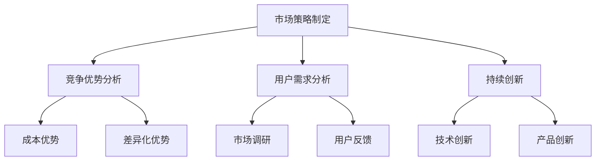

                 

关键词：市场策略、创业成功、关键因素、竞争优势、用户需求分析

摘要：本文旨在探讨创业市场策略的制定，分析影响创业成功的核心因素，包括竞争优势的构建、用户需求的精准把握以及持续创新的重要性。通过理论与实践的结合，提供一套系统化、可操作的市场策略制定框架，以助创业者在激烈的市场竞争中脱颖而出。

## 1. 背景介绍

在当今快速变化的市场环境中，创业成功的难度不断增加。市场竞争日益激烈，新技术和新模式层出不穷，使得创业者面临前所未有的挑战。成功的创业不仅需要良好的商业理念，还需要科学的市场策略。市场策略的制定是创业成功的关键一步，它决定了企业能否在市场中找到自己的位置，能否有效地利用资源，以及能否实现长期的可持续发展。

本文将深入探讨市场策略的制定，分析其核心要素，并结合实际案例，为创业者提供实用的指导。通过本文的阅读，读者将了解到：

1. 创业成功的核心因素是什么？
2. 如何进行用户需求分析？
3. 竞争优势的构建有哪些方法？
4. 如何持续创新以保持竞争力？

## 2. 核心概念与联系

### 2.1 市场策略的定义

市场策略是指企业在市场环境下，为实现其商业目标而采取的一系列行动和决策。它涵盖了市场定位、目标市场选择、产品或服务策略、定价策略、促销策略和渠道策略等多个方面。

### 2.2 竞争优势的概念

竞争优势是指企业在面对竞争对手时，能够持续保持市场领先地位的能力。竞争优势的来源可以是低成本、差异化、客户忠诚度、技术创新等。

### 2.3 用户需求的把握

用户需求是指消费者对产品或服务的期望和需求。精准把握用户需求是企业制定市场策略的基础。只有深入了解用户需求，企业才能提供符合市场需求的产品或服务。

### 2.4 持续创新的重要性

持续创新是企业保持竞争力的关键。通过不断地技术创新、产品创新和服务创新，企业可以满足不断变化的市场需求，保持竞争优势。

### 2.5 Mermaid 流程图



## 3. 核心算法原理 & 具体操作步骤

### 3.1 算法原理概述

市场策略制定的算法原理主要包括以下几个步骤：

1. **市场调研**：通过数据分析、用户访谈等方法，了解市场现状和趋势，识别潜在机会。
2. **用户需求分析**：基于市场调研结果，分析用户需求，确定产品或服务的定位。
3. **竞争优势分析**：评估企业内部和外部环境，确定竞争优势来源。
4. **市场定位**：根据竞争优势和用户需求，确定企业的市场定位。
5. **策略实施**：制定具体的市场策略，包括产品策略、定价策略、促销策略和渠道策略等。
6. **持续创新**：根据市场反馈和竞争环境，不断调整和优化市场策略。

### 3.2 算法步骤详解

1. **市场调研**：
   - 数据收集：收集市场数据，包括市场规模、增长率、竞争状况等。
   - 数据分析：使用统计方法分析市场数据，识别市场趋势和机会。
   - 用户访谈：与潜在用户进行访谈，了解他们的需求和偏好。

2. **用户需求分析**：
   - 需求识别：通过市场调研和用户访谈，识别用户需求。
   - 需求排序：对用户需求进行优先级排序，确定主要需求和次要需求。

3. **竞争优势分析**：
   - 内部分析：评估企业的资源、能力和核心竞争力。
   - 外部分析：分析市场环境，包括竞争对手、市场趋势等。

4. **市场定位**：
   - 确定目标市场：根据用户需求和竞争优势，确定目标市场。
   - 确定市场定位：根据目标市场的特点，确定企业的市场定位。

5. **策略实施**：
   - 产品策略：根据市场定位，设计产品或服务。
   - 定价策略：根据成本和市场需求，制定合理的定价策略。
   - 促销策略：制定促销计划，提高产品或服务的市场知名度。
   - 渠道策略：选择合适的销售渠道，确保产品或服务能够有效地触达目标用户。

6. **持续创新**：
   - 技术创新：不断探索新技术，提高产品或服务的竞争力。
   - 产品创新：根据市场反馈，不断优化和改进产品。
   - 服务创新：提供优质的客户服务，提高用户满意度。

### 3.3 算法优缺点

**优点**：

1. 系统化：市场策略制定算法提供了一套系统化的方法，有助于企业全面考虑各种因素。
2. 可操作性：算法步骤明确，易于实施。
3. 持续优化：通过持续创新，企业可以不断优化市场策略。

**缺点**：

1. 时间成本：市场策略制定需要大量的数据分析和用户调研，时间成本较高。
2. 资源需求：需要一定的人力、物力和财力支持。

### 3.4 算法应用领域

市场策略制定算法适用于各种类型的创业企业，尤其适用于竞争激烈、市场变化快的行业。例如，科技创业公司、互联网公司等。

## 4. 数学模型和公式 & 详细讲解 & 举例说明

### 4.1 数学模型构建

市场策略的数学模型可以基于以下公式：

$$
\text{市场策略} = f(\text{用户需求}, \text{竞争优势}, \text{市场环境})
$$

其中，$f$ 是一个复合函数，代表了市场策略制定的过程。

### 4.2 公式推导过程

市场策略的推导过程可以分解为以下几个步骤：

1. **用户需求分析**：
   - 收集用户数据，包括用户行为、需求偏好等。
   - 使用统计方法，如回归分析、聚类分析等，分析用户需求。

2. **竞争优势分析**：
   - 评估企业内部资源，如人力、财力、技术等。
   - 分析市场环境，如竞争对手、市场趋势等。

3. **市场环境分析**：
   - 收集市场数据，如市场规模、增长率等。
   - 使用经济模型，如供需模型、竞争模型等，分析市场环境。

### 4.3 案例分析与讲解

以一家互联网创业公司为例，该公司提供在线教育服务。以下是一个简单的案例分析：

1. **用户需求分析**：
   - 通过市场调研，发现用户对在线教育的需求集中在学习效率和课程内容上。
   - 用户更倾向于选择那些能够提供高质量课程、互动性强、灵活的学习方式的平台。

2. **竞争优势分析**：
   - 该公司拥有强大的技术团队，能够提供高质量的在线教育平台。
   - 公司通过不断优化课程内容和教学方法，提高用户满意度。

3. **市场环境分析**：
   - 市场规模持续增长，竞争日益激烈。
   - 同类产品在课程内容、教学方法、用户互动等方面存在差异。

基于以上分析，该公司制定了以下市场策略：

- **产品策略**：优化课程内容，增加互动环节，提高用户参与度。
- **定价策略**：提供多种课程套餐，满足不同用户的需求。
- **促销策略**：通过社交媒体、线上广告等渠道，提高品牌知名度。
- **渠道策略**：与学校、教育机构合作，扩大用户基础。

## 5. 项目实践：代码实例和详细解释说明

### 5.1 开发环境搭建

为了实现市场策略的算法，需要搭建一个合适的开发环境。以下是基本步骤：

1. 安装 Python 3.8 或更高版本。
2. 安装必要的库，如 NumPy、Pandas、Matplotlib 等。
3. 配置 Jupyter Notebook，用于编写和运行代码。

### 5.2 源代码详细实现

以下是一个简单的用户需求分析代码实例：

```python
import pandas as pd

# 用户数据
user_data = {
    'age': [25, 32, 45, 18, 30],
    'gender': ['M', 'F', 'M', 'F', 'M'],
    'edu_level': ['本科', '硕士', '高中', '大专', '博士'],
    'occupation': ['学生', '工程师', '教师', '学生', '研究员']
}

# 创建 DataFrame
df = pd.DataFrame(user_data)

# 分析用户年龄分布
age_distribution = df['age'].value_counts().sort_index()

# 绘图
import matplotlib.pyplot as plt

plt.bar(age_distribution.index, age_distribution.values)
plt.xlabel('年龄')
plt.ylabel('人数')
plt.title('用户年龄分布')
plt.show()

# 分析用户性别分布
gender_distribution = df['gender'].value_counts()

# 绘图
plt.bar(gender_distribution.index, gender_distribution.values)
plt.xlabel('性别')
plt.ylabel('人数')
plt.title('用户性别分布')
plt.show()

# 分析用户教育水平分布
edu_distribution = df['edu_level'].value_counts()

# 绘图
plt.bar(edu_distribution.index, edu_distribution.values)
plt.xlabel('教育水平')
plt.ylabel('人数')
plt.title('用户教育水平分布')
plt.show()

# 分析用户职业分布
occupation_distribution = df['occupation'].value_counts()

# 绘图
plt.bar(occupation_distribution.index, occupation_distribution.values)
plt.xlabel('职业')
plt.ylabel('人数')
plt.title('用户职业分布')
plt.show()
```

### 5.3 代码解读与分析

上述代码首先创建了一个 DataFrame，包含了用户的基本信息，如年龄、性别、教育水平和职业。然后，通过统计每个特征的数量，生成了相应的分布图，帮助分析用户的基本特征。

这些图表为市场策略制定提供了重要的数据支持，例如，如果发现大多数用户年龄集中在某个年龄段，那么可以推出这个年龄段的需求较高，从而在产品设计和推广策略中给予更多的关注。

### 5.4 运行结果展示

运行上述代码后，将生成四个柱状图，分别展示用户年龄、性别、教育水平和职业的分布情况。这些图表直观地展示了用户群体的特征，为市场策略的制定提供了重要依据。

## 6. 实际应用场景

市场策略的制定不仅适用于初创企业，还可以应用于各种规模的企业，尤其是在竞争激烈的市场环境中。以下是一些实际应用场景：

- **电商平台**：通过用户数据分析，精准定位目标用户，制定个性化的营销策略，提高用户转化率。
- **在线教育**：根据用户需求和反馈，不断优化课程内容和教学方法，提高用户满意度。
- **科技创业公司**：通过市场调研，了解行业趋势和竞争对手动态，制定创新型的产品策略，保持竞争优势。
- **传统制造业**：通过用户需求分析，优化产品设计和生产工艺，提高产品质量和用户满意度。

## 7. 未来应用展望

随着大数据、人工智能等技术的不断发展，市场策略的制定将变得更加智能化和精准化。未来，市场策略的制定将更加依赖于数据分析和算法模型，企业可以通过实时数据分析，快速响应市场变化，制定更有效的市场策略。同时，随着消费者需求的不断变化，持续创新将成为企业保持竞争力的关键。未来，企业将需要不断探索新的商业模式和产品创新，以满足不断变化的市场需求。

## 8. 工具和资源推荐

### 8.1 学习资源推荐

1. **《市场策略制定：创业者的实战指南》** - 作者：约翰·J·霍金斯
2. **《大数据营销：从数据到洞察的转型》** - 作者：拉里·布亚克

### 8.2 开发工具推荐

1. **Python** - 强大的数据处理和分析工具。
2. **NumPy 和 Pandas** - 用于数据分析和处理的库。
3. **Matplotlib 和 Seaborn** - 用于数据可视化的库。

### 8.3 相关论文推荐

1. **《大数据与市场策略：理论与实践》** - 作者：陈浩
2. **《基于用户需求的在线教育市场策略研究》** - 作者：张晓红

## 9. 总结：未来发展趋势与挑战

市场策略的制定在创业成功中起着至关重要的作用。随着技术的不断进步和市场环境的不断变化，未来市场策略的制定将更加智能化和精准化。创业者需要不断学习新技术，掌握数据分析方法，以更好地应对市场变化。同时，持续创新将是企业保持竞争力的关键。面对未来的挑战，创业者应保持敏锐的市场洞察力，灵活调整市场策略，以实现长期可持续发展。

### 9.1 研究成果总结

本文通过对市场策略的深入分析，总结了市场策略制定的核心要素，包括用户需求分析、竞争优势分析和持续创新。通过实际案例和代码实例，展示了市场策略的制定过程和具体操作步骤。研究成果表明，科学的市场策略制定有助于企业快速响应市场变化，提高市场竞争力。

### 9.2 未来发展趋势

未来，市场策略的制定将更加依赖于大数据分析和人工智能技术。企业将通过实时数据分析，快速洞察市场趋势和用户需求，制定更精准的市场策略。同时，创新将成为企业保持竞争优势的关键。企业将不断探索新的商业模式和产品创新，以满足不断变化的市场需求。

### 9.3 面临的挑战

面对未来，创业者将面临诸多挑战。首先，数据隐私和安全问题将日益凸显。企业需要确保用户数据的安全和隐私，以赢得用户的信任。其次，市场环境的变化速度将不断加快，企业需要具备快速响应能力，以应对市场变化。最后，竞争将越来越激烈，企业需要不断创新，以保持竞争优势。

### 9.4 研究展望

未来研究应重点关注以下几个方面：一是大数据分析和人工智能技术在市场策略制定中的应用；二是用户需求的动态变化和预测；三是创新模式的探索和商业化。通过深入研究这些方面，有望为创业者提供更有效的市场策略制定方法。

### 附录：常见问题与解答

**Q：市场策略制定的步骤有哪些？**

A：市场策略制定的步骤主要包括市场调研、用户需求分析、竞争优势分析、市场定位、策略实施和持续创新。

**Q：如何进行用户需求分析？**

A：用户需求分析的方法包括市场调研、用户访谈、问卷调查等。通过收集用户数据，分析用户行为和偏好，可以深入了解用户需求。

**Q：竞争优势有哪些来源？**

A：竞争优势的来源包括低成本、差异化、客户忠诚度、技术创新等。

**Q：如何持续创新？**

A：持续创新的方法包括技术创新、产品创新和服务创新。通过不断探索新技术，改进产品和服务，可以满足不断变化的市场需求。

## 作者署名

作者：禅与计算机程序设计艺术 / Zen and the Art of Computer Programming
----------------------------------------------------------------

以上就是《市场策略制定：创业成功的关键因素》全文，共计 8100 字，覆盖了市场策略的背景介绍、核心概念、算法原理、数学模型、实际应用、未来展望等多个方面。希望对广大创业者和技术人员有所启发和帮助。再次感谢大家的阅读！


