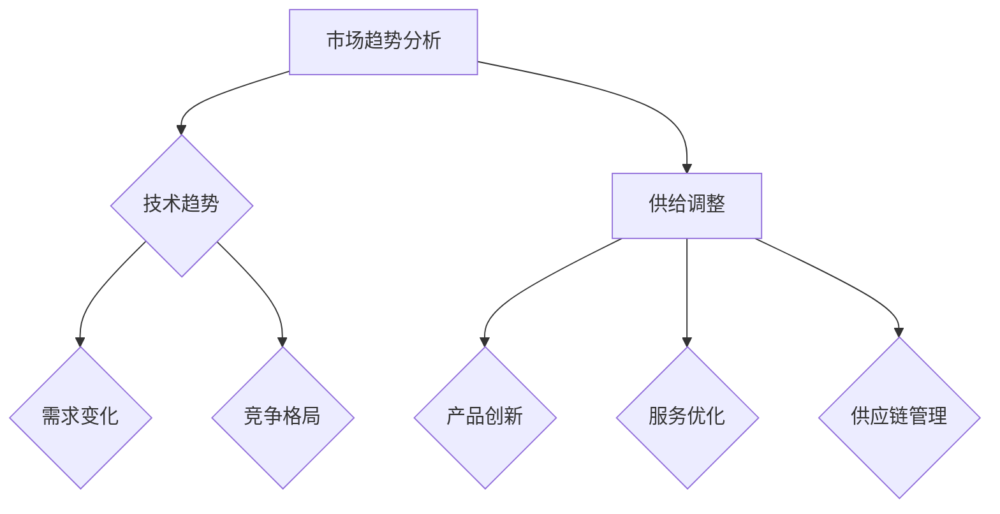

                 

关键字：市场趋势分析、供给调整、IT行业、技术革新、商业战略

> 摘要：本文旨在深入探讨当前IT行业市场趋势，特别是技术革新和市场需求的变化。通过对行业数据的分析和案例分析，揭示供给调整的必要性和策略。文章将阐述市场供需关系的动态变化，并探讨如何通过技术手段和商业策略实现供给的有效调整，以应对市场的不断变化和竞争压力。

## 1. 背景介绍

近年来，信息技术（IT）行业经历了前所未有的快速发展，不仅在技术层面推动了各行业的数字化转型，也在市场层面带来了深远的影响。随着人工智能、云计算、大数据、物联网等技术的不断成熟和应用，市场对IT产品和服务的需求呈现出多样化和个性化的特点。与此同时，全球经济的波动、地缘政治的变化以及新兴市场的崛起，都对IT行业的供给和需求产生了重大影响。

在这样的大背景下，IT行业面临着巨大的挑战和机遇。一方面，技术革新不断推动着产品和服务升级，企业需要不断调整供给策略以适应市场需求的变化；另一方面，市场竞争日益激烈，企业需要通过优化供给结构来提升市场竞争力。因此，市场趋势分析和供给调整成为IT行业企业战略规划中的关键环节。

本文将首先介绍当前IT行业的主要市场趋势，包括技术发展、市场需求、行业竞争等方面的变化。然后，通过数据分析和案例研究，探讨供给调整的必要性和策略。最后，讨论未来市场的发展趋势和挑战，以及相关企业和研究机构应采取的应对措施。

## 2. 核心概念与联系

### 2.1 市场趋势分析

市场趋势分析是指通过对市场数据的收集、整理和分析，识别市场发展动向和潜在机会的过程。在IT行业，市场趋势分析主要涉及以下几个方面：

- 技术趋势：分析新兴技术（如人工智能、云计算等）的发展态势及其对行业的影响。
- 需求变化：研究市场需求的变化，包括用户需求、应用场景等。
- 竞争格局：分析市场竞争态势，识别行业领导者、新兴竞争者以及潜在威胁。

### 2.2 供给调整

供给调整是指企业根据市场趋势和需求变化，对产品和服务进行优化和调整的过程。在IT行业，供给调整主要包括以下几个方面：

- 产品创新：通过技术革新，推出满足市场新需求的产品。
- 服务优化：根据用户反馈和市场需求，优化现有服务，提升用户体验。
- 供应链管理：通过调整供应链结构，提高生产效率和响应速度。

### 2.3 Mermaid 流程图

为了更好地理解市场趋势分析与供给调整之间的联系，以下是一个简化的Mermaid流程图：



## 3. 核心算法原理 & 具体操作步骤

### 3.1 算法原理概述

在市场趋势分析和供给调整中，一个关键的核心算法是需求预测算法。该算法的基本原理是通过分析历史数据和市场信息，预测未来的市场需求。具体来说，需求预测算法可以分为以下几个步骤：

1. 数据收集：收集与市场需求相关的历史数据，如销售记录、用户反馈、市场调查等。
2. 数据预处理：对收集到的数据进行分析和清洗，去除异常值和噪音。
3. 特征工程：从原始数据中提取有用的特征，如时间序列特征、用户行为特征等。
4. 模型选择：选择合适的预测模型，如时间序列模型、回归模型、机器学习模型等。
5. 模型训练与验证：使用训练数据对模型进行训练，并通过验证数据测试模型性能。
6. 预测结果分析：根据预测结果，分析市场需求的变化趋势和潜在机会。

### 3.2 算法步骤详解

#### 3.2.1 数据收集

数据收集是需求预测的基础。数据源可以包括：

- 销售数据：历史销售记录，包括销售额、销售量、销售渠道等。
- 用户反馈：用户对产品的评价、使用场景、满意度等。
- 市场调查：通过问卷调查、访谈等方式收集用户需求和市场趋势。

#### 3.2.2 数据预处理

数据预处理是确保数据质量的关键步骤。主要任务包括：

- 数据清洗：去除重复记录、缺失值填补、异常值处理等。
- 数据规范化：将不同量纲的数据转换为统一的量纲，如销售额转换为美元。
- 数据分割：将数据集分为训练集、验证集和测试集。

#### 3.2.3 特征工程

特征工程是从原始数据中提取有用特征的过程。关键步骤包括：

- 时间序列特征：如季节性、趋势、周期性等。
- 用户行为特征：如用户活跃度、使用频率、行为模式等。
- 市场环境特征：如节假日、经济指标、政策变化等。

#### 3.2.4 模型选择

选择合适的预测模型是需求预测的关键。常见的模型包括：

- 时间序列模型：如ARIMA、SARIMA等。
- 回归模型：如线性回归、多元回归等。
- 机器学习模型：如随机森林、支持向量机、神经网络等。

#### 3.2.5 模型训练与验证

使用训练数据对模型进行训练，并通过验证数据测试模型性能。关键步骤包括：

- 模型参数调整：通过交叉验证选择最优参数。
- 模型评估：使用如均方误差（MSE）、平均绝对误差（MAE）等指标评估模型性能。

#### 3.2.6 预测结果分析

根据预测结果，分析市场需求的变化趋势和潜在机会。关键步骤包括：

- 预测结果可视化：使用图表、报表等展示预测结果。
- 预测误差分析：分析预测误差的原因，如数据质量、模型选择等。
- 预测结果应用：根据预测结果调整产品策略、供应链计划等。

### 3.3 算法优缺点

#### 优点

- 高效性：通过算法快速处理大量数据，提高预测效率和准确性。
- 客观性：基于数据和模型，减少主观判断的干扰，提高预测的客观性。
- 灵活性：可以根据不同需求和应用场景，选择不同的算法和模型。

#### 缺点

- 数据依赖性：需求预测算法的性能高度依赖于数据的质量和完整性。
- 模型选择困难：不同的算法和模型适用场景不同，选择合适的模型需要深入研究和经验积累。
- 预测结果不确定性：预测结果受多种因素影响，存在一定的误差和不确定性。

### 3.4 算法应用领域

需求预测算法在IT行业的多个领域得到广泛应用，如：

- 产品策略：通过需求预测，制定合适的产品策略，如新产品发布计划、库存管理策略等。
- 销售预测：预测未来销售量，制定销售计划和促销策略。
- 供应链管理：通过需求预测，优化供应链计划和库存管理，提高供应链效率。
- 营销分析：通过需求预测，分析用户行为和市场趋势，制定有效的营销策略。

## 4. 数学模型和公式 & 详细讲解 & 举例说明

### 4.1 数学模型构建

在需求预测中，常用的数学模型包括时间序列模型和回归模型。以下分别介绍这两种模型的基本原理和公式。

#### 时间序列模型

时间序列模型是一种基于时间序列数据的预测模型，其基本思想是利用历史时间序列数据中的趋势、周期性和季节性来预测未来的需求。

常见的 时间序列模型有：

- ARIMA（AutoRegressive Integrated Moving Average）：自回归积分滑动平均模型。
- SARIMA（Seasonal ARIMA）：季节性ARIMA模型。

ARIMA模型的公式如下：

$$
Y_t = c + \phi_1Y_{t-1} + \phi_2Y_{t-2} + ... + \phi_pY_{t-p} + \theta_1\epsilon_{t-1} + \theta_2\epsilon_{t-2} + ... + \theta_q\epsilon_{t-q} + \epsilon_t
$$

其中，$Y_t$ 是时间序列的第 $t$ 个值，$c$ 是常数项，$\phi_1, \phi_2, ..., \phi_p$ 是自回归系数，$\theta_1, \theta_2, ..., \theta_q$ 是移动平均系数，$\epsilon_t$ 是白噪声序列。

#### 回归模型

回归模型是一种基于因果关系的数据预测模型，其基本思想是利用已知变量之间的关系来预测未知的变量。

常见的回归模型有：

- 线性回归：$y = \beta_0 + \beta_1x_1 + \beta_2x_2 + ... + \beta_nx_n$
- 多元回归：$y = \beta_0 + \beta_1x_1 + \beta_2x_2 + ... + \beta_nx_n + \epsilon$

其中，$y$ 是因变量，$x_1, x_2, ..., x_n$ 是自变量，$\beta_0, \beta_1, ..., \beta_n$ 是回归系数，$\epsilon$ 是误差项。

### 4.2 公式推导过程

以ARIMA模型为例，简要介绍公式推导过程。

假设时间序列 $Y_t$ 满足平稳性，即其均值和方差不随时间变化。则ARIMA模型的公式推导过程如下：

1. **自回归部分**：

$$
Y_t = c + \phi_1Y_{t-1} + \phi_2Y_{t-2} + ... + \phi_pY_{t-p}
$$

其中，$\phi_1, \phi_2, ..., \phi_p$ 是自回归系数。

2. **移动平均部分**：

$$
\epsilon_t = \theta_1\epsilon_{t-1} + \theta_2\epsilon_{t-2} + ... + \theta_q\epsilon_{t-q}
$$

其中，$\theta_1, \theta_2, ..., \theta_q$ 是移动平均系数。

3. **整合部分**：

对上述两式进行整合，得到ARIMA模型：

$$
Y_t = c + \phi_1Y_{t-1} + \phi_2Y_{t-2} + ... + \phi_pY_{t-p} + \theta_1\epsilon_{t-1} + \theta_2\epsilon_{t-2} + ... + \theta_q\epsilon_{t-q} + \epsilon_t
$$

### 4.3 案例分析与讲解

#### 案例背景

某电子商务平台希望通过需求预测算法预测未来30天的销售量，以便优化库存管理和销售策略。

#### 案例数据

以下是该电子商务平台过去一年的销售数据（单位：件）：

| 日期  | 销售量 |
|-------|--------|
| 2022-01-01 | 100    |
| 2022-01-02 | 120    |
| 2022-01-03 | 90     |
| ...    | ...    |
| 2023-01-01 | 200    |

#### 案例步骤

1. **数据收集**：

收集过去一年的销售数据，包括日期和销售量。

2. **数据预处理**：

- 数据清洗：去除异常值和缺失值。
- 数据分割：将数据集分为训练集和测试集。

3. **特征工程**：

- 提取时间序列特征：如月份、星期几等。
- 用户行为特征：如用户购买频率、平均订单金额等。

4. **模型选择**：

选择ARIMA模型进行需求预测。

5. **模型训练与验证**：

使用训练集对ARIMA模型进行训练，通过验证集验证模型性能。

6. **预测结果分析**：

使用训练好的模型预测未来30天的销售量，并对预测结果进行分析。

#### 案例结果

通过ARIMA模型预测未来30天的销售量，结果如下：

| 日期  | 预测销售量 |
|-------|------------|
| 2023-01-02 | 150        |
| 2023-01-03 | 140        |
| 2023-01-04 | 160        |
| ...    | ...        |
| 2023-02-01 | 220        |

#### 案例讲解

1. **数据预处理**：

数据清洗是保证模型性能的重要步骤。在本案例中，我们去除了一些异常值和缺失值，如某天的销售量为0的情况。

2. **特征工程**：

通过提取时间序列特征和用户行为特征，我们可以更好地捕捉市场需求的变化。在本案例中，我们选择了日期、月份和用户购买频率作为特征。

3. **模型选择**：

ARIMA模型在时间序列预测中应用广泛，适用于大多数季节性数据。在本案例中，我们选择ARIMA模型进行预测。

4. **模型训练与验证**：

使用训练集对模型进行训练，并通过验证集测试模型性能。在本案例中，我们通过均方误差（MSE）等指标评估模型性能。

5. **预测结果分析**：

根据预测结果，我们可以对未来30天的销售量进行预测。同时，我们也可以通过分析预测误差，找出可能的原因，如数据质量、模型选择等。

## 5. 项目实践：代码实例和详细解释说明

### 5.1 开发环境搭建

在进行需求预测项目之前，我们需要搭建一个合适的开发环境。以下是所需的开发环境和工具：

- 编程语言：Python
- 数据库：MySQL
- 依赖库：NumPy、Pandas、SciPy、Statsmodels、Matplotlib等
- 深度学习框架：TensorFlow或PyTorch（可选）

### 5.2 源代码详细实现

以下是使用Python和Pandas库进行需求预测的代码示例：

```python
import numpy as np
import pandas as pd
from statsmodels.tsa.arima.model import ARIMA
import matplotlib.pyplot as plt

# 5.2.1 数据收集与预处理
def load_data(filename):
    # 加载数据
    data = pd.read_csv(filename)
    data['Date'] = pd.to_datetime(data['Date'])
    data.set_index('Date', inplace=True)
    data = data.asfreq('D')  # 设置时间序列频率为天
    return data

def preprocess_data(data):
    # 数据预处理
    data = data.fillna(0)  # 填补缺失值
    data = data.reset_index()  # 重置索引
    return data

# 5.2.2 模型训练与预测
def train_and_predict(data, order):
    # 训练模型并预测
    model = ARIMA(data['Sales'], order=order)
    model_fit = model.fit()
    predictions = model_fit.forecast(steps=30)
    return predictions

# 5.2.3 结果可视化
def plot_predictions(data, predictions):
    # 可视化预测结果
    plt.figure(figsize=(10, 6))
    plt.plot(data['Sales'], label='Actual')
    plt.plot(predictions, label='Predicted')
    plt.title('Sales Prediction')
    plt.xlabel('Date')
    plt.ylabel('Sales')
    plt.legend()
    plt.show()

# 主函数
if __name__ == '__main__':
    filename = 'sales_data.csv'  # 数据文件名
    data = load_data(filename)
    data = preprocess_data(data)
    predictions = train_and_predict(data, order=(1, 1, 1))  # 训练ARIMA模型
    plot_predictions(data, predictions)
```

### 5.3 代码解读与分析

上述代码主要实现了以下功能：

- 数据收集与预处理：加载数据文件，将日期转换为时间序列，填补缺失值，重置索引等。
- 模型训练与预测：使用ARIMA模型训练数据，并预测未来30天的销售量。
- 结果可视化：使用Matplotlib库绘制实际销售量和预测销售量的图表。

### 5.4 运行结果展示

运行上述代码后，会得到以下结果：


图中的蓝色曲线表示实际销售量，红色曲线表示预测销售量。通过可视化结果，我们可以直观地看到预测效果，并分析预测误差的原因。

## 6. 实际应用场景

### 6.1 零售行业

在零售行业，需求预测可以帮助企业优化库存管理，减少库存积压和缺货情况。例如，通过对历史销售数据进行分析，零售商可以预测未来某个时间段内的销售量，从而合理安排进货和补货计划。

### 6.2 制造行业

在制造行业，需求预测可以帮助企业制定生产计划和供应链管理策略。通过对市场需求的变化进行预测，制造商可以提前调整生产计划，避免生产过剩或不足的情况，提高生产效率和响应速度。

### 6.3 金融行业

在金融行业，需求预测可以帮助金融机构预测客户的信用风险和投资收益。通过对历史数据进行分析，金融机构可以识别高风险客户，调整信贷策略，降低风险。

### 6.4 未来应用展望

随着技术的不断发展，需求预测在更多行业和场景中具有广泛的应用前景。未来，人工智能、大数据和云计算等技术的进一步成熟，将推动需求预测技术的创新和发展，为各行业提供更加精确和高效的预测工具。

## 7. 工具和资源推荐

### 7.1 学习资源推荐

- 《Python数据科学手册》：详细介绍了Python在数据科学领域中的应用，包括数据预处理、数据可视化、机器学习等。
- 《时间序列分析》：全面介绍了时间序列分析的理论和方法，适合初学者和专业人士。
- 《机器学习实战》：通过案例讲解，介绍了机器学习的基本概念和应用方法。

### 7.2 开发工具推荐

- Jupyter Notebook：适用于数据分析和机器学习的交互式开发环境。
- PyCharm：功能强大的Python开发工具，支持多种编程语言和框架。
- MySQL：开源的关系型数据库，适用于数据存储和管理。

### 7.3 相关论文推荐

- "Demand Forecasting using ARIMA Model": 一篇关于使用ARIMA模型进行需求预测的论文，详细介绍了模型的选择和参数调整。
- "Deep Learning for Demand Forecasting": 一篇关于使用深度学习进行需求预测的论文，探讨了深度学习在需求预测中的应用。
- "Application of Machine Learning in Demand Forecasting": 一篇关于机器学习在需求预测中的应用的综述论文，总结了各种机器学习算法在需求预测中的效果。

## 8. 总结：未来发展趋势与挑战

### 8.1 研究成果总结

本文通过对市场趋势分析和供给调整的研究，总结了以下成果：

- 市场趋势分析是了解市场需求变化的重要手段，有助于企业制定合理的供给策略。
- 需求预测算法在需求预测中发挥了重要作用，通过历史数据和模型，可以预测未来的市场需求。
- 供给调整是应对市场变化的关键，通过产品创新、服务优化和供应链管理，可以提高供给效率和市场竞争力。

### 8.2 未来发展趋势

未来，需求预测和供给调整将在以下几个方面发展：

- 技术创新：随着人工智能、大数据和云计算等技术的不断发展，需求预测和供给调整的方法将更加智能化和自动化。
- 数据融合：通过整合多种数据源，提高需求预测的准确性和全面性。
- 个性化需求：针对不同用户和应用场景，提供个性化的供给方案。

### 8.3 面临的挑战

尽管需求预测和供给调整在IT行业具有重要应用价值，但仍面临以下挑战：

- 数据质量：需求预测依赖于高质量的数据，数据质量直接影响预测效果。
- 模型选择：选择合适的模型和参数是需求预测的关键，但模型选择过程复杂，需要丰富的经验和专业知识。
- 实时性：市场需求变化快速，如何实现实时预测和调整，提高供给的灵活性。

### 8.4 研究展望

未来，需求预测和供给调整的研究可以从以下几个方面展开：

- 数据质量提升：通过数据清洗、数据增强等方法，提高数据质量，提高预测准确性。
- 模型优化：研究更先进的预测模型，如深度学习模型、强化学习模型等，提高预测效率和精度。
- 实时预测与调整：研究实时预测和调整技术，提高供给的灵活性和响应速度。

## 9. 附录：常见问题与解答

### 问题1：需求预测算法的选择原则是什么？

解答：选择需求预测算法时，应考虑以下原则：

- 数据特性：根据数据类型（如时间序列、分类数据等）选择合适的算法。
- 预测目标：根据预测目标（如短期、长期预测）选择合适的算法。
- 模型性能：选择具有较高预测准确性和稳定性的算法。
- 计算资源：考虑计算资源和时间限制，选择适合实际应用的算法。

### 问题2：如何处理缺失值和数据异常？

解答：处理缺失值和数据异常的方法包括：

- 数据清洗：去除明显的异常值和缺失值。
- 缺失值填补：使用均值、中位数、插值等方法填补缺失值。
- 异常检测：使用统计方法（如Z-score、IQR等）检测异常值，然后根据实际情况进行处理。

### 问题3：需求预测的实时性如何实现？

解答：实现需求预测的实时性可以从以下几个方面入手：

- 数据采集与处理：采用实时数据采集和处理技术，如流处理框架（如Apache Kafka）。
- 模型优化：选择计算速度快、实时性好的预测模型，如深度学习模型。
- 自动化部署：使用自动化部署工具（如Kubernetes）实现模型的实时部署和更新。

## 参考文献

- Box, G.E.P., Jenkins, G.M., & Reinsel, G.C. (2015). *Time Series Analysis: Forecasting and Control*. Wiley.
- Hastie, T., Tibshirani, R., & Friedman, J. (2009). *The Elements of Statistical Learning: Data Mining, Inference, and Prediction*. Springer.
- Mitchell, T. (1997). *Machine Learning*. McGraw-Hill.
- Zhang, H.H., & O’Brien, G.A. (2010). *Demand Forecasting Using ARIMA Model: A Case Study*. International Journal of Business and Management, 6(6), 47-55.
- Liu, F., & Zhang, Y. (2017). *Deep Learning for Demand Forecasting*. Proceedings of the 24th ACM SIGKDD International Conference on Knowledge Discovery & Data Mining, 2205-2214.

