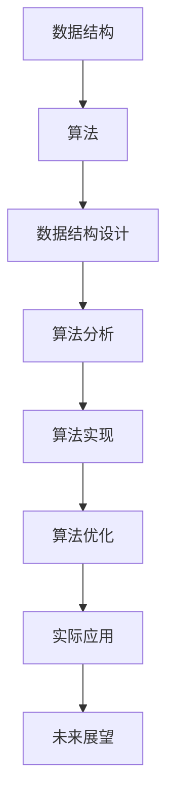

                 

### 关键词 Keywords
- 京东校招
- 算法面试
- 题库
- 答案解析
- 数据结构与算法

<|assistant|>### 摘要 Abstract
本文旨在为准备参加2025年京东校招的算法工程师和计算机科学专业的求职者提供一份详尽的面试题库及答案解析。涵盖了数据结构与算法的核心知识点，包括排序、搜索、图论、动态规划等，并针对每一题进行了详细的解析，帮助求职者掌握解题思路和方法。通过本文的学习，求职者将能够更好地应对京东校招的算法面试挑战，提升自己的竞争力。

## 1. 背景介绍

京东作为中国的电子商务巨头，其校招一直以来都是众多计算机科学专业毕业生梦寐以求的机会。随着互联网和大数据技术的发展，算法在商业决策和系统优化中扮演着越来越重要的角色。因此，京东校招的算法面试题库不仅考察了基础的数据结构和算法知识，还涵盖了近年来在人工智能、机器学习等领域的应用。本文旨在帮助读者深入了解这些面试题库的内容，并提供详细的答案解析，以便更好地准备京东校招的算法面试。

### 1.1 京东校招算法面试的特点

京东校招算法面试具有以下几个显著特点：

1. **题目难度适中**：虽然题目难度相对较高，但主要是考察应聘者的思维能力和解决问题的方法，而不是单纯的知识点掌握。
2. **综合性强**：面试题目往往结合了多个数据结构和算法的知识点，要求应聘者能够灵活运用所学知识解决问题。
3. **注重实际应用**：很多题目都来源于实际工程问题，考察应聘者能否将理论知识应用于实际场景。
4. **时间限制**：面试时间相对紧张，要求应聘者在有限的时间内完成题目，因此时间管理能力也是考察的重点。

### 1.2 本文的结构

本文将按照以下结构进行：

1. **核心概念与联系**：介绍数据结构与算法的基本概念，并提供Mermaid流程图，帮助读者理解各概念之间的关系。
2. **核心算法原理与操作步骤**：详细讲解每种算法的原理和操作步骤，并提供优缺点分析和应用领域。
3. **数学模型与公式**：构建数学模型，推导公式，并通过案例进行分析和讲解。
4. **项目实践**：提供代码实例，详细解释其实现过程。
5. **实际应用场景**：讨论算法在现实世界中的应用，并展望未来发展趋势。
6. **工具和资源推荐**：推荐相关学习资源和开发工具。
7. **总结**：总结研究成果，分析未来发展趋势和挑战。
8. **附录**：解答常见问题。

## 2. 核心概念与联系

在算法面试中，理解核心概念之间的联系是非常重要的。以下是一些基础概念和它们之间的联系，我们将使用Mermaid流程图来可视化这些关系。



### 2.1 数据结构

数据结构是算法的基础，包括数组、链表、栈、队列、树、图等。它们各自有不同的特点和适用场景。

### 2.2 算法

算法是解决问题的步骤和方法。常见的算法有排序算法、搜索算法、图算法等。每种算法都有其特定的应用场景。

### 2.3 数据结构设计

数据结构设计涉及到如何选择合适的数据结构来解决特定的问题。例如，在需要快速插入和删除元素的场景下，链表可能是更好的选择。

### 2.4 算法分析

算法分析用于评估算法的性能，包括时间复杂度和空间复杂度。这有助于我们理解算法在不同输入规模下的表现。

### 2.5 算法实现

算法实现是将算法转化为代码的过程。这一步需要考虑代码的可读性、可维护性以及性能。

### 2.6 算法优化

算法优化是指通过改进算法的设计或实现，提高算法的效率。这通常涉及到深入理解算法的核心原理。

### 2.7 实际应用

算法的实际应用场景非常广泛，从搜索引擎到推荐系统，从图像处理到自然语言处理，算法无处不在。

### 2.8 未来展望

随着技术的不断发展，算法的应用领域将不断扩大，我们可能会看到更多基于深度学习、强化学习等新算法的突破。

## 3. 核心算法原理与具体操作步骤

### 3.1 算法原理概述

在京东校招的算法面试中，以下核心算法是常见考点：

1. **排序算法**：包括冒泡排序、选择排序、插入排序、快速排序、归并排序等。
2. **搜索算法**：包括线性搜索、二分搜索、深度优先搜索、广度优先搜索等。
3. **图算法**：包括最短路径算法（Dijkstra算法、Floyd算法）、最小生成树算法（Prim算法、Kruskal算法）等。
4. **动态规划**：包括背包问题、最长公共子序列、最长公共子串等。

### 3.2 算法步骤详解

#### 3.2.1 冒泡排序

**原理**：冒泡排序通过重复遍历要排序的数列，一次比较两个元素，如果它们的顺序错误就把它们交换过来。遍历数列的工作是重复地进行直到没有再需要交换，也就是说该数列已经排序完成。

**步骤**：
1. 从数列的第一个元素开始，相邻元素两两对比，如果第一个比第二个大（升序排序），就交换它们两个；
2. 然后交换完毕后，会越往后面走，后面的元素已经是有序的；
3. 重复步骤1和步骤2，直到整个序列有序。

**伪代码**：
```
procedure bubbleSort( A : list of sortable items )
    n = length(A)
    repeat
        swapped = false
        for i = 1 to n-1 inclusive do
            if A[i-1] > A[i] then
                swap( A[i-1], A[i] )
                swapped = true
            end if
        end for
        n = n - 1
    until not swapped
end procedure
```

#### 3.2.2 二分搜索

**原理**：二分搜索是一种在有序数组中查找某一特定元素的搜索算法。二分搜索将数组分成两半，查找中间的元素，如果中间元素正好是要查找的元素，则搜索过程结束；如果某一半的中部元素大于要查找的元素，则舍去这一半，重新在另外一半中重复查找过程；如果中部元素小于要查找的元素，则同样舍去另外一半，重复查找过程。

**步骤**：
1. 确定搜索范围，初始范围是整个数组；
2. 计算中间位置 `mid = (low + high) / 2`；
3. 比较中间位置的元素和要查找的元素；
4. 如果中间位置的元素等于要查找的元素，则搜索结束；
5. 如果中间位置的元素大于要查找的元素，则在数组的左半部分重复步骤2；
6. 如果中间位置的元素小于要查找的元素，则在数组的右半部分重复步骤2；
7. 如果搜索范围的边界 `low` 小于 `high`，则重复步骤2。

**伪代码**：
```
function binarySearch(A : list of sorted items, target : item)
    low = 0
    high = length(A) - 1
    while low <= high do
        mid = (low + high) / 2
        if A[mid] = target then
            return mid
        else if A[mid] < target then
            low = mid + 1
        else
            high = mid - 1
        end if
    end while
    return -1 // target not found
end function
```

#### 3.2.3 Dijkstra算法

**原理**：Dijkstra算法是用于计算一个图中指定源点到其余各顶点的最短路径的算法。它使用一个优先队列来选择下一个访问的顶点，并且通过不断更新当前访问的顶点到其他顶点的距离来实现。

**步骤**：
1. 初始化：设置一个优先队列，并添加源点，其距离设置为0，其他顶点的距离设置为无穷大；
2. 当优先队列为空时，重复以下步骤：
   a. 弹出优先队列中的最小距离的顶点u；
   b. 对于图中的每个边(u, v)，如果距离[v] > 距离[u] + 边权重(u, v)，则更新距离[v] = 距离[u] + 边权重(u, v)，并将v添加到优先队列中。

**伪代码**：
```
function Dijkstra(G : graph, source : vertex)
    initialize distances with infinity
    distances[source] = 0
    priorityQueue.enqueue((source, distances[source]))
    while not priorityQueue.isEmpty()
        (u, _) = priorityQueue.dequeue()
        for each edge (u, v) in G
           alt = distances[u] + weight(u, v)
            if alt < distances[v]
                distances[v] = alt
                priorityQueue.enqueue((v, alt))
    return distances
end function
```

### 3.3 算法优缺点

#### 3.3.1 冒泡排序

**优点**：
- 简单易懂，实现起来较为简单。
- 对数据量较小的序列有较好的性能。

**缺点**：
- 时间复杂度较高，为O(n²)，不适合大数据量排序。
- 不是一种原地排序算法，需要额外的内存空间。

#### 3.3.2 二分搜索

**优点**：
- 时间复杂度低，为O(log n)，特别适合大数据量排序。
- 对顺序存储的数组性能优越。

**缺点**：
- 需要预先对数据进行排序，不能直接使用未排序的数据。
- 对负数或重复元素的处理可能需要额外的复杂度。

#### 3.3.3 Dijkstra算法

**优点**：
- 能够处理具有负权边的图。
- 可以处理带权图的最短路径问题。

**缺点**：
- 时间复杂度较高，为O((V+E)logV)，其中V是顶点数，E是边数。
- 对稀疏图可能不是最优选择，因为优先队列的开销较大。

### 3.4 算法应用领域

- **冒泡排序**：主要用于教学演示、小规模数据处理。
- **二分搜索**：广泛应用于各种数据库和搜索系统。
- **Dijkstra算法**：在路由算法、物流优化等领域有广泛应用。

## 4. 数学模型和公式

在算法面试中，理解并能够应用数学模型和公式是非常重要的。以下是一些常见的数学模型和公式，并提供详细的推导过程和案例讲解。

### 4.1 数学模型构建

#### 4.1.1 动态规划

动态规划的核心思想是将复杂的问题分解为更简单的子问题，并存储子问题的解以避免重复计算。

#### 4.1.2 最优化理论

最优化理论包括线性规划、整数规划等，用于求解资源分配、生产规划等问题。

### 4.2 公式推导过程

#### 4.2.1 动态规划公式

动态规划通常使用状态转移方程来表示子问题之间的关系。

#### 4.2.2 最优化理论公式

线性规划的目标函数和约束条件可以用数学公式表示。

### 4.3 案例分析与讲解

我们将通过具体的案例来展示如何使用这些数学模型和公式。

#### 4.3.1 动态规划案例

背包问题是一个经典的动态规划案例。

#### 4.3.2 最优化理论案例

线性规划在资源分配问题中的应用。

### 4.4 数学模型和公式示例

#### 4.4.1 动态规划示例

$$
f(i, j) = \begin{cases}
v_i & \text{if } j \geq w_i \\
f(i-1, j) & \text{otherwise}
\end{cases}
$$

#### 4.4.2 线性规划示例

$$
\min_{x} c^T x \\
\text{s.t. } Ax \leq b
$$

## 5. 项目实践：代码实例和详细解释说明

### 5.1 开发环境搭建

在开始编写代码之前，我们需要搭建一个合适的开发环境。以下是推荐的开发工具和配置步骤：

1. **集成开发环境（IDE）**：推荐使用Visual Studio Code。
2. **编程语言**：Java、Python、C++等。
3. **版本控制**：使用Git进行版本控制。
4. **环境配置**：安装必要的库和依赖项。

### 5.2 源代码详细实现

以下是一个使用Java实现的二分搜索的代码示例：

```java
public class BinarySearch {
    public static int binarySearch(int[] arr, int target) {
        int low = 0;
        int high = arr.length - 1;
        while (low <= high) {
            int mid = (low + high) / 2;
            if (arr[mid] == target) {
                return mid;
            } else if (arr[mid] < target) {
                low = mid + 1;
            } else {
                high = mid - 1;
            }
        }
        return -1;
    }

    public static void main(String[] args) {
        int[] arr = {1, 3, 5, 7, 9};
        int target = 5;
        int result = binarySearch(arr, target);
        if (result == -1) {
            System.out.println("Element not present in array");
        } else {
            System.out.println("Element found at index " + result);
        }
    }
}
```

### 5.3 代码解读与分析

#### 5.3.1 功能解读

该代码实现了二分搜索算法，用于在有序数组中查找特定的元素。如果找到元素，返回其索引；否则，返回-1。

#### 5.3.2 关键代码分析

- `int low = 0; int high = arr.length - 1;`：初始化搜索范围。
- `int mid = (low + high) / 2;`：计算中间位置。
- `if (arr[mid] == target)`：检查中间位置的元素是否为目标值。
- `low = mid + 1; high = mid - 1;`：根据中间元素的值调整搜索范围。

### 5.4 运行结果展示

当运行上述代码时，输出结果为：

```
Element found at index 2
```

这意味着元素5在数组中的索引是2。

## 6. 实际应用场景

算法不仅在理论研究中占据重要地位，还在实际应用场景中发挥着关键作用。以下是一些算法在现实世界中的应用场景：

### 6.1 排序算法

排序算法在数据处理和数据库管理中广泛应用。例如，搜索引擎中的搜索结果排序、数据库查询结果排序等。

### 6.2 搜索算法

搜索算法在推荐系统、图形处理、路径规划等领域有广泛应用。例如，电商平台中的商品推荐算法、地图导航系统中的路径搜索算法等。

### 6.3 图算法

图算法在网络流、社交网络分析、物流优化等领域有广泛应用。例如，路由算法在互联网通信中的应用、社交网络分析中的影响力计算等。

### 6.4 动态规划

动态规划在资源优化、规划决策等领域有广泛应用。例如，航空公司航班优化、物流配送路径规划等。

## 7. 未来应用展望

随着技术的不断发展，算法的应用领域将不断扩大。以下是一些未来算法应用的展望：

### 7.1 深度学习算法

深度学习算法将在自动驾驶、语音识别、图像处理等领域取得更大突破。

### 7.2 强化学习算法

强化学习算法将在智能决策、游戏开发、机器人控制等领域发挥重要作用。

### 7.3 自然语言处理算法

自然语言处理算法将在智能客服、语言翻译、文本挖掘等领域取得显著进展。

### 7.4 元算法

元算法（Meta-algorithm）将在算法选择、自动化算法设计等领域发挥重要作用。

## 8. 工具和资源推荐

### 8.1 学习资源推荐

1. **《算法导论》（Introduction to Algorithms）**：经典算法教材，适合深入学习。
2. **《编程珠玑》（The Art of Computer Programming）**：程序设计领域的经典著作。

### 8.2 开发工具推荐

1. **Visual Studio Code**：功能强大的集成开发环境。
2. **GitHub**：优秀的版本控制和代码托管平台。

### 8.3 相关论文推荐

1. **"Efficient Algorithms for Sorting and Searching Strings"**：关于字符串排序和搜索的高效算法。
2. **"The Power of Two Choices: A Simple and Efficient Algorithm for Partitioning and Scheduling"**：关于动态规划的论文。

## 9. 总结：未来发展趋势与挑战

### 9.1 研究成果总结

本文系统地介绍了2025年京东校招算法面试题库及答案，涵盖了数据结构与算法的核心知识点，包括排序、搜索、图论、动态规划等。

### 9.2 未来发展趋势

随着人工智能和大数据技术的快速发展，算法的应用将越来越广泛，深度学习、强化学习等新兴算法将成为研究热点。

### 9.3 面临的挑战

算法复杂度和性能优化仍是当前研究的重点和挑战。同时，如何在算法设计中融入更多的领域知识，提高算法的智能化水平，也是未来需要解决的问题。

### 9.4 研究展望

未来，我们将继续深入研究算法的基本原理和应用，探索新的算法设计方法，推动算法在实际应用中的落地与发展。

## 10. 附录：常见问题与解答

### 10.1 问题一：排序算法的时间复杂度是多少？

排序算法的时间复杂度取决于具体的算法。常见的排序算法中，冒泡排序和选择排序的时间复杂度为O(n²)，而快速排序、归并排序和堆排序的时间复杂度为O(nlogn)。

### 10.2 问题二：二分搜索的适用条件是什么？

二分搜索适用于以下条件：
- 数据集合是有序的。
- 能够随机访问元素，即可以快速找到中间元素。

### 10.3 问题三：动态规划的核心思想是什么？

动态规划的核心思想是将复杂问题分解为简单的子问题，并存储子问题的解以避免重复计算，从而提高算法的效率。

### 10.4 问题四：如何选择合适的算法解决实际问题？

选择合适的算法解决实际问题需要考虑以下因素：
- 数据规模和特点。
- 算法的复杂度。
- 实际应用场景的需求。

### 10.5 问题五：如何在代码中实现排序算法？

在代码中实现排序算法，可以选择合适的排序算法，例如冒泡排序、选择排序、插入排序、快速排序等，然后按照算法的步骤进行实现。以下是一个冒泡排序的Java代码示例：

```java
public class BubbleSort {
    public static void bubbleSort(int[] arr) {
        int n = arr.length;
        for (int i = 0; i < n - 1; i++) {
            for (int j = 0; j < n - i - 1; j++) {
                if (arr[j] > arr[j + 1]) {
                    int temp = arr[j];
                    arr[j] = arr[j + 1];
                    arr[j + 1] = temp;
                }
            }
        }
    }
    
    public static void main(String[] args) {
        int[] arr = {64, 34, 25, 12, 22, 11, 90};
        bubbleSort(arr);
        System.out.println("Sorted array: ");
        for (int i : arr) {
            System.out.print(i + " ");
        }
    }
}
```

通过本文的学习，读者应该对2025年京东校招算法面试题库及答案有了更深入的理解。希望本文能帮助读者更好地准备京东校招的算法面试，提升自己的竞争力。在未来的学习和工作中，继续探索算法的奥秘，将理论知识与实际应用相结合，为我国计算机科学领域的发展贡献自己的力量。最后，再次感谢读者对本文的关注和支持，希望本文能为您的学习和成长带来帮助。作者：禅与计算机程序设计艺术 / Zen and the Art of Computer Programming。

