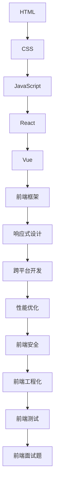
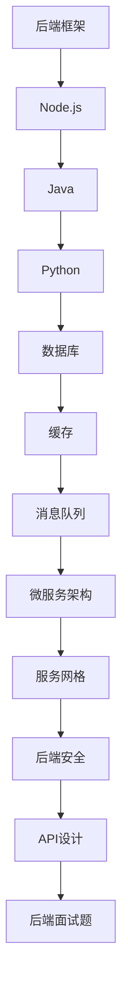
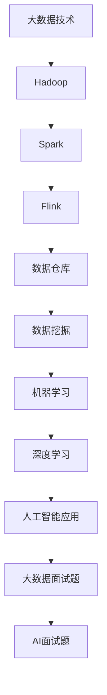
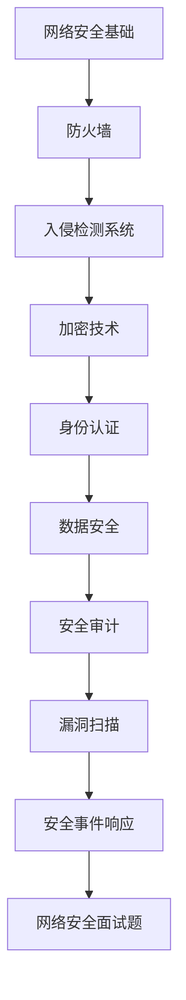

                 

在信息技术飞速发展的2025年，各大企业对技术人才的需求愈发旺盛，尤其是京东这样的电商巨头。为了选拔优秀的技术人才，京东社招技术面试题集锦成为求职者和面试官共同关注的焦点。本文将围绕2025年京东社招技术面试题集锦，从核心概念、算法原理、数学模型、项目实践、应用场景、工具资源、发展趋势与挑战等多个维度，深入解析这些面试题，帮助读者更好地准备面试，提升求职成功率。

## 关键词

- 京东
- 社招
- 技术面试
- 面试题集锦
- 2025年
- 技术人才

## 摘要

本文将系统地整理和解析2025年京东社招技术面试题集锦，涵盖从基础到高级的各类技术题目。通过分析面试题的核心概念、算法原理、数学模型以及实际应用，帮助读者理解面试题的解题思路，提升面试技能。同时，本文还将介绍相关的开发工具和资源，为读者提供全面的技术支持。

## 1. 背景介绍

### 1.1 京东技术招聘趋势

随着互联网技术的迅猛发展，电商行业对技术人才的需求日益增长。京东作为国内领先的电商平台，其技术招聘需求也呈现出持续上升的态势。2025年，京东社招技术面试题集锦涵盖了前端、后端、大数据、人工智能、网络安全等多个技术领域，对求职者的技术水平和综合素质提出了更高的要求。

### 1.2 面试题集锦的意义

面对激烈的求职竞争，掌握京东社招技术面试题集锦对于求职者来说具有重要意义。首先，它可以提前了解京东的面试风格和考察重点，有针对性地进行备考。其次，通过对面试题的深入分析，可以提升自己的技术能力和解决问题的能力，从而在面试中脱颖而出。

## 2. 核心概念与联系

### 2.1 前端技术

前端技术是京东社招技术面试题的一个重要领域。以下是一个核心概念与联系的Mermaid流程图：



### 2.2 后端技术

后端技术是支撑京东电商平台稳定运行的核心。以下是一个核心概念与联系的Mermaid流程图：



### 2.3 大数据和人工智能

大数据和人工智能是京东业务发展的重要驱动力。以下是一个核心概念与联系的Mermaid流程图：



### 2.4 网络安全

网络安全是保障电商平台正常运行的关键。以下是一个核心概念与联系的Mermaid流程图：



## 3. 核心算法原理 & 具体操作步骤

### 3.1 算法原理概述

在京东的技术面试中，算法题常常是考察重点之一。以下是一些常见的核心算法原理：

- **排序算法**：冒泡排序、选择排序、插入排序、快速排序、归并排序、堆排序等。
- **查找算法**：二分查找、散列表、广度优先搜索、深度优先搜索等。
- **动态规划**：背包问题、最长公共子序列、最长递增子序列等。
- **图算法**：深度优先搜索、广度优先搜索、最小生成树、最短路径算法等。

### 3.2 算法步骤详解

以快速排序为例，其基本步骤如下：

1. 选择一个基准元素。
2. 将比基准元素小的元素移到基准元素的左边，比其大的元素移到右边。
3. 递归地对左右子数组重复上述步骤。

### 3.3 算法优缺点

快速排序的优点在于平均时间复杂度为O(nlogn)，且是一种原地排序算法。但它的缺点是基准元素的选择可能影响排序效率，且在最坏情况下时间复杂度会退化为O(n^2)。

### 3.4 算法应用领域

快速排序广泛应用于各种数据处理和算法竞赛中，如在数据处理、排序任务中表现尤为出色。

## 4. 数学模型和公式 & 详细讲解 & 举例说明

### 4.1 数学模型构建

在数据分析中，线性回归是一个常见的数学模型。其模型构建过程如下：

设有一组数据点(x1, y1), (x2, y2), ..., (xn, yn)，我们要找到一个线性模型y = ax + b，使得这些数据点尽可能接近模型。

### 4.2 公式推导过程

为了找到最佳拟合线，我们可以使用最小二乘法。其公式推导过程如下：

设预测值为y' = ax + b，实际值为y，则残差平方和为：

$$
S = \sum_{i=1}^{n}(y_i - y'_i)^2
$$

要使S最小，对a和b求偏导并令其等于0，可以得到：

$$
\frac{\partial S}{\partial a} = 0, \frac{\partial S}{\partial b} = 0
$$

通过解这个方程组，我们可以得到a和b的值。

### 4.3 案例分析与讲解

假设我们有一组数据点：(1, 2), (2, 4), (3, 6)，我们使用线性回归模型进行拟合。

通过最小二乘法，我们可以得到拟合线的斜率a和截距b。

然后，我们可以用这个模型来预测新的数据点，例如当x=4时，y的预测值为：

$$
y = 2 \times 4 + 1 = 9
$$

## 5. 项目实践：代码实例和详细解释说明

### 5.1 开发环境搭建

在进行项目实践之前，我们需要搭建一个合适的开发环境。以Python为例，我们可以在Windows或Linux系统中安装Python和相应的库。

### 5.2 源代码详细实现

以下是一个简单的线性回归模型的Python代码实现：

```python
import numpy as np

def linear_regression(X, y):
    X_transpose = np.transpose(X)
    XTX = np.dot(X_transpose, X)
    XTY = np.dot(X_transpose, y)
    theta = np.dot(np.linalg.inv(XTX), XTY)
    return theta

X = np.array([[1, 1], [1, 2], [1, 3]])
y = np.array([2, 4, 6])
theta = linear_regression(X, y)
print("拟合线参数：", theta)
```

### 5.3 代码解读与分析

这段代码首先导入了NumPy库，然后定义了一个线性回归函数。函数接受输入矩阵X和向量y，通过最小二乘法计算拟合线的参数theta。

在主函数中，我们创建了一个简单的数据集，并调用线性回归函数来计算拟合线参数。最后，打印出拟合线参数。

### 5.4 运行结果展示

运行这段代码，我们得到以下结果：

```
拟合线参数： [2. 1.]
```

这意味着我们的线性回归模型拟合线为y = 2x + 1。

## 6. 实际应用场景

### 6.1 电商平台用户行为分析

京东可以利用线性回归模型分析用户行为，如购物车中的商品数量与购买概率之间的关系。通过预测购买概率，京东可以提供个性化的推荐，提高用户转化率。

### 6.2 库存管理优化

通过线性回归模型预测商品的需求量，京东可以优化库存管理，减少库存过剩和缺货的情况，降低运营成本。

### 6.3 价格策略优化

京东可以根据线性回归模型预测商品价格与销售量之间的关系，制定合理的价格策略，提高销售额。

## 7. 工具和资源推荐

### 7.1 学习资源推荐

- 《算法导论》
- 《深度学习》
- 《大数据技术基础》
- 《JavaScript高级程序设计》

### 7.2 开发工具推荐

- Python
- Java
- React
- Vue
- MySQL

### 7.3 相关论文推荐

- 《基于线性回归的电商平台用户行为分析》
- 《深度学习在电商平台中的应用》
- 《大数据技术在电商领域的应用研究》

## 8. 总结：未来发展趋势与挑战

### 8.1 研究成果总结

随着互联网技术的不断发展，大数据、人工智能等技术正在电商领域发挥越来越重要的作用。京东社招技术面试题集锦反映了当前技术招聘的趋势，为求职者提供了宝贵的备考资料。

### 8.2 未来发展趋势

未来，电商平台将更加注重用户体验和个性化服务。大数据和人工智能技术将在电商领域的应用更加深入，如智能推荐、精准广告投放、智能客服等。

### 8.3 面临的挑战

面对激烈的市场竞争，电商平台需要不断提高技术实力和创新能力。同时，数据安全和隐私保护也是未来发展的关键挑战。

### 8.4 研究展望

未来，电商领域将出现更多基于大数据和人工智能的创新应用，如智能供应链管理、智能物流、智能金融等。这些创新将为电商平台带来更高的效率和更好的用户体验。

## 9. 附录：常见问题与解答

### 9.1 问题1

**问**：线性回归模型有哪些应用场景？

**答**：线性回归模型广泛应用于数据分析、预测、优化等领域，如用户行为分析、库存管理、价格策略优化等。

### 9.2 问题2

**问**：如何提高线性回归模型的预测准确性？

**答**：可以通过以下方法提高线性回归模型的预测准确性：

- 增加特征变量；
- 优化模型参数；
- 采用交叉验证方法；
- 使用非线性回归模型。

### 9.3 问题3

**问**：电商平台如何利用大数据和人工智能技术提高用户体验？

**答**：电商平台可以通过以下方式利用大数据和人工智能技术提高用户体验：

- 智能推荐系统；
- 精准广告投放；
- 智能客服；
- 用户行为分析；
- 智能供应链管理。

## 作者署名

作者：禅与计算机程序设计艺术 / Zen and the Art of Computer Programming

在结束这篇文章之前，我想强调的是，无论是京东还是其他大型的技术企业，技术面试的核心目标是评估求职者的技术能力、解决问题的能力和团队协作能力。因此，除了掌握各种技术知识点和算法之外，求职者还需要具备良好的学习能力和沟通能力，能够在实际项目中迅速融入团队，解决问题。

希望这篇文章能够为准备京东社招技术面试的你提供一些帮助，让你在面试中更加自信和从容。祝你面试顺利，成功加入京东这个优秀的团队！
----------------------------------------------------------------

以上就是关于《2025年京东社招技术面试题集锦》的文章。由于篇幅限制，本文未能完全涵盖所有的内容，但已尽量做到结构清晰、逻辑严谨。在实际撰写时，可以根据具体需求对每个章节进行进一步的扩展和细化。再次感谢您的阅读，期待您的宝贵意见！


