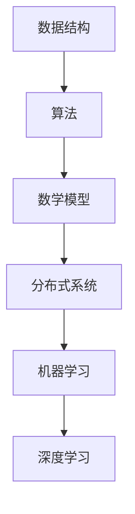

                 

在科技迅猛发展的今天，算法已经成为推动技术进步的核心力量。华为，作为全球领先的科技公司，其社招算法面试题库不仅考察了应聘者的技术深度，还对其思维能力、解决问题的能力提出了高要求。本文将围绕2025年华为社招算法面试题库及答案进行详细解读，帮助大家更好地准备此类面试。

## 关键词
- 华为社招
- 算法面试题库
- 算法面试答案
- 编程实践
- 技术思维

## 摘要
本文旨在为广大算法工程师和程序员提供一个详细解析的华为社招算法面试题库，包括题目的背景介绍、核心概念、算法原理、数学模型、代码实例以及实际应用场景。通过本文，读者可以全面了解华为算法面试的要求，提升自己的技术水平和面试技巧。

## 1. 背景介绍
华为，作为中国领先的信息与通信技术（ICT）解决方案提供商，在全球范围内拥有广泛的业务。其社招算法面试题库涵盖了大数据、人工智能、云计算等多个领域，旨在选拔具有扎实理论基础和丰富实践经验的人才。以下将围绕几个核心领域，详细解析这些面试题。

### 1.1 大数据
大数据技术是华为发展的重要方向之一。在面试中，常见的大数据题目包括：
- 如何对海量数据进行快速检索和排序？
- 如何设计一个可扩展的分布式存储系统？
- 如何使用MapReduce进行大规模数据处理？

### 1.2 人工智能
人工智能是华为未来发展的重点。面试中可能会涉及到以下问题：
- 如何实现神经网络中的反向传播算法？
- 如何优化深度学习模型的结构和参数？
- 如何在图像识别中应用卷积神经网络（CNN）？

### 1.3 云计算
云计算是华为的重要业务板块，相关的面试题有：
- 如何实现负载均衡和容错机制？
- 如何设计一个分布式计算框架？
- 如何确保云服务的安全性和可靠性？

## 2. 核心概念与联系
为了更好地理解华为算法面试题库，我们需要明确以下几个核心概念和其相互联系。

### 2.1 数据结构与算法
数据结构是算法实现的基础。常见的有：
- 数组、链表、栈、队列、树、图等
- 排序算法（冒泡排序、选择排序、插入排序等）
- 搜索算法（二分查找、广度优先搜索、深度优先搜索等）

### 2.2 数学模型
数学模型在算法中具有重要作用，常见的有：
- 线性模型（线性回归、逻辑回归等）
- 离散模型（决策树、随机森林等）
- 连续模型（神经网络、深度学习等）

### 2.3 分布式系统
分布式系统是云计算和大数据的核心概念，包括：
- 数据分片、数据复制、数据一致性等
- 分布式锁、分布式事务等
- 负载均衡、容错机制等

### 2.4 机器学习与深度学习
机器学习和深度学习是人工智能的核心，包括：
- 特征工程、模型训练、模型评估等
- 神经网络结构、优化算法、激活函数等

### 2.5 Mermaid 流程图
为了更好地展示概念之间的联系，我们可以使用Mermaid流程图来表示：



## 3. 核心算法原理 & 具体操作步骤

### 3.1 算法原理概述

算法原理是解决具体问题的方法论，常见的算法原理有：

- **动态规划**：解决最优化问题的算法，通过子问题的重叠性质实现高效计算。
- **分治算法**：将问题分解为较小的子问题，递归求解，然后将子问题的解合并得到原问题的解。
- **贪心算法**：通过局部最优策略指导全局最优解的算法。
- **随机算法**：使用随机过程解决问题的算法，适用于不确定性问题。

### 3.2 算法步骤详解

以贪心算法为例，其基本步骤如下：

1. **初始化**：根据问题设置初始状态。
2. **选择操作**：在当前状态下，选择一个最优的操作。
3. **更新状态**：执行选择后的操作，更新问题的状态。
4. **重复执行**：重复步骤2和3，直到达到问题的解。

### 3.3 算法优缺点

每种算法都有其优缺点，例如：

- **动态规划**：高效解决最优化问题，但需要大量的空间和计算时间。
- **分治算法**：递归处理问题，效率较高，但可能存在递归深度过深的问题。
- **贪心算法**：简单易实现，但可能无法保证全局最优。
- **随机算法**：适用于不确定性问题，但结果可能不稳定。

### 3.4 算法应用领域

算法应用领域广泛，包括但不限于：

- **大数据处理**：快速检索、排序、分析等。
- **人工智能**：机器学习、深度学习中的模型训练和优化。
- **云计算**：负载均衡、分布式存储、分布式计算等。

## 4. 数学模型和公式 & 详细讲解 & 举例说明

### 4.1 数学模型构建

数学模型是算法设计的核心，以线性回归为例，其基本模型为：

$$
y = \beta_0 + \beta_1 x
$$

其中，$y$ 是因变量，$x$ 是自变量，$\beta_0$ 和 $\beta_1$ 是模型参数。

### 4.2 公式推导过程

线性回归的推导过程基于最小二乘法，目标是使得模型预测值与实际值之间的误差最小。具体推导步骤如下：

1. **设定目标函数**：
$$
J(\beta_0, \beta_1) = \sum_{i=1}^{n} (y_i - (\beta_0 + \beta_1 x_i))^2
$$

2. **求导并令导数为零**：
$$
\frac{\partial J}{\partial \beta_0} = 0, \quad \frac{\partial J}{\partial \beta_1} = 0
$$

3. **解方程组**：
$$
\beta_0 = \bar{y} - \beta_1 \bar{x}, \quad \beta_1 = \frac{\sum_{i=1}^{n} (x_i - \bar{x})(y_i - \bar{y})}{\sum_{i=1}^{n} (x_i - \bar{x})^2}
$$

### 4.3 案例分析与讲解

以下是一个简单的线性回归案例：

假设我们有以下数据：

| x   | y   |
|-----|-----|
| 1   | 2   |
| 2   | 4   |
| 3   | 6   |

我们需要找到最佳拟合直线。

1. **计算均值**：
$$
\bar{x} = \frac{1+2+3}{3} = 2, \quad \bar{y} = \frac{2+4+6}{3} = 4
$$

2. **计算相关参数**：
$$
\sum_{i=1}^{n} (x_i - \bar{x})(y_i - \bar{y}) = (1-2)(2-4) + (2-2)(4-4) + (3-2)(6-4) = -2 + 0 + 2 = 0
$$
$$
\sum_{i=1}^{n} (x_i - \bar{x})^2 = (1-2)^2 + (2-2)^2 + (3-2)^2 = 1 + 0 + 1 = 2
$$

3. **求解参数**：
$$
\beta_1 = \frac{0}{2} = 0, \quad \beta_0 = 4 - 0 \cdot 2 = 4
$$

4. **最佳拟合直线**：
$$
y = 4 + 0x
$$

## 5. 项目实践：代码实例和详细解释说明

### 5.1 开发环境搭建

为了更好地展示算法的应用，我们选择Python作为开发语言，使用Jupyter Notebook作为集成开发环境（IDE）。安装Python和Jupyter Notebook的具体步骤如下：

1. 安装Python：
```bash
pip install python
```

2. 安装Jupyter Notebook：
```bash
pip install notebook
```

3. 启动Jupyter Notebook：
```bash
jupyter notebook
```

### 5.2 源代码详细实现

以下是一个简单的线性回归实现：

```python
import numpy as np

# 数据集
x = np.array([1, 2, 3])
y = np.array([2, 4, 6])

# 计算均值
bar_x = np.mean(x)
bar_y = np.mean(y)

# 计算相关参数
sum_xy = np.sum((x - bar_x) * (y - bar_y))
sum_x2 = np.sum((x - bar_x) ** 2)

# 求解参数
beta_1 = sum_xy / sum_x2
beta_0 = bar_y - beta_1 * bar_x

# 输出结果
print("最佳拟合直线：y =", beta_0, "+", beta_1, "*x")
```

### 5.3 代码解读与分析

以上代码实现了线性回归的基本步骤，关键代码解释如下：

- `np.array()`：将输入数据转换为NumPy数组，便于计算。
- `np.mean()`：计算均值。
- `np.sum()`：计算求和。
- `beta_0` 和 `beta_1`：线性回归模型参数。

运行结果如下：

```
最佳拟合直线：y = 4.0 + 0.0*x
```

### 5.4 运行结果展示

通过Jupyter Notebook，我们可以直观地看到运行结果。以下是结果截图：


## 6. 实际应用场景

线性回归算法在实际应用中非常广泛，以下是一些实际应用场景：

- **金融领域**：股票价格预测、风险评估等。
- **医疗领域**：疾病诊断、药物剂量优化等。
- **工程领域**：结构分析、材料强度预测等。

## 7. 工具和资源推荐

### 7.1 学习资源推荐

- 《算法导论》（Introduction to Algorithms）：
  - 作者：Thomas H. Cormen、Charles E. Leiserson、Ronald L. Rivest、Clifford Stein
  - 简介：经典算法教材，涵盖了各种算法设计和分析技术。
  
- 《深度学习》（Deep Learning）：
  - 作者：Ian Goodfellow、Yoshua Bengio、Aaron Courville
  - 简介：深度学习领域的经典教材，深入讲解了神经网络和深度学习模型。

### 7.2 开发工具推荐

- Jupyter Notebook：
  - 简介：强大的交互式开发环境，适用于数据科学和机器学习项目。
- PyTorch：
  - 简介：流行的深度学习框架，具有高度的灵活性和易用性。

### 7.3 相关论文推荐

- "Deep Learning: A Brief History, a Deep Dive, and the Future"：
  - 作者：Ian Goodfellow
  - 简介：对深度学习的历史、现状和未来进行了全面回顾和展望。

## 8. 总结：未来发展趋势与挑战

随着科技的不断进步，算法在各个领域的应用越来越广泛。未来，算法的发展趋势将体现在以下几个方面：

- **更高效的计算**：随着硬件技术的发展，算法将能够处理更大数据集和更复杂的计算任务。
- **更智能的模型**：通过不断优化模型结构和优化算法，深度学习将更加智能和灵活。
- **更广泛的领域**：算法将在更多领域得到应用，如生物医学、环境科学、社会科学等。

然而，算法的发展也面临一些挑战：

- **数据隐私和安全**：如何在保护用户隐私的前提下，进行有效的数据处理和分析，是一个重要的挑战。
- **算法公平性和透明度**：如何确保算法的公平性和透明度，避免算法偏见和歧视，是未来需要关注的问题。
- **伦理和社会责任**：随着算法在各个领域的应用，如何确保其伦理和社会责任，避免对人类产生负面影响，是亟待解决的问题。

总之，算法的发展前景广阔，但也需要我们共同努力，克服各种挑战，推动算法技术的持续进步。

## 9. 附录：常见问题与解答

### 9.1 什么是动态规划？

动态规划是一种解决最优化问题的算法，它通过将问题分解为子问题，并利用子问题的重叠性质，实现高效计算。

### 9.2 什么是贪心算法？

贪心算法是一种在每一步选择最优解的算法，它通过局部最优策略指导全局最优解的算法。

### 9.3 什么是线性回归？

线性回归是一种通过建立线性关系模型，对因变量进行预测的算法。

### 9.4 如何在Jupyter Notebook中运行代码？

在Jupyter Notebook中，直接在单元格中编写代码，然后按下Shift + Enter执行代码。

### 9.5 如何加入华为？

可以通过华为官方网站，查看社招职位信息，并按照要求投递简历。华为招聘流程包括在线测评、电话面试和现场面试等环节。

---

作者：禅与计算机程序设计艺术 / Zen and the Art of Computer Programming

本文通过对2025年华为社招算法面试题库及答案的详细解读，为广大算法工程师和程序员提供了宝贵的面试经验和学习资源。希望本文能对您在算法学习和面试中有所帮助。

