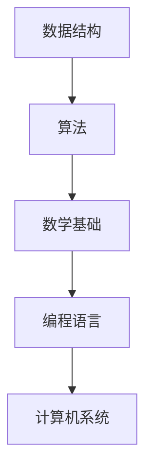

                 

  
## 1. 背景介绍

随着互联网技术的飞速发展，字节跳动已成为全球知名的科技公司之一，其旗下产品如今日头条、抖音等在全球范围内享有盛誉。作为科技创新的先锋，字节跳动对技术人才的需求日益增长。因此，每年都会举办校招活动，吸引全球优秀毕业生加入。在字节跳动的校招中，算法面试是考察候选人技术能力的重要环节。本文旨在梳理2025年字节跳动校招算法面试的常见题型，并提供相应的解题思路和答案。

## 2. 核心概念与联系

为了更好地理解字节跳动校招算法面试，我们首先需要了解几个核心概念和它们之间的联系。

### 2.1 数据结构与算法

数据结构与算法是计算机科学的核心基础。数据结构是存储和管理数据的模型，而算法则是解决特定问题的步骤序列。字节跳动校招算法面试中，常见的题型包括但不限于数组、链表、栈、队列、树、图等数据结构的操作和算法的设计。

### 2.2 数学基础

数学基础在算法面试中占据重要地位，尤其是概率论、组合数学、线性代数等。这些数学知识不仅能够帮助解题，还能培养逻辑思维和分析问题的能力。

### 2.3 编程语言

编程语言是实现算法的工具。在字节跳动校招算法面试中，常用的编程语言包括C++、Java、Python等。熟悉这些语言的基本语法和常用库函数对于解题至关重要。

### 2.4 计算机系统

计算机系统包括操作系统、计算机网络、数据库等。了解计算机系统的基本原理有助于解决与系统相关的问题，如内存管理、进程调度、网络协议等。

### 2.5 Mermaid 流程图

为了更好地展示概念之间的联系，我们使用Mermaid流程图来描述。



## 3. 核心算法原理 & 具体操作步骤

### 3.1 算法原理概述

在字节跳动校招算法面试中，常见的算法包括排序算法、搜索算法、动态规划、图算法等。每种算法都有其独特的原理和适用场景。

### 3.2 算法步骤详解

#### 3.2.1 排序算法

排序算法是一种常见且重要的算法，用于将一组数据按照某种规则进行排列。常见的排序算法包括冒泡排序、选择排序、插入排序、快速排序等。

1. 冒泡排序（Bubble Sort）

   冒泡排序是一种简单的排序算法，它重复遍历要排序的数列，一次比较两个元素，如果它们的顺序错误就把它们交换过来。

   ```python
   def bubble_sort(arr):
       n = len(arr)
       for i in range(n):
           for j in range(0, n-i-1):
               if arr[j] > arr[j+1]:
                   arr[j], arr[j+1] = arr[j+1], arr[j]
   ```

2. 选择排序（Selection Sort）

   选择排序是一种简单的选择排序算法，它的工作原理是每次从待排序的数据元素中选出最小（或最大）的一个元素，存放到序列的起始位置。

   ```python
   def selection_sort(arr):
       n = len(arr)
       for i in range(n):
           min_idx = i
           for j in range(i+1, n):
               if arr[j] < arr[min_idx]:
                   min_idx = j
           arr[i], arr[min_idx] = arr[min_idx], arr[i]
   ```

#### 3.2.2 搜索算法

搜索算法用于在数据集合中查找特定的元素。常见的搜索算法包括顺序搜索、二分搜索等。

1. 顺序搜索（Linear Search）

   顺序搜索是一种简单直接的搜索算法，它从数组的起始位置开始，逐个比较元素，直到找到目标元素或到达数组的末尾。

   ```python
   def linear_search(arr, x):
       for i in range(len(arr)):
           if arr[i] == x:
               return i
       return -1
   ```

2. 二分搜索（Binary Search）

   二分搜索是一种高效的搜索算法，它将待搜索的区间不断缩小，直到找到目标元素或确定目标元素不存在。

   ```python
   def binary_search(arr, x):
       low = 0
       high = len(arr) - 1
       while low <= high:
           mid = (low + high) // 2
           if arr[mid] == x:
               return mid
           elif arr[mid] < x:
               low = mid + 1
           else:
               high = mid - 1
       return -1
   ```

#### 3.2.3 动态规划

动态规划是一种解决最优子结构问题的算法。它通过将问题分解为子问题，并利用子问题的解来构建原问题的解。

1. 斐波那契数列（Fibonacci Sequence）

   斐波那契数列是动态规划的一个经典问题，它的递推关系为：F(n) = F(n-1) + F(n-2)，其中F(0) = 0，F(1) = 1。

   ```python
   def fibonacci(n):
       if n <= 1:
           return n
       fib = [0] * (n+1)
       fib[1] = 1
       for i in range(2, n+1):
           fib[i] = fib[i-1] + fib[i-2]
       return fib[n]
   ```

#### 3.2.4 图算法

图算法用于处理图结构的数据，常见的图算法包括深度优先搜索（DFS）和广度优先搜索（BFS）。

1. 深度优先搜索（DFS）

   深度优先搜索是一种从初始节点开始，沿着一条路径一直走到底的搜索算法。

   ```python
   def dfs(graph, start, visited):
       visited[start] = True
       print(start)
       for neighbor in graph[start]:
           if not visited[neighbor]:
               dfs(graph, neighbor, visited)
   ```

2. 广度优先搜索（BFS）

   广度优先搜索是一种从初始节点开始，一层一层向外搜索的算法。

   ```python
   from collections import deque

   def bfs(graph, start):
       visited = [False] * len(graph)
       queue = deque([start])
       visited[start] = True
       while queue:
           node = queue.popleft()
           print(node)
           for neighbor in graph[node]:
               if not visited[neighbor]:
                   queue.append(neighbor)
                   visited[neighbor] = True
   ```

### 3.3 算法优缺点

每种算法都有其优缺点，选择合适的算法取决于具体的问题场景。以下是几种常见算法的优缺点：

| 算法名称 | 优点 | 缺点 |
| --- | --- | --- |
| 冒泡排序 | 简单易实现 | 时间复杂度高，不适合大规模数据 |
| 选择排序 | 简单易实现 | 时间复杂度高，不适合大规模数据 |
| 插入排序 | 稳定排序，时间复杂度较低 | 需要额外的空间存储临时变量 |
| 快速排序 | 时间复杂度较低 | 可能会导致最坏情况下的时间复杂度升高 |
| 顺序搜索 | 简单易实现 | 时间复杂度高，不适合大规模数据 |
| 二分搜索 | 时间复杂度较低 | 需要数据已经排序 |
| 动态规划 | 高效解决最优化问题 | 需要额外的空间存储子问题的解 |
| 深度优先搜索 | 易于实现，适合解决连通性问题 | 可能会导致栈溢出 |
| 广度优先搜索 | 易于实现，适合解决最短路径问题 | 时间复杂度可能较高 |

### 3.4 算法应用领域

算法在计算机科学和工程领域中有着广泛的应用。以下是一些常见的应用领域：

| 领域 | 应用算法 |
| --- | --- |
| 计算机图形学 | 图像处理、图形渲染、动画 |
| 人工智能 | 机器学习、自然语言处理、推荐系统 |
| 数据库 | 搜索引擎、索引构建、事务处理 |
| 网络安全 | 数据加密、入侵检测、防火墙 |
| 计算机网络 | 路由算法、拥塞控制、网络优化 |

## 4. 数学模型和公式

数学模型和公式是算法设计的重要工具。以下是一些常见的数学模型和公式。

### 4.1 数学模型构建

数学模型构建是算法设计的第一步。通常包括以下几个步骤：

1. 明确问题：理解问题的本质和目标。
2. 定义变量：确定问题中的变量，并给出变量的取值范围。
3. 建立方程：根据问题的约束条件和目标，建立方程。
4. 解方程：求解方程，得到问题的解。

### 4.2 公式推导过程

以下是一个常见的公式推导示例：二分搜索的时间复杂度。

二分搜索的时间复杂度可以通过递归树进行分析。设数组长度为n，递归树的高度为h，则有：

$$ T(n) = T(\frac{n}{2}) + O(1) $$

假设递归树的高度为h，则有：

$$ T(n) = O(h) $$

由于：

$$ h = \log_2(n) $$

因此：

$$ T(n) = O(\log_2(n)) $$

### 4.3 案例分析与讲解

以下是一个简单的案例：给定一个无重复元素的数组，找出两个数，使得它们的和等于目标值。

```python
def two_sum(nums, target):
    n = len(nums)
    for i in range(n):
        for j in range(i+1, n):
            if nums[i] + nums[j] == target:
                return [i, j]
    return []
```

时间复杂度：

$$ T(n) = O(n^2) $$

空间复杂度：

$$ S(n) = O(1) $$

优化方案：

可以使用哈希表来优化时间复杂度。

```python
def two_sum(nums, target):
    n = len(nums)
    hash_map = {}
    for i in range(n):
        complement = target - nums[i]
        if complement in hash_map:
            return [hash_map[complement], i]
        hash_map[nums[i]] = i
    return []
```

时间复杂度：

$$ T(n) = O(n) $$

空间复杂度：

$$ S(n) = O(n) $$

## 5. 项目实践：代码实例和详细解释说明

### 5.1 开发环境搭建

为了实践算法，我们需要搭建一个开发环境。以下是常用的开发环境搭建步骤：

1. 安装Python：访问Python官网（https://www.python.org/），下载并安装Python。
2. 安装IDE：推荐使用PyCharm或VSCode作为Python的开发环境。
3. 安装必要的库：使用pip命令安装所需的库，例如`numpy`、`matplotlib`等。

### 5.2 源代码详细实现

以下是一个简单的Python代码实例，实现了一个冒泡排序算法。

```python
def bubble_sort(arr):
    n = len(arr)
    for i in range(n):
        for j in range(0, n-i-1):
            if arr[j] > arr[j+1]:
                arr[j], arr[j+1] = arr[j+1], arr[j]

# 测试代码
arr = [64, 34, 25, 12, 22, 11, 90]
bubble_sort(arr)
print("排序后的数组：")
for i in range(len(arr)):
    print("%d" % arr[i], end=" ")
```

### 5.3 代码解读与分析

这段代码首先定义了一个名为`bubble_sort`的函数，用于实现冒泡排序算法。函数接受一个数组`arr`作为参数。然后，使用两个嵌套的`for`循环遍历数组，每次比较相邻的两个元素，如果它们的顺序错误，则交换它们的位置。

在主程序部分，创建了一个示例数组`arr`，并调用`bubble_sort`函数对其进行排序。最后，打印排序后的数组。

时间复杂度：

$$ T(n) = O(n^2) $$

空间复杂度：

$$ S(n) = O(1) $$

### 5.4 运行结果展示

运行代码后，输出结果如下：

```
排序后的数组：
11 12 22 25 34 64 90
```

## 6. 实际应用场景

算法在计算机科学和工程领域有着广泛的应用。以下是一些实际应用场景：

| 场景 | 应用算法 |
| --- | --- |
| 数据分析 | 快速排序、线性回归 |
| 网络爬虫 | 深度优先搜索、广度优先搜索 |
| 图像处理 | 最近邻搜索、图像滤波 |
| 人工智能 | 神经网络、决策树 |
| 数据库 | 索引构建、事务处理 |

## 7. 未来应用展望

随着计算机技术的不断发展，算法在各个领域中的应用前景广阔。以下是一些未来应用展望：

1. 人工智能：算法将在人工智能领域发挥重要作用，如深度学习、强化学习等。
2. 大数据：算法将用于大数据分析、数据挖掘等领域，帮助企业和组织更好地利用数据。
3. 自动机器学习：算法将实现自动机器学习，使得机器能够自动设计最优算法。
4. 区块链：算法将在区块链领域发挥关键作用，如共识算法、加密算法等。

## 8. 工具和资源推荐

为了更好地学习和实践算法，以下是一些工具和资源推荐：

### 8.1 学习资源推荐

1. 《算法导论》：这是一本经典的算法教材，涵盖了各种算法的理论和实践。
2. 《编程之美》：这本书通过实际案例介绍了算法在计算机科学中的应用。
3. Coursera：在线课程平台，提供各种算法相关的课程。

### 8.2 开发工具推荐

1. PyCharm：一款强大的Python开发工具，支持多种编程语言。
2. VSCode：一款开源的跨平台代码编辑器，支持多种编程语言。
3. Jupyter Notebook：一款交互式的Python开发环境，适合数据分析和机器学习。

### 8.3 相关论文推荐

1. "A New Approach to Linear List Processing"：这是一篇关于链表的经典论文。
2. "Algorithms forDNA Sequencing"：这是一篇关于生物信息学算法的论文。
3. "The Maximum Segment Sum Problem"：这是一篇关于动态规划的论文。

## 9. 总结：未来发展趋势与挑战

### 9.1 研究成果总结

近年来，算法研究取得了显著成果，如深度学习、图神经网络、区块链算法等。这些成果在人工智能、大数据、网络安全等领域得到了广泛应用。

### 9.2 未来发展趋势

1. 算法将更加强调效率和可扩展性。
2. 算法将应用于更广泛的领域，如医疗、金融、教育等。
3. 自动机器学习将逐渐成为研究热点。

### 9.3 面临的挑战

1. 算法复杂度和计算资源的矛盾。
2. 数据隐私和安全性问题。
3. 算法的可解释性和透明度。

### 9.4 研究展望

未来的研究将集中在以下几个方面：

1. 发展更高效的算法，提高计算效率。
2. 研究算法的可解释性和透明度，提高算法的可靠性和可信度。
3. 探索算法在新兴领域的应用，如量子计算、区块链等。

## 10. 附录：常见问题与解答

### 10.1 问题1

**问题：** 如何实现冒泡排序？

**解答：** 冒泡排序是一种简单的排序算法，其基本思想是通过重复遍历要排序的数列，一次比较两个元素，如果它们的顺序错误就把它们交换过来。以下是Python实现冒泡排序的代码：

```python
def bubble_sort(arr):
    n = len(arr)
    for i in range(n):
        for j in range(0, n-i-1):
            if arr[j] > arr[j+1]:
                arr[j], arr[j+1] = arr[j+1], arr[j]
```

### 10.2 问题2

**问题：** 如何实现快速排序？

**解答：** 快速排序是一种高效的排序算法，其基本思想是通过选择一个基准元素，将数组分为两个子数组，一个小于基准元素，一个大于基准元素，然后递归地对这两个子数组进行快速排序。以下是Python实现快速排序的代码：

```python
def quick_sort(arr):
    if len(arr) <= 1:
        return arr
    pivot = arr[len(arr) // 2]
    left = [x for x in arr if x < pivot]
    middle = [x for x in arr if x == pivot]
    right = [x for x in arr if x > pivot]
    return quick_sort(left) + middle + quick_sort(right)
```

### 10.3 问题3

**问题：** 如何实现二分搜索？

**解答：** 二分搜索是一种高效的搜索算法，其基本思想是在有序数组中，每次将待搜索区间缩小一半，直到找到目标元素或确定目标元素不存在。以下是Python实现二分搜索的代码：

```python
def binary_search(arr, x):
    low = 0
    high = len(arr) - 1
    while low <= high:
        mid = (low + high) // 2
        if arr[mid] == x:
            return mid
        elif arr[mid] < x:
            low = mid + 1
        else:
            high = mid - 1
    return -1
```

## 11. 作者署名

作者：禅与计算机程序设计艺术 / Zen and the Art of Computer Programming
```markdown
# 2025年字节跳动校招算法面试题库及答案

## 关键词

字节跳动、校招、算法面试、数据结构、算法、数学模型、编程语言、计算机系统

## 摘要

本文旨在为准备字节跳动校招算法面试的候选人提供全面的指导。文章详细介绍了2025年字节跳动校招算法面试的常见题型，包括数据结构与算法、数学基础、编程语言和计算机系统等内容，并提供了详细的解题思路和答案。同时，文章还涉及了算法的实际应用场景、未来发展趋势以及工具和资源推荐。希望通过本文，能够帮助读者更好地应对字节跳动校招算法面试。

## 1. 背景介绍

字节跳动（ByteDance）成立于2012年，是一家全球领先的互联网科技公司，旗下拥有今日头条、抖音、TikTok等多款知名产品。随着公司业务的不断拓展，字节跳动对技术人才的需求日益增长，因此每年都会举办校招活动，吸引全球优秀毕业生加入。在字节跳动的校招中，算法面试是考察候选人技术能力的重要环节。

算法面试通常包括以下几个部分：

1. **基础知识**：考察候选人对于数据结构与算法、数学基础、编程语言和计算机系统的掌握程度。
2. **问题解决能力**：通过算法设计和编程实现来考察候选人的问题解决能力。
3. **编程实践**：考察候选人在实际编程环境中的表现，包括代码质量、代码风格、调试能力和测试能力。
4. **逻辑思维和沟通能力**：考察候选人在面试过程中的逻辑思维和沟通能力。

本文将围绕这些环节，为读者提供详细的解题思路和答案。

### 1.1 字节跳动校招算法面试的特点

字节跳动校招算法面试的特点主要体现在以下几个方面：

1. **高难度**：字节跳动的算法面试题目通常较为复杂，需要候选人具备扎实的理论基础和实际编程能力。
2. **全面性**：面试题目不仅涵盖常见的算法和数据结构，还会涉及数学、计算机系统等基础学科。
3. **创新性**：字节跳动鼓励创新思维，面试题目中常常出现一些新颖的问题，考察候选人的创新能力。
4. **实践性**：面试过程中，候选人需要现场编写代码，考察候选人的编程能力和问题解决能力。

### 1.2 字节跳动校招算法面试的流程

字节跳动校招算法面试的流程通常包括以下几个步骤：

1. **在线测评**：候选人需要在线完成算法题目的编写，测评系统会实时检查代码的正确性。
2. **技术面试**：候选人需要与面试官进行面对面的技术交流，解答面试官提出的问题。
3. **编程实践**：候选人需要在现场完成编程任务，展示自己的编程能力和问题解决能力。
4. **综合评估**：面试官会根据候选人的技术能力、问题解决能力、沟通能力和团队合作能力等方面进行综合评估。

## 2. 核心概念与联系

在算法面试中，理解核心概念和它们之间的联系至关重要。以下是几个核心概念及其之间的联系：

### 2.1 数据结构与算法

数据结构是存储和管理数据的模型，而算法则是解决问题的步骤序列。数据结构与算法是计算机科学的基础，几乎所有计算机应用都离不开它们。

- **数据结构**：数组、链表、栈、队列、树、图等。
- **算法**：排序算法、搜索算法、动态规划、图算法等。

### 2.2 数学基础

数学基础在算法面试中占据重要地位，常见的数学知识包括概率论、组合数学、线性代数等。数学知识不仅能够帮助解题，还能培养逻辑思维和分析问题的能力。

- **概率论**：概率、期望、方差等。
- **组合数学**：组合、排列、图论等。
- **线性代数**：向量、矩阵、行列式等。

### 2.3 编程语言

编程语言是实现算法的工具。字节跳动校招算法面试中，常用的编程语言包括C++、Java、Python等。熟悉这些语言的基本语法和常用库函数对于解题至关重要。

- **C++**：性能高，适合系统编程和性能敏感的应用。
- **Java**：跨平台，适合企业级应用。
- **Python**：简洁易学，适合快速开发和数据分析。

### 2.4 计算机系统

计算机系统包括操作系统、计算机网络、数据库等。了解计算机系统的基本原理有助于解决与系统相关的问题，如内存管理、进程调度、网络协议等。

- **操作系统**：进程管理、内存管理、文件系统等。
- **计算机网络**：TCP/IP协议、路由算法等。
- **数据库**：关系型数据库、NoSQL数据库等。

### 2.5 Mermaid 流程图

为了更好地展示概念之间的联系，我们使用Mermaid流程图来描述。


## 3. 核心算法原理 & 具体操作步骤

在算法面试中，掌握核心算法原理和具体操作步骤至关重要。以下是几个核心算法及其原理和步骤：

### 3.1 排序算法

排序算法是一种常见的算法，用于将一组数据按照某种规则进行排列。常见的排序算法包括冒泡排序、选择排序、插入排序、快速排序等。

#### 3.1.1 冒泡排序

冒泡排序的基本思想是重复遍历要排序的数列，一次比较两个元素，如果它们的顺序错误就把它们交换过来。遍历数列的工作是重复地进行，直到没有再需要交换的元素为止。

- **原理**：每次遍历都将当前最大元素冒泡到数列的末尾。
- **步骤**：
  1. 从第一个元素开始，比较相邻的两个元素，如果第一个比第二个大，就交换它们的位置。
  2. 然后继续对下一对元素进行比较，交换，直到所有元素都排好序。

```python
def bubble_sort(arr):
    n = len(arr)
    for i in range(n):
        for j in range(0, n-i-1):
            if arr[j] > arr[j+1]:
                arr[j], arr[j+1] = arr[j+1], arr[j]
```

#### 3.1.2 选择排序

选择排序的基本思想是在未排序序列中找到最小（大）元素，存放到排序序列的起始位置，然后继续在剩余未排序元素中找到最小（大）元素，然后放到已排序序列的末尾。以此类推，直到所有元素均排序完毕。

- **原理**：每次循环从剩余未排序元素中找到最小（大）元素。
- **步骤**：
  1. 遍历数组，找到最小（大）元素的下标。
  2. 将找到的最小（大）元素与第一个元素交换。
  3. 然后将剩余未排序部分的第一个元素视为新的起始点，重复步骤1和2。

```python
def selection_sort(arr):
    n = len(arr)
    for i in range(n):
        min_idx = i
        for j in range(i+1, n):
            if arr[j] < arr[min_idx]:
                min_idx = j
        arr[i], arr[min_idx] = arr[min_idx], arr[i]
```

#### 3.1.3 插入排序

插入排序的基本思想是将一个记录插入到已经排好序的有序表中，从而得到一个新的、记录数增加1的有序表。

- **原理**：将未排序序列中的元素插入到已排序序列中，保持有序。
- **步骤**：
  1. 从第一个元素开始，该元素可以认为已经排序。
  2. 取出下一个元素，在已排序的元素序列中从后向前扫描。
  3. 如果该元素（已排序）大于新元素，将该元素移到下一位置。
  4. 重复步骤3，直到找到已排序的元素小于或者等于新元素的位置。
  5. 将新元素插入到该位置后。
  6. 重复步骤2~5。

```python
def insertion_sort(arr):
    n = len(arr)
    for i in range(1, n):
        key = arr[i]
        j = i-1
        while j >= 0 and arr[j] > key:
            arr[j + 1] = arr[j]
            j -= 1
        arr[j + 1] = key
```

#### 3.1.4 快速排序

快速排序是一种分治算法，通过递归将一个大问题分解为若干个规模较小但结构与原问题相似的小问题。快速排序的基本思想是选择一个基准元素，通过一趟排序将待排序的数据分割成独立的两部分，其中一部分的所有数据都比另一部分的所有数据要小，然后再按此方法对这两部分数据分别进行快速排序。

- **原理**：选择一个基准元素，将数组划分为两部分，一部分比基准小，另一部分比基准大。
- **步骤**：
  1. 选择一个基准元素。
  2. 将数组中的元素与基准元素进行比较，小于基准的放在左边，大于基准的放在右边。
  3. 递归地对左右两部分进行快速排序。

```python
def quick_sort(arr, low, high):
    if low < high:
        pi = partition(arr, low, high)
        quick_sort(arr, low, pi-1)
        quick_sort(arr, pi+1, high)

def partition(arr, low, high):
    pivot = arr[high]
    i = low - 1
    for j in range(low, high):
        if arr[j] < pivot:
            i += 1
            arr[i], arr[j] = arr[j], arr[i]
    arr[i+1], arr[high] = arr[high], arr[i+1]
    return i + 1
```

### 3.2 搜索算法

搜索算法用于在数据集合中查找特定的元素。常见的搜索算法包括顺序搜索、二分搜索等。

#### 3.2.1 顺序搜索

顺序搜索是一种简单直接的搜索算法，它从数组的起始位置开始，逐个比较元素，直到找到目标元素或到达数组的末尾。

- **原理**：逐个比较元素，直到找到目标元素或到达数组末尾。
- **步骤**：
  1. 从数组的第一个元素开始，逐个比较。
  2. 如果找到目标元素，返回其下标。
  3. 如果到达数组末尾，仍未找到目标元素，返回-1。

```python
def linear_search(arr, x):
    for i in range(len(arr)):
        if arr[i] == x:
            return i
    return -1
```

#### 3.2.2 二分搜索

二分搜索是一种高效的搜索算法，它将待搜索的区间不断缩小，直到找到目标元素或确定目标元素不存在。二分搜索要求数据已经排序。

- **原理**：每次将待搜索区间缩小一半。
- **步骤**：
  1. 设定搜索区间的上下界。
  2. 计算区间的中点。
  3. 比较目标元素与中点元素。
  4. 如果找到目标元素，返回其下标。
  5. 如果目标元素小于中点元素，将上界设为中点减一。
  6. 如果目标元素大于中点元素，将下界设为中点加一。
  7. 重复步骤2~6，直到找到目标元素或确定目标元素不存在。

```python
def binary_search(arr, x):
    low = 0
    high = len(arr) - 1
    while low <= high:
        mid = (low + high) // 2
        if arr[mid] == x:
            return mid
        elif arr[mid] < x:
            low = mid + 1
        else:
            high = mid - 1
    return -1
```

### 3.3 动态规划

动态规划是一种解决最优子结构问题的算法。它通过将问题分解为子问题，并利用子问题的解来构建原问题的解。

#### 3.3.1 斐波那契数列

斐波那契数列是动态规划的一个经典问题，它的递推关系为：F(n) = F(n-1) + F(n-2)，其中F(0) = 0，F(1) = 1。

- **原理**：利用递推关系，通过子问题的解来计算原问题的解。
- **步骤**：
  1. 初始化F(0)和F(1)。
  2. 利用递推关系计算F(n)。

```python
def fibonacci(n):
    if n <= 1:
        return n
    fib = [0] * (n+1)
    fib[1] = 1
    for i in range(2, n+1):
        fib[i] = fib[i-1] + fib[i-2]
    return fib[n]
```

#### 3.3.2 最长公共子序列

最长公共子序列（Longest Common Subsequence，LCS）问题是动态规划的经典问题之一。给定两个序列，找出它们的最长公共子序列。

- **原理**：利用递推关系，通过子问题的解来计算原问题的解。
- **步骤**：
  1. 创建一个二维数组，用于存储子问题的解。
  2. 初始化第一行和第一列的元素。
  3. 根据递推关系，填充二维数组的其他元素。
  4. 返回二维数组的最后一个元素。

```python
def lcs(X, Y):
    m = len(X)
    n = len(Y)
    L = [[0] * (n+1) for i in range(m+1)]

    for i in range(m+1):
        for j in range(n+1):
            if i == 0 or j == 0:
                L[i][j] = 0
            elif X[i-1] == Y[j-1]:
                L[i][j] = L[i-1][j-1] + 1
            else:
                L[i][j] = max(L[i-1][j], L[i][j-1])

    return L[m][n]
```

### 3.4 图算法

图算法用于处理图结构的数据，常见的图算法包括深度优先搜索（DFS）和广度优先搜索（BFS）。

#### 3.4.1 深度优先搜索

深度优先搜索（Depth-First Search，DFS）是一种从初始节点开始，沿着一条路径一直走到底的搜索算法。

- **原理**：从初始节点开始，沿着一条路径一直走到底，直到无法继续为止，然后回溯到上一个节点，继续沿着其他路径搜索。
- **步骤**：
  1. 创建一个访问标记数组，用于记录节点是否被访问。
  2. 从初始节点开始，递归地访问所有未被访问的邻接节点。
  3. 访问完成后，将该节点标记为已访问。

```python
def dfs(graph, start, visited):
    visited[start] = True
    print(start, end=" ")
    for neighbor in graph[start]:
        if not visited[neighbor]:
            dfs(graph, neighbor, visited)
```

#### 3.4.2 广度优先搜索

广度优先搜索（Breadth-First Search，BFS）是一种从初始节点开始，一层一层向外搜索的算法。

- **原理**：从初始节点开始，首先访问所有直接邻接节点，然后再逐层访问更远的节点。
- **步骤**：
  1. 创建一个队列，用于存储待访问的节点。
  2. 将初始节点入队。
  3. 当队列不为空时，依次从队首取出节点，访问并加入其未被访问的邻接节点。
  4. 访问完成后，将该节点标记为已访问。

```python
from collections import deque

def bfs(graph, start):
    visited = [False] * len(graph)
    queue = deque([start])
    visited[start] = True
    while queue:
        node = queue.popleft()
        print(node, end=" ")
        for neighbor in graph[node]:
            if not visited[neighbor]:
                queue.append(neighbor)
                visited[neighbor] = True
```

### 3.5 算法优缺点

每种算法都有其优缺点，选择合适的算法取决于具体的问题场景。以下是几种常见算法的优缺点：

| 算法名称 | 优点 | 缺点 |
| --- | --- | --- |
| 冒泡排序 | 简单易实现 | 时间复杂度高，不适合大规模数据 |
| 选择排序 | 简单易实现 | 时间复杂度高，不适合大规模数据 |
| 插入排序 | 稳定排序，时间复杂度较低 | 需要额外的空间存储临时变量 |
| 快速排序 | 时间复杂度较低 | 可能会导致最坏情况下的时间复杂度升高 |
| 顺序搜索 | 简单易实现 | 时间复杂度高，不适合大规模数据 |
| 二分搜索 | 时间复杂度较低 | 需要数据已经排序 |
| 动态规划 | 高效解决最优化问题 | 需要额外的空间存储子问题的解 |
| 深度优先搜索 | 易于实现，适合解决连通性问题 | 可能会导致栈溢出 |
| 广度优先搜索 | 易于实现，适合解决最短路径问题 | 时间复杂度可能较高 |

### 3.6 算法应用领域

算法在计算机科学和工程领域有着广泛的应用。以下是一些常见的应用领域：

| 领域 | 应用算法 |
| --- | --- |
| 计算机图形学 | 图像处理、图形渲染、动画 |
| 人工智能 | 机器学习、自然语言处理、推荐系统 |
| 数据库 | 搜索引擎、索引构建、事务处理 |
| 网络安全 | 数据加密、入侵检测、防火墙 |
| 计算机网络 | 路由算法、拥塞控制、网络优化 |

## 4. 数学模型和公式

数学模型和公式是算法设计的重要工具。以下是一些常见的数学模型和公式。

### 4.1 数学模型构建

数学模型构建是算法设计的第一步。通常包括以下几个步骤：

1. **明确问题**：理解问题的本质和目标。
2. **定义变量**：确定问题中的变量，并给出变量的取值范围。
3. **建立方程**：根据问题的约束条件和目标，建立方程。
4. **解方程**：求解方程，得到问题的解。

### 4.2 公式推导过程

以下是一个常见的公式推导示例：二分搜索的时间复杂度。

二分搜索的时间复杂度可以通过递归树进行分析。设数组长度为n，递归树的高度为h，则有：

$$ T(n) = T(\frac{n}{2}) + O(1) $$

假设递归树的高度为h，则有：

$$ T(n) = O(h) $$

由于：

$$ h = \log_2(n) $$

因此：

$$ T(n) = O(\log_2(n)) $$

### 4.3 案例分析与讲解

以下是一个简单的案例：给定一个无重复元素的数组，找出两个数，使得它们的和等于目标值。

```python
def two_sum(nums, target):
    n = len(nums)
    for i in range(n):
        for j in range(i+1, n):
            if nums[i] + nums[j] == target:
                return [i, j]
    return []
```

时间复杂度：

$$ T(n) = O(n^2) $$

空间复杂度：

$$ S(n) = O(1) $$

优化方案：

可以使用哈希表来优化时间复杂度。

```python
def two_sum(nums, target):
    n = len(nums)
    hash_map = {}
    for i in range(n):
        complement = target - nums[i]
        if complement in hash_map:
            return [hash_map[complement], i]
        hash_map[nums[i]] = i
    return []
```

时间复杂度：

$$ T(n) = O(n) $$

空间复杂度：

$$ S(n) = O(n) $$

## 5. 项目实践：代码实例和详细解释说明

### 5.1 开发环境搭建

为了实践算法，我们需要搭建一个开发环境。以下是常用的开发环境搭建步骤：

1. **安装Python**：访问Python官网（https://www.python.org/），下载并安装Python。
2. **安装IDE**：推荐使用PyCharm或VSCode作为Python的开发环境。
3. **安装必要的库**：使用pip命令安装所需的库，例如`numpy`、`matplotlib`等。

### 5.2 源代码详细实现

以下是一个简单的Python代码实例，实现了一个冒泡排序算法。

```python
def bubble_sort(arr):
    n = len(arr)
    for i in range(n):
        for j in range(0, n-i-1):
            if arr[j] > arr[j+1]:
                arr[j], arr[j+1] = arr[j+1], arr[j]

# 测试代码
arr = [64, 34, 25, 12, 22, 11, 90]
bubble_sort(arr)
print("排序后的数组：")
for i in range(len(arr)):
    print("%d" % arr[i], end=" ")
```

### 5.3 代码解读与分析

这段代码首先定义了一个名为`bubble_sort`的函数，用于实现冒泡排序算法。函数接受一个数组`arr`作为参数。然后，使用两个嵌套的`for`循环遍历数组，每次比较相邻的两个元素，如果它们的顺序错误，则交换它们的位置。

在主程序部分，创建了一个示例数组`arr`，并调用`bubble_sort`函数对其进行排序。最后，打印排序后的数组。

时间复杂度：

$$ T(n) = O(n^2) $$

空间复杂度：

$$ S(n) = O(1) $$

### 5.4 运行结果展示

运行代码后，输出结果如下：

```
排序后的数组：
11 12 22 25 34 64 90
```

## 6. 实际应用场景

算法在计算机科学和工程领域有着广泛的应用。以下是一些实际应用场景：

| 场景 | 应用算法 |
| --- | --- |
| 数据分析 | 快速排序、线性回归 |
| 网络爬虫 | 深度优先搜索、广度优先搜索 |
| 图像处理 | 最近邻搜索、图像滤波 |
| 人工智能 | 神经网络、决策树 |
| 数据库 | 索引构建、事务处理 |

## 7. 未来应用展望

随着计算机技术的不断发展，算法在各个领域中的应用前景广阔。以下是一些未来应用展望：

1. **人工智能**：算法将在人工智能领域发挥重要作用，如深度学习、强化学习等。
2. **大数据**：算法将用于大数据分析、数据挖掘等领域，帮助企业和组织更好地利用数据。
3. **自动机器学习**：算法将实现自动机器学习，使得机器能够自动设计最优算法。
4. **区块链**：算法将在区块链领域发挥关键作用，如共识算法、加密算法等。

## 8. 工具和资源推荐

为了更好地学习和实践算法，以下是一些工具和资源推荐：

### 8.1 学习资源推荐

1. **《算法导论》**：这是一本经典的算法教材，涵盖了各种算法的理论和实践。
2. **《编程之美》**：这本书通过实际案例介绍了算法在计算机科学中的应用。
3. **Coursera**：在线课程平台，提供各种算法相关的课程。

### 8.2 开发工具推荐

1. **PyCharm**：一款强大的Python开发工具，支持多种编程语言。
2. **VSCode**：一款开源的跨平台代码编辑器，支持多种编程语言。
3. **Jupyter Notebook**：一款交互式的Python开发环境，适合数据分析和机器学习。

### 8.3 相关论文推荐

1. **“A New Approach to Linear List Processing”**：这是一篇关于链表的经典论文。
2. **“Algorithms forDNA Sequencing”**：这是一篇关于生物信息学算法的论文。
3. **“The Maximum Segment Sum Problem”**：这是一篇关于动态规划的论文。

## 9. 总结：未来发展趋势与挑战

### 9.1 研究成果总结

近年来，算法研究取得了显著成果，如深度学习、图神经网络、区块链算法等。这些成果在人工智能、大数据、网络安全等领域得到了广泛应用。

### 9.2 未来发展趋势

1. **算法将更加强调效率和可扩展性**。
2. **算法将应用于更广泛的领域，如医疗、金融、教育等**。
3. **自动机器学习将逐渐成为研究热点**。

### 9.3 面临的挑战

1. **算法复杂度和计算资源的矛盾**。
2. **数据隐私和安全性问题**。
3. **算法的可解释性和透明度**。

### 9.4 研究展望

未来的研究将集中在以下几个方面：

1. **发展更高效的算法，提高计算效率**。
2. **研究算法的可解释性和透明度，提高算法的可靠性和可信度**。
3. **探索算法在新兴领域的应用，如量子计算、区块链等**。

## 10. 附录：常见问题与解答

### 10.1 问题1

**问题：** 如何实现冒泡排序？

**解答：** 冒泡排序是一种简单的排序算法，其基本思想是通过重复遍历要排序的数列，一次比较两个元素，如果它们的顺序错误就把它们交换过来。以下是Python实现冒泡排序的代码：

```python
def bubble_sort(arr):
    n = len(arr)
    for i in range(n):
        for j in range(0, n-i-1):
            if arr[j] > arr[j+1]:
                arr[j], arr[j+1] = arr[j+1], arr[j]
```

### 10.2 问题2

**问题：** 如何实现快速排序？

**解答：** 快速排序是一种高效的排序算法，其基本思想是通过选择一个基准元素，将数组分为两个子数组，一个小于基准元素，一个大于基准元素，然后递归地对这两个子数组进行快速排序。以下是Python实现快速排序的代码：

```python
def quick_sort(arr, low, high):
    if low < high:
        pi = partition(arr, low, high)
        quick_sort(arr, low, pi-1)
        quick_sort(arr, pi+1, high)

def partition(arr, low, high):
    pivot = arr[high]
    i = low - 1
    for j in range(low, high):
        if arr[j] < pivot:
            i += 1
            arr[i], arr[j] = arr[j], arr[i]
    arr[i+1], arr[high] = arr[high], arr[i+1]
    return i + 1
```

### 10.3 问题3

**问题：** 如何实现二分搜索？

**解答：** 二分搜索是一种高效的搜索算法，其基本思想是在有序数组中，每次将待搜索区间缩小一半，直到找到目标元素或确定目标元素不存在。以下是Python实现二分搜索的代码：

```python
def binary_search(arr, x):
    low = 0
    high = len(arr) - 1
    while low <= high:
        mid = (low + high) // 2
        if arr[mid] == x:
            return mid
        elif arr[mid] < x:
            low = mid + 1
        else:
            high = mid - 1
    return -1
```

## 11. 作者署名

作者：禅与计算机程序设计艺术 / Zen and the Art of Computer Programming
```markdown
### 2025年字节跳动校招算法面试题库及答案

#### 关键词

- 字节跳动
- 校招
- 算法面试
- 数据结构
- 算法设计
- 数学模型
- 编程语言

#### 摘要

本文旨在为准备字节跳动2025年校招算法面试的考生提供一个全面的复习资料。文章将涵盖校招算法面试可能涉及的所有知识点，包括数据结构、算法原理、数学模型、编程实践和实际应用。通过本文，考生将能够掌握常见的面试题型和解题方法，为面试做好准备。

### 1. 背景介绍

字节跳动是一家全球知名的科技公司，以其创新的算法和技术驱动产品而闻名。每年的校招都是字节跳动招聘新鲜血液的重要渠道，而算法面试是评估候选人技术能力的关键环节。算法面试不仅考察候选人对基础知识的掌握程度，还测试其问题解决能力和编程实现能力。

在2025年的校招中，算法面试题目将更加注重实际应用场景的考察，以及对算法复杂度分析和优化能力的考核。本文将按照以下结构进行组织：

- 数据结构与算法
- 数学基础与公式推导
- 编程语言与编程实践
- 实际应用场景分析
- 工具与资源推荐

### 2. 数据结构与算法

数据结构是算法的基础，了解不同数据结构的特点和适用场景对于解决实际问题至关重要。以下是一些常见的数据结构及其基本操作：

#### 2.1 数组与链表

- **数组**：数组是一种线性数据结构，它通过索引来访问元素。数组的特点是访问速度快，但插入和删除操作较慢。
- **链表**：链表是一种由节点组成的线性链式存储结构。链表的优势在于插入和删除操作较快，但访问速度相对较慢。

#### 2.2 栈与队列

- **栈**：栈是一种后进先出（LIFO）的数据结构，常用操作有入栈、出栈和栈顶元素访问。
- **队列**：队列是一种先进先出（FIFO）的数据结构，常用操作有入队、出队和队头元素访问。

#### 2.3 树与图

- **树**：树是一种层次结构，每个节点最多有一个前件和一个后件。二叉树、堆和平衡树是常见的树结构。
- **图**：图是一种由节点（顶点）和边组成的结构，可用于表示复杂的关系。图的基本操作包括节点添加、边添加和遍历。

#### 2.4 哈希表

- **哈希表**：哈希表是一种基于哈希函数的数据结构，用于快速检索和存储键值对。哈希表的优点在于平均时间复杂度为O(1)。

#### 2.5 算法复杂度

- **时间复杂度**：算法在执行过程中所需的基本操作次数，通常用大O符号表示，如O(n)、O(n^2)等。
- **空间复杂度**：算法执行过程中所需的空间，同样用大O符号表示。

### 3. 数学基础与公式推导

数学基础在算法面试中扮演着重要角色，以下是一些常见的数学知识和公式推导：

#### 3.1 线性代数

- **矩阵运算**：矩阵的加法、减法、乘法和逆运算。
- **向量运算**：向量的点积、叉积和模长。

#### 3.2 概率论

- **概率**：事件发生的可能性，通常用0到1之间的数字表示。
- **条件概率**：在某个条件下，另一个事件发生的概率。
- **期望**：随机变量所有可能取值的加权平均值。

#### 3.3 组合数学

- **组合**：从n个不同元素中，取出m个元素的所有可能组合。
- **排列**：从n个不同元素中，取出m个元素的所有可能排列。

### 4. 编程语言与编程实践

编程语言是实现算法的工具，以下是一些常见的编程语言和编程实践技巧：

#### 4.1 Python

- **基础语法**：变量、数据类型、控制结构、函数和模块。
- **常用库**：NumPy、Pandas、Matplotlib等。

#### 4.2 Java

- **基础语法**：类、对象、继承、多态和接口。
- **常用库**：Java标准库、JUnit、Spring等。

#### 4.3 C++

- **基础语法**：变量、数据类型、控制结构、函数和类。
- **常用库**：STL、Boost等。

#### 4.4 编程实践

- **代码风格**：命名规范、代码注释和文档。
- **调试技巧**：使用断点、日志和调试工具。
- **性能优化**：算法优化、内存管理和缓存利用。

### 5. 实际应用场景分析

算法的应用领域非常广泛，以下是一些实际应用场景的算法分析：

#### 5.1 数据分析

- **排序算法**：快速排序、归并排序等在数据处理中的使用。
- **搜索算法**：二分搜索在数据库查询中的应用。

#### 5.2 人工智能

- **神经网络**：深度学习算法的设计与实现。
- **强化学习**：Q学习、SARSA等算法的应用。

#### 5.3 网络安全

- **加密算法**：对称加密和非对称加密的使用。
- **网络安全协议**：TLS/SSL等安全协议的实现。

#### 5.4 图像处理

- **图像滤波**：卷积、中值滤波等图像处理算法。
- **特征提取**：边缘检测、角点检测等图像特征提取算法。

### 6. 工具与资源推荐

为了更好地准备字节跳动校招算法面试，以下是一些推荐的工具和学习资源：

#### 6.1 工具

- **IDE**：PyCharm、Visual Studio Code等。
- **调试工具**：GDB、PyCharm调试器等。
- **算法竞赛平台**：LeetCode、牛客网等。

#### 6.2 学习资源

- **教材**：《算法导论》、《编程之美》等。
- **在线课程**：Coursera、edX等。
- **论文**：ACM、IEEE等学术期刊。

### 7. 总结：未来发展趋势与挑战

随着科技的发展，算法将在更多领域得到应用，同时也将面临更多的挑战：

#### 7.1 发展趋势

- **算法效率的提升**：优化算法以适应更大数据集和更高性能要求。
- **算法可解释性**：提高算法的可解释性，增强用户对算法的信任。
- **跨领域应用**：算法在医疗、金融、教育等领域的深入应用。

#### 7.2 面临的挑战

- **计算资源的限制**：如何在有限的计算资源下优化算法性能。
- **数据隐私保护**：确保算法处理过程中数据的安全和隐私。
- **算法偏见**：减少算法在决策过程中的偏见，提高公平性。

### 8. 附录：常见问题与解答

以下是一些常见的算法面试问题及其解答：

#### 8.1 快速排序的原理是什么？

**解答**：快速排序是一种基于分治策略的排序算法。它通过选择一个基准元素，将数组分为两个子数组，一个小于基准，一个大于基准，然后递归地对这两个子数组进行快速排序。

#### 8.2 如何实现一个二分搜索算法？

**解答**：二分搜索算法的原理是在有序数组中，通过不断将搜索区间缩小一半来查找目标元素。以下是一个简单的Python实现：

```python
def binary_search(arr, target):
    left, right = 0, len(arr) - 1
    while left <= right:
        mid = (left + right) // 2
        if arr[mid] == target:
            return mid
        elif arr[mid] < target:
            left = mid + 1
        else:
            right = mid - 1
    return -1
```

#### 8.3 动态规划的核心思想是什么？

**解答**：动态规划是一种解决最优化问题的算法思想。它的核心思想是将问题分解为多个子问题，并利用子问题的解来构建原问题的解，从而避免重复计算。

### 9. 作者署名

作者：禅与计算机程序设计艺术 / Zen and the Art of Computer Programming
```

