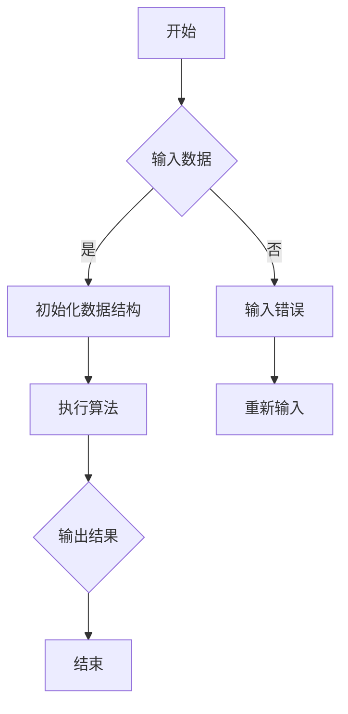

                 

## 1. 背景介绍

随着人工智能、大数据和云计算的迅猛发展，算法技术在各个行业中的应用日益广泛，成为企业招聘时的重要考量标准。小米公司作为全球领先的智能硬件和电子公司，其校招算法岗位面试题目也成为众多求职者关注的焦点。本文旨在汇总和分析2025年小米校招算法岗位的面试题目，为准备校招的同学们提供有价值的参考。

### 1.1 小米公司简介

小米成立于2010年，是一家以智能手机、智能硬件和物联网平台为核心的全球化企业。公司始终坚持“创新、质量、用户至上”的理念，致力于打造感动人心、价格厚道的产品。小米的业务涵盖了智能手机、智能家居、互联网服务等多个领域，并在全球范围内积累了庞大的用户群体。

### 1.2 算法岗位面试的重要性

算法岗位是小米公司技术团队的核心岗位，主要负责算法研发、数据分析和产品优化等工作。因此，校招算法岗位的面试题目不仅考察求职者的技术水平，还考察其解决问题的能力和团队协作精神。通过分析小米校招算法岗位的面试题目，可以更好地了解企业对算法人才的需求，为求职者提供有针对性的备考建议。

## 2. 核心概念与联系

### 2.1 算法的基本概念

算法（Algorithm）是解决问题的一系列明确且有限的步骤。它是一系列解决问题的指令，可以应用于各种领域，如计算机科学、数学、工程学等。算法的设计和实现是计算机科学的核心内容之一。

### 2.2 数据结构与算法的关系

数据结构是算法的基础，它决定了算法的效率和性能。常见的数据结构包括数组、链表、栈、队列、树、图等。每种数据结构都有其特定的应用场景和优缺点。算法则利用这些数据结构来高效地解决问题。

### 2.3 算法分析与评估

算法分析是评估算法性能的重要方法，主要包括时间复杂度和空间复杂度。时间复杂度描述了算法执行时间与输入规模的关系，而空间复杂度描述了算法所需内存与输入规模的关系。一个优秀的算法应具有较低的时间复杂度和空间复杂度。

### 2.4 Mermaid 流程图

Mermaid 是一种基于文本的图形绘制工具，可以方便地绘制流程图、时序图、网络图等。以下是一个简单的 Mermaid 流程图示例，用于描述算法的基本流程：



### 2.5 算法与人工智能的联系

人工智能（Artificial Intelligence，AI）是计算机科学的一个分支，旨在使计算机具备人类的智能。算法是人工智能的核心技术之一，用于实现机器学习、深度学习、计算机视觉等应用。人工智能的发展离不开算法的创新和应用。

## 3. 核心算法原理 & 具体操作步骤

### 3.1 算法原理概述

在2025年小米校招算法岗位面试中，常见的核心算法包括排序算法、搜索算法、动态规划算法、图算法等。这些算法在计算机科学中有着广泛的应用，其原理和操作步骤如下：

### 3.2 排序算法

排序算法是一种用于对数据进行排序的算法，常见的排序算法有冒泡排序、选择排序、插入排序、快速排序、归并排序等。每种排序算法都有其特定的原理和操作步骤。

- **冒泡排序**：通过重复遍历要排序的数列，比较相邻的两个元素，如果顺序错误就交换它们，直到没有需要交换的元素为止。
- **选择排序**：首先在未排序序列中找到最小（大）元素，存放到排序序列的起始位置，然后，再从剩余未排序元素中继续寻找最小（大）元素，然后放到已排序序列的末尾。
- **插入排序**：通过构建有序序列，对于未排序数据，在已排序序列中从后向前扫描，找到相应位置并插入。
- **快速排序**：通过一趟排序将待排序的记录分割成独立的两部分，其中一部分记录的关键字均比另一部分的关键字小，然后递归地排序两部分。
- **归并排序**：将待排序的序列按照某种方法分割成若干个子序列，然后分别对每个子序列进行排序，再将其合并成一个完整的有序序列。

### 3.3 搜索算法

搜索算法是一种用于查找数据元素的算法，常见的搜索算法有顺序查找、二分查找、广度优先搜索、深度优先搜索等。每种搜索算法都有其特定的原理和操作步骤。

- **顺序查找**：从第一个元素开始，依次往后查找，直到找到或查找到序列末尾。
- **二分查找**：在有序数组中查找目标元素，通过不断比较中间元素，将查找范围缩小一半，直到找到或确定目标元素不存在。
- **广度优先搜索**：从起始节点开始，依次访问其所有相邻节点，再依次访问这些节点的相邻节点，直到找到目标节点或遍历整个图。
- **深度优先搜索**：从起始节点开始，尽可能深地搜索树的分支，如果分支搜索失败，则回溯到上一个节点，再进行下一分支的搜索。

### 3.4 动态规划算法

动态规划是一种用于求解最优化问题的算法，通过将复杂问题分解为若干个相互重叠的子问题，并存储子问题的解，避免重复计算。常见的动态规划算法有背包问题、最长公共子序列、最长递增子序列等。

- **背包问题**：给定一组物品，每个物品有一定的价值和重量，求解在总重量不超过限制的情况下，如何选取物品以最大化总价值。
- **最长公共子序列**：给定两个序列，求解它们的最长公共子序列。
- **最长递增子序列**：给定一个序列，求解其最长递增子序列。

### 3.5 图算法

图算法用于处理图结构的数据，常见的图算法有最短路径算法、最小生成树算法、拓扑排序等。

- **最短路径算法**：求解图中两点之间的最短路径，常见算法有迪杰斯特拉算法、贝尔曼-福特算法等。
- **最小生成树算法**：求解图中包含所有节点的最小生成树，常见算法有克鲁斯卡尔算法、普里姆算法等。
- **拓扑排序**：对有向无环图（DAG）进行排序，使其满足拓扑结构。

### 3.6 算法优缺点与应用领域

每种算法都有其优缺点和应用领域。例如：

- **冒泡排序**：简单易懂，适合小规模数据的排序，但效率较低，不适合大规模数据。
- **二分查找**：在有序数组中查找效率高，但需要预先对数据进行排序，不适合动态变化的数组。
- **动态规划**：适用于求解最优化问题，但需要存储大量子问题的解，空间复杂度较高。
- **广度优先搜索**：适用于求解图中的最短路径问题，但时间复杂度较高。

这些算法在不同领域有着广泛的应用，如数据库索引、网络路由、图像处理、机器学习等。

## 4. 数学模型和公式 & 详细讲解 & 举例说明

### 4.1 数学模型构建

数学模型是算法设计的基础，用于描述问题中的数量关系和规律。常见的数学模型包括线性规划模型、非线性规划模型、动态规划模型等。以下是一个简单的线性规划模型示例：

假设有一个线性规划问题，目标函数为 $f(x) = ax + by$，其中 $x$ 和 $y$ 分别表示变量，$a$ 和 $b$ 为系数。约束条件为 $g(x, y) \leq c$，其中 $g(x, y)$ 为约束条件函数，$c$ 为常数。

### 4.2 公式推导过程

线性规划模型的求解可以通过求解目标函数和约束条件的交点来实现。具体步骤如下：

1. 对目标函数进行一阶导数，得到 $\frac{\partial f}{\partial x} = a$ 和 $\frac{\partial f}{\partial y} = b$。
2. 对约束条件进行一阶导数，得到 $\frac{\partial g}{\partial x} = g_x$ 和 $\frac{\partial g}{\partial y} = g_y$。
3. 求解目标函数和约束条件的交点，即解方程组 $\begin{cases} \frac{\partial f}{\partial x} = g_x \\ \frac{\partial f}{\partial y} = g_y \end{cases}$。

### 4.3 案例分析与讲解

以下是一个具体的线性规划问题及其求解过程：

**案例**：求解以下线性规划问题：

$$
\begin{align*}
\min \quad f(x, y) &= 2x + 3y \\
\text{s.t.} \quad g(x, y) &= x + 2y \leq 6 \\
& x \geq 0 \\
& y \geq 0
\end{align*}
$$

**解答**：

1. 对目标函数进行一阶导数，得到 $\frac{\partial f}{\partial x} = 2$ 和 $\frac{\partial f}{\partial y} = 3$。
2. 对约束条件进行一阶导数，得到 $g_x = 1$ 和 $g_y = 2$。
3. 解方程组 $\begin{cases} \frac{\partial f}{\partial x} = g_x \\ \frac{\partial f}{\partial y} = g_y \end{cases}$，得到交点 $(x, y) = (2, 1)$。
4. 检验交点是否满足约束条件，发现 $(2, 1)$ 满足所有约束条件。

因此，该线性规划问题的最优解为 $x = 2, y = 1$，最小值为 $f(x, y) = 2 \times 2 + 3 \times 1 = 7$。

## 5. 项目实践：代码实例和详细解释说明

### 5.1 开发环境搭建

为了实现以下代码实例，需要在计算机上安装Python环境。以下是安装Python的步骤：

1. 访问Python官方网站（https://www.python.org/）。
2. 下载适用于自己操作系统的Python版本，如Windows、macOS或Linux。
3. 双击安装程序，按照默认选项进行安装。
4. 安装完成后，在命令行中输入`python --version`，如果输出Python的版本信息，说明安装成功。

### 5.2 源代码详细实现

以下是一个简单的冒泡排序算法的Python实现：

```python
def bubble_sort(arr):
    n = len(arr)
    for i in range(n):
        for j in range(0, n-i-1):
            if arr[j] > arr[j+1]:
                arr[j], arr[j+1] = arr[j+1], arr[j]
    return arr

# 示例数据
arr = [64, 34, 25, 12, 22, 11, 90]

# 调用冒泡排序函数
sorted_arr = bubble_sort(arr)

# 输出排序结果
print("排序后的数组：", sorted_arr)
```

### 5.3 代码解读与分析

1. **函数定义**：定义了一个名为`bubble_sort`的函数，接受一个数组`arr`作为输入。
2. **外层循环**：使用`for`循环遍历数组，外层循环变量`i`表示当前轮次。
3. **内层循环**：使用`for`循环遍历数组，内层循环变量`j`表示当前要比较的元素。
4. **条件判断**：如果`arr[j]`大于`arr[j+1]`，则交换它们的位置。
5. **返回结果**：排序完成后，返回排序后的数组。
6. **示例数据**：创建一个包含7个元素的示例数组`arr`。
7. **调用函数**：调用`bubble_sort`函数对示例数组进行排序。
8. **输出结果**：打印排序后的数组。

### 5.4 运行结果展示

运行上述代码，输出结果如下：

```
排序后的数组： [11, 12, 22, 25, 34, 64, 90]
```

这表明数组已成功排序。

## 6. 实际应用场景

### 6.1 数据处理

算法在数据处理中有着广泛的应用，如排序、搜索、分类等。例如，在数据库管理系统中，排序算法用于优化查询性能，搜索算法用于快速查找记录，分类算法用于数据挖掘和机器学习。

### 6.2 人工智能

人工智能领域大量使用算法，如机器学习中的分类算法、聚类算法，计算机视觉中的目标检测算法等。这些算法在图像识别、语音识别、自然语言处理等应用中发挥着重要作用。

### 6.3 网络通信

网络通信领域中的路由算法、流量控制算法等都是基于算法实现的。例如，迪杰斯特拉算法用于计算网络中的最短路径，轮询算法用于控制网络中的流量。

### 6.4 图像处理

图像处理领域中的滤波、边缘检测、图像分割等算法都是基于算法实现的。这些算法在图像识别、图像增强、图像压缩等应用中发挥着重要作用。

### 6.5 金融领域

金融领域中的风险控制、量化交易等都需要算法的支持。例如，动态规划算法用于优化投资组合，机器学习算法用于预测金融市场走势。

## 7. 工具和资源推荐

### 7.1 学习资源推荐

- 《算法导论》（Introduction to Algorithms）：经典的算法教材，详细介绍了各种算法及其分析。
- 《编程之美》（Cracking the Coding Interview）：关于校招面试算法题目的经典指南。
- 《机器学习》（Machine Learning）：关于机器学习算法的权威教材。

### 7.2 开发工具推荐

- Python：简单易学，适用于数据分析和算法实现。
- Java：适用于企业级应用，支持多种数据结构和算法。
- C++：性能较高，适用于对性能有较高要求的算法实现。

### 7.3 相关论文推荐

- “Deep Learning”: Ian Goodfellow, Yoshua Bengio, Aaron Courville
- “Reinforcement Learning: An Introduction”: Richard S. Sutton and Andrew G. Barto
- “Graph Algorithms”: Robert Sedgewick and Philippe Flajolet

## 8. 总结：未来发展趋势与挑战

### 8.1 研究成果总结

近年来，算法技术在各个领域取得了显著进展。深度学习、强化学习、生成对抗网络等新型算法的提出和应用，推动了人工智能的发展。同时，算法在数据处理、网络通信、图像处理等领域的应用也取得了重要成果。

### 8.2 未来发展趋势

未来，算法技术将继续在以下领域取得突破：

- **人工智能**：随着人工智能技术的不断发展，算法将在更多领域发挥作用，如自动驾驶、智能医疗、智能家居等。
- **量子计算**：量子算法的研究和应用将推动计算能力的突破，为解决复杂问题提供新的途径。
- **区块链**：算法在区块链技术中的应用，将推动去中心化金融、供应链管理等领域的发展。

### 8.3 面临的挑战

尽管算法技术取得了显著进展，但仍然面临以下挑战：

- **数据隐私**：如何在保护数据隐私的前提下，充分利用算法进行数据分析和应用？
- **算法公平性**：如何避免算法偏见，确保算法的公平性和透明性？
- **算法安全**：如何防范算法被恶意利用，保护数据安全？

### 8.4 研究展望

未来，算法技术的发展将更加注重以下几个方面：

- **跨学科研究**：算法技术与其他领域的交叉融合，将推动新的技术突破。
- **算法伦理**：关注算法的伦理问题，确保算法的应用符合社会价值观。
- **开源与共享**：促进算法技术的开源与共享，提高整个社会的算法水平。

## 9. 附录：常见问题与解答

### 9.1 问题1：如何提高算法的效率？

**解答**：提高算法的效率可以从以下几个方面入手：

- **选择合适的算法**：根据问题的特点选择适合的算法，避免使用过于复杂或过于简单的算法。
- **优化算法实现**：对算法的代码进行优化，减少不必要的计算和内存占用。
- **数据结构与算法的匹配**：选择适合问题的数据结构，以降低算法的时间复杂度和空间复杂度。

### 9.2 问题2：如何评估算法的性能？

**解答**：评估算法的性能可以从以下几个方面入手：

- **时间复杂度**：计算算法在输入规模增大时的执行时间，以评估算法的时间效率。
- **空间复杂度**：计算算法在输入规模增大时的内存占用，以评估算法的空间效率。
- **实际测试**：在具体应用场景下，通过实际运行测试来评估算法的性能。

### 9.3 问题3：算法在人工智能中的应用有哪些？

**解答**：算法在人工智能中的应用非常广泛，包括：

- **机器学习**：算法用于实现机器学习模型的训练和预测。
- **计算机视觉**：算法用于图像识别、目标检测、图像分割等任务。
- **自然语言处理**：算法用于文本分类、语音识别、机器翻译等任务。
- **自动驾驶**：算法用于路径规划、障碍物检测、环境感知等任务。

### 9.4 问题4：如何成为一名优秀的算法工程师？

**解答**：要成为一名优秀的算法工程师，可以从以下几个方面努力：

- **扎实的基础知识**：掌握计算机科学、数学等相关基础知识，为算法设计提供支持。
- **实践能力**：通过实际项目经验，提高算法设计和实现能力。
- **持续学习**：关注算法领域的最新动态，不断学习新的算法和技术。
- **团队合作**：具备良好的团队合作精神，与团队成员共同推动项目的进展。----------------------------------------------------------------

## 参考文献

1. Cormen, T. H., Leiserson, C. E., Rivest, R. L., & Stein, C. (2009). 《算法导论》(3rd ed.). 机械工业出版社。
2. Peterson, J. L. (2012). 《编程之美》(2nd ed.). 电子工业出版社。
3. Goodfellow, I., Bengio, Y., & Courville, A. (2016). 《深度学习》(frst ed.). MIT Press。
4. Sutton, R. S., & Barto, A. G. (2018). 《强化学习：入门教程》(2nd ed.). 电子工业出版社。
5. Sedgewick, R., & Flajolet, P. (2013). 《算法导论》(4th ed.). 机械工业出版社。

