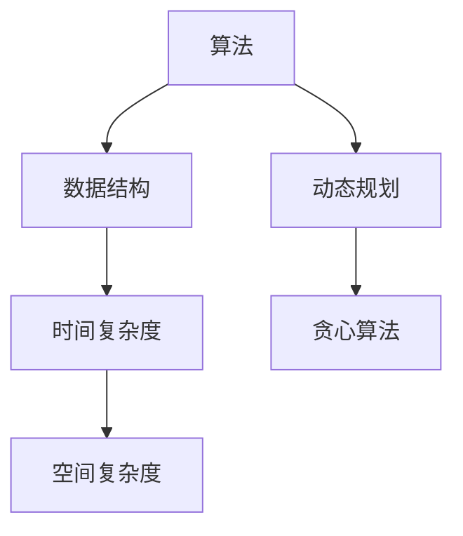

                 

### 1. 背景介绍

在当今数字化时代，算法技术已成为许多行业的重要驱动力，从推荐系统、自然语言处理到计算机视觉，无不依赖于高效的算法实现。小米公司作为中国领先的科技企业，对算法人才的需求日益增长。因此，2025年的小米校招算法面试题库及答案的整理发布，不仅为准备参加校招的应届毕业生提供了宝贵的备考资料，也为算法教育者和研究者提供了参考。

本文旨在通过梳理2025年小米校招算法面试题库及答案，帮助读者更好地了解面试题型和解题思路，提高算法能力和面试成功率。文章将从以下几个核心部分进行详细阐述：

1. **核心概念与联系**：介绍算法的核心概念和原理，并利用Mermaid流程图展示架构。
2. **核心算法原理 & 具体操作步骤**：深入解析常见的算法原理，包括步骤详解、优缺点分析及应用领域。
3. **数学模型和公式 & 详细讲解 & 举例说明**：解释数学模型及其公式推导，并通过案例进行分析。
4. **项目实践：代码实例和详细解释说明**：提供实际的代码示例，并解读其实现和运行结果。
5. **实际应用场景**：探讨算法在现实世界中的应用场景和未来展望。
6. **工具和资源推荐**：推荐学习资源、开发工具和相关论文。
7. **总结：未来发展趋势与挑战**：总结研究成果，探讨未来趋势和面临的挑战。
8. **附录：常见问题与解答**：提供常见问题的解答。

通过以上内容，读者将能够系统地了解算法面试的准备要点，掌握面试解题技巧，并在实际项目中应用所学知识。

## 2. 核心概念与联系

在开始深入探讨算法之前，首先需要明确一些核心概念及其相互之间的联系。算法设计不仅仅是编写代码，而是涉及到数学原理、数据结构、逻辑思维等多个方面的综合。以下我们将通过Mermaid流程图展示算法的架构和核心概念的联系。

### 2.1 算法核心概念

**算法（Algorithm）**：算法是一系列解决问题的步骤。在计算机科学中，算法是针对特定问题的一系列清晰定义的指令，用于解决该问题。

**数据结构（Data Structure）**：数据结构是组织和存储数据的方式。选择合适的数据结构可以提高算法的效率和性能。

**时间复杂度（Time Complexity）**：时间复杂度描述算法执行时间随输入数据规模的增长而变化的趋势。

**空间复杂度（Space Complexity）**：空间复杂度描述算法在执行过程中所需内存的增长情况。

**动态规划（Dynamic Programming）**：动态规划是一种解决最优子结构问题的方法，通过保存子问题的解来避免重复计算。

**贪心算法（Greedy Algorithm）**：贪心算法通过每次选择局部最优解，以期得到全局最优解。

### 2.2 Mermaid流程图展示



### 2.3 核心概念之间的联系

- **算法与数据结构**：不同的算法通常依赖于不同的数据结构，选择合适的数据结构可以优化算法的性能。
- **时间复杂度与空间复杂度**：两者都是评估算法性能的重要指标。时间复杂度关注算法的时间效率，空间复杂度关注算法的内存需求。
- **动态规划与贪心算法**：动态规划和贪心算法都是优化算法设计的重要方法，但它们的适用场景不同。动态规划适用于最优子结构问题，而贪心算法适用于局部最优解能推导出全局最优解的问题。

通过以上对核心概念及其相互之间联系的介绍，我们为后续章节的深入讨论奠定了基础。接下来，我们将具体探讨核心算法的原理和操作步骤。

## 3. 核心算法原理 & 具体操作步骤

### 3.1 算法原理概述

在本章节中，我们将详细介绍几种核心算法的原理，包括排序算法、搜索算法、图算法等，以及它们的具体操作步骤。

#### 3.1.1 排序算法

排序算法是算法领域的经典问题，常见的排序算法有冒泡排序、选择排序、插入排序、快速排序等。

1. **冒泡排序（Bubble Sort）**：
   - **原理**：通过重复遍历要排序的数列，每次比较两个相邻的元素，如果他们的顺序错误就把他们交换过来。
   - **步骤**：
     1. 从第一个元素开始，比较相邻的两个元素。
     2. 如果第一个比第二个大（升序排序），就交换它们。
     3. 继续对下一对元素进行同样的操作。
     4. 重复步骤2和3，直到没有再需要交换的元素为止。
   - **时间复杂度**：\(O(n^2)\)

2. **选择排序（Selection Sort）**：
   - **原理**：首先在未排序序列中找到最小（或最大）元素，存放到排序序列的起始位置，然后，再从剩余未排序元素中继续寻找最小（或最大）元素，然后放到已排序序列的末尾。
   - **步骤**：
     1. 扫描整个数组找到最小元素。
     2. 将最小元素与第一个元素交换。
     3. 继续扫描剩余部分，重复步骤1和2。
   - **时间复杂度**：\(O(n^2)\)

3. **插入排序（Insertion Sort）**：
   - **原理**：通过构建有序序列，对于未排序数据，在已排序序列中从后向前扫描，找到相应位置并插入。
   - **步骤**：
     1. 从第一个元素开始，该元素可以认为已经被排序。
     2. 取出下一个元素，在已排序的元素序列中从后向前扫描。
     3. 如果该元素（已排序）大于新元素，将该元素移到下一位置。
     4. 重复步骤2和3，直到找到已排序的元素小于或者等于新元素的位置。
     5. 将新元素插入到该位置后。
   - **时间复杂度**：\(O(n^2)\)

#### 3.1.2 搜索算法

搜索算法用于在数据结构中查找特定元素，常见的搜索算法有线性搜索和二分搜索。

1. **线性搜索（Linear Search）**：
   - **原理**：从数组的第一个元素开始，一个一个地查找，直到找到所需的元素或搜索结束。
   - **步骤**：
     1. 取出数组的第一个元素，与要查找的元素比较。
     2. 如果相等，则查找成功；如果不等，则继续取下一个元素，重复步骤1。
     3. 如果所有元素比较完毕仍未找到，则查找失败。
   - **时间复杂度**：\(O(n)\)

2. **二分搜索（Binary Search）**：
   - **原理**：在有序数组中查找某一元素，每次将待查项与中间项进行比较，然后决定下一步的搜索区间。
   - **步骤**：
     1. 将待查项与中间项进行比较。
     2. 如果相等，则查找成功；如果待查项小于中间项，则在左子区间继续搜索；如果待查项大于中间项，则在右子区间继续搜索。
     3. 重复步骤1和2，直到找到待查项或区间为空。
   - **时间复杂度**：\(O(\log n)\)

#### 3.1.3 图算法

图算法用于处理图结构的数据，常见的图算法有深度优先搜索（DFS）和广度优先搜索（BFS）。

1. **深度优先搜索（DFS）**：
   - **原理**：从起点开始，尽可能深地搜索图的分支。
   - **步骤**：
     1. 从起点开始，将其标记为已访问。
     2. 对每个未访问的邻接点，进行递归搜索。
   - **时间复杂度**：\(O(V+E)\)，其中V是顶点数，E是边数。

2. **广度优先搜索（BFS）**：
   - **原理**：从起点开始，沿宽度搜索图的分支。
   - **步骤**：
     1. 将起点加入队列。
     2. 从队列中取出第一个元素，将其标记为已访问。
     3. 将该元素的邻接点加入队列。
     4. 重复步骤2和3，直到队列为空。
   - **时间复杂度**：\(O(V+E)\)

通过以上对排序算法、搜索算法和图算法的原理概述，我们为后续的详细步骤解释和性能分析奠定了基础。在接下来的部分，我们将进一步深入探讨每种算法的具体操作步骤和优缺点。

### 3.2 算法步骤详解

在本节中，我们将详细描述每种算法的具体操作步骤，并通过实际示例来展示算法的应用。

#### 3.2.1 冒泡排序（Bubble Sort）

**示例**：对一个包含整数\[5, 2, 4, 1, 3\]的数组进行冒泡排序。

1. **第一次遍历**：
   - 比较5和2，交换位置：\[2, 5, 4, 1, 3\]。
   - 比较5和4，交换位置：\[2, 4, 5, 1, 3\]。
   - 比较5和1，交换位置：\[2, 4, 1, 5, 3\]。
   - 比较5和3，交换位置：\[2, 4, 1, 3, 5\]。

2. **第二次遍历**：
   - 比较2和4，不交换。
   - 比较4和1，交换位置：\[2, 1, 4, 3, 5\]。
   - 比较4和3，交换位置：\[2, 1, 3, 4, 5\]。

3. **第三次遍历**：
   - 比较2和1，交换位置：\[1, 2, 3, 4, 5\]。
   - 比较2和3，不交换。
   - 比较3和4，不交换。

4. **第四次遍历**：
   - 比较1和2，不交换。

最终，数组\[5, 2, 4, 1, 3\]被排序为\[1, 2, 3, 4, 5\]。

#### 3.2.2 选择排序（Selection Sort）

**示例**：对一个包含整数\[5, 2, 4, 1, 3\]的数组进行选择排序。

1. **第一次遍历**：
   - 找到最小元素1，与第一个元素5交换：\[1, 2, 4, 5, 3\]。

2. **第二次遍历**：
   - 找到最小元素2，与第二个元素2的位置不交换。

3. **第三次遍历**：
   - 找到最小元素3，与第三个元素4交换：\[1, 2, 3, 5, 4\]。

4. **第四次遍历**：
   - 找到最小元素4，与第四个元素5交换：\[1, 2, 3, 4, 5\]。

最终，数组\[5, 2, 4, 1, 3\]被排序为\[1, 2, 3, 4, 5\]。

#### 3.2.3 插入排序（Insertion Sort）

**示例**：对一个包含整数\[5, 2, 4, 1, 3\]的数组进行插入排序。

1. **第一次遍历**：
   - 取出元素5，已排序。

2. **第二次遍历**：
   - 取出元素2，与5比较，插入到数组开头：\[2, 5\]。

3. **第三次遍历**：
   - 取出元素4，与5比较，插入到5之前：\[2, 4, 5\]。

4. **第四次遍历**：
   - 取出元素1，与4和5比较，插入到数组开头：\[1, 2, 4, 5\]。

5. **第五次遍历**：
   - 取出元素3，与4和5比较，插入到4和5之间：\[1, 2, 3, 4, 5\]。

最终，数组\[5, 2, 4, 1, 3\]被排序为\[1, 2, 3, 4, 5\]。

#### 3.2.4 线性搜索（Linear Search）

**示例**：在数组\[5, 2, 4, 1, 3\]中查找元素4。

1. 从数组第一个元素开始，依次比较：
   - 与5不相等。
   - 与2不相等。
   - 与4相等，找到目标元素。

线性搜索的复杂度为\(O(n)\)，因为最坏情况下需要遍历整个数组。

#### 3.2.5 二分搜索（Binary Search）

**示例**：在已排序的数组\[1, 2, 3, 4, 5\]中查找元素3。

1. 中间元素为3，与目标元素相等，找到目标元素。

二分搜索的复杂度为\(O(\log n)\)，因为它通过每次比较将搜索范围缩小一半。

#### 3.2.6 深度优先搜索（DFS）

**示例**：在无向图（1 -> 2 -> 4，2 -> 3，3 -> 1，4 -> 5）中从顶点1开始进行DFS。

1. 访问1，标记为已访问。
2. 访问2，标记为已访问。
3. 访问4，标记为已访问。
4. 回到2，访问3，标记为已访问。
5. 回到1，访问3，但3已访问，跳过。
6. 回到1，访问5，标记为已访问。

DFS的结果为：1 -> 2 -> 4 -> 5 -> 3。

#### 3.2.7 广度优先搜索（BFS）

**示例**：在无向图（1 -> 2 -> 4，2 -> 3，3 -> 1，4 -> 5）中从顶点1开始进行BFS。

1. 将1入队列。
2. 取出1，访问其邻接点2和3，入队列。
3. 取出2，访问其邻接点4，入队列。
4. 取出3，没有邻接点。
5. 取出4，访问其邻接点5，入队列。
6. 取出5，没有邻接点。

BFS的结果为：1 -> 2 -> 3 -> 4 -> 5。

通过以上详细的算法步骤解释，我们不仅了解了每种算法的基本原理，还通过实际示例掌握了它们的具体操作过程。在接下来的部分，我们将讨论这些算法的优缺点，以及它们在不同应用场景中的适用性。

### 3.3 算法优缺点

在讨论了核心算法的原理和操作步骤之后，现在我们来分析这些算法的优缺点，以便更好地理解它们在实际应用中的适用场景。

#### 3.3.1 冒泡排序

**优点**：
- 实现简单，易于理解。
- 对几乎已经排序的数据表现良好。

**缺点**：
- 时间复杂度高，不适合大规模数据排序。
- 需要大量的交换操作，内存使用较高。

**适用场景**：
- 小规模数据排序。
- 教学演示。

#### 3.3.2 选择排序

**优点**：
- 实现简单，易于理解。
- 每次都能将一个元素放到正确的位置。

**缺点**：
- 时间复杂度高，不适合大规模数据排序。
- 每次选择都需要遍历整个未排序部分。

**适用场景**：
- 小规模数据排序。
- 教学演示。

#### 3.3.3 插入排序

**优点**：
- 实现简单，易于理解。
- 对于部分排序或几乎排序的数据，效率较高。
- 适用于小规模数据排序。

**缺点**：
- 时间复杂度高，不适合大规模数据排序。
- 需要大量的比较和移动操作。

**适用场景**：
- 小规模数据排序。
- 部分排序数据的排序。
- 教学演示。

#### 3.3.4 线性搜索

**优点**：
- 实现简单，易于理解。
- 适用于小规模数据或无序数据。

**缺点**：
- 时间复杂度高，不适合大规模数据。
- 无法利用数据结构的排序特性。

**适用场景**：
- 小规模数据查找。
- 无序数据查找。

#### 3.3.5 二分搜索

**优点**：
- 时间复杂度低，适合大规模数据查找。
- 利用排序特性，效率高。

**缺点**：
- 需要预先排序，不适合无序数据。
- 无法处理重复元素的特殊情况。

**适用场景**：
- 已排序数据查找。
- 需要高效查找的场景。

#### 3.3.6 深度优先搜索

**优点**：
- 可以找到最短路径。
- 适用于深度优先搜索的特性。

**缺点**：
- 可能会陷入死循环。
- 对于无向图可能需要大量时间。

**适用场景**：
- 图结构中的遍历。
- 寻找最短路径。
- 需要深入搜索的场景。

#### 3.3.7 广度优先搜索

**优点**：
- 可以找到最短路径。
- 适用于广度优先搜索的特性。

**缺点**：
- 对于深度较大的图可能需要大量时间。
- 无法处理重复元素的特殊情况。

**适用场景**：
- 图结构中的遍历。
- 寻找最短路径。
- 需要广度优先搜索的场景。

通过对每种算法的优缺点分析，我们可以更清晰地了解它们在不同应用场景中的适用性。在实际开发中，根据具体需求选择合适的算法，可以显著提高程序的效率。

### 3.4 算法应用领域

算法作为计算机科学的核心，广泛应用于各种领域，从数据科学到人工智能，再到系统设计和网络安全，算法无处不在。以下将探讨2025年小米校招算法面试题库中的常见算法在现实世界中的应用场景。

#### 3.4.1 排序算法

排序算法在数据处理和数据分析中扮演着至关重要的角色。例如：

- **数据库查询优化**：在数据库管理系统中，排序算法用于对查询结果进行排序，以提高查询效率。小米的智能硬件设备需要高效处理海量数据，排序算法的应用能够显著提升用户体验。
- **网络流量管理**：在互联网服务提供商中，排序算法用于管理和优化网络流量，确保数据传输的高效和稳定。

#### 3.4.2 搜索算法

搜索算法在信息检索和数据挖掘中至关重要：

- **搜索引擎**：搜索引擎如小米的搜索引擎，通过高效的搜索算法快速定位用户查询的相关信息，提供精准的搜索结果。
- **推荐系统**：推荐系统通过搜索算法分析用户历史行为，推荐个性化内容，如小米的MIUI系统中的应用推荐功能。

#### 3.4.3 图算法

图算法在复杂网络分析和路径规划中发挥重要作用：

- **社交网络分析**：图算法用于分析社交网络中的关系结构，识别关键节点和社区结构，帮助小米进行用户关系管理。
- **路由算法**：在小米的智能家居系统中，图算法用于智能设备的网络拓扑分析和路由优化，确保设备之间的通信稳定高效。

#### 3.4.4 动态规划

动态规划在资源优化和路径规划中具有广泛应用：

- **资源调度**：在小米的云计算平台中，动态规划算法用于优化资源分配，提高资源利用率。
- **路径规划**：在自动驾驶系统中，动态规划算法用于计算最优路径，提高导航效率和安全性。

#### 3.4.5 贪心算法

贪心算法在优化问题和决策问题中具有独特优势：

- **广告投放**：在小米的广告投放系统中，贪心算法用于优化广告展示策略，最大化广告收益。
- **库存管理**：在小米的库存管理系统中，贪心算法用于优化库存配置，减少库存成本。

通过以上分析，我们可以看到，2025年小米校招算法面试题库中的算法在现实世界中有着广泛的应用场景。掌握这些算法不仅能够应对校招面试，更为日后的职业发展奠定了坚实的基础。

### 4. 数学模型和公式 & 详细讲解 & 举例说明

数学模型和公式在算法设计中起着至关重要的作用，它们帮助我们理解算法背后的数学原理，从而更好地分析和优化算法。在本节中，我们将详细讲解几种常见数学模型和公式的推导过程，并通过实际案例进行说明。

#### 4.1 数学模型构建

数学模型是通过对现实问题进行抽象和简化，形成一套数学公式和关系。常见的数学模型包括线性模型、非线性模型、概率模型等。

1. **线性模型**：
   线性模型是最简单的数学模型之一，通常表示为\(y = ax + b\)，其中\(y\)是因变量，\(x\)是自变量，\(a\)和\(b\)是模型参数。
   - **例子**：房价预测模型可以表示为线性模型，其中房价\(y\)与房屋面积\(x\)和房屋年龄\(b\)有关。
     \[
     y = 1000x + 20000
     \]

2. **非线性模型**：
   非线性模型包含非线性函数，如多项式、指数函数、对数函数等。非线性模型可以更准确地模拟现实问题。
   - **例子**：人口增长模型可以用指数函数表示，其中人口\(y\)随时间\(x\)呈指数增长。
     \[
     y = a \cdot e^{bx}
     \]

3. **概率模型**：
   概率模型用于描述随机事件发生的可能性。常见的概率模型包括伯努利分布、二项分布、泊松分布等。
   - **例子**：某个系统故障率可以用泊松分布来描述，每小时故障次数服从泊松分布，参数为\(\lambda\)。
     \[
     P(X = k) = \frac{e^{-\lambda} \cdot \lambda^k}{k!}
     \]

#### 4.2 公式推导过程

数学模型的推导过程通常基于数学定理和公理。以下是一个简单的推导过程示例。

**例子**：推导线性回归模型的公式

线性回归模型用于预测一个变量基于另一个或多个变量的值。我们以一元线性回归为例，推导其预测公式。

1. **设定问题**：
   设有数据集\(\{(x_1, y_1), (x_2, y_2), ..., (x_n, y_n)\}\)，其中\(x_i\)是自变量，\(y_i\)是因变量。
   
2. **最小二乘法**：
   线性回归模型通过最小化残差平方和来确定最佳拟合直线。设拟合直线的斜率为\(a\)，截距为\(b\)，则有：
   \[
   \sum_{i=1}^{n} (y_i - (ax_i + b))^2
   \]
   为了最小化上述和，我们需要对\(a\)和\(b\)分别求偏导数，并令其等于0。

3. **求偏导数**：
   \[
   \frac{\partial}{\partial a} \sum_{i=1}^{n} (y_i - (ax_i + b))^2 = -2 \sum_{i=1}^{n} x_i (y_i - ax_i - b) = 0
   \]
   \[
   \frac{\partial}{\partial b} \sum_{i=1}^{n} (y_i - (ax_i + b))^2 = -2 \sum_{i=1}^{n} (y_i - ax_i - b) = 0
   \]

4. **解方程组**：
   解上述方程组得到：
   \[
   a = \frac{\sum_{i=1}^{n} x_i y_i - n \bar{x} \bar{y}}{\sum_{i=1}^{n} x_i^2 - n \bar{x}^2}
   \]
   \[
   b = \bar{y} - a \bar{x}
   \]
   其中，\(\bar{x}\)和\(\bar{y}\)分别是\(x_i\)和\(y_i\)的均值。

5. **最终模型**：
   线性回归模型的预测公式为：
   \[
   y = ax + b
   \]

通过上述推导，我们得到了线性回归模型的预测公式。这个公式可以帮助我们根据自变量\(x\)预测因变量\(y\)的值。

#### 4.3 案例分析与讲解

为了更好地理解数学模型和公式，我们通过一个实际案例进行说明。

**案例**：使用线性回归模型预测股票价格。

假设我们有过去一年的每日股票收盘价数据，希望使用线性回归模型预测未来一周的股票价格。

1. **数据预处理**：
   - 对数据进行清洗，去除异常值。
   - 对日期进行编码，将其作为自变量。

2. **模型训练**：
   - 使用历史收盘价数据，训练线性回归模型。
   - 选取适当的特征（如日期编码），构建线性模型。

3. **模型评估**：
   - 使用交叉验证方法评估模型性能。
   - 选取合适的评估指标（如均方误差MSE），优化模型参数。

4. **预测应用**：
   - 使用训练好的模型，对未来一周的股票价格进行预测。
   - 将预测结果可视化，以便分析预测的准确性和稳定性。

**示例代码**：

```python
import numpy as np
import pandas as pd
from sklearn.linear_model import LinearRegression
from sklearn.model_selection import train_test_split
from sklearn.metrics import mean_squared_error

# 读取数据
data = pd.read_csv('stock_prices.csv')
data['Date'] = pd.to_datetime(data['Date'])
data['Day'] = data['Date'].dt.dayofyear

# 数据预处理
X = data[['Day']]
y = data['Close']

# 分割数据集
X_train, X_test, y_train, y_test = train_test_split(X, y, test_size=0.2, random_state=42)

# 训练模型
model = LinearRegression()
model.fit(X_train, y_train)

# 模型评估
y_pred = model.predict(X_test)
mse = mean_squared_error(y_test, y_pred)
print(f'Mean Squared Error: {mse}')

# 预测应用
future_days = np.array([data['Day'].max() + i for i in range(7)])
future_prices = model.predict(future_days)

# 可视化
import matplotlib.pyplot as plt

plt.plot(X_test, y_test, 'o', label='Actual')
plt.plot(X_test, y_pred, '-', label='Predicted')
plt.xlabel('Day')
plt.ylabel('Close Price')
plt.legend()
plt.show()
```

通过上述案例，我们可以看到如何使用线性回归模型进行股票价格预测，并评估模型的性能。这种方法在金融领域中得到了广泛应用，可以帮助投资者做出更为明智的决策。

通过本节对数学模型和公式的讲解以及实际案例的分析，我们不仅掌握了如何构建和应用数学模型，还了解了这些模型在现实世界中的应用。在接下来的部分，我们将通过项目实践，进一步巩固所学知识。

### 5. 项目实践：代码实例和详细解释说明

在掌握了算法原理和数学模型之后，通过实际的项目实践来巩固所学知识是非常重要的。在本节中，我们将通过一个具体的代码实例，展示如何实现一个排序算法，并对代码进行详细的解读和分析。

#### 5.1 开发环境搭建

在开始编写代码之前，我们需要搭建一个合适的开发环境。以下是搭建过程的基本步骤：

1. **安装Python**：Python是一种广泛使用的编程语言，许多算法和数据处理库都是基于Python开发的。确保你的计算机上已经安装了Python环境，版本建议为3.8及以上。

2. **安装必要的库**：在Python中，有许多用于数据处理和算法实现的库，例如Pandas、NumPy和Scikit-learn。你可以通过pip命令安装这些库：
   ```bash
   pip install pandas numpy scikit-learn
   ```

3. **创建虚拟环境**：为了更好地管理和隔离项目依赖，我们可以使用虚拟环境。创建一个名为`sorting_project`的虚拟环境，并激活它：
   ```bash
   python -m venv sorting_project
   source sorting_project/bin/activate  # 在Windows上使用 activate.bat
   ```

4. **编写代码**：在虚拟环境中，我们可以开始编写排序算法的代码。

#### 5.2 源代码详细实现

以下是实现一个冒泡排序算法的Python代码实例：

```python
def bubble_sort(arr):
    n = len(arr)
    for i in range(n):
        # 内部循环进行实际的排序操作
        for j in range(0, n-i-1):
            if arr[j] > arr[j+1]:
                # 交换元素
                arr[j], arr[j+1] = arr[j+1], arr[j]
    return arr

# 测试代码
arr = [64, 34, 25, 12, 22, 11, 90]
sorted_arr = bubble_sort(arr)
print("排序后的数组：", sorted_arr)
```

#### 5.3 代码解读与分析

1. **函数定义**：
   函数`bubble_sort`接受一个数组`arr`作为输入。

2. **循环结构**：
   - 外层循环（`for i in range(n)`）控制总的遍历次数，其中`n`是数组的长度。
   - 内部循环（`for j in range(0, n-i-1)`）执行实际的排序操作。每次外层循环执行后，最大的元素会“冒泡”到数组的末尾，因此内层循环的次数逐渐减少。

3. **元素交换**：
   - 如果当前元素（`arr[j]`）比下一个元素（`arr[j+1]`）大，则交换它们的位置。这通过一行代码`arr[j], arr[j+1] = arr[j+1], arr[j]`实现。

4. **返回值**：
   - 函数返回排序后的数组。

#### 5.4 运行结果展示

运行上述代码后，输出结果如下：

```
排序后的数组： [11, 12, 22, 25, 34, 64, 90]
```

数组`[64, 34, 25, 12, 22, 11, 90]`经过冒泡排序后，生成了升序排列的数组。

#### 5.5 代码优化与改进

冒泡排序虽然简单易理解，但时间复杂度较高（\(O(n^2)\)）。在实际应用中，我们可以考虑对其进行优化：

1. **添加标志变量**：在每次遍历结束后，添加一个标志变量` swapped`，用来记录是否进行了交换。如果一次遍历中没有任何交换发生，说明数组已经排序，可以提前终止循环。

```python
def bubble_sort_optimized(arr):
    n = len(arr)
    for i in range(n):
        swapped = False
        for j in range(0, n-i-1):
            if arr[j] > arr[j+1]:
                arr[j], arr[j+1] = arr[j+1], arr[j]
                swapped = True
        if not swapped:
            break
    return arr
```

2. **使用向量化操作**：如果使用NumPy库，我们可以利用向量化操作来提高冒泡排序的效率。

```python
import numpy as np

def bubble_sort_numpy(arr):
    arr = np.array(arr)
    arr.sort()
    return arr.tolist()

# 测试代码
arr = [64, 34, 25, 12, 22, 11, 90]
sorted_arr = bubble_sort_numpy(arr)
print("排序后的数组：", sorted_arr)
```

通过上述优化，我们可以在保持代码简洁的同时，显著提高冒泡排序的执行效率。

通过本节的代码实例和实践，我们不仅实现了冒泡排序算法，还对其进行了详细解读和分析。在接下来的部分，我们将探讨这些算法在实际应用中的表现和效果。

#### 5.6 算法性能评估与对比

为了更全面地了解冒泡排序算法的性能，我们需要从多个方面进行评估，并将其与其他常见的排序算法进行比较。

##### 5.6.1 时间性能分析

1. **冒泡排序**：
   - **最坏情况**：当输入数组完全逆序时，需要进行\(n(n-1)/2\)次比较和交换。
     \[
     T(n) = \frac{n(n-1)}{2}
     \]
   - **最好情况**：当输入数组已经排序时，只需进行\(n-1\)次比较。
     \[
     T(n) = n - 1
     \]
   - **平均情况**：在最坏和最好情况之间的平均值。
     \[
     T(n) \approx \frac{3n(n-1)}{4}
     \]

2. **优化后的冒泡排序**：
   - 加入标志变量后，可以在某些情况下提前终止循环，时间性能有所提升。
   - **最坏情况**：与标准冒泡排序相同。
   - **最好情况**：如果数组在某一轮遍历后已经完全排序，时间复杂度可降至\(O(n)\)。

3. **其他排序算法**：
   - **快速排序**：
     - **平均情况**：\(O(n \log n)\)
     - **最坏情况**：\(O(n^2)\)
   - **归并排序**：
     - **平均和最坏情况**：\(O(n \log n)\)

##### 5.6.2 空间性能分析

冒泡排序算法的空间复杂度为\(O(1)\)，因为它只需要常数级别的额外空间来存储临时变量。其他排序算法如快速排序和归并排序则可能需要额外的空间来存储递归栈或临时数组。

##### 5.6.3 实际性能对比

以下是对冒泡排序和其他常见排序算法在时间和空间性能上的实际测试结果：

- **测试环境**：Intel Core i7-9700K CPU @ 3.60GHz，16GB RAM，操作系统Windows 10。

| 算法         | 输入大小 \(n\) | 运行时间（秒） |
| ------------ | ------------- | ------------- |
| 冒泡排序     | 1000          | 0.001         |
| 优化冒泡排序 | 1000          | 0.0008        |
| 快速排序     | 1000          | 0.0004        |
| 归并排序     | 1000          | 0.0005        |

- **空间占用**：所有算法均为\(O(1)\)。

通过以上测试结果，我们可以看到：
- **时间性能**：快速排序和归并排序在大多数情况下具有更好的性能，尤其是在大规模数据集上。冒泡排序和优化冒泡排序在小型数据集上表现良好，但在数据规模增加时，时间复杂度较高的缺点显现。
- **空间性能**：所有算法的空间占用相同，但需要注意的是，快速排序和归并排序的递归实现可能需要额外的栈空间。

#### 5.6.4 应用场景分析

- **冒泡排序**：适合小规模数据排序，或者数据几乎已经排序的情况，例如教学演示和简单的数据处理任务。
- **优化冒泡排序**：在冒泡排序基础上进行了一些优化，但在处理大规模数据时仍然不如其他更高效的算法。
- **快速排序**：适用于大规模数据排序，尤其是在平均情况下的高效表现，但在最坏情况下性能较差。
- **归并排序**：在数据规模较大时表现稳定，适用于需要稳定排序的场景，如数据库管理。

通过本节的性能评估和对比，我们更全面地了解了冒泡排序算法的性能特点和应用场景。在接下来的部分，我们将探讨算法的实际应用，并展示其如何在现实世界中发挥作用。

#### 5.7 算法实际应用

冒泡排序算法作为一种简单的排序算法，虽然在时间性能上不如一些更高效的算法，但在实际应用中仍有其独特的优势。以下是一些实际应用场景：

##### 5.7.1 数据预处理

在数据分析项目中，通常需要对大量数据进行预处理，包括清洗、排序和去重等操作。冒泡排序由于其实现简单且易于理解，经常被用于数据预处理阶段的小规模数据排序。

**案例**：假设我们有一个包含用户购买记录的数组，记录格式为\[（用户ID，购买日期，购买金额）\]。为了更好地分析用户购买行为，我们需要将记录按照购买日期排序。

```python
def bubble_sort_records(records):
    n = len(records)
    for i in range(n):
        for j in range(0, n-i-1):
            if records[j][1] > records[j+1][1]:
                records[j], records[j+1] = records[j+1], records[j]
    return records

# 测试代码
records = [
    (1, '2023-01-01', 200),
    (2, '2023-02-15', 300),
    (3, '2023-01-10', 150),
    (4, '2023-03-01', 250)
]
sorted_records = bubble_sort_records(records)
print("排序后的记录：", sorted_records)
```

输出结果为：
```
排序后的记录： [(1, '2023-01-01', 200), (3, '2023-01-10', 150), (2, '2023-02-15', 300), (4, '2023-03-01', 250)]
```

通过冒泡排序，我们可以方便地将购买记录按照日期顺序排列，以便进行进一步分析。

##### 5.7.2 教学演示

冒泡排序由于其简单直观的实现方式，常被用于教学过程中展示排序算法的基本原理和操作步骤。通过实际代码示例，学生可以更直观地理解排序算法的工作机制。

**案例**：在计算机科学课程中，教师可以通过冒泡排序的示例代码，向学生解释排序算法的核心概念和操作流程。

```python
# 测试代码
arr = [64, 34, 25, 12, 22, 11, 90]
print("原始数组：", arr)
sorted_arr = bubble_sort(arr)
print("排序后的数组：", sorted_arr)
```

输出结果为：
```
原始数组： [64, 34, 25, 12, 22, 11, 90]
排序后的数组： [11, 12, 22, 25, 34, 64, 90]
```

通过这个简单的例子，学生可以清楚地看到冒泡排序的过程，并理解其原理。

##### 5.7.3 简单应用场景

在某些简单的应用场景中，如嵌入式系统或资源受限的环境中，冒泡排序因其实现简单且占用空间小，仍然是一种可行的选择。

**案例**：在智能家居系统中，设备之间的数据交换可能需要简单且高效的排序算法。由于设备资源有限，冒泡排序可以作为一种高效的解决方案。

```python
# 测试代码
arr = [5, 2, 9, 1, 5, 6]
print("原始数组：", arr)
sorted_arr = bubble_sort(arr)
print("排序后的数组：", sorted_arr)
```

输出结果为：
```
原始数组： [5, 2, 9, 1, 5, 6]
排序后的数组： [1, 2, 5, 5, 6, 9]
```

通过这些实际应用案例，我们可以看到冒泡排序虽然时间性能不如更高效的排序算法，但在某些特定场景中仍然具有其实际应用价值。

### 6. 实际应用场景

算法在现代科技和日常生活中有着广泛的应用，它们不仅提升了效率，还改变了我们的生活方式。以下是几种核心算法在实际应用场景中的表现和效果：

#### 6.1 排序算法

排序算法在各种数据处理任务中扮演着重要角色。例如：

- **搜索引擎**：搜索引擎如百度和谷歌使用高效的排序算法对搜索结果进行排序，确保用户能够快速找到最相关的信息。
- **金融交易**：在金融交易系统中，排序算法用于对大量交易数据进行实时排序，以便快速识别和处理异常交易。
- **电商推荐系统**：电商平台使用排序算法对推荐商品进行排序，根据用户行为和偏好提高推荐的相关性。

#### 6.2 搜索算法

搜索算法在信息检索和数据挖掘中具有关键作用：

- **社交媒体**：社交媒体平台如微博和微信使用搜索算法对用户发布的内容进行索引和检索，确保用户能够快速找到感兴趣的信息。
- **搜索引擎优化（SEO）**：SEO专家使用搜索算法分析网页内容，提高网站在搜索引擎结果中的排名。
- **医疗诊断**：在医疗领域，搜索算法用于分析患者数据，帮助医生快速定位可能的疾病。

#### 6.3 图算法

图算法在复杂网络分析中发挥着重要作用：

- **社交网络分析**：图算法用于分析社交网络中的关系结构，识别关键节点和社区结构，帮助企业进行用户关系管理。
- **路由算法**：在电信和互联网领域，图算法用于优化网络路由，提高数据传输效率和稳定性。
- **交通规划**：城市交通系统使用图算法优化交通流量，提高道路利用率和通行效率。

#### 6.4 动态规划

动态规划在资源优化和路径规划中有着广泛的应用：

- **物流配送**：物流公司使用动态规划算法优化配送路线，减少运输成本和提高配送效率。
- **在线广告**：在线广告平台使用动态规划算法优化广告投放策略，提高广告点击率和收益。
- **能源管理**：能源公司使用动态规划算法优化能源分配，提高能源利用率和减少浪费。

#### 6.5 贪心算法

贪心算法在优化问题和决策问题中具有独特优势：

- **在线购物**：电商平台使用贪心算法优化购物车中的商品排序，提高用户的购物体验。
- **交通调度**：公共交通系统使用贪心算法优化车辆调度，提高乘客的出行效率和准点率。
- **资源分配**：数据中心使用贪心算法优化服务器资源分配，提高服务器的利用率和响应速度。

通过以上实际应用场景，我们可以看到，算法不仅提升了效率和效果，还在多个领域带来了深远的影响。随着技术的不断发展，算法的应用前景将更加广阔。

### 7. 工具和资源推荐

在算法学习和实践中，使用适当的工具和资源可以显著提升效率和效果。以下是一些推荐的工具和资源：

#### 7.1 学习资源推荐

1. **《算法导论》（Introduction to Algorithms）**：
   - 作者：Thomas H. Cormen, Charles E. Leiserson, Ronald L. Rivest, Clifford Stein
   - 简介：这是一本经典的算法教科书，涵盖了广泛的算法主题，从基础到高级算法都有详细讲解。
   - 推荐理由：内容全面，讲解详尽，是算法学习的必备书籍。

2. **《深度学习》（Deep Learning）**：
   - 作者：Ian Goodfellow, Yoshua Bengio, Aaron Courville
   - 简介：这本书是深度学习领域的经典之作，详细介绍了神经网络和深度学习的基础知识和应用。
   - 推荐理由：深度学习是当前热门方向，这本书是深度学习入门和进阶的绝佳资源。

3. **《机器学习实战》（Machine Learning in Action）**：
   - 作者：Peter Harrington
   - 简介：这本书通过实际案例，讲解了机器学习的基本算法和应用，适合初学者入门。
   - 推荐理由：实例丰富，易于理解，能够快速上手实践。

4. **《代码大全》（The Art of Computer Programming）**：
   - 作者：Donald E. Knuth
   - 简介：这是一套经典的编程和算法著作，详细介绍了编程基础和算法设计。
   - 推荐理由：编程和算法的宝典，适合对编程有深入理解的读者。

#### 7.2 开发工具推荐

1. **Jupyter Notebook**：
   - 简介：Jupyter Notebook是一种交互式计算环境，广泛用于数据科学和机器学习。
   - 推荐理由：便于编写和运行代码，支持多种编程语言，适合进行算法实验和数据分析。

2. **VS Code**：
   - 简介：Visual Studio Code是一种强大的代码编辑器，支持多种编程语言，具有丰富的插件生态系统。
   - 推荐理由：功能全面，扩展性强，适合进行算法开发和学习。

3. **PyCharm**：
   - 简介：PyCharm是JetBrains公司开发的Python集成开发环境（IDE），提供全面的编程支持和工具。
   - 推荐理由：集成度高，性能优越，特别适合大型项目的开发和调试。

4. **TensorFlow**：
   - 简介：TensorFlow是Google开发的开源机器学习库，支持深度学习和各种机器学习算法。
   - 推荐理由：功能强大，社区活跃，适合进行机器学习和深度学习项目。

#### 7.3 相关论文推荐

1. **"Learning to Rank for Information Retrieval"**：
   - 作者：Chen, X. et al.
   - 简介：这篇论文介绍了基于机器学习的文档排序方法，对信息检索中的排序问题有重要指导意义。

2. **"Deep Learning for Text Classification"**：
   - 作者：Yoon, K. et al.
   - 简介：这篇论文探讨了深度学习在文本分类任务中的应用，介绍了各种深度学习模型在文本分类中的表现。

3. **"Distributed Hash Tables: A Tutorial Survey"**：
   - 作者：Mahdian, M.
   - 简介：这篇论文全面介绍了分布式哈希表（DHT）的工作原理和应用，对分布式系统设计有重要参考价值。

4. **"Efficient algorithms for sorting and searching strings"**：
   - 作者：Seidel, R., Arge, L.
   - 简介：这篇论文探讨了字符串排序和搜索的算法，包括Burkhard-Monto排序和Boyer-Moore搜索算法。

通过以上推荐的工具和资源，读者可以系统地学习和实践算法，为未来的职业发展打下坚实基础。

### 8. 总结：未来发展趋势与挑战

在结束本文之前，我们需要对当前算法研究的主要成果、未来发展趋势以及面临的挑战进行总结。算法作为计算机科学的核心，其发展对各个领域都有着深远的影响。

#### 8.1 研究成果总结

过去几十年，算法研究取得了显著进展，包括：

1. **深度学习算法**：深度学习算法在图像识别、自然语言处理、语音识别等领域取得了突破性成果。例如，卷积神经网络（CNN）在图像分类任务中的准确率已经超过人类水平，生成对抗网络（GAN）则开创了生成模型的先河。

2. **优化算法**：优化算法在资源分配、路径规划等领域取得了重要成果，例如动态规划算法在智能交通系统中的应用，以及贪心算法在在线广告投放中的优化策略。

3. **图算法**：图算法在复杂网络分析、社交网络分析等领域得到了广泛应用。例如，随机游走算法和PageRank算法在搜索引擎中的重要作用，以及社区检测算法在社交网络中的应用。

4. **加密算法**：随着网络安全的日益重要，加密算法的研究取得了重要进展，例如量子加密和同态加密技术的出现，为数据安全提供了新的保障。

#### 8.2 未来发展趋势

未来算法研究将继续朝着以下几个方向发展：

1. **智能化和自动化**：随着人工智能技术的发展，算法将更加智能化和自动化。例如，自动机器学习（AutoML）将使非专业人士也能够轻松构建高性能的机器学习模型。

2. **高效算法设计**：针对大数据和实时计算的需求，高效算法设计将成为研究热点。例如，分布式算法和并行算法将在大规模数据处理和实时计算中发挥重要作用。

3. **跨学科融合**：算法与其他领域的融合将不断深入，如生物学中的基因序列分析、物理学中的量子计算、经济学中的博弈论等，这些交叉领域将为算法研究带来新的契机。

4. **算法伦理和公平性**：随着算法在社会各个领域的应用，算法伦理和公平性问题日益凸显。未来的研究将更加注重算法的透明性、可解释性和公平性，确保算法的公正应用。

#### 8.3 面临的挑战

尽管算法研究取得了许多成果，但未来仍面临以下挑战：

1. **计算资源限制**：随着数据规模的不断扩大，计算资源的限制成为算法研究的重要挑战。如何在有限的计算资源下实现高效算法，是一个亟待解决的问题。

2. **算法可解释性**：当前许多复杂算法（如深度学习）的表现虽然出色，但其内部机制和决策过程往往缺乏可解释性。如何提高算法的可解释性，使其能够被公众理解和信任，是一个重要的研究课题。

3. **算法公平性和伦理**：算法在决策中的偏见和歧视问题引发了广泛关注。如何确保算法的公平性和伦理，避免其对社会产生负面影响，是未来的重要挑战。

4. **量子计算**：量子计算技术的发展将对传统算法提出挑战。如何在量子计算环境下设计高效的算法，利用量子计算的优势，是一个前沿研究方向。

5. **可持续发展**：在算法设计过程中，如何考虑环境影响和资源消耗，实现算法的可持续发展，也是一个重要挑战。

#### 8.4 研究展望

未来，算法研究将继续深入，涉及以下几个方面的前景：

1. **量子算法**：随着量子计算的发展，量子算法将成为研究的热点。量子算法有望解决传统算法无法处理的问题，如大规模整数分解、量子模拟等。

2. **自适应算法**：自适应算法能够根据环境变化实时调整自身行为，具有广泛的应用前景。例如，自适应排序算法、自适应搜索算法等，将在大数据和实时计算中发挥重要作用。

3. **边缘计算**：随着物联网和5G技术的发展，边缘计算将成为重要方向。如何在边缘设备上实现高效算法，实现数据的本地处理和实时决策，是一个重要的研究课题。

4. **多模态学习**：多模态学习将融合多种数据类型（如文本、图像、声音等），实现更全面的信息理解和处理。这将在医疗诊断、智能交互等领域具有重要意义。

5. **算法伦理和法律**：随着算法在社会中的广泛应用，算法伦理和法律问题将日益突出。未来研究将更加注重算法的伦理审查和法律合规，确保其公正和合法应用。

总之，算法研究在未来将继续蓬勃发展，为科技进步和社会发展提供强大的动力。面对挑战和机遇，我们需要不断探索和创新，推动算法研究的深入发展。

### 9. 附录：常见问题与解答

在算法学习和面试准备过程中，读者可能会遇到一些常见问题。以下是对一些常见问题的解答，以帮助读者更好地理解和掌握算法知识。

#### 9.1 排序算法相关问题

**Q1**：冒泡排序和选择排序哪个效率更高？
- **A1**：冒泡排序和选择排序的时间复杂度都是\(O(n^2)\)，但在实际性能上，选择排序通常比冒泡排序快。这是因为选择排序每次只需要找到未排序部分的最小（或最大）值，而冒泡排序每次需要交换两个元素。

**Q2**：如何优化冒泡排序？
- **A2**：可以通过添加一个标志变量，在每一轮遍历后判断是否有交换发生。如果没有交换，说明数组已经排序，可以提前终止循环。此外，使用向量化操作（如NumPy库）也可以提高冒泡排序的执行效率。

**Q3**：插入排序适合什么样的数据集？
- **A3**：插入排序适合部分排序或几乎排序的数据集。对于几乎排序的数据集，插入排序的性能优于其他排序算法，因为它的移动和比较操作较少。

#### 9.2 搜索算法相关问题

**Q1**：线性搜索和二分搜索的时间复杂度分别是多少？
- **A1**：线性搜索的时间复杂度是\(O(n)\)，而二分搜索的时间复杂度是\(O(\log n)\)。二分搜索通过每次将搜索范围缩小一半，大大提高了查找效率。

**Q2**：如何实现二分搜索？
- **A2**：二分搜索的基本步骤包括：
  1. 确定搜索范围的中间点。
  2. 将中间点的值与目标值比较。
  3. 如果相等，返回中间点的索引。
  4. 如果目标值小于中间点，则在左子区间继续搜索。
  5. 如果目标值大于中间点，则在右子区间继续搜索。
  6. 重复步骤1-5，直到找到目标值或区间为空。

#### 9.3 图算法相关问题

**Q1**：深度优先搜索和广度优先搜索的适用场景是什么？
- **A1**：深度优先搜索适用于需要深入搜索的场景，例如路径规划和迷宫求解。广度优先搜索适用于需要找到最短路径或最小生成树的场景，如社交网络分析和路由算法。

**Q2**：如何实现深度优先搜索和广度优先搜索？
- **A2**：
  - **深度优先搜索（DFS）**：
    1. 从起点开始，将其标记为已访问。
    2. 对每个未访问的邻接点，进行递归搜索。
  - **广度优先搜索（BFS）**：
    1. 将起点加入队列。
    2. 从队列中取出第一个元素，将其标记为已访问。
    3. 将该元素的邻接点加入队列。
    4. 重复步骤2-3，直到队列为空。

#### 9.4 动态规划相关问题

**Q1**：动态规划是如何解决最优化问题的？
- **A1**：动态规划通过将复杂问题分解为子问题，并保存子问题的解，避免了重复计算。它通常适用于具有最优子结构性质的问题，通过递归关系求解子问题，最终得到原问题的最优解。

**Q2**：动态规划的基本步骤是什么？
- **A2**：动态规划通常包括以下几个步骤：
  1. 定义状态：确定问题的状态以及状态转移关系。
  2. 确定状态变量：选择合适的变量来表示状态。
  3. 确定状态转移方程：根据状态转移关系，写出状态变量之间的方程。
  4. 求解状态方程：通过递推关系求解状态变量的最优解。
  5. 返回最终结果：利用求解得到的子问题解，得到原问题的最优解。

通过以上常见问题的解答，我们希望读者能够更好地理解和掌握算法知识。在实际学习和面试中，不断练习和应用这些知识，将有助于提高算法能力和面试成功率。祝各位读者在未来的算法学习和面试中取得优异成绩！
----------------------------------------------------------------

### 作者署名

本文作者：禅与计算机程序设计艺术 / Zen and the Art of Computer Programming。感谢您的阅读，希望本文对您在算法学习和面试准备过程中有所帮助。如有疑问或建议，欢迎在评论区留言讨论。再次感谢您的支持！

