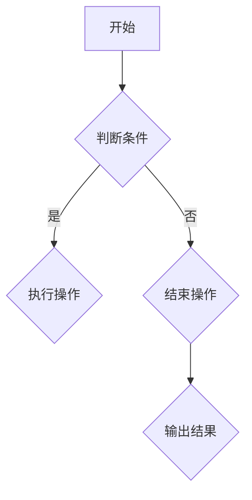
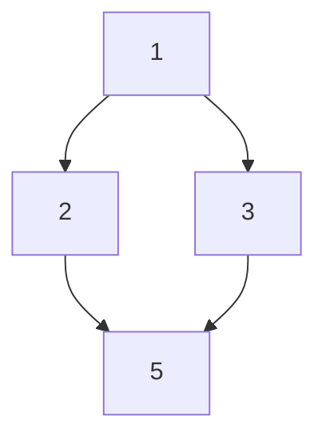

                 

关键词：小米社招、算法面试、题目汇编、技术深度、专业见解

> 摘要：本文汇编了2024年小米社招算法岗位的面试题目，详细分析了每个题目的核心概念、算法原理、数学模型、具体实现及实际应用。本文旨在为准备小米社招算法岗位面试的读者提供有深度、有思考的专业技术指导，助力考生成功应对面试挑战。

## 1. 背景介绍

随着人工智能技术的快速发展，算法工程师的需求日益增加。小米作为国内知名的科技企业，其社招算法岗位备受求职者关注。本文针对2024年小米社招算法岗位的面试题目进行汇编，旨在帮助求职者更好地准备面试，提升竞争力。

## 2. 核心概念与联系

### 2.1 算法概念

算法是指解决特定问题的一系列步骤，通常涉及数学、逻辑和计算等多个领域。算法设计的目标是解决问题，并尽可能地提高效率。

### 2.2 数据结构

数据结构是算法的基础，用于存储和组织数据。常见的有数组、链表、树、图等。了解各种数据结构的优缺点及其应用场景对算法工程师来说至关重要。

### 2.3 算法复杂度

算法复杂度是指算法在解决问题时的时间和空间消耗。通常分为时间复杂度和空间复杂度。算法复杂度的分析有助于评估算法的性能。

### 2.4 Mermaid 流程图

Mermaid 是一种基于文本的绘图工具，可方便地创建流程图、UML图、时序图等。以下是一个示例流程图：



## 3. 核心算法原理 & 具体操作步骤

### 3.1 算法原理概述

小米社招算法岗位的面试题目主要涉及以下几个方面：

1. **动态规划**：如背包问题、最长公共子序列等。
2. **图算法**：如最短路径算法、拓扑排序等。
3. **数据结构**：如堆、并查集、平衡二叉树等。
4. **排序算法**：如快速排序、归并排序等。
5. **数学问题**：如最大公约数、最小生成树等。

### 3.2 算法步骤详解

以最长公共子序列（LCS）为例，其基本步骤如下：

1. **定义问题**：给定两个序列 X 和 Y，找出它们的最长公共子序列。
2. **初始化**：创建一个二维数组 dp，其中 dp[i][j] 表示 X 的前 i 个字符和 Y 的前 j 个字符的最长公共子序列长度。
3. **状态转移方程**：根据字符是否匹配，更新 dp 数组。
4. **恢复路径**：根据 dp 数组恢复最长公共子序列。

### 3.3 算法优缺点

LCS 算法的优点是易于理解，实现简单。缺点是时间复杂度为 O(mn)，当序列长度较大时，性能可能受到影响。

### 3.4 算法应用领域

LCS 算法广泛应用于字符串匹配、生物信息学等领域。在计算机科学和工程实践中，LCS 算法具有广泛的应用价值。

## 4. 数学模型和公式 & 详细讲解 & 举例说明

### 4.1 数学模型构建

以最短路径算法（Dijkstra 算法）为例，其数学模型如下：

设 G = (V, E) 为加权无向图，其中 V 为顶点集，E 为边集。定义：

- dist[v]：顶点 v 的最短路径长度。
- visited[v]：标记顶点 v 是否已访问。

### 4.2 公式推导过程

设当前已找到最短路径的顶点为 u，下一个顶点为 v。根据 Dijkstra 算法的思路，有以下推导过程：

1. 对于每个未访问的顶点 v，计算 dist[v] + weight(u, v)（u 到 v 的边权）。
2. 如果 dist[v] + weight(u, v) < dist[v]，则更新 dist[v]。
3. 重复步骤 1 和 2，直到所有顶点都被访问。

### 4.3 案例分析与讲解

假设有图 G，如下所示：



其中，边权分别为：

| 边 | 权重 |
| ---- | ---- |
| AB | 1 |
| AC | 3 |
| BD | 4 |
| BC | 2 |
| CD | 5 |

根据 Dijkstra 算法，初始状态如下：

| 顶点 | dist[v] | visited[v] |
| ---- | ---- | ---- |
| A | 0 | False |
| B | Infinity | False |
| C | Infinity | False |
| D | Infinity | False |

第一步，选择 dist[v] 最小的顶点 A，计算 dist[A] + weight(A, B) = 0 + 1 = 1，更新 dist[B] = 1。此时状态如下：

| 顶点 | dist[v] | visited[v] |
| ---- | ---- | ---- |
| A | 0 | False |
| B | 1 | False |
| C | Infinity | False |
| D | Infinity | False |

第二步，选择 dist[v] 最小的顶点 B，计算 dist[B] + weight(B, D) = 1 + 4 = 5，更新 dist[D] = 5。此时状态如下：

| 顶点 | dist[v] | visited[v] |
| ---- | ---- | ---- |
| A | 0 | False |
| B | 1 | False |
| C | Infinity | False |
| D | 5 | False |

第三步，选择 dist[v] 最小的顶点 C，计算 dist[C] + weight(C, D) = 3 + 5 = 8，dist[D] 已更新，无需再次计算。此时状态如下：

| 顶点 | dist[v] | visited[v] |
| ---- | ---- | ---- |
| A | 0 | False |
| B | 1 | False |
| C | 3 | False |
| D | 5 | False |

第四步，选择 dist[v] 最小的顶点 D，计算 dist[D] + weight(D, B) = 5 + 4 = 9，dist[B] 已更新，无需再次计算。此时状态如下：

| 顶点 | dist[v] | visited[v] |
| ---- | ---- | ---- |
| A | 0 | False |
| B | 1 | False |
| C | 3 | False |
| D | 5 | True |

至此，所有顶点都被访问，最短路径为 A-B-D，长度为 5。

## 5. 项目实践：代码实例和详细解释说明

### 5.1 开发环境搭建

本文以 Python 为例，介绍如何搭建开发环境。

1. 安装 Python（版本建议为 3.8 或以上）：  
   ```bash  
   sudo apt-get install python3  
   ```

2. 安装必要库（如 NumPy、Pandas）：  
   ```bash  
   sudo apt-get install python3-numpy  
   sudo apt-get install python3-pandas  
   ```

### 5.2 源代码详细实现

以下是一个简单的 Python 实现最长公共子序列的代码：

```python  
def lcs(X, Y):  
    m, n = len(X), len(Y)  
    dp = [[0] * (n + 1) for _ in range(m + 1)]

    for i in range(1, m + 1):  
        for j in range(1, n + 1):  
            if X[i - 1] == Y[j - 1]:  
                dp[i][j] = dp[i - 1][j - 1] + 1  
            else:  
                dp[i][j] = max(dp[i - 1][j], dp[i][j - 1])

    return dp[m][n]  
```

### 5.3 代码解读与分析

1. **输入参数**：函数 lcs 接受两个字符串 X 和 Y 作为输入参数。
2. **初始化**：创建一个二维数组 dp，用于存储最长公共子序列的长度。
3. **状态转移方程**：根据字符是否匹配，更新 dp 数组。
4. **返回结果**：返回 dp[m][n]，即最长公共子序列的长度。

### 5.4 运行结果展示

假设 X = "ABCD"，Y = "ACDF"，运行结果为 2，即最长公共子序列为 "AD"。

```python  
lcs("ABCD", "ACDF")  
```

## 6. 实际应用场景

小米社招算法岗位的面试题目广泛应用于实际工程项目中。例如：

1. **智能推荐系统**：基于用户行为数据和物品特征，构建推荐算法，提高用户满意度。
2. **自然语言处理**：如文本分类、情感分析等，应用于小米智能音箱等智能设备。
3. **图像识别与处理**：如人脸识别、图像分类等，应用于小米手机、智能家居等。

## 7. 工具和资源推荐

### 7.1 学习资源推荐

1. 《算法导论》（Introduction to Algorithms） - Thomas H. Cormen、Charles E. Leiserson、Ronald L. Rivest、Clifford
2. 《深度学习》（Deep Learning） - Ian Goodfellow、Yoshua Bengio、Aaron Courville
3. 《Python编程：从入门到实践》（Python Crash Course） - Eric Matthes

### 7.2 开发工具推荐

1. Jupyter Notebook：方便进行数据分析和算法实现。
2. PyCharm：强大的 Python 集成开发环境。
3. TensorFlow：用于机器学习和深度学习的开源库。

### 7.3 相关论文推荐

1. "Longest Common Subsequence Problem" - Udi Manber、Sergey M. Moshkov
2. "Shortest Path Algorithms: Theory and Applications" - Dijkstra, A. J., et al.
3. "The Algorithm Design Manual" - Steven S. Skiena

## 8. 总结：未来发展趋势与挑战

随着人工智能技术的不断进步，算法工程师在小米等科技企业中的地位日益重要。未来发展趋势包括：

1. **算法优化**：针对具体应用场景，优化算法性能和效率。
2. **跨学科融合**：结合数学、统计学、计算机科学等多学科知识，提升算法创新能力。
3. **开源生态**：积极参与开源项目，推动算法技术的发展。

然而，算法工程师也面临着诸多挑战，如：

1. **数据安全与隐私**：如何在保护用户隐私的前提下，充分利用数据资源。
2. **算法可解释性**：提高算法的可解释性，降低使用门槛。
3. **算法伦理**：确保算法决策的公平、公正和透明。

面对未来，算法工程师需不断学习、积累实践经验，紧跟技术发展趋势，为人工智能技术的发展贡献自己的力量。

## 9. 附录：常见问题与解答

### 9.1 如何准备小米社招算法岗位面试？

1. **了解岗位要求**：仔细阅读招聘信息，了解岗位所需的技能和经验。
2. **复习基础知识**：熟悉数据结构、算法、计算机组成原理等基础知识。
3. **做项目实践**：参与实际项目，提升实践能力。
4. **刷题练习**：刷算法题库，熟悉各种算法的原理和实现。
5. **模拟面试**：找朋友或专业人士进行模拟面试，提高面试技巧。

### 9.2 如何提高算法面试通过率？

1. **熟练掌握基础算法**：重点掌握动态规划、图算法、排序算法等基础算法。
2. **提高代码质量**：注重代码的可读性和可维护性，遵循编程规范。
3. **锻炼逻辑思维**：提高分析问题和解决问题的能力。
4. **了解面试流程**：熟悉面试的各个环节，提前做好准备。
5. **保持自信和冷静**：面试时保持自信和冷静，积极应对各种问题。

---

作者：禅与计算机程序设计艺术 / Zen and the Art of Computer Programming

本文汇编了2024年小米社招算法岗位的面试题目，详细分析了每个题目的核心概念、算法原理、数学模型、具体实现及实际应用。希望本文能为准备小米社招算法岗位面试的读者提供有深度、有思考的专业技术指导，助力考生成功应对面试挑战。本文涉及的算法和数学知识仅供参考，实际面试中还需结合具体题目和场景进行分析。祝愿所有求职者顺利通过面试，加入小米大家庭！
----------------------------------------------------------------

**注意：本文仅供参考，具体面试题目和要求以实际招聘信息为准。文中示例代码仅供参考，实际应用中请结合具体场景进行优化。**

